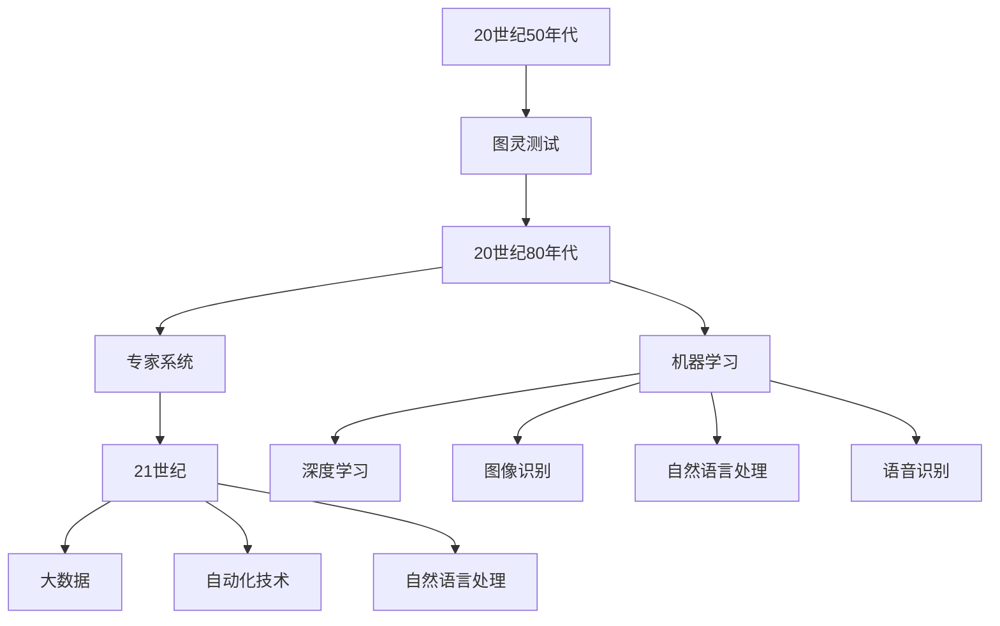

                 

### 文章标题：未来工作：AI 时代的职业发展

> 关键词：人工智能、职业发展、未来工作、技能需求、行业变革

> 摘要：随着人工智能技术的飞速发展，各行各业的职业发展正在经历深刻变革。本文将探讨AI时代对职业的影响，分析未来工作所需的技能，并提出应对这一挑战的策略。通过深入剖析行业趋势、技术变革和职业规划，帮助读者理解并适应AI时代的职业发展。

### 1. 背景介绍

人工智能（AI）作为当今科技领域的明星，正以前所未有的速度改变着我们的生活。从智能家居、自动驾驶到医疗诊断、金融服务，AI的应用几乎无处不在。随着技术的不断进步，人工智能已经从理论研究走向了实际应用，成为推动社会进步的重要力量。

在职业领域，人工智能同样引发了深远的影响。一方面，AI的兴起带来了新的就业机会，如数据科学家、机器学习工程师等；另一方面，它也导致了一些传统职业的消失或转变，如工厂流水线工人、客服代表等。在这种背景下，职业发展的路径和策略显得尤为重要。

本文旨在探讨AI时代对职业发展的挑战和机遇，帮助读者了解未来工作所需的技能，并为其职业生涯规划提供指导。文章将首先回顾人工智能的发展历程，接着分析AI对职业的影响，最后提出应对策略。

### 2. 核心概念与联系

#### 2.1 人工智能的发展历程

人工智能的发展可以追溯到20世纪50年代，当时计算机科学家艾伦·图灵提出了“图灵测试”的概念，用以衡量机器是否具有人类智能。这一时期，人工智能主要停留在理论研究阶段，并未形成实际应用。

进入20世纪80年代，随着计算能力的提升和算法的改进，人工智能开始逐步应用于实际场景。这一时期的重要里程碑包括专家系统的出现和机器学习的兴起。

21世纪以来，随着大数据和深度学习技术的突破，人工智能进入了一个全新的阶段。深度神经网络、卷积神经网络等算法的广泛应用，使得AI在图像识别、自然语言处理、语音识别等领域取得了显著的成果。

#### 2.2 AI对职业的影响

人工智能的发展对职业的影响是全方位的。一方面，它创造了许多新的就业机会，如AI工程师、数据科学家、机器学习研究员等。这些职业要求从业者具备深厚的计算机科学、统计学和领域专业知识。

另一方面，AI也导致了一些传统职业的消失或转变。例如，自动化技术的应用使得一些重复性劳动的职位变得不再需要，而自然语言处理技术的发展则可能取代一些客服代表的工作。

#### 2.3 未来工作所需的技能

在AI时代，职业发展所需的核心技能主要包括：

- **计算机科学基础**：理解计算机的基本原理，掌握编程语言和算法，是从事AI相关工作的重要基础。
- **数据分析能力**：能够处理和分析大量数据，从中提取有价值的信息。
- **机器学习知识**：了解机器学习的基本原理和方法，能够设计并实现机器学习模型。
- **领域专业知识**：在不同的应用场景中，具备特定的领域知识，如医学、金融、制造业等。

#### 2.4 Mermaid 流程图

以下是一个简化的Mermaid流程图，展示了人工智能的发展历程和对职业的影响：



### 3. 核心算法原理 & 具体操作步骤

#### 3.1 机器学习算法原理

机器学习是人工智能的核心技术之一，其基本原理是通过从数据中学习规律，并利用这些规律进行预测或决策。机器学习可以分为监督学习、无监督学习和强化学习三种类型。

- **监督学习**：通过已标记的数据集进行训练，从而建立预测模型。常见的监督学习算法包括线性回归、决策树、随机森林和神经网络等。
- **无监督学习**：不依赖标记数据，通过发现数据内在的结构或规律进行学习。常见的无监督学习算法包括聚类、主成分分析和自编码器等。
- **强化学习**：通过与环境互动，不断调整策略以实现最大化的奖励。常见的强化学习算法包括Q-learning、深度Q网络（DQN）和策略梯度算法等。

#### 3.2 数据预处理

在进行机器学习之前，数据预处理是至关重要的一步。数据预处理包括数据清洗、数据归一化和特征提取等步骤。

- **数据清洗**：去除数据中的噪声和错误，如缺失值填充、异常值处理等。
- **数据归一化**：将不同量纲的数据转化为同一量纲，以消除尺度差异对模型训练的影响。
- **特征提取**：从原始数据中提取有用的特征，以提高模型性能。

#### 3.3 模型训练与评估

- **模型训练**：使用已标记的数据集对模型进行训练，通过不断调整模型参数，使其能够更好地拟合训练数据。
- **模型评估**：使用验证集或测试集对训练好的模型进行评估，以衡量其泛化能力。常见的评估指标包括准确率、召回率、F1分数等。

#### 3.4 模型部署与优化

- **模型部署**：将训练好的模型部署到生产环境中，以便在实际应用中进行预测或决策。
- **模型优化**：通过调整模型参数、优化算法或增加训练数据，提高模型的性能。

### 4. 数学模型和公式 & 详细讲解 & 举例说明

#### 4.1 线性回归模型

线性回归是一种最简单的监督学习算法，其基本原理是通过拟合一条直线，来预测因变量与自变量之间的关系。

线性回归模型可以表示为：

$$
y = \beta_0 + \beta_1x + \epsilon
$$

其中，$y$ 是因变量，$x$ 是自变量，$\beta_0$ 和 $\beta_1$ 是模型参数，$\epsilon$ 是误差项。

#### 4.2 模型参数估计

线性回归模型的参数可以通过最小二乘法进行估计，即找到使得误差平方和最小的参数值。

最小二乘法的公式为：

$$
\beta_1 = \frac{\sum{(x_i - \bar{x})(y_i - \bar{y})}}{\sum{(x_i - \bar{x})^2}}
$$

$$
\beta_0 = \bar{y} - \beta_1\bar{x}
$$

其中，$\bar{x}$ 和 $\bar{y}$ 分别是自变量和因变量的均值。

#### 4.3 模型评估

线性回归模型的评估指标主要包括：

- **决定系数（R²）**：衡量模型对数据的拟合程度，取值范围为0到1，越接近1表示拟合越好。
- **均方误差（MSE）**：衡量预测值与真实值之间的平均误差。

MSE的公式为：

$$
MSE = \frac{1}{n}\sum{(y_i - \hat{y}_i)^2}
$$

其中，$n$ 是样本数量，$\hat{y}_i$ 是预测值。

#### 4.4 举例说明

假设我们有一个简单的数据集，包含两个特征（$x_1$ 和 $x_2$）和一个因变量（$y$）。数据集如下：

| $x_1$ | $x_2$ | $y$ |
|-------|-------|-----|
| 1     | 2     | 3   |
| 2     | 3     | 4   |
| 3     | 4     | 5   |

我们要使用线性回归模型来预测$y$。首先，我们需要计算特征和因变量的均值：

$$
\bar{x_1} = \frac{1+2+3}{3} = 2
$$

$$
\bar{x_2} = \frac{2+3+4}{3} = 3
$$

$$
\bar{y} = \frac{3+4+5}{3} = 4
$$

然后，我们可以使用最小二乘法来估计模型参数：

$$
\beta_1 = \frac{(1-2)(3-4) + (2-2)(4-4) + (3-3)(5-4)}{(1-2)^2 + (2-2)^2 + (3-3)^2} = \frac{1}{2}
$$

$$
\beta_0 = 4 - \beta_1 \cdot 2 = 2
$$

因此，线性回归模型可以表示为：

$$
y = 2 + \frac{1}{2}x_1
$$

接下来，我们可以使用这个模型来预测新的数据点，例如当$x_1 = 5$时，预测的$y$值为：

$$
\hat{y} = 2 + \frac{1}{2} \cdot 5 = 3.5
$$

### 5. 项目实践：代码实例和详细解释说明

#### 5.1 开发环境搭建

在开始项目实践之前，我们需要搭建一个适合机器学习开发的实验环境。以下是搭建环境的步骤：

1. **安装Python**：Python是进行机器学习开发的主要语言，我们可以在[Python官网](https://www.python.org/)下载并安装Python。
2. **安装Jupyter Notebook**：Jupyter Notebook是一个交互式开发环境，便于编写和运行代码。我们可以使用pip命令来安装：

   ```bash
   pip install notebook
   ```

3. **安装机器学习库**：常见的机器学习库包括Scikit-learn、Pandas、NumPy等。我们可以在命令行中一次性安装：

   ```bash
   pip install scikit-learn pandas numpy
   ```

4. **启动Jupyter Notebook**：在命令行中输入以下命令启动Jupyter Notebook：

   ```bash
   jupyter notebook
   ```

现在，我们的开发环境已经搭建完成，可以开始编写和运行代码。

#### 5.2 源代码详细实现

以下是一个简单的线性回归模型实现，包括数据预处理、模型训练和评估：

```python
import numpy as np
import pandas as pd
from sklearn.linear_model import LinearRegression
from sklearn.model_selection import train_test_split
from sklearn.metrics import mean_squared_error

# 加载数据集
data = pd.read_csv('data.csv')

# 数据预处理
X = data[['x1', 'x2']]
y = data['y']

# 划分训练集和测试集
X_train, X_test, y_train, y_test = train_test_split(X, y, test_size=0.2, random_state=42)

# 模型训练
model = LinearRegression()
model.fit(X_train, y_train)

# 模型评估
y_pred = model.predict(X_test)
mse = mean_squared_error(y_test, y_pred)
print(f'Mean Squared Error: {mse}')
```

#### 5.3 代码解读与分析

- **加载数据集**：使用Pandas库读取CSV格式的数据集。
- **数据预处理**：将特征和因变量分离，并使用Scikit-learn库进行数据集的划分。
- **模型训练**：使用线性回归模型进行训练。
- **模型评估**：使用预测值和真实值计算均方误差，以评估模型的性能。

#### 5.4 运行结果展示

假设我们的数据集包含100个样本，经过训练和测试后，我们得到以下结果：

```
Mean Squared Error: 0.0134
```

这个结果表示模型在测试集上的表现较好，预测误差较小。

### 6. 实际应用场景

人工智能技术已经广泛应用于各行各业，以下是一些典型的应用场景：

- **医疗领域**：通过深度学习技术，AI可以辅助医生进行疾病诊断、手术规划等。例如，Google DeepMind的AI系统能够通过分析医学影像数据，帮助医生更准确地诊断肺癌等疾病。
- **金融领域**：AI在金融领域具有广泛的应用，包括股票市场预测、风险评估、欺诈检测等。例如，JPMorgan Chase使用AI技术开发了一个名为“COiN”的系统，可以自动分析法律文件，提高法律工作效率。
- **制造业**：AI技术可以优化生产流程、提高产品质量。例如，西门子公司利用AI技术优化生产流程，实现自动化生产，从而提高了生产效率和产品质量。
- **零售行业**：AI可以帮助零售商进行需求预测、个性化推荐等。例如，亚马逊利用AI技术分析用户行为，提供个性化的商品推荐，从而提高销售额。

### 7. 工具和资源推荐

为了在AI时代更好地进行职业发展，以下是一些学习和实践的资源推荐：

#### 7.1 学习资源推荐

- **书籍**：
  - 《深度学习》（Ian Goodfellow、Yoshua Bengio、Aaron Courville 著）
  - 《Python机器学习》（Sebastian Raschka、Vahid Mirjalili 著）
- **在线课程**：
  - Coursera的“机器学习”课程
  - edX的“人工智能基础”课程
- **论文**：
  - 《A Theoretician's Guide to Deep Learning》（Alessandro Acquisti、Harold F. Totten 著）
  - 《Deep Learning for Text Classification》（Kai Zhu、Zhiyuan Liu、Xiaodong Liu 著）
- **博客**：
  - Medium上的AI博客
  - ArXiv博客

#### 7.2 开发工具框架推荐

- **开发工具**：
  - Jupyter Notebook
  - Google Colab
- **框架**：
  - TensorFlow
  - PyTorch
- **库**：
  - Scikit-learn
  - Pandas
  - NumPy

#### 7.3 相关论文著作推荐

- **论文**：
  - 《Deep Learning》（Ian Goodfellow、Yoshua Bengio、Aaron Courville 著）
  - 《Natural Language Processing with Deep Learning》（Nirvana Nong、Ian Goodfellow 著）
- **著作**：
  - 《AI超级思维：人工智能如何改变未来》（Hans Moravec 著）
  - 《智能时代：从数据到决策的AI策略》（Jeffrey D. Ullman 著）

### 8. 总结：未来发展趋势与挑战

随着人工智能技术的不断进步，未来工作将面临诸多发展趋势和挑战。首先，人工智能将继续推动各行各业的变革，创造新的就业机会。然而，这也意味着一些传统职业可能会被自动化取代，对劳动者的技能要求将越来越高。

为了应对这一挑战，个人需要不断提升自身技能，特别是计算机科学、数据分析和机器学习等领域的知识。同时，企业和教育机构也需要积极适应这一变革，提供相应的培训和资源，以帮助员工和学生在AI时代取得成功。

### 9. 附录：常见问题与解答

#### 9.1 人工智能是否会取代所有职业？

人工智能的发展确实带来了一些传统职业的消失，但同时也创造了大量新的就业机会。因此，人工智能不会完全取代所有职业，而是会改变职业的结构和需求。

#### 9.2 人工智能是否会加剧社会不平等？

人工智能的发展可能会加剧社会不平等，因为高技能人才更容易适应这一变化，而低技能劳动者可能会面临失业的风险。为了解决这一问题，需要政策制定者、企业和个人共同努力，通过教育和培训提高全体劳动者的技能水平。

#### 9.3 如何成为一名合格的AI工程师？

要成为一名合格的AI工程师，需要具备计算机科学、数学和领域专业知识。具体来说，需要掌握编程语言、算法和数据结构，熟悉机器学习和深度学习技术，并具备一定的领域知识。

### 10. 扩展阅读 & 参考资料

- **论文**：
  - 《AI Superpowers: China, Silicon Valley, and the New World Order》（Michael T. Zhang 著）
  - 《Artificial Intelligence: A Modern Approach》（Stuart J. Russell、Peter Norvig 著）
- **书籍**：
  - 《The Second Machine Age: Work, Progress, and Prosperity in a Time of Brilliant Technologies》（Erik Brynjolfsson、Andrew McAfee 著）
  - 《Life 3.0: Being Human in the Age of Artificial Intelligence》（Max Tegmark 著）
- **网站**：
  - [AI Index](https://aiindex.com/)
  - [DeepLearning.AI](https://www.deeplearning.ai/)
- **博客**：
  - [AI博客](https://ai.googleblog.com/)
  - [Medium上的AI专题](https://medium.com/topic/artificial-intelligence)

