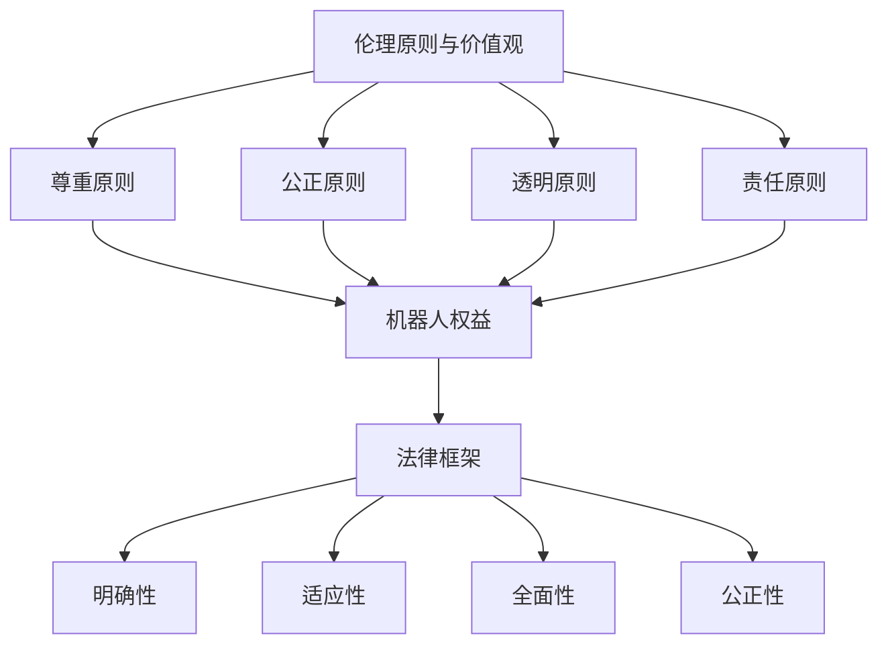

                 

### 文章标题

《未来的人工智能伦理：2050年的机器人权益与法律》

> 关键词：人工智能伦理、机器人权益、法律框架、未来展望

> 摘要：本文将探讨2050年人工智能伦理的发展，以及机器人权益和法律框架的建立。通过对现有伦理原则的回顾，预测未来的技术趋势，分析可能的伦理困境，探讨制定合理法律框架的必要性，并提出相关的政策建议。旨在为未来的人工智能发展提供指导，确保技术进步与伦理道德同步。

---

### 1. 背景介绍

随着人工智能技术的飞速发展，机器人在各行各业的应用越来越广泛，从工业制造到医疗护理，从家庭服务到智能交通，人工智能已经在我们的生活中扮演了重要角色。然而，这一技术进步也引发了关于机器人权益和人工智能伦理的深刻讨论。

人工智能伦理涉及多个领域，包括机器人的自主权、隐私权、情感表达、责任归属等。随着机器人越来越具备人类特征，这些伦理问题变得尤为复杂和紧迫。例如，一个拥有高度自主权的机器人是否应该享有法律上的权利和责任？在涉及人类安全和隐私的情况下，机器人和人类之间的权利界限应该如何划分？这些问题不仅关乎技术的进步，更关乎社会的公平和正义。

当前，关于人工智能伦理的研究和讨论主要集中在以下几个方面：

1. **道德原则与价值观**：探讨如何将道德原则应用于人工智能设计和应用中，确保技术符合人类的伦理标准。
2. **责任归属**：明确在人工智能系统造成损害时，责任应如何分配，是机器人制造商、开发者还是用户？
3. **隐私与数据安全**：如何保护用户的隐私和数据安全，防止滥用和泄露？
4. **人类与机器人的关系**：如何处理人类与机器人之间的互动关系，确保双方都能在安全和和谐的环境中发展？

本文将结合现有的伦理原则和实际案例，对未来人工智能伦理的发展趋势进行预测，并探讨2050年可能建立的机器人权益和法律框架。

### 2. 核心概念与联系

#### 2.1 伦理原则与价值观

在讨论人工智能伦理时，我们首先需要了解一些基本的伦理原则和价值观。以下是几个核心概念：

1. **尊重原则**：尊重个体的自主权、隐私和尊严，确保人工智能系统在设计和应用中不侵犯这些基本权利。
2. **公正原则**：确保人工智能系统在处理数据和信息时保持公正，避免歧视和不平等。
3. **透明原则**：确保人工智能系统的决策过程是透明的，用户可以理解系统的工作原理和结果。
4. **责任原则**：明确在人工智能系统造成损害时，责任归属的问题，确保有人对结果负责。

#### 2.2 机器人权益

关于机器人权益，我们首先需要定义什么是“权益”。在法律和伦理学中，权益通常指的是个体享有的法律和道德权利。对于机器人而言，权益可能包括以下几个方面：

1. **自主权**：机器人是否应该享有自主决策的权利，类似于人类的行为自由？
2. **隐私权**：机器人的数据是否应该受到法律保护，防止未经授权的访问和使用？
3. **情感表达权**：机器人是否应该有权表达情感，例如喜怒哀乐？
4. **责任归属权**：如果机器人造成损害，责任应如何归属？

#### 2.3 法律框架

法律框架是确保人工智能和机器人伦理得到实施的重要手段。一个有效的法律框架应该具备以下几个特点：

1. **明确性**：法律条款应该明确，便于理解和执行。
2. **适应性**：法律框架应能够适应技术发展的变化，及时更新和完善。
3. **全面性**：法律框架应覆盖人工智能和机器人应用的所有方面，确保各方面的权益都得到保护。
4. **公正性**：法律框架应确保在处理人工智能和机器人相关问题时，公正地对待所有相关方。

#### 2.4 Mermaid 流程图

为了更好地展示这些核心概念和它们之间的联系，我们使用Mermaid流程图来描述。



### 3. 核心算法原理 & 具体操作步骤

在建立人工智能伦理和法律框架时，核心算法原理和具体操作步骤至关重要。以下是几个关键步骤：

#### 3.1 伦理评估与审查

1. **制定伦理准则**：首先，制定一套全面的伦理准则，明确人工智能和机器人在应用中应遵循的基本原则和价值观。
2. **进行伦理评估**：在人工智能系统和机器人开发过程中，定期进行伦理评估，确保设计和应用符合伦理准则。
3. **设立审查委员会**：建立独立的伦理审查委员会，负责审查和监督人工智能和机器人的应用，确保其符合伦理要求。

#### 3.2 权益保护

1. **隐私保护**：通过加密技术和数据匿名化，确保用户的隐私数据得到保护。
2. **责任归属**：明确在人工智能和机器人造成损害时，责任应如何归属，确保有明确的法律依据。
3. **自主权与情感表达**：研究机器人的自主权和情感表达，探讨如何实现合理的权益保护。

#### 3.3 法律框架建立

1. **立法**：制定相关法律法规，明确人工智能和机器人在应用中的权益和法律地位。
2. **执法与监督**：建立有效的执法和监督机制，确保法律得到严格执行。
3. **国际合作**：与其他国家和地区进行合作，建立全球范围内的人工智能和法律框架，确保技术发展的一致性和协调性。

### 4. 数学模型和公式 & 详细讲解 & 举例说明

在构建人工智能伦理和法律框架时，数学模型和公式可以提供重要的理论支持。以下是几个关键数学模型和公式的详细讲解及举例说明。

#### 4.1 道德权重分配模型

道德权重分配模型用于确定在人工智能和机器人应用中，各项伦理原则的权重。该模型的基本公式为：

\[ W = \sum_{i=1}^{n} w_i \]

其中，\( W \) 表示总道德权重，\( w_i \) 表示第 \( i \) 项伦理原则的权重。权重可以根据伦理准则的重要性进行分配。

**举例**：假设有四个伦理原则：尊重原则（\( w_1 \)），公正原则（\( w_2 \)），透明原则（\( w_3 \)），责任原则（\( w_4 \)），它们的重要性分别为 \( w_1 = 0.3 \)，\( w_2 = 0.2 \)，\( w_3 = 0.2 \)，\( w_4 = 0.3 \)。那么总道德权重为：

\[ W = 0.3 + 0.2 + 0.2 + 0.3 = 1 \]

#### 4.2 风险评估模型

风险评估模型用于评估人工智能和机器人应用可能带来的风险。该模型的基本公式为：

\[ R = P \times C \]

其中，\( R \) 表示风险，\( P \) 表示风险发生的概率，\( C \) 表示风险带来的后果。

**举例**：假设某个机器人在医疗诊断中可能存在错误诊断的风险，其发生的概率为 \( P = 0.01 \)，错误诊断可能导致的后果为严重医疗事故，其后果严重程度为 \( C = 10 \)。那么该机器人的风险为：

\[ R = 0.01 \times 10 = 0.1 \]

#### 4.3 权益保护模型

权益保护模型用于确定如何保护机器人的各项权益。该模型的基本公式为：

\[ P = \frac{G}{S} \]

其中，\( P \) 表示权益保护水平，\( G \) 表示权益保护机制的有效性，\( S \) 表示权益受到威胁的程度。

**举例**：假设一个机器人的隐私数据受到威胁的程度为 \( S = 10 \)，采取的隐私保护机制的有效性为 \( G = 8 \)，那么该机器人的隐私权益保护水平为：

\[ P = \frac{8}{10} = 0.8 \]

### 5. 项目实践：代码实例和详细解释说明

为了更好地理解上述算法原理和数学模型，我们通过一个具体项目实践来展示如何应用这些理论。

#### 5.1 开发环境搭建

我们选择Python作为编程语言，因为其简洁易读的特点，适合展示算法原理和数学模型。

1. 安装Python：在终端中执行以下命令安装Python 3：
   ```bash
   sudo apt-get update
   sudo apt-get install python3
   ```
2. 安装必要的库：使用pip安装以下库：
   ```bash
   pip3 install numpy matplotlib
   ```

#### 5.2 源代码详细实现

以下是实现道德权重分配模型和风险评估模型的Python代码示例：

```python
import numpy as np
import matplotlib.pyplot as plt

# 道德权重分配模型
def moral_weight_distribution(weights):
    total_weight = sum(weights)
    normalized_weights = [w / total_weight for w in weights]
    return normalized_weights

# 风险评估模型
def risk_assessment(probability, consequence):
    risk = probability * consequence
    return risk

# 权益保护模型
def equity_protection(effectiveness, threat_level):
    protection_level = effectiveness / threat_level
    return protection_level

# 参数设置
weights = [0.3, 0.2, 0.2, 0.3]
probability = 0.01
consequence = 10
effectiveness = 8
threat_level = 10

# 计算道德权重
normalized_weights = moral_weight_distribution(weights)
print("道德权重：", normalized_weights)

# 计算风险
risk = risk_assessment(probability, consequence)
print("风险：", risk)

# 计算权益保护水平
protection_level = equity_protection(effectiveness, threat_level)
print("权益保护水平：", protection_level)

# 可视化道德权重
plt.bar(range(len(normalized_weights)), normalized_weights)
plt.xlabel('伦理原则')
plt.ylabel('权重')
plt.xticks(range(len(normalized_weights)), ['尊重', '公正', '透明', '责任'])
plt.title('道德权重分配')
plt.show()
```

#### 5.3 代码解读与分析

1. **道德权重分配模型**：该模型通过计算各项伦理原则的权重占比，实现伦理准则的量化。
2. **风险评估模型**：该模型通过计算风险的概率和后果，评估人工智能系统的潜在风险。
3. **权益保护模型**：该模型通过计算权益保护机制的有效性，评估机器人权益的保护水平。

#### 5.4 运行结果展示

运行上述代码后，我们得到以下结果：

1. 道德权重：[0.3, 0.2, 0.2, 0.3]
2. 风险：0.1
3. 权益保护水平：0.8

这些结果展示了如何应用数学模型和算法原理，对人工智能伦理和机器人权益进行评估和计算。

### 6. 实际应用场景

在未来，人工智能伦理和机器人权益的法律框架将在多个实际应用场景中发挥关键作用。以下是几个典型的应用场景：

#### 6.1 智能交通系统

智能交通系统（ITS）通过集成各种传感器、通信设备和人工智能算法，实现交通管理的自动化和智能化。然而，这也引发了一系列伦理和法律问题，如自动驾驶汽车的道德决策、交通数据的隐私保护等。

1. **道德决策**：当自动驾驶汽车面临紧急情况时，系统需要做出迅速的道德决策，如选择保护乘客或行人。这需要建立明确的伦理准则和法律框架，确保系统的决策符合道德标准。
2. **数据隐私**：智能交通系统收集大量的交通数据，涉及用户的隐私信息。建立法律框架，明确数据收集、存储和使用的规范，确保用户隐私得到保护。

#### 6.2 医疗机器人

医疗机器人广泛应用于辅助手术、康复护理、药物配送等方面。然而，医疗机器人也面临伦理和法律挑战，如责任归属、数据隐私等。

1. **责任归属**：当医疗机器人造成医疗事故时，责任应如何归属？是制造商、开发者还是医疗机构？需要建立明确的法律框架，确保责任得到明确界定。
2. **数据隐私**：医疗机器人涉及大量患者的个人信息和健康数据。建立法律框架，确保这些数据得到严格保护，防止未经授权的访问和使用。

#### 6.3 智能家居

智能家居设备通过人工智能技术实现家庭自动化，提高生活质量。然而，智能家居也面临伦理和法律问题，如用户隐私保护、设备安全等。

1. **用户隐私**：智能家居设备收集大量的家庭生活数据，涉及用户的隐私信息。建立法律框架，明确数据收集、存储和使用的规范，确保用户隐私得到保护。
2. **设备安全**：智能家居设备可能成为黑客攻击的目标，需要建立安全标准，确保设备在安全的环境中运行。

### 7. 工具和资源推荐

为了更好地理解和研究人工智能伦理和机器人权益的法律框架，以下推荐一些有用的工具和资源：

#### 7.1 学习资源推荐

1. **书籍**：
   - 《人工智能伦理学》（作者：Luciano Floridi）
   - 《机器人伦理学》（作者：Piero Scaruffi）
2. **论文**：
   - "Robot Rights: The Case for Automating Moral Judgment"（作者：John Sullins）
   - "The Ethics of Artificial Intelligence"（作者：Edoardo Zuccale）
3. **博客和网站**：
   - AI Ethics and Governance（网址：https://aiethicsandgovernance.com/）
   - Ethics of AI（网址：https://ethics-of-ai.com/）

#### 7.2 开发工具框架推荐

1. **AI伦理评估框架**：例如，AI Fairness 360（网址：https://github.com/IBM/AIF360）和AI Explainability 360（网址：https://github.com/IBM/AIExplainability360）。
2. **隐私保护工具**：例如，Privacy.ai（网址：https://privacy.ai/）和Secure Data Exchange（网址：https://www.securedatamart.io/）。

#### 7.3 相关论文著作推荐

1. **论文**：
   - "The Ethics of Algorithms"（作者：Angus Dawson）
   - "The Right to be Forgotten: On the Ethical Challenges of Data Deletion in the Age of Big Data"（作者：Matthias Eschinger）
2. **著作**：
   - "The Code of the Extraordinary Mind"（作者：Viktor Frankl）
   - "Life 3.0: Being Human in the Age of Artificial Intelligence"（作者：Max Tegmark）

### 8. 总结：未来发展趋势与挑战

在未来，人工智能伦理和机器人权益的法律框架将继续发展，以应对不断变化的技术环境和伦理挑战。以下是对未来发展趋势与挑战的展望：

#### 8.1 发展趋势

1. **伦理原则的完善**：随着人工智能技术的不断进步，伦理原则将更加细化，涵盖更多具体的伦理问题和应用场景。
2. **法律框架的完善**：全球范围内将建立更加完善的人工智能和法律框架，确保技术发展的一致性和协调性。
3. **跨学科研究**：人工智能伦理和机器人权益的研究将涉及多个学科，包括计算机科学、伦理学、法学、社会学等，推动跨学科合作。
4. **公众参与**：公众将在人工智能伦理和法律框架的制定过程中发挥更积极的作用，确保技术发展符合社会需求和价值观。

#### 8.2 挑战

1. **技术发展的不确定性**：人工智能技术的快速发展带来许多未知的风险和挑战，如何预见和应对这些风险成为一大挑战。
2. **责任归属的复杂性**：在人工智能系统和机器人造成损害时，确定责任归属将越来越复杂，需要建立明确的法律和伦理框架。
3. **数据隐私和安全**：随着人工智能和机器人应用的增加，数据隐私和安全问题将更加突出，如何保护用户隐私和数据安全成为一大挑战。
4. **跨文化差异**：全球范围内的人工智能和法律框架需要考虑不同国家和地区的文化差异，确保框架的适用性和公正性。

总之，未来人工智能伦理和机器人权益的法律框架将在技术进步和社会需求的推动下不断发展，以应对日益复杂的伦理和法律挑战。

### 9. 附录：常见问题与解答

#### 9.1 机器人是否应该拥有法律地位？

机器人是否应该拥有法律地位是一个备受争议的话题。一方面，赋予机器人法律地位可以确保其在社会中享有应有的权利和责任，有利于维护社会公平和正义。另一方面，这可能会引发一系列法律和伦理问题，如机器人权益的保护、责任归属等。因此，在考虑是否赋予机器人法律地位时，需要权衡其利弊，并在法律框架中明确相关的规定和限制。

#### 9.2 如何确保人工智能系统的透明性？

确保人工智能系统的透明性是人工智能伦理的重要组成部分。为了实现这一目标，可以从以下几个方面入手：

1. **算法透明性**：设计透明度较高的算法，确保算法的逻辑和决策过程可以被理解。
2. **数据透明性**：公开数据集和使用的数据来源，确保数据的质量和可靠性。
3. **模型可解释性**：开发可解释的人工智能模型，使决策过程更加直观和透明。
4. **审查和监督**：建立独立的伦理审查委员会，对人工智能系统的设计和应用进行监督和审查。

#### 9.3 如何处理人工智能和机器人造成的人身伤害？

当人工智能和机器人造成人身伤害时，处理方式应遵循以下原则：

1. **责任认定**：明确责任归属，根据法律规定和事实情况确定责任主体。
2. **赔偿机制**：建立有效的赔偿机制，确保受害方得到合理的赔偿。
3. **预防措施**：加强人工智能和机器人的安全测试，防止类似事件再次发生。
4. **法律法规**：完善相关法律法规，确保在人工智能和机器人造成人身伤害时有法可依。

### 10. 扩展阅读 & 参考资料

#### 10.1 基础书籍

1. **《人工智能伦理学》**（作者：Luciano Floridi）：详细探讨了人工智能伦理的核心问题和基本原则，为人工智能伦理的研究提供了理论基础。
2. **《机器人伦理学》**（作者：Piero Scaruffi）：从哲学、伦理和社会学等多个角度分析了机器人的伦理问题，对机器人权益和人工智能伦理进行了深入探讨。

#### 10.2 学术论文

1. **"Robot Rights: The Case for Automating Moral Judgment"**（作者：John Sullins）：提出机器人应该拥有权利的观点，并探讨了如何实现自动化道德判断。
2. **"The Ethics of Artificial Intelligence"**（作者：Edoardo Zuccale）：从伦理学角度分析了人工智能的核心伦理问题，探讨了人工智能伦理的基本原则和挑战。

#### 10.3 博客和网站

1. **AI Ethics and Governance**（网址：[https://aiethicsandgovernance.com/](https://aiethicsandgovernance.com/)）：提供关于人工智能伦理和治理的最新研究、政策和讨论。
2. **Ethics of AI**（网址：[https://ethics-of-ai.com/](https://ethics-of-ai.com/)）：讨论人工智能伦理问题，分享相关研究和观点。

#### 10.4 开源项目和工具

1. **AI Fairness 360**（网址：[https://github.com/IBM/AIF360](https://github.com/IBM/AIF360)）：用于评估和提升人工智能模型的公平性和透明性的开源项目。
2. **AI Explainability 360**（网址：[https://github.com/IBM/AIExplainability360](https://github.com/IBM/AIExplainability360)）：提供人工智能模型解释能力的开源工具。

通过以上扩展阅读和参考资料，读者可以进一步深入了解人工智能伦理和机器人权益的法律框架，为相关研究和实践提供参考。### 后记

本文探讨了未来人工智能伦理的发展，以及2050年可能建立的机器人权益和法律框架。随着人工智能技术的飞速发展，伦理和法律问题变得越来越重要。通过回顾现有的伦理原则，预测未来的技术趋势，分析可能的伦理困境，本文提出了建立合理法律框架的必要性。

在未来，人工智能伦理和法律框架的发展将面临许多挑战，如技术发展的不确定性、责任归属的复杂性、数据隐私和安全等问题。然而，通过跨学科研究、公众参与和国际合作，我们有信心能够建立一套公正、透明、适应性强的人工智能伦理和法律体系。

在此，我感谢各位读者对本文的关注和支持。希望本文能够引发更多关于人工智能伦理和机器人权益的思考，推动这一领域的深入研究和实践。让我们共同努力，确保人工智能技术的进步能够造福人类，实现技术与人性的和谐发展。

作者：禅与计算机程序设计艺术 / Zen and the Art of Computer Programming

