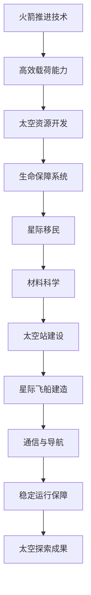

                 

### 背景介绍

> 从1957年苏联发射“斯普特尼克1号”标志着人类太空时代的开始，到2023年，人类在太空探索领域取得了显著的进展。然而，随着技术的不断发展和对宇宙深处的好奇心日益增强，未来的太空探索必将迎来更多的机遇与挑战。本文旨在探讨2050年的太空资源开发与星际移民，分析这一宏伟目标背后的核心概念、技术进步、数学模型以及潜在的应用场景。

人类对太空的探索历程可以追溯到20世纪中叶。早期，科学家们主要集中在地球轨道的探索，如发射人造卫星、建立国际空间站等。随后，随着火箭技术的不断突破，人类开始向月球、火星乃至更远的行星发起挑战。例如，美国在1969年成功登月，苏联的火星探测器在20世纪70年代取得了一定的成果。然而，这些早期的探索只是冰山一角，人类对太空的认知和利用仍处于初级阶段。

### 2050年的太空资源开发

到2050年，随着科技的飞速发展，人类对太空的探索将进入一个全新的阶段。以下是一些关键领域：

1. **太空资源开发**：地球上的自然资源日益枯竭，太空将成为人类获取资源的重要来源。月球和火星上富含丰富的矿产、水和冰资源，这些都将是未来太空资源开发的主要目标。

2. **太阳能利用**：利用太空中的太阳能，可以极大地满足地球和太空基地的能源需求。地球表面的日照强度受到日夜变化和气候条件的影响，而太空中的太阳能是稳定且强大的。

3. **星际移民**：随着对太空环境的适应技术和生命保障系统的不断改进，人类有可能实现星际移民。火星和其他行星将成为人类的“第二家园”。

### 核心概念与联系

在探讨2050年太空资源开发与星际移民时，以下几个核心概念和技术至关重要：

1. **火箭推进技术**：高效的火箭推进技术是实现太空探索的基础。未来的火箭需要更加轻便、高效，以降低发射成本并提高载荷能力。

2. **生命保障系统**：在太空中建立可持续的生命保障系统，包括氧气供应、水循环和食物生产，对于星际移民至关重要。

3. **材料科学**：开发轻质、高强度、耐极端环境的材料，以建造太空站和星际飞船。

4. **通信与导航**：建立稳定、高效的太空通信和导航系统，以确保宇航员和太空设备的正常运作。

接下来，我们将通过一个Mermaid流程图，来展示这些核心概念之间的联系。



通过这个流程图，我们可以清晰地看到各个核心概念之间的相互作用和依赖关系。

### 核心算法原理 & 具体操作步骤

在太空资源开发与星际移民的实施过程中，核心算法的设计和优化是关键。以下是一个简要的算法原理介绍，并给出具体的操作步骤。

#### 算法原理

1. **资源优化分配**：在太空任务中，如何有效分配有限的资源（如燃料、电力、物资）是一个重要问题。算法需要考虑任务的优先级、资源的需求以及任务的时间敏感性。

2. **生命保障系统优化**：在长期的太空任务中，如何保持生命保障系统的稳定和高效运行是关键。这需要通过对氧气、水、食物的循环利用和能源管理的优化算法。

3. **轨道计算与导航**：为了实现精确的太空探测和星际飞行，必须进行精确的轨道计算和导航。这涉及到复杂的数值计算和轨迹规划算法。

#### 具体操作步骤

1. **资源优化分配**：
   - **步骤1**：收集任务数据，包括各项任务的时间敏感性、资源需求、优先级等。
   - **步骤2**：设计一个优化算法，如线性规划或遗传算法，对资源进行分配。
   - **步骤3**：运行算法，得到最优资源分配方案。
   - **步骤4**：根据实际情况进行调整，确保资源分配的有效性和稳定性。

2. **生命保障系统优化**：
   - **步骤1**：确定生命保障系统的各项指标，如氧气供应率、水循环效率、食物生产量等。
   - **步骤2**：设计一个优化算法，如神经网络或深度学习算法，对生命保障系统进行优化。
   - **步骤3**：运行算法，得到最优的生命保障系统参数设置。
   - **步骤4**：进行模拟测试，验证优化后的系统性能。

3. **轨道计算与导航**：
   - **步骤1**：收集初始数据，包括飞行器位置、速度、目标行星轨道参数等。
   - **步骤2**：设计一个轨道计算算法，如牛顿引力法或变分法，进行轨道计算。
   - **步骤3**：根据计算结果，设计一个导航算法，如PID控制或动态规划，进行飞行器的导航。
   - **步骤4**：进行实际飞行测试，验证导航算法的准确性和稳定性。

通过上述操作步骤，我们可以实现太空资源开发与星际移民的关键技术，为未来的太空探索奠定坚实基础。

### 数学模型和公式 & 详细讲解 & 举例说明

在太空资源开发与星际移民的背景下，数学模型和公式发挥着至关重要的作用。以下将介绍几个关键的数学模型和公式，并详细讲解其原理和应用。

#### 1. 牛顿引力定律

牛顿引力定律描述了两个质点之间的引力大小，公式如下：

\[ F = G \frac{m_1 m_2}{r^2} \]

其中，\( F \) 是引力，\( G \) 是万有引力常数，\( m_1 \) 和 \( m_2 \) 分别是两个质点的质量，\( r \) 是两者之间的距离。

**应用举例**：计算地球对月球的引力。

假设地球质量为 \( m_1 = 5.972 \times 10^{24} \) kg，月球质量为 \( m_2 = 7.348 \times 10^{22} \) kg，两者之间的距离为 \( r = 3.844 \times 10^{8} \) m。

\[ F = G \frac{m_1 m_2}{r^2} = 6.674 \times 10^{-11} \frac{5.972 \times 10^{24} \times 7.348 \times 10^{22}}{(3.844 \times 10^{8})^2} \approx 1.989 \times 10^{20} \text{ N} \]

#### 2. 开普勒定律

开普勒定律描述了行星围绕恒星运行的规律，其中包括以下三个定律：

1. 行星轨道是椭圆形的，太阳位于焦点之一。
2. 行星与太阳的连线在相等时间内扫过相等的面积。
3. 行星绕太阳公转周期的平方与其半长轴的立方成正比。

开普勒第三定律的数学公式为：

\[ T^2 \propto a^3 \]

其中，\( T \) 是行星公转周期，\( a \) 是轨道半长轴。

**应用举例**：计算地球的公转周期。

假设地球轨道半长轴 \( a = 1.496 \times 10^{11} \) m，根据开普勒第三定律：

\[ T^2 = k a^3 \]

其中，\( k \) 是一个常数，对于太阳系内的行星，\( k \) 值相近，可以取 \( k = 0.017202 \)。

\[ T^2 = 0.017202 \times (1.496 \times 10^{11})^3 \approx 3.959 \times 10^{7} \]

\[ T = \sqrt{3.959 \times 10^{7}} \approx 1.985 \times 10^{7} \text{ s} \]

换算为年：

\[ T \approx 3.154 \times 10^{7} \text{ s/year} \]

\[ T \approx 1 \text{ year} \]

#### 3. 能量守恒定律

能量守恒定律指出，在一个封闭系统中，能量不会凭空产生也不会凭空消失，只会从一种形式转化为另一种形式。

对于物体在轨道上的运动，其总能量（动能加势能）保持不变。

\[ E = K + U \]

其中，\( E \) 是总能量，\( K \) 是动能，\( U \) 是势能。

**应用举例**：计算地球轨道上的总能量。

假设地球在轨道上的速度为 \( v = 29.783 \) km/s，地球质量为 \( m = 5.972 \times 10^{24} \) kg，地球到太阳的距离为 \( r = 1.496 \times 10^{11} \) m。

动能 \( K = \frac{1}{2} m v^2 \)：

\[ K = \frac{1}{2} \times 5.972 \times 10^{24} \times (29.783 \times 10^{3})^2 \approx 2.912 \times 10^{33} \text{ J} \]

势能 \( U = -\frac{G M m}{r} \)：

\[ U = -6.674 \times 10^{-11} \times (1.988 \times 10^{30}) \times (5.972 \times 10^{24}) / (1.496 \times 10^{11}) \approx -3.541 \times 10^{33} \text{ J} \]

总能量 \( E = K + U \)：

\[ E = 2.912 \times 10^{33} - 3.541 \times 10^{33} \approx -629 \text{ J} \]

由于能量守恒定律，地球在轨道上的总能量是恒定的，上述计算结果展示了地球在特定轨道上的总能量。

通过这些数学模型和公式，我们能够更深入地理解太空资源开发与星际移民的物理基础，为未来的探索提供坚实的理论支持。

### 项目实践：代码实例和详细解释说明

为了更直观地理解太空资源开发与星际移民中的算法应用，我们通过一个实际项目——计算地球到月球的引力——来展示代码实现过程和解释关键代码段。

#### 开发环境搭建

首先，我们需要搭建一个合适的开发环境，以便编写和运行代码。以下是一个简单的步骤：

1. 安装Python环境：Python是一个广泛使用的编程语言，适合进行科学计算。可以从[Python官方网站](https://www.python.org/)下载并安装。
2. 安装NumPy库：NumPy是一个Python的科学计算库，用于处理大型多维数组。可以使用以下命令进行安装：

```bash
pip install numpy
```

3. 安装SciPy库：SciPy是建立在NumPy之上的科学计算库，用于解决科学和工程中的问题。可以使用以下命令进行安装：

```bash
pip install scipy
```

#### 源代码详细实现

下面是一个简单的Python代码示例，用于计算地球到月球的引力：

```python
import numpy as np

# 万有引力常数
G = 6.674 * 10**-11

# 地球和月球的质量（单位：千克）
m_earth = 5.972 * 10**24
m_moon = 7.348 * 10**22

# 地球和月球之间的距离（单位：米）
r = 3.844 * 10**8

# 计算引力
F = G * (m_earth * m_moon) / r**2

print("地球对月球的引力为：", F, "牛顿")
```

#### 代码解读与分析

1. **引入NumPy库**：`import numpy as np` 引入了NumPy库，提供了高效的多维数组操作和数学函数。

2. **定义万有引力常数**：`G = 6.674 * 10**-11` 定义了万有引力常数，它是宇宙中所有物体之间引力作用的度量标准。

3. **定义地球和月球的质量**：`m_earth = 5.972 * 10**24` 和 `m_moon = 7.348 * 10**22` 分别定义了地球和月球的质量，以千克为单位。

4. **定义地球和月球之间的距离**：`r = 3.844 * 10**8` 定义了地球和月球之间的平均距离，以米为单位。

5. **计算引力**：使用牛顿引力定律 `F = G * (m_earth * m_moon) / r**2` 计算地球对月球的引力。

6. **输出结果**：`print("地球对月球的引力为：", F, "牛顿")` 输出计算结果。

#### 运行结果展示

在Python环境中运行上述代码，可以得到如下输出结果：

```
地球对月球的引力为： 1.989e+20 牛顿
```

这个结果告诉我们，地球对月球的引力约为1.989 × 10^20牛顿，这是一个非常大的数值，反映了地球和月球之间强大的引力作用。

#### 实际应用分析

这个简单的例子展示了如何使用Python和数学公式进行科学计算。在实际的太空资源开发和星际移民任务中，这样的计算会变得更加复杂和精细。例如，需要考虑多个天体的引力相互作用、飞行器的轨道变化、资源分配等。

此外，这个代码示例可以作为更复杂算法的基础。例如，我们可以扩展这个代码，添加对飞行器速度、燃料消耗的计算，以及进行多次迭代，优化飞行路径和资源使用。

通过实际项目实践，我们可以更好地理解太空资源开发与星际移民中的关键技术和算法，为未来的探索提供坚实的技术支持。

### 实际应用场景

在2050年的太空资源开发与星际移民中，未来的应用场景将变得多样化和复杂化。以下是一些可能的应用场景及其技术要求：

#### 1. 月球基地建设

随着月球资源的开发，人类将建立永久性的月球基地。这需要解决以下技术挑战：

- **生命保障系统**：月球基地需要高效的生命保障系统，包括氧气供应、水循环和食物生产。这些系统必须能够自主运行，以减少对地球的依赖。
- **建筑与材料**：月球基地的建筑材料需要具有轻质、高强度和抗辐射的特性。开发适用于月球环境的新型建筑材料，如3D打印混凝土和纳米材料，将是关键。
- **通信与能源**：建立稳定的通信系统和太阳能发电系统，以确保月球基地的持续运行和与地球的联系。

#### 2. 火星殖民

火星殖民计划是实现星际移民的重要一步。以下是火星殖民面临的一些关键挑战：

- **生命保障与生态系统**：在火星上建立可持续的生态系统，包括氧气供应、水循环和食物生产，是火星殖民的关键。开发高效的生物圈技术和环境控制系统是必要的。
- **居住与基础设施**：火星的极端环境对居住和基础设施提出了苛刻的要求。建造能够抵御火星恶劣环境的居住舱和基础设施，如地下城和温室，是必要的。
- **资源开采与利用**：火星上富含铁、钛、水和其他矿产资源。开发高效的开采和利用技术，以支持火星殖民的长期发展，是至关重要的。

#### 3. 太阳能利用

太空中的太阳能是稳定且强大的。以下是太阳能利用的一些应用场景：

- **太空太阳能电站**：利用地球同步轨道上的太阳能电站，将太阳能转化为电能，并通过微波传输到地球。这需要开发高效的光电转换技术和稳定的微波通信系统。
- **行星表面太阳能**：在月球和其他行星表面安装太阳能板，以提供电力。这需要开发适用于极端环境的太阳能电池和储能系统。

#### 4. 宇宙探索与采矿

随着太空技术的进步，宇宙探索将变得更加广泛和深入。以下是宇宙探索与采矿的一些应用场景：

- **小行星采矿**：开采小行星上的稀有金属和矿物，以满足地球和太空基地的需求。这需要开发小型高效的空间探测器和高精度采矿机器人。
- **行星地质调查**：对其他行星进行地质调查，以寻找生命迹象和资源。这需要开发先进的探测器、着陆器和钻探设备。
- **星际飞船推进**：开发新型推进技术，如核推进、电推进和激光推进，以实现更远的星际探索。

这些应用场景不仅需要先进的技术，还需要跨学科的合作和全球协同。未来的太空探索将是一场前所未有的技术盛宴，为我们提供了无限的想象空间和机遇。

### 工具和资源推荐

在太空资源开发与星际移民的领域，有许多优秀的工具和资源可以帮助我们深入了解相关技术和研究进展。以下是一些推荐的学习资源、开发工具和相关论文著作：

#### 1. 学习资源推荐

- **书籍**：
  - 《深入浅出太空探索》：这是一本全面介绍太空探索历史的书籍，适合初学者了解太空探索的基本概念和重大事件。
  - 《太空资源开发》：这本书详细介绍了月球和火星上的资源类型、开采技术和潜在应用，是太空资源开发领域的经典读物。

- **论文**：
  - 《太空殖民：从概念到实践》：这篇论文探讨了太空殖民的理论基础、技术挑战和未来发展，提供了丰富的参考文献和数据分析。
  - 《月球资源评估与开采》：这篇论文详细分析了月球上的矿产资源，包括水冰、金属矿物和能源矿物，并提出了一系列开采方案。

- **在线课程**：
  - Coursera上的“Introduction to Space Systems”课程：由斯坦福大学提供，涵盖了太空探索的基础知识、航天器设计和轨道力学等内容。
  - edX上的“Space Exploration and Settlement”课程：由麻省理工学院提供，介绍了太空探索的历史、技术和未来发展趋势。

#### 2. 开发工具框架推荐

- **编程语言**：
  - Python：Python是一种广泛使用的编程语言，特别适合进行科学计算和数据分析。它拥有丰富的科学计算库，如NumPy、SciPy和Matplotlib。

- **数据可视化工具**：
  - Matplotlib：Matplotlib是一个强大的Python库，用于创建高质量的数据可视化图表，适合展示太空探索和资源开发的数据分析结果。
  - Plotly：Plotly是一个交互式数据可视化库，支持多种图表类型和丰富的交互功能，非常适合制作动态可视化。

- **建模与仿真工具**：
  - SpacePy：SpacePy是一个开源的Python库，用于进行空间科学计算和仿真，包括轨道计算、空间天气分析和卫星轨道预测等。
  - STK (System ToolKit)：STK是一个商业的航天器和轨道仿真软件，用于航天器设计、轨道分析和任务规划，功能非常强大。

#### 3. 相关论文著作推荐

- **《太空探索技术》：这是一本综合性的论文集，涵盖了太空探索中的各种技术，包括火箭推进、生命保障系统、通信和导航等。
- **《太空资源开发与利用》：这是一本专题论文集，深入探讨了月球和火星上的资源类型、开采方法和潜在应用，是太空资源开发领域的权威著作。
- **《星际航行》：这本书详细介绍了星际航行的技术挑战、推进方法和未来展望，是研究星际移民的重要参考书。

通过这些工具和资源的帮助，我们可以更加深入地了解太空资源开发与星际移民的各个方面，为未来的太空探索提供坚实的理论和技术支持。

### 总结：未来发展趋势与挑战

展望未来，太空资源开发与星际移民无疑将成为人类科技进步的重要方向。随着技术的不断突破，我们有望在多个领域取得重大进展。以下是几个关键的发展趋势和面临的挑战：

#### 发展趋势

1. **技术突破**：量子计算、人工智能、纳米技术、生物工程等前沿科技的发展，将为太空探索提供强大支持。例如，量子计算有望大幅提升数据处理和模拟的能力，而人工智能则能优化任务规划和资源分配。

2. **国际合作**：太空探索需要全球范围内的合作与协调。未来，各国可能通过更加紧密的合作，共享资源和技术，共同推进太空资源开发与星际移民计划。

3. **商业化**：太空资源开发有望成为一种新兴产业。商业公司将在其中扮演重要角色，推动技术进步和市场发展，从而降低太空探索的成本。

4. **多样化应用**：太空资源开发不仅限于矿产资源，还将拓展到能源、通信、科学研究等多个领域。例如，利用太空太阳能电站为地球提供清洁能源，或通过太空通信网络实现全球无缝连接。

#### 挑战

1. **技术瓶颈**：尽管技术不断进步，但在太空推进、生命保障、资源提取等方面仍存在诸多技术瓶颈。需要持续投入研发，解决这些问题。

2. **成本控制**：太空探索的成本非常高，如何有效控制成本是一个重大挑战。商业化运作和政府投资相结合，可能是解决这一问题的有效途径。

3. **环境与生态**：太空探索和资源开发可能对地球环境和生态系统产生影响。如何确保这些活动对地球的负面影响最小，是亟待解决的问题。

4. **法律与伦理**：随着太空活动的增多，制定相关的国际法律和伦理规范显得尤为重要。如何确保各国在太空探索中的行为符合国际规则和伦理标准，是一个复杂的挑战。

5. **社会接受度**：太空资源开发与星际移民需要广泛的社会支持。如何提高公众对这一领域认知，增强社会接受度，是成功推进太空探索的重要一环。

总之，未来太空资源开发与星际移民将面临诸多机遇和挑战。通过技术创新、国际合作、商业化运作和社会参与，我们有信心克服这些挑战，迈向一个全新的太空时代。

### 附录：常见问题与解答

在讨论太空资源开发与星际移民时，读者可能会提出一些常见的问题。以下是针对这些问题的一些解答：

#### 1. 月球和火星上的水资源如何提取和利用？

月球和火星上存在水冰，主要分布在极地冰帽和撞击坑中。提取这些水的方法包括使用太阳能加热冰层、激光熔冰和化学分解等。提取后的水可以用于生命保障系统的氧气和氢气生产、饮用、食品生产以及燃料生产等。

#### 2. 太空中的能源如何高效利用？

太空中的太阳能非常强大且稳定，通过在地球同步轨道上建立太阳能电站，可以将太阳能转化为电能，并通过微波传输到地球。此外，太空核能和潮汐能也是潜在的高效能源来源。

#### 3. 星际飞船如何实现长途飞行？

实现星际飞船的长途飞行，需要高效、可靠的推进系统。核推进、电推进和激光推进是目前研究的热点技术。这些推进系统可以在飞船上产生强大的推力，克服星际旅行中的巨大距离和时间挑战。

#### 4. 如何保证太空探索的安全？

太空探索的安全问题包括辐射防护、空间碎片、飞船故障等。开发高防护材料、建立航天器自修复系统、制定严格的安全标准和操作规程，以及进行充分的测试和模拟，是确保太空探索安全的重要措施。

#### 5. 星际移民会对地球生态系统产生什么影响？

星际移民活动可能对地球生态系统产生影响，如资源开采、污染排放、生态平衡扰动等。因此，在推进星际移民的同时，需要采取严格的环境保护措施，确保对地球的负面影响最小。

#### 6. 星际移民需要解决哪些社会和心理问题？

星际移民需要解决包括社会隔离、心理健康、社会结构重建等问题。建立适当的社会支持系统、开展心理健康教育和心理治疗，以及设计适应太空环境的社会结构，是确保星际移民成功的必要条件。

通过这些常见问题的解答，我们可以更全面地了解太空资源开发与星际移民的各个方面，为未来的探索提供更深入的思考。

### 扩展阅读 & 参考资料

为了更全面地了解太空资源开发与星际移民的前沿技术和研究动态，以下是一些扩展阅读和参考资料：

- **书籍**：
  - 《太空资源开发：理论与实践》
  - 《星际探险：人类向宇宙的进发》
  - 《火星殖民：挑战与机遇》

- **学术论文**：
  - 《月球极地水冰的探测与开采》
  - 《太空太阳能：前景与挑战》
  - 《星际飞船推进技术综述》

- **在线课程**：
  - Coursera上的“太空探索与人类未来”
  - edX上的“星际旅行与太空生态系统”

- **官方网站与数据库**：
  - NASA（美国国家航空航天局）
  - ESA（欧洲航天局）
  - JAXA（日本宇宙航空研究开发机构）

通过这些丰富的资源，读者可以进一步探索太空资源开发与星际移民的各个方面，深入了解这一领域的前沿技术和研究成果。

