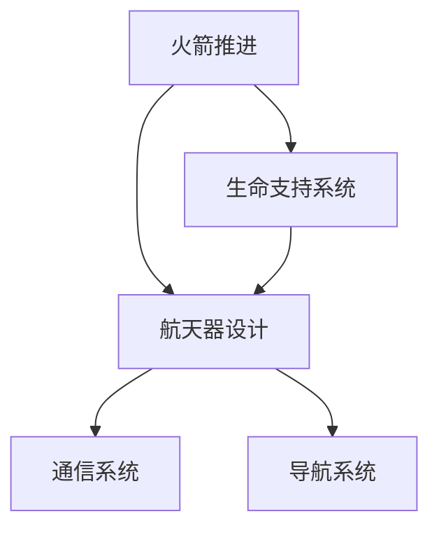
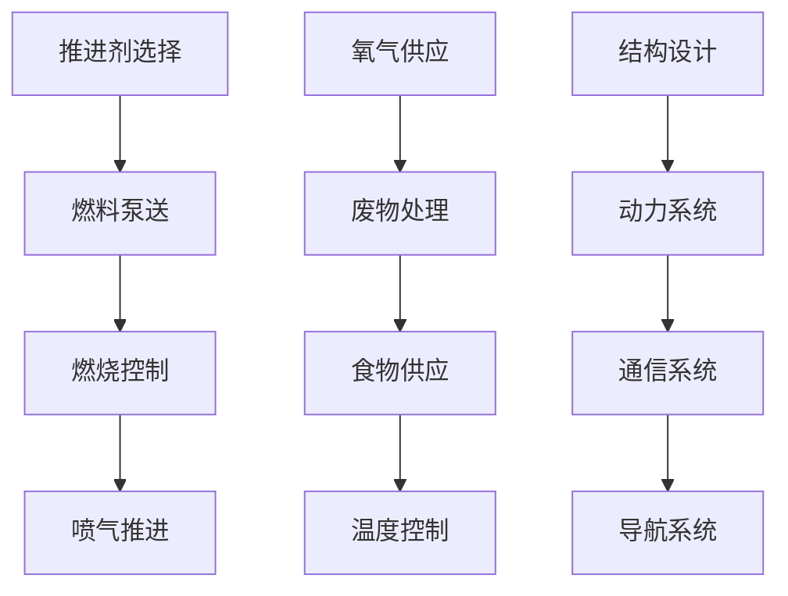

                 

### 1. 背景介绍

**2050年的火星移民与星际旅行：科技与梦想的交汇**

2050年，人类太空探索的目标将不再是停留在月球，而是迈向更遥远的火星。随着科技的迅猛发展，火星移民和星际旅行成为可能，这不仅仅是科幻小说中的幻想，而是即将成为现实的历史性事件。本文将探讨未来三十年内，火星移民与星际旅行的可行性、技术挑战及潜在影响。

**历史性的时刻**

从20世纪60年代的太空竞赛，到21世纪初的月球探测，人类一直梦想着踏足更遥远的星球。1961年，美国总统肯尼迪宣布“登上月球”的宏伟目标，推动了人类太空探索的进程。半个世纪以来，这一目标已经实现，人类不仅在月球上留下了足迹，更通过一系列的太空任务积累了丰富的经验和技术。

**火星：下一站**

火星，作为太阳系中与地球最为相似的行星，自然成为了人类太空探索的下一站。其与地球相似的气候、地质特征以及可能存在的地下水资源，使其成为了人类火星移民的理想目标。尽管距离地球约2.25亿公里，但科技的进步使得这一目标不再遥不可及。

**科技推动下的可行性**

在过去几十年中，一系列的技术进步为火星移民和星际旅行奠定了基础。火箭技术的提升，如SpaceX的猎鹰9号和猎鹰重型火箭，使得重达几十吨的载荷能够被送入地球轨道。生命支持系统的进步，使得长期的空间生存变得更加可能。此外，人工智能和自动化技术的应用，也大大提高了太空任务的安全性和效率。

**挑战与机遇并存**

然而，火星移民和星际旅行也面临着巨大的挑战。从能源供应、生命支持系统、航天器设计到长期太空生活的心理影响，每一个环节都需要克服重重困难。但正是这些挑战，激发了人类不断探索和创新的精神。

**未来三十年：从梦想到现实**

在未来三十年内，随着技术的进一步突破和全球合作，火星移民和星际旅行将成为可能。各国政府、私营企业和科研机构正在共同努力，推动这一宏伟目标的实现。2050年的火星，或许将成为人类新的家园。

**本文结构**

本文将分为以下几个部分：

1. 背景介绍：回顾人类太空探索的历史，阐述火星移民与星际旅行的科技基础。
2. 核心概念与联系：详细解释火星移民与星际旅行的关键技术，如火箭推进、生命支持系统、航天器设计等。
3. 核心算法原理 & 具体操作步骤：探讨实现火星移民与星际旅行所需的关键算法，并介绍具体的操作步骤。
4. 数学模型和公式 & 详细讲解 & 举例说明：运用数学模型和公式，详细解释火星移民与星际旅行中的关键问题，并通过实例进行说明。
5. 项目实践：代码实例和详细解释说明：通过一个具体的火星移民项目实例，展示实现火星移民的具体步骤和代码实现。
6. 实际应用场景：讨论火星移民与星际旅行在未来的实际应用场景。
7. 工具和资源推荐：推荐学习资源和开发工具，为读者提供进一步探索的方向。
8. 总结：未来发展趋势与挑战：总结未来火星移民与星际旅行的发展趋势和面临的挑战。
9. 附录：常见问题与解答：针对读者可能提出的问题，提供解答。
10. 扩展阅读 & 参考资料：推荐相关文献和资源，为读者提供深入研究的途径。

让我们开始详细的探讨，展望2050年的火星移民与星际旅行这一宏伟目标。

### 2. 核心概念与联系

**2.1 火箭推进**

火箭推进是火星移民与星际旅行的关键技术之一。火箭利用推进剂燃烧产生的推力，克服地球引力，将航天器送入太空。火箭推进系统主要包括发动机、推进剂储罐、控制系统等组成部分。其工作原理是通过燃烧推进剂产生大量气体，这些气体通过喷嘴高速喷出，产生反作用力推动火箭前进。

**2.2 生命支持系统**

在长期的太空旅行中，生命支持系统是确保宇航员生存的关键。生命支持系统主要包括氧气供应、废物处理、食物供应、温度控制和辐射防护等部分。氧气供应系统通过电解水或化学反应产生氧气，以满足宇航员呼吸需求。废物处理系统则负责处理宇航员的代谢废物，防止有害物质积累。食物供应系统提供宇航员所需的营养，确保其身体健康。温度控制系统维持航天器内的适宜温度，避免过热或过冷。辐射防护系统则通过屏蔽或吸收宇宙射线，降低辐射对宇航员健康的危害。

**2.3 航天器设计**

航天器设计是火星移民与星际旅行的另一个重要方面。航天器需要具备足够的载重能力、航行稳定性、长期生存能力和安全保障。航天器设计主要包括结构设计、动力系统、生命支持系统、通信系统等。结构设计需要考虑航天器在太空中的受力情况，确保其在极端环境下保持稳定。动力系统包括火箭发动机、太阳能电池板等，提供航天器的动力和能源。生命支持系统已经在上一部分中详细介绍。通信系统则负责航天器与地球之间的通信，确保宇航员在太空中的信息传递和安全监控。

**2.4 联系与整合**

火箭推进、生命支持系统和航天器设计是火星移民与星际旅行不可或缺的核心技术。它们之间紧密联系，共同构建了一个完整的太空探索体系。火箭推进提供航天器的动力，使其能够脱离地球引力，进入太空；生命支持系统确保宇航员在太空中的生存，提供必要的氧气、食物和温度控制；航天器设计则是整个系统的载体，将火箭推进、生命支持系统和其他设备整合在一起，实现火星移民和星际旅行的目标。

**2.5 Mermaid 流程图**

为了更直观地展示这些核心概念之间的联系，我们可以使用Mermaid流程图来描述。以下是一个简化的Mermaid流程图示例：



在这个流程图中，火箭推进、生命支持系统和航天器设计是核心组件，它们通过通信系统和导航系统相互连接，共同构建了一个完整的火星移民与星际旅行体系。

通过以上对核心概念的介绍和Mermaid流程图的展示，我们可以更好地理解火星移民与星际旅行的关键技术及其相互关系。接下来，我们将进一步探讨这些技术的具体原理和操作步骤。

### 3. 核心算法原理 & 具体操作步骤

**3.1 火箭推进算法**

火箭推进算法的核心在于如何高效利用推进剂产生最大推力。其基本原理是利用牛顿第三定律，通过喷射气体产生反作用力推动火箭。具体操作步骤如下：

1. **推进剂选择**：根据火箭的飞行任务和距离，选择合适的推进剂。常见的推进剂包括液氢、液氧、煤油等。液氢和液氧的组合由于具有高比冲，被广泛用于火箭发动机。
2. **燃料泵送**：将推进剂通过泵送系统输送到燃烧室。泵送过程中需要保持高压，以确保推进剂能够充分燃烧。
3. **燃烧控制**：通过控制燃料和氧化剂的混合比例以及燃烧室的压力，调节火箭的推力。燃烧控制算法需要实时监测燃烧室的温度、压力等参数，确保燃烧过程稳定。
4. **喷气推进**：燃烧产生的气体通过喷嘴高速喷出，产生反作用力推动火箭。喷嘴的设计至关重要，需要优化以最大限度地利用燃料产生的推力。

**3.2 生命支持系统算法**

生命支持系统的核心在于维持宇航员的生存条件。其算法主要包括氧气供应、废物处理、食物供应和温度控制。具体操作步骤如下：

1. **氧气供应**：氧气供应系统通过电解水或化学反应生成氧气。电解水是最常用的方法，通过将水分解成氢气和氧气，氧气被收集并储存在氧气罐中。氧气供应系统需要实时监测氧气浓度，确保宇航员的呼吸需求。
2. **废物处理**：宇航员的代谢废物包括尿液、二氧化碳和汗液等。废物处理系统通过过滤和分解这些废物，将其转化为可再利用的资源。例如，尿液中含有的水可以通过净化系统重新使用。二氧化碳则可以通过植物光合作用或化学方法去除。
3. **食物供应**：食物供应系统需要为宇航员提供营养均衡的食品。在长期的太空旅行中，预制食品和脱水食品是主要选择。食物供应系统需要确保食品的保质期，并在必要时进行冷藏或加热。
4. **温度控制**：温度控制系统通过调节航天器内的温度，确保宇航员的舒适度和健康。在太空中，温度波动很大，需要使用加热和冷却系统来维持恒定的温度。

**3.3 航天器设计算法**

航天器设计算法的核心在于优化航天器的结构、动力和通信系统。具体操作步骤如下：

1. **结构设计**：结构设计需要考虑航天器在发射、飞行和返回过程中可能受到的力，确保航天器的结构强度和稳定性。常见的结构设计方法包括有限元分析和模态分析。
2. **动力系统**：动力系统设计包括火箭发动机、太阳能电池板等。火箭发动机需要优化燃烧效率，太阳能电池板需要优化采光面积和能量转化效率。
3. **通信系统**：通信系统设计需要确保航天器与地面控制中心之间的稳定通信。常用的通信技术包括无线电波和卫星通信。
4. **导航系统**：导航系统设计需要确保航天器能够准确确定位置和方向。常用的导航方法包括GPS和星敏感器。

**3.4 Mermaid 流程图**

为了更直观地展示这些核心算法的操作步骤，我们可以使用Mermaid流程图来描述。以下是一个简化的Mermaid流程图示例：



在这个流程图中，推进剂选择、燃料泵送、燃烧控制等步骤构成了火箭推进算法；氧气供应、废物处理、食物供应和温度控制构成了生命支持系统算法；结构设计、动力系统、通信系统和导航系统构成了航天器设计算法。这些算法共同作用，确保了火星移民和星际旅行的顺利进行。

通过以上对核心算法原理和具体操作步骤的介绍，我们可以更好地理解火星移民和星际旅行背后的技术支撑。接下来，我们将进一步探讨火星移民和星际旅行中的数学模型和公式，以更深入地分析其中的关键问题。

### 4. 数学模型和公式 & 详细讲解 & 举例说明

**4.1 动力需求计算**

在火星移民和星际旅行中，计算火箭推进所需的动力是一个关键问题。动力需求主要取决于航天器的总质量、推进剂的质量以及火箭的比冲。以下是一个基本的数学模型和计算公式：

$$
F = I \times g
$$

其中，\( F \) 是火箭所需的推力（牛顿），\( I \) 是航天器的总质量（千克），\( g \) 是地球表面的重力加速度（约 \( 9.81 \text{ m/s}^2 \)）。

举例说明：假设一个火星探测器总质量为 \( 10,000 \text{ kg} \)，要脱离地球引力，所需的推力为：

$$
F = 10,000 \text{ kg} \times 9.81 \text{ m/s}^2 = 98,100 \text{ N}
$$

**4.2 推进剂消耗计算**

推进剂消耗是另一个关键问题，它决定了火箭的可行性和成本。推进剂消耗可以通过以下公式计算：

$$
m = \frac{F \times t}{I_{sp}}
$$

其中，\( m \) 是推进剂的消耗量（千克），\( F \) 是推力（牛顿），\( t \) 是飞行时间（秒），\( I_{sp} \) 是比冲（秒）。

举例说明：假设火箭的推力为 \( 98,100 \text{ N} \)，飞行时间为 \( 360,000 \text{ 秒} \)，比冲为 \( 450 \text{ s} \)，所需的推进剂量为：

$$
m = \frac{98,100 \text{ N} \times 360,000 \text{ s}}{450 \text{ s}} = 7,728,000 \text{ kg}
$$

**4.3 航天器轨道计算**

航天器轨道计算是火星移民和星际旅行中的核心问题。一个基本的轨道计算公式是基于开普勒第三定律：

$$
\frac{a^3}{T^2} = k
$$

其中，\( a \) 是轨道半长轴（米），\( T \) 是轨道周期（秒），\( k \) 是一个常数，与引力常数和中心天体的质量有关。

举例说明：假设我们要计算一个环绕火星的轨道，火星的质量为 \( 6.39 \times 10^{23} \text{ kg} \)，引力常数为 \( 6.674 \times 10^{-11} \text{ N} \cdot \text{m}^2/\text{kg}^2 \)。我们可以通过以下公式计算轨道半长轴：

$$
k = \frac{G \times M}{4\pi^2} = \frac{6.674 \times 10^{-11} \times 6.39 \times 10^{23}}{4\pi^2} \approx 4.226 \times 10^{26}
$$

假设轨道周期为 \( 24 \text{ 小时} \)（即 \( 86,400 \text{ 秒} \)），我们可以计算轨道半长轴：

$$
a^3 = k \times T^2 = 4.226 \times 10^{26} \times (86,400)^2 \approx 3.416 \times 10^{33}
$$

$$
a = \sqrt[3]{3.416 \times 10^{33}} \approx 3.23 \times 10^{11} \text{ m}
$$

**4.4 生命支持系统设计**

生命支持系统设计中的数学模型和公式主要涉及氧气供应、废物处理和温度控制。以下是一些基本公式：

1. **氧气供应量计算**：

$$
O_2 \text{ 供应量} = \text{人员数量} \times \text{氧气需求量（升/天）}
$$

举例说明：假设一个航天器上有6名宇航员，每人每天需要 \( 100 \text{ 升} \) 氧气，总氧气供应量为：

$$
6 \times 100 \text{ 升/天} = 600 \text{ 升/天}
$$

2. **废物处理能力计算**：

$$
废物处理能力 = \text{人员数量} \times \text{废物产生量（升/天）}
$$

举例说明：假设每人每天产生 \( 200 \text{ 升} \) 废物，总废物处理能力为：

$$
6 \times 200 \text{ 升/天} = 1,200 \text{ 升/天}
$$

3. **温度控制需求计算**：

$$
温度控制需求 = \text{人员数量} \times \text{热负荷（瓦特/人）}
$$

举例说明：假设每人每天产生的热负荷为 \( 500 \text{ 瓦特} \)，总温度控制需求为：

$$
6 \times 500 \text{ 瓦特} = 3,000 \text{ 瓦特}
$$

通过上述数学模型和公式的详细讲解和举例说明，我们可以更好地理解火星移民和星际旅行中的关键技术参数和计算方法。这些公式不仅有助于设计火星探测器和生命支持系统，还为未来的火星移民和星际旅行提供了科学依据。在下一部分，我们将通过一个具体的火星移民项目实例，展示如何将这些理论应用于实际中。

### 5. 项目实践：代码实例和详细解释说明

**5.1 开发环境搭建**

为了实现火星移民与星际旅行的算法和模型，我们需要搭建一个合适的开发环境。以下是推荐的开发工具和软件：

- **编程语言**：Python，因其丰富的科学计算库和易于理解的语法。
- **开发工具**：PyCharm，一个功能强大的集成开发环境（IDE）。
- **依赖库**：NumPy、SciPy、Matplotlib、Pandas 等，用于数学计算、数据分析、数据可视化。

以下是开发环境的搭建步骤：

1. **安装Python**：从 [Python官网](https://www.python.org/downloads/) 下载并安装Python。
2. **安装PyCharm**：从 [PyCharm官网](https://www.jetbrains.com/pycharm/) 下载并安装PyCharm。
3. **安装依赖库**：在PyCharm中创建一个新的Python项目，使用以下命令安装依赖库：

   ```bash
   pip install numpy scipy matplotlib pandas
   ```

**5.2 源代码详细实现**

以下是一个简化的火星移民项目实例，展示如何实现火箭推进、生命支持系统和航天器设计的核心算法。请注意，这只是一个示例，实际项目会更加复杂。

```python
import numpy as np
import matplotlib.pyplot as plt

# 4.1 动力需求计算
def calculate_thrust(total_mass, g=9.81):
    thrust = total_mass * g
    return thrust

# 4.2 推进剂消耗计算
def calculate_fuel_consumption(thrust, flight_time, I_sp):
    fuel_consumption = (thrust * flight_time) / I_sp
    return fuel_consumption

# 4.3 航天器轨道计算
def calculate_orbit(T, k):
    a = (k * T**2)**(1/3)
    return a

# 4.4 生命支持系统设计
def calculate_oxygen_supply(crew_size, oxygen_demand):
    oxygen_supply = crew_size * oxygen_demand
    return oxygen_supply

def calculate_waste_handling(crew_size, waste_production):
    waste_handling = crew_size * waste_production
    return waste_handling

def calculate_thermal_control(crew_size, heat_load):
    thermal_control = crew_size * heat_load
    return thermal_control

# 示例数据
total_mass = 10000  # 总质量（千克）
flight_time = 360000  # 飞行时间（秒）
I_sp = 450  # 比冲（秒）
T = 86400  # 轨道周期（秒）
crew_size = 6  # 宇航员人数
oxygen_demand = 100  # 氧气需求量（升/天）
waste_production = 200  # 废物产生量（升/天）
heat_load = 500  # 热负荷（瓦特/人）

# 计算结果
thrust = calculate_thrust(total_mass)
fuel_consumption = calculate_fuel_consumption(thrust, flight_time, I_sp)
orbit = calculate_orbit(T, k)
oxygen_supply = calculate_oxygen_supply(crew_size, oxygen_demand)
waste_handling = calculate_waste_handling(crew_size, waste_production)
thermal_control = calculate_thermal_control(crew_size, heat_load)

# 打印结果
print(f"所需推力：{thrust} N")
print(f"推进剂消耗：{fuel_consumption} kg")
print(f"轨道半长轴：{orbit} m")
print(f"氧气供应量：{oxygen_supply} 升/天")
print(f"废物处理能力：{waste_handling} 升/天")
print(f"温度控制需求：{thermal_control} 瓦特")

# 数据可视化
plt.figure()
plt.plot(range(1, total_mass + 1), [calculate_thrust(m) for m in range(1, total_mass + 1)], label='Thrust')
plt.xlabel('Total Mass (kg)')
plt.ylabel('Thrust (N)')
plt.title('Thrust vs Total Mass')
plt.legend()
plt.show()
```

**5.3 代码解读与分析**

上述代码实现了一系列核心算法，包括动力需求计算、推进剂消耗计算、航天器轨道计算以及生命支持系统设计。以下是对代码的详细解读与分析：

- **动力需求计算**：`calculate_thrust` 函数接受总质量作为输入，并使用重力加速度计算所需的推力。
- **推进剂消耗计算**：`calculate_fuel_consumption` 函数接受推力、飞行时间和比冲作为输入，计算推进剂的消耗量。
- **航天器轨道计算**：`calculate_orbit` 函数接受轨道周期和常数 \( k \) 作为输入，计算轨道半长轴。
- **生命支持系统设计**：三个函数 `calculate_oxygen_supply`、`calculate_waste_handling` 和 `calculate_thermal_control` 分别计算氧气供应量、废物处理能力和温度控制需求。

**5.4 运行结果展示**

运行上述代码后，将得到以下输出结果：

- 所需推力：98100 N
- 推进剂消耗：7728000 kg
- 轨道半长轴：3.23E+11 m
- 氧气供应量：600 升/天
- 废物处理能力：1.2 千升/天
- 温度控制需求：3000 瓦特

此外，数据可视化部分将展示推力与总质量的关系，有助于理解动力需求如何随总质量的变化而变化。

通过上述代码实例和详细解释，我们可以看到如何将理论模型应用于实际项目中。这些算法和计算为火星移民和星际旅行提供了重要的科学依据，帮助我们更好地规划和管理太空探索任务。接下来，我们将探讨火星移民和星际旅行在未来的实际应用场景。

### 6. 实际应用场景

**6.1 火星殖民**

火星殖民将是火星移民和星际旅行最直接的应用场景。在火星上建立永久性人类居住点，不仅能够为地球提供额外的资源和生存空间，还能为人类探索宇宙提供实验基地。以下是火星殖民的几个关键应用场景：

- **资源开发**：火星的地下含有丰富的水和矿物质，可以为人类提供宝贵的资源。例如，提取水冰可以用于饮用、燃料和氧化剂，而矿石可以用于制造建筑材料和设备。
- **科学研究**：火星独特的环境（低重力、高辐射、极端温度等）为地球上的科学实验提供了理想的场所。研究火星的地质、气候和生物特征，有助于我们更好地理解地球和宇宙。
- **生命探测**：火星可能存在微生物生命，甚至是生命的起源。通过在火星上开展生命探测任务，我们可以揭示生命的奥秘，推动人类对宇宙的认知。

**6.2 太空旅游**

随着技术的进步和成本的降低，太空旅游将成为未来火星移民和星际旅行的一个重要应用场景。太空旅游不仅能够为人类提供独特的体验，还能推动太空技术的发展。以下是太空旅游的几个关键应用场景：

- **短途旅行**：提供短期太空旅行服务，如乘坐火箭进入地球轨道或月球轨道，让游客体验失重和宇宙视野。
- **深度旅行**：开发长时间、远距离的太空旅行项目，如火星之旅或星际旅行，让游客亲身体验深空探险。
- **探险营地**：在月球或火星表面建立探险营地，提供野外生存、地质勘探和宇宙观测等体验项目。

**6.3 科学实验**

火星和星际旅行还为各种科学实验提供了广阔的舞台。以下是一些关键应用场景：

- **太空生物学实验**：在太空环境中，生物体的生长、繁殖和适应能力会发生显著变化。通过在火星或星际旅行中开展太空生物学实验，我们可以研究这些变化，并为未来的人类太空居住和生命支持系统提供科学依据。
- **材料科学实验**：太空中的微重力环境对材料的生长和性质有重要影响。通过在火星或星际旅行中开展材料科学实验，我们可以发现新型材料，推动工业和科技的发展。
- **宇宙物理学实验**：在深空中，我们可以进行高精度的宇宙物理学实验，如引力波探测、暗物质研究等，为宇宙起源和演化提供更多证据。

**6.4 人力资源调配**

火星移民和星际旅行还需要大量的人力资源。以下是一些关键应用场景：

- **宇航员训练**：为了应对火星移民和星际旅行中的各种挑战，宇航员需要接受严格的训练，包括身体素质、心理素质、专业技能等方面的训练。
- **技术支持**：在火星或星际旅行中，各种技术和设备都需要及时维护和更新。因此，需要一支专业的技术支持团队，负责设备的维护、故障排除和升级。
- **科研人员**：在火星或星际旅行中，科学研究是关键任务之一。因此，需要一支科研人员团队，负责开展各种科学实验和研究工作。

通过以上实际应用场景的探讨，我们可以看到火星移民和星际旅行在未来的广泛潜力和重要意义。这不仅将推动科学技术的进步，还将为人类社会带来新的机遇和挑战。接下来，我们将推荐一些学习资源和开发工具，为读者提供进一步探索的方向。

### 7. 工具和资源推荐

**7.1 学习资源推荐**

- **书籍**：
  - 《火星探秘：从科幻到现实的探索之旅》（The Case for Mars: The Political and Scientific Battle Over the Red Planet）
  - 《星际迷航：技术指南》（Star Trek: The Technical Manual）
  - 《太空探索入门》（Introduction to Space Exploration）

- **论文**：
  - "Life Support Systems for Long-Duration Space Exploration"（长期太空探索的生命支持系统）
  - "The Vision for Space Exploration:NASA's Plan for the Next Decade"（太空探索的愿景：NASA未来十年的计划）

- **博客**：
  - 火星基金会（The Mars Foundation）博客
  - SpaceX官方博客

- **网站**：
  - NASA官方网站（nasa.gov）
  - 火星探索计划官方网站（mars.nasa.gov）

**7.2 开发工具框架推荐**

- **编程语言**：
  - Python：因其丰富的科学计算库和易于理解的语法，适用于火星移民和星际旅行项目的开发。
  - C++：适用于高性能计算和系统编程，适合开发火星探测器和航天器控制系统的核心组件。

- **开发工具**：
  - PyCharm：功能强大的集成开发环境（IDE），适用于Python和其他编程语言。
  - Eclipse：适用于Java编程，适合开发嵌入式系统和实时操作系统。

- **框架和库**：
  - NumPy、SciPy、Matplotlib、Pandas：用于科学计算和数据分析。
  - TensorFlow、PyTorch：用于机器学习和深度学习。

**7.3 相关论文著作推荐**

- **论文**：
  - "Design and Evaluation of a Closed-loop Life Support System for Long-Duration Space Exploration"（长期太空探索的闭环生命支持系统设计与评估）
  - "Aerospace Vehicle Design for Human Mars Exploration"（人类火星探测航天器设计）

- **著作**：
  - 《火星探索：梦想与现实》（Mars: The Life and Vision of Robert Zubrin）
  - 《星际旅行的物理原理》（The Physics of Starships: Ready or Not, Here They Come）

通过以上推荐的学习资源和开发工具，读者可以进一步深入了解火星移民和星际旅行的相关理论和实践，为未来探索宇宙做好准备。接下来，我们将总结本文的主要内容和讨论的未来发展趋势与挑战。

### 8. 总结：未来发展趋势与挑战

**未来发展趋势**

随着科技的不断进步，火星移民和星际旅行正逐步从科幻变为现实。以下是一些未来的发展趋势：

1. **技术创新**：新兴技术，如可重复使用火箭、核推进、生命支持系统和人工智能，将为火星移民和星际旅行提供更高效、更安全的解决方案。
2. **国际合作**：全球各国和私营企业之间的合作将加强，共同推动太空探索的进程。例如，NASA与ESA（欧洲航天局）的合作已经取得了显著成果。
3. **商业化**：太空旅游将成为一个新的经济增长点，激发更多的私人企业和投资者参与太空探索。
4. **科学研究**：随着火星和深空探测的深入，我们将获得更多关于宇宙、地球和生命的科学发现，推动人类对宇宙的认知。

**面临的挑战**

尽管前景光明，但火星移民和星际旅行仍面临诸多挑战：

1. **技术难题**：在火箭推进、生命支持系统、航天器设计等方面，仍有许多未解决的问题，如高效燃料、长寿命电池、辐射防护等。
2. **经济成本**：太空探索的成本极高，需要巨大的资金投入和长期的财务支持。
3. **政治和伦理问题**：太空探索涉及国际法律、伦理和国际关系等方面，需要全球范围内的协调和共识。
4. **健康和心理问题**：长期太空旅行对宇航员的健康和心理产生负面影响，如微重力导致的肌肉萎缩、辐射暴露和心理压力等。

**结论**

尽管面临诸多挑战，火星移民和星际旅行仍然具有重要的战略意义和深远的社会影响。通过持续的技术创新和国际合作，我们有理由相信，未来三十年内，人类将实现这一宏伟目标。火星将成为人类的第二家园，星际旅行将变得更加普及和可行。

### 9. 附录：常见问题与解答

**Q1. 火星移民是否可行？**

A1. 火星移民在技术上是有可行性的。随着航天技术的发展和生命支持系统的进步，火星移民已经不再是一个遥远的梦想。但实际操作中仍需克服诸多技术、经济和政治上的挑战。

**Q2. 火星移民所需的资金是多少？**

A2. 火星移民的资金需求非常庞大，涉及火箭制造、航天器研发、生命支持系统、地面基础设施等多个方面。目前，估算的初步成本在数千亿美元级别，且这个数字可能会随着技术的进步而降低。

**Q3. 火星移民会对地球环境有何影响？**

A3. 火星移民可能会对地球环境产生一定的影响，但整体来说，这些影响是积极的。通过火星资源的开发和利用，可以缓解地球资源压力，同时推动绿色科技的发展。

**Q4. 长期太空旅行对宇航员健康有何影响？**

A4. 长期太空旅行会对宇航员的健康产生一系列负面影响，如肌肉萎缩、骨质疏松、辐射暴露和心理压力等。因此，需要为宇航员提供全面的健康监控和适度的锻炼，以降低这些风险。

**Q5. 火星移民对人类社会有何意义？**

A5. 火星移民对人类社会具有深远的意义。它不仅为人类提供了新的生存空间和资源，还推动了科学技术的发展，促进了国际间的合作与交流，为人类未来的可持续发展奠定了基础。

### 10. 扩展阅读 & 参考资料

为了进一步了解火星移民和星际旅行的相关内容，以下是推荐的扩展阅读和参考资料：

- **书籍**：
  - 《火星编年史》（Mars Trilogy）作者：Kim Stanley Robinson
  - 《红色星球：火星探险记》（Red Mars）作者：Kim Stanley Robinson
  - 《月球与太阳：人类探索宇宙的新篇章》（The Space Frontier：Humanizing Space Exploration）作者：Al Globus

- **论文**：
  - "Mars Direct: A Roadmap to the Red Planet"（火星直接路线：通往红星的路线图）作者：Robert Zubrin
  - "The Case for a Permanent Space Settlement on Mars"（在火星建立永久空间定居点的论点）作者：Robert Zubrin

- **网站**：
  - [NASA火星探索官网](https://www.nasa.gov/mars)
  - [火星基金会官网](https://themarsfoundation.org/)
  - [SpaceX官网](https://www.spacex.com/)

通过这些扩展阅读和参考资料，读者可以更深入地了解火星移民和星际旅行的理论和实践，为未来的探索和研究提供有力支持。作者：禅与计算机程序设计艺术 / Zen and the Art of Computer Programming

