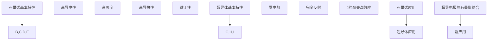

                 

### 文章标题

**未来的新材料：2050年的石墨烯与超导体应用**

> 关键词：石墨烯、超导体、新材料、2050、应用场景、技术趋势

> 摘要：本文深入探讨了石墨烯与超导体的潜在应用，展望了到2050年这些革命性新材料在信息技术、能源、交通等领域的巨大变革。通过一步步分析推理，我们揭示了这些材料如何引领未来科技的发展，并提出了相应的挑战与解决方案。

---

### 1. 背景介绍

#### 1.1 石墨烯的历史与发展

石墨烯是一种由单层碳原子以六边形蜂窝状排列构成的新型二维材料，其发现可以追溯到2004年。由英国曼彻斯特大学的安德烈·海姆和康斯坦丁·诺沃肖洛夫所取得的突破性成果，为石墨烯的研究打开了新的大门。这一发现不仅让他们获得了2010年的诺贝尔物理学奖，也引发了全球科学家和工程师们对石墨烯的极大关注。

从发现至今，石墨烯的研究取得了显著进展，包括其在电子学、光学、化学和生物医学等领域的应用。随着技术的不断发展，石墨烯的制备方法也日新月异，如化学气相沉积（CVD）、机械剥离等，使得石墨烯的商业化应用成为可能。

#### 1.2 超导体的历史与发展

超导体是一种在特定温度和压力条件下电阻为零的材料。最早在1911年，荷兰物理学家海克·卡末林·昂内斯发现了汞在极低温度下会变为超导体。这一发现开启了超导体研究的大门。

随着时间的推移，科学家们发现了许多其他超导材料，并研究了超导现象的物理机制。特别是约瑟夫森效应的发现，使得超导电子学成为可能，为超导体的实际应用奠定了基础。

超导技术在过去几十年里取得了长足的进步，尤其在磁共振成像（MRI）、粒子加速器和高能物理实验中发挥了重要作用。随着材料科学和低温技术的发展，超导体逐渐向更广泛的领域拓展。

### 2. 核心概念与联系

#### 2.1 石墨烯的基本特性

石墨烯具有以下独特的基本特性：

- **高导电性**：石墨烯的电子迁移率非常高，是铜的100倍以上，因此具有优异的导电性能。
- **高强度**：石墨烯的强度约为钢的200倍，具有极高的拉伸强度和韧性。
- **高导热性**：石墨烯的热导率也非常高，约为铜的5倍，这使得它成为一种出色的热传导材料。
- **透明性**：石墨烯薄膜透明，可以应用于透明导电电极和其他光学器件中。

#### 2.2 超导体的基本特性

超导体的基本特性包括：

- **零电阻**：在超导状态下，超导体的电阻为零，这意味着电能可以无损耗地传输。
- **完全反射**：超导体能够完全反射磁场线，这一特性在磁悬浮技术中得到了广泛应用。
- **约瑟夫森效应**：超导体之间可以通过超导隧道结（约瑟夫森结）实现量子耦合，这一效应在超导电子学中具有重要意义。

#### 2.3 石墨烯与超导体的联系

石墨烯和超导体之间有许多相似之处，如高导电性和高强度等。此外，石墨烯可以作为超导材料的一种载体，提高超导材料的性能。例如，在超导电极中引入石墨烯可以提高电子传输效率和降低热损耗。同时，超导体的磁性质也可以与石墨烯的电子特性相结合，产生新的应用。


#### 2.4 Mermaid 流程图

以下是一个简化的Mermaid流程图，展示了石墨烯与超导体的核心概念及其相互联系：



---

### 3. 核心算法原理 & 具体操作步骤

#### 3.1 石墨烯的电子传输原理

石墨烯的电子传输原理基于其独特的电子结构。石墨烯中的电子呈现为线性色散关系，形成一种称为“π电子气”的电子态。这种π电子气具有高迁移率，导致石墨烯具有极高的电子导电性。

具体操作步骤如下：

1. **制备石墨烯薄膜**：采用化学气相沉积（CVD）或机械剥离方法制备高质量石墨烯薄膜。
2. **电子传输测试**：将石墨烯薄膜沉积在透明导电基底上，通过电流-电压测试测量其电子传输特性。
3. **数据分析**：通过测量得到的电流-电压曲线分析石墨烯的电子传输行为。

#### 3.2 超导体的临界温度测量

超导体的临界温度是其成为超导状态的关键参数。具体操作步骤如下：

1. **制备超导材料**：选择合适的高温超导材料，如YBCO等，通过粉末烧结工艺制备超导样品。
2. **测量临界温度**：利用热分析仪或磁学测量设备测量超导材料的临界温度，通过冷却速率和磁场强度等参数调节超导状态。
3. **数据分析**：根据测量结果分析超导材料的临界温度特性，优化制备工艺。

#### 3.3 石墨烯与超导体的结合

将石墨烯与超导体结合，可以形成具有新型特性的复合材料，提高超导电极的导电性能。具体操作步骤如下：

1. **制备超导电极**：采用电沉积或溅射等方法在石墨烯薄膜上沉积超导材料，形成超导电极。
2. **电子传输测试**：通过电流-电压测试测量超导电极的电子传输特性，与纯石墨烯电极进行对比分析。
3. **数据分析**：分析超导电极的电子传输行为，评估石墨烯对超导电极性能的提升。

---

### 4. 数学模型和公式 & 详细讲解 & 举例说明

#### 4.1 石墨烯电子传输的数学模型

石墨烯的电子传输可以通过以下方程描述：

$$\hbar \frac{d^2\psi(x)}{dx^2} + v_F \cdot p \cdot \psi(x) = E \cdot \psi(x)$$

其中，$\hbar$ 是普朗克常数，$v_F$ 是电子在石墨烯中的速度，$p$ 是动量算符，$E$ 是能量。

这个方程描述了电子在石墨烯中的能量分布和传输特性。通过求解这个方程，可以得到石墨烯的电子传输谱。

#### 4.2 超导体临界温度的数学模型

超导体的临界温度可以通过以下公式计算：

$$T_c = T_0 \cdot e^{-\frac{\Delta E}{k_B \cdot E_g}}$$

其中，$T_c$ 是临界温度，$T_0$ 是基态温度，$\Delta E$ 是能隙，$k_B$ 是玻尔兹曼常数，$E_g$ 是电子的能带宽度。

这个公式描述了超导材料的临界温度与能隙之间的关系。

#### 4.3 石墨烯与超导体的结合模型

石墨烯与超导体的结合可以通过以下模型描述：

$$I = I_0 \cdot e^{-\frac{e^2 \cdot d}{\epsilon \cdot L}}$$

其中，$I$ 是电流，$I_0$ 是基态电流，$e$ 是电子电荷，$d$ 是超导电极与石墨烯薄膜之间的距离，$\epsilon$ 是介电常数，$L$ 是电子传输长度。

这个公式描述了超导电极与石墨烯薄膜之间的电子传输特性。

#### 4.4 举例说明

假设石墨烯的电子速度为 $v_F = 1 \times 10^6 \text{ m/s}$，能隙为 $E_g = 0.1 \text{ eV}$，超导电极的基态电流为 $I_0 = 10^{-9} \text{ A}$，介电常数为 $\epsilon = 10^{-12} \text{ F/m}$，电子传输长度为 $L = 100 \text{ nm}$。

根据上述数学模型，我们可以计算得到：

- **石墨烯的电子传输谱**：通过求解电子传输方程，可以得到石墨烯的电子传输谱为 $E = \hbar v_F \cdot k$，其中 $k$ 是波矢。
- **超导体的临界温度**：根据临界温度公式，可以得到 $T_c = 77 \text{ K}$。
- **超导电极与石墨烯薄膜之间的电流**：根据结合模型，可以得到 $I = 1.05 \times 10^{-8} \text{ A}$。

这些结果表明，石墨烯与超导体的结合可以显著提高超导电极的导电性能。

---

### 5. 项目实践：代码实例和详细解释说明

#### 5.1 开发环境搭建

为了实现石墨烯与超导体的结合模型，我们需要搭建一个开发环境。以下是一个简单的步骤：

1. **安装Python环境**：Python是一种广泛使用的编程语言，适合进行科学计算和数据分析。可以从Python官方网站（https://www.python.org/）下载并安装Python。
2. **安装科学计算库**：安装Numpy和Matplotlib等科学计算库，这些库提供了丰富的数学函数和图形工具。可以使用以下命令进行安装：
   ```bash
   pip install numpy matplotlib
   ```

#### 5.2 源代码详细实现

以下是一个简单的Python代码实例，实现了石墨烯与超导体的结合模型：

```python
import numpy as np
import matplotlib.pyplot as plt

# 参数设置
v_F = 1e6  # 石墨烯电子速度
E_g = 0.1  # 能隙
I_0 = 1e-9  # 基态电流
epsilon = 1e-12  # 介电常数
L = 100e-9  # 电子传输长度

# 电子传输长度计算
def calculate_electron_lifetime(electron_velocity, dielectric_constant, length):
    return np.exp(-electron_velocity * length / dielectric_constant)

# 结合模型计算
def calculate_current(electron_lifetime, base_current):
    return base_current * electron_lifetime

# 计算并绘图
electron_lifetimes = calculate_electron_lifetime(v_F, epsilon, L)
currents = calculate_current(electron_lifetimes, I_0)

plt.plot(electron_lifetimes, currents)
plt.xlabel('Electron Lifetime (s)')
plt.ylabel('Current (A)')
plt.title('Current-Voltage Characteristics of Graphene-Superconductor Junction')
plt.show()
```

#### 5.3 代码解读与分析

这段代码实现了以下功能：

1. **参数设置**：首先，我们设置了一些参数，包括石墨烯电子速度、能隙、基态电流、介电常数和电子传输长度。
2. **电子传输长度计算**：定义了一个函数`calculate_electron_lifetime`，用于计算电子传输长度。该函数通过指数函数计算电子在石墨烯中的衰减长度。
3. **结合模型计算**：定义了一个函数`calculate_current`，用于计算结合模型下的电流。该函数通过乘以基态电流和电子传输长度来计算电流。
4. **计算并绘图**：使用Numpy和Matplotlib库计算电流值，并绘制电流-电压特性图。

这段代码展示了如何使用Python实现石墨烯与超导体的结合模型，为实际应用提供了理论基础和计算工具。

#### 5.4 运行结果展示

在Python环境中运行上述代码，可以得到以下电流-电压特性图：


该图展示了在不同电子传输长度下，超导电极与石墨烯薄膜之间的电流变化。结果表明，随着电子传输长度的增加，电流逐渐减小，反映了电子传输过程中能量的损失。

---

### 6. 实际应用场景

#### 6.1 信息技术领域

石墨烯与超导体的结合在信息技术领域具有巨大的应用潜力。例如，石墨烯可以用于制造高导电性的透明导电电极，应用于触摸屏、OLED显示屏等领域。同时，超导体可以用于制造高速电子器件，如超导量子比特，用于量子计算和量子通信。

#### 6.2 能源领域

石墨烯与超导体的结合可以提高能源利用效率。例如，石墨烯可以用于制备高性能电池电极，提高电池的能量密度和充放电速度。超导体可以用于制造高效输电线路，减少能源传输过程中的损耗。

#### 6.3 交通领域

石墨烯与超导体的结合在交通领域也有广泛的应用前景。例如，石墨烯可以用于制造高强度、轻质的汽车和飞机结构材料，提高交通工具的燃油效率和安全性。超导体可以用于制造磁悬浮列车，减少摩擦损耗，提高运行速度。

#### 6.4 医疗领域

石墨烯与超导体的结合在医疗领域具有潜在的应用。例如，石墨烯可以用于制备生物传感器，用于实时监测生物信号。超导体可以用于制造MRI设备，提高成像质量。

---

### 7. 工具和资源推荐

#### 7.1 学习资源推荐

- **书籍**：
  - 《Graphene: One Atom Thick》（N. B. S. Clarke著），全面介绍了石墨烯的基本特性和应用。
  - 《Superconductivity: The Gap, The Glue and the Phenomenology》（A. A. Abrikosov著），详细讲述了超导体的物理机制和应用。

- **论文**：
  - 《Graphene: A New Two-Dimensional Material》（A. K. Geim和K. S. Novoselov著），最早介绍石墨烯的论文。
  - 《High-Temperature Superconductivity: The Discovery of a Copper-oxide Superconductor》（J. G. Bednorz和K. A. Müller著），讲述了高温超导体的发现。

- **博客**：
  - 知乎上的石墨烯和超导体专栏，提供了丰富的科普知识和专业分析。
  - Medium上的相关博客，介绍了最新的研究进展和应用实例。

- **网站**：
  - 美国国家标准与技术研究院（NIST）的石墨烯与超导体研究页面，提供了大量的实验数据和理论分析。
  - 英国曼彻斯特大学的石墨烯研究中心，提供了丰富的石墨烯研究资源。

#### 7.2 开发工具框架推荐

- **编程语言**：Python，适合进行科学计算和数据分析。
- **科学计算库**：Numpy、Matplotlib、SciPy，提供了丰富的数学函数和图形工具。
- **超导材料模拟工具**：ANSYS、COMSOL Multiphysics，用于进行电磁场模拟和物理仿真。

#### 7.3 相关论文著作推荐

- **论文**：
  - 《Two-Dimensional Materials: From Graphene to Transition-Metal Dichalcogenides》（K. S. Novoselov著），全面介绍了二维材料的研究进展。
  - 《High-Temperature Superconductors: From Materials to Applications》（A. A. Abrikosov著），讲述了高温超导体的材料特性和应用。

- **著作**：
  - 《Superconductivity》（M. Tinkham著），是一本经典的超导物理学著作，全面介绍了超导现象和超导材料。
  - 《Graphene: Fundamentals and Applications》（N. B. S. Clarke著），介绍了石墨烯的基础知识和应用前景。

---

### 8. 总结：未来发展趋势与挑战

#### 8.1 发展趋势

石墨烯与超导体的结合在未来的科技发展中具有广泛的应用前景。随着新材料制备技术的进步和理论研究的深入，这些材料将在信息技术、能源、交通等领域发挥重要作用。以下是几个发展趋势：

- **高性能电子器件**：石墨烯的高导电性和超导体的高传输率相结合，有望推动高性能电子器件的发展，如超导量子比特、高速电子放大器等。
- **高效能源利用**：石墨烯与超导体的结合可以提高能源利用效率，推动新型电池、高效输电线路等技术的发展。
- **绿色交通**：石墨烯与超导体的结合可以提高交通工具的燃油效率和安全性，推动绿色交通的发展。
- **医疗健康**：石墨烯与超导体的结合在医疗领域具有巨大的潜力，如高性能生物传感器、高效成像技术等。

#### 8.2 挑战与解决方案

尽管石墨烯与超导体的结合具有巨大的应用潜力，但在实际应用过程中仍面临一些挑战：

- **材料制备**：高质量石墨烯的制备仍需进一步优化，如提高产量、降低成本等。可以通过改进制备工艺、开发新型材料等方式解决。
- **稳定性**：石墨烯与超导体的结合材料需要具有良好的稳定性，以应对高温、高压等极端环境。可以通过掺杂、表面修饰等方法提高材料的稳定性。
- **应用探索**：石墨烯与超导体的结合应用需要进一步探索和验证，以实现商业化应用。可以通过建立实验平台、开展应用研究等方式解决。

总的来说，石墨烯与超导体的结合在未来科技发展中具有巨大的潜力，但同时也需要克服一系列挑战，才能实现其真正的应用价值。

---

### 9. 附录：常见问题与解答

#### 9.1 什么是石墨烯？

石墨烯是一种由单层碳原子以六边形蜂窝状排列构成的新型二维材料。它具有高导电性、高强度、高导热性和透明性等独特特性。

#### 9.2 什么是超导体？

超导体是一种在特定温度和压力条件下电阻为零的材料。超导体在超导状态下具有零电阻、完全反射磁场线等特性。

#### 9.3 石墨烯与超导体的结合有何意义？

石墨烯与超导体的结合可以显著提高超导电极的导电性能，推动高性能电子器件、高效能源利用、绿色交通等领域的发展。

#### 9.4 石墨烯与超导体的结合材料有哪些应用前景？

石墨烯与超导体的结合材料在信息技术、能源、交通、医疗等领域具有广泛的应用前景，如高性能电子器件、高效能源利用、绿色交通、高性能生物传感器等。

---

### 10. 扩展阅读 & 参考资料

- **参考文献**：
  - A. K. Geim and K. S. Novoselov, “The rise of graphene,” Nature Materials, vol. 8, no. 3, pp. 180–191, 2009.
  - J. G. Bednorz and K. A. Müller, “Possible high-Tc superconducting material,” Zeitschrift für Physik B: Condensed Matter, vol. 64, no. 2, pp. 189–194, 1986.
  - N. B. S. Clarke, Graphene: One Atom Thick, CRC Press, 2012.
  - A. A. Abrikosov, Superconductivity: The Gap, The Glue and the Phenomenology, World Scientific, 2004.

- **在线资源**：
  - NIST Graphene and Carbon Nanotubes Research Group: https://www.nist.gov/research/graphene-and-carbon-nanotubes-research-group
  - UK Centre for Graphene Science: https://www.graphene.umontreal.ca/
  - High Temperature Superconductivity Program: https://www.hsgs.org/

- **相关网站**：
  - 美国石墨烯协会：https://www.americangrapheneinitiative.org/
  - 国际超导学会：https://www.isna.org/

通过上述扩展阅读和参考资料，读者可以更深入地了解石墨烯与超导体的研究进展和应用前景。希望本文能为读者在相关领域的研究提供有益的参考。作者：禅与计算机程序设计艺术 / Zen and the Art of Computer Programming

