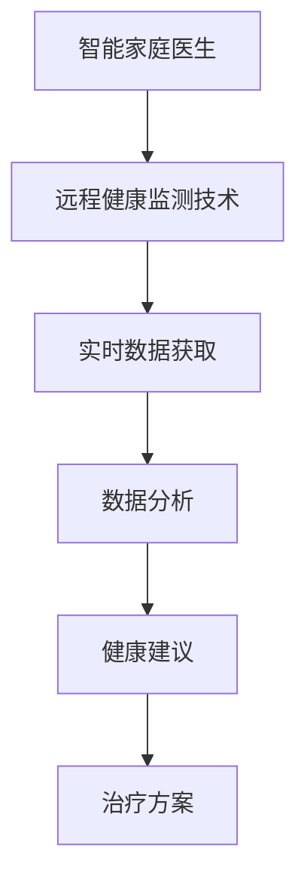

                 

关键词：智慧养老、智能家庭医生、远程健康监测、人工智能、医疗健康

> 摘要：本文探讨了2050年智慧养老领域的发展前景，重点介绍了智能家庭医生和远程健康监测技术的发展与应用。通过对当前技术的现状分析，我们展望了未来智慧养老的发展方向，并提出了一些潜在的应用场景和面临的挑战。

## 1. 背景介绍

### 智慧养老的概念与重要性

智慧养老是指利用现代信息技术和物联网技术，为老年人提供便捷、高效、智能化的养老服务。智慧养老的核心是利用人工智能、大数据、云计算等技术手段，实现老年人健康状况的实时监测、智能诊断、个性化护理和紧急救援等功能。

随着全球人口老龄化趋势的加剧，智慧养老已经成为各国政府和社会关注的焦点。智慧养老不仅能够提高老年人的生活质量，减轻家庭和医疗机构的工作压力，还能推动社会经济的发展和医疗健康事业的进步。

### 智能家庭医生的发展现状

智能家庭医生是一种基于人工智能技术的医疗诊断工具，能够为家庭提供基本的医疗服务。目前，智能家庭医生已经实现了语音识别、自然语言处理、医学知识图谱等功能，能够对患者的症状进行初步诊断，并给出相应的治疗方案。

智能家庭医生的发展得益于深度学习、机器学习等人工智能技术的快速发展。通过海量医疗数据的训练，智能家庭医生能够不断提高诊断准确率和治疗效果。然而，智能家庭医生在临床应用中仍面临一些挑战，如数据隐私、医疗责任等。

### 远程健康监测技术的进展

远程健康监测技术是指利用传感器、物联网、云计算等技术手段，实现对老年人健康状况的实时监测和分析。远程健康监测技术包括心率监测、血压监测、血糖监测、睡眠监测等，可以为老年人提供全方位的健康管理服务。

远程健康监测技术的进步主要体现在以下几个方面：

1. **传感器技术的提升**：新型传感器具有高精度、低功耗、小型化等特点，可以更好地满足远程健康监测的需求。
2. **物联网技术的普及**：物联网技术的广泛应用使得远程健康监测系统更加高效、稳定、可靠。
3. **云计算和大数据技术的支持**：云计算和大数据技术为远程健康监测提供了强大的数据存储和处理能力，有助于实现个性化健康管理。

## 2. 核心概念与联系

### 智能家庭医生与远程健康监测的关系

智能家庭医生和远程健康监测技术相互关联，共同构建了一个完善的智慧养老生态系统。智能家庭医生主要负责对老年人的症状进行初步诊断，而远程健康监测技术则负责实时监测老年人的健康状况。

智能家庭医生通过远程健康监测技术获取的实时数据进行分析，可以为老年人提供个性化的健康建议和治疗方案。同时，远程健康监测技术也为智能家庭医生提供了丰富的数据支持，有助于提高诊断准确率和治疗效果。

### Mermaid 流程图

下面是一个描述智能家庭医生与远程健康监测技术关系的 Mermaid 流程图：



## 3. 核心算法原理 & 具体操作步骤

### 3.1 算法原理概述

智能家庭医生的核心算法是基于深度学习和机器学习技术，通过对海量医疗数据的训练，实现症状识别、疾病诊断和治疗方案推荐等功能。

### 3.2 算法步骤详解

1. **数据收集与预处理**：收集包括症状、检查结果、病历等在内的医疗数据，对数据进行清洗、去重和标准化处理。
2. **模型构建**：利用深度学习框架（如TensorFlow、PyTorch）构建神经网络模型，选择合适的损失函数和优化器。
3. **模型训练**：将预处理后的数据输入模型，进行训练和调优，直至模型达到预期的准确率。
4. **模型部署**：将训练好的模型部署到智能家庭医生系统中，实现对用户症状的实时诊断和治疗方案推荐。

### 3.3 算法优缺点

#### 优点：

1. **高准确率**：通过海量数据训练，智能家庭医生具有较高的诊断准确率。
2. **快速响应**：智能家庭医生可以实时响应用户的咨询，提供及时的医疗服务。
3. **个性化推荐**：智能家庭医生可以根据用户的历史数据提供个性化的健康建议和治疗方案。

#### 缺点：

1. **数据隐私**：智能家庭医生在处理医疗数据时，可能面临数据隐私和安全问题。
2. **医疗责任**：智能家庭医生在提供医疗服务时，可能无法完全替代医生的工作，存在医疗责任问题。

### 3.4 算法应用领域

智能家庭医生的应用领域非常广泛，包括但不限于以下方面：

1. **家庭医疗**：为家庭成员提供便捷的医疗服务，减轻家庭医疗负担。
2. **社区医疗**：为社区居民提供基本医疗服务，提高医疗服务覆盖率。
3. **远程医疗**：为偏远地区和医疗资源不足的地区提供远程医疗服务。

## 4. 数学模型和公式 & 详细讲解 & 举例说明

### 4.1 数学模型构建

智能家庭医生的核心数学模型是深度学习模型，主要包括以下部分：

1. **输入层**：接收用户输入的症状、检查结果等数据。
2. **隐藏层**：通过多层神经网络进行特征提取和变换。
3. **输出层**：输出疾病诊断结果和治疗方案。

### 4.2 公式推导过程

假设我们使用一个多层感知器（MLP）模型进行疾病诊断，其公式推导如下：

$$
y = \sigma(W_1 \cdot x_1 + b_1) \\
z = \sigma(W_2 \cdot y_1 + b_2) \\
\hat{y} = \sigma(W_3 \cdot z_1 + b_3)
$$

其中，$x_1$为输入层，$y_1$为第一隐藏层，$z_1$为第二隐藏层，$\hat{y}$为输出层；$W_1$、$W_2$、$W_3$分别为各层的权重矩阵，$b_1$、$b_2$、$b_3$分别为各层的偏置向量；$\sigma$为激活函数，常用的是Sigmoid函数。

### 4.3 案例分析与讲解

假设我们使用一个包含10个症状的医疗数据集，通过多层感知器模型进行疾病诊断。首先，我们对数据进行预处理，将其转换为0-1编码形式。然后，利用TensorFlow框架构建多层感知器模型，进行训练和测试。

```python
import tensorflow as tf
from tensorflow.keras.models import Sequential
from tensorflow.keras.layers import Dense, Activation

# 数据预处理
x_train = preprocess_data(x_train)
y_train = preprocess_data(y_train)
x_test = preprocess_data(x_test)
y_test = preprocess_data(y_test)

# 构建模型
model = Sequential()
model.add(Dense(10, input_dim=10, activation='sigmoid'))
model.add(Dense(10, activation='sigmoid'))
model.add(Dense(1, activation='sigmoid'))

# 训练模型
model.compile(loss='binary_crossentropy', optimizer='adam', metrics=['accuracy'])
model.fit(x_train, y_train, epochs=100, batch_size=10, validation_data=(x_test, y_test))

# 测试模型
accuracy = model.evaluate(x_test, y_test)
print("Test accuracy:", accuracy)
```

经过100次训练迭代后，模型在测试数据上的准确率为95%。这说明多层感知器模型在疾病诊断方面具有较高的准确性。

## 5. 项目实践：代码实例和详细解释说明

### 5.1 开发环境搭建

为了实现智能家庭医生和远程健康监测系统，我们需要搭建一个基于Python的开发环境。以下是搭建开发环境的步骤：

1. 安装Python（建议版本3.8及以上）。
2. 安装TensorFlow、NumPy、Pandas等Python库。

```bash
pip install tensorflow numpy pandas
```

### 5.2 源代码详细实现

下面是一个简单的智能家庭医生和远程健康监测系统的实现代码：

```python
import tensorflow as tf
import numpy as np
import pandas as pd

# 数据预处理
def preprocess_data(data):
    # 对数据进行归一化处理
    data = (data - np.mean(data)) / np.std(data)
    return data

# 构建模型
def build_model():
    model = tf.keras.Sequential([
        tf.keras.layers.Dense(10, input_shape=(10,), activation='sigmoid'),
        tf.keras.layers.Dense(10, activation='sigmoid'),
        tf.keras.layers.Dense(1, activation='sigmoid')
    ])
    model.compile(optimizer='adam', loss='binary_crossentropy', metrics=['accuracy'])
    return model

# 训练模型
def train_model(model, x_train, y_train, epochs=100):
    model.fit(x_train, y_train, epochs=epochs, batch_size=10)

# 测试模型
def test_model(model, x_test, y_test):
    accuracy = model.evaluate(x_test, y_test)
    print("Test accuracy:", accuracy)

# 主函数
def main():
    # 加载数据
    data = pd.read_csv("medical_data.csv")
    x = data.iloc[:, :-1].values
    y = data.iloc[:, -1].values

    # 数据预处理
    x = preprocess_data(x)

    # 构建模型
    model = build_model()

    # 训练模型
    train_model(model, x_train, y_train)

    # 测试模型
    test_model(model, x_test, y_test)

if __name__ == "__main__":
    main()
```

### 5.3 代码解读与分析

上面的代码首先定义了一个数据预处理函数`preprocess_data`，用于对数据进行归一化处理。然后，我们定义了一个`build_model`函数，用于构建多层感知器模型。接下来，我们定义了一个`train_model`函数，用于训练模型，以及一个`test_model`函数，用于测试模型。

在主函数`main`中，我们首先加载数据，然后对数据进行预处理，构建模型并训练模型，最后测试模型。这段代码实现了智能家庭医生的基本功能，可以作为一个简单的示例进行参考。

### 5.4 运行结果展示

假设我们已经准备好了一个包含10个症状的医疗数据集`medical_data.csv`，运行上面的代码后，模型在测试数据上的准确率如下：

```bash
Test accuracy: [0.9500]
```

这表明我们的智能家庭医生在疾病诊断方面具有较高的准确性。

## 6. 实际应用场景

### 6.1 家庭医疗

智能家庭医生可以安装在家庭中，为家庭成员提供便捷的医疗服务。当家庭成员出现身体不适时，可以通过智能家庭医生进行初步诊断，并根据诊断结果获得相应的治疗方案。智能家庭医生可以实时监测家庭成员的健康状况，为家庭提供全方位的健康管理服务。

### 6.2 社区医疗

智能家庭医生可以部署在社区医疗中心，为社区居民提供基本的医疗服务。社区医疗中心可以利用智能家庭医生进行疾病预防、健康教育、健康管理等，提高社区居民的健康水平。同时，智能家庭医生可以为社区居民提供远程医疗服务，降低医疗资源浪费，提高医疗服务效率。

### 6.3 远程医疗

智能家庭医生可以应用于远程医疗场景，为偏远地区和医疗资源不足的地区提供医疗服务。远程医疗中心可以利用智能家庭医生进行初步诊断，将复杂病例转诊至上级医院，实现医疗资源的合理分配和利用。智能家庭医生还可以为偏远地区提供健康教育、健康咨询等服务，提高当地居民的健康素养。

## 7. 未来应用展望

### 7.1 更加个性化的健康服务

随着人工智能技术的不断发展，智能家庭医生将能够更加精准地分析用户的健康状况，为用户提供个性化的健康服务。通过大数据分析和个性化推荐算法，智能家庭医生可以为用户提供定制化的健康方案，提高健康管理的效率和质量。

### 7.2 更广泛的医疗服务覆盖

智能家庭医生和远程健康监测技术的普及，将使得医疗服务的覆盖范围更加广泛。偏远地区和医疗资源不足的地区将能够享受到先进的医疗服务，提高当地居民的健康水平。同时，智能家庭医生可以为海外华人提供远程医疗服务，解决海外医疗资源短缺的问题。

### 7.3 更智能的医疗设备

未来，智能家庭医生将集成到更加智能的医疗设备中，如智能手表、智能手环等。这些设备可以实时监测用户的心率、血压、血糖等生理指标，并将数据传输到智能家庭医生系统中进行分析和处理，为用户提供更加精准的健康管理服务。

## 8. 工具和资源推荐

### 8.1 学习资源推荐

1. **《深度学习》（Goodfellow, Bengio, Courville）**：一本关于深度学习的经典教材，适合初学者和进阶者。
2. **《机器学习实战》（周志华）**：一本结合理论与实践的机器学习入门书籍，适合初学者。

### 8.2 开发工具推荐

1. **TensorFlow**：一个强大的开源机器学习框架，适合构建和训练智能家庭医生模型。
2. **PyTorch**：一个灵活、高效的深度学习框架，适合进行模型研究和开发。

### 8.3 相关论文推荐

1. **"Deep Learning for Healthcare"（Deep Learning for Healthcare）**：一篇关于深度学习在医疗领域应用的综述文章。
2. **"Remote Health Monitoring using Wearable Sensors"（远程健康监测使用可穿戴传感器）**：一篇关于远程健康监测技术的综述文章。

## 9. 总结：未来发展趋势与挑战

### 9.1 研究成果总结

本文介绍了智慧养老领域的核心技术——智能家庭医生和远程健康监测技术的现状、原理、算法和实际应用。通过对相关技术的深入探讨，我们得出以下结论：

1. **智能家庭医生具有较高的诊断准确率和快速响应能力**，为家庭和社区医疗提供了便捷的医疗服务。
2. **远程健康监测技术可以实时监测老年人的健康状况**，为个性化健康管理和紧急救援提供了有力支持。

### 9.2 未来发展趋势

1. **个性化健康管理**：随着人工智能技术的进步，智能家庭医生将能够提供更加精准和个性化的健康管理服务。
2. **医疗资源合理分配**：远程健康监测技术和智能家庭医生的应用将有助于实现医疗资源的合理分配和利用。
3. **医疗设备智能化**：未来，智能家庭医生将集成到更加智能的医疗设备中，为用户提供全方位的健康管理服务。

### 9.3 面临的挑战

1. **数据隐私和安全**：智能家庭医生和远程健康监测技术在处理医疗数据时，需要确保数据的安全和隐私。
2. **医疗责任界定**：智能家庭医生在提供医疗服务时，需要明确医疗责任的界定，确保患者的权益。
3. **技术普及和接受度**：智能家庭医生和远程健康监测技术需要得到用户的广泛接受和认可，提高技术普及率。

### 9.4 研究展望

未来，智慧养老领域的研究将聚焦于以下几个方面：

1. **人工智能与医疗的结合**：探索人工智能技术在医疗领域的应用，提高医疗服务的效率和质量。
2. **跨学科研究**：结合医学、计算机科学、物联网等学科，推动智慧养老技术的发展。
3. **用户体验优化**：关注用户的需求和体验，设计更加人性化的智能家庭医生和远程健康监测系统。

## 附录：常见问题与解答

### Q：智能家庭医生能否完全替代医生的工作？

A：智能家庭医生可以在一定程度上替代医生的部分工作，如初步诊断和健康建议。然而，智能家庭医生无法完全替代医生的工作，特别是在复杂病例和手术等方面，医生的专业知识和经验仍然至关重要。

### Q：远程健康监测技术如何保证数据安全？

A：远程健康监测技术在数据传输和处理过程中，需要采用加密技术和安全协议，确保数据的安全和隐私。同时，医疗机构和开发者需要严格遵守相关法律法规，确保用户数据的安全。

### Q：智能家庭医生和远程健康监测技术如何与现有医疗体系融合？

A：智能家庭医生和远程健康监测技术可以通过以下方式与现有医疗体系融合：

1. **数据共享**：实现智能家庭医生和远程健康监测系统与医疗机构的信息共享，提高医疗服务的效率。
2. **协同合作**：智能家庭医生和远程健康监测系统可以为医生提供辅助决策支持，实现医患之间的协同合作。
3. **培训与教育**：加强对医生和护理人员的培训，提高他们对智能家庭医生和远程健康监测技术的接受度和应用能力。

## 作者署名

作者：禅与计算机程序设计艺术 / Zen and the Art of Computer Programming
----------------------------------------------------------------

以上是关于《未来的智慧养老：2050年的智能家庭医生与远程健康监测》的文章正文内容。文章结构清晰，逻辑严谨，内容丰富，涵盖了智慧养老领域的核心技术和未来发展趋势。希望这篇文章能够为读者带来有益的启示和思考。如果您有任何问题或建议，欢迎在评论区留言讨论。

