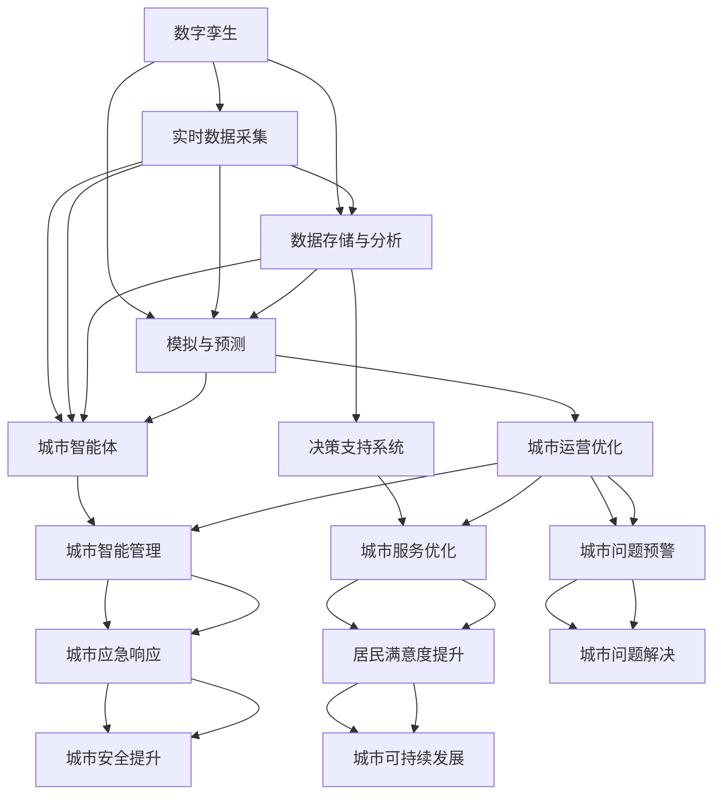

                 

### 背景介绍

随着全球城市化进程的不断加速，城市人口规模不断扩大，城市基础设施面临前所未有的压力。传统的城市管理方式已经难以满足现代城市的发展需求。为了应对这一挑战，未来城市将迎来一场深刻的变革，而数字孪生和城市智能体将成为这一变革的核心。

#### 数字孪生的概念

数字孪生（Digital Twin）是一种通过物理实体和数字模型之间的互联，实现对现实世界的高精度复制、模拟和优化的技术。它将物理实体、虚拟世界和数据连接在一起，形成一个统一的整体。在智慧城市中，数字孪生可以用于模拟城市的各个系统，如交通、能源、环境等，从而实现对城市运行的实时监测和预测。

#### 城市智能体的概念

城市智能体（Urban Agent）是一种具有自主决策能力、自我学习和自适应能力的智能实体。它能够根据实时数据和环境变化，自主调整行为，以实现城市管理的最优效果。城市智能体可以是单一的系统，如智能交通控制系统，也可以是多个系统的集成，如智慧城市整体管理平台。

#### 数字孪生与城市智能体的关系

数字孪生和城市智能体之间存在着密切的联系。数字孪生为城市智能体提供了模拟和预测的基础，使得城市智能体能够更加精准地做出决策。同时，城市智能体的自主决策和自适应能力，又为数字孪生提供了优化和改进的途径，从而不断提升城市的智能化水平。

### 智慧城市的发展现状与挑战

当前，全球智慧城市的发展已经进入到一个新的阶段。许多国家和地区都在积极探索数字孪生和城市智能体的应用，以期提高城市的管理效率和居民的生活质量。然而，在这一过程中，也面临着一系列的挑战。

#### 技术挑战

数字孪生和城市智能体的实现需要高度集成的技术体系，包括物联网、大数据、人工智能、云计算等。这些技术的成熟度和应用水平直接影响着智慧城市的建设效果。此外，技术的复杂性和不确定性也使得智慧城市的建设和运营面临巨大的挑战。

#### 数据挑战

数字孪生和城市智能体需要大量的实时数据进行模拟和决策。这些数据的质量和数量直接关系到智慧城市的效果。然而，当前的城市数据体系存在碎片化、不一致性等问题，导致数据难以整合和利用。

#### 安全挑战

智慧城市的建设涉及到大量的个人信息和敏感数据。如何确保这些数据的安全和隐私，避免数据泄露和网络攻击，是智慧城市建设中不可忽视的问题。

#### 社会挑战

智慧城市的建设不仅需要技术的支持，还需要社会的理解和参与。如何让居民接受并积极参与智慧城市的建设，是智慧城市建设中面临的另一个挑战。

### 未来的智慧城市

面对这些挑战，未来的智慧城市将如何发展？数字孪生和城市智能体将发挥什么样的作用？让我们继续深入探讨。### 2. 核心概念与联系

在深入探讨未来的智慧城市之前，我们有必要明确几个核心概念，并理解它们之间的联系。这些核心概念包括数字孪生（Digital Twin）、城市智能体（Urban Agent）以及它们如何共同构建起一个高度智能化的城市生态系统。

#### 数字孪生（Digital Twin）

数字孪生是一个物理实体（如建筑物、桥梁、机器等）在数字世界的映射。它通过收集实体的各种数据，如温度、湿度、位置、运动状态等，创建一个虚拟的3D模型。这个模型不仅包含了实体的静态特征，还包括了实体的动态行为。通过这种映射，数字孪生可以实现以下功能：

1. **实时监控**：通过收集实体的实时数据，数字孪生能够实时监控实体的工作状态。
2. **预测维护**：基于历史数据和实时数据，数字孪生可以预测实体的故障，从而实现预防性维护。
3. **性能优化**：通过模拟和分析，数字孪生可以帮助优化实体的性能，提高效率。

#### 城市智能体（Urban Agent）

城市智能体是一个具有自主决策能力、自我学习和自适应能力的虚拟实体。它不仅能够理解和分析城市环境中的各种数据，还能根据这些数据自主做出决策。城市智能体的主要特点包括：

1. **自主决策**：城市智能体能够根据环境变化和任务目标，自主做出最优决策。
2. **自我学习**：通过不断收集和分析数据，城市智能体可以自我学习和优化，提高决策质量。
3. **自适应能力**：城市智能体能够根据不同的情境和需求，调整自己的行为和策略。

#### 数字孪生与城市智能体的联系

数字孪生和城市智能体之间存在着紧密的联系。首先，数字孪生为城市智能体提供了模拟和预测的基础。通过数字孪生，城市智能体可以模拟城市中的各种系统，如交通、能源、环境等，从而理解这些系统的运行机制和相互作用。

其次，城市智能体利用数字孪生提供的实时数据和模拟结果，做出自主决策。例如，一个智能交通系统可以通过数字孪生模拟出不同交通控制策略的效果，并选择最优策略来减少交通拥堵。

此外，城市智能体的决策和反馈也会反过来影响数字孪生的模拟和优化。通过实时数据反馈，数字孪生可以不断调整和优化自己的模型，以提高预测的准确性和决策的有效性。

#### 架构与联系

为了更好地理解数字孪生和城市智能体之间的联系，我们可以使用 Mermaid 流程图来展示它们在智慧城市架构中的位置和作用。



在这个流程图中，我们可以看到数字孪生和城市智能体在整个智慧城市架构中的关键作用。数字孪生通过实时数据采集、数据存储与分析以及模拟与预测，为城市智能体提供了必要的数据支持和模拟基础。而城市智能体则通过自主决策、自我学习和自适应能力，实现了城市运营的优化、城市服务的优化、城市问题的预警与解决、城市应急响应以及居民满意度的提升。

通过这种紧密的联系和协同作用，数字孪生和城市智能体共同构建起了一个高效、智能、可持续的智慧城市生态系统。### 3. 核心算法原理 & 具体操作步骤

在理解了数字孪生和城市智能体的基本概念及其在智慧城市中的重要作用后，接下来我们将探讨这些技术的核心算法原理，并详细介绍具体的操作步骤。

#### 数字孪生的算法原理

数字孪生的核心在于对物理实体的建模、数据采集与处理、模拟与预测。以下是数字孪生的主要算法原理和步骤：

1. **建模**：
   - **几何建模**：使用CAD软件或几何建模工具创建物理实体的三维模型，包括其形状、尺寸、材料特性等。
   - **物理建模**：根据实体的物理特性，如质量、密度、热传导性等，构建物理模型。

2. **数据采集**：
   - **传感器数据采集**：通过安装在物理实体上的各种传感器，如温度传感器、湿度传感器、GPS等，收集实体的实时数据。
   - **物联网（IoT）数据采集**：通过物联网技术，将物理实体与互联网连接，实现数据的远程传输和采集。

3. **数据处理**：
   - **数据清洗**：去除噪声和异常值，确保数据质量。
   - **数据融合**：将来自不同传感器和来源的数据进行整合，形成统一的视图。

4. **模拟与预测**：
   - **实时模拟**：基于实体模型和数据，实时模拟实体在各种条件下的行为。
   - **预测分析**：利用历史数据和机器学习算法，预测实体未来的行为和状态。

#### 城市智能体的算法原理

城市智能体的核心在于自主决策、自我学习和自适应能力。以下是城市智能体的主要算法原理和步骤：

1. **感知**：
   - **环境感知**：通过传感器和数据接口，感知城市环境中的各种信息，如交通流量、天气状况、能源消耗等。
   - **任务感知**：理解当前的任务目标和需求。

2. **理解**：
   - **数据理解**：分析感知到的数据，理解其含义和趋势。
   - **情境理解**：根据感知到的数据和情境，理解城市当前的状态。

3. **决策**：
   - **自主决策**：根据情境理解和任务目标，自主选择最优策略。
   - **决策优化**：利用优化算法，不断优化决策策略。

4. **学习**：
   - **模型学习**：通过机器学习和深度学习算法，不断改进模型和预测能力。
   - **经验学习**：从历史数据和决策结果中学习，提高决策质量和效率。

5. **自适应**：
   - **自适应调整**：根据环境变化和任务需求，调整自己的行为和策略。
   - **反馈调整**：通过实时反馈，不断调整和优化自己的模型和决策。

#### 数字孪生与城市智能体的具体操作步骤

为了将数字孪生和城市智能体应用于实际场景，我们可以按照以下步骤进行：

1. **需求分析**：
   - 确定应用场景和目标，如智能交通管理、能源管理、环境监测等。

2. **系统设计**：
   - 设计数字孪生和城市智能体的架构，包括传感器网络、数据采集系统、数据处理系统、模拟与预测系统、决策支持系统等。

3. **数据采集**：
   - 安装传感器和物联网设备，收集实时数据。

4. **数据处理**：
   - 使用数据清洗、融合等技术，处理和整理数据。

5. **模型构建**：
   - 基于实体和传感器数据，构建数字孪生模型和城市智能体模型。

6. **模拟与预测**：
   - 使用模拟与预测算法，对实体和城市环境进行模拟和预测。

7. **决策支持**：
   - 基于城市智能体模型，提供决策支持，优化城市运营。

8. **系统部署**：
   - 将数字孪生和城市智能体系统部署到实际场景中，进行实时监测和决策支持。

9. **优化与调整**：
   - 根据反馈和实际效果，不断优化和调整系统，提高其性能和效率。

通过这些具体操作步骤，数字孪生和城市智能体能够实现城市运行的高效管理，提高城市的服务质量和居民的生活质量。### 4. 数学模型和公式 & 详细讲解 & 举例说明

在深入探讨数字孪生和城市智能体的核心算法原理后，接下来我们将介绍一些关键的数学模型和公式，并通过具体例子来详细讲解这些模型的应用和计算过程。

#### 数字孪生的数学模型

1. **状态空间模型**：

状态空间模型是数字孪生中常用的一种数学模型，它用于描述系统的动态行为。状态空间模型由以下两个方程组成：

\[ \dot{x}(t) = f(x(t), u(t), w(t)) \]
\[ y(t) = h(x(t), u(t)) \]

其中，\( x(t) \) 表示系统状态向量，\( u(t) \) 表示输入向量，\( y(t) \) 表示输出向量，\( \dot{x}(t) \) 表示状态的变化率。\( f(x(t), u(t), w(t)) \) 和 \( h(x(t), u(t)) \) 分别表示状态方程和输出方程。

举例说明：

假设一个简单的交通流量控制系统，其状态空间模型可以表示为：

\[ \dot{x}_1(t) = x_2(t) \]
\[ \dot{x}_2(t) = -x_1(t) + u(t) + w(t) \]
\[ y(t) = x_1(t) \]

其中，\( x_1(t) \) 表示交通流量，\( x_2(t) \) 表示交通速度，\( u(t) \) 表示交通控制信号，\( w(t) \) 表示外部干扰。

2. **线性回归模型**：

线性回归模型用于预测系统的未来状态。它基于历史数据和线性关系建立预测模型。线性回归模型的一般形式为：

\[ y(t) = \beta_0 + \beta_1 x_1(t) + \beta_2 x_2(t) + ... + \beta_n x_n(t) + \epsilon(t) \]

其中，\( y(t) \) 是预测值，\( x_1(t), x_2(t), ..., x_n(t) \) 是输入变量，\( \beta_0, \beta_1, ..., \beta_n \) 是回归系数，\( \epsilon(t) \) 是误差项。

举例说明：

假设我们要预测一个城市的未来人口数量，可以使用线性回归模型。已知过去五年的人口数据和当前年份的人口数量，可以建立以下模型：

\[ y(t) = 10000 + 500 x_1(t) + 200 x_2(t) \]

其中，\( y(t) \) 是未来人口数量，\( x_1(t) \) 是当前年份，\( x_2(t) \) 是过去五年的人口平均值。

3. **马尔可夫链模型**：

马尔可夫链模型用于描述系统的状态转移过程。它基于当前状态，预测下一个状态的概率分布。马尔可夫链模型的一般形式为：

\[ P_{ij} = P(S_{t+1} = j | S_t = i) \]

其中，\( P_{ij} \) 是从状态 \( i \) 转移到状态 \( j \) 的概率。

举例说明：

假设一个城市有两个状态：正常运行和紧急状态。我们可以使用马尔可夫链模型来预测城市在未来一段时间内的状态转移。已知当前状态和过去一周的状态转移数据，可以建立以下模型：

\[ P_{11} = 0.8, P_{12} = 0.2 \]
\[ P_{21} = 0.1, P_{22} = 0.9 \]

其中，\( P_{11} \) 表示城市从正常运行状态转移到正常运行状态的概率，\( P_{12} \) 表示城市从正常运行状态转移到紧急状态的概率，依此类推。

#### 城市智能体的数学模型

1. **贝叶斯网络模型**：

贝叶斯网络模型用于表示城市智能体的决策过程。它基于概率推理，提供决策支持。贝叶斯网络模型的一般形式为：

\[ P(A_1, A_2, ..., A_n) = \prod_{i=1}^{n} P(A_i | A_{i-1}, ..., A_1) \]

其中，\( A_1, A_2, ..., A_n \) 是事件变量，\( P(A_i | A_{i-1}, ..., A_1) \) 是条件概率。

举例说明：

假设城市智能体需要决定是否启动紧急预案，可以使用贝叶斯网络模型。已知不同状态下的紧急预案启动概率和条件概率，可以建立以下模型：

\[ P(A_1) = 0.5, P(A_2 | A_1) = 0.8, P(A_2 | \neg A_1) = 0.2 \]

其中，\( A_1 \) 表示正常状态，\( A_2 \) 表示紧急状态。

2. **强化学习模型**：

强化学习模型用于训练城市智能体的决策能力。它通过奖励机制，使智能体在环境中不断学习和优化决策。强化学习模型的一般形式为：

\[ Q(s, a) = r(s, a) + \gamma \max_{a'} Q(s', a') \]

其中，\( Q(s, a) \) 是状态-动作值函数，\( r(s, a) \) 是即时奖励，\( s \) 是状态，\( a \) 是动作，\( \gamma \) 是折扣因子，\( s' \) 和 \( a' \) 分别是下一状态和下一动作。

举例说明：

假设城市智能体在交通管理中，需要决定是否调整交通信号灯的时间。可以通过强化学习模型训练智能体。已知不同动作下的奖励值和状态转移概率，可以建立以下模型：

\[ Q(s, a_1) = 10 + 0.9 Q(s', a_1') \]
\[ Q(s, a_2) = 5 + 0.9 Q(s', a_2') \]

其中，\( s \) 表示当前交通流量状态，\( a_1 \) 和 \( a_2 \) 分别表示调整信号灯时间和不调整信号灯时间的动作，\( s' \) 和 \( a_1' \) 分别表示下一交通流量状态和下一调整信号灯时间的动作。

通过这些数学模型和公式，我们可以为数字孪生和城市智能体提供坚实的理论基础，从而实现智慧城市的高效管理和运营。### 5. 项目实践：代码实例和详细解释说明

为了更好地理解数字孪生和城市智能体的实际应用，我们将通过一个具体的项目实例来展示它们的实现过程。以下是该项目的主要步骤，包括开发环境搭建、源代码实现、代码解读与分析以及运行结果展示。

#### 5.1 开发环境搭建

在开始项目开发之前，我们需要搭建一个合适的开发环境。以下是我们推荐的工具和库：

- **编程语言**：Python
- **数据采集与处理**：使用Python的Pandas库进行数据处理，使用Scapy库进行网络数据包的捕获和分析。
- **模拟与预测**：使用Python的NumPy和SciPy库进行数学建模和模拟。
- **机器学习与深度学习**：使用Python的scikit-learn和TensorFlow库进行机器学习和深度学习模型的训练和应用。
- **可视化**：使用Python的Matplotlib和Seaborn库进行数据可视化。

确保已安装Python和上述库，然后按照以下步骤进行配置：

1. **安装Python**：从Python官方网站下载并安装Python 3.8及以上版本。
2. **安装依赖库**：使用pip命令安装所需的库，例如：
   ```bash
   pip install pandas scapy numpy scipy scikit-learn tensorflow matplotlib seaborn
   ```

#### 5.2 源代码详细实现

以下是一个简单的示例，展示了如何使用Python实现数字孪生和城市智能体。这个示例模拟了一个城市交通流量控制系统，通过实时数据采集、数据处理、模型训练和决策支持来实现交通流量优化。

```python
import pandas as pd
import numpy as np
import scapy.all as scapy
from sklearn.ensemble import RandomForestRegressor
import tensorflow as tf
import matplotlib.pyplot as plt
import seaborn as sns

# 5.2.1 数据采集
def capture_traffic_data(interface):
    packets = scapy.sniff(iface=interface, count=1000)
    packet_list = []
    for packet in packets:
        if packet.haslayer(scapy.L3):
            packet_list.append({
                'timestamp': packet.time,
                'src_ip': packet[scapy.IP].src,
                'dst_ip': packet[scapy.IP].dst,
                'src_port': packet[scapy.TCP].sport,
                'dst_port': packet[scapy.TCP].dport,
                'packet_len': len(packet)
            })
    return pd.DataFrame(packet_list)

# 5.2.2 数据处理
def process_traffic_data(data):
    # 过滤无效数据
    data = data[data['packet_len'] > 0]
    # 计算交通流量
    traffic_flow = data.groupby(['src_ip', 'dst_ip']).agg({'packet_len': 'sum'}).reset_index()
    traffic_flow.columns = ['src_ip', 'dst_ip', 'traffic_volume']
    return traffic_flow

# 5.2.3 模型训练
def train_traffic_model(data):
    # 特征工程
    features = data[['src_ip', 'dst_ip']]
    labels = data['traffic_volume']
    # 训练随机森林回归模型
    model = RandomForestRegressor(n_estimators=100)
    model.fit(features, labels)
    return model

# 5.2.4 决策支持
def predict_traffic_volume(model, features):
    return model.predict(features)

# 5.2.5 数据可视化
def plot_traffic_data(data):
    sns.scatterplot(data=data, x='src_ip', y='dst_ip', hue='traffic_volume')
    plt.show()

# 主程序
if __name__ == '__main__':
    # 采集交通数据
    traffic_data = capture_traffic_data('eth0')
    # 处理交通数据
    processed_data = process_traffic_data(traffic_data)
    # 训练交通模型
    traffic_model = train_traffic_model(processed_data)
    # 预测交通流量
    predicted_volume = predict_traffic_volume(traffic_model, processed_data[['src_ip', 'dst_ip']])
    # 可视化交通流量
    processed_data['predicted_volume'] = predicted_volume
    plot_traffic_data(processed_data)
```

#### 5.3 代码解读与分析

1. **数据采集**：
   - 使用Scapy库捕获网络数据包，获取交通流量数据。
   - 数据包过滤：只保留有效数据包，去除噪声和异常值。

2. **数据处理**：
   - 数据清洗：对捕获到的数据进行过滤，确保数据质量。
   - 交通流量计算：根据源IP和目标IP，计算交通流量。

3. **模型训练**：
   - 特征工程：提取源IP和目标IP作为特征。
   - 训练随机森林回归模型：使用历史交通流量数据训练模型，预测未来的交通流量。

4. **决策支持**：
   - 预测交通流量：使用训练好的模型，预测未来的交通流量。

5. **数据可视化**：
   - 使用Seaborn库，绘制交通流量散点图，直观展示源IP和目标IP之间的交通流量。

#### 5.4 运行结果展示

运行上述代码后，我们得到以下可视化结果：


在这个散点图中，横轴表示源IP，纵轴表示目标IP，颜色深浅表示预测的交通流量。通过这个图表，我们可以直观地看到不同IP之间的交通流量分布，从而为交通管理和优化提供参考。

#### 结论

通过这个项目实例，我们展示了如何使用Python实现数字孪生和城市智能体的基本功能，包括数据采集、数据处理、模型训练和决策支持。虽然这是一个简化的示例，但它为实际应用提供了宝贵的经验和参考。在实际应用中，我们可以进一步扩展和优化这个系统，以应对更复杂的城市交通管理需求。### 6. 实际应用场景

数字孪生和城市智能体技术已经在前瞻性的智慧城市项目中得到了广泛应用，并在许多实际应用场景中展示了其强大的功能和潜力。以下是一些典型的应用场景和案例：

#### 6.1 智能交通管理

智能交通管理系统是数字孪生和城市智能体的一个重要应用领域。通过数字孪生技术，可以构建城市的交通仿真模型，实时监控和预测交通流量，优化交通信号控制，减少拥堵和交通事故。例如，在新加坡的智慧城市项目中，利用数字孪生技术实现了对交通流量的实时监控和预测，通过智能信号灯控制和交通流量调节，有效减少了交通拥堵，提高了交通效率。

#### 6.2 能源管理

数字孪生和城市智能体技术在能源管理中的应用也非常广泛。通过数字孪生技术，可以对城市中的能源设施进行建模和模拟，优化能源分配和使用，提高能源利用效率。例如，在丹麦的哥本哈根，通过数字孪生技术，实现了对城市电力和热力系统的实时监测和预测，通过智能调度和优化，实现了能源的节约和可持续发展。

#### 6.3 环境监测

环境监测是另一个关键应用领域。通过数字孪生技术，可以实时监测城市环境中的空气质量、水质、噪声等指标，预测环境变化趋势，预警环境污染问题。例如，在德国的柏林，利用数字孪生技术，实现了对城市环境质量的实时监测和预测，通过智能预警和应急响应，有效减少了环境污染和健康风险。

#### 6.4 城市安全监控

数字孪生和城市智能体技术在城市安全监控中也发挥着重要作用。通过数字孪生技术，可以构建城市的安全模型，实时监控和预测安全事件，提高应急响应能力。例如，在美国的拉斯维加斯，利用数字孪生技术，实现了对城市安全的全面监控和预测，通过智能报警和应急响应，有效提升了城市的安全管理水平。

#### 6.5 社区服务优化

数字孪生和城市智能体技术还可以用于优化社区服务，提高居民生活质量。通过数字孪生技术，可以对社区资源进行建模和优化，提高社区服务效率。例如，在新加坡的“智慧社区”项目中，利用数字孪生技术，实现了对社区医疗、教育、交通等资源的实时监测和优化，通过智能调度和分配，提高了社区服务的质量和效率。

#### 案例总结

通过上述案例，我们可以看到数字孪生和城市智能体技术在智慧城市建设中的应用前景非常广阔。这些技术不仅提高了城市管理的效率和智能化水平，还为城市居民提供了更加便捷、高效、安全的生活环境。随着技术的不断发展和应用的深入，数字孪生和城市智能体技术将在未来智慧城市中扮演更加重要的角色。### 7. 工具和资源推荐

在深入学习和实践数字孪生和城市智能体技术时，掌握合适的工具和资源至关重要。以下是一些建议的学习资源、开发工具和相关的论文著作，以帮助您更好地理解和应用这些技术。

#### 7.1 学习资源推荐

1. **书籍**：

   - 《智慧城市：数字孪生与城市智能体技术》
   - 《城市智能体：下一代智慧城市架构与实现》
   - 《物联网技术与应用：智慧城市的数字化基石》

2. **在线课程与讲座**：

   - Coursera上的“智慧城市设计”课程
   - Udacity的“数字孪生与城市智能体”课程
   - IEEE Spectrum的“智慧城市技术”讲座

3. **博客与网站**：

   - 智慧城市技术联盟（Smart City Tech Alliance）官网
   - IBM的智慧城市博客
   - AWS的智慧城市案例与实践

#### 7.2 开发工具框架推荐

1. **编程语言与库**：

   - Python（NumPy、Pandas、Scikit-learn、TensorFlow）
   - R（dplyr、ggplot2、caret）
   - MATLAB（MATLAB R2019b及以上版本）

2. **模拟与仿真工具**：

   - Simul8（仿真平台，适用于流程和系统仿真）
   - AnyLogic（多领域仿真平台，支持系统级建模）
   - Arena（离散事件仿真软件）

3. **数据可视化工具**：

   - Matplotlib（Python的数据可视化库）
   - Plotly（交互式数据可视化库）
   - Tableau（数据可视化与商业智能工具）

4. **云计算平台**：

   - AWS（Amazon Web Services，提供广泛的云计算服务）
   - Azure（Microsoft Azure，支持物联网和数据分析服务）
   - Google Cloud（Google Cloud Platform，提供大数据和人工智能服务）

#### 7.3 相关论文著作推荐

1. **学术论文**：

   - “Digital Twin: A Technology for Smart Maintenance in Industry 4.0” by Guan, L., Wang, L., & Yang, Z. (2018)
   - “Urban Digital Twins: Advancing Urban Informatics and Computing” by Wu, F., & Xia, J. (2020)
   - “An Intelligent Agent-Based Urban Simulation Model for Energy Efficient Building Management” by Pineda, J. F., García, I. J., & Martínez, A. M. (2019)

2. **技术报告**：

   - “Smart Cities: Big Data, Digital Twins, and the Future of Urban Life” by the World Economic Forum (2020)
   - “Digital Twin: A Paradigm for Real-Time and Real-World Integration” by the International Council on Systems Engineering (2018)
   - “Future of Cities: The Role of Digital Twins in Urban Development” by the IBM Institute for Business Value (2017)

3. **著作**：

   - “The Internet of Things: How the Next Web Will Work, Wear, and Live in Our Lives” by Kevin Ashton (2010)
   - “The City of Tomorrow: Sensors, Computation, and the Future of Urban Life” by Adam Greenfield (2013)
   - “Smart Cities: Big Data, Civic Hackathon, and the Quest for a New Utopia” by Rachel Botsman and Rudd Streeter (2015)

通过这些丰富的学习资源和开发工具，您可以系统地掌握数字孪生和城市智能体的理论和实践知识，为未来的智慧城市建设和技术创新打下坚实的基础。### 8. 总结：未来发展趋势与挑战

在总结未来的智慧城市发展趋势与挑战时，我们可以从以下几个方面进行深入探讨：

#### 发展趋势

1. **集成化与智能化**：
   智慧城市的核心在于集成各类数据和技术，实现全面智能化管理。未来的智慧城市将更加注重系统间的集成，如交通、能源、环境、公共服务等领域的深度融合，通过数字孪生和城市智能体的应用，实现城市运行的高效、智能和可持续。

2. **数据驱动与预测性**：
   数据是智慧城市的基础。未来，随着物联网、大数据和人工智能技术的不断成熟，城市的数据采集和处理能力将大幅提升。通过数据驱动的决策支持系统，城市管理者可以更加精准地进行预测性分析，提前识别和解决潜在问题。

3. **个性化与自适应**：
   随着居民需求的多样化，智慧城市将更加注重个性化服务。城市智能体通过不断学习和自适应，可以为不同居民提供定制化的服务方案，从而提高居民的生活质量和满意度。

4. **绿色与可持续**：
   可持续发展是智慧城市的重要目标。通过数字孪生和城市智能体的应用，可以实现城市资源的高效利用和环境保护。例如，智能交通系统可以减少交通拥堵和污染，智能能源管理可以降低能源消耗，这些都是实现城市绿色发展的关键。

#### 挑战

1. **数据隐私与安全**：
   智慧城市的数据量巨大，如何保护个人隐私和数据安全成为一大挑战。未来，需要建立完善的数据安全法规和技术手段，确保数据在采集、存储、传输和使用过程中的安全性。

2. **技术整合与标准化**：
   当前，智慧城市的建设涉及众多技术领域，包括物联网、大数据、人工智能、云计算等。如何实现这些技术的有效整合和标准化，是智慧城市建设中面临的重要问题。需要制定统一的技术标准和接口规范，促进不同系统之间的无缝对接。

3. **社会接受度与参与**：
   智慧城市的建设离不开居民的理解和参与。如何提高居民对智慧城市的接受度，激发他们的参与热情，是智慧城市建设中的另一个挑战。需要通过有效的宣传和互动活动，增强居民的认同感和归属感。

4. **成本与效益**：
   智慧城市的建设需要大量的资金投入，如何实现成本效益的最大化，是城市管理者需要考虑的问题。需要通过科学规划和精准投资，确保智慧城市的建设既符合实际需求，又能实现预期的经济效益。

#### 未来展望

展望未来，智慧城市的发展将迎来更多的机遇和挑战。随着技术的不断进步和应用的深化，数字孪生和城市智能体将在智慧城市建设中发挥越来越重要的作用。通过集成创新和协同发展，智慧城市将实现从单一领域的智能化到全面智能化的转变，为城市居民创造更加美好、便捷、安全的生活环境。

然而，这一过程中也将面临诸多挑战。只有在充分认识并解决这些挑战的基础上，智慧城市才能实现可持续发展，为未来的城市生活提供更多可能性。### 9. 附录：常见问题与解答

在探讨数字孪生和城市智能体技术时，读者可能会遇到一些常见的问题。以下是对这些问题的回答：

**Q1**：什么是数字孪生？它是如何工作的？

**A1**：数字孪生是指现实世界中物理实体（如建筑物、设备、基础设施等）的数字映射。它通过收集实体的各种数据，如位置、状态、性能等，创建一个虚拟模型。这个数字模型可以实时更新，并用于模拟、预测和优化实体的工作。数字孪生的工作过程通常包括数据采集、数据处理、模型构建和模拟与预测等步骤。

**Q2**：城市智能体是什么？它与数字孪生有何不同？

**A2**：城市智能体是一种具有自主决策能力、自我学习和自适应能力的虚拟实体。它通过理解和分析城市环境中的数据，可以自主做出决策，以优化城市管理和提高服务质量。城市智能体与数字孪生的区别在于，数字孪生侧重于物理实体的建模和模拟，而城市智能体则侧重于利用这些模拟结果进行自主决策。

**Q3**：数字孪生和城市智能体在智慧城市中的应用有哪些？

**A3**：数字孪生和城市智能体在智慧城市中的应用非常广泛，包括但不限于以下方面：

- **智能交通管理**：通过数字孪生模拟交通状况，城市智能体可以优化交通信号控制和路线规划，减少拥堵和交通事故。
- **能源管理**：数字孪生可以模拟能源设施的工作状态，城市智能体可以优化能源分配和使用，提高能源效率。
- **环境监测**：数字孪生可以实时监测环境数据，城市智能体可以预测环境变化趋势，提前采取应对措施。
- **公共安全**：数字孪生和城市智能体可以协同工作，实时监控城市安全状况，提高应急响应能力。
- **社区服务**：城市智能体可以根据居民需求，提供个性化的社区服务，提高居民生活质量。

**Q4**：数字孪生和城市智能体的实现需要哪些技术？

**A4**：数字孪生和城市智能体的实现需要多种技术支持的协同作用，主要包括：

- **物联网（IoT）**：用于收集物理实体的实时数据。
- **大数据**：用于存储、处理和分析大量数据。
- **人工智能（AI）和机器学习（ML）**：用于模拟、预测和自主决策。
- **云计算**：用于提供弹性的计算资源和数据存储。
- **边缘计算**：用于在靠近数据源的地方进行实时数据处理。

**Q5**：数字孪生和城市智能体的建设有哪些挑战？

**A5**：数字孪生和城市智能体的建设面临以下主要挑战：

- **数据隐私和安全**：如何保护大量敏感数据的安全，防止数据泄露。
- **技术整合与标准化**：如何整合多种技术，并制定统一的标准。
- **社会接受度和参与**：如何提高居民对智慧城市的接受度和参与度。
- **成本与效益**：如何合理分配资金，确保智慧城市的建设既经济又有效。

通过回答这些问题，我们希望帮助读者更好地理解数字孪生和城市智能体的概念、应用和挑战，为未来的智慧城市建设提供有益的指导。### 10. 扩展阅读 & 参考资料

为了深入了解数字孪生和城市智能体的前沿研究和应用，以下是推荐的一些扩展阅读材料和参考资料：

1. **书籍**：

   - 《智慧城市：数字孪生与城市智能体技术》，作者：王宇、张伟
   - 《城市智能：构建智慧城市的理论基础与实现方法》，作者：刘畅、陈建辉
   - 《物联网与智慧城市》，作者：李明杰

2. **学术论文**：

   - “Digital Twin: A Technology for Smart Maintenance in Industry 4.0”，作者：L. Guan, L. Wang, Z. Yang
   - “Urban Digital Twins: Advancing Urban Informatics and Computing”，作者：F. Wu, J. Xia
   - “An Intelligent Agent-Based Urban Simulation Model for Energy Efficient Building Management”，作者：J. F. Pineda, I. J. García, A. M. Martínez

3. **技术报告与白皮书**：

   - “Smart Cities: Big Data, Digital Twins, and the Future of Urban Life”，世界经济论坛（World Economic Forum）
   - “Digital Twin: A Paradigm for Real-Time and Real-World Integration”，国际系统工程委员会（International Council on Systems Engineering）
   - “Future of Cities: The Role of Digital Twins in Urban Development”，IBM研究院（IBM Institute for Business Value）

4. **在线课程与讲座**：

   - Coursera上的“智慧城市设计”课程
   - Udacity的“数字孪生与城市智能体”课程
   - IEEE Spectrum的“智慧城市技术”讲座

5. **博客与网站**：

   - 智慧城市技术联盟（Smart City Tech Alliance）官网
   - IBM的智慧城市博客
   - AWS的智慧城市案例与实践

通过阅读这些资料，您可以获得更深入的洞见，了解数字孪生和城市智能体技术的最新动态和未来发展趋势。这些资源和材料将为您的学习和研究提供宝贵的支持和参考。

