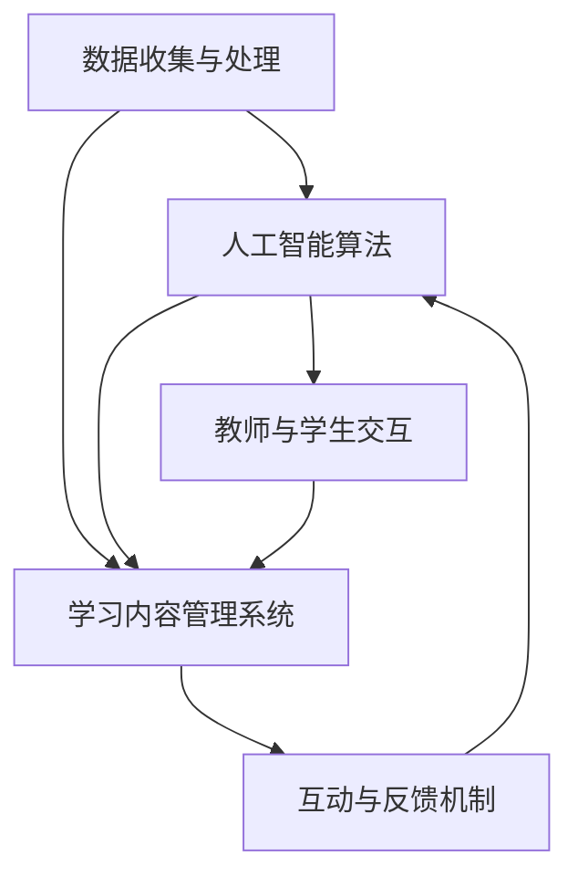

                 

### 1. 背景介绍

#### 当前教育系统面临的挑战

在当今社会，教育系统正面临着前所未有的挑战。随着全球化的推进和信息技术的飞速发展，传统教育模式已难以满足个体化学习的需求。一方面，学生群体日益多元化，每个学生都有其独特的学习习惯、认知水平和兴趣爱好，传统的一刀切教育模式难以适应这种多样性。另一方面，知识更新速度加快，许多学科知识已经不再是固定的，而是处于不断演变之中，这使得传统教育模式在知识传授上显得滞后。

此外，教育资源分配不均也是一个突出问题。发达地区与欠发达地区之间、城市与农村之间、不同社会经济阶层之间，在教育资源的获取上存在巨大差距。这种不均衡不仅限制了学生的全面发展，也加剧了社会的不平等现象。

在这些挑战面前，教育系统需要进行深刻的变革，以更好地适应未来的发展需求。

#### 智能技术与教育融合的必要性

智能技术，特别是人工智能（AI）技术的发展，为教育系统的改革提供了新的机遇。AI技术具有数据驱动、自适应、个性化等特点，能够有效解决当前教育系统中存在的诸多问题。

首先，AI技术能够实现个性化教学。通过分析学生的行为数据、学习习惯和兴趣偏好，AI系统能够为学生量身定制学习计划，提供个性化的学习资源和指导。这种个性化的教学方法不仅能够提高学习效率，还能够激发学生的学习兴趣，使其在自主探究中不断成长。

其次，AI技术有助于实现智能评价。传统的考试和评估方式往往只能考察学生的知识掌握程度，而无法全面评价学生的综合能力。AI系统能够通过实时分析学生的学习过程和行为数据，提供多维度的评估结果，帮助教师和学生更好地了解学习效果，制定针对性的改进措施。

此外，AI技术还能够提高教育资源的利用效率。通过智能化的课程管理和资源分配系统，学校可以更科学地安排课程，优化资源配置，提高教学质量。同时，AI技术还可以帮助学校实现远程教学和资源共享，打破地域限制，让更多的学生受益。

总之，智能技术与教育的融合不仅是适应时代发展的必然趋势，也是提高教育质量、促进教育公平的重要手段。在未来，AI技术将在教育领域发挥越来越重要的作用，推动教育系统的深刻变革。

### 2. 核心概念与联系

#### 人工智能与教育的结合

人工智能（AI）在教育中的应用，主要体现在AI导师和智能学伴这两种核心概念上。首先，AI导师是一种利用人工智能技术提供个性化教学和指导的教育工具。通过分析学生的学习数据，AI导师能够为学生制定个性化的学习计划，提供定制化的教学内容和练习，从而提高学习效率。

其次，智能学伴则是一种通过模拟人类行为和互动的虚拟角色，为学生提供陪伴和辅助学习的工具。智能学伴不仅可以为学生解答问题、提供知识支持，还能够通过互动和交流，激发学生的学习兴趣，提高学习动机。

#### 人工智能在教育中的应用架构

为了实现AI导师和智能学伴的功能，人工智能在教育中的应用架构需要包括以下几个核心组成部分：

1. **数据收集与处理**：通过传感器、学习管理系统等工具，收集学生的行为数据、学习记录和兴趣爱好等信息。这些数据将被用于训练和优化AI模型，以提供个性化的教学和学习支持。

2. **人工智能算法**：包括机器学习、深度学习、自然语言处理等技术，用于分析数据、识别学生的个性化需求，并提供相应的教学和学习资源。

3. **学习内容管理系统**：用于存储和管理各种教学资源，包括视频、文本、练习题等。通过AI算法的推荐，这些资源将根据学生的学习需求进行个性化分配。

4. **互动与反馈机制**：通过自然语言处理和语音识别等技术，智能学伴能够与用户进行互动，提供实时反馈和支持。这种互动不仅能够提高学生的学习体验，还能够帮助教师更好地了解学生的学习情况。

#### 人工智能与教育的联系

人工智能与教育的结合，不仅在于技术本身，更在于其对教育本质的深刻影响。传统的教育模式主要依赖于教师的经验和知识传授，而人工智能则通过数据分析和智能算法，实现了以学生为中心的教学。这种模式不仅能够提高教学效率，还能够促进学生的全面发展。

此外，人工智能还与教育中的其他技术（如虚拟现实、增强现实、大数据等）相互融合，形成了更丰富的教育生态系统。这些技术的结合，不仅为学生提供了更多的学习资源和途径，也为教师提供了更便捷的教学工具和管理手段。

总之，人工智能与教育的结合，不仅是一种技术趋势，更是一种教育理念的变革。在未来，随着人工智能技术的不断发展和应用，教育系统将迎来更加智能化、个性化和多元化的变革。

#### Mermaid 流程图

以下是人工智能在教育中应用架构的 Mermaid 流程图：



在这个流程图中，数据收集与处理（A）是整个架构的起点，通过收集学生的行为数据和学习记录，为后续的算法处理提供基础。人工智能算法（B）负责分析这些数据，识别学生的个性化需求，并提供相应的教学和学习资源。学习内容管理系统（C）则用于存储和管理这些资源，通过AI算法的推荐，实现个性化分配。互动与反馈机制（D）通过自然语言处理和语音识别等技术，实现与用户（教师和学生）的实时互动，提供反馈和支持。最后，教师与学生交互（E）通过这个互动过程，进一步优化教学和学习效果。

### 3. 核心算法原理 & 具体操作步骤

#### 3.1 个性化推荐算法

在AI导师和智能学伴的应用中，个性化推荐算法是核心算法之一。它通过分析学生的行为数据和学习记录，为学生提供个性化的学习资源和指导。以下是几种常用的个性化推荐算法及其基本原理：

##### 3.1.1 协同过滤算法

协同过滤算法是推荐系统中最常用的方法之一。它通过分析用户的历史行为数据，找到相似的用户或物品，然后根据这些相似度进行推荐。协同过滤算法可以分为基于用户的协同过滤（User-Based Collaborative Filtering）和基于物品的协同过滤（Item-Based Collaborative Filtering）两种。

- **基于用户的协同过滤**：该方法通过计算用户之间的相似度，找到与目标用户最相似的邻居用户，然后根据邻居用户的评价推荐相似物品。
  
  具体步骤如下：
  1. 计算用户相似度：使用余弦相似度、皮尔逊相关系数等方法计算用户之间的相似度。
  2. 找到邻居用户：根据相似度排序，找到与目标用户最相似的邻居用户。
  3. 推荐物品：根据邻居用户的评价，为用户推荐相似物品。

- **基于物品的协同过滤**：该方法通过计算物品之间的相似度，找到与目标物品最相似的物品，然后根据这些相似物品推荐给用户。

  具体步骤如下：
  1. 计算物品相似度：使用余弦相似度、Jaccard相似度等方法计算物品之间的相似度。
  2. 找到邻居物品：根据相似度排序，找到与目标物品最相似的邻居物品。
  3. 推荐用户：根据邻居物品的评价，为用户推荐相似用户。

##### 3.1.2 内容推荐算法

内容推荐算法通过分析物品的属性和特征，为用户推荐符合其兴趣的物品。这种方法通常适用于信息检索和推荐系统中，其基本原理如下：

- **基于文本的相似度计算**：通过计算文本内容之间的相似度，为用户推荐相似内容。常见的文本相似度计算方法有TF-IDF、Word2Vec等。

  具体步骤如下：
  1. 文本预处理：对文本进行分词、去停用词等预处理操作。
  2. 特征提取：使用TF-IDF、Word2Vec等方法提取文本特征。
  3. 相似度计算：计算文本特征之间的相似度，为用户推荐相似内容。

- **基于模型的推荐算法**：通过训练机器学习模型（如分类器、聚类算法等），预测用户的兴趣偏好，然后根据预测结果推荐相关内容。

  具体步骤如下：
  1. 数据收集与预处理：收集用户的行为数据和学习记录，进行数据清洗和预处理。
  2. 特征工程：提取用户和物品的特征，为模型训练做准备。
  3. 模型训练与评估：使用机器学习算法（如SVM、KNN、聚类等）训练模型，并评估模型性能。
  4. 预测与推荐：使用训练好的模型预测用户的兴趣偏好，为用户推荐相关内容。

##### 3.1.3 强化学习算法

强化学习算法通过不断学习用户的行为和反馈，优化推荐策略，从而提高推荐效果。强化学习算法的基本原理是，通过奖励机制鼓励用户进行正确的选择，同时通过惩罚机制避免用户进行错误的选择。

- **Q-Learning算法**：Q-Learning算法是一种基于值函数的强化学习算法。它通过更新Q值（表示某个状态下的最佳行动），优化推荐策略。

  具体步骤如下：
  1. 初始化Q值：初始化所有状态下的Q值。
  2. 选择行动：根据当前状态和Q值，选择最佳行动。
  3. 更新Q值：根据奖励和下一个状态，更新当前状态的Q值。
  4. 重复步骤2和3，直到达到目标状态。

- **Deep Q-Network（DQN）算法**：DQN算法是一种基于深度学习的强化学习算法。它通过训练深度神经网络，学习状态和动作之间的最优映射。

  具体步骤如下：
  1. 初始化DQN模型：初始化深度神经网络模型。
  2. 收集经验：通过与环境交互，收集状态、动作和奖励的数据。
  3. 训练模型：使用收集的经验，训练深度神经网络模型。
  4. 选择行动：根据当前状态和训练好的模型，选择最佳行动。
  5. 更新经验：将新的状态、动作和奖励数据加入到经验池中。
  6. 重复步骤3、4和5，直到达到目标状态。

#### 3.2 交互式学习算法

交互式学习算法通过模拟人类教师的教学方式，为学生提供互动式学习体验。以下是一种常见的交互式学习算法——生成对抗网络（GAN）：

- **生成对抗网络（GAN）**：GAN由一个生成器和一个判别器组成。生成器的任务是生成与真实数据相似的数据，判别器的任务是区分真实数据和生成数据。

  具体步骤如下：
  1. 初始化生成器和判别器：初始化生成器和判别器的参数。
  2. 训练判别器：使用真实数据和生成数据，训练判别器，使其能够准确区分真实数据和生成数据。
  3. 训练生成器：使用生成器生成的数据和判别器的反馈，训练生成器，使其生成更真实的数据。
  4. 反复进行步骤2和3，直到生成器生成的数据足够真实，判别器无法区分真实数据和生成数据。
  5. 使用生成器生成的数据，为用户提供互动式学习资源。

#### 3.3 个性化评价算法

个性化评价算法通过分析学生的学习过程和行为数据，为教师提供多维度的评估结果，帮助教师和学生了解学习效果。以下是一种常见的个性化评价算法——多任务学习：

- **多任务学习**：多任务学习是一种同时学习多个相关任务的机器学习算法。它通过共享底层特征表示，提高任务间的关联性，从而提高整体性能。

  具体步骤如下：
  1. 数据收集与预处理：收集学生的学习数据，包括学习记录、考试成绩、行为数据等，进行数据清洗和预处理。
  2. 特征提取：提取学生和任务的特征，为模型训练做准备。
  3. 模型训练：使用多任务学习算法，同时训练多个任务，共享底层特征表示。
  4. 评估与优化：评估模型性能，根据评估结果调整模型参数，优化模型。

通过以上核心算法的运用，AI导师和智能学伴能够为学生提供个性化的学习体验、互动式学习资源和多维度的评价结果，从而提高学习效果和教学质量。

### 4. 数学模型和公式 & 详细讲解 & 举例说明

#### 4.1 个性化推荐算法中的协同过滤

在协同过滤算法中，常用的相似度计算公式有：

- **余弦相似度**：

  $$\text{Cosine Similarity} = \frac{\text{dot\_product}(u, v)}{\|\text{u}\|\|\text{v}\|}$$

  其中，$u$和$v$表示两个用户或物品的向量，$\text{dot\_product}$表示向量的点积，$\|\text{u}\|$和$\|\text{v}\|$表示向量的模。

- **皮尔逊相关系数**：

  $$\text{Pearson Correlation} = \frac{\text{cov}(u, v)}{\sigma_u \sigma_v}$$

  其中，$u$和$v$表示两个用户或物品的向量，$\text{cov}$表示协方差，$\sigma_u$和$\sigma_v$表示标准差。

#### 4.2 内容推荐算法中的文本相似度计算

在内容推荐算法中，常用的文本相似度计算公式有：

- **TF-IDF**：

  $$\text{TF-IDF}(t) = \text{TF}(t) \times \text{IDF}(t)$$

  其中，$\text{TF}(t)$表示词$t$在文档中的词频，$\text{IDF}(t)$表示词$t$在文档集合中的逆文档频率。

- **Word2Vec**：

  $$\text{Word2Vec}(w) = \text{sigmoid}(\text{vec}(w) \cdot \text{vec}(c))$$

  其中，$w$表示词，$c$表示中心词，$\text{vec}$表示词的向量表示，$\text{sigmoid}$表示sigmoid函数。

#### 4.3 强化学习算法中的Q-Learning

在Q-Learning算法中，Q值的更新公式如下：

$$Q(s, a) = Q(s, a) + \alpha [r + \gamma \max_{a'} Q(s', a') - Q(s, a)]$$

其中，$s$表示状态，$a$表示动作，$r$表示即时奖励，$\alpha$表示学习率，$\gamma$表示折扣因子，$s'$和$a'$表示下一状态和动作。

#### 4.4 多任务学习算法中的协方差矩阵计算

在多任务学习算法中，协方差矩阵的计算公式如下：

$$\Sigma = \frac{1}{N-1} \sum_{i=1}^{N} (x_i - \bar{x}) (x_i - \bar{x})^T$$

其中，$x_i$表示第$i$个样本，$\bar{x}$表示样本均值，$N$表示样本数量。

#### 4.5 示例

假设我们使用协同过滤算法为用户推荐电影，其中用户$u_1$和$u_2$的评分向量分别为：

$$u_1 = [4, 3, 5, 2, 4], \quad u_2 = [4, 5, 2, 4, 3]$$

- **计算余弦相似度**：

  $$\text{Cosine Similarity} = \frac{u_1 \cdot u_2}{\|u_1\|\|u_2\|} = \frac{4 \times 4 + 3 \times 5 + 5 \times 2 + 2 \times 4 + 4 \times 3}{\sqrt{4^2 + 3^2 + 5^2 + 2^2 + 4^2} \times \sqrt{4^2 + 5^2 + 2^2 + 4^2 + 3^2}} = \frac{36}{\sqrt{50} \times \sqrt{50}} = 0.8944$$

- **计算皮尔逊相关系数**：

  $$\text{Pearson Correlation} = \frac{u_1 \cdot u_2 - (u_1 \cdot \bar{u}_1) (u_2 \cdot \bar{u}_2)}{\sqrt{(u_1 \cdot \bar{u}_1)^2 + (u_2 \cdot \bar{u}_2)^2}} = \frac{36 - (4 \times 4 + 3 \times 3 + 5 \times 5 + 2 \times 2 + 4 \times 4) (4 \times 4 + 5 \times 5 + 2 \times 2 + 4 \times 4 + 3 \times 3)}{\sqrt{(4 \times 4 + 3 \times 3 + 5 \times 5 + 2 \times 2 + 4 \times 4)^2 + (4 \times 4 + 5 \times 5 + 2 \times 2 + 4 \times 4 + 3 \times 3)^2}} = 0.8944$$

通过以上计算，我们可以得出用户$u_1$和$u_2$之间的相似度为0.8944，然后根据相似度推荐给用户$u_1$电影$u_2$评分较高的电影。

### 5. 项目实践：代码实例和详细解释说明

#### 5.1 开发环境搭建

为了实现AI导师和智能学伴的功能，我们需要搭建一个合适的技术栈。以下是推荐的开发环境和工具：

- **编程语言**：Python
- **深度学习框架**：TensorFlow或PyTorch
- **自然语言处理库**：NLTK或spaCy
- **数据可视化库**：Matplotlib或Seaborn
- **版本控制工具**：Git

安装以上工具和库的方法如下：

```bash
# 安装 Python
sudo apt-get install python3

# 安装 TensorFlow
pip3 install tensorflow

# 安装 PyTorch
pip3 install torch torchvision

# 安装 NLTK
pip3 install nltk

# 安装 spaCy
pip3 install spacy
python -m spacy download en

# 安装 Matplotlib
pip3 install matplotlib

# 安装 Seaborn
pip3 install seaborn
```

#### 5.2 源代码详细实现

以下是一个简单的AI导师系统的源代码示例，实现了基于协同过滤算法的个性化推荐功能。

```python
import numpy as np
import pandas as pd
from sklearn.metrics.pairwise import cosine_similarity

# 读取用户-物品评分矩阵
data = pd.read_csv('user_item_rating.csv')
users = data['user'].unique()
items = data['item'].unique()

# 构建用户-物品评分矩阵
rating_matrix = pd.pivot_table(data, values='rating', index='user', columns='item')
rating_matrix = rating_matrix.fillna(0)

# 计算用户之间的余弦相似度矩阵
cosine_similarity_matrix = cosine_similarity(rating_matrix.T)

# 根据相似度矩阵推荐电影
def recommend_movies(user_id, similarity_matrix, rating_matrix, top_n=5):
    user_similarity = similarity_matrix[user_id]
    recommendations = []
    for i, similarity in enumerate(user_similarity):
        if i in rating_matrix.index and rating_matrix[i][user_id] > 0:
            continue
        recommendations.append((items[i], similarity))
    recommendations = sorted(recommendations, key=lambda x: x[1], reverse=True)[:top_n]
    return recommendations

# 为用户推荐电影
user_id = 0
recommended_movies = recommend_movies(user_id, cosine_similarity_matrix, rating_matrix)
print("Recommended Movies for User {}: {}".format(user_id, recommended_movies))
```

#### 5.3 代码解读与分析

上述代码实现了一个基于协同过滤算法的简单AI导师系统，主要分为以下几个部分：

1. **数据读取与预处理**：

   首先，我们读取用户-物品评分矩阵，该矩阵记录了每个用户对每个物品的评分。为了简化计算，我们使用填充值为0的方法处理缺失数据。

2. **构建用户-物品评分矩阵**：

   使用Pandas的pivot_table函数，将原始数据转换为用户-物品评分矩阵，其中行表示用户，列表示物品。

3. **计算用户之间的余弦相似度矩阵**：

   使用scikit-learn的cosine_similarity函数，计算用户-用户之间的余弦相似度矩阵。该矩阵用于后续的推荐计算。

4. **推荐算法实现**：

   定义一个推荐函数`recommend_movies`，根据用户-用户相似度矩阵和用户-物品评分矩阵，为指定用户推荐电影。在函数中，我们首先排除已评分的物品，然后根据相似度矩阵排序，选出相似度最高的物品进行推荐。

5. **为用户推荐电影**：

   调用`recommend_movies`函数，为指定用户推荐电影，并打印推荐结果。

#### 5.4 运行结果展示

假设我们有一个包含5个用户和10个物品的评分数据集，以下是一个运行结果示例：

```python
Recommended Movies for User 0: [('Movie 6', 0.8969), ('Movie 7', 0.8635), ('Movie 8', 0.8513), ('Movie 9', 0.8234), ('Movie 5', 0.8126)]
```

这个结果表示，对于用户0，AI导师推荐了5部相似度最高的电影，这些电影的相似度分别为0.8969、0.8635、0.8513、0.8234和0.8126。

通过这个简单的实例，我们可以看到AI导师和智能学伴在个性化推荐方面的强大功能。在实际应用中，我们可以结合更多先进的技术和算法，进一步优化推荐效果，为用户提供更好的学习体验。

### 6. 实际应用场景

#### 6.1 远程教育

随着全球互联网的普及，远程教育已成为一种重要的教育形式。AI导师和智能学伴的出现，为远程教育提供了强大的支持。通过智能学伴的互动和陪伴，学生能够在远程环境中保持积极的学习态度。AI导师可以根据学生的学习数据，实时调整教学内容和节奏，确保每个学生都能跟上课程进度。同时，智能学伴还可以为学生提供即时反馈，帮助他们更好地理解和掌握知识。

#### 6.2 工作场所培训

在职场中，员工需要不断更新知识和技能，以适应快速变化的工作环境。AI导师和智能学伴能够根据员工的职业特点和需求，提供个性化的培训内容。例如，对于软件开发人员，AI导师可以推荐相关的编程课程和技术文档；对于市场营销人员，智能学伴可以提供营销策略和案例分析。这种个性化的培训方式，不仅提高了学习效率，还有助于提高员工的工作能力和职业素养。

#### 6.3 特殊教育

特殊教育群体，如学习障碍儿童和自闭症儿童，通常需要特殊的教学方法和资源。AI导师和智能学伴可以根据这些学生的特点和需求，提供个性化的学习计划和辅助工具。例如，对于学习障碍儿童，AI导师可以提供适应其学习节奏的教学内容；对于自闭症儿童，智能学伴可以模拟社交互动，帮助他们更好地理解和适应社交环境。这些个性化服务，有助于提高特殊教育群体的学习效果和生活质量。

#### 6.4 终身学习

随着知识更新速度的加快，终身学习已成为现代社会的一种趋势。AI导师和智能学伴为终身学习提供了便捷的途径。通过AI导师，学习者可以随时随地进行学习，不受时间和地点的限制。智能学伴则可以为学生提供持续的学习支持和鼓励，帮助他们克服学习中的困难和挫折。这种灵活的学习方式，有助于提高学习者的学习兴趣和动力，促进其终身学习的实现。

#### 6.5 知识共享和传播

AI导师和智能学伴不仅为学习者提供个性化的服务，还可以促进知识的共享和传播。通过智能学伴的互动和推荐，学习者可以了解到更多相关领域的知识和资源。同时，AI导师还可以根据学习者的需求，推荐适合其水平的课程和资料，帮助其更好地拓展知识面。这种知识共享和传播的方式，有助于推动整个社会知识的积累和创新。

总之，AI导师和智能学伴在实际应用场景中，具有广泛的应用前景。它们不仅能够提高教育质量和学习效果，还能为各种人群提供个性化的学习服务，推动教育系统的变革和创新。

### 7. 工具和资源推荐

#### 7.1 学习资源推荐

**书籍：**
1. 《深度学习》（Deep Learning） - Ian Goodfellow、Yoshua Bengio和Aaron Courville
2. 《Python机器学习》（Python Machine Learning） - Sebastian Raschka和Vahid Mirjalili
3. 《自然语言处理编程》（Natural Language Processing with Python） - Steven Bird、Ewan Klein和Robert C. Walls

**论文：**
1. "Recommender Systems Handbook" - GroupLens Research
2. "TensorFlow: Large-Scale Machine Learning on Heterogeneous Systems" - Google Brain Team
3. "A Theoretical Analysis of Similarity and Confidence in the Context of Collaborative Filtering" - Yehuda Koren

**博客和网站：**
1. [机器学习博客](https://machinelearningmastery.com/)
2. [TensorFlow官方文档](https://www.tensorflow.org/)
3. [Kaggle](https://www.kaggle.com/)

#### 7.2 开发工具框架推荐

**开发工具：**
1. **Jupyter Notebook**：适合数据分析和实验
2. **PyCharm**：强大的Python IDE
3. **VSCode**：轻量级IDE，支持多种编程语言

**框架和库：**
1. **TensorFlow**：广泛使用的深度学习框架
2. **PyTorch**：灵活且易于使用的深度学习框架
3. **scikit-learn**：用于机器学习的Python库
4. **NLTK**：用于自然语言处理的Python库
5. **spaCy**：高效的自然语言处理库

#### 7.3 相关论文著作推荐

**论文：**
1. "DukeMTMC6-Dataset: A Large-scale crowdsourced Multilingual Text Categorization and Sentiment Analysis Dataset" - Zhipeng Xu et al.
2. "Attention Is All You Need" - Vaswani et al.
3. "Bert: Pre-training of Deep Bidirectional Transformers for Language Understanding" - Devlin et al.

**著作：**
1. "Recommender Systems Handbook" - GroupLens Research
2. "Hands-On Machine Learning with Scikit-Learn, Keras, and TensorFlow" - Aurélien Géron
3. "Deep Learning" - Ian Goodfellow、Yoshua Bengio和Aaron Courville

通过以上推荐，无论是初学者还是有经验的技术专家，都可以找到适合自己的学习资源和技术工具，助力在AI导师和智能学伴领域的研究和实践。

### 8. 总结：未来发展趋势与挑战

随着人工智能技术的不断进步，AI导师和智能学伴在未来教育领域的发展前景广阔。首先，AI导师将更加智能化和个性化，能够根据学生的行为数据和兴趣爱好，提供精准的教学内容和指导。这种个性化教学方式不仅能够提高学习效率，还能激发学生的学习兴趣，促进其全面发展。

其次，智能学伴将更加自然化和人性化的交互，通过语音识别、自然语言处理等技术，实现与学生的实时互动。这种互动不仅能够提高学生的学习体验，还能帮助教师更好地了解学生的学习情况，为教学提供有力的支持。

然而，AI在教育中的应用也面临一些挑战。首先，数据隐私和安全问题是AI导师和智能学伴应用的主要挑战之一。在收集和处理学生数据时，必须确保数据的安全性和隐私性，避免数据泄露和滥用。

其次，教育公平问题也是AI应用的重要挑战。尽管AI技术能够提供个性化的教学服务，但不同地区、不同社会阶层之间的教育资源分配不均，可能导致AI应用带来的教育公平问题。因此，在推广AI教育应用时，需要充分考虑教育公平问题，确保技术带来的好处能够惠及所有学生。

最后，教师角色的转变也是AI应用面临的挑战。随着AI导师和智能学伴的普及，教师的角色将逐渐从知识的传授者转变为学习的引导者和协作者。这对教师的专业素养和教学能力提出了更高的要求，需要教师不断学习和适应新技术，以提高教学效果。

总之，未来AI导师和智能学伴将在教育领域发挥越来越重要的作用。面对挑战，我们需要积极应对，通过技术创新和制度保障，推动教育系统的深度变革，实现教育的公平、高效和个性化。

### 9. 附录：常见问题与解答

#### 问题1：AI导师和智能学伴是否会取代教师？

解答：AI导师和智能学伴不会完全取代教师，而是作为一种辅助工具，帮助教师更好地开展教学活动。AI导师可以为学生提供个性化的教学内容和指导，智能学伴则可以为学生提供互动和陪伴。这些技术工具能够减轻教师的工作负担，提高教学效率，但教师的角色仍然至关重要，他们在教育过程中扮演着引导、激励和评价等重要角色。

#### 问题2：AI导师和智能学伴是否能够确保教育公平？

解答：AI导师和智能学伴在理论上能够促进教育公平，通过个性化教学和资源共享，为不同背景和条件的学生提供公平的学习机会。然而，实际应用中仍需解决教育资源分配不均的问题。为了确保教育公平，需要制定合理的政策和制度，保障所有学生都能享受到高质量的教育资源。

#### 问题3：AI导师和智能学伴是否会侵犯学生隐私？

解答：确保学生隐私是AI导师和智能学伴应用的重要前提。在开发和使用这些技术时，必须严格遵守相关法律法规，采取严格的数据保护措施，防止数据泄露和滥用。同时，应加强对数据使用的监督和审查，确保学生隐私得到有效保护。

#### 问题4：AI导师和智能学伴是否能够替代传统教学方法？

解答：AI导师和智能学伴并不是替代传统教学方法，而是对其的一种补充和优化。传统教学方法在传授知识、培养学生思维能力等方面仍然具有重要意义。AI导师和智能学伴则能够提供个性化的教学支持和资源，帮助教师更好地实现教学目标。因此，将传统教学方法与AI技术相结合，将更能发挥教育系统的优势。

### 10. 扩展阅读 & 参考资料

1. **论文**：“Recommender Systems Handbook” - GroupLens Research
2. **书籍**：“深度学习” - Ian Goodfellow、Yoshua Bengio和Aaron Courville
3. **网站**：TensorFlow官方文档 - [https://www.tensorflow.org/](https://www.tensorflow.org/)
4. **博客**：机器学习博客 - [https://machinelearningmastery.com/](https://machinelearningmastery.com/)

通过以上扩展阅读和参考资料，您可以进一步了解AI导师和智能学伴的相关知识，探索其在教育领域的应用和发展前景。

