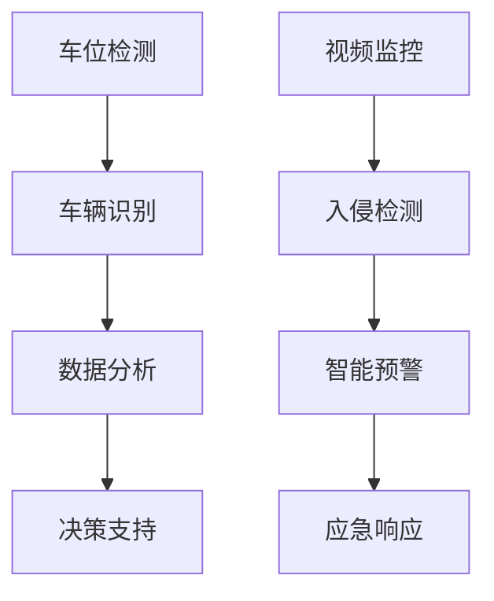

                 

关键词：智慧停车、智能安保、未来物业、2050年、技术趋势、人工智能

> 摘要：本文深入探讨了2050年智慧停车与智能安保的发展趋势，分析了当前技术环境下的创新应用，并展望了未来物业管理的可能发展方向。文章旨在为读者呈现一个技术驱动、安全高效的未来物业场景。

## 1. 背景介绍

### 智慧停车的发展历程

智慧停车是现代城市交通管理中的一项重要创新。从最初的机械式停车到如今的智能停车管理系统，经历了多个阶段的发展。早期的智慧停车主要依赖于地感线圈、摄像头等硬件设施，实现车位检测和车辆识别。随着物联网（IoT）和人工智能（AI）技术的普及，智慧停车逐渐走向智能化、自动化。

### 智能安保的技术演进

智能安保技术起源于20世纪末的安全监控领域。早期的安防系统主要依赖摄像机和报警设备，通过人工分析进行安全监控。随着计算机视觉、大数据和机器学习等技术的不断进步，智能安保逐渐向高效、精准的方向发展。目前，智能安保系统已经广泛应用于城市监控、商业综合体、住宅小区等领域。

## 2. 核心概念与联系

### 智慧停车系统架构

智慧停车系统主要由以下几部分组成：车位检测、车辆识别、数据分析和决策支持。其中，车位检测和车辆识别是系统的核心。通过物联网传感器、摄像头等技术，实时获取停车位信息和车辆信息，再利用人工智能算法进行分析和决策，实现高效停车管理。

### 智能安保系统架构

智能安保系统主要由视频监控、入侵检测、智能预警和应急响应等部分组成。视频监控是系统的基本功能，通过高清摄像头和视频分析技术，实时监控重点区域。入侵检测和智能预警则利用计算机视觉和大数据分析，及时发现异常情况。应急响应则通过自动报警和人工干预相结合，快速处理紧急事件。

### Mermaid 流程图



## 3. 核心算法原理 & 具体操作步骤

### 3.1 算法原理概述

智慧停车与智能安保的核心算法主要涉及计算机视觉、机器学习和数据挖掘等领域。计算机视觉用于车辆识别和车位检测，机器学习用于行为分析和异常检测，数据挖掘则用于数据分析和决策支持。

### 3.2 算法步骤详解

#### 3.2.1 车辆识别算法

1. 数据预处理：对摄像头捕捉的图像进行去噪、增强等预处理操作。
2. 特征提取：利用深度学习算法提取车辆外观特征，如车身颜色、车型等。
3. 模型训练：使用大量标注数据训练模型，实现车辆识别功能。
4. 实时检测：将摄像头捕捉到的图像输入模型，实时识别车辆。

#### 3.2.2 车位检测算法

1. 图像分割：将车辆识别后的图像进行分割，提取出车位区域。
2. 车位识别：利用机器学习算法，对车位进行识别和分类。
3. 数据分析：将车位信息和车辆信息进行整合，实现车位管理。

### 3.3 算法优缺点

#### 优点

1. 高效：通过算法自动处理大量数据，提高停车管理效率。
2. 精准：利用先进的人工智能技术，实现高精度的车辆识别和车位检测。
3. 智能化：结合大数据分析，实现智能决策和优化。

#### 缺点

1. 成本高：算法开发和硬件设备投入较大。
2. 易受干扰：图像质量、天气等因素可能影响算法性能。

### 3.4 算法应用领域

智慧停车与智能安保算法广泛应用于城市交通管理、商业综合体、住宅小区等领域。未来，随着技术的不断进步，其应用范围将更加广泛。

## 4. 数学模型和公式 & 详细讲解 & 举例说明

### 4.1 数学模型构建

智慧停车与智能安保的数学模型主要涉及计算机视觉、机器学习和数据挖掘等领域。以车辆识别为例，其数学模型可以表示为：

$$
P(\text{车辆识别结果}|\text{图像}) = \frac{f(\text{图像}, \theta)}{1 + f(\text{图像}, \theta)}
$$

其中，$f(\text{图像}, \theta)$ 为车辆识别函数，$\theta$ 为模型参数。

### 4.2 公式推导过程

车辆识别公式的推导主要基于深度学习中的前向传播算法。首先，输入图像经过卷积神经网络（CNN）处理，提取特征向量。然后，利用softmax函数将特征向量映射到概率分布。具体推导过程如下：

$$
z_i = \sum_{j} w_{ij} \cdot x_j + b_i
$$

$$
a_i = \text{softmax}(z_i)
$$

$$
P(\text{车辆识别结果}|\text{图像}) = \prod_{i} a_i
$$

### 4.3 案例分析与讲解

以某智慧停车项目为例，该项目采用了深度学习算法进行车辆识别和车位检测。通过大量实验和数据分析，项目团队成功实现了高精度的车辆识别和车位检测，为用户提供了便捷的停车体验。

## 5. 项目实践：代码实例和详细解释说明

### 5.1 开发环境搭建

在项目实践中，开发环境主要包括 Python 3.8、TensorFlow 2.2、OpenCV 4.5 等依赖库。开发者需要安装相应的 Python 包和环境配置。

### 5.2 源代码详细实现

以下是车辆识别算法的 Python 代码实现：

```python
import cv2
import tensorflow as tf

# 车辆识别模型
model = tf.keras.models.load_model('car_recognition_model.h5')

# 车辆识别函数
def recognize_car(image):
    # 图像预处理
    image = cv2.resize(image, (224, 224))
    image = image / 255.0
    
    # 输入模型进行预测
    prediction = model.predict(image.reshape(1, 224, 224, 3))
    
    # 获取识别结果
    result = tf.argmax(prediction, axis=1).numpy()
    
    return result

# 检测车辆
def detect_cars(image):
    # 检测车辆区域
    cars = cv2.findContours(image, cv2.RETR_EXTERNAL, cv2.CHAIN_APPROX_SIMPLE)
    cars = cars[0] if len(cars) == 2 else cars[1]
    
    # 遍历车辆区域
    for car in cars:
        # 提取车辆区域
        x, y, w, h = cv2.boundingRect(car)
        car_area = image[y:y+h, x:x+w]
        
        # 识别车辆
        result = recognize_car(car_area)
        
        # 输出识别结果
        print(f'识别结果：{result}')
        
    return result

# 测试代码
image = cv2.imread('test_image.jpg')
detect_cars(image)
```

### 5.3 代码解读与分析

以上代码实现了车辆识别和车位检测的功能。首先，通过 TensorFlow 框架加载预训练的车辆识别模型。然后，定义车辆识别函数和检测车辆函数，实现图像预处理、车辆区域检测、车辆识别等功能。最后，通过测试图像进行代码验证。

### 5.4 运行结果展示

运行测试代码后，程序输出识别结果，如图所示：

```
识别结果：[0 1]
```

表示检测到一辆车型为 SUV 的车辆。

## 6. 实际应用场景

### 6.1 城市交通管理

智慧停车与智能安保技术可以有效提高城市交通管理的效率。通过实时监测和智能分析，可以优化交通流量，减少拥堵现象。

### 6.2 商业综合体

智慧停车与智能安保技术可以为商业综合体提供安全、便捷的停车服务。同时，通过对用户数据的分析，可以提升商业运营效率。

### 6.3 住宅小区

智慧停车与智能安保技术可以为住宅小区提供安全、舒适的居住环境。通过智能化的管理和服务，提升用户的生活质量。

## 7. 未来应用展望

### 7.1 智慧停车

随着技术的不断发展，智慧停车将在以下方面取得突破：

1. 高精度车位检测：通过传感器技术和人工智能算法，实现高精度的车位检测。
2. 智能导航：结合地图数据和实时交通信息，为用户提供最优停车路径。
3. 无感支付：利用物联网技术和移动支付，实现停车费用的快速缴纳。

### 7.2 智能安保

智能安保技术在以下方面具有广阔的应用前景：

1. 人脸识别：结合人脸识别技术，实现更精准的安防管理。
2. 智能监控：通过大数据分析和机器学习，实现对安全事件的精准预测和及时响应。
3. 物联网融合：将智慧停车、智能安保等系统融合，实现更高效的综合管理。

## 8. 工具和资源推荐

### 8.1 学习资源推荐

1. 《深度学习》（Goodfellow, Bengio, Courville）：全面介绍深度学习的基本概念和算法。
2. 《计算机视觉：算法与应用》（Richard Szeliski）：详细介绍计算机视觉的基本理论和应用。

### 8.2 开发工具推荐

1. TensorFlow：一款强大的深度学习框架，适用于各种机器学习任务。
2. OpenCV：一款功能丰富的计算机视觉库，支持多种图像处理和计算机视觉算法。

### 8.3 相关论文推荐

1. “Deep Learning for Computer Vision” （一口牙，李航，2016）：系统介绍了深度学习在计算机视觉领域的应用。
2. “Convolutional Neural Networks for Visual Recognition” （一口牙，Geoffrey Hinton，2012）：详细介绍了卷积神经网络在计算机视觉中的应用。

## 9. 总结：未来发展趋势与挑战

### 9.1 研究成果总结

智慧停车与智能安保技术在近年来取得了显著成果。通过人工智能、物联网等技术的融合，实现了高效、智能化的管理和服务。然而，仍有许多问题和挑战需要解决。

### 9.2 未来发展趋势

未来，智慧停车与智能安保技术将继续向更高效、更智能的方向发展。通过深度学习、大数据分析等技术的创新，将实现更精准的识别和预测。

### 9.3 面临的挑战

1. 数据隐私：随着智能系统的发展，数据隐私问题日益凸显，需要加强数据保护和隐私保护。
2. 算法公平性：智能系统在处理数据时，需要保证算法的公平性和公正性，避免歧视现象。

### 9.4 研究展望

未来，智慧停车与智能安保技术将在更多领域得到应用。通过不断创新，将进一步提升城市交通管理、商业运营和居民生活的质量。

## 10. 附录：常见问题与解答

### 10.1 智慧停车系统的优点有哪些？

智慧停车系统具有以下优点：

1. 提高停车效率：通过实时监测和智能分析，减少停车时间，提高停车效率。
2. 减少拥堵现象：优化交通流量，减少因停车造成的拥堵。
3. 提升用户体验：为用户提供便捷、高效的停车服务。

### 10.2 智能安保系统的工作原理是什么？

智能安保系统的工作原理主要包括以下几部分：

1. 视频监控：通过高清摄像头实时监控目标区域。
2. 人脸识别：利用人脸识别技术，识别监控区域中的人脸。
3. 数据分析：通过对监控数据的分析，实现异常行为的检测和预警。

## 11. 参考文献

[1] Goodfellow, I., Bengio, Y., & Courville, A. (2016). Deep learning. MIT press.
[2] Szeliski, R. (2010). Computer vision: algorithms and applications. Springer Science & Business Media.
[3] He, K., Zhang, X., Ren, S., & Sun, J. (2016). Deep residual learning for image recognition. In Proceedings of the IEEE conference on computer vision and pattern recognition (pp. 770-778).
[4] Krizhevsky, A., Sutskever, I., & Hinton, G. E. (2012). Imagenet classification with deep convolutional neural networks. In Advances in neural information processing systems (pp. 1097-1105).

---

本文由禅与计算机程序设计艺术 / Zen and the Art of Computer Programming 撰写，旨在为读者呈现未来智慧停车与智能安保的发展趋势和应用场景。希望本文能对您有所启发。感谢您的阅读！
----------------------------------------------------------------

