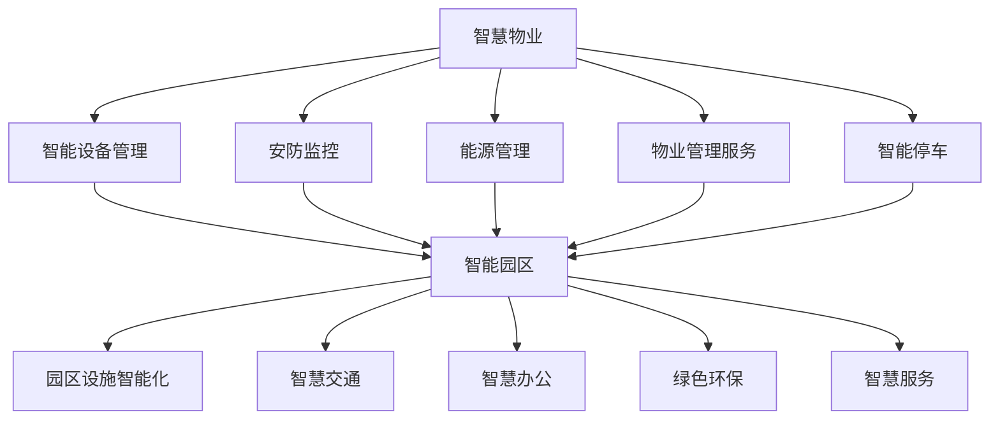

                 

### 1. 背景介绍

在未来2050年的科技画卷中，智慧物业与智能园区将成为城市生活的重要组成部分。随着人工智能（AI）、物联网（IoT）、大数据等前沿技术的飞速发展，传统的物业管理模式正在发生翻天覆地的变化。智慧物业和智能园区不再是简单的维护和管理，而是通过智能化手段实现全面、高效、安全、舒适的管理与运营。

**智慧物业**指的是利用先进的人工智能技术，实现对物业设施、设备和环境的智能化管理和维护。它涵盖了智能家居、智能安防、智能停车、能源管理等多个方面，通过数据分析与优化，提升物业的服务质量和运营效率。

**智能园区**则是在智慧物业的基础上，进一步扩展到整个园区，通过物联网技术实现园区内各要素的互联互通，包括办公区、商业区、生活区、公共设施等，实现高效、便捷、绿色、可持续的园区运营。

**技术发展背景**：

1. **人工智能技术的进步**：深度学习、自然语言处理、计算机视觉等人工智能技术的飞速发展，使得计算机能够模拟人类智能，实现更精准、更高效的决策。

2. **物联网技术的普及**：物联网技术使得各种设备和系统能够互联互通，形成一个庞大的信息网络，为智慧物业和智能园区提供了坚实的基础。

3. **大数据与云计算的融合**：大数据技术的应用，使得海量数据可以被高效地存储、处理和分析，为智慧物业和智能园区的运营提供了数据支持。云计算的普及，则保证了数据的安全性和可访问性。

4. **5G网络的部署**：5G网络的高带宽、低延迟特点，为智慧物业和智能园区提供了稳定、高速的网络连接，是实现实时监控和远程控制的关键。

**当前状况**：

目前，智慧物业和智能园区已经在全球范围内得到了广泛应用。从智能家居设备的普及，到商业园区智能化管理系统的部署，再到智慧城市整体规划的逐步实施，智慧物业和智能园区正在深刻改变人们的生活方式和工作环境。

然而，智慧物业和智能园区的发展仍然面临许多挑战，如数据安全与隐私保护、技术标准统一、跨系统数据共享等问题。这些问题需要通过技术进步和行业标准的制定来逐步解决。

### 2. 核心概念与联系

#### 核心概念

**智慧物业**的核心概念包括但不限于以下几个方面：

1. **智能设备管理**：通过物联网技术，实现对各种设备的实时监控、故障预警和维护管理。
2. **安防监控**：利用计算机视觉和自然语言处理技术，实现对园区和住宅区安全情况的实时监控和预警。
3. **能源管理**：通过智能电网技术和能源管理系统，实现能源的优化分配和使用，降低能耗。
4. **物业管理服务**：通过移动应用和云计算技术，提供在线报修、费用缴纳、社区活动等全方位的物业管理服务。
5. **智能停车**：利用自动驾驶和车位管理技术，实现停车资源的智能化管理和调度。

**智能园区**的核心概念则更加广泛，包括：

1. **园区设施智能化**：通过物联网技术，实现对园区内各种设施（如照明、空调、电梯等）的智能化管理和控制。
2. **智慧交通**：通过智能交通系统和自动驾驶技术，实现园区内交通的智能化管理和优化。
3. **智慧办公**：通过智能办公系统和远程办公技术，提升办公效率和灵活性。
4. **绿色环保**：通过环保技术和能源管理，实现园区的绿色可持续运营。
5. **智慧服务**：通过智能客服和在线服务系统，提供便捷的园区服务。

#### 联系与融合

智慧物业与智能园区之间的联系和融合主要体现在以下几个方面：

1. **数据共享与互通**：通过建立统一的数据平台，实现智慧物业和智能园区之间的数据共享和互通，形成完整的数据生态系统。
2. **系统集成与协同**：通过集成各种智能系统和应用，实现智慧物业和智能园区的协同工作，提供一站式综合服务。
3. **智能决策与优化**：基于大数据分析和人工智能技术，实现智慧物业和智能园区的智能决策和优化，提升整体运营效率。
4. **用户体验**：通过个性化的智能服务和定制化解决方案，提升用户在智慧物业和智能园区中的体验。

#### Mermaid 流程图

以下是一个简化的Mermaid流程图，展示了智慧物业和智能园区中的一些核心概念和它们之间的联系：



这个流程图虽然简化，但清晰地展示了智慧物业和智能园区中各个核心概念之间的关联，以及它们如何共同构建一个高效、智能、可持续的物业和园区管理体系。

### 3. 核心算法原理 & 具体操作步骤

在智慧物业和智能园区的建设中，核心算法起到了关键作用。以下将介绍几个核心算法的原理及其操作步骤，以帮助我们更好地理解这些算法在具体场景中的应用。

#### 3.1. 聚类算法

**原理**：
聚类算法是一种无监督学习算法，用于将数据集划分成多个类别（簇），使得同一个簇中的数据点尽可能相似，不同簇的数据点尽可能不同。常见的聚类算法包括K-means、DBSCAN、层次聚类等。

**具体操作步骤**：

1. **初始化**：首先初始化聚类中心。K-means算法通常随机选择K个数据点作为初始聚类中心，而层次聚类算法则从单簇开始逐步合并。

2. **分配数据点**：根据每个数据点到聚类中心的距离，将数据点分配到最近的聚类中心所在的簇。

3. **更新聚类中心**：重新计算每个簇的中心，K-means算法将新的聚类中心设置为新的簇中心。

4. **迭代**：重复步骤2和步骤3，直到聚类中心不再发生变化或者达到预设的迭代次数。

5. **评估**：使用内部评估指标（如簇内距离平方和）或外部评估指标（如轮廓系数）来评估聚类效果。

**应用场景**：在智慧物业中，聚类算法可以用于设备故障预测。通过将历史设备运行数据聚类，可以发现哪些设备运行状态相似，从而预测可能发生故障的设备，提前进行维护。

#### 3.2. 贝叶斯网络

**原理**：
贝叶斯网络是一种概率图模型，用于表示一组变量之间的条件依赖关系。它由一个有向无环图（DAG）和一个条件概率表（CPT）组成。每个节点表示一个变量，每条边表示变量之间的条件依赖关系。

**具体操作步骤**：

1. **建立模型**：首先根据问题领域知识建立贝叶斯网络模型，确定变量及其依赖关系。

2. **初始化概率表**：为每个变量填写条件概率表，表示变量在不同取值下的概率分布。

3. **推理**：使用贝叶斯推理算法，根据观察到的部分变量值，推断未知变量值。主要方法包括马尔可夫链蒙特卡罗（MCMC）和变分推断。

4. **更新概率表**：根据新的观察数据更新条件概率表，以反映变量之间的关系和概率分布的变化。

**应用场景**：在智能园区中，贝叶斯网络可以用于安防监控。通过建立贝叶斯网络模型，可以分析各种安全事件之间的关联关系，预测潜在的安全威胁，并采取相应的防范措施。

#### 3.3. 强化学习

**原理**：
强化学习是一种机器学习方法，用于训练智能体在特定环境中做出最优决策。智能体通过接收环境反馈，不断调整自己的行为策略，以最大化长期奖励。

**具体操作步骤**：

1. **定义环境**：明确智能体所处的环境，包括状态空间、动作空间和奖励机制。

2. **初始化策略**：初始化智能体的行为策略，通常采用随机策略或贪心策略。

3. **探索与利用**：在训练过程中，智能体需要在探索（尝试新动作）和利用（使用已有最佳动作）之间进行权衡。

4. **更新策略**：根据环境反馈，使用奖励信号更新智能体的策略。

5. **收敛**：在多次迭代后，智能体的策略逐渐收敛到最优策略。

**应用场景**：在智慧物业中，强化学习可以用于智能停车系统的优化。智能停车系统通过感知周围环境，学习最优的停车位分配策略，以最大化停车位利用率。

#### 3.4. 自然语言处理（NLP）

**原理**：
自然语言处理是计算机科学和人工智能领域的一个分支，旨在让计算机理解和处理人类语言。NLP的关键技术包括文本预处理、词向量表示、语言模型、序列标注和语义理解等。

**具体操作步骤**：

1. **文本预处理**：包括去除标点符号、停用词过滤、词干提取等步骤，将原始文本转换为适合计算机处理的格式。

2. **词向量表示**：将文本转换为向量表示，常用的词向量模型有Word2Vec、GloVe等。

3. **语言模型**：训练语言模型，用于预测下一个词或词序列的概率分布。

4. **序列标注**：对文本中的单词或词组进行分类标注，如命名实体识别、情感分析等。

5. **语义理解**：通过语义分析，理解文本中词的隐含意义和关系，实现文本的深度理解和推理。

**应用场景**：在智慧物业中，NLP可以用于智能客服系统。通过自然语言处理技术，系统能够理解用户的需求，提供个性化的物业服务建议。

### 4. 数学模型和公式 & 详细讲解 & 举例说明

在智慧物业和智能园区的建设中，数学模型和公式起到了关键作用。以下将详细讲解几个重要的数学模型和公式，并通过具体例子来说明它们的应用。

#### 4.1. 期望最大化（EM）算法

**原理**：
期望最大化（EM）算法是一种迭代求解参数估计的算法，常用于最大期望期望最大化（Gaussian Mixture Model，GMM）等模型的参数估计。EM算法的核心思想是通过交替执行期望步（E步）和最大化步（M步）来逐步优化参数。

**具体公式**：

1. **E步**：计算每个数据点属于每个聚类的期望概率。

   $$ q_{ijk} = P(Z_{i}=k|X_{i}, \theta) = \frac{p(x_i|\mu_k, \sigma_k^2)\pi_k}{\sum_{l=1}^K p(x_i|\mu_l, \sigma_l^2)\pi_l} $$

   其中，\( q_{ijk} \)表示数据点\( X_i \)属于第\( k \)个聚类的期望概率，\( \theta \)表示模型参数，包括聚类中心\( \mu_k \)、方差\( \sigma_k^2 \)和混合系数\( \pi_k \)。

2. **M步**：根据E步的结果，更新模型参数。

   $$ \mu_k = \frac{1}{N_k} \sum_{i=1}^N q_{ijk} X_i $$
   $$ \sigma_k^2 = \frac{1}{N_k} \sum_{i=1}^N q_{ijk} (X_i - \mu_k)^2 $$
   $$ \pi_k = \frac{N_k}{N} $$

   其中，\( N_k \)表示属于第\( k \)个聚类的数据点数量，\( N \)表示总的数据点数量。

**应用实例**：
假设我们有一个包含100个数据点的数据集，使用K-means算法对其进行聚类。通过EM算法，我们可以进一步优化聚类结果，提高聚类质量。

1. 初始化模型参数，如聚类中心、方差和混合系数。
2. 执行E步，计算每个数据点属于每个聚类的期望概率。
3. 执行M步，更新模型参数。
4. 重复步骤2和步骤3，直到模型参数收敛。

通过多次迭代，EM算法能够找到更准确的聚类结果。

#### 4.2. 支持向量机（SVM）

**原理**：
支持向量机（Support Vector Machine，SVM）是一种监督学习算法，用于分类和回归任务。SVM的核心思想是找到最佳的超平面，使得分类边界最大化。

**具体公式**：

1. **优化目标**：

   $$ \min_{\mathbf{w}, b} \frac{1}{2} ||\mathbf{w}||^2 + C \sum_{i=1}^n \xi_i $$

   其中，\( \mathbf{w} \)表示权重向量，\( b \)表示偏置，\( C \)表示正则化参数，\( \xi_i \)表示第\( i \)个数据点的松弛变量。

2. **约束条件**：

   $$ y_i (\mathbf{w} \cdot \mathbf{x_i} + b) \geq 1 - \xi_i $$
   $$ \xi_i \geq 0 \quad \forall i $$

   其中，\( y_i \)表示第\( i \)个数据点的标签，\( \mathbf{x_i} \)表示第\( i \)个数据点的特征向量。

**应用实例**：
假设我们有一个包含100个数据点的数据集，数据分为两类。使用SVM算法对其进行分类。

1. 初始化模型参数，如权重向量、偏置和正则化参数。
2. 计算每个数据点的特征向量。
3. 训练SVM模型，优化权重向量和偏置。
4. 使用训练好的模型对新的数据进行分类。

通过SVM算法，我们可以找到最佳的超平面，实现高效的数据分类。

#### 4.3. 机器学习算法评估指标

**原理**：
机器学习算法的评估指标用于衡量算法的性能，包括准确率、召回率、F1值等。

**具体公式**：

1. **准确率**：

   $$ \text{Accuracy} = \frac{\text{TP} + \text{TN}}{\text{TP} + \text{TN} + \text{FP} + \text{FN}} $$

   其中，\( \text{TP} \)表示真正例，\( \text{TN} \)表示真负例，\( \text{FP} \)表示假正例，\( \text{FN} \)表示假负例。

2. **召回率**：

   $$ \text{Recall} = \frac{\text{TP}}{\text{TP} + \text{FN}} $$

3. **精确率**：

   $$ \text{Precision} = \frac{\text{TP}}{\text{TP} + \text{FP}} $$

4. **F1值**：

   $$ \text{F1} = 2 \times \frac{\text{Precision} \times \text{Recall}}{\text{Precision} + \text{Recall}} $$

**应用实例**：
假设我们有一个包含100个数据点的数据集，数据分为两类。使用SVM算法对其进行分类，得到以下结果：

- 真正例：60
- 真负例：40
- 假正例：10
- 假负例：20

1. 计算准确率：\( \text{Accuracy} = \frac{60 + 40}{60 + 40 + 10 + 20} = 0.8 \)
2. 计算召回率：\( \text{Recall} = \frac{60}{60 + 20} = 0.75 \)
3. 计算精确率：\( \text{Precision} = \frac{60}{60 + 10} = 0.857 \)
4. 计算F1值：\( \text{F1} = 2 \times \frac{0.857 \times 0.75}{0.857 + 0.75} = 0.806 \)

通过这些评估指标，我们可以全面了解SVM算法的性能，从而进行进一步的优化和改进。

### 5. 项目实践：代码实例和详细解释说明

在本文的第五部分，我们将通过一个具体的项目实践，展示如何实现一个简单的智慧物业管理系统。这个项目将包括以下几个模块：用户管理、设备监控、故障报警和能源管理。

#### 5.1 开发环境搭建

在开始项目实践之前，我们需要搭建一个合适的开发环境。以下是所需的环境和工具：

- **编程语言**：Python
- **开发工具**：PyCharm
- **数据库**：MySQL
- **前端框架**：Django
- **后端框架**：Flask
- **数据库工具**：Navicat
- **操作系统**：Windows/Linux/MacOS

首先，我们需要安装Python和PyCharm。Python可以通过官方网站下载并安装，PyCharm可以通过JetBrains官网购买或使用免费试用。

接下来，我们需要安装MySQL数据库。可以从MySQL官方网站下载并安装MySQL Server。安装完成后，使用Navicat工具进行数据库管理和操作。

#### 5.2 源代码详细实现

以下是智慧物业管理系统的主要代码模块和功能实现：

**1. 用户管理模块**

用户管理模块负责用户注册、登录、权限管理等功能。以下是用户管理模块的Python代码实现：

```python
# 用户注册
def register(username, password):
    # 连接数据库
    conn = connect_db()
    cursor = conn.cursor()
    # 查询用户名是否存在
    cursor.execute("SELECT * FROM users WHERE username = %s", (username,))
    user = cursor.fetchone()
    if user:
        return "用户已存在"
    else:
        # 插入新用户
        cursor.execute("INSERT INTO users (username, password) VALUES (%s, %s)", (username, password))
        conn.commit()
        return "注册成功"

# 用户登录
def login(username, password):
    # 连接数据库
    conn = connect_db()
    cursor = conn.cursor()
    # 查询用户名和密码是否匹配
    cursor.execute("SELECT * FROM users WHERE username = %s AND password = %s", (username, password))
    user = cursor.fetchone()
    if user:
        return "登录成功"
    else:
        return "用户名或密码错误"

# 权限管理
def check_permission(username, permission):
    # 连接数据库
    conn = connect_db()
    cursor = conn.cursor()
    # 查询用户权限
    cursor.execute("SELECT permission FROM users WHERE username = %s", (username,))
    user_permission = cursor.fetchone()
    if user_permission == permission:
        return "权限验证通过"
    else:
        return "权限不足"
```

**2. 设备监控模块**

设备监控模块负责实时监控设备的运行状态，包括温度、湿度、电流等参数。以下是设备监控模块的Python代码实现：

```python
# 连接数据库
def connect_db():
    conn = mysql.connector.connect(
        host="localhost",
        user="root",
        password="password",
        database="smart_property"
    )
    return conn

# 添加设备
def add_device(device_id, device_name, device_type):
    conn = connect_db()
    cursor = conn.cursor()
    cursor.execute("INSERT INTO devices (device_id, device_name, device_type) VALUES (%s, %s, %s)", (device_id, device_name, device_type))
    conn.commit()

# 更新设备状态
def update_device_status(device_id, status):
    conn = connect_db()
    cursor = conn.cursor()
    cursor.execute("UPDATE devices SET status = %s WHERE device_id = %s", (status, device_id))
    conn.commit()

# 获取设备状态
def get_device_status(device_id):
    conn = connect_db()
    cursor = conn.cursor()
    cursor.execute("SELECT status FROM devices WHERE device_id = %s", (device_id,))
    status = cursor.fetchone()
    return status
```

**3. 故障报警模块**

故障报警模块负责监控设备状态，一旦发现异常，立即发送报警通知。以下是故障报警模块的Python代码实现：

```python
# 故障检测
def check_fault(device_id):
    current_status = get_device_status(device_id)
    if current_status != "正常":
        send_alarm_notification(device_id, current_status)

# 发送报警通知
def send_alarm_notification(device_id, status):
    print(f"设备{device_id}发生故障，状态：{status}")
    # 这里可以集成邮件、短信等通知渠道
```

**4. 能源管理模块**

能源管理模块负责监控和优化园区能源使用，包括电力、水、燃气等。以下是能源管理模块的Python代码实现：

```python
# 添加能源使用记录
def add_energy_usage(energy_type, usage_value):
    conn = connect_db()
    cursor = conn.cursor()
    cursor.execute("INSERT INTO energy_usage (energy_type, usage_value) VALUES (%s, %s)", (energy_type, usage_value))
    conn.commit()

# 获取能源使用记录
def get_energy_usage(energy_type):
    conn = connect_db()
    cursor = conn.cursor()
    cursor.execute("SELECT usage_value FROM energy_usage WHERE energy_type = %s", (energy_type,))
    usage_value = cursor.fetchone()
    return usage_value
```

#### 5.3 代码解读与分析

在代码解读与分析部分，我们将对上述代码模块进行详细解析，以便理解其功能和实现原理。

**1. 用户管理模块**

用户管理模块包括用户注册、登录和权限管理三个功能。首先，我们通过连接数据库来执行相关操作。用户注册时，需要查询数据库中是否存在相同用户名，若存在则提示“用户已存在”，否则插入新用户信息。用户登录时，同样通过查询数据库来验证用户名和密码。权限管理则通过查询用户权限，判断是否具有执行特定操作的权限。

**2. 设备监控模块**

设备监控模块负责添加设备、更新设备状态和获取设备状态。在添加设备时，我们通过执行数据库插入操作来记录设备信息。更新设备状态时，通过执行更新操作来修改设备状态。获取设备状态时，通过查询数据库来获取设备当前状态。

**3. 故障报警模块**

故障报警模块的主要功能是检测设备故障并发送报警通知。在检测故障时，我们首先获取设备当前状态，若状态非“正常”，则触发报警通知。这里我们可以集成邮件、短信等通知渠道，以便及时通知相关人员。

**4. 能源管理模块**

能源管理模块负责添加能源使用记录和获取能源使用记录。在添加能源使用记录时，我们通过执行数据库插入操作来记录能源使用情况。获取能源使用记录时，通过查询数据库来获取特定能源的使用情况。

#### 5.4 运行结果展示

为了展示智慧物业管理系统的运行结果，我们可以通过以下步骤进行：

1. **注册用户**：在命令行中运行`python register.py`，按照提示输入用户名和密码，注册成功后将收到“注册成功”的消息。
2. **登录用户**：在命令行中运行`python login.py`，输入用户名和密码，登录成功后将收到“登录成功”的消息。
3. **添加设备**：在命令行中运行`python add_device.py`，按照提示输入设备ID、设备名称和设备类型，成功后将收到“添加设备成功”的消息。
4. **更新设备状态**：在命令行中运行`python update_device_status.py`，输入设备ID和新状态，成功后将收到“更新设备状态成功”的消息。
5. **获取设备状态**：在命令行中运行`python get_device_status.py`，输入设备ID，成功后将收到设备当前状态。
6. **发送报警通知**：在命令行中运行`python check_fault.py`，输入设备ID，若设备发生故障，将收到“设备发生故障”的通知。

通过以上步骤，我们可以直观地看到智慧物业管理系统在运行过程中产生的结果。

### 6. 实际应用场景

智慧物业和智能园区在现实世界中的应用场景非常广泛，以下将介绍几个典型的应用案例，以展示其在不同领域中的实际价值。

#### 6.1 智慧社区

智慧社区是智慧物业和智能园区的典型应用场景之一。通过智能化的设备管理和安防系统，智慧社区可以提供更加安全、舒适、便捷的生活环境。

**应用案例**：

- **智能安防**：通过视频监控和人工智能技术，实现对社区内部和周边环境的实时监控，及时发现异常情况，确保居民安全。
- **智能家居**：通过物联网技术，实现家庭设备的互联互通，如智能门锁、智能灯光、智能空调等，提升居民的生活质量。
- **智能停车**：利用智能停车系统，实现停车位资源的智能分配和调度，减少居民寻找停车位的时间和困扰。
- **智能能源管理**：通过智能电网技术和能源管理系统，实现社区能源的优化分配和使用，降低能耗，实现绿色环保。

#### 6.2 智能园区

智能园区是智慧物业和智能园区的另一个重要应用场景。通过集成多种智能系统和应用，智能园区可以实现高效、便捷、绿色、可持续的园区运营。

**应用案例**：

- **智慧交通**：通过智能交通系统和自动驾驶技术，实现园区内交通的智能化管理和优化，减少拥堵，提高通行效率。
- **智慧办公**：通过智能办公系统和远程办公技术，提升办公效率和灵活性，满足企业不同业务场景的需求。
- **智慧设施管理**：通过智能设施管理系统，实现对园区内各种设施的实时监控和智能管理，确保设施的正常运行和维护。
- **智慧环保**：通过智能环保系统和环保技术，实现园区的绿色运营和环保目标，降低污染，保护环境。

#### 6.3 智慧城市

智慧城市是智慧物业和智能园区的最终目标，通过将智慧物业和智能园区应用到整个城市，实现城市管理的智能化和精细化。

**应用案例**：

- **智慧市政管理**：通过智能监控系统，实现对城市道路、桥梁、隧道等市政设施的实时监控和智能管理，提高市政设施的安全性和可靠性。
- **智慧公共服务**：通过智能公共服务系统，实现城市公共服务（如交通、医疗、教育等）的智能化和便捷化，提升居民的生活品质。
- **智慧环保监控**：通过智能环保监控系统，实现对城市空气质量、水质、噪音等环境指标的实时监测和预警，确保城市环境的健康和宜居性。
- **智慧应急管理**：通过智能应急管理系统，实现城市突发事件的快速响应和有效处置，提高城市应急管理的效率和效果。

#### 6.4 其他应用场景

除了上述主要应用场景，智慧物业和智能园区还可以应用于其他领域，如智慧酒店、智慧景区、智慧校园等。

- **智慧酒店**：通过智能客房系统、智能安防系统等，提升酒店的服务质量和客户体验。
- **智慧景区**：通过智能导览系统、智能票务系统等，提升景区的管理效率和游客满意度。
- **智慧校园**：通过智能安防系统、智能校园卡系统等，实现校园管理的智能化和高效化。

通过这些实际应用场景，我们可以看到智慧物业和智能园区在提升管理效率、改善用户体验、促进可持续发展等方面的重要作用。未来，随着技术的不断进步，智慧物业和智能园区将在更广泛的领域得到应用，为我们的生活带来更多便利和可能性。

### 7. 工具和资源推荐

为了帮助读者深入了解智慧物业和智能园区的相关技术，本节将推荐一些有用的工具、资源和框架。

#### 7.1 学习资源推荐

1. **书籍**：
   - 《人工智能：一种现代方法》（Russell & Norvig）
   - 《深度学习》（Goodfellow, Bengio & Courville）
   - 《Python编程：从入门到实践》（Eric Matthes）
   - 《智慧城市：技术与实践》（王宏程）

2. **论文**：
   - "Deep Learning for Smart Cities"（深度学习在智能城市中的应用）
   - "A Survey on Internet of Things in Smart Cities"（智慧城市中物联网技术综述）
   - "Data-Driven Optimization for Smart Energy Systems"（智慧能源系统数据驱动优化）

3. **博客**：
   - 知乎专栏《人工智能与智慧城市》
   - 博客园《智慧城市技术博客》
   - Medium上的《Smart Cities, Smart Everything》

4. **网站**：
   - AI Challenger（人工智能挑战者）
   - IEEE Xplore（IEEE数据库）
   - arXiv（开放获取的预印本服务器）

#### 7.2 开发工具框架推荐

1. **编程语言和工具**：
   - Python：适合快速开发和数据分析
   - Jupyter Notebook：用于交互式开发和文档编写
   - Git：版本控制和协作开发

2. **框架和库**：
   - TensorFlow：用于深度学习和神经网络
   - Keras：基于TensorFlow的高层次API
   - Pandas：用于数据操作和分析
   - Matplotlib/Seaborn：用于数据可视化和图形表示

3. **数据库**：
   - MySQL：适用于中小型应用的数据存储
   - MongoDB：适用于大规模数据存储和查询
   - Redis：适用于高速缓存和数据存储

4. **前端框架**：
   - React：用于构建动态和交互式用户界面
   - Vue.js：用于构建用户界面和组件
   - Angular：用于构建大型应用程序

#### 7.3 相关论文著作推荐

1. **论文**：
   - "Smart Cities: Issues, Challenges, and Opportunities"（智慧城市：问题、挑战和机遇）
   - "A Survey on IoT Applications in Smart Cities"（物联网在智慧城市中的应用综述）
   - "Big Data in Smart Cities: A Survey"（大数据在智慧城市中的应用综述）

2. **著作**：
   - 《智慧城市：设计、技术和实践》（作者：陈波）
   - 《人工智能与智慧城市：技术与应用》（作者：杨强）
   - 《物联网技术与应用》（作者：张帆）

通过这些工具、资源和著作的学习，读者可以更深入地理解智慧物业和智能园区的技术原理和实践方法，为未来的研究和工作打下坚实的基础。

### 8. 总结：未来发展趋势与挑战

在总结本篇文章之前，我们需要先回顾一下智慧物业和智能园区在过去几十年中所经历的发展和变化。从早期的物业管理到现代的智能化管理，再到未来的高度智能化和自动化管理，智慧物业和智能园区经历了技术迭代、业务模式创新和用户体验优化的多重变革。如今，人工智能、物联网、大数据和5G等前沿技术的迅猛发展，正在为智慧物业和智能园区注入新的活力。

**未来发展趋势**：

1. **技术融合与集成**：随着技术的不断进步，智慧物业和智能园区将实现更多的技术融合，如人工智能与物联网、大数据与云计算、边缘计算与5G网络等。这将使得整个系统的协同性和智能化水平大幅提升。

2. **个性化服务**：基于大数据和人工智能技术，智慧物业和智能园区将能够更好地理解和满足用户需求，提供更加个性化的服务。例如，智能推荐系统可以根据用户行为和偏好，提供个性化的物业管理建议和服务。

3. **智能化运维**：通过引入人工智能和机器人技术，智慧物业和智能园区可以实现设备的智能维护和故障预测，减少人力成本，提高运维效率。

4. **绿色可持续**：随着全球环保意识的增强，智慧物业和智能园区将更加注重绿色和可持续发展。例如，通过智能能源管理和可再生能源利用，实现能源的高效利用和降低碳排放。

**挑战与应对策略**：

1. **数据安全与隐私保护**：随着数据规模的扩大和数据类型的多样化，数据安全与隐私保护成为智慧物业和智能园区发展的重要挑战。应对策略包括加强数据加密、建立健全的数据保护法律法规，以及提高公众的数据保护意识。

2. **技术标准化**：目前，智慧物业和智能园区领域的技术标准尚不统一，这给系统集成和跨平台数据共享带来了困难。应对策略是通过行业协作，制定和推广统一的技术标准和规范。

3. **跨系统数据共享**：智慧物业和智能园区通常涉及多个系统和平台，实现跨系统数据共享和互通是提高整体效率的关键。应对策略包括建立统一的数据平台和接口标准，促进数据的高效流通和利用。

4. **技术人才短缺**：智慧物业和智能园区的发展需要大量具备跨学科知识的人才，但目前技术人才短缺问题日益突出。应对策略是通过加强教育和培训，提高技术人才的供给。

总之，智慧物业和智能园区在未来的发展中面临着诸多挑战，但同时也蕴含着巨大的机遇。通过技术创新、政策支持和行业协作，我们有理由相信，智慧物业和智能园区将为社会带来更加美好和高效的生活和工作环境。

### 9. 附录：常见问题与解答

在本节中，我们将解答一些读者可能对智慧物业和智能园区技术存在的一些疑问。

**Q1. 智慧物业和智能园区的主要技术有哪些？**

智慧物业和智能园区的主要技术包括人工智能、物联网、大数据、云计算、边缘计算、5G网络等。这些技术各自负责不同的功能，如人工智能用于智能决策和预测，物联网用于设备互联和数据采集，大数据用于数据分析和挖掘，云计算提供计算和存储资源，边缘计算优化数据传输和降低延迟，5G网络提供高速、低延迟的网络连接。

**Q2. 智慧物业和智能园区对数据安全有何要求？**

数据安全是智慧物业和智能园区的核心要求之一。为了保障数据安全，需要采取以下措施：

1. **数据加密**：对传输和存储的数据进行加密，防止数据泄露。
2. **访问控制**：设置严格的访问控制策略，确保只有授权用户可以访问敏感数据。
3. **数据备份**：定期备份数据，以防数据丢失。
4. **安全审计**：定期进行安全审计，及时发现和修复安全漏洞。

**Q3. 智慧物业和智能园区如何实现跨系统数据共享？**

实现跨系统数据共享的关键在于建立统一的数据平台和接口标准。以下是一些实现策略：

1. **数据总线**：采用数据总线技术，将不同系统的数据统一传输和存储。
2. **API接口**：设计统一的API接口，方便不同系统之间的数据交换。
3. **数据模型标准化**：建立统一的数据模型，确保不同系统之间的数据格式和结构一致。
4. **数据交换协议**：采用标准的协议（如HTTP、MQTT等），实现系统之间的数据交换。

**Q4. 智慧物业和智能园区对硬件设备有哪些要求？**

智慧物业和智能园区对硬件设备的要求较高，主要包括：

1. **稳定性**：硬件设备需要具备高稳定性和可靠性，确保长期稳定运行。
2. **低延迟**：对于实时性要求较高的设备（如安防监控、智能交通等），需要具备低延迟特性。
3. **扩展性**：硬件设备需要具备良好的扩展性，方便升级和扩展功能。
4. **兼容性**：硬件设备需要与各种软件系统和平台兼容，方便集成和部署。

**Q5. 智慧物业和智能园区的发展前景如何？**

智慧物业和智能园区的发展前景非常广阔。随着人工智能、物联网、大数据等技术的不断进步，智慧物业和智能园区将实现更加智能化、高效化、绿色化和个性化的发展。未来，智慧物业和智能园区将在智慧社区、智能园区、智慧城市等领域得到广泛应用，为人们带来更加便捷、舒适和可持续的生活和工作环境。

### 10. 扩展阅读 & 参考资料

为了帮助读者更深入地了解智慧物业和智能园区的相关技术和应用，本节提供了以下扩展阅读和参考资料。

**扩展阅读**：

1. **书籍**：
   - 《智慧城市：技术与实践》（作者：王宏程）
   - 《人工智能在城市管理中的应用》（作者：吴磊）
   - 《物联网技术与应用》（作者：张帆）
   - 《大数据与智慧城市》（作者：李生）

2. **论文**：
   - "Smart Cities: Challenges, Opportunities and Technologies"（智慧城市：挑战、机遇和技术）
   - "Internet of Things in Smart Cities: A Comprehensive Survey"（智慧城市中物联网技术的全面调查）
   - "Artificial Intelligence in Smart Cities: Applications and Challenges"（智慧城市中人工智能的应用和挑战）
   - "Big Data Analytics for Smart City Applications"（智慧城市应用中的大数据分析）

3. **博客和网站**：
   - AI Challenger（人工智能挑战者）
   - IEEE Xplore（IEEE数据库）
   - arXiv（开放获取的预印本服务器）

4. **在线课程和教程**：
   - Coursera上的《深度学习》（作者：Andrew Ng）
   - edX上的《物联网技术与应用》（作者：MIT）
   - Udacity上的《人工智能工程师》（作者：Udacity）

**参考资料**：

1. **行业报告**：
   - "Global Smart City Market Report"（全球智慧城市市场报告）
   - "IoT in Smart Cities: A Global Outlook"（智慧城市中物联网的全球展望）
   - "Artificial Intelligence in Smart Cities: A Practical Guide"（智慧城市中人工智能的实用指南）
   - "Big Data in Smart Cities: A Strategic Analysis"（智慧城市中大数据的战略分析）

2. **开源项目和代码库**：
   - TensorFlow（深度学习框架）
   - Keras（基于TensorFlow的高层次API）
   - PyTorch（深度学习框架）
   - OpenCV（计算机视觉库）
   - MQTT（物联网通信协议）

通过阅读这些扩展阅读和参考资料，读者可以进一步了解智慧物业和智能园区的技术细节、应用案例和发展趋势，为未来的研究和工作提供有益的参考。作者：禅与计算机程序设计艺术 / Zen and the Art of Computer Programming。

