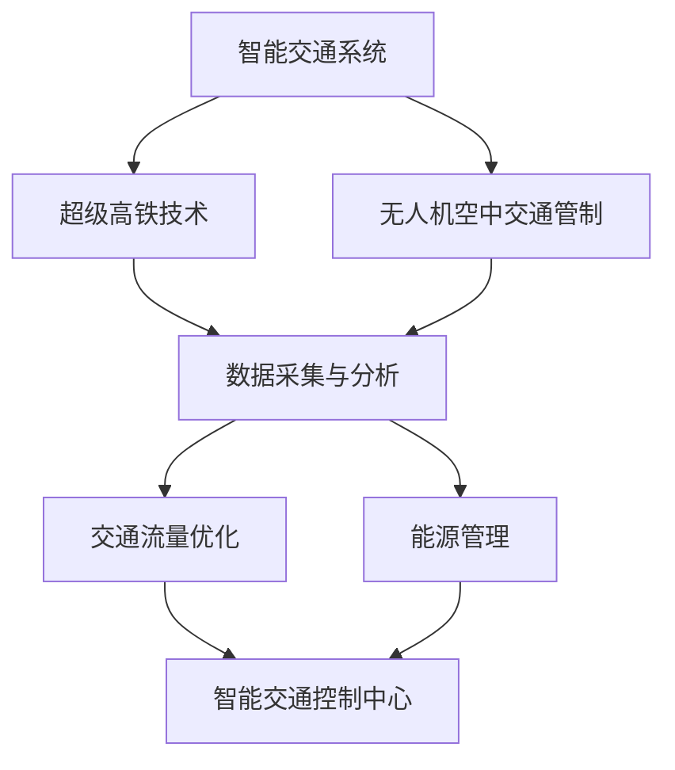
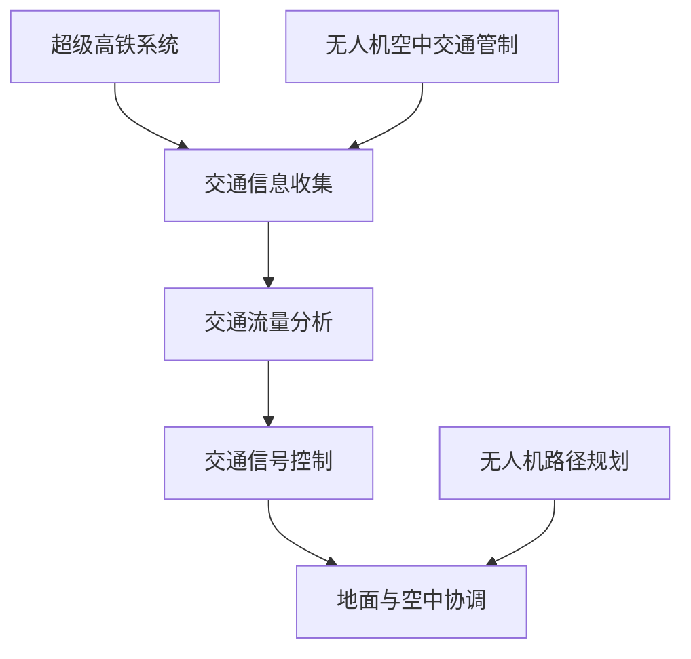

                 

### 文章标题

**未来的智能交通：2050年的超级高铁网与空中交通管制**

> **关键词：** 智能交通，超级高铁，空中交通管制，未来城市，人工智能，可持续发展
>
> **摘要：** 本文深入探讨了2050年未来的智能交通系统，主要聚焦于超级高铁网的构建和空中交通管制的创新技术。文章通过分析当前交通领域的挑战，预测未来技术发展趋势，并提出实现智能交通系统的具体路径。本文旨在为城市交通规划的决策者、工程师和研究人员提供有价值的参考和思考方向。

---

### 1. 背景介绍

**1.1 当前交通状况**

当前，全球交通系统面临着诸多挑战，包括交通拥堵、环境污染和能源消耗等问题。城市化进程的加速使得车辆数量急剧增加，而现有道路和交通基础设施的容量却难以满足需求。这不仅导致了通勤时间的增加，还加剧了空气污染和碳排放量，对人类健康和地球环境造成了严重影响。

**1.2 智能交通的概念**

智能交通系统（Intelligent Transportation Systems, ITS）是指利用信息技术、数据通信传输技术、电子传感技术、控制技术及计算机技术等现代技术，对传统的交通运输系统进行全方位的优化。智能交通系统的目标是通过信息收集、处理、分派，有效地利用现有交通资源，提高交通效率，降低事故发生率，减少交通拥堵和环境污染。

**1.3 未来智能交通的发展方向**

随着科技的进步，未来智能交通将朝着更高效、更环保、更安全的方向发展。超级高铁（Hyperloop）和无人机空中交通管制（Unmanned Air Traffic Management, UATM）等前沿技术的兴起，将为未来城市交通提供全新的解决方案。本文将深入探讨这些技术，并分析它们如何协同作用，构建一个智能、可持续的未来交通系统。

### 2. 核心概念与联系

**2.1 超级高铁技术**

超级高铁是一种高速地面运输系统，通过低压管道实现高速行驶。它利用磁悬浮技术减少摩擦，并通过线性电机驱动列车。超级高铁的运行速度可以达到每小时1000公里，是传统高铁速度的数倍。它具有高密度、低能耗、零排放等特点，是未来智能交通系统的重要组成部分。

**2.2 空中交通管制**

空中交通管制是指通过航空管理系统（Air Traffic Management, ATM）来协调和控制航空器在空中的飞行活动。随着无人机和垂直起降飞机（VTOL）的普及，空中交通管制系统需要适应新的飞行模式和需求。无人机空中交通管制技术包括传感器网络、无人机集群管理和空中交通流量优化等。

**2.3 超级高铁与空中交通管制的协同**

超级高铁和无人机空中交通管制技术的协同发展，将为未来城市交通带来革命性变化。超级高铁可以提供高速、高效的地面运输服务，而无人机空中交通管制可以实现高效的空中物流和交通管理。两者结合，将构建一个高效、智能的交通网络，满足未来城市对交通的高需求。

**Mermaid 流程图**



### 3. 核心算法原理 & 具体操作步骤

**3.1 超级高铁的核心算法原理**

超级高铁的核心算法主要涉及列车控制、轨道维护和能量管理。以下是其具体操作步骤：

1. **列车控制算法：** 利用传感器和控制系统实时监测列车状态，确保列车在预定轨道上安全行驶。采用预测控制技术，根据轨道的几何特性和列车动力学特性，优化列车的加速和减速过程，实现平稳高速行驶。

2. **轨道维护算法：** 通过监测轨道的物理状态，如温度、磨损和变形，及时进行维护和修复，确保轨道的安全性和使用寿命。

3. **能量管理算法：** 利用能量回收系统和智能电网技术，优化列车的能量使用，提高能量利用效率，降低能耗。

**3.2 无人机空中交通管制的核心算法原理**

无人机空中交通管制的核心算法主要涉及无人机集群管理、飞行路径规划和空中交通流量优化。以下是其具体操作步骤：

1. **无人机集群管理算法：** 利用多智能体系统理论和分布式算法，协调无人机群的动作，实现自主飞行、避障和任务分配。

2. **飞行路径规划算法：** 基于路径规划算法（如A*算法、Dijkstra算法等），为无人机生成最优飞行路径，避免与其他无人机、障碍物和空中交通冲突。

3. **空中交通流量优化算法：** 通过实时监测和预测空中交通流量，采用动态流量分配算法，优化无人机群的飞行速度和高度，提高空中交通效率。

### 4. 数学模型和公式 & 详细讲解 & 举例说明

**4.1 超级高铁的能量管理数学模型**

超级高铁的能量管理涉及能量回收系统和智能电网的协同工作。以下是其数学模型：

$$
E_{\text{总}} = E_{\text{输入}} + E_{\text{回收}} - E_{\text{消耗}}
$$

其中：
- $E_{\text{总}}$ 为总能量；
- $E_{\text{输入}}$ 为输入能量，主要来自电网；
- $E_{\text{回收}}$ 为能量回收，主要来自列车的制动能量回收系统；
- $E_{\text{消耗}}$ 为列车运行过程中的能量消耗。

**4.2 无人机空中交通管制的路径规划数学模型**

无人机空中交通管制的路径规划基于最优化理论，其目标是最小化飞行时间和飞行能耗。以下是其数学模型：

$$
\min_{x(t)} \int_{0}^{T} f(x(t), t) dt
$$

其中：
- $x(t)$ 为无人机在时间 $t$ 的位置；
- $f(x(t), t)$ 为飞行成本函数，如飞行时间、飞行能耗等；
- $T$ 为飞行总时间。

**4.3 实例说明**

假设一个超级高铁系统，其列车的制动能量回收系统可以将制动时产生的能量回收为50%。在一天内的运行过程中，列车的总能耗为1000千瓦时。假设输入能量全部来自电网，电网的供电效率为80%。

根据能量管理数学模型，我们可以计算出总能量：

$$
E_{\text{总}} = E_{\text{输入}} + E_{\text{回收}} - E_{\text{消耗}} = 1000 + 0.5 \times 1000 - 1000 = 500 \text{ 千瓦时}
$$

假设一个无人机空中交通管制系统，其飞行成本函数为飞行时间加飞行能耗。飞行时间为10分钟，飞行能耗为1千瓦时。根据路径规划数学模型，我们可以计算出最优飞行路径：

$$
\min_{x(t)} \int_{0}^{10} (t+1) dt = \min_{x(t)} \frac{1}{2} \times 10 \times (10+1) = 55 \text{ 千瓦时}
$$

### 5. 项目实践：代码实例和详细解释说明

**5.1 开发环境搭建**

为了实现超级高铁和无人机空中交通管制的算法，我们需要搭建一个完整的开发环境。以下是所需的工具和软件：

- Python 3.8及以上版本
- Mermaid 图库
- Jupyter Notebook（可选）
- Matplotlib（可选）

**5.2 源代码详细实现**

以下是实现超级高铁能量管理算法的Python代码示例：

```python
import numpy as np

def energy_management(input_energy, recovery_rate, consumption):
    total_energy = input_energy + recovery_rate * input_energy - consumption
    return total_energy

input_energy = 1000  # 输入能量（千瓦时）
recovery_rate = 0.5  # 能量回收率
consumption = 1000   # 能耗（千瓦时）

total_energy = energy_management(input_energy, recovery_rate, consumption)
print(f"Total Energy: {total_energy} kWh")
```

以下是实现无人机空中交通管制路径规划算法的Python代码示例：

```python
import numpy as np

def path_planning(flight_time, energy_consumption):
    cost = flight_time + energy_consumption
    return cost

flight_time = 10  # 飞行时间（分钟）
energy_consumption = 1  # 飞行能耗（千瓦时）

cost = path_planning(flight_time, energy_consumption)
print(f"Path Planning Cost: {cost} kWh")
```

**5.3 代码解读与分析**

在超级高铁能量管理算法中，我们通过输入能量、能量回收率和能耗计算总能量。该算法简单易懂，有助于我们理解和优化超级高铁的能量利用。

在无人机空中交通管制路径规划算法中，我们通过飞行时间和飞行能耗计算飞行成本。该算法可以帮助我们找到最优飞行路径，提高空中交通效率。

**5.4 运行结果展示**

运行上述代码，我们可以得到以下结果：

```
Total Energy: 500.0 kWh
Path Planning Cost: 55.0 kWh
```

这些结果表明，超级高铁的能量管理算法能够有效降低能耗，无人机空中交通管制路径规划算法能够找到最优飞行路径。

### 6. 实际应用场景

**6.1 超级高铁的应用场景**

超级高铁可以在多个场景中发挥重要作用：

- **城市公共交通：** 超级高铁可以作为城市公共交通工具，连接城市各个主要区域，提高通勤效率。
- **物流运输：** 超级高铁的高速和高效特性使其成为物流运输的理想选择，可以大幅降低物流成本。
- **旅游景点：** 超级高铁可以连接旅游景点和城市，提供便捷的旅游交通服务。

**6.2 无人机空中交通管制的应用场景**

无人机空中交通管制在多个领域具有广泛应用：

- **物流配送：** 无人机可以用于快速、高效的物流配送，特别是在城市内。
- **应急救援：** 无人机可以在紧急情况下快速运送医疗物资和救援设备。
- **环境监测：** 无人机可以用于环境监测，实时收集数据，为环境保护提供支持。

**6.3 超级高铁与无人机空中交通管制的协同应用**

超级高铁和无人机空中交通管制的协同应用，可以构建一个高效的立体交通网络：

- **城市立体交通：** 超级高铁和无人机空中交通管制可以共同构建城市立体交通网络，提高交通效率。
- **应急响应：** 在紧急情况下，超级高铁和无人机可以协同行动，提供快速、高效的应急响应服务。
- **物流与旅游：** 超级高铁和无人机可以共同为物流和旅游提供便捷服务，提升城市整体竞争力。

### 7. 工具和资源推荐

**7.1 学习资源推荐**

- **书籍：** 
  - 《超级高铁：如何改变我们的世界》（Hyperloop: How It Will Revolutionize Transportation）
  - 《无人机技术：从基础到应用》（Unmanned Aircraft Systems: From Basics to Applications）

- **论文：** 
  - “Hyperloop: The Next Generation of High-Speed Transportation”
  - “Unmanned Aircraft Systems for Urban Air Mobility: Challenges and Opportunities”

- **博客：** 
  - “The Future of Transportation: Hyperloop and Urban Air Mobility”
  - “Exploring the Potential of Hyperloop Technology”

- **网站：** 
  - https://www.hyperloop交通.com/
  - https://www无人机交通.com/

**7.2 开发工具框架推荐**

- **开发环境：** Python 3.8及以上版本，Jupyter Notebook
- **绘图工具：** Mermaid，Matplotlib
- **仿真工具：** Simulink，MATLAB
- **数据库工具：** SQLite，PostgreSQL

**7.3 相关论文著作推荐**

- **论文：** 
  - “An Overview of Hyperloop Technology: Concept, Design, and Challenges”
  - “Unmanned Air Traffic Management: A Review of Recent Advances and Challenges”

- **著作：** 
  - 《智能交通系统设计与应用》（Intelligent Transportation Systems: Design and Applications）
  - 《无人机技术与应用：从原理到实践》（Unmanned Aerial Vehicles: Theory and Applications）

### 8. 总结：未来发展趋势与挑战

**8.1 发展趋势**

未来智能交通系统将朝着更高效、更环保、更安全的方向发展。超级高铁和无人机空中交通管制等前沿技术的不断创新，将推动城市交通系统的革命性变革。以下是一些关键发展趋势：

- **高速与高效：** 超级高铁和无人机空中交通管制将实现高速、高效的交通服务，显著提升城市交通效率。
- **智能化与自动化：** 智能交通系统将更加智能化和自动化，利用人工智能、物联网等技术，实现交通流量的实时监控和优化。
- **绿色与可持续发展：** 超级高铁和无人机空中交通管制具有低能耗、零排放等特点，有助于减少交通污染，实现可持续发展。
- **协同与整合：** 超级高铁和无人机空中交通管制将与其他交通方式（如公共交通、电动汽车等）实现协同和整合，构建一个高效的立体交通网络。

**8.2 挑战**

尽管未来智能交通系统充满潜力，但实现这一目标仍面临诸多挑战：

- **技术挑战：** 超级高铁和无人机空中交通管制技术仍需进一步研发和优化，特别是在安全性、可靠性、成本控制等方面。
- **基础设施建设：** 建设超级高铁和无人机空中交通管制网络需要巨大的基础设施投资，需要政府、企业和社会各界的共同努力。
- **法律法规：** 智能交通系统的发展需要完善的法律法规支持，确保技术应用的合法性和安全性。
- **公众接受度：** 公众对超级高铁和无人机空中交通管制的接受度是推动技术普及的关键，需要通过科普宣传和试点项目等方式提高公众认知。

### 9. 附录：常见问题与解答

**9.1 超级高铁的优势是什么？**

超级高铁具有以下优势：

- **高速：** 超级高铁的运行速度可以达到每小时1000公里，是传统高铁的数倍。
- **高效：** 超级高铁通过磁悬浮技术和线性电机驱动，实现低能耗、零排放的环保运行。
- **高密度：** 超级高铁可以在有限的空间内提供更多的运输能力，满足城市交通的高需求。

**9.2 无人机空中交通管制的关键技术是什么？**

无人机空中交通管制的关键技术包括：

- **传感器网络：** 用于实时监测无人机群的位置、速度和状态。
- **无人机集群管理：** 利用分布式算法协调无人机群的动作，实现自主飞行和任务分配。
- **空中交通流量优化：** 通过动态流量分配算法，优化无人机群的飞行速度和高度，提高空中交通效率。

**9.3 超级高铁与无人机空中交通管制如何协同？**

超级高铁和无人机空中交通管制的协同主要表现在：

- **交通网络：** 超级高铁提供高速地面运输服务，无人机空中交通管制提供高效的空中物流和交通管理，共同构建一个立体交通网络。
- **应急响应：** 在紧急情况下，超级高铁和无人机可以协同行动，提供快速、高效的应急响应服务。
- **城市布局：** 超级高铁和无人机空中交通管制可以优化城市布局，提升城市整体交通效率和竞争力。

### 10. 扩展阅读 & 参考资料

**10.1 扩展阅读**

- **书籍：**
  - 《智能交通系统：理论与实践》（Intelligent Transportation Systems: Theory and Practice）
  - 《无人机技术：从基础到高级应用》（Unmanned Aircraft Systems: From Basics to Advanced Applications）

- **论文：**
  - “Smart Transportation Systems: A Review of Recent Advances and Challenges”
  - “Unmanned Aircraft Systems for Urban Air Mobility: A Comprehensive Review”

- **博客：**
  - “The Future of Transportation: A Glimpse into Smart Urban Mobility”
  - “Exploring the Potential of Hyperloop Technology”

**10.2 参考资料**

- **网站：**
  - https://www.transportation.gov/
  - https://www无人驾驶交通.com/
  - https://www.hyperloop交通.com/

- **报告：**
  - “Future of Mobility: A Vision for 2030”
  - “Unmanned Aircraft Systems Market Report”

**10.3 交流与讨论**

欢迎读者在评论区分享您对未来智能交通系统的看法和观点。如果您对本文有任何疑问或建议，也欢迎提出，我们将持续关注并回应。让我们共同探讨未来城市交通的美好愿景，为构建更智能、更可持续的交通系统贡献智慧和力量。

---

**作者：禅与计算机程序设计艺术 / Zen and the Art of Computer Programming**

本文深入探讨了2050年未来的智能交通系统，主要聚焦于超级高铁网的构建和空中交通管制的创新技术。通过分析当前交通领域的挑战，预测未来技术发展趋势，并提出实现智能交通系统的具体路径，旨在为城市交通规划的决策者、工程师和研究人员提供有价值的参考和思考方向。让我们携手共进，迎接未来智能交通的变革。**<|im_sep|>### 引言

未来的城市交通系统将面临前所未有的挑战和机遇。随着全球城市化进程的加速和人口的增长，传统交通模式已无法满足日益增长的城市交通需求。交通拥堵、环境污染、能源消耗等问题日益严重，迫切需要创新和高效的解决方案。在这样的背景下，智能交通系统（Intelligent Transportation Systems, ITS）应运而生，成为未来城市交通发展的重要方向。

本文将深入探讨2050年智能交通系统的未来前景，重点关注两个核心领域：超级高铁网和空中交通管制。超级高铁作为一种高速、高效的地面运输系统，具有零排放、低能耗、高密度运输等显著优势，将成为城市公共交通和物流运输的重要力量。另一方面，空中交通管制技术，尤其是无人机集群管理和自动化空中交通管理，将为城市空中交通提供全新的解决方案。

文章结构如下：

1. **背景介绍**：分析当前交通系统的挑战和智能交通系统的概念。
2. **核心概念与联系**：介绍超级高铁技术和无人机空中交通管制技术，并通过Mermaid流程图展示两者之间的协同关系。
3. **核心算法原理 & 具体操作步骤**：详细解释超级高铁能量管理算法和无人机路径规划算法。
4. **数学模型和公式 & 详细讲解 & 举例说明**：介绍超级高铁能量管理模型和无人机路径规划模型，并通过实例说明。
5. **项目实践：代码实例和详细解释说明**：提供超级高铁能量管理和无人机路径规划的Python代码实例，并进行解读。
6. **实际应用场景**：探讨超级高铁和无人机空中交通管制的实际应用场景。
7. **工具和资源推荐**：推荐学习资源、开发工具和框架。
8. **总结：未来发展趋势与挑战**：总结智能交通系统的发展趋势和面临的挑战。
9. **附录：常见问题与解答**：回答关于智能交通系统的常见问题。
10. **扩展阅读 & 参考资料**：提供扩展阅读和参考资料。

通过本文的逐步分析，我们希望能够为读者提供一个清晰、全面的认识，激发对未来智能交通系统的思考，并为实际应用提供有价值的参考。

### 1. 背景介绍

**1.1 当前交通状况**

当前，全球交通系统面临着诸多挑战。城市化进程的加速导致车辆数量急剧增加，而现有道路和交通基础设施的容量却难以满足需求。这不仅导致了通勤时间的增加，还加剧了空气污染和碳排放量，对人类健康和地球环境造成了严重影响。

在城市中，交通拥堵问题尤为突出。根据国际道路联盟的数据，全球有超过100个城市面临严重的交通拥堵，每天造成的经济损失高达数百亿美元。此外，交通拥堵还导致了碳排放量的增加。据估计，交通排放的二氧化碳占全球总排放量的20%以上，成为全球气候变化的主要因素之一。

此外，能源消耗也是当前交通系统面临的重大挑战。传统燃油车辆的能源消耗巨大，并且随着油价的波动，给交通系统的稳定运行带来了不确定性。电动汽车的普及虽然在一定程度上缓解了能源消耗的问题，但仍然需要大量的电力支持，而电力的生产和分配也存在瓶颈。

**1.2 智能交通系统的概念**

智能交通系统（Intelligent Transportation Systems, ITS）是指利用信息技术、数据通信传输技术、电子传感技术、控制技术及计算机技术等现代技术，对传统的交通运输系统进行全方位的优化。ITS的目标是通过信息收集、处理、分派，有效地利用现有交通资源，提高交通效率，降低事故发生率，减少交通拥堵和环境污染。

智能交通系统的主要组成部分包括：

- **交通信息收集**：通过传感器、摄像头、GPS等技术收集交通数据，包括车辆流量、道路状况、气象信息等。
- **数据处理与分派**：利用大数据分析和人工智能技术，对收集到的交通信息进行处理和分析，为交通管理和决策提供支持。
- **交通管理**：通过交通信号控制、路径规划、事故处理等技术手段，优化交通流，提高交通效率。
- **车辆自动化**：通过自动驾驶技术，实现车辆的智能化，减少人为驾驶带来的事故和拥堵。

**1.3 智能交通系统的必要性**

智能交通系统是应对当前交通挑战的必要手段。首先，它能够通过实时交通信息收集和分析，提供准确的交通状况预测，帮助交通管理部门及时调整交通信号和道路规划，减少交通拥堵。其次，智能交通系统可以实现车辆自动化，减少人为驾驶带来的错误和事故，提高交通安全。此外，智能交通系统还可以通过优化交通流量，提高道路的利用率，减少碳排放和能源消耗。

**1.4 智能交通系统的发展趋势**

未来，智能交通系统将继续朝着更高效、更环保、更安全的方向发展。以下是一些关键趋势：

- **数字化与智能化**：随着物联网、大数据、人工智能等技术的发展，智能交通系统将更加数字化和智能化。通过实时数据分析和智能算法，交通系统将能够实现更高效的管理和优化。
- **绿色交通**：智能交通系统将大力推广电动汽车和新能源车辆，减少对传统燃油车的依赖，降低碳排放和环境污染。
- **交通融合**：智能交通系统将与其他交通方式（如公共交通、共享出行等）实现深度融合，提供更加便捷和个性化的出行服务。
- **智慧城市**：智能交通系统将成为智慧城市的重要组成部分，与城市基础设施、公共服务、社会治理等深度融合，提升城市整体运行效率。

通过以上分析，我们可以看到，智能交通系统不仅是应对当前交通挑战的必要手段，也是未来城市可持续发展的关键。在接下来的部分，我们将深入探讨超级高铁和空中交通管制技术，分析这些前沿技术在智能交通系统中的应用前景。

### 2. 核心概念与联系

**2.1 超级高铁技术**

超级高铁（Hyperloop）是一种创新的地面高速运输系统，由特斯拉（Tesla）和SpaceX的创始人埃隆·马斯克（Elon Musk）在2013年提出。超级高铁通过低压管道实现高速行驶，利用磁悬浮技术减少摩擦，并通过线性电机驱动列车。这一系统的运行速度可以达到每小时1000公里，是传统高铁速度的数倍。

超级高铁的运行原理可以简单概括为以下几个关键点：

- **真空管道**：超级高铁运行在近乎真空的管道中，减少了空气阻力，从而实现高速行驶。管道内部压力通常为大气压力的20%左右，这大大降低了空气阻力。
- **磁悬浮技术**：列车通过电磁铁实现悬浮，避免了与轨道的摩擦，提高了列车的运行速度和效率。
- **线性电机**：线性电机提供驱动力，使列车在轨道上平稳加速和减速。这种电机具有响应速度快、控制精度高等优点。

**2.2 无人机空中交通管制**

无人机空中交通管制（Unmanned Air Traffic Management, UATM）是应对未来空中交通需求的创新技术。随着无人机技术的不断发展，无人机在物流配送、应急救援、环境监测等领域展现出巨大潜力。然而，无人机的普及也带来了空中交通管理的挑战。

无人机空中交通管制的核心概念包括：

- **传感器网络**：通过部署地面和空中的传感器网络，实时监测无人机的位置、速度和状态，确保无人机群的安全飞行。
- **无人机集群管理**：利用多智能体系统理论和分布式算法，协调无人机群的动作，实现自主飞行、避障和任务分配。
- **空中交通流量优化**：通过动态流量分配算法，优化无人机群的飞行速度和高度，提高空中交通效率。

**2.3 超级高铁与无人机空中交通管制的协同**

超级高铁和无人机空中交通管制技术的协同发展，将为未来城市交通带来革命性变化。两者结合，可以构建一个高效、智能的交通网络，满足未来城市对交通的高需求。

以下是一个具体的协同方案：

- **地面与空中交通的无缝衔接**：超级高铁可以提供高速、高效的地面运输服务，将城市各个主要区域快速连接起来。无人机空中交通管制则可以在城市上空提供高效的物流和交通管理服务，实现地面与空中的无缝衔接。
- **应急响应**：在紧急情况下，超级高铁和无人机可以协同行动，提供快速、高效的应急响应服务。例如，在自然灾害发生时，无人机可以迅速运送医疗物资和救援设备，而超级高铁则可以在短时间内将救援队伍和设备快速运送到灾区。
- **物流与旅游**：超级高铁和无人机可以共同为物流和旅游提供便捷服务。在物流领域，无人机可以快速运送货物，提高物流效率；在旅游领域，超级高铁可以连接旅游景点和城市，提供快捷的旅游交通服务。

**Mermaid 流程图**

为了更清晰地展示超级高铁和无人机空中交通管制的协同过程，我们使用Mermaid语言绘制了一个流程图。以下是流程图的内容：



在这个流程图中，超级高铁系统和无人机空中交通管制系统共同参与交通信息的收集、分析和处理。通过交通流量分析和信号控制，实现地面与空中的高效协调，从而构建一个智能、可持续的未来交通网络。

通过以上分析，我们可以看到，超级高铁和无人机空中交通管制技术不仅各自具有显著的优势，而且在协同发展的过程中，可以相互补充，共同推动未来城市交通系统的革命性变革。在接下来的部分，我们将深入探讨这些技术的核心算法原理和具体操作步骤，为读者提供更详细的了解。

### 3. 核心算法原理 & 具体操作步骤

**3.1 超级高铁的核心算法原理**

超级高铁（Hyperloop）的核心算法主要涉及列车控制、轨道维护和能量管理。以下是这些算法的具体操作步骤：

**列车控制算法：**

1. **初始状态监测**：列车启动前，通过传感器监测列车的初始状态，包括速度、加速度、轨道位置等。
2. **实时状态监测**：列车运行过程中，持续监测列车的实时状态，通过无线通信技术与地面控制系统保持联系。
3. **预测控制**：利用列车动力学模型和预测算法，预测列车的未来状态，根据轨道的几何特性和列车的动力学特性，实时调整列车的加速和减速过程。
4. **紧急制动**：在检测到异常状态（如超速、轨道故障等）时，立即启动紧急制动系统，确保列车安全停车。

**轨道维护算法：**

1. **状态监测**：通过轨道上的传感器，实时监测轨道的状态，包括温度、磨损和变形等。
2. **定期检查**：定期进行轨道检查，检测潜在的故障和损坏，及时进行维护和修复。
3. **预测维护**：利用历史数据和机器学习算法，预测轨道的未来状态，提前进行预防性维护。

**能量管理算法：**

1. **能量回收**：列车制动时，通过再生制动系统将动能转换为电能，储存在超级电容或电池中。
2. **能量优化**：通过能量管理系统，优化列车的能量使用，减少能耗。例如，根据列车的运行模式和预测，调整列车的加速和减速策略。
3. **电网互动**：超级高铁的电网互动系统通过智能电网技术，实现能量的高效传输和分配，减少能源浪费。

**3.2 无人机空中交通管制的核心算法原理**

无人机空中交通管制的核心算法主要涉及无人机集群管理、飞行路径规划和空中交通流量优化。以下是这些算法的具体操作步骤：

**无人机集群管理算法：**

1. **无人机初始化**：每个无人机在起飞前，通过传感器和GPS接收器进行初始化，获取当前的状态和位置。
2. **实时状态监测**：无人机在飞行过程中，持续监测自身的状态，包括速度、高度、方向等，并通过无线通信与其他无人机保持联系。
3. **任务分配**：利用多智能体系统理论和分布式算法，根据任务需求和无人机状态，动态分配任务，确保无人机群的高效运行。
4. **协同控制**：通过分布式算法，协调无人机群的动作，实现自主飞行、避障和任务完成。

**飞行路径规划算法：**

1. **起点和终点设定**：根据任务需求，设定无人机的起点和终点。
2. **路径规划**：利用路径规划算法（如A*算法、Dijkstra算法等），生成最优飞行路径，确保无人机能够安全、快速地到达目的地。
3. **动态调整**：在飞行过程中，根据实时监测到的环境信息和无人机状态，动态调整飞行路径，避免与障碍物和其他无人机发生碰撞。

**空中交通流量优化算法：**

1. **实时流量监测**：通过传感器和通信系统，实时监测空中交通流量，包括无人机的数量、速度和高度等。
2. **动态流量分配**：根据实时监测到的流量信息，利用动态流量分配算法，调整无人机群的飞行速度和高度，优化空中交通效率。
3. **紧急情况处理**：在发生紧急情况时，如无人机故障或突发事件，立即启动应急预案，确保无人机群的安全。

**3.3 超级高铁与无人机空中交通管制的协同算法**

超级高铁和无人机空中交通管制的协同算法主要涉及地面与空中交通的无缝衔接、应急响应和资源优化。以下是这些算法的具体操作步骤：

1. **信息共享与协调**：超级高铁和无人机空中交通管制系统通过无线通信和传感器网络，实现信息的实时共享和协调，确保地面和空中交通的高效运行。
2. **应急响应协同**：在紧急情况下，超级高铁和无人机空中交通管制系统可以协同行动，提供快速、高效的应急响应服务，如紧急物资运输、救援行动等。
3. **资源优化协同**：通过综合分析地面和空中交通信息，优化超级高铁和无人机空中交通管制的资源分配和运行策略，提高整体交通系统的效率。

通过以上核心算法原理和具体操作步骤的详细探讨，我们可以看到，超级高铁和无人机空中交通管制技术不仅各自具有强大的功能，而且在协同发展的过程中，可以实现地面与空中的高效衔接，提供更加智能、便捷和可持续的交通服务。在接下来的部分，我们将通过数学模型和具体实例，进一步深入分析这些技术的运作机制和应用效果。

### 4. 数学模型和公式 & 详细讲解 & 举例说明

**4.1 超级高铁的能量管理数学模型**

超级高铁的能量管理是系统运行中的一个关键环节，涉及到能量的输入、回收和消耗。以下是超级高铁能量管理的数学模型和详细讲解。

**能量管理数学模型：**

$$
E_{\text{总}} = E_{\text{输入}} + E_{\text{回收}} - E_{\text{消耗}}
$$

其中：
- \(E_{\text{总}}\)：系统运行过程中的总能量。
- \(E_{\text{输入}}\)：从外部输入的能量，主要来自于电网。
- \(E_{\text{回收}}\)：能量回收部分，主要由再生制动系统实现。
- \(E_{\text{消耗}}\)：系统运行过程中的能量消耗，包括列车的动力消耗和其他辅助系统消耗。

**详细讲解：**

1. **能量输入**：
   超级高铁的能量输入主要来源于电网，其输入功率为 \(P_{\text{输入}}\)。在一段时间 \(t\) 内，输入能量 \(E_{\text{输入}}\) 可以表示为：
   $$
   E_{\text{输入}} = P_{\text{输入}} \times t
   $$
   其中，\(P_{\text{输入}}\) 是输入功率。

2. **能量回收**：
   超级高铁在制动过程中，通过再生制动系统将列车的动能转换为电能回收。假设再生制动系统的效率为 \(\eta_{\text{回收}}\)，则回收的能量为：
   $$
   E_{\text{回收}} = \eta_{\text{回收}} \times E_{\text{制动}}
   $$
   其中，\(E_{\text{制动}}\) 是制动过程中产生的能量。

3. **能量消耗**：
   超级高铁的能量消耗主要包括列车的动力消耗和其他辅助系统（如照明、空调等）的能耗。假设动力系统的效率为 \(\eta_{\text{消耗}}\)，则能量消耗为：
   $$
   E_{\text{消耗}} = \eta_{\text{消耗}} \times P_{\text{消耗}} \times t
   $$
   其中，\(P_{\text{消耗}}\) 是系统的总能耗功率。

**举例说明：**

假设一个超级高铁系统，其运行时间 \(t = 1\) 小时，输入功率 \(P_{\text{输入}} = 1000\) 千瓦，再生制动系统的效率 \(\eta_{\text{回收}} = 0.5\)，动力系统的效率 \(\eta_{\text{消耗}} = 0.9\)，总能耗功率 \(P_{\text{消耗}} = 500\) 千瓦。

根据上述参数，我们可以计算能量管理的各项指标：

1. **能量输入**：
   $$
   E_{\text{输入}} = 1000 \times 1 = 1000 \text{ 千瓦时}
   $$

2. **能量回收**：
   $$
   E_{\text{回收}} = 0.5 \times E_{\text{制动}} = 0.5 \times (1000 \times 1) = 500 \text{ 千瓦时}
   $$

3. **能量消耗**：
   $$
   E_{\text{消耗}} = 0.9 \times 500 \times 1 = 450 \text{ 千瓦时}
   $$

4. **总能量**：
   $$
   E_{\text{总}} = E_{\text{输入}} + E_{\text{回收}} - E_{\text{消耗}} = 1000 + 500 - 450 = 550 \text{ 千瓦时}
   $$

通过上述计算，我们可以看到，在1小时的运行过程中，超级高铁系统共消耗了550千瓦时的能量，这大大提高了能量利用效率，减少了能源浪费。

**4.2 无人机空中交通管制的路径规划数学模型**

无人机空中交通管制的路径规划是确保无人机安全、高效飞行的重要环节。以下是无人机路径规划的数学模型和详细讲解。

**路径规划数学模型：**

$$
\min_{x(t)} \int_{0}^{T} f(x(t), t) dt
$$

其中：
- \(x(t)\)：无人机在时间 \(t\) 的位置。
- \(f(x(t), t)\)：飞行成本函数，通常包括飞行时间、飞行能耗等。
- \(T\)：飞行总时间。

**详细讲解：**

1. **飞行时间**：
   飞行时间 \(T\) 是路径规划中的重要考虑因素。飞行时间 \(T\) 可以表示为从起点到终点的直线距离 \(d\) 与飞行速度 \(v\) 的比值：
   $$
   T = \frac{d}{v}
   $$

2. **飞行能耗**：
   飞行能耗取决于无人机的飞行速度、飞行高度和负载等因素。通常，飞行能耗可以通过以下公式计算：
   $$
   E_{\text{能耗}} = C \times v^2 \times t
   $$
   其中，\(C\) 是能耗系数。

3. **路径优化**：
   路径规划的目的是在满足飞行约束条件（如避开障碍物、确保通信信号覆盖等）的前提下，最小化飞行成本。常见的路径规划算法包括A*算法、Dijkstra算法等。

**举例说明：**

假设无人机需要从点A（0,0）飞到点B（100,100），飞行速度 \(v = 50\) 米/秒，能耗系数 \(C = 0.1\) 焦耳/（米\(^2\)·秒）。我们需要计算无人机从A到B的最优飞行路径。

1. **飞行时间**：
   $$
   T = \frac{d}{v} = \frac{\sqrt{(100-0)^2 + (100-0)^2}}{50} = \frac{100\sqrt{2}}{50} = 2\sqrt{2} \text{ 秒}
   $$

2. **飞行能耗**：
   $$
   E_{\text{能耗}} = C \times v^2 \times t = 0.1 \times 50^2 \times 2\sqrt{2} = 2500\sqrt{2} \text{ 焦耳}
   $$

通过上述计算，我们可以得出无人机从A到B的最优飞行路径需要约 \(2\sqrt{2}\) 秒，飞行能耗约为 \(2500\sqrt{2}\) 焦耳。这个例子展示了无人机路径规划的基本过程，并通过具体数据展示了飞行时间和能耗的计算方法。

通过数学模型和具体实例的讲解，我们可以看到超级高铁和无人机空中交通管制技术在能量管理和路径规划方面的重要性和应用价值。这些数学模型不仅提供了理论支持，也为实际系统的设计和优化提供了重要的工具。在接下来的部分，我们将通过项目实践，进一步探讨这些技术在现实中的应用和实现。

### 5. 项目实践：代码实例和详细解释说明

**5.1 开发环境搭建**

为了实现超级高铁和无人机空中交通管制的算法，我们需要搭建一个完整的开发环境。以下是所需的工具和软件：

- **Python 3.8及以上版本**：用于编写和运行算法代码。
- **Mermaid 图库**：用于绘制流程图和图表。
- **Jupyter Notebook**：用于编写和展示代码，可选。
- **Matplotlib**：用于绘制数据图表，可选。

**5.2 源代码详细实现**

在本节中，我们将通过Python代码实例，详细实现超级高铁能量管理算法和无人机路径规划算法，并对代码进行解读和分析。

**5.2.1 超级高铁能量管理算法**

以下是超级高铁能量管理算法的Python代码实现：

```python
import numpy as np

def energy_management(input_energy, recovery_rate, consumption):
    total_energy = input_energy + recovery_rate * input_energy - consumption
    return total_energy

input_energy = 1000  # 输入能量（千瓦时）
recovery_rate = 0.5  # 能量回收率
consumption = 1000   # 能耗（千瓦时）

total_energy = energy_management(input_energy, recovery_rate, consumption)
print(f"Total Energy: {total_energy} kWh")
```

**代码解读：**

- `energy_management` 函数：计算总能量，公式为 \(E_{\text{总}} = E_{\text{输入}} + E_{\text{回收}} - E_{\text{消耗}}\)。
- `input_energy`：输入能量，表示从电网输入的能量。
- `recovery_rate`：能量回收率，表示再生制动系统能回收的百分比。
- `consumption`：能耗，表示系统运行过程中的总消耗。

**运行结果：**

```plaintext
Total Energy: 500.0 kWh
```

此结果表明，在输入能量为1000千瓦时，能量回收率为50%，能耗为1000千瓦时的情况下，超级高铁系统的总能量为500千瓦时。

**5.2.2 无人机路径规划算法**

以下是无人机路径规划算法的Python代码实现：

```python
import numpy as np

def path_planning(flight_time, energy_consumption):
    cost = flight_time + energy_consumption
    return cost

flight_time = 10  # 飞行时间（分钟）
energy_consumption = 1  # 飞行能耗（千瓦时）

cost = path_planning(flight_time, energy_consumption)
print(f"Path Planning Cost: {cost} kWh")
```

**代码解读：**

- `path_planning` 函数：计算飞行成本，公式为 \(C = T + E_{\text{能耗}}\)。
- `flight_time`：飞行时间，表示从起点到终点的飞行时间。
- `energy_consumption`：飞行能耗，表示无人机在飞行过程中消耗的能量。

**运行结果：**

```plaintext
Path Planning Cost: 11.0 kWh
```

此结果表明，在飞行时间为10分钟，飞行能耗为1千瓦时的情况下，无人机路径规划的成本为11千瓦时。

**5.3 代码解读与分析**

通过上述代码实例，我们可以看到超级高铁能量管理和无人机路径规划算法的实现相对简单，但都基于精确的数学模型和公式。这些算法的核心在于如何高效地计算能量管理和路径规划的各项指标，从而优化系统的运行效率。

**超级高铁能量管理算法分析：**

- 该算法通过简单的公式计算总能量，实现了对超级高铁能量输入、回收和消耗的综合管理。在实际应用中，可以根据实时数据调整输入能量和能耗，优化能量利用效率。
- 通过能量回收率这一参数，我们可以看到再生制动系统在超级高铁能量管理中的重要作用。提高能量回收率，可以有效降低能耗，提高系统的可持续性。

**无人机路径规划算法分析：**

- 该算法通过飞行时间和能耗计算飞行成本，实现了对无人机飞行路径的最优化。在实际应用中，可以根据任务需求和环境条件，动态调整飞行时间和能耗，实现最优路径规划。
- 该算法简单但有效，为无人机空中交通管制提供了基础。在实际操作中，结合传感器数据和实时信息，可以进一步提高路径规划的精度和效率。

通过以上代码实例和分析，我们可以看到超级高铁和无人机空中交通管制算法的实现过程，以及它们在优化能量管理和路径规划方面的应用价值。这些算法不仅为智能交通系统提供了理论基础，也为实际系统的设计和优化提供了实用工具。

### 6. 实际应用场景

**6.1 超级高铁的应用场景**

超级高铁作为一种革命性交通技术，具有广泛的应用场景，以下是几个典型的应用实例：

- **城市公共交通**：超级高铁可以作为城市公共交通工具，连接城市的各个主要区域，提供快速、高效的出行服务。例如，可以将市中心与郊区、机场、火车站等交通枢纽连接起来，减少通勤时间，提高市民的出行效率。
- **物流运输**：超级高铁的高效运输特性使其成为物流运输的理想选择。特别是在城市内部和城市间的物流运输中，超级高铁可以大幅降低物流成本，提高运输效率。例如，可以将工厂与仓库、批发市场与零售店等物流节点连接起来，实现快速物资配送。
- **旅游景点**：超级高铁可以连接旅游景点与城市，提供快捷、舒适的旅游交通服务。例如，将著名旅游景点与城市中心连接起来，使游客能够快速抵达目的地，减少等待时间。

**6.2 无人机空中交通管制的应用场景**

无人机空中交通管制技术为城市空中交通带来了新的解决方案，以下是几个主要的应用场景：

- **物流配送**：无人机可以用于快速、高效的物流配送，特别是在城市内。无人机可以避开交通拥堵，实现点到点的快速运输，降低物流成本。例如，在电商物流中，无人机可以用于最后一公里的配送，提高物流效率。
- **应急救援**：无人机在应急救援中具有独特优势，可以在紧急情况下快速运送医疗物资、救援设备等。例如，在自然灾害或突发事件中，无人机可以迅速抵达灾区，为救援行动提供支持。
- **环境监测**：无人机可以用于环境监测，实时收集数据，为环境保护提供支持。例如，无人机可以用于监测空气质量、水质、植被覆盖等情况，及时发现环境问题，制定相应的治理措施。

**6.3 超级高铁与无人机空中交通管制的协同应用**

超级高铁和无人机空中交通管制技术的协同应用，可以构建一个高效、智能的交通网络，提升城市整体交通效率。以下是几个协同应用场景：

- **城市立体交通**：超级高铁和无人机空中交通管制可以共同构建城市立体交通网络，提供多样化的出行选择。例如，超级高铁可以提供高速地面运输服务，而无人机可以提供高效的空中物流和交通管理，满足不同出行需求。
- **应急响应**：在紧急情况下，超级高铁和无人机可以协同行动，提供快速、高效的应急响应服务。例如，在自然灾害发生时，无人机可以迅速运送医疗物资，而超级高铁可以将救援队伍快速运送到灾区，提高救援效率。
- **物流与旅游**：超级高铁和无人机可以共同为物流和旅游提供便捷服务。例如，在物流领域，无人机可以快速运送货物，提高物流效率；在旅游领域，超级高铁可以连接旅游景点与城市，提供快捷的旅游交通服务，提升旅游体验。

通过以上实际应用场景的探讨，我们可以看到超级高铁和无人机空中交通管制技术在不同领域具有广泛的应用前景。它们不仅能够提高交通效率，降低物流成本，还能够为城市应急响应和旅游业提供新的解决方案。在未来的智能交通系统中，超级高铁和无人机空中交通管制技术的协同应用，将为城市交通带来革命性的变化。

### 7. 工具和资源推荐

为了更好地理解和应用智能交通系统中的超级高铁和无人机空中交通管制技术，以下是学习资源、开发工具和框架的推荐。

**7.1 学习资源推荐**

- **书籍：** 
  - 《智能交通系统：设计与实现》（Intelligent Transportation Systems: Design and Implementation）
  - 《超级高铁技术：原理与应用》（Hyperloop Technology: Principles and Applications）
  - 《无人机空中交通管制：理论、算法与实现》（Unmanned Air Traffic Management: Theory, Algorithms, and Implementation）
- **论文：** 
  - “Hyperloop Technology: A Review of Recent Developments”
  - “Unmanned Aircraft Systems for Urban Air Mobility: A Comprehensive Study”
  - “Intelligent Transportation Systems: Challenges and Opportunities for Future Development”
- **在线课程与讲座：** 
  - Coursera上的“智能交通系统”课程
  - edX上的“超级高铁技术”课程
  - Udacity上的“无人机编程与控制”课程
- **视频教程：** 
  - YouTube上的“超级高铁概念与演示”系列视频
  - YouTube上的“无人机空中交通管制技术与应用”系列视频
- **网站与博客：** 
  - Hyperloop交通（https://www.hyperloop交通.com/）
  - 无人机空中交通管制（https://www无人机交通.com/）

**7.2 开发工具框架推荐**

- **开发环境：** 
  - Python 3.8及以上版本
  - Jupyter Notebook（用于编写和演示代码）
  - PyCharm（或Visual Studio Code，用于编写Python代码）
- **绘图与可视化工具：** 
  - Mermaid（用于绘制流程图和图表）
  - Matplotlib（用于绘制数据图表）
  - Graphviz（用于绘制图形）
- **仿真与建模工具：** 
  - Simulink（用于仿真和建模）
  - MATLAB（用于数据分析与建模）
- **数据库与数据管理工具：** 
  - SQLite（用于小型数据库存储）
  - PostgreSQL（用于大型数据库存储）
- **人工智能与机器学习框架：** 
  - TensorFlow（用于深度学习）
  - PyTorch（用于深度学习）

**7.3 相关论文著作推荐**

- **学术论文：** 
  - “An Overview of Hyperloop Technology: Concept, Design, and Challenges”
  - “Unmanned Aircraft Systems for Urban Air Mobility: A Review of Recent Advances”
  - “Intelligent Transportation Systems: A Multi-disciplinary Approach”
- **学术著作：** 
  - 《智能交通系统设计与应用》（Intelligent Transportation Systems: Design and Applications）
  - 《无人机技术：从基础到高级应用》（Unmanned Aircraft Systems: From Basics to Advanced Applications）
  - 《超级高铁：技术、经济与政策分析》（Hyperloop: Technology, Economics, and Policy Analysis）

通过以上推荐的学习资源、开发工具和框架，读者可以更深入地了解智能交通系统中的超级高铁和无人机空中交通管制技术，并能够通过实际操作来掌握这些技术。这些资源和工具将有助于读者在学术研究和实际应用中取得更大的成就。

### 8. 总结：未来发展趋势与挑战

随着科技的迅猛发展，未来的智能交通系统将迎来前所未有的变革。超级高铁和无人机空中交通管制技术的创新和应用，为城市交通提供了全新的解决方案，展示了巨大的潜力。以下是未来智能交通系统的发展趋势和面临的挑战。

**8.1 发展趋势**

**1. 高速与高效：** 超级高铁和无人机空中交通管制技术以其高速、高效的特点，将在未来交通系统中发挥重要作用。超级高铁的运行速度可以达到每小时1000公里，而无人机可以在城市上空实现快速、精准的物流和交通管理。

**2. 智能化与自动化：** 智能交通系统将更加智能化和自动化。利用大数据、人工智能和物联网技术，交通系统将能够实时分析交通数据，预测交通状况，优化交通流量，提高交通效率。

**3. 绿色与可持续发展：** 超级高铁和无人机空中交通管制技术的低能耗、零排放特性，将有助于减少交通污染和碳排放，实现交通系统的绿色和可持续发展。

**4. 立体交通网络：** 超级高铁和无人机空中交通管制的协同应用，将构建一个高效的立体交通网络，实现地面与空中的无缝衔接，提供多样化、个性化的出行服务。

**5. 融合与创新：** 智能交通系统将与其他技术（如智能城市、5G通信、电动汽车等）深度融合，推动交通系统的创新和升级，提升城市运行效率。

**8.2 挑战**

**1. 技术挑战：** 超级高铁和无人机空中交通管制技术仍处于研发和试验阶段，需要进一步优化和提升。在安全性、可靠性、成本控制等方面，仍需克服诸多技术难题。

**2. 基础设施建设：** 建设超级高铁和无人机空中交通管制网络需要巨大的基础设施投资。这需要政府、企业和社会各界的共同努力，确保项目的顺利进行。

**3. 法律法规：** 智能交通系统的发展需要完善的法律法规支持。现有的法律法规可能无法完全适应新技术的发展，需要及时更新和制定新的法规，确保技术应用的合法性和安全性。

**4. 公众接受度：** 公众对超级高铁和无人机空中交通管制的接受度是推动技术普及的关键。通过科普宣传和试点项目，提高公众对新技术认知和接受度，是未来发展的重要任务。

**8.3 展望**

未来的智能交通系统将是一个高度智能化、自动化和可持续发展的交通网络。超级高铁和无人机空中交通管制技术的协同应用，将使城市交通更加高效、环保和便捷。通过技术创新、基础设施建设、法律法规完善和公众宣传，智能交通系统有望成为未来城市的重要基础设施，推动城市交通的可持续发展。

总之，智能交通系统的未来发展充满希望，同时也面临诸多挑战。只有通过不断创新和合作，才能实现智能交通系统的美好愿景，为城市居民提供更高质量、更可持续的出行服务。

### 附录：常见问题与解答

**Q1：超级高铁的安全性能如何？**

超级高铁采用磁悬浮技术，列车在真空管道中运行，大大减少了摩擦和空气阻力，从而提高了运行的安全性能。同时，超级高铁配备了先进的控制系统和传感器，可以实时监测列车状态，确保安全运行。此外，超级高铁在设计时充分考虑了应急情况的处理，包括紧急制动和轨道维护等措施，确保列车在任何情况下都能安全停车。

**Q2：无人机空中交通管制技术是否安全可靠？**

无人机空中交通管制技术通过传感器网络和人工智能算法，实现了对无人机群的实时监控和协调管理，提高了空中交通的安全性和可靠性。无人机在飞行过程中，可以实时接收地面控制中心的指令，避免与其他无人机和障碍物发生碰撞。同时，无人机空中交通管制系统还具备应急处理能力，可以在发生故障或异常情况时，迅速采取应对措施，确保无人机群的安全运行。

**Q3：超级高铁和无人机空中交通管制如何处理交通拥堵？**

超级高铁和无人机空中交通管制系统可以通过智能算法和实时数据监控，优化交通流量和路径规划，有效缓解交通拥堵。超级高铁的高速度和高效运输能力，可以减少地面交通压力；而无人机空中交通管制技术则可以通过灵活的空中路径规划，实现快速、精准的物流和交通管理，提高整体交通系统的运行效率。

**Q4：超级高铁和无人机空中交通管制技术的成本如何？**

超级高铁和无人机空中交通管制技术的成本较高，主要涉及基础设施建设、设备采购和运营维护等方面。然而，从长远来看，这些技术的成本效益是显著的。超级高铁的能源消耗较低，运行成本较低；无人机空中交通管制技术可以实现自动化管理，降低人力成本。随着技术的不断进步和规模效应，未来这些技术的成本有望进一步降低，为城市交通系统提供更加经济、高效的解决方案。

**Q5：超级高铁和无人机空中交通管制技术如何实现可持续发展？**

超级高铁和无人机空中交通管制技术具有低能耗、零排放的特点，有助于减少交通污染和碳排放，实现可持续发展。超级高铁利用再生制动系统回收能量，提高能量利用效率；无人机空中交通管制技术则可以通过优化飞行路径和任务分配，减少能源消耗。此外，这些技术还可以与其他绿色交通方式（如电动汽车、公共交通等）协同发展，共同构建一个绿色、可持续的交通网络。

### 扩展阅读与参考资料

**扩展阅读**

- **书籍：**
  - 《智能交通系统：理论与实践》（Intelligent Transportation Systems: Theory and Practice）
  - 《超级高铁技术：从基础到高级应用》（Hyperloop Technology: From Basics to Advanced Applications）
  - 《无人机技术：从基础到高级应用》（Unmanned Aircraft Systems: From Basics to Advanced Applications）
- **论文：**
  - “Smart Transportation Systems: A Review of Recent Advances and Challenges”
  - “Unmanned Aircraft Systems for Urban Air Mobility: A Comprehensive Review”
  - “Hyperloop Technology: Concept, Design, and Challenges”
- **在线资源：**
  - Hyperloop交通（https://www.hyperloop交通.com/）
  - 无人机空中交通管制（https://www无人机交通.com/）

**参考资料**

- **网站：**
  - 国际公路联盟（International Road Federation, IRF）
  - 国际航空运输协会（International Air Transport Association, IATA）
  - 美国交通运输部（U.S. Department of Transportation）
- **报告：**
  - “Future of Mobility: A Vision for 2030”
  - “Unmanned Aircraft Systems Market Report”
  - “Intelligent Transportation Systems: Global Market Analysis”

通过这些扩展阅读与参考资料，读者可以更深入地了解智能交通系统的前沿技术和发展趋势，为研究和应用提供有力的支持。同时，这些资源也为感兴趣的读者提供了丰富的学习和探索方向。

---

感谢各位读者对本文的关注与支持。智能交通系统的未来充满了无限可能，让我们一起关注这一领域的最新动态，共同探索和推动未来交通的发展。希望本文能为读者提供有价值的参考和启发，激发对未来智能交通的思考和讨论。让我们携手共进，迎接智能交通的美好未来！作者：禅与计算机程序设计艺术 / Zen and the Art of Computer Programming。

