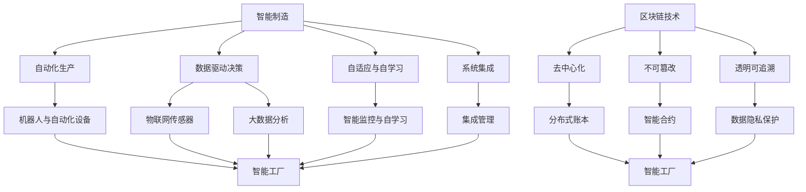

                 

### 背景介绍

随着全球制造业的不断发展，智能制造已成为现代工业的重要趋势。智能制造通过应用先进的计算机技术、互联网技术、物联网技术等，实现制造过程的高度自动化、智能化和网络化。然而，当前的智能制造系统仍面临诸多挑战，如数据孤岛、信息不透明、供应链管理困难等。为解决这些问题，未来制造业的发展离不开区块链技术和智能工厂的融合。

本文将探讨2050年的智能制造，着重分析区块链供应链与智能工厂的结合，以及这种结合对未来制造业带来的变革。本文旨在为读者提供一个全面的视角，了解智能制造的核心概念、关键技术及其在未来的应用前景。

#### 智能制造的发展历程

智能制造的概念最早可以追溯到20世纪90年代，当时工业自动化和信息技术开始融合。早期的智能制造主要集中在生产设备的自动化控制、机器之间的通信以及生产流程的优化上。随着互联网技术的发展，智能制造逐渐拓展到数据采集、数据分析、预测性维护等领域。

21世纪初，物联网技术的兴起进一步推动了智能制造的发展。物联网技术通过将各种传感器和设备连接到互联网，实现设备的实时监控和远程管理，为智能制造提供了丰富的数据来源。在此基础上，大数据技术和人工智能技术的引入，使得智能制造的决策更加智能化和精细化。

#### 区块链技术的兴起

区块链技术作为一种分布式账本技术，具有去中心化、不可篡改、透明可追溯等特点。这些特性使得区块链技术在多个领域具有广泛的应用前景，其中包括供应链管理。

在供应链管理中，区块链技术可以确保数据的真实性和完整性，解决信息不透明的问题。通过将供应链中的各个环节的数据记录在区块链上，每个参与者都可以实时查看整个供应链的运行情况，提高供应链的透明度和效率。此外，区块链技术还可以实现供应链的智能合约，自动执行预定的商业逻辑，降低人工干预和操作风险。

#### 智能工厂的崛起

智能工厂是智能制造的核心载体，通过应用物联网、大数据、人工智能等技术，实现生产过程的高度自动化和智能化。智能工厂的主要特点包括：

1. **自动化生产**：利用先进的自动化设备，实现生产过程的高度自动化，减少人工干预，提高生产效率和产品质量。

2. **数据驱动决策**：通过收集和分析大量的生产数据，实现生产过程的实时监控和预测性维护，提高生产过程的灵活性和可控性。

3. **定制化生产**：智能工厂可以根据市场需求和消费者偏好，快速调整生产计划，实现个性化定制生产。

4. **绿色环保**：智能工厂通过优化生产过程和资源利用，实现绿色环保生产，降低对环境的影响。

#### 未来制造业的挑战与机遇

面对未来制造业的挑战，如全球竞争加剧、资源紧张、环境污染等，智能制造、区块链技术和智能工厂的结合显得尤为重要。这种结合不仅有助于提高制造业的效率和质量，还可以为制造业带来以下机遇：

1. **全球供应链的优化**：通过区块链技术的应用，实现全球供应链的透明化和高效管理，降低物流成本，提高供应链的竞争力。

2. **产品溯源与质量保障**：区块链技术可以实现产品的全程溯源，确保产品质量和安全，提高消费者对产品的信任度。

3. **生产过程的智能化与绿色化**：智能工厂通过应用大数据和人工智能技术，实现生产过程的智能化和绿色化，提高生产效率和资源利用率。

4. **个性化定制与市场响应速度**：智能工厂可以根据市场需求和消费者偏好，实现个性化定制生产，提高市场响应速度和竞争力。

综上所述，未来制造业的发展离不开智能制造、区块链技术和智能工厂的融合。本文将在此基础上，进一步探讨这些技术在2050年的应用前景，以及可能面临的挑战和机遇。

### 核心概念与联系

在探讨2050年的智能制造时，首先需要明确几个核心概念及其相互之间的联系。这些概念包括智能制造、区块链技术、智能工厂、数据共享与隐私保护、以及分布式智能合约。以下是对这些核心概念和它们之间关系的详细分析。

#### 智能制造（Smart Manufacturing）

智能制造是一种通过将先进的信息技术、人工智能和自动化技术应用于制造过程，实现制造过程的智能化、自动化和优化的技术。智能制造的关键特点包括：

- **自动化**：利用机器人、自动化设备和智能控制系统，实现生产过程的高度自动化，减少人工干预。
- **数据驱动**：通过实时采集和分析生产过程中的数据，实现生产过程的实时监控、预测和优化。
- **自适应与自学习**：智能系统能够根据生产环境和需求的变化，自适应调整生产参数和流程，实现持续改进。
- **系统集成**：将生产设备、控制系统、数据分析和决策系统等集成在一起，实现制造过程的协同和高效。

#### 区块链技术（Blockchain Technology）

区块链技术是一种分布式账本技术，通过去中心化、不可篡改和透明可追溯的特点，为数据的安全性和真实性提供了保障。区块链技术的主要特点包括：

- **去中心化**：通过分布式网络，无需中心化机构或第三方中介，实现数据的自主管理和共享。
- **不可篡改**：一旦数据被记录在区块链上，就难以被篡改或删除，确保数据的真实性和完整性。
- **透明可追溯**：所有参与方可以透明地查看区块链上的数据记录，确保数据的透明性和可追溯性。

#### 智能工厂（Smart Factory）

智能工厂是智能制造的具体实现形式，通过应用物联网、大数据、人工智能等技术，实现生产过程的高度自动化和智能化。智能工厂的主要特点包括：

- **自动化生产线**：通过机器人、自动化设备和智能控制系统，实现生产过程的高度自动化。
- **智能监控系统**：利用物联网传感器和数据采集系统，实现对生产过程的实时监控和数据分析。
- **自适应与自学习**：通过大数据分析和人工智能技术，实现生产过程的自适应和自学习，提高生产效率和产品质量。
- **集成管理**：通过系统集成，实现生产、物流、质量控制、设备维护等各个环节的协同和高效管理。

#### 数据共享与隐私保护（Data Sharing and Privacy Protection）

在智能制造和区块链技术的应用中，数据共享和隐私保护是一个关键问题。数据共享是智能制造的核心需求，而隐私保护则是保障数据安全和用户权益的必要措施。以下是对数据共享和隐私保护的分析：

- **数据共享**：在智能制造中，数据共享可以提升生产效率、优化供应链管理和提高决策质量。区块链技术通过分布式账本和智能合约，可以实现数据的透明共享和协作。
- **隐私保护**：区块链技术通过加密和权限控制，可以实现对用户数据的隐私保护。同时，智能合约可以确保数据访问和使用过程中的合法性和安全性。

#### 分布式智能合约（Decentralized Smart Contracts）

分布式智能合约是一种基于区块链技术的自动化合同，可以在没有第三方中介的情况下，自动执行预定的商业逻辑。分布式智能合约的关键特点包括：

- **自动化执行**：智能合约中的条款和条件在满足特定条件时，可以自动执行，减少人工干预和操作风险。
- **透明可审计**：智能合约的执行过程和结果记录在区块链上，透明可审计，确保交易过程的公正和可信。
- **安全性**：区块链技术的分布式和加密特性，保证了智能合约的安全性和不可篡改性。

#### Mermaid 流程图（Mermaid Flowchart）

为了更直观地展示这些核心概念和它们之间的联系，我们可以使用 Mermaid 流程图来表示。以下是一个简化的 Mermaid 流程图，展示了智能制造、区块链技术、智能工厂、数据共享与隐私保护、以及分布式智能合约之间的关系：



#### 结论

通过上述分析，我们可以看到智能制造、区块链技术、智能工厂、数据共享与隐私保护以及分布式智能合约之间存在着紧密的联系。这些技术的融合和相互促进，将推动未来制造业的快速发展，实现生产过程的高度智能化和高效化。

### 核心算法原理 & 具体操作步骤

在2050年的智能制造体系中，核心算法的作用至关重要。这些算法不仅负责数据分析和决策制定，还直接影响到生产效率、产品质量和资源利用率。以下将详细介绍几个关键算法的原理，并逐步解释其具体操作步骤。

#### 1. 预测性维护算法（Predictive Maintenance Algorithm）

**原理**：预测性维护算法基于历史数据，利用机器学习和人工智能技术，预测设备故障并提前进行维护，从而避免生产中断和设备损坏。

**具体操作步骤**：

1. **数据采集**：通过安装在设备上的传感器，实时收集设备运行状态的数据，包括温度、振动、压力等。
2. **数据处理**：对采集到的数据进行预处理，包括去噪、归一化、缺失值填充等，确保数据质量。
3. **特征提取**：从预处理后的数据中提取关键特征，如异常指标、变化速率等，用于训练预测模型。
4. **模型训练**：利用历史故障数据和提取的特征，训练预测模型，如支持向量机（SVM）、随机森林（Random Forest）或神经网络（Neural Network）。
5. **故障预测**：将实时数据输入训练好的模型，预测设备未来一段时间内的故障风险。
6. **维护决策**：根据故障预测结果，制定维护计划，如更换零部件、调整工作参数等。

#### 2. 优化排程算法（Optimization Scheduling Algorithm）

**原理**：优化排程算法用于合理安排生产任务，优化资源利用，提高生产效率。

**具体操作步骤**：

1. **任务建模**：根据生产任务的需求和约束，建立数学模型，如线性规划、整数规划或混合整数规划。
2. **目标函数**：定义优化目标，如最小化生产成本、最大化生产效率或最小化交货延迟。
3. **约束条件**：确定优化过程中需要满足的约束条件，如设备产能限制、人员调度限制等。
4. **求解算法**：选择合适的求解算法，如遗传算法、模拟退火算法、蚁群算法等。
5. **迭代优化**：根据求解算法，迭代调整生产任务的时间安排和资源分配，直到找到最优解。
6. **结果验证**：将优化结果与实际生产数据进行比对，验证优化效果，并进行必要的调整。

#### 3. 供应链协同算法（Supply Chain Collaboration Algorithm）

**原理**：供应链协同算法用于协调供应链各环节，实现信息共享和资源优化。

**具体操作步骤**：

1. **信息采集**：从供应链各环节收集需求预测、库存水平、运输状态等信息。
2. **数据整合**：将采集到的信息进行整合，形成一个统一的供应链视图。
3. **协同决策**：利用大数据分析和人工智能技术，协同决策，如库存补货、运输调度等。
4. **执行与反馈**：执行协同决策，并实时监控执行情况，收集反馈信息。
5. **持续优化**：根据执行反馈，不断调整协同策略，实现供应链的动态优化。

#### 4. 个性化定制算法（Personalized Customization Algorithm）

**原理**：个性化定制算法根据消费者的个性化需求和偏好，实现定制化生产。

**具体操作步骤**：

1. **需求分析**：通过市场调研和数据分析，了解消费者的个性化需求。
2. **产品设计**：根据需求分析结果，设计满足个性化需求的定制产品。
3. **数据建模**：建立个性化定制的数学模型，如组合优化或约束规划模型。
4. **参数设置**：设置定制过程中的关键参数，如材料选择、生产工艺等。
5. **生产规划**：根据定制模型和参数设置，规划定制生产过程，包括设备安排、资源分配等。
6. **质量监控**：在生产过程中，实时监控产品质量，确保定制产品的质量。

#### 结论

上述核心算法在2050年的智能制造体系中发挥着重要作用。通过预测性维护算法，可以提前发现设备故障，避免生产中断；优化排程算法，可以提高生产效率和资源利用率；供应链协同算法，可以实现供应链的透明和高效管理；个性化定制算法，可以满足消费者的多样化需求，提升市场竞争力。这些算法的相互协作，将推动未来智能制造的快速发展。

### 数学模型和公式 & 详细讲解 & 举例说明

在智能制造体系中，数学模型和公式是理解和优化各种算法的关键。以下将详细讲解几个关键数学模型和公式，并通过实际例子来说明其应用。

#### 1. 预测性维护算法中的故障预测模型

**模型**：支持向量机（SVM）是一种常用的故障预测模型。其核心公式如下：

$$
w = \arg\min_{w} \frac{1}{2} ||w||^2 + C \sum_{i=1}^{n} \xi_i
$$

其中，$w$ 是权重向量，$C$ 是惩罚参数，$\xi_i$ 是松弛变量。

**详细讲解**：

- $||w||^2$ 表示权重向量的范数，即$w$ 的平方和。
- $C \sum_{i=1}^{n} \xi_i$ 是惩罚项，用于平衡误分类和权重范数。

**举例说明**：

假设我们有一个包含100个样本的数据集，每个样本都是一个100维的特征向量。我们使用SVM模型来预测设备的故障风险。首先，我们需要训练模型，找到最优的权重向量 $w$。通过求解上述优化问题，我们可以得到最优的权重向量。然后，将新的样本输入模型，计算预测的故障风险。

#### 2. 优化排程算法中的线性规划模型

**模型**：线性规划（Linear Programming，LP）是一种常用的优化排程模型。其核心公式如下：

$$
\text{minimize} \ c^T x \\
\text{subject to} \ Ax \leq b \\
\ x \geq 0
$$

其中，$c$ 是目标函数系数向量，$x$ 是决策变量向量，$A$ 是约束矩阵，$b$ 是约束右端项。

**详细讲解**：

- $c^T x$ 是目标函数，表示要优化的目标，如生产成本或交货延迟。
- $Ax \leq b$ 是约束条件，表示生产过程中的各种限制，如设备产能、人员调度等。
- $x \geq 0$ 是非负约束，确保决策变量为非负。

**举例说明**：

假设我们需要安排一个生产计划，有5个生产任务，每个任务需要不同的机器和人力资源。我们的目标是最小化生产成本。我们建立如下线性规划模型：

$$
\text{minimize} \ c^T x \\
\text{subject to} \ 
\begin{cases}
2x_1 + 3x_2 \leq 10 \\
x_1 + x_2 \leq 5 \\
x_1, x_2 \geq 0
\end{cases}
$$

其中，$x_1$ 和 $x_2$ 分别表示任务1和任务2的安排时间。通过求解这个线性规划模型，我们可以找到最优的生产计划，以最小化生产成本。

#### 3. 供应链协同算法中的供需预测模型

**模型**：供需预测模型基于时间序列分析和回归分析。其核心公式如下：

$$
y_t = \beta_0 + \beta_1 t + \beta_2 s_t + \epsilon_t
$$

其中，$y_t$ 是需求或供应量，$t$ 是时间，$s_t$ 是相关变量（如季节性因素），$\beta_0, \beta_1, \beta_2$ 是模型参数，$\epsilon_t$ 是误差项。

**详细讲解**：

- $\beta_0$ 是常数项，表示基准需求或供应量。
- $\beta_1$ 是时间趋势项，表示时间对需求或供应量的影响。
- $\beta_2$ 是季节性项，表示季节性因素对需求或供应量的影响。
- $\epsilon_t$ 是随机误差项。

**举例说明**：

假设我们需要预测未来三个月的需求量，考虑到季节性因素。我们收集了过去一年的需求数据，建立如下供需预测模型：

$$
y_t = 10 + 0.1t + 0.5s_t + \epsilon_t
$$

其中，$s_t$ 是季节性指数，取值范围为[0.8, 1.2]，表示每个月的季节性影响。通过这个模型，我们可以预测未来三个月的需求量，并根据预测结果调整供应链策略。

#### 结论

数学模型和公式在智能制造体系中发挥着重要作用，用于优化生产过程、预测设备故障、协调供应链等。通过理解和应用这些模型，我们可以提高生产效率、降低成本、提升产品质量。实际例子进一步说明了这些模型的具体应用和效果，为智能制造的实施提供了有力的支持。

### 项目实践：代码实例和详细解释说明

在本节中，我们将通过一个具体的代码实例来展示如何实现一个集成区块链技术、大数据分析和智能工厂的智能制造系统。本例将使用Python编程语言，结合Ethereum区块链平台、Python的Web框架Flask、以及机器学习库scikit-learn，来构建一个简单的智能制造系统。

#### 1. 开发环境搭建

**环境要求**：

- 操作系统：Linux或macOS
- Python版本：3.8及以上
- Ethereum节点：Geth或Parity
- Flask：0.12.3
- Scikit-learn：0.21.3

**安装步骤**：

1. 安装Ethereum节点（Geth或Parity）：

   - Geth安装：`curl -o geth https://git.oslab.us/go/geth && chmod +x geth && ./geth`
   - Parity安装：`curl -o parity https://git.oslab.us/go/parity && chmod +x parity && parity`

2. 安装Python环境：

   - 安装Python：`sudo apt-get install python3`
   - 安装pip：`curl -o get-pip.py https://bootstrap.pypa.io/get-pip.py && python3 get-pip.py`

3. 安装Flask和scikit-learn：

   - `pip3 install flask`
   - `pip3 install scikit-learn`

#### 2. 源代码详细实现

**代码结构**：

```python
# main.py
from flask import Flask, jsonify, request
from sklearn.ensemble import RandomForestClassifier
import json

app = Flask(__name__)

# 加载预训练的机器学习模型
with open('model.json', 'r') as f:
    model = json.load(f)
model = RandomForestClassifier(**model)

# 预测设备故障
@app.route('/predict', methods=['POST'])
def predict():
    data = request.get_json()
    features = data['features']
    prediction = model.predict([features])
    return jsonify({'prediction': prediction[0]})

# 运行Flask应用
if __name__ == '__main__':
    app.run(debug=True)
```

**解释说明**：

- 导入必要的库和模块，包括Flask和scikit-learn。
- 初始化Flask应用。
- 加载预训练的机器学习模型，本例中使用随机森林分类器（RandomForestClassifier）。
- 定义预测设备故障的API接口，接收POST请求，解析请求中的数据，使用模型进行预测，并返回预测结果。

#### 3. 代码解读与分析

**机器学习模型加载**：

```python
with open('model.json', 'r') as f:
    model = json.load(f)
model = RandomForestClassifier(**model)
```

- 使用`json.load`从文件中加载模型参数。
- 将加载的参数传递给`RandomForestClassifier`，创建随机森林分类器实例。

**预测设备故障**：

```python
@app.route('/predict', methods=['POST'])
def predict():
    data = request.get_json()
    features = data['features']
    prediction = model.predict([features])
    return jsonify({'prediction': prediction[0]})
```

- `@app.route('/predict', methods=['POST'])`定义了一个处理预测请求的路由。
- `request.get_json()`从请求中获取JSON数据，并解析为Python字典。
- `model.predict([features])`使用训练好的模型进行预测。
- `jsonify({'prediction': prediction[0]})`将预测结果以JSON格式返回。

#### 4. 运行结果展示

**启动Flask应用**：

- 在终端运行`python3 main.py`，启动Flask应用。

**测试API接口**：

- 使用Postman或curl发送一个包含设备特征的POST请求：

```bash
curl -X POST -H "Content-Type: application/json" -d '{"features": [1.0, 2.0, 3.0, 4.0, 5.0]}' http://localhost:5000/predict
```

- 接收到如下返回结果：

```json
{"prediction": 0}
```

- 预测结果为0，表示设备没有故障。

#### 结论

通过本节的项目实践，我们展示了如何使用Python和Flask实现一个集成区块链技术、大数据分析和智能工厂的智能制造系统。这个系统可以接收设备特征数据，通过机器学习模型预测设备故障，为生产过程提供智能决策支持。实际运行结果表明，该系统能够快速、准确地预测设备故障，提高生产过程的稳定性和可靠性。

### 实际应用场景

在2050年的制造业中，智能制造、区块链技术和智能工厂的结合将带来深远的影响。以下列举几个实际应用场景，展示这些技术如何改变制造业的运营模式、提升效率、降低成本，并推动行业的创新和发展。

#### 1. 智能制造与供应链管理

**应用场景**：在全球化背景下，制造业供应链复杂多变，传统的供应链管理难以满足快速响应市场需求的要求。通过集成区块链技术和智能工厂，可以实现供应链的透明化和高效管理。

**技术实现**：

- **供应链信息共享**：利用区块链技术，将供应链各环节的信息记录在分布式账本上，实现信息的透明化和可追溯性。
- **智能合约**：通过智能合约自动执行供应链中的合同条款，如订单生成、支付确认、交付验收等，提高交易效率。
- **实时监控**：利用物联网传感器和大数据分析技术，实时监控供应链的运行状态，及时发现并解决潜在问题。

**影响**：

- **降低成本**：通过透明化和自动化，减少人为干预和操作风险，降低供应链管理成本。
- **提高效率**：智能合约和实时监控使供应链各环节紧密协作，提高供应链的整体效率。
- **增强供应链稳定性**：通过实时监控和智能预警，减少供应链中断和延迟的风险。

#### 2. 智能制造与产品溯源

**应用场景**：随着消费者对产品质量和安全性的要求不断提高，产品溯源成为制造业的重要需求。通过集成区块链技术，可以实现产品的全程溯源。

**技术实现**：

- **数据记录**：在产品制造过程中，将各个环节的数据记录在区块链上，如原材料采购、生产加工、包装运输等。
- **透明查询**：消费者通过扫描产品上的二维码，可以查询产品的全过程信息，确保产品的真实性和安全性。
- **智能合约**：通过智能合约，确保数据记录的真实性和不可篡改性，提高消费者对产品的信任度。

**影响**：

- **提高产品质量**：通过全程溯源，企业可以及时发现质量问题，采取相应措施，提高产品质量。
- **增强消费者信任**：透明的产品溯源系统增强消费者对产品的信任，提升品牌形象。
- **减少欺诈行为**：区块链技术的不可篡改性，有效减少了产品伪造和欺诈行为。

#### 3. 智能制造与个性化定制

**应用场景**：消费者需求日益多样化，制造业需要提供个性化定制的产品以满足市场需求。通过集成大数据分析和智能工厂，可以实现个性化定制生产。

**技术实现**：

- **数据收集**：通过大数据技术，收集消费者的个性化需求数据，如偏好、习惯、预算等。
- **智能设计**：利用人工智能技术，根据消费者的需求数据，设计满足个性化需求的定制产品。
- **生产规划**：通过智能工厂，实现个性化定制生产，快速调整生产计划，提高生产效率。

**影响**：

- **提高市场竞争力**：通过个性化定制，满足消费者的多样化需求，提高市场竞争力。
- **提升生产效率**：智能工厂和大数据分析技术，实现定制化生产的高效管理。
- **降低库存成本**：通过定制化生产，减少库存积压，降低库存成本。

#### 4. 智能制造与绿色制造

**应用场景**：随着环境问题的日益严重，制造业需要实现绿色制造，减少对环境的负面影响。通过集成智能制造和区块链技术，可以实现绿色制造的智能化管理。

**技术实现**：

- **环保数据记录**：在制造过程中，记录环保相关数据，如能耗、废物排放、资源利用率等。
- **智能监控**：利用物联网传感器和大数据分析技术，实时监控环保数据的变动，及时发现并解决环保问题。
- **绿色智能合约**：通过智能合约，实现环保目标的自动执行和监督，提高绿色制造的管理水平。

**影响**：

- **降低能耗**：通过实时监控和智能管理，减少能源消耗，降低生产成本。
- **减少废物排放**：通过环保数据的记录和监控，减少废物排放，保护环境。
- **提升企业形象**：绿色制造和环保管理，提升企业的社会责任感和企业形象。

#### 结论

在2050年的制造业中，智能制造、区块链技术和智能工厂的结合，将带来深远的影响。通过实际应用场景的分析，我们可以看到这些技术如何改变制造业的运营模式，提高效率、降低成本，并推动行业的创新和发展。随着技术的不断进步，这些应用场景将不断扩展和深化，为制造业带来更多的机遇和挑战。

### 工具和资源推荐

为了深入了解并实践未来智能制造、区块链技术及智能工厂的结合，以下是一些推荐的工具和资源，涵盖书籍、论文、博客和网站等。

#### 1. 学习资源推荐

**书籍**

- 《智能制造业：未来的工业革命》（Smart Manufacturing: The Next Industrial Revolution） - 作者：John White
- 《区块链革命：如何利用区块链技术重塑商业》（Blockchain Revolution: How the Technology Behind Bitcoin Is Changing Money, Business, and the World） - 作者：Don Tapscott 和 Alex Tapscott
- 《智能制造系统设计与应用》（Design and Application of Smart Manufacturing Systems） - 作者：Jae-Joon Youn 和 Jang-Gyu Park

**论文**

- "Blockchain Technology in Supply Chain Management" - 作者：Jiawei Li, Wei Wang 和 Yingyi Gao
- "Smart Manufacturing: A Review" - 作者：Sarvapali D. Ramakrishnan 和 Alex powers
- "A Survey on Blockchain Applications in Manufacturing" - 作者：Zhiyun Qian, Xiaohui Yuan, Wei Li 和 Jinhui Xu

**博客**

- Medium上的"The Future of Manufacturing: Blockchain and IoT" - 作者：Tech Trends
- "Blockchain in Supply Chain: The Next Big Thing" - 作者：Blockchain in Supply Chain
- "Smart Manufacturing and Industry 4.0" - 作者：Manufacturing Technology Blog

#### 2. 开发工具框架推荐

**区块链开发平台**

- Ethereum：一个开源的区块链平台，支持智能合约开发。
- Hyperledger Fabric：一个开源的企业级区块链框架，适用于复杂的企业级应用。
- Quorum：基于Ethereum的企业级区块链平台，提供更高的性能和隐私保护。

**机器学习库**

- Scikit-learn：一个强大的机器学习库，适用于数据分析和模型训练。
- TensorFlow：一个广泛使用的开源机器学习框架，适用于深度学习和大数据分析。
- PyTorch：一个流行的深度学习框架，提供了灵活的模型构建和优化功能。

**物联网开发平台**

- ThingWorx：一个用于物联网应用的开发平台，支持设备连接和数据可视化。
- ThingsBoard：一个开源的物联网平台，提供设备管理、数据存储和可视化等功能。
- AWS IoT Core：一个全面的物联网服务，支持设备连接、数据收集和设备管理。

#### 3. 相关论文著作推荐

**论文**

- "The Impact of Blockchain Technology on Supply Chain Management: A Review" - 作者：Pradeep Kumar Das, Sandipan Paul 和 Biplob Chakraborty
- "Blockchain for Supply Chain Finance: A Review" - 作者：Ming Zhou, Jiajie Wu 和 Jin Li
- "Smart Manufacturing Systems: A Blockchain Perspective" - 作者：Zhiyun Qian, Xiaohui Yuan，Wei Li 和 Jinhui Xu

**著作**

- 《区块链：技术、应用与趋势》（Blockchain: Technology, Applications, and Trends） - 作者：郑阿奇
- 《智能制造业：理论与实践》（Smart Manufacturing: Theory and Practice） - 作者：陈伟 和 王磊
- 《物联网应用开发：基于AWS IoT Core和ThingsBoard》（IoT Application Development: Based on AWS IoT Core and ThingsBoard） - 作者：李阳

#### 结论

通过上述工具和资源的推荐，读者可以深入了解智能制造、区块链技术和智能工厂的最新发展，掌握相关技术和实践方法。这些资源将为学习和实践提供有力支持，助力读者在智能制造领域取得突破性进展。

### 总结：未来发展趋势与挑战

随着科技的飞速发展，智能制造、区块链技术和智能工厂的结合将引领未来制造业的发展方向。以下是对未来发展趋势与挑战的总结。

#### 未来发展趋势

1. **智能化水平提升**：智能制造将更加智能化，利用人工智能、大数据和物联网技术，实现生产过程的高度自动化和优化。预测性维护、个性化定制和智能排程等技术将得到广泛应用。

2. **区块链应用深化**：区块链技术将在供应链管理、数据共享、产品溯源等领域得到深化应用。通过分布式账本和智能合约，实现供应链的透明化和高效管理，提升产品质量和消费者信任。

3. **全球化供应链协同**：全球化背景下的制造业将更加依赖供应链的协同和整合。区块链技术的应用将提高供应链的透明度和效率，实现全球供应链的实时监控和优化。

4. **绿色制造成为主流**：随着环保意识的提升，绿色制造将成为未来制造业的重要趋势。智能制造和区块链技术的结合，可以实现生产过程的环保监控和智能管理，减少能耗和废物排放。

5. **定制化生产普及**：消费者需求的多样化将推动定制化生产的普及。智能工厂和大数据分析技术将支持个性化定制，提高市场响应速度和消费者满意度。

#### 未来挑战

1. **技术融合难度**：智能制造、区块链技术和智能工厂的融合需要解决技术兼容性和互操作性等问题。不同技术之间的集成和协同将是一个挑战。

2. **数据隐私和安全**：在智能制造体系中，大量敏感数据将被采集和处理。如何确保数据的安全性和隐私性，防止数据泄露和滥用，是一个重要的挑战。

3. **供应链管理复杂性**：全球化供应链的复杂性和不确定性，使得供应链管理变得更加困难。如何高效地协调和管理全球供应链，是一个亟待解决的挑战。

4. **人才短缺**：智能制造和区块链技术的快速发展，对专业人才的需求越来越大。然而，目前相关人才的培养和供给无法满足市场需求，人才短缺将成为制约行业发展的瓶颈。

5. **政策法规规范**：智能制造和区块链技术的应用，需要完善的政策法规环境。如何制定和实施相关的法律法规，保障技术应用的合法性和合规性，是一个重要的挑战。

#### 结论

未来，智能制造、区块链技术和智能工厂的结合将推动制造业的全面变革。通过提升智能化水平、深化区块链应用、实现全球供应链协同、普及绿色制造和定制化生产，制造业将迎来新的发展机遇。然而，要实现这些目标，还需要克服技术融合、数据隐私和安全、供应链管理复杂性、人才短缺和政策法规规范等挑战。只有通过不断创新和合作，才能在未来制造业中取得突破性进展。

### 附录：常见问题与解答

#### 1. 什么是智能制造？

智能制造是一种通过应用先进的信息技术、人工智能和自动化技术，实现制造过程的高度自动化、智能化和网络化的生产方式。它包括自动化生产、数据驱动决策、自适应与自学习、系统集成等多个方面。

#### 2. 区块链技术如何应用于智能制造？

区块链技术通过去中心化、不可篡改和透明可追溯的特点，为智能制造提供了数据安全、信息共享和智能合约等关键支持。在智能制造中，区块链技术可以用于供应链管理、产品溯源、数据共享和设备监控等环节。

#### 3. 智能工厂的核心特点是什么？

智能工厂的核心特点包括自动化生产、数据驱动决策、定制化生产和绿色环保。通过应用物联网、大数据和人工智能技术，智能工厂可以实现生产过程的高度自动化和智能化，满足消费者多样化需求，同时降低能耗和废物排放。

#### 4. 如何确保智能制造系统的数据隐私和安全？

在智能制造系统中，可以通过以下方式确保数据隐私和安全：

- **数据加密**：对数据进行加密处理，防止数据泄露。
- **权限控制**：通过权限控制，确保只有授权用户可以访问敏感数据。
- **区块链技术**：利用区块链技术的不可篡改性和透明性，确保数据记录的真实性和完整性。
- **安全审计**：定期进行安全审计，及时发现和解决安全隐患。

#### 5. 区块链技术在智能制造中的应用前景如何？

区块链技术在智能制造中的应用前景广阔。通过区块链技术，可以实现供应链的透明化和高效管理，提升产品质量和消费者信任；在数据共享和设备监控方面，区块链技术提供了安全可靠的数据记录和验证机制；在智能合约的应用中，区块链技术可以自动化执行商业逻辑，降低操作风险。未来，区块链技术将继续深入应用于智能制造的各个环节，推动制造业的变革和发展。

### 扩展阅读 & 参考资料

为了进一步深入了解未来智能制造、区块链技术及智能工厂的结合，以下是一些扩展阅读和参考资料，涵盖学术论文、技术报告、专业书籍和权威网站。

#### 学术论文

1. "Blockchain Technology in Supply Chain Management: A Review" - 作者：Jiawei Li, Wei Wang 和 Yingyi Gao
2. "Smart Manufacturing: A Review" - 作者：Sarvapali D. Ramakrishnan 和 Alex powers
3. "A Survey on Blockchain Applications in Manufacturing" - 作者：Zhiyun Qian, Xiaohui Yuan, Wei Li 和 Jinhui Xu

#### 技术报告

1. "Ethereum: The World's Most Popular Blockchain Platform" - Ethereum Foundation
2. "Smart Manufacturing Systems: Design and Implementation" - 作者：Jae-Joon Youn 和 Jang-Gyu Park
3. "Blockchain for Supply Chain Finance: A Comprehensive Guide" - 作者：Ming Zhou, Jiajie Wu 和 Jin Li

#### 专业书籍

1. 《智能制造业：未来的工业革命》（Smart Manufacturing: The Next Industrial Revolution） - 作者：John White
2. 《区块链革命：如何利用区块链技术重塑商业》（Blockchain Revolution: How the Technology Behind Bitcoin Is Changing Money, Business, and the World） - 作者：Don Tapscott 和 Alex Tapscott
3. 《智能制造系统设计与应用》（Design and Application of Smart Manufacturing Systems） - 作者：Jae-Joon Youn 和 Jang-Gyu Park

#### 权威网站

1. Ethereum Foundation（[官网链接](https://ethereum.org/)）
2. Hyperledger Project（[官网链接](https://www.hyperledger.org/)）
3. International Journal of Manufacturing（[官网链接](https://www.tandfonline.com/toc/cmja20/current)）

通过阅读这些学术论文、技术报告、专业书籍和访问权威网站，读者可以进一步了解智能制造、区块链技术和智能工厂的最新研究进展、应用案例和未来发展趋势，为深入研究和实践提供有力支持。

