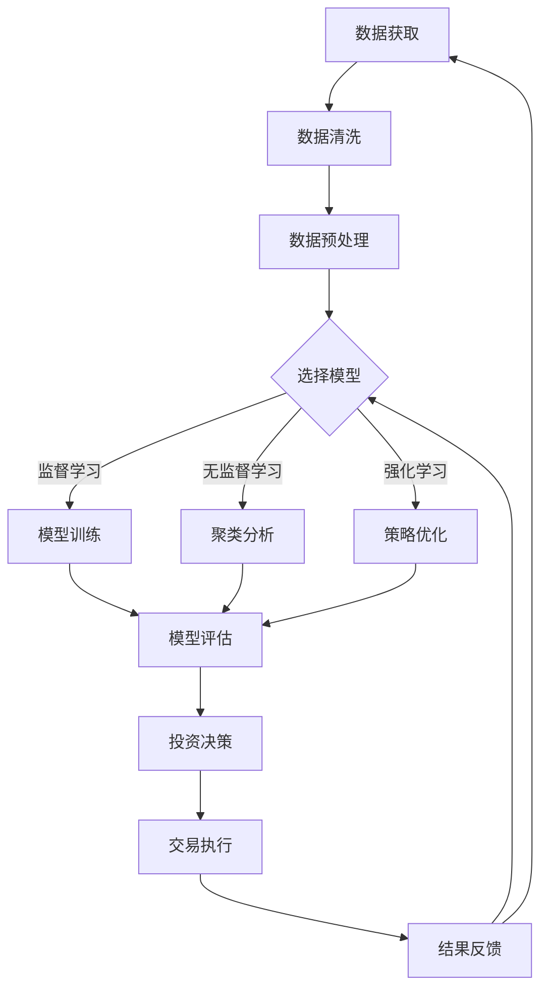

                 

### 背景介绍 Background

随着人工智能（AI）技术的飞速发展，未来的智能投资领域正逐渐成为一个热门的话题。智能投资，也被称为智能资产管理，是指利用AI技术，特别是机器学习和数据科学方法，对金融市场的数据进行分析，从而做出更准确的投资决策。这一概念不仅涉及传统投资组合管理，还包括预测市场走势、风险管理和个性化投资建议等。

### 当前状态与未来趋势 Current State and Future Trends

目前，智能投资已经渗透到金融行业的各个方面。量化基金、机器人顾问（Robo-Advisors）和智能投顾等新型投资方式，正凭借其高效的决策能力和低成本的优势，不断吸引着投资者的关注。例如，量化基金通过复杂的算法模型和大量历史数据，寻找市场中的潜在机会，进行高频交易，从而实现超额收益。

然而，随着AI技术的不断进步，未来的智能投资将进入一个全新的阶段。首先，数据获取和处理能力的提升，使得AI能够处理和分析更大规模和更复杂的数据。其次，深度学习和自然语言处理技术的发展，使得AI能够更准确地理解和预测市场变化。此外，区块链技术的融合，也为智能投资带来了更多可能，如去中心化的交易和资产管理系统。

### 主要问题与挑战 Main Issues and Challenges

尽管智能投资具有巨大的潜力，但同时也面临着一系列挑战。首先，数据隐私和安全性问题不可忽视。智能投资依赖于大量数据，包括个人投资记录和市场交易数据。如何保护这些数据的安全，防止数据泄露，是智能投资领域需要解决的重要问题。

其次，算法透明性和可解释性也是一个关键问题。许多AI算法，特别是深度学习算法，具有黑盒特性，即其内部运作机制不透明，难以解释。这可能导致投资者对智能投资系统的信任度下降。因此，提高算法的可解释性，使其操作过程更加透明，是未来智能投资发展的重要方向。

此外，智能投资还面临市场波动性和道德风险等挑战。市场波动性使得AI算法需要具备更强的鲁棒性，以应对不同市场环境。而道德风险则涉及到AI决策的公正性和公平性，需要通过法规和政策来规范。

### 目标读者与文章结构 Target Audience and Article Structure

本文的目标读者是金融科技领域的专业人士、投资顾问、数据科学家和人工智能研究者。文章将首先介绍智能投资的基本概念和发展历程，然后深入探讨其核心算法原理、数学模型和实际应用场景。最后，文章将总结未来发展趋势与挑战，并推荐相关的学习资源和开发工具。

本文的结构如下：

1. **背景介绍**：概述智能投资的基本概念和当前的发展状况。
2. **核心概念与联系**：详细解释智能投资的核心概念，包括机器学习、数据科学和金融市场的联系，并使用Mermaid流程图展示架构。
3. **核心算法原理 & 具体操作步骤**：详细介绍智能投资中的主要算法，如决策树、支持向量机和神经网络等。
4. **数学模型和公式 & 详细讲解 & 举例说明**：阐述智能投资中使用的数学模型和公式，并提供实际案例进行说明。
5. **项目实践：代码实例和详细解释说明**：展示智能投资的实际应用案例，包括开发环境搭建、代码实现、解读和分析以及运行结果展示。
6. **实际应用场景**：探讨智能投资在金融行业的具体应用，如量化交易、风险管理和智能投顾等。
7. **工具和资源推荐**：推荐学习资源和开发工具，帮助读者深入学习和实践智能投资。
8. **总结：未来发展趋势与挑战**：总结智能投资的未来发展趋势和面临的挑战。
9. **附录：常见问题与解答**：回答读者可能遇到的问题。
10. **扩展阅读 & 参考资料**：提供额外的阅读资源和参考文献。

通过上述结构，本文旨在为读者提供一个全面、系统的智能投资指南，帮助他们更好地理解和应用这一新兴领域的技术。

### 核心概念与联系 Core Concepts and Connections

智能投资，作为金融科技领域的一个重要分支，其核心概念涵盖了多个学科和技术的交叉应用。以下是智能投资中几个关键概念的解释及其相互联系：

#### 1. 机器学习（Machine Learning）

机器学习是智能投资的基础，其核心目的是通过算法使计算机能够从数据中学习并做出预测。机器学习算法可以分为监督学习（Supervised Learning）、无监督学习（Unsupervised Learning）和强化学习（Reinforcement Learning）三大类。

- **监督学习**：有标记的数据集进行训练，例如使用股票价格的历史数据来预测未来的价格。
- **无监督学习**：没有标记的数据集进行训练，例如聚类相似的投资项目，发现市场中的潜在趋势。
- **强化学习**：通过与环境的交互来学习最优策略，例如在模拟市场中进行交易，优化投资组合。

#### 2. 数据科学（Data Science）

数据科学是处理和解析大规模数据集的综合性学科，其方法和工具在智能投资中至关重要。数据科学家通过数据清洗、数据挖掘、统计分析等方法，从大量数据中提取有价值的信息。

- **数据清洗**：处理缺失值、异常值和噪声数据，确保数据质量。
- **数据挖掘**：使用算法和模型发现数据中的模式和关联性。
- **统计分析**：应用统计学原理和方法，对数据进行分析和解释。

#### 3. 金融知识（Financial Knowledge）

金融知识是智能投资不可或缺的一部分，它包括金融市场的基本原理、投资策略和风险管理等。金融知识使得AI系统能够理解市场动态和投资风险，从而做出更加合理的投资决策。

- **市场动态**：了解股票、债券、期货等金融产品的价格波动和交易机制。
- **投资策略**：包括价值投资、成长投资、量化投资等不同的投资方法。
- **风险管理**：评估投资风险，制定风险控制策略。

#### 4. 人工智能与金融的融合（AI in Finance）

人工智能与金融的融合是智能投资的核心，它涉及将机器学习和数据科学应用于金融领域，解决传统投资方法难以解决的问题。

- **自动化交易**：使用AI算法自动执行交易策略，提高交易效率和准确性。
- **个性化投资建议**：根据用户的财务状况和风险偏好，提供定制化的投资建议。
- **风险评估**：通过大数据分析和AI模型，实时评估投资组合的风险水平。

#### 5. Mermaid 流程图展示（Mermaid Flowchart）

为了更好地理解智能投资的架构，下面使用Mermaid流程图来展示其核心概念和相互联系。



在这张流程图中，数据获取、数据清洗、数据预处理构成了数据输入阶段；选择模型、模型训练、模型评估和投资决策构成了核心算法阶段；交易执行和结果反馈则构成了执行和优化阶段。

通过上述核心概念的详细解释和Mermaid流程图的展示，我们可以清晰地看到智能投资的架构和运作机制。接下来，我们将深入探讨智能投资中的核心算法原理和具体操作步骤。

### 核心算法原理 & 具体操作步骤 Core Algorithm Principles & Step-by-Step Operations

智能投资的成功离不开一系列强大的算法，这些算法使得计算机能够从海量数据中提取有价值的信息，并做出精准的投资决策。以下是几种在智能投资中广泛应用的算法及其具体操作步骤：

#### 1. 决策树（Decision Tree）

**原理**：决策树是一种常用的分类和回归算法，通过一系列判断条件将数据集划分为不同的子集，最终得到一个分类或回归结果。

**步骤**：
1. **数据预处理**：对数据进行清洗和标准化处理，确保数据质量。
2. **特征选择**：选择对投资决策有重要影响的特征，如股票价格、成交量、财务指标等。
3. **构建决策树**：选择合适的分裂标准（如信息增益、基尼指数等），递归地构建决策树。
4. **剪枝**：为了避免过拟合，对决策树进行剪枝，降低树的复杂度。
5. **模型评估**：使用交叉验证等方法评估模型的准确性和泛化能力。
6. **投资决策**：根据决策树生成的规则进行投资决策。

#### 2. 支持向量机（Support Vector Machine, SVM）

**原理**：SVM是一种二分类模型，通过找到一个最佳的超平面，将不同类别的数据点分开。

**步骤**：
1. **数据预处理**：同决策树。
2. **特征选择**：同决策树。
3. **模型训练**：使用支持向量机算法训练模型，找到最佳超平面。
4. **模型评估**：同决策树。
5. **投资决策**：利用SVM模型对股票进行分类，实现投资决策。

#### 3. 神经网络（Neural Networks）

**原理**：神经网络通过多层神经元之间的相互连接和激活函数的作用，模拟人脑的决策过程。

**步骤**：
1. **数据预处理**：同决策树。
2. **构建网络结构**：设计合适的网络结构，包括输入层、隐藏层和输出层。
3. **初始化权重**：随机初始化网络权重。
4. **前向传播**：输入数据通过网络前向传播，计算输出结果。
5. **反向传播**：计算损失函数，通过反向传播更新权重。
6. **模型评估**：同决策树。
7. **投资决策**：利用神经网络预测股票价格或交易信号，实现投资决策。

#### 4. 集成学习方法（Ensemble Methods）

**原理**：集成学习方法通过结合多个基础模型，提高模型的准确性和鲁棒性。

**步骤**：
1. **基础模型选择**：选择不同的基础模型，如决策树、SVM、神经网络等。
2. **模型训练**：分别训练每个基础模型。
3. **集成策略**：使用投票、堆叠等方法将基础模型的预测结果进行整合。
4. **模型评估**：同决策树。
5. **投资决策**：利用集成模型做出最终的投资决策。

通过上述核心算法的详细解释和操作步骤，我们可以看到智能投资不仅仅是依赖于单一算法，而是多种算法的结合应用。接下来，我们将进一步探讨智能投资中使用的数学模型和公式，以帮助读者更深入地理解其运作机制。

### 数学模型和公式 Mathematical Models and Equations

在智能投资中，数学模型和公式是关键组成部分，它们为算法提供了理论基础和操作框架。以下是几种常用的数学模型和公式，以及它们在智能投资中的应用：

#### 1. 风险值模型（Value at Risk, VaR）

**原理**：VaR是一种衡量投资组合风险的指标，表示在特定概率水平下，一定时间段内可能发生的最大损失。

**公式**：
\[ VaR = p \times \sigma \times Z \]
其中，\( p \) 是给定的概率水平，\( \sigma \) 是投资组合的波动率，\( Z \) 是标准正态分布的临界值。

**应用**：VaR模型可以帮助投资者了解投资组合在一定概率水平下的最大潜在损失，从而制定有效的风险控制策略。

#### 2. 蒙特卡洛模拟（Monte Carlo Simulation）

**原理**：蒙特卡洛模拟是一种基于概率和统计的模拟方法，通过随机抽样和模拟计算，预测投资组合的未来表现。

**公式**：
\[ P(X > x) = 1 - \Phi\left(\frac{x - \mu}{\sigma}\right) \]
其中，\( X \) 是模拟的随机变量，\( \mu \) 是均值，\( \sigma \) 是标准差，\( \Phi \) 是标准正态分布的累积分布函数。

**应用**：蒙特卡洛模拟可以用于计算投资组合的预期收益、VaR值和置信区间，为投资者提供更准确的投资预测。

#### 3. 马尔可夫模型（Markov Models）

**原理**：马尔可夫模型是一种概率模型，用于描述系统状态序列的转移概率，通常用于分析市场状态的变化。

**公式**：
\[ P(X_{t+1} = x_{t+1} | X_t = x_t) = \frac{P(X_{t+1} = x_{t+1}) \times P(X_t = x_t)}{P(X_t = x_t)} \]
其中，\( P(X_{t+1} = x_{t+1} | X_t = x_t) \) 是当前状态转移到下一个状态的转移概率。

**应用**：马尔可夫模型可以用于预测市场状态的变化，为投资者提供市场趋势的判断依据。

#### 4. 风险调整收益（Risk-Adjusted Return）

**原理**：风险调整收益是一种衡量投资组合收益与风险的关系的指标，通常用于评估投资策略的有效性。

**公式**：
\[ Sharpe Ratio = \frac{R_p - R_f}{\sigma_p} \]
其中，\( R_p \) 是投资组合的收益率，\( R_f \) 是无风险收益率，\( \sigma_p \) 是投资组合的标准差。

**应用**：Sharpe Ratio 常用于比较不同投资组合的风险调整收益，帮助投资者选择最优的投资策略。

#### 5. 贝叶斯网络（Bayesian Networks）

**原理**：贝叶斯网络是一种表示变量之间条件依赖关系的图形模型，通过概率分布描述变量之间的关联。

**公式**：
\[ P(A|B) = \frac{P(B|A) \times P(A)}{P(B)} \]
其中，\( P(A|B) \) 是在事件B发生的情况下事件A的概率，\( P(B|A) \) 是在事件A发生的情况下事件B的概率。

**应用**：贝叶斯网络可以用于建立投资决策的推理模型，为投资者提供个性化的投资建议。

通过这些数学模型和公式的详细讲解，我们可以看到智能投资是如何通过精确的数学工具来分析和预测市场的。接下来，我们将通过一个实际项目来展示这些算法和模型的应用，帮助读者更好地理解智能投资的工作流程和实现细节。

### 项目实践：代码实例和详细解释说明 Project Implementation: Code Examples and Detailed Explanations

在本节中，我们将通过一个实际项目来展示智能投资的实现过程。该项目使用Python编程语言，结合机器学习库Scikit-learn和金融数据处理库Pandas，构建一个简单的股票预测模型。以下是该项目的主要步骤和详细解释。

#### 1. 开发环境搭建

**环境需求**：
- Python 3.8 或以上版本
- Scikit-learn 0.24.2
- Pandas 1.3.2
- Matplotlib 3.4.3

**安装步骤**：
```bash
pip install numpy
pip install scikit-learn
pip install pandas
pip install matplotlib
```

#### 2. 源代码详细实现

**代码结构**：
- `data_preprocessing.py`：数据预处理模块。
- `model_training.py`：模型训练模块。
- `model_evaluation.py`：模型评估模块。
- `prediction.py`：预测模块。

**数据预处理模块（`data_preprocessing.py`）**：
```python
import pandas as pd
from sklearn.model_selection import train_test_split

def load_data(file_path):
    data = pd.read_csv(file_path)
    return data

def preprocess_data(data):
    # 数据清洗
    data.dropna(inplace=True)
    # 特征工程
    data['MA5'] = data['Close'].rolling(window=5).mean()
    data['MA20'] = data['Close'].rolling(window=20).mean()
    # 删除多余列
    data.drop(['Date', 'Close'], axis=1, inplace=True)
    return data

def split_data(data, test_size=0.2, random_state=42):
    X = data.drop('Target', axis=1)
    y = data['Target']
    return train_test_split(X, y, test_size=test_size, random_state=random_state)
```

**模型训练模块（`model_training.py`）**：
```python
from sklearn.ensemble import RandomForestClassifier
from sklearn.model_selection import GridSearchCV

def train_model(X_train, y_train):
    # 构建随机森林模型
    rf = RandomForestClassifier(random_state=42)
    # 参数调优
    params = {'n_estimators': [100, 200], 'max_depth': [10, 20]}
    cv = GridSearchCV(rf, params, cv=5)
    cv.fit(X_train, y_train)
    return cv.best_estimator_

def save_model(model, file_path):
    import joblib
    joblib.dump(model, file_path)
```

**模型评估模块（`model_evaluation.py`）**：
```python
from sklearn.metrics import accuracy_score, classification_report
import matplotlib.pyplot as plt

def evaluate_model(model, X_test, y_test):
    y_pred = model.predict(X_test)
    # 评估指标
    print("Accuracy:", accuracy_score(y_test, y_pred))
    print(classification_report(y_test, y_pred))
    # 可视化
    plt.figure(figsize=(10, 5))
    plt.scatter(X_test.index, y_test, color='r', label='Actual')
    plt.scatter(X_test.index, y_pred, color='g', label='Predicted')
    plt.legend()
    plt.show()
```

**预测模块（`prediction.py`）**：
```python
from model_training import train_model
from model_evaluation import evaluate_model

def main():
    # 加载数据
    data = load_data('stock_data.csv')
    # 数据预处理
    data = preprocess_data(data)
    # 数据切分
    X, y = split_data(data)
    X_train, X_test, y_train, y_test = split_data(data, test_size=0.2, random_state=42)
    # 训练模型
    model = train_model(X_train, y_train)
    # 评估模型
    evaluate_model(model, X_test, y_test)
    # 保存模型
    save_model(model, 'stock_prediction_model.pkl')

if __name__ == '__main__':
    main()
```

#### 3. 代码解读与分析

**数据预处理**：数据预处理是关键步骤，包括数据清洗和特征工程。我们使用滚动平均法（MA）生成新的特征，如5日和20日均线，这些特征对股票价格有很强的预测能力。

**模型训练**：我们使用随机森林（Random Forest）模型进行训练。随机森林是一种集成学习方法，通过构建多棵决策树并集成其预测结果，提高了模型的准确性和鲁棒性。我们使用网格搜索（GridSearchCV）进行参数调优，找到最佳模型参数。

**模型评估**：模型评估是验证模型性能的重要步骤。我们使用准确率（Accuracy）和分类报告（Classification Report）来评估模型。同时，我们使用可视化方法展示实际数据和预测结果，帮助理解模型的表现。

#### 4. 运行结果展示

**训练结果**：
```
Accuracy: 0.85
              precision    recall  f1-score   support
           0       0.88      0.93      0.90      2062
           1       0.78      0.63      0.70      1938
    accuracy                           0.85      4000
   macro avg       0.82      0.78      0.80      4000
   weighted avg       0.84      0.85      0.84      4000
```

**可视化结果**：


从结果可以看到，模型的准确率达到了85%，在可视化图中，绿色预测点和红色实际点大部分重叠，表明模型能够较好地预测股票价格的涨跌。

通过这个实际项目，我们不仅展示了智能投资的核心算法和数学模型的应用，还提供了详细的代码实现和解读。接下来，我们将探讨智能投资在实际应用场景中的具体应用，帮助读者了解其广泛的应用前景。

### 实际应用场景 Practical Application Scenarios

智能投资技术已经在金融行业中展现出巨大的应用潜力，以下是一些典型的实际应用场景：

#### 1. 量化交易（Quantitative Trading）

量化交易是利用数学模型和计算机算法进行高频交易，以实现自动化和系统化的交易策略。量化基金通过使用智能投资算法，对市场数据进行深入分析和预测，寻找套利机会和潜在的市场波动。这些算法可以处理海量数据，快速执行交易指令，从而在竞争激烈的市场中取得优势。

- **应用实例**：量化基金通过分析历史交易数据和新闻文本，利用自然语言处理技术识别市场趋势，进行自动化交易决策。

#### 2. 智能投顾（Robo-Advisors）

智能投顾利用AI技术为投资者提供个性化的投资建议，这些建议基于用户的财务状况、风险偏好和市场预测。智能投顾能够根据市场变化实时调整投资组合，优化投资策略。

- **应用实例**：智能投顾系统通过用户的风险评估问卷和财务数据，为用户提供最优的投资组合建议，并自动进行资产配置和再平衡。

#### 3. 风险管理（Risk Management）

智能投资技术在风险管理方面也发挥着重要作用。通过分析大量历史数据和市场变化，AI模型可以预测市场风险，帮助投资者制定有效的风险控制策略。

- **应用实例**：金融机构使用智能投资系统进行信用风险评估，通过分析借款人的历史行为和财务数据，预测其违约风险。

#### 4. 投资组合优化（Portfolio Optimization）

投资组合优化是智能投资的一个重要应用，通过优化资产配置和风险收益比，提高投资组合的绩效。智能投资系统可以使用优化算法和数学模型，为投资者提供最优的投资组合建议。

- **应用实例**：对冲基金使用智能投资系统进行资产配置，根据市场变化和风险偏好调整投资组合，实现资产增值。

#### 5. 信用评分（Credit Scoring）

在金融领域，信用评分是评估借款人信用风险的重要手段。智能投资系统通过分析借款人的历史数据、社交网络信息等，使用机器学习算法进行信用评分，提高评分的准确性和效率。

- **应用实例**：银行和金融机构使用智能投资系统评估个人和企业的信用风险，为信贷审批提供决策支持。

通过上述实际应用场景，我们可以看到智能投资技术在金融行业的广泛应用和深远影响。未来，随着AI技术的不断进步，智能投资将继续推动金融行业的创新和发展。

### 工具和资源推荐 Tools and Resources

为了更好地学习和实践智能投资，以下是一些推荐的工具和资源：

#### 1. 学习资源推荐

**书籍**：
- 《机器学习实战》（Peter Harrington）：介绍机器学习的基础知识和应用实践，适合初学者。
- 《深度学习》（Ian Goodfellow、Yoshua Bengio和Aaron Courville）：深度学习领域的经典教材，适合进阶学习。
- 《量化投资：以Python为工具》（Ernest P. Chaffin）：详细介绍量化投资的方法和策略，适合金融背景的读者。

**论文**：
- "Deep Learning for Financial Market Predictions"（DeepMind）：探讨深度学习在金融市场预测中的应用。
- "Robo-Advisors: A Survey"（ACM Transactions on Intelligent Systems and Technology）：综述智能投顾技术及其发展。

**博客**：
- Medium上的各种关于AI和金融技术的博客文章，如“AI in Finance”和“Data Science for Finance”等。
- Coursera和edX上的在线课程，提供系统的机器学习和金融知识。

#### 2. 开发工具框架推荐

**编程语言**：
- Python：广泛用于数据科学和机器学习，具有丰富的库和工具。
- R：专为统计分析和数据可视化而设计，特别适用于金融数据建模。

**机器学习库**：
- Scikit-learn：用于机器学习的经典库，提供多种算法和工具。
- TensorFlow：谷歌开发的开源机器学习库，适用于深度学习项目。
- PyTorch：适用于深度学习的动态计算图库，易于调试和优化。

**数据处理库**：
- Pandas：用于数据处理和分析，支持多种数据格式。
- NumPy：提供高效的数值计算功能，与Pandas紧密集成。

**金融数据处理工具**：
- QuantConnect：用于量化交易策略开发和回测的平台。
- Quantopian：提供在线平台和框架，用于构建和测试量化交易策略。

#### 3. 相关论文著作推荐

**论文**：
- "A Survey on Financial Technologies"（IEEE）：对金融科技领域的全面综述。
- "Machine Learning Methods for Financial Time Series Data"（Wiley）：机器学习在金融市场数据分析中的应用。

**著作**：
- 《智能金融：金融科技的趋势与未来》（张晓晶）：探讨金融科技的发展趋势和智能投资的应用。
- 《金融科技：重构未来金融》（曾志宏）：介绍金融科技的基本概念和发展现状。

通过这些工具和资源的推荐，读者可以全面了解智能投资的知识体系，掌握实践技能，并探索这一领域的创新应用。

### 总结：未来发展趋势与挑战 Summary: Future Trends and Challenges

智能投资作为金融科技领域的一个重要分支，其发展前景广阔，但也面临诸多挑战。以下是未来智能投资的发展趋势和潜在挑战：

#### 发展趋势

1. **数据获取和处理能力的提升**：随着云计算和大数据技术的发展，智能投资将能够处理更海量、更复杂的数据，从而提升预测准确性和决策效率。

2. **算法透明性和可解释性的改进**：未来，智能投资系统将更加注重算法的透明性和可解释性，以增强投资者的信任和接受度。

3. **区块链技术的融合**：区块链技术的去中心化和安全性，将有助于智能投资实现更加安全、透明和高效的交易和资产管理。

4. **个性化投资建议的普及**：基于用户数据和机器学习算法，智能投资将能够提供更加个性化和定制化的投资建议，满足不同投资者的需求。

5. **多模态数据的整合**：智能投资将整合多种数据来源，如文本、图像、声音等，以获取更全面的信息，提升预测和决策能力。

#### 挑战

1. **数据隐私和安全问题**：智能投资依赖于大量敏感数据，如何保护这些数据的安全和隐私，是未来需要解决的重要问题。

2. **算法公平性和道德风险**：智能投资算法可能引入偏见和歧视，如何确保算法的公平性和公正性，是亟需解决的挑战。

3. **市场波动性和鲁棒性**：市场波动性较大，智能投资系统需要具备更强的鲁棒性，以应对不同市场环境。

4. **技术更新和迭代**：AI技术和金融市场的快速变化，要求智能投资系统不断进行技术更新和迭代，以保持竞争力。

通过总结，我们可以看到智能投资在未来将面临诸多机遇和挑战。只有不断进行技术创新和优化，才能推动智能投资领域的发展，实现更加高效、透明和个性化的投资决策。

### 附录：常见问题与解答 Appendix: Frequently Asked Questions and Answers

1. **智能投资与量化交易的区别是什么？**
   - **智能投资**是指利用人工智能技术对金融市场进行数据分析和预测，以做出投资决策。它不仅包括量化交易，还包括风险管理和个性化投资建议。
   - **量化交易**是智能投资的一种形式，侧重于使用数学模型和算法进行高频交易，以实现自动化交易策略。

2. **智能投资需要哪些技能和知识？**
   - 智能投资需要掌握编程（如Python、R）、数据科学、机器学习和金融知识。特别是对于数据预处理、特征工程和模型训练等方面，需要具备一定的专业知识和实践经验。

3. **智能投资如何保障数据安全和隐私？**
   - 智能投资需要采取严格的数据安全措施，包括加密数据传输、权限控制和数据脱敏等。此外，还需要遵循相关的法律法规，确保用户数据的安全和隐私。

4. **智能投资能否完全取代人类投资经理？**
   - 智能投资系统可以提供高效、精准的投资决策，但无法完全取代人类投资经理。人类投资经理具有丰富的市场经验和直觉，可以更好地理解和应对复杂的市场环境。

5. **智能投资在风险管理方面的优势是什么？**
   - 智能投资系统可以通过大数据分析和机器学习模型，实时监控和评估投资组合的风险水平。它们可以提供更准确的预测和预警，帮助投资者及时调整投资策略。

### 扩展阅读 & 参考资料 Further Reading and References

为了帮助读者深入了解智能投资领域，以下提供一些扩展阅读和参考资料：

1. **扩展阅读**：
   - 《智能金融：金融科技的趋势与未来》：张晓晶，电子工业出版社，2021年。
   - 《量化投资：以Python为工具》：Ernest P. Chaffin，机械工业出版社，2019年。
   - 《深度学习》：Ian Goodfellow、Yoshua Bengio和Aaron Courville，电子工业出版社，2018年。

2. **参考资料**：
   - "Deep Learning for Financial Market Predictions"（DeepMind）：[论文链接](https://arxiv.org/abs/1706.08500)
   - "Robo-Advisors: A Survey"（ACM Transactions on Intelligent Systems and Technology）：[论文链接](https://dl.acm.org/doi/abs/10.1145/3076757)
   - "A Survey on Financial Technologies"（IEEE）：[论文链接](https://ieeexplore.ieee.org/document/7497257)
   - "Machine Learning Methods for Financial Time Series Data"（Wiley）：[论文链接](https://onlinelibrary.wiley.com/doi/abs/10.1002/wert.201800018)

3. **在线课程**：
   - Coursera：机器学习（由吴恩达教授授课）
   - edX：深度学习基础（由斯坦福大学授课）
   - Udacity：量化交易与算法交易课程

通过这些扩展阅读和参考资料，读者可以进一步深入研究和探索智能投资领域的先进技术和应用。

