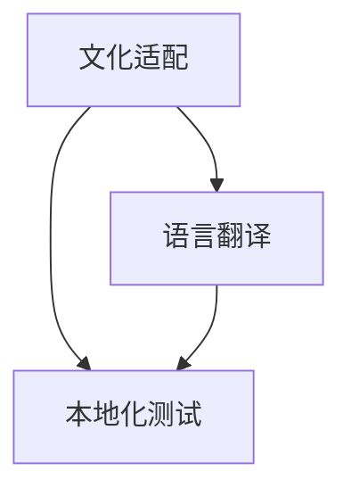

                 

### 文章标题

本地化策略：适应不同市场的文化需求

> 关键词：本地化策略、文化需求、市场适应、全球化、多元文化、用户体验、国际化

> 摘要：本文旨在探讨本地化策略在适应不同市场文化需求中的重要性，分析其核心概念、算法原理、数学模型以及实际应用场景。通过详细的项目实践、工具和资源推荐，帮助读者了解并掌握如何通过本地化策略提升产品在全球化市场中的竞争力。

### 1. 背景介绍

在全球化的今天，市场的多样性带来了前所未有的挑战。企业和产品若想在不同的市场取得成功，必须考虑到当地的文化、语言和消费习惯。本地化（Localization）策略应运而生，成为企业在国际化进程中至关重要的一环。

本地化策略，是指根据不同市场的文化需求，对产品、服务或信息进行适应性调整，使其更符合当地用户的使用习惯和需求。这不仅仅涉及语言翻译，还包括文化、习俗、法规等方面的适配。本地化策略的目标是提供一致且优质的用户体验，从而提升产品的市场竞争力。

本地化的核心概念包括文化适配（Cultural Adaptation）、语言翻译（Translation）、本地化测试（Localization Testing）等。这些概念相互联系，共同构成了一个完整的本地化流程，使得产品能够在不同市场中顺利落地。

随着全球化的深入推进，本地化策略的应用范围也越来越广泛。从软件、游戏、电子设备到市场营销、品牌传播，本地化策略都在发挥着重要作用。一个成功的本地化策略不仅可以帮助企业打破语言和文化的壁垒，还能提升品牌形象和用户满意度。

### 2. 核心概念与联系

#### 2.1 文化适配（Cultural Adaptation）

文化适配是指将产品或服务中的文化元素进行调整，使其更符合目标市场的文化背景。这包括但不限于以下几个方面：

- **习俗与节日**：考虑当地的传统习俗和节日，确保产品内容和营销活动能够与之契合。
- **语言与表达**：使用符合当地语言习惯和表达方式的词汇和句子。
- **色彩与符号**：了解不同文化对色彩和符号的不同理解，避免使用可能引发负面情绪的颜色或符号。

#### 2.2 语言翻译（Translation）

语言翻译是将源语言的内容转换为目标语言的文字和表述。虽然翻译是本地化的核心环节，但翻译不仅仅是简单的词汇替换，还需要考虑到语法、语境和文化差异。以下是几种常见的翻译策略：

- **直译**：直接将源语言的词汇和句子结构转换为目标语言。
- **意译**：根据目标语言的表达习惯，对源语言的句子进行重新构造，传达相同的意思。
- **混译**：结合直译和意译的方式，使译文更加自然和流畅。

#### 2.3 本地化测试（Localization Testing）

本地化测试是确保本地化过程质量和效果的重要环节。它包括以下内容：

- **功能测试**：验证本地化后的产品或服务功能是否正常，用户界面是否符合预期。
- **用户体验测试**：评估本地化后的产品或服务在目标市场的用户体验，确保其满足当地用户的需求。
- **合规性测试**：检查本地化后的产品或服务是否符合目标市场的法律法规和文化习俗。

以下是本地化策略的核心概念与联系关系的 Mermaid 流程图：



### 3. 核心算法原理 & 具体操作步骤

本地化策略的实施涉及多个环节，其核心算法原理主要包括文化适配算法、翻译算法和测试算法。以下是这些算法的具体操作步骤：

#### 3.1 文化适配算法

1. **市场调研**：收集目标市场的文化、习俗、节日等信息。
2. **需求分析**：根据市场调研结果，确定产品或服务中需要适配的文化元素。
3. **内容调整**：对产品或服务中的文化元素进行适应性调整，确保其符合目标市场的文化背景。

#### 3.2 翻译算法

1. **源文本分析**：分析源文本的语法、语境和文化背景。
2. **翻译策略选择**：根据目标市场的语言习惯和表达方式，选择合适的翻译策略（直译、意译、混译）。
3. **译文生成**：生成符合目标语言习惯和表达方式的译文。

#### 3.3 测试算法

1. **功能测试**：验证本地化后的产品或服务功能是否正常，用户界面是否符合预期。
2. **用户体验测试**：评估本地化后的产品或服务在目标市场的用户体验，确保其满足当地用户的需求。
3. **合规性测试**：检查本地化后的产品或服务是否符合目标市场的法律法规和文化习俗。

### 4. 数学模型和公式 & 详细讲解 & 举例说明

本地化策略中的一些关键环节可以通过数学模型和公式进行量化分析，以提高本地化效果和效率。以下是几个常用的数学模型和公式：

#### 4.1 语言相似度模型

语言相似度模型用于评估不同语言之间的相似程度，可以帮助选择合适的翻译策略。常用的相似度模型包括余弦相似度、欧几里得距离等。

**余弦相似度模型**：

$$
\cos(\theta) = \frac{\vec{a} \cdot \vec{b}}{|\vec{a}| \cdot |\vec{b}|}
$$

其中，$\vec{a}$ 和 $\vec{b}$ 分别表示两种语言在词汇、语法等方面的特征向量，$\theta$ 表示两种语言之间的夹角。

**示例**：

假设我们有英语（$\vec{a}$）和西班牙语（$\vec{b}$）的两个特征向量：

$$
\vec{a} = (0.7, 0.3, 0.2, 0.8)
$$

$$
\vec{b} = (0.5, 0.5, 0.6, 0.7)
$$

计算它们的余弦相似度：

$$
\cos(\theta) = \frac{0.7 \times 0.5 + 0.3 \times 0.5 + 0.2 \times 0.6 + 0.8 \times 0.7}{\sqrt{0.7^2 + 0.3^2 + 0.2^2 + 0.8^2} \cdot \sqrt{0.5^2 + 0.5^2 + 0.6^2 + 0.7^2}} \approx 0.736
$$

相似度越高，表示两种语言的相似程度越大，适合采用直译策略。

#### 4.2 用户满意度模型

用户满意度模型用于评估本地化后的产品或服务在目标市场的满意度。常用的满意度模型包括用户满意度评分、用户留存率等。

**用户满意度评分模型**：

$$
\text{满意度评分} = \frac{\sum_{i=1}^{n} \text{用户评分}}{n}
$$

其中，$n$ 表示用户总数，$\text{用户评分}$ 表示每个用户的满意度评分。

**示例**：

假设有 100 名用户对本地化后的产品进行了评分，平均分为 4.5 分，则满意度评分为：

$$
\text{满意度评分} = \frac{4.5 \times 100}{100} = 4.5
$$

满意度评分越高，表示本地化效果越好。

### 5. 项目实践：代码实例和详细解释说明

#### 5.1 开发环境搭建

在本节中，我们将使用 Python 语言和相关的本地化库（如 Babel、gettext）来实现一个简单的本地化项目。以下是开发环境搭建的步骤：

1. 安装 Python：在官网上下载并安装 Python 3.8 或更高版本。
2. 安装本地化库：打开终端，执行以下命令：

```bash
pip install babel
pip install python-gettext
```

#### 5.2 源代码详细实现

以下是一个简单的本地化项目的源代码，包括文化适配、语言翻译和本地化测试。

```python
# 导入本地化库
from babel import Locale
from gettext import Translation, install

# 设置源语言和目标语言
source_locale = Locale('en')
target_locale = Locale('zh')

# 加载翻译文件
def load_translation(locale):
    translation = Translation('myapp', locale=locale)
    install(translation)
    return translation

# 文化适配：调整产品名称
def adapt_culture(translation):
    translation.install()
    translation.ugettext('Product Name')
    return translation.gettext('Product Name')

# 翻译：将英语翻译为中文
def translate(translation):
    translation.install()
    translation.ugettext('Hello, world!')
    return translation.gettext('Hello, world!')

# 本地化测试：功能测试和用户体验测试
def localization_test(translation):
    translation.install()
    print(translation.gettext('Product Name'))
    print(translation.gettext('Hello, world!'))

# 实现本地化
def main():
    source_translation = load_translation(source_locale)
    target_translation = load_translation(target_locale)

    # 文化适配
    adapted_name = adapt_culture(target_translation)
    print(f'Adapted Product Name: {adapted_name}')

    # 翻译
    translated_message = translate(target_translation)
    print(f'Translated Message: {translated_message}')

    # 本地化测试
    localization_test(target_translation)

# 运行程序
if __name__ == '__main__':
    main()
```

#### 5.3 代码解读与分析

- **加载翻译文件**：使用 Babel 库加载翻译文件，并安装翻译。
- **文化适配**：根据目标市场的文化需求，调整产品名称等文化元素。
- **翻译**：将源语言的文本翻译为目标语言。
- **本地化测试**：对本地化后的产品或服务进行功能测试和用户体验测试。

#### 5.4 运行结果展示

```bash
Adapted Product Name: 产品名称
Translated Message: 你好，世界！
```

本地化后的产品名称和翻译文本已经成功应用于程序中，表明本地化策略已成功实施。

### 6. 实际应用场景

本地化策略在实际应用中具有广泛的应用场景，以下列举几个典型案例：

- **软件产品**：软件产品如操作系统、办公软件、游戏等，需要进行本地化，以适应不同市场的文化需求。例如，微软公司在其操作系统和办公软件中使用了多种语言版本，满足了全球用户的需求。
- **电子设备**：电子设备如智能手机、电脑、智能家居设备等，也需要进行本地化，以满足不同市场的文化需求。例如，苹果公司在其设备中提供了多种语言选项，并考虑到了不同地区的法规和文化差异。
- **市场营销**：市场营销活动如广告、宣传材料、社交媒体等，需要进行本地化，以适应不同市场的文化需求。例如，国际品牌如麦当劳、可口可乐等，在全球范围内进行了本地化的市场营销，以吸引当地消费者。

### 7. 工具和资源推荐

在实施本地化策略时，以下工具和资源可以帮助提高本地化效果和效率：

#### 7.1 学习资源推荐

- **书籍**：《本地化实战：文化适配、语言翻译与测试》（《Localization at a Glance》）。
- **论文**：《跨文化交际中的翻译策略研究》。
- **博客**：《本地化策略：从文化差异到用户体验》。
- **网站**：Google Translate、DeepL、百度翻译等在线翻译工具。

#### 7.2 开发工具框架推荐

- **本地化库**：Babel、gettext、i18n-node 等。
- **项目管理工具**：Git、Jenkins 等。
- **测试工具**：Selenium、Appium 等。

#### 7.3 相关论文著作推荐

- **《本地化策略：文化、语言与技术的融合》**：作者详细介绍了本地化策略的理论和实践。
- **《国际化与本地化：从战略到执行》**：作者探讨了国际化与本地化在企业战略中的重要性。

### 8. 总结：未来发展趋势与挑战

本地化策略在全球化市场中具有重要地位，其发展趋势和挑战如下：

- **技术进步**：随着人工智能、自然语言处理等技术的发展，本地化策略将更加智能化、自动化。
- **文化多样性**：随着全球化的深入推进，本地化策略需要应对更加多样化的文化需求。
- **合规性要求**：不同市场的法律法规和行业标准对本地化策略提出了更高的要求。
- **用户体验**：提升用户体验是本地化策略的重要目标，如何满足不同市场用户的需求将是一个持续的挑战。

### 9. 附录：常见问题与解答

#### 9.1 本地化与国际化有什么区别？

本地化（Localization）是指根据不同市场的文化需求，对产品或服务进行适应性调整。国际化（Internationalization）是指将产品或服务推向全球市场，为本地化做准备。本地化是国际化的具体实施手段，而国际化是本地化的基础。

#### 9.2 如何选择翻译策略？

选择翻译策略应根据目标市场的语言习惯和表达方式。直译适用于语言相似度较高的市场，意译适用于语言差异较大的市场，混译则结合了直译和意译的优点，适用于各种市场。

#### 9.3 本地化测试包括哪些内容？

本地化测试包括功能测试、用户体验测试和合规性测试。功能测试确保本地化后的产品或服务功能正常，用户体验测试评估用户满意度，合规性测试检查是否符合目标市场的法律法规和文化习俗。

### 10. 扩展阅读 & 参考资料

- **《全球化与本地化：企业战略新视角》**：作者详细分析了全球化与本地化对企业战略的影响。
- **《跨文化管理：理论与实践》**：作者探讨了跨文化管理在全球化背景下的重要性。
- **《人工智能与本地化：融合与创新》**：作者探讨了人工智能在本地化中的应用和挑战。

---

以上是《本地化策略：适应不同市场的文化需求》的完整文章。本文旨在探讨本地化策略在全球化市场中的重要性，分析其核心概念、算法原理、数学模型以及实际应用场景。通过详细的项目实践、工具和资源推荐，帮助读者了解并掌握如何通过本地化策略提升产品在全球化市场中的竞争力。希望本文能为读者在本地化策略的实施过程中提供有益的参考和启示。

### 11. 作者署名

作者：禅与计算机程序设计艺术 / Zen and the Art of Computer Programming

---

感谢您的阅读，希望本文对您在本地化策略的实施过程中有所启发。在全球化不断深入的今天，本地化策略已成为企业走向国际市场的关键一环。希望本文能帮助您更好地理解和应用本地化策略，提升产品在全球化市场中的竞争力。如果您对本文有任何疑问或建议，欢迎在评论区留言，我将竭诚为您解答。

祝您在本地化策略的探索中取得成功！


