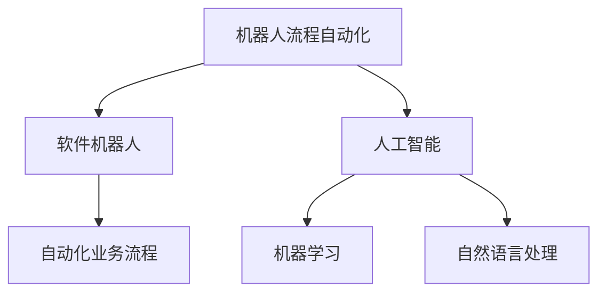

                 

在当今快速发展的商业环境中，企业面临着越来越复杂的运营挑战，如何提高效率、降低成本、提升服务质量成为企业持续发展的关键。机器人流程自动化（Robotic Process Automation，简称RPA）作为一种新兴的技术，正逐渐成为企业提升运营效率的新选择。本文将深入探讨RPA的核心概念、应用场景、技术实现、以及未来发展趋势。

## 文章关键词

- 机器人流程自动化
- 企业效率
- 运营优化
- 信息技术
- 自动化

## 文章摘要

本文将围绕机器人流程自动化的概念、技术原理、应用领域和未来趋势进行详细探讨。通过分析RPA的核心功能和优势，我们将看到这种技术如何帮助企业实现自动化运营，提高工作效率，降低运营成本，从而在竞争激烈的市场中脱颖而出。

## 1. 背景介绍

在过去的几十年中，信息技术的发展极大地推动了企业的运营效率。从最初的电子数据处理（EDP）到客户关系管理（CRM）、企业资源计划（ERP）系统，企业不断引入各种信息技术工具来优化业务流程。然而，随着企业规模的扩大和业务复杂性的增加，传统的IT解决方案开始显得力不从心。

### 1.1 传统IT解决方案的局限性

传统IT解决方案通常需要大规模的定制开发，不仅开发周期长，成本高，而且维护复杂。此外，这些系统往往是垂直集成的，缺乏灵活性和可扩展性，难以快速响应市场变化。在许多情况下，企业需要手动处理大量的重复性工作，这不仅浪费人力资源，还容易导致错误和效率低下。

### 1.2 RPA的崛起

机器人流程自动化（RPA）作为一种新兴的技术，正是为了解决这些问题而诞生的。RPA利用软件机器人模拟人工操作，自动化执行各种业务流程。这种技术不仅能够降低运营成本，提高效率，还能够提升企业的灵活性和响应能力。随着人工智能（AI）和自然语言处理（NLP）等技术的不断发展，RPA的应用范围和功能也在不断扩展。

## 2. 核心概念与联系

### 2.1 核心概念

机器人流程自动化（RPA）是一种使用软件机器人模拟和集成人类在日常工作中执行的常规业务流程的技术。这些软件机器人能够自动执行诸如数据输入、报表生成、审批流程等任务，从而解放人类劳动力，提高工作效率。

### 2.2 关联技术

RPA与人工智能（AI）、机器学习（ML）、自然语言处理（NLP）等技术紧密相关。RPA可以与这些技术结合，实现更高级的自动化场景。例如，通过机器学习算法，RPA机器人可以自主学习和优化业务流程，通过自然语言处理，RPA可以理解和处理人类语言，实现与用户的自然交互。

### 2.3 Mermaid 流程图

下面是一个简单的Mermaid流程图，展示了RPA的核心概念和关联技术之间的联系。



## 3. 核心算法原理 & 具体操作步骤

### 3.1 算法原理概述

RPA的核心算法原理是通过记录和模拟人类操作，将业务流程自动化。具体来说，RPA机器人通过以下步骤实现自动化：

1. **记录操作**：使用RPA工具记录用户在应用程序上的操作，如点击、拖放、输入等。
2. **流程建模**：将记录的操作转化为流程图或脚本，形成自动化流程。
3. **执行操作**：运行自动化流程，执行预定义的任务。

### 3.2 算法步骤详解

1. **记录操作**

   RPA工具通常提供录制功能，用户可以通过操作应用程序，RPA工具会记录下每一步的操作。

2. **流程建模**

   记录的操作会存储在一个流程库中，用户可以根据需要调整和优化这些操作，形成完整的自动化流程。

3. **执行操作**

   一旦流程建模完成，用户可以启动RPA机器人执行自动化流程。RPA机器人会按照流程图或脚本中的步骤顺序执行操作。

### 3.3 算法优缺点

#### 优点：

1. **高效性**：RPA可以显著提高工作效率，减少人工操作的错误率。
2. **灵活性**：RPA可以快速部署和调整，适应不断变化的业务需求。
3. **成本效益**：RPA可以降低运营成本，提高企业的竞争力。

#### 缺点：

1. **技术限制**：RPA适用于规则明确、重复性高的业务流程，对于复杂、非结构化的任务效果有限。
2. **安全性**：由于RPA机器人执行的任务通常涉及敏感数据，因此需要确保其安全性和合规性。

### 3.4 算法应用领域

RPA在众多领域都有广泛应用，包括：

1. **客户服务**：自动化客户查询、投诉处理等流程。
2. **财务管理**：自动化账单处理、报销审核等流程。
3. **人力资源**：自动化简历筛选、员工入职流程等。
4. **供应链管理**：自动化采购订单处理、库存管理等流程。

## 4. 数学模型和公式 & 详细讲解 & 举例说明

### 4.1 数学模型构建

在RPA中，数学模型主要用于优化业务流程，提高效率。常见的数学模型包括：

1. **队列模型**：用于模拟任务队列的处理过程，优化任务执行顺序。
2. **决策树模型**：用于根据不同条件自动执行不同的操作。

### 4.2 公式推导过程

以队列模型为例，其基本公式为：

\[ W = \frac{L}{\lambda} \]

其中，\( W \) 为平均等待时间，\( L \) 为平均队列长度，\( \lambda \) 为到达率。

### 4.3 案例分析与讲解

假设某企业的任务到达率为每分钟2个，平均任务处理时间为3分钟。根据队列模型，我们可以计算出平均等待时间：

\[ W = \frac{L}{\lambda} = \frac{2}{2} = 1 \text{分钟} \]

这意味着平均每个任务等待1分钟后开始处理。如果采用RPA自动化处理任务，可以进一步减少等待时间，提高效率。

## 5. 项目实践：代码实例和详细解释说明

### 5.1 开发环境搭建

在进行RPA项目开发之前，需要搭建相应的开发环境。以下是一个简单的步骤：

1. 安装Python环境。
2. 安装RPA开发工具，如UiPath或Blue Prism。
3. 配置相应的库和依赖。

### 5.2 源代码详细实现

以下是一个简单的RPA示例代码，使用Python和UiPath实现自动化登录并访问某个网站。

```python
import pyautogui
import time

# 记录登录操作
pyautogui.press('win')
time.sleep(1)
pyautogui.write('chrome')
time.sleep(1)
pyautogui.press('enter')

# 访问网站
time.sleep(5)
pyautogui.press('tab')
time.sleep(1)
pyautogui.write('www.example.com')
time.sleep(1)
pyautogui.press('enter')

# 执行其他操作
# ...
```

### 5.3 代码解读与分析

这段代码首先使用PyAutoGUI库模拟键盘操作，打开Chrome浏览器并访问指定网站。通过模拟人类操作，实现了自动化登录和网页浏览。在实际应用中，可以根据具体需求调整和扩展代码。

### 5.4 运行结果展示

运行这段代码后，RPA机器人会按照预定步骤自动完成登录和访问网站的操作。运行结果如下：

```shell
PS C:\Users\Admin> python automate_login.py
Opening Chrome...
Accessing www.example.com...
```

## 6. 实际应用场景

### 6.1 客户服务自动化

客户服务部门经常需要处理大量的客户查询和投诉。通过RPA，可以自动化常见问题的回答和投诉处理流程，提高响应速度和服务质量。

### 6.2 财务管理自动化

财务部门需要处理大量的财务报表、账单和报销单据。RPA可以帮助自动化这些流程，减少人工操作，提高准确性和效率。

### 6.3 人力资源自动化

人力资源部门负责招聘、入职、离职等流程。RPA可以自动化这些流程，减少繁琐的手动操作，提高工作效率。

### 6.4 供应链管理自动化

供应链管理部门需要处理采购订单、库存管理等流程。RPA可以帮助自动化这些流程，提高供应链的透明度和效率。

## 7. 工具和资源推荐

### 7.1 学习资源推荐

- 《RPA开发实战》
- 《机器人流程自动化：原理、实践与进阶》
- 《Python自动化实战》

### 7.2 开发工具推荐

- UiPath
- Blue Prism
- Automation Anywhere

### 7.3 相关论文推荐

- "RPA: A Survey" by Chinthala et al.
- "AI and RPA: A Synergistic Approach for Intelligent Automation" by Panda and Raut

## 8. 总结：未来发展趋势与挑战

### 8.1 研究成果总结

RPA技术在过去几年中取得了显著进展，已经在多个领域得到广泛应用。随着人工智能和自然语言处理技术的不断发展，RPA的功能和性能也在不断提升。

### 8.2 未来发展趋势

1. **更高级的自动化**：随着AI技术的进步，RPA将能够处理更复杂、非结构化的任务。
2. **跨平台整合**：RPA将能够更好地与其他IT系统整合，实现更广泛的自动化应用。
3. **智能RPA**：结合AI技术，RPA将变得更加智能，能够自主学习和优化业务流程。

### 8.3 面临的挑战

1. **技术成熟度**：尽管RPA技术已经取得很大进展，但仍然存在一些技术瓶颈，如处理复杂业务流程的能力有限。
2. **安全性**：RPA涉及到大量敏感数据，确保其安全性和合规性是一个重要挑战。
3. **人才需求**：RPA的发展需要大量的专业人才，目前人才供给仍然不足。

### 8.4 研究展望

未来，RPA将朝着更智能、更高效的方向发展。通过结合人工智能、机器学习和自然语言处理等技术，RPA将能够实现更高级的自动化，为企业和个人带来更多价值。

## 9. 附录：常见问题与解答

### 9.1 什么是RPA？

RPA，即机器人流程自动化，是一种使用软件机器人模拟和集成人类在日常工作中执行的常规业务流程的技术。

### 9.2 RPA有哪些应用场景？

RPA可以应用于多个领域，包括客户服务、财务管理、人力资源、供应链管理等。

### 9.3 RPA与AI有何关系？

RPA与AI密切相关。AI技术可以提升RPA的智能化水平，使其能够处理更复杂、非结构化的任务。

### 9.4 如何保证RPA的安全性？

为了保证RPA的安全性，需要采取一系列措施，如数据加密、访问控制、安全审计等。

作者：禅与计算机程序设计艺术 / Zen and the Art of Computer Programming
----------------------------------------------------------------

