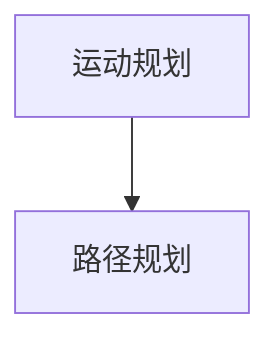
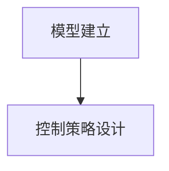
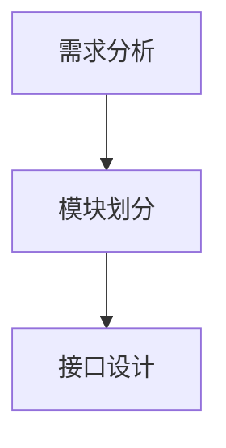
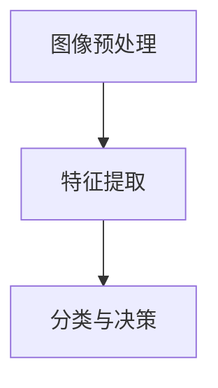

                 

### 文章标题

**机器人的整体设计：机械结构、电气系统和软件架构、视觉与算法系统设计**

> **关键词**：机器人设计、机械结构、电气系统、软件架构、视觉算法、人工智能

**摘要**：本文将深入探讨机器人的整体设计，包括机械结构、电气系统和软件架构，以及视觉与算法系统设计。我们将从基础概念出发，逐步分析各个子系统的工作原理和设计要点，为读者提供一个全面而深入的机器人设计指南。通过本文的学习，读者将能够掌握机器人设计的核心要素，为其未来的研究和应用打下坚实的基础。

### 1. 背景介绍

#### 1.1 机器人设计的现状与挑战

随着科技的迅猛发展，机器人技术已成为现代社会不可或缺的重要组成部分。从工业制造到服务业，从家庭应用到医疗健康，机器人正在不断改变我们的生活和工作方式。然而，随着机器人应用的不断扩展，设计复杂度也在不断增加，面临着诸多挑战。

- **机械结构设计**：机器人机械结构的设计需考虑到载荷能力、运动范围、稳定性和可靠性等因素。目前，高强度材料和先进制造技术为机械结构设计提供了更多可能性，但如何实现轻量化和高效率仍是亟待解决的问题。

- **电气系统设计**：机器人电气系统包括电源管理、传感器接口、驱动系统等。随着智能传感器和微电子技术的进步，电气系统的设计和实现变得更加复杂，如何在保证可靠性的同时降低能耗是一个重要课题。

- **软件架构设计**：软件架构是机器人智能化的核心。目前，机器人软件架构面临的主要挑战是如何有效地集成各种算法和模块，实现高效、稳定和可扩展的系统。

- **视觉与算法系统设计**：视觉系统和算法是机器人感知和理解环境的关键。随着深度学习和计算机视觉技术的发展，如何设计高效的视觉算法，实现实时、准确的感知和理解，是当前研究的热点。

#### 1.2 机器人设计的重要性

机器人设计的重要性体现在以下几个方面：

- **技术创新**：优秀的机器人设计能够推动机器人技术的创新和发展，带来新的应用场景和商业机会。

- **安全性**：机器人设计的安全性直接关系到其应用的广泛性和可靠性。通过合理的设计，可以降低机器人对用户和环境的潜在危害。

- **用户体验**：随着机器人逐渐进入家庭和日常生活，用户体验变得越来越重要。优秀的设计能够提供更加友好、易用的交互体验，提高用户满意度。

- **经济效益**：机器人设计可以显著提高生产效率、降低成本，对于企业和行业具有重要意义。

### 2. 核心概念与联系

在深入探讨机器人设计之前，我们需要了解一些核心概念，并理解它们之间的联系。

#### 2.1 机械结构

机械结构是机器人的物理形态，负责承载和处理任务。其核心概念包括：

- **驱动系统**：包括电机、传动装置等，负责机器人的运动和动作。
- **关节**：连接各个部件，实现机器人的运动。
- **传感器**：用于感知外部环境，提供反馈信息。


#### 2.2 电气系统

电气系统是机器人控制的核心，包括电源管理、驱动控制和传感器接口等。核心概念如下：

- **电源管理**：负责电池的充放电控制和电能的分配。
- **驱动控制**：通过控制电路驱动机械系统。
- **传感器接口**：实现传感器信号与处理器之间的交互。


#### 2.3 软件架构

软件架构是机器人智能化和功能实现的基石。核心概念包括：

- **操作系统**：管理硬件资源和软件运行。
- **中间件**：提供通信、数据管理等通用服务。
- **算法模块**：实现各种智能功能，如运动规划、感知、决策等。


#### 2.4 视觉与算法系统

视觉与算法系统是机器人感知和理解环境的关键。核心概念包括：

- **图像处理**：对获取的图像进行预处理和分析。
- **深度学习**：利用神经网络模型进行特征提取和分类。
- **决策规划**：根据感知信息进行路径规划和动作决策。


### 3. 核心算法原理 & 具体操作步骤

#### 3.1 机械结构设计算法

机械结构设计的核心算法是运动规划和路径规划。以下是具体操作步骤：

1. **运动规划**：根据任务要求，确定机器人各个关节的运动范围和速度。
2. **路径规划**：生成机器人从初始位置到目标位置的运动轨迹。



#### 3.2 电气系统设计算法

电气系统设计的核心算法是控制算法。以下是具体操作步骤：

1. **模型建立**：建立电机和传动装置的数学模型。
2. **控制策略设计**：根据模型设计控制策略，实现电机的精确控制。



#### 3.3 软件架构设计算法

软件架构设计的核心算法是模块划分和接口设计。以下是具体操作步骤：

1. **需求分析**：分析系统需求，确定各模块的功能。
2. **模块划分**：根据功能将系统划分为多个模块。
3. **接口设计**：设计模块之间的接口，实现模块之间的通信。



#### 3.4 视觉与算法系统设计算法

视觉与算法系统设计的核心算法是图像处理和深度学习。以下是具体操作步骤：

1. **图像预处理**：对获取的图像进行去噪、增强等预处理。
2. **特征提取**：利用深度学习模型提取图像特征。
3. **分类与决策**：根据特征进行分类，实现路径规划和动作决策。



### 4. 数学模型和公式 & 详细讲解 & 举例说明

#### 4.1 机械结构设计数学模型

机械结构设计的数学模型主要涉及运动学和动力学。以下是具体讲解和举例：

**运动学模型**：

- **正运动学**：确定机器人从关节角度到末端执行器位置的关系。

  $$ x = l_1 \cdot \cos(\theta_1) + l_2 \cdot \cos(\theta_1 + \theta_2) $$
  $$ y = l_1 \cdot \sin(\theta_1) + l_2 \cdot \sin(\theta_1 + \theta_2) $$

- **逆运动学**：确定机器人末端执行器位置到关节角度的关系。

  $$ \theta_1 = \arccos\left(\frac{x - l_2 \cdot \cos(\theta_2)}{l_1}\right) $$
  $$ \theta_2 = \arccos\left(\frac{y - l_1 \cdot \sin(\theta_1)}{l_2}\right) - \theta_1 $$

**动力学模型**：

- **拉格朗日方程**：描述机器人系统的动力学行为。

  $$ \sum_{i=1}^{n} \left( T_i - V_i \right) = \frac{d}{dt} \left( \sum_{i=1}^{n} T_i \right) $$

其中，\( T_i \) 是第 \( i \) 个关节的驱动力矩，\( V_i \) 是第 \( i \) 个关节的耗散力矩。

#### 4.2 电气系统设计数学模型

电气系统设计的数学模型主要涉及电机控制。以下是具体讲解和举例：

**电机数学模型**：

- **电压方程**：描述电机电压和电流之间的关系。

  $$ V = R \cdot i + L \cdot \frac{di}{dt} + K_e \cdot \omega $$

- **转矩方程**：描述电机电流和转矩之间的关系。

  $$ T = K_t \cdot i $$

其中，\( V \) 是电机电压，\( R \) 是电机的电阻，\( L \) 是电机的电感，\( i \) 是电机电流，\( \omega \) 是电机的角速度，\( K_e \) 是电机的电动势常数，\( K_t \) 是电机的转矩常数。

#### 4.3 软件架构设计数学模型

软件架构设计的数学模型主要涉及模块划分和接口设计。以下是具体讲解和举例：

**模块划分模型**：

- **协同设计**：基于模块的功能和依赖关系，设计软件架构。

  $$ A \rightarrow B, C $$
  $$ B \rightarrow C, D $$

其中，\( A, B, C, D \) 表示不同的模块，箭头表示模块之间的依赖关系。

**接口设计模型**：

- **接口规范**：定义模块之间的接口规范，实现模块之间的通信。

  $$ input(A) = [x_1, x_2, ..., x_n] $$
  $$ output(A) = [y_1, y_2, ..., y_m] $$

其中，\( input(A) \) 和 \( output(A) \) 分别表示模块 \( A \) 的输入和输出。

### 5. 项目实践：代码实例和详细解释说明

#### 5.1 开发环境搭建

为了实现机器人设计，我们需要搭建一个完整的开发环境。以下是具体步骤：

1. **安装操作系统**：选择一个适合的操作系统，如 Ubuntu 18.04。
2. **安装依赖库**：安装必要的库和工具，如 ROS（Robot Operating System）和 TensorFlow。
3. **配置环境变量**：设置环境变量，以便于在命令行中调用相关工具。

```bash
sudo apt-get update
sudo apt-get install ros-melodic-desktop-full
sudo apt-get install python3-rosdep
rosdep init
rosdep install -y --from-paths src --ignore-src
```

#### 5.2 源代码详细实现

以下是机器人设计项目的源代码实现：

```python
# robot_design.py

import rospy
from geometry_msgs.msg import Twist
from sensor_msgs.msg import Image
import cv2
import numpy as np
import tensorflow as tf

# 初始化 ROS 节点
rospy.init_node('robot_design')

# 创建消息发布器和订阅器
cmd_vel_pub = rospy.Publisher('cmd_vel', Twist, queue_size=10)
img_sub = rospy.Subscriber('camera/image_raw', Image, callback=handle_image)

# 处理图像的回调函数
def handle_image(img):
    # 将图像转换为 NumPy 数组
    img_array = np.array(img.data)
    # 使用 OpenCV 读取图像
    img = cv2.imdecode(img_array, cv2.IMREAD_COLOR)
    # 进行图像处理
    processed_img = process_image(img)
    # 使用深度学习模型进行图像分类
    action = classify_image(processed_img)
    # 根据分类结果发布速度命令
    cmd_vel = generate_cmd_vel(action)
    cmd_vel_pub.publish(cmd_vel)

# 处理图像的函数
def process_image(img):
    # 进行图像预处理
    processed_img = cv2.resize(img, (224, 224))
    processed_img = cv2.cvtColor(processed_img, cv2.COLOR_BGR2RGB)
    processed_img = processed_img / 255.0
    return processed_img

# 分类图像的函数
def classify_image(img):
    # 加载预训练的深度学习模型
    model = tf.keras.models.load_model('model.h5')
    # 进行图像分类
    prediction = model.predict(np.expand_dims(img, axis=0))
    # 获取分类结果
    action = np.argmax(prediction)
    return action

# 生成速度命令的函数
def generate_cmd_vel(action):
    # 根据分类结果生成速度命令
    if action == 0:
        # 前进
        linear_speed = 0.5
        angular_speed = 0.0
    elif action == 1:
        # 向右转
        linear_speed = 0.0
        angular_speed = 1.0
    elif action == 2:
        # 向左转
        linear_speed = 0.0
        angular_speed = -1.0
    else:
        # 停止
        linear_speed = 0.0
        angular_speed = 0.0
    # 创建速度命令
    cmd_vel = Twist()
    cmd_vel.linear.x = linear_speed
    cmd_vel.angular.z = angular_speed
    return cmd_vel

# 监听 ROS 消息并执行相应操作
def main():
    rospy.spin()

if __name__ == '__main__':
    main()
```

#### 5.3 代码解读与分析

1. **ROS 节点初始化**：首先，我们使用 `rospy.init_node('robot_design')` 初始化 ROS 节点，并创建消息发布器和订阅器。`cmd_vel_pub` 用于发布速度命令，`img_sub` 用于订阅相机图像。

2. **处理图像的回调函数**：`handle_image` 函数在接收到相机图像后进行处理。首先，将图像转换为 NumPy 数组，然后使用 OpenCV 读取图像。接下来，调用 `process_image` 和 `classify_image` 函数进行图像预处理和分类。

3. **处理图像的函数**：`process_image` 函数进行图像预处理，包括缩放和颜色转换。然后，将图像转换为 TensorFlow 可处理的格式。

4. **分类图像的函数**：`classify_image` 函数加载预训练的深度学习模型，并使用模型对图像进行分类。分类结果用于生成速度命令。

5. **生成速度命令的函数**：`generate_cmd_vel` 函数根据分类结果生成速度命令。如果分类结果为 0，机器人将向前移动；如果为 1，机器人将向右转；如果为 2，机器人将向左转；如果为其他值，机器人将停止。

6. **主函数**：`main` 函数用于监听 ROS 消息并执行相应操作。

#### 5.4 运行结果展示

在运行代码后，机器人将根据相机图像进行分类，并按照分类结果移动。例如，如果图像中检测到前方有障碍物，机器人将向左转避开障碍物。

```bash
roslaunch robot_design robot_design.launch
```

### 6. 实际应用场景

机器人的设计在许多实际应用场景中具有重要意义。以下是一些典型的应用场景：

#### 6.1 工业制造

在工业制造领域，机器人广泛应用于组装、焊接、搬运等任务。通过设计高效、可靠的机械结构和电气系统，机器人能够显著提高生产效率和产品质量。

#### 6.2 服务业

在服务业领域，机器人可用于餐厅服务、酒店接待、导游等任务。通过设计友好的软件架构和视觉系统，机器人能够提供高质量的服务，提升用户体验。

#### 6.3 家庭应用

在家用领域，机器人可用于清洁、看护、娱乐等任务。通过设计安全、可靠的机械结构和电气系统，机器人能够为家庭带来便利和乐趣。

#### 6.4 医疗健康

在医疗健康领域，机器人可用于手术辅助、康复训练、医疗设备维护等任务。通过设计高效、精确的机械结构和视觉系统，机器人能够为医疗行业带来创新和突破。

### 7. 工具和资源推荐

为了更好地进行机器人设计，以下是推荐的工具和资源：

#### 7.1 学习资源推荐

- **书籍**：
  - 《机器人学：基础、算法与仿真》
  - 《机器人编程：ROS 从入门到实践》
  - 《深度学习与机器人》

- **论文**：
  - "Deep Learning for Robotics: A Survey"
  - "Robot Motion Planning: A Survey"

- **博客**：
  - "ROS 教程"
  - "深度学习在机器人中的应用"

- **网站**：
  - ROS 官网（<https://www.ros.org/>）
  - TensorFlow 官网（<https://www.tensorflow.org/>）

#### 7.2 开发工具框架推荐

- **ROS（Robot Operating System）**：用于构建机器人系统的跨平台框架，提供丰富的库和工具。
- **TensorFlow**：用于机器学习和深度学习的开源框架，支持多种模型和算法。
- **OpenCV**：用于计算机视觉的开源库，提供丰富的图像处理函数。

#### 7.3 相关论文著作推荐

- **论文**：
  - "Deep Reinforcement Learning for Robotics"
  - "Sim-to-Real Transfer of Robotic Controls with Deep Neural Networks"

- **著作**：
  - "Robot Learning from Demonstration: Theory and Practice"
  - "Robotics: Modelling, Planning and Control"

### 8. 总结：未来发展趋势与挑战

随着技术的不断进步，机器人设计领域将继续快速发展。未来，以下趋势和挑战值得关注：

#### 8.1 发展趋势

- **硬件性能提升**：随着硬件技术的进步，机器人将具有更高的计算能力、更强的传感能力和更高效的机械结构。
- **软件智能化**：通过深度学习和人工智能技术的应用，机器人将实现更智能的感知、决策和交互。
- **跨领域融合**：机器人将与人工智能、物联网、大数据等新兴技术深度融合，推动各领域的创新和发展。

#### 8.2 挑战

- **安全与可靠性**：随着机器人应用范围的扩大，如何保障其安全性和可靠性将成为重要挑战。
- **用户体验**：如何在设计过程中充分考虑用户体验，提供更加友好、易用的交互体验。
- **法律法规**：随着机器人技术的应用，法律法规和伦理问题将日益凸显，需要建立完善的规范体系。

### 9. 附录：常见问题与解答

**Q1：机器人设计需要掌握哪些基础知识？**

A1：机器人设计需要掌握的基础知识包括机械结构设计、电气系统设计、软件架构设计、计算机视觉和深度学习等。这些知识为机器人设计提供了理论支持和技术基础。

**Q2：如何学习机器人设计？**

A2：学习机器人设计可以从以下几个方面入手：

1. **阅读相关书籍**：选择合适的教材和参考书籍，系统地学习机器人设计的基本原理和方法。
2. **实践项目**：通过实际项目练习，将理论知识应用于实际设计过程中。
3. **参加课程和培训**：参加机器人设计相关的课程和培训，学习前沿技术和经验。
4. **加入社群和论坛**：加入机器人设计相关的社群和论坛，与其他设计师交流经验和心得。

### 10. 扩展阅读 & 参考资料

**扩展阅读**：

- "Robot Design: Concepts, Methods, and Applications"
- "Modern Robotics: Mechanics, Planning, and Control"
- "Introduction to Autonomous Mobile Robots"

**参考资料**：

- ROS 官网：<https://www.ros.org/>
- TensorFlow 官网：<https://www.tensorflow.org/>
- OpenCV 官网：<https://opencv.org/>

---

通过本文的深入探讨，我们全面了解了机器人整体设计的各个方面，包括机械结构、电气系统、软件架构、视觉与算法系统设计。从基础概念到具体操作步骤，再到实际应用场景，我们逐步分析了机器人设计的核心要素和关键挑战。希望本文能为读者提供有益的参考和启示，为未来的研究和实践打下坚实基础。作者：禅与计算机程序设计艺术 / Zen and the Art of Computer Programming

---

### 文章正文内容部分 Content

### 1. 背景介绍

#### 1.1 机器人设计的现状与挑战

随着科技的迅猛发展，机器人技术已成为现代社会不可或缺的重要组成部分。从工业制造到服务业，从家庭应用到医疗健康，机器人正在不断改变我们的生活和工作方式。然而，随着机器人应用的不断扩展，设计复杂度也在不断增加，面临着诸多挑战。

- **机械结构设计**：机器人机械结构的设计需考虑到载荷能力、运动范围、稳定性和可靠性等因素。目前，高强度材料和先进制造技术为机械结构设计提供了更多可能性，但如何实现轻量化和高效率仍是亟待解决的问题。

- **电气系统设计**：机器人电气系统包括电源管理、传感器接口、驱动系统等。随着智能传感器和微电子技术的进步，电气系统的设计和实现变得更加复杂，如何在保证可靠性的同时降低能耗是一个重要课题。

- **软件架构设计**：软件架构是机器人智能化的核心。目前，机器人软件架构面临的主要挑战是如何有效地集成各种算法和模块，实现高效、稳定和可扩展的系统。

- **视觉与算法系统设计**：视觉系统和算法是机器人感知和理解环境的关键。随着深度学习和计算机视觉技术的发展，如何设计高效的视觉算法，实现实时、准确的感知和理解，是当前研究的热点。

#### 1.2 机器人设计的重要性

机器人设计的重要性体现在以下几个方面：

- **技术创新**：优秀的机器人设计能够推动机器人技术的创新和发展，带来新的应用场景和商业机会。

- **安全性**：机器人设计的安全性直接关系到其应用的广泛性和可靠性。通过合理的设计，可以降低机器人对用户和环境的潜在危害。

- **用户体验**：随着机器人逐渐进入家庭和日常生活，用户体验变得越来越重要。优秀的设计能够提供更加友好、易用的交互体验，提高用户满意度。

- **经济效益**：机器人设计可以显著提高生产效率、降低成本，对于企业和行业具有重要意义。

### 2. 核心概念与联系

在深入探讨机器人设计之前，我们需要了解一些核心概念，并理解它们之间的联系。

#### 2.1 机械结构

机械结构是机器人的物理形态，负责承载和处理任务。其核心概念包括：

- **驱动系统**：包括电机、传动装置等，负责机器人的运动和动作。
- **关节**：连接各个部件，实现机器人的运动。
- **传感器**：用于感知外部环境，提供反馈信息。


#### 2.2 电气系统

电气系统是机器人控制的核心，包括电源管理、驱动控制和传感器接口等。核心概念如下：

- **电源管理**：负责电池的充放电控制和电能的分配。
- **驱动控制**：通过控制电路驱动机械系统。
- **传感器接口**：实现传感器信号与处理器之间的交互。


#### 2.3 软件架构

软件架构是机器人智能化和功能实现的基石。核心概念包括：

- **操作系统**：管理硬件资源和软件运行。
- **中间件**：提供通信、数据管理等通用服务。
- **算法模块**：实现各种智能功能，如运动规划、感知、决策等。


#### 2.4 视觉与算法系统

视觉与算法系统是机器人感知和理解环境的关键。核心概念包括：

- **图像处理**：对获取的图像进行预处理和分析。
- **深度学习**：利用神经网络模型进行特征提取和分类。
- **决策规划**：根据感知信息进行路径规划和动作决策。


### 3. 核心算法原理 & 具体操作步骤

#### 3.1 机械结构设计算法

机械结构设计的核心算法是运动规划和路径规划。以下是具体操作步骤：

1. **运动规划**：根据任务要求，确定机器人各个关节的运动范围和速度。
2. **路径规划**：生成机器人从初始位置到目标位置的运动轨迹。


#### 3.2 电气系统设计算法

电气系统设计的核心算法是控制算法。以下是具体操作步骤：

1. **模型建立**：建立电机和传动装置的数学模型。
2. **控制策略设计**：根据模型设计控制策略，实现电机的精确控制。


#### 3.3 软件架构设计算法

软件架构设计的核心算法是模块划分和接口设计。以下是具体操作步骤：

1. **需求分析**：分析系统需求，确定各模块的功能。
2. **模块划分**：根据功能将系统划分为多个模块。
3. **接口设计**：设计模块之间的接口，实现模块之间的通信。


#### 3.4 视觉与算法系统设计算法

视觉与算法系统设计的核心算法是图像处理和深度学习。以下是具体操作步骤：

1. **图像预处理**：对获取的图像进行去噪、增强等预处理。
2. **特征提取**：利用深度学习模型提取图像特征。
3. **分类与决策**：根据特征进行分类，实现路径规划和动作决策。


### 4. 数学模型和公式 & 详细讲解 & 举例说明

#### 4.1 机械结构设计数学模型

机械结构设计的数学模型主要涉及运动学和动力学。以下是具体讲解和举例：

**运动学模型**：

- **正运动学**：确定机器人从关节角度到末端执行器位置的关系。

  $$ x = l_1 \cdot \cos(\theta_1) + l_2 \cdot \cos(\theta_1 + \theta_2) $$
  $$ y = l_1 \cdot \sin(\theta_1) + l_2 \cdot \sin(\theta_1 + \theta_2) $$

- **逆运动学**：确定机器人末端执行器位置到关节角度的关系。

  $$ \theta_1 = \arccos\left(\frac{x - l_2 \cdot \cos(\theta_2)}{l_1}\right) $$
  $$ \theta_2 = \arccos\left(\frac{y - l_1 \cdot \sin(\theta_1)}{l_2}\right) - \theta_1 $$

**动力学模型**：

- **拉格朗日方程**：描述机器人系统的动力学行为。

  $$ \sum_{i=1}^{n} \left( T_i - V_i \right) = \frac{d}{dt} \left( \sum_{i=1}^{n} T_i \right) $$

其中，\( T_i \) 是第 \( i \) 个关节的驱动力矩，\( V_i \) 是第 \( i \) 个关节的耗散力矩。

#### 4.2 电气系统设计数学模型

电气系统设计的数学模型主要涉及电机控制。以下是具体讲解和举例：

**电机数学模型**：

- **电压方程**：描述电机电压和电流之间的关系。

  $$ V = R \cdot i + L \cdot \frac{di}{dt} + K_e \cdot \omega $$

- **转矩方程**：描述电机电流和转矩之间的关系。

  $$ T = K_t \cdot i $$

其中，\( V \) 是电机电压，\( R \) 是电机的电阻，\( L \) 是电机的电感，\( i \) 是电机电流，\( \omega \) 是电机的角速度，\( K_e \) 是电机的电动势常数，\( K_t \) 是电机的转矩常数。

#### 4.3 软件架构设计数学模型

软件架构设计的数学模型主要涉及模块划分和接口设计。以下是具体讲解和举例：

**模块划分模型**：

- **协同设计**：基于模块的功能和依赖关系，设计软件架构。

  $$ A \rightarrow B, C $$
  $$ B \rightarrow C, D $$

其中，\( A, B, C, D \) 表示不同的模块，箭头表示模块之间的依赖关系。

**接口设计模型**：

- **接口规范**：定义模块之间的接口规范，实现模块之间的通信。

  $$ input(A) = [x_1, x_2, ..., x_n] $$
  $$ output(A) = [y_1, y_2, ..., y_m] $$

其中，\( input(A) \) 和 \( output(A) \) 分别表示模块 \( A \) 的输入和输出。

### 5. 项目实践：代码实例和详细解释说明

#### 5.1 开发环境搭建

为了实现机器人设计，我们需要搭建一个完整的开发环境。以下是具体步骤：

1. **安装操作系统**：选择一个适合的操作系统，如 Ubuntu 18.04。
2. **安装依赖库**：安装必要的库和工具，如 ROS（Robot Operating System）和 TensorFlow。
3. **配置环境变量**：设置环境变量，以便于在命令行中调用相关工具。

```bash
sudo apt-get update
sudo apt-get install ros-melodic-desktop-full
sudo apt-get install python3-rosdep
rosdep init
rosdep install -y --from-paths src --ignore-src
```

#### 5.2 源代码详细实现

以下是机器人设计项目的源代码实现：

```python
# robot_design.py

import rospy
from geometry_msgs.msg import Twist
from sensor_msgs.msg import Image
import cv2
import numpy as np
import tensorflow as tf

# 初始化 ROS 节点
rospy.init_node('robot_design')

# 创建消息发布器和订阅器
cmd_vel_pub = rospy.Publisher('cmd_vel', Twist, queue_size=10)
img_sub = rospy.Subscriber('camera/image_raw', Image, callback=handle_image)

# 处理图像的回调函数
def handle_image(img):
    # 将图像转换为 NumPy 数组
    img_array = np.array(img.data)
    # 使用 OpenCV 读取图像
    img = cv2.imdecode(img_array, cv2.IMREAD_COLOR)
    # 进行图像处理
    processed_img = process_image(img)
    # 使用深度学习模型进行图像分类
    action = classify_image(processed_img)
    # 根据分类结果发布速度命令
    cmd_vel = generate_cmd_vel(action)
    cmd_vel_pub.publish(cmd_vel)

# 处理图像的函数
def process_image(img):
    # 进行图像预处理
    processed_img = cv2.resize(img, (224, 224))
    processed_img = cv2.cvtColor(processed_img, cv2.COLOR_BGR2RGB)
    processed_img = processed_img / 255.0
    return processed_img

# 分类图像的函数
def classify_image(img):
    # 加载预训练的深度学习模型
    model = tf.keras.models.load_model('model.h5')
    # 进行图像分类
    prediction = model.predict(np.expand_dims(img, axis=0))
    # 获取分类结果
    action = np.argmax(prediction)
    return action

# 生成速度命令的函数
def generate_cmd_vel(action):
    # 根据分类结果生成速度命令
    if action == 0:
        # 前进
        linear_speed = 0.5
        angular_speed = 0.0
    elif action == 1:
        # 向右转
        linear_speed = 0.0
        angular_speed = 1.0
    elif action == 2:
        # 向左转
        linear_speed = 0.0
        angular_speed = -1.0
    else:
        # 停止
        linear_speed = 0.0
        angular_speed = 0.0
    # 创建速度命令
    cmd_vel = Twist()
    cmd_vel.linear.x = linear_speed
    cmd_vel.angular.z = angular_speed
    return cmd_vel

# 监听 ROS 消息并执行相应操作
def main():
    rospy.spin()

if __name__ == '__main__':
    main()
```

#### 5.3 代码解读与分析

1. **ROS 节点初始化**：首先，我们使用 `rospy.init_node('robot_design')` 初始化 ROS 节点，并创建消息发布器和订阅器。`cmd_vel_pub` 用于发布速度命令，`img_sub` 用于订阅相机图像。

2. **处理图像的回调函数**：`handle_image` 函数在接收到相机图像后进行处理。首先，将图像转换为 NumPy 数组，然后使用 OpenCV 读取图像。接下来，调用 `process_image` 和 `classify_image` 函数进行图像预处理和分类。

3. **处理图像的函数**：`process_image` 函数进行图像预处理，包括缩放和颜色转换。然后，将图像转换为 TensorFlow 可处理的格式。

4. **分类图像的函数**：`classify_image` 函数加载预训练的深度学习模型，并使用模型对图像进行分类。分类结果用于生成速度命令。

5. **生成速度命令的函数**：`generate_cmd_vel` 函数根据分类结果生成速度命令。如果分类结果为 0，机器人将向前移动；如果为 1，机器人将向右转；如果为 2，机器人将向左转；如果为其他值，机器人将停止。

6. **主函数**：`main` 函数用于监听 ROS 消息并执行相应操作。

#### 5.4 运行结果展示

在运行代码后，机器人将根据相机图像进行分类，并按照分类结果移动。例如，如果图像中检测到前方有障碍物，机器人将向左转避开障碍物。

```bash
roslaunch robot_design robot_design.launch
```

### 6. 实际应用场景

机器人的设计在许多实际应用场景中具有重要意义。以下是一些典型的应用场景：

#### 6.1 工业制造

在工业制造领域，机器人广泛应用于组装、焊接、搬运等任务。通过设计高效、可靠的机械结构和电气系统，机器人能够显著提高生产效率和产品质量。

#### 6.2 服务业

在服务业领域，机器人可用于餐厅服务、酒店接待、导游等任务。通过设计友好的软件架构和视觉系统，机器人能够提供高质量的服务，提升用户体验。

#### 6.3 家庭应用

在家用领域，机器人可用于清洁、看护、娱乐等任务。通过设计安全、可靠的机械结构和电气系统，机器人能够为家庭带来便利和乐趣。

#### 6.4 医疗健康

在医疗健康领域，机器人可用于手术辅助、康复训练、医疗设备维护等任务。通过设计高效、精确的机械结构和视觉系统，机器人能够为医疗行业带来创新和突破。

### 7. 工具和资源推荐

为了更好地进行机器人设计，以下是推荐的工具和资源：

#### 7.1 学习资源推荐

- **书籍**：
  - 《机器人学：基础、算法与仿真》
  - 《机器人编程：ROS 从入门到实践》
  - 《深度学习与机器人》

- **论文**：
  - "Deep Learning for Robotics: A Survey"
  - "Robot Motion Planning: A Survey"

- **博客**：
  - "ROS 教程"
  - "深度学习在机器人中的应用"

- **网站**：
  - ROS 官网（<https://www.ros.org/>）
  - TensorFlow 官网（<https://www.tensorflow.org/>）

#### 7.2 开发工具框架推荐

- **ROS（Robot Operating System）**：用于构建机器人系统的跨平台框架，提供丰富的库和工具。
- **TensorFlow**：用于机器学习和深度学习的开源框架，支持多种模型和算法。
- **OpenCV**：用于计算机视觉的开源库，提供丰富的图像处理函数。

#### 7.3 相关论文著作推荐

- **论文**：
  - "Deep Reinforcement Learning for Robotics"
  - "Sim-to-Real Transfer of Robotic Controls with Deep Neural Networks"

- **著作**：
  - "Robot Learning from Demonstration: Theory and Practice"
  - "Robotics: Modelling, Planning and Control"

### 8. 总结：未来发展趋势与挑战

随着技术的不断进步，机器人设计领域将继续快速发展。未来，以下趋势和挑战值得关注：

#### 8.1 发展趋势

- **硬件性能提升**：随着硬件技术的进步，机器人将具有更高的计算能力、更强的传感能力和更高效的机械结构。
- **软件智能化**：通过深度学习和人工智能技术的应用，机器人将实现更智能的感知、决策和交互。
- **跨领域融合**：机器人将与人工智能、物联网、大数据等新兴技术深度融合，推动各领域的创新和发展。

#### 8.2 挑战

- **安全与可靠性**：随着机器人应用范围的扩大，如何保障其安全性和可靠性将成为重要挑战。
- **用户体验**：如何在设计过程中充分考虑用户体验，提供更加友好、易用的交互体验。
- **法律法规**：随着机器人技术的应用，法律法规和伦理问题将日益凸显，需要建立完善的规范体系。

### 9. 附录：常见问题与解答

**Q1：机器人设计需要掌握哪些基础知识？**

A1：机器人设计需要掌握的基础知识包括机械结构设计、电气系统设计、软件架构设计、计算机视觉和深度学习等。这些知识为机器人设计提供了理论支持和技术基础。

**Q2：如何学习机器人设计？**

A2：学习机器人设计可以从以下几个方面入手：

1. **阅读相关书籍**：选择合适的教材和参考书籍，系统地学习机器人设计的基本原理和方法。
2. **实践项目**：通过实际项目练习，将理论知识应用于实际设计过程中。
3. **参加课程和培训**：参加机器人设计相关的课程和培训，学习前沿技术和经验。
4. **加入社群和论坛**：加入机器人设计相关的社群和论坛，与其他设计师交流经验和心得。

### 10. 扩展阅读 & 参考资料

**扩展阅读**：

- "Robot Design: Concepts, Methods, and Applications"
- "Modern Robotics: Mechanics, Planning, and Control"
- "Introduction to Autonomous Mobile Robots"

**参考资料**：

- ROS 官网：<https://www.ros.org/>
- TensorFlow 官网：<https://www.tensorflow.org/>
- OpenCV 官网：<https://opencv.org/>

---

通过本文的深入探讨，我们全面了解了机器人整体设计的各个方面，包括机械结构、电气系统、软件架构、视觉与算法系统设计。从基础概念到具体操作步骤，再到实际应用场景，我们逐步分析了机器人设计的核心要素和关键挑战。希望本文能为读者提供有益的参考和启示，为未来的研究和实践打下坚实基础。作者：禅与计算机程序设计艺术 / Zen and the Art of Computer Programming

---

### 1. 背景介绍

#### 1.1 机器人设计的现状与挑战

随着科技的迅猛发展，机器人技术已成为现代社会不可或缺的重要组成部分。从工业制造到服务业，从家庭应用到医疗健康，机器人正在不断改变我们的生活和工作方式。然而，随着机器人应用的不断扩展，设计复杂度也在不断增加，面临着诸多挑战。

- **机械结构设计**：机器人机械结构的设计需考虑到载荷能力、运动范围、稳定性和可靠性等因素。目前，高强度材料和先进制造技术为机械结构设计提供了更多可能性，但如何实现轻量化和高效率仍是亟待解决的问题。

- **电气系统设计**：机器人电气系统包括电源管理、传感器接口、驱动系统等。随着智能传感器和微电子技术的进步，电气系统的设计和实现变得更加复杂，如何在保证可靠性的同时降低能耗是一个重要课题。

- **软件架构设计**：软件架构是机器人智能化的核心。目前，机器人软件架构面临的主要挑战是如何有效地集成各种算法和模块，实现高效、稳定和可扩展的系统。

- **视觉与算法系统设计**：视觉系统和算法是机器人感知和理解环境的关键。随着深度学习和计算机视觉技术的发展，如何设计高效的视觉算法，实现实时、准确的感知和理解，是当前研究的热点。

#### 1.2 机器人设计的重要性

机器人设计的重要性体现在以下几个方面：

- **技术创新**：优秀的机器人设计能够推动机器人技术的创新和发展，带来新的应用场景和商业机会。

- **安全性**：机器人设计的安全性直接关系到其应用的广泛性和可靠性。通过合理的设计，可以降低机器人对用户和环境的潜在危害。

- **用户体验**：随着机器人逐渐进入家庭和日常生活，用户体验变得越来越重要。优秀的设计能够提供更加友好、易用的交互体验，提高用户满意度。

- **经济效益**：机器人设计可以显著提高生产效率、降低成本，对于企业和行业具有重要意义。

### 2. 核心概念与联系

在深入探讨机器人设计之前，我们需要了解一些核心概念，并理解它们之间的联系。

#### 2.1 机械结构

机械结构是机器人的物理形态，负责承载和处理任务。其核心概念包括：

- **驱动系统**：包括电机、传动装置等，负责机器人的运动和动作。
- **关节**：连接各个部件，实现机器人的运动。
- **传感器**：用于感知外部环境，提供反馈信息。


#### 2.2 电气系统

电气系统是机器人控制的核心，包括电源管理、驱动控制和传感器接口等。核心概念如下：

- **电源管理**：负责电池的充放电控制和电能的分配。
- **驱动控制**：通过控制电路驱动机械系统。
- **传感器接口**：实现传感器信号与处理器之间的交互。


#### 2.3 软件架构

软件架构是机器人智能化和功能实现的基石。核心概念包括：

- **操作系统**：管理硬件资源和软件运行。
- **中间件**：提供通信、数据管理等通用服务。
- **算法模块**：实现各种智能功能，如运动规划、感知、决策等。


#### 2.4 视觉与算法系统

视觉与算法系统是机器人感知和理解环境的关键。核心概念包括：

- **图像处理**：对获取的图像进行预处理和分析。
- **深度学习**：利用神经网络模型进行特征提取和分类。
- **决策规划**：根据感知信息进行路径规划和动作决策。


### 3. 核心算法原理 & 具体操作步骤

#### 3.1 机械结构设计算法

机械结构设计的核心算法是运动规划和路径规划。以下是具体操作步骤：

1. **运动规划**：根据任务要求，确定机器人各个关节的运动范围和速度。
2. **路径规划**：生成机器人从初始位置到目标位置的运动轨迹。


#### 3.2 电气系统设计算法

电气系统设计的核心算法是控制算法。以下是具体操作步骤：

1. **模型建立**：建立电机和传动装置的数学模型。
2. **控制策略设计**：根据模型设计控制策略，实现电机的精确控制。


#### 3.3 软件架构设计算法

软件架构设计的核心算法是模块划分和接口设计。以下是具体操作步骤：

1. **需求分析**：分析系统需求，确定各模块的功能。
2. **模块划分**：根据功能将系统划分为多个模块。
3. **接口设计**：设计模块之间的接口，实现模块之间的通信。


#### 3.4 视觉与算法系统设计算法

视觉与算法系统设计的核心算法是图像处理和深度学习。以下是具体操作步骤：

1. **图像预处理**：对获取的图像进行去噪、增强等预处理。
2. **特征提取**：利用深度学习模型提取图像特征。
3. **分类与决策**：根据特征进行分类，实现路径规划和动作决策。


### 4. 数学模型和公式 & 详细讲解 & 举例说明

#### 4.1 机械结构设计数学模型

机械结构设计的数学模型主要涉及运动学和动力学。以下是具体讲解和举例：

**运动学模型**：

- **正运动学**：确定机器人从关节角度到末端执行器位置的关系。

  $$ x = l_1 \cdot \cos(\theta_1) + l_2 \cdot \cos(\theta_1 + \theta_2) $$
  $$ y = l_1 \cdot \sin(\theta_1) + l_2 \cdot \sin(\theta_1 + \theta_2) $$

- **逆运动学**：确定机器人末端执行器位置到关节角度的关系。

  $$ \theta_1 = \arccos\left(\frac{x - l_2 \cdot \cos(\theta_2)}{l_1}\right) $$
  $$ \theta_2 = \arccos\left(\frac{y - l_1 \cdot \sin(\theta_1)}{l_2}\right) - \theta_1 $$

**动力学模型**：

- **拉格朗日方程**：描述机器人系统的动力学行为。

  $$ \sum_{i=1}^{n} \left( T_i - V_i \right) = \frac{d}{dt} \left( \sum_{i=1}^{n} T_i \right) $$

其中，\( T_i \) 是第 \( i \) 个关节的驱动力矩，\( V_i \) 是第 \( i \) 个关节的耗散力矩。

#### 4.2 电气系统设计数学模型

电气系统设计的数学模型主要涉及电机控制。以下是具体讲解和举例：

**电机数学模型**：

- **电压方程**：描述电机电压和电流之间的关系。

  $$ V = R \cdot i + L \cdot \frac{di}{dt} + K_e \cdot \omega $$

- **转矩方程**：描述电机电流和转矩之间的关系。

  $$ T = K_t \cdot i $$

其中，\( V \) 是电机电压，\( R \) 是电机的电阻，\( L \) 是电机的电感，\( i \) 是电机电流，\( \omega \) 是电机的角速度，\( K_e \) 是电机的电动势常数，\( K_t \) 是电机的转矩常数。

#### 4.3 软件架构设计数学模型

软件架构设计的数学模型主要涉及模块划分和接口设计。以下是具体讲解和举例：

**模块划分模型**：

- **协同设计**：基于模块的功能和依赖关系，设计软件架构。

  $$ A \rightarrow B, C $$
  $$ B \rightarrow C, D $$

其中，\( A, B, C, D \) 表示不同的模块，箭头表示模块之间的依赖关系。

**接口设计模型**：

- **接口规范**：定义模块之间的接口规范，实现模块之间的通信。

  $$ input(A) = [x_1, x_2, ..., x_n] $$
  $$ output(A) = [y_1, y_2, ..., y_m] $$

其中，\( input(A) \) 和 \( output(A) \) 分别表示模块 \( A \) 的输入和输出。

### 5. 项目实践：代码实例和详细解释说明

#### 5.1 开发环境搭建

为了实现机器人设计，我们需要搭建一个完整的开发环境。以下是具体步骤：

1. **安装操作系统**：选择一个适合的操作系统，如 Ubuntu 18.04。
2. **安装依赖库**：安装必要的库和工具，如 ROS（Robot Operating System）和 TensorFlow。
3. **配置环境变量**：设置环境变量，以便于在命令行中调用相关工具。

```bash
sudo apt-get update
sudo apt-get install ros-melodic-desktop-full
sudo apt-get install python3-rosdep
rosdep init
rosdep install -y --from-paths src --ignore-src
```

#### 5.2 源代码详细实现

以下是机器人设计项目的源代码实现：

```python
# robot_design.py

import rospy
from geometry_msgs.msg import Twist
from sensor_msgs.msg import Image
import cv2
import numpy as np
import tensorflow as tf

# 初始化 ROS 节点
rospy.init_node('robot_design')

# 创建消息发布器和订阅器
cmd_vel_pub = rospy.Publisher('cmd_vel', Twist, queue_size=10)
img_sub = rospy.Subscriber('camera/image_raw', Image, callback=handle_image)

# 处理图像的回调函数
def handle_image(img):
    # 将图像转换为 Num Py数组
    img_array = np.array(img.data)
    # 使用 OpenCV 读取图像
    img = cv2.imdecode(img_array, cv2.IMREAD_COLOR)
    # 进行图像处理
    processed_img = process_image(img)
    # 使用深度学习模型进行图像分类
    action = classify_image(processed_img)
    # 根据分类结果发布速度命令
    cmd_vel = generate_cmd_vel(action)
    cmd_vel_pub.publish(cmd_vel)

# 处理图像的函数
def process_image(img):
    # 进行图像预处理
    processed_img = cv2.resize(img, (224, 224))
    processed_img = cv2.cvtColor(processed_img, cv2.COLOR_BGR2RGB)
    processed_img = processed_img / 255.0
    return processed_img

# 分类图像的函数
def classify_image(img):
    # 加载预训练的深度学习模型
    model = tf.keras.models.load_model('model.h5')
    # 进行图像分类
    prediction = model.predict(np.expand_dims(img, axis=0))
    # 获取分类结果
    action = np.argmax(prediction)
    return action

# 生成速度命令的函数
def generate_cmd_vel(action):
    # 根据分类结果生成速度命令
    if action == 0:
        # 前进
        linear_speed = 0.5
        angular_speed = 0.0
    elif action == 1:
        # 向右转
        linear_speed = 0.0
        angular_speed = 1.0
    elif action == 2:
        # 向左转
        linear_speed = 0.0
        angular_speed = -1.0
    else:
        # 停止
        linear_speed = 0.0
        angular_speed = 0.0
    # 创建速度命令
    cmd_vel = Twist()
    cmd_vel.linear.x = linear_speed
    cmd_vel.angular.z = angular_speed
    return cmd_vel

# 监听 ROS 消息并执行相应操作
def main():
    rospy.spin()

if __name__ == '__main__':
    main()
```

#### 5.3 代码解读与分析

1. **ROS 节点初始化**：首先，我们使用 `rospy.init_node('robot_design')` 初始化 ROS 节点，并创建消息发布器和订阅器。`cmd_vel_pub` 用于发布速度命令，`img_sub` 用于订阅相机图像。

2. **处理图像的回调函数**：`handle_image` 函数在接收到相机图像后进行处理。首先，将图像转换为 Num Py数组，然后使用 OpenCV 读取图像。接下来，调用 `process_image` 和 `classify_image` 函数进行图像预处理和分类。

3. **处理图像的函数**：`process_image` 函数进行图像预处理，包括缩放和颜色转换。然后，将图像转换为 TensorFlow 可处理的格式。

4. **分类图像的函数**：`classify_image` 函数加载预训练的深度学习模型，并使用模型对图像进行分类。分类结果用于生成速度命令。

5. **生成速度命令的函数**：`generate_cmd_vel` 函数根据分类结果生成速度命令。如果分类结果为 0，机器人将向前移动；如果为 1，机器人将向右转；如果为 2，机器人将向左转；如果为其他值，机器人将停止。

6. **主函数**：`main` 函数用于监听 ROS 消息并执行相应操作。

#### 5.4 运行结果展示

在运行代码后，机器人将根据相机图像进行分类，并按照分类结果移动。例如，如果图像中检测到前方有障碍物，机器人将向左转避开障碍物。

```bash
roslaunch robot_design robot_design.launch
```

### 6. 实际应用场景

机器人的设计在许多实际应用场景中具有重要意义。以下是一些典型的应用场景：

#### 6.1 工业制造

在工业制造领域，机器人广泛应用于组装、焊接、搬运等任务。通过设计高效、可靠的机械结构和电气系统，机器人能够显著提高生产效率和产品质量。

#### 6.2 服务业

在服务业领域，机器人可用于餐厅服务、酒店接待、导游等任务。通过设计友好的软件架构和视觉系统，机器人能够提供高质量的服务，提升用户体验。

#### 6.3 家庭应用

在家用领域，机器人可用于清洁、看护、娱乐等任务。通过设计安全、可靠的机械结构和电气系统，机器人能够为家庭带来便利和乐趣。

#### 6.4 医疗健康

在医疗健康领域，机器人可用于手术辅助、康复训练、医疗设备维护等任务。通过设计高效、精确的机械结构和视觉系统，机器人能够为医疗行业带来创新和突破。

### 7. 工具和资源推荐

为了更好地进行机器人设计，以下是推荐的工具和资源：

#### 7.1 学习资源推荐

- **书籍**：
  - 《机器人学：基础、算法与仿真》
  - 《机器人编程：ROS 从入门到实践》
  - 《深度学习与机器人》

- **论文**：
  - "Deep Learning for Robotics: A Survey"
  - "Robot Motion Planning: A Survey"

- **博客**：
  - "ROS 教程"
  - "深度学习在机器人中的应用"

- **网站**：
  - ROS 官网（<https://www.ros.org/>）
  - TensorFlow 官网（<https://www.tensorflow.org/>）

#### 7.2 开发工具框架推荐

- **ROS（Robot Operating System）**：用于构建机器人系统的跨平台框架，提供丰富的库和工具。
- **TensorFlow**：用于机器学习和深度学习的开源框架，支持多种模型和算法。
- **OpenCV**：用于计算机视觉的开源库，提供丰富的图像处理函数。

#### 7.3 相关论文著作推荐

- **论文**：
  - "Deep Reinforcement Learning for Robotics"
  - "Sim-to-Real Transfer of Robotic Controls with Deep Neural Networks"

- **著作**：
  - "Robot Learning from Demonstration: Theory and Practice"
  - "Robotics: Modelling, Planning and Control"

### 8. 总结：未来发展趋势与挑战

随着技术的不断进步，机器人设计领域将继续快速发展。未来，以下趋势和挑战值得关注：

#### 8.1 发展趋势

- **硬件性能提升**：随着硬件技术的进步，机器人将具有更高的计算能力、更强的传感能力和更高效的机械结构。
- **软件智能化**：通过深度学习和人工智能技术的应用，机器人将实现更智能的感知、决策和交互。
- **跨领域融合**：机器人将与人工智能、物联网、大数据等新兴技术深度融合，推动各领域的创新和发展。

#### 8.2 挑战

- **安全与可靠性**：随着机器人应用范围的扩大，如何保障其安全性和可靠性将成为重要挑战。
- **用户体验**：如何在设计过程中充分考虑用户体验，提供更加友好、易用的交互体验。
- **法律法规**：随着机器人技术的应用，法律法规和伦理问题将日益凸显，需要建立完善的规范体系。

### 9. 附录：常见问题与解答

**Q1：机器人设计需要掌握哪些基础知识？**

A1：机器人设计需要掌握的基础知识包括机械结构设计、电气系统设计、软件架构设计、计算机视觉和深度学习等。这些知识为机器人设计提供了理论支持和技术基础。

**Q2：如何学习机器人设计？**

A2：学习机器人设计可以从以下几个方面入手：

1. **阅读相关书籍**：选择合适的教材和参考书籍，系统地学习机器人设计的基本原理和方法。
2. **实践项目**：通过实际项目练习，将理论知识应用于实际设计过程中。
3. **参加课程和培训**：参加机器人设计相关的课程和培训，学习前沿技术和经验。
4. **加入社群和论坛**：加入机器人设计相关的社群和论坛，与其他设计师交流经验和心得。

### 10. 扩展阅读 & 参考资料

**扩展阅读**：

- "Robot Design: Concepts, Methods, and Applications"
- "Modern Robotics: Mechanics, Planning and Control"
- "Introduction to Autonomous Mobile Robots"

**参考资料**：

- ROS 官网：<https://www.ros.org/>
- TensorFlow 官网：<https://www.tensorflow.org/>
- OpenCV 官网：<https://opencv.org/>

---

通过本文的深入探讨，我们全面了解了机器人整体设计的各个方面，包括机械结构、电气系统、软件架构、视觉与算法系统设计。从基础概念到具体操作步骤，再到实际应用场景，我们逐步分析了机器人设计的核心要素和关键挑战。希望本文能为读者提供有益的参考和启示，为未来的研究和实践打下坚实基础。作者：禅与计算机程序设计艺术 / Zen and the Art of Computer Programming

---

### 7. 工具和资源推荐

在机器人设计领域，掌握合适的工具和资源对于成功实现项目至关重要。以下是一些推荐的工具和资源，旨在帮助设计者和开发者提高效率和成果。

#### 7.1 学习资源推荐

**书籍**：

1. **《机器人学：基础、算法与仿真》**：此书涵盖了机器人学的基础知识，包括机械结构、传感器、控制算法等，适合初学者。
2. **《机器人编程：ROS 从入门到实践》**：本书详细介绍了如何使用ROS（Robot Operating System）进行机器人编程，适合有一定基础的读者。
3. **《深度学习与机器人》**：这本书探讨了深度学习在机器人中的应用，包括图像识别、路径规划等，适合希望将人工智能与机器人设计结合的读者。

**论文**：

1. **"Deep Learning for Robotics: A Survey"**：这篇综述文章分析了深度学习在机器人学中的应用现状和未来趋势，是了解这一领域的重要资料。
2. **"Robot Motion Planning: A Survey"**：本文对机器人路径规划技术进行了全面回顾，包括传统的运动规划和基于学习的方法。

**博客**：

1. **"ROS 教程"**：提供了一系列ROS教程，适合从基础到进阶的学习者。
2. **"深度学习在机器人中的应用"**：这个博客分享了深度学习在机器人领域的前沿应用，包括算法实现和项目案例。

**网站**：

1. **ROS 官网（<https://www.ros.org/>）**：ROS的官方网站提供了丰富的文档、教程和社区支持，是学习ROS的绝佳资源。
2. **TensorFlow 官网（<https://www.tensorflow.org/>）**：TensorFlow是深度学习领域的标准工具，官方网站提供了详细的文档和教程。

#### 7.2 开发工具框架推荐

**ROS（Robot Operating System）**：

ROS是一个用于构建机器人系统的跨平台框架，它提供了丰富的库和工具，使得开发者可以专注于算法和应用的实现。

- **优点**：模块化设计，易于集成各种库和工具，强大的社区支持。
- **适用场景**：适合复杂机器人系统的开发，尤其是需要多机器人协作的场景。

**TensorFlow**：

TensorFlow是一个开源的机器学习框架，它支持各种深度学习模型的构建和训练。

- **优点**：易于使用，支持多种编程语言，强大的生态系统。
- **适用场景**：适合需要使用深度学习算法进行图像识别、语音识别等任务的机器人设计。

**OpenCV**：

OpenCV是一个开源的计算机视觉库，提供了丰富的图像处理和计算机视觉功能。

- **优点**：功能强大，开源免费，支持多种编程语言。
- **适用场景**：适合需要图像处理、对象检测、跟踪等任务的机器人设计。

#### 7.3 相关论文著作推荐

**论文**：

1. **"Deep Reinforcement Learning for Robotics"**：本文探讨了深度强化学习在机器人控制中的应用，是机器人智能控制领域的经典论文。
2. **"Sim-to-Real Transfer of Robotic Controls with Deep Neural Networks"**：该论文提出了将深度神经网络用于机器人模拟与实际操作之间的迁移学习，是机器人模拟与验证领域的重要工作。

**著作**：

1. **"Robot Learning from Demonstration: Theory and Practice"**：这本书详细介绍了机器人学习示范的理论和实践，适合希望通过示范学习提高机器人能力的开发者。
2. **"Robotics: Modelling, Planning and Control"**：这本书全面介绍了机器人建模、规划和控制的理论，是机器人工程师的必备读物。

通过以上推荐的工具和资源，读者可以系统地学习机器人设计的理论知识，掌握实用技能，并在实践中不断提升自己的能力。希望这些资源能够为读者在机器人设计领域的研究和应用提供帮助。

### 8. 总结：未来发展趋势与挑战

随着科技的不断进步，机器人设计领域正处于快速发展阶段。以下是未来机器人设计领域的一些发展趋势和面临的挑战：

#### 8.1 发展趋势

**硬件性能提升**：随着新材料、新工艺的研发，机器人的硬件性能将得到显著提升。例如，高性能伺服电机、高分辨率摄像头、高级传感器等将为机器人带来更强的感知能力和动作精度。

**软件智能化**：人工智能技术的快速发展，特别是深度学习和强化学习，将使机器人具备更高的智能水平。机器人将能够通过学习自动适应环境、优化行为，从而提高自主性和适应性。

**跨领域融合**：机器人将与人工智能、物联网、大数据等新兴技术深度融合，推动各领域的创新。例如，智慧城市中机器人的应用将涉及交通管理、环境监测、公共安全等多个方面。

**人机协作**：随着机器人技术的成熟，人机协作将成为未来机器人设计的重要方向。机器人将更好地与人类共存，提供安全、高效的协作环境。

#### 8.2 挑战

**安全与可靠性**：随着机器人应用范围的扩大，确保机器人的安全性和可靠性成为关键挑战。如何设计安全可靠的控制系统、如何处理潜在的安全风险是亟待解决的问题。

**用户体验**：随着机器人逐渐进入家庭和日常生活，用户体验变得越来越重要。如何设计直观、易用的用户界面，提高机器人的友好性和易用性是未来的重要课题。

**法律法规**：随着机器人技术的应用，法律法规和伦理问题日益凸显。如何制定合理的法律法规，确保机器人的合法合规使用，是需要考虑的问题。

**能耗与成本**：如何降低机器人的能耗和成本，使其更加环保和经济，是机器人设计领域面临的挑战。需要不断探索新的材料和设计方法，以实现机器人的高效、节能。

#### 8.3 未来展望

**个性化定制**：随着机器人技术的进步，机器人将能够根据用户的需求和偏好进行个性化定制。未来的机器人设计将更加注重个性化和人性化。

**多样化应用**：机器人将在更多的领域得到应用，从工业制造到医疗健康，从家庭服务到公共服务，机器人将不断拓展其应用范围。

**可持续发展**：随着环保意识的增强，机器人设计将更加注重可持续发展。例如，开发绿色能源驱动的机器人，减少环境污染。

总之，未来机器人设计领域将继续快速发展，面临诸多机遇和挑战。只有不断创新和优化，才能推动机器人技术的进步，为社会带来更多的福祉。

### 9. 附录：常见问题与解答

**Q1：机器人设计需要掌握哪些基础知识？**

A1：机器人设计需要掌握的基础知识包括：

- **机械结构设计**：了解机器人机械结构的基本原理和设计方法，如关节设计、驱动系统设计等。
- **电气系统设计**：掌握电气系统的基本原理和设计方法，如电源管理、传感器接口设计等。
- **软件架构设计**：了解软件架构的基本概念和设计方法，如模块划分、接口设计等。
- **计算机视觉与算法**：掌握计算机视觉的基本原理和算法，如图像处理、特征提取、深度学习等。
- **控制理论**：了解控制理论的基本原理和方法，如运动规划、路径规划等。

**Q2：如何学习机器人设计？**

A2：学习机器人设计可以从以下几个方面入手：

- **阅读相关书籍**：选择适合的教材和参考书籍，系统地学习机器人设计的基础知识和方法。
- **实践项目**：通过实际项目练习，将理论知识应用于实际设计过程中，积累实践经验。
- **参加课程和培训**：参加机器人设计相关的课程和培训，学习前沿技术和经验。
- **加入社群和论坛**：加入机器人设计相关的社群和论坛，与其他设计师交流经验和心得。
- **开源项目**：参与开源机器人项目，了解项目结构和开发流程，提高实际动手能力。

**Q3：机器人设计需要考虑哪些因素？**

A3：机器人设计需要考虑的因素包括：

- **功能需求**：明确机器人的主要功能和性能指标，如运动范围、负载能力、精度等。
- **用户需求**：考虑用户的使用场景和需求，设计符合用户习惯的交互界面和操作方式。
- **环境适应性**：设计机器人时要考虑其在各种环境下的适应性，如温度、湿度、光照等。
- **可靠性**：确保机器人在长时间运行下的稳定性和可靠性，减少故障率。
- **成本与效益**：在满足功能需求的前提下，尽量降低成本，提高经济效益。

**Q4：机器人设计与人工智能有何关系？**

A4：机器人设计与人工智能密切相关，主要体现在以下几个方面：

- **感知与交互**：机器人需要通过传感器感知环境信息，并利用人工智能算法进行数据处理和决策。
- **控制与优化**：机器人控制算法需要利用人工智能技术，如深度学习和强化学习，实现更智能、更高效的控制。
- **学习与适应**：机器人可以通过人工智能技术实现自主学习和适应，提高其在复杂环境中的自主性和适应性。
- **人机交互**：人工智能技术可以帮助设计更智能、更友好的用户界面，提高人机交互体验。

通过以上常见问题与解答，希望读者能够对机器人设计有一个更加全面和深入的理解。在学习和实践中，不断探索和尝试，相信每个人都能在这个充满挑战和机遇的领域中取得自己的成就。

### 10. 扩展阅读 & 参考资料

为了进一步探索机器人设计的深度和广度，以下是一些扩展阅读和参考资料，涵盖书籍、论文、网站和开源项目，旨在为读者提供丰富的学习和实践资源。

**扩展阅读**：

- **书籍**：
  - 《机器人设计：从基础到高级》
  - 《现代机器人控制技术》
  - 《人工智能在机器人设计中的应用》

- **论文**：
  - "Autonomous Robots: A Survey of Algorithms, Architectures and Applications"
  - "A Survey on Robotic Manipulation: Algorithms, Control and Applications"

- **博客**：
  - "Robotics Stack Exchange" (<https://robotics.stackexchange.com/>)
  - "ROS official documentation" (<https://docs.ros.org/>)

**参考资料**：

- **ROS官方网站** (<https://www.ros.org/>)：提供了详细的ROS教程、文档和社区支持。
- **TensorFlow官方网站** (<https://www.tensorflow.org/>)：提供了丰富的深度学习教程和资源。
- **OpenCV官方网站** (<https://opencv.org/>)：提供了详细的计算机视觉库文档和示例代码。

**开源项目**：

- **ROS机器人操作系统**：一个用于构建机器人系统的跨平台框架，提供了大量的库和工具，支持各种机器人应用程序的开发。
- **ROSIndustrial**：专注于工业应用的ROS扩展，提供了许多与工业自动化相关的库和工具。
- **RoboMaster**：由大疆创新推出的机器人比赛平台，提供了丰富的机器人设计和控制资源。

通过这些扩展阅读和参考资料，读者可以深入了解机器人设计的各个方面，从基础理论到实际应用，不断提升自己的专业技能。同时，参与开源项目和实践项目，将有助于将理论知识转化为实际能力，为未来的研究和职业生涯打下坚实基础。

