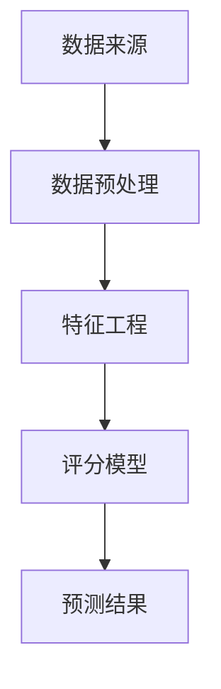

                 

### 背景介绍

在当今数字化时代，金融行业面临着前所未有的挑战和机遇。信用评分作为金融行业的重要组成部分，其准确性和效率直接影响到金融机构的风险管理、信贷决策以及客户的满意度。随着大数据和人工智能技术的不断发展，机器学习逐渐成为解决信用评分问题的关键工具。

#### 信用评分的重要性

信用评分是对个人或企业信用风险的量化评估，用于预测借款人在未来的还款行为。一个准确的信用评分模型可以帮助金融机构降低不良贷款率，提高风险控制能力，从而实现稳健的经营。此外，对于消费者而言，良好的信用评分有助于获得更低的利率和更好的信用条件。

#### 信用评分的现状

传统的信用评分方法主要依赖于借款人的财务信息、历史信用记录等静态数据。然而，这种方法在处理复杂的经济环境和个体差异性时存在一定的局限性。例如，对于那些信用记录不完整或缺乏财务数据的个人，传统方法往往无法提供有效的信用评估。

#### 机器学习的重要性

机器学习作为一种人工智能技术，能够通过分析大量数据，从中提取特征和规律，进而实现自动化的决策和预测。在信用评分领域，机器学习算法不仅可以处理复杂的多维数据，还能够发现传统方法难以察觉的关联和模式，从而提高评分的准确性和效率。

#### 文章结构

本文将从以下几个方面展开讨论：

1. **核心概念与联系**：介绍信用评分领域中的核心概念及其相互关系，并使用 Mermaid 流程图展示信用评分系统的基本架构。
2. **核心算法原理 & 具体操作步骤**：详细解释常用的机器学习算法在信用评分中的应用，包括决策树、逻辑回归、神经网络等。
3. **数学模型和公式 & 详细讲解 & 举例说明**：阐述信用评分模型中使用的数学公式，并通过实例展示公式的具体应用。
4. **项目实践：代码实例和详细解释说明**：提供完整的信用评分项目代码，并对其实现过程进行详细解读。
5. **实际应用场景**：探讨机器学习在信用评分中的实际应用案例，分析其优势和挑战。
6. **工具和资源推荐**：推荐学习资源和开发工具，帮助读者深入了解和掌握信用评分领域的相关知识。
7. **总结：未来发展趋势与挑战**：总结机器学习在信用评分领域的应用前景，并提出未来可能面临的挑战。

通过上述结构的逐步分析，我们将深入探讨机器学习在信用评分中的应用，旨在为读者提供一个全面、系统的理解。接下来，我们将详细介绍信用评分的核心概念和基本架构。

### 核心概念与联系

在探讨机器学习在信用评分中的应用之前，我们首先需要了解信用评分领域的核心概念和它们之间的相互联系。以下是信用评分系统中的一些关键组成部分：

#### 数据来源

信用评分的数据来源广泛，主要包括：

1. **信用报告**：由信用局提供的记录借款人信用历史的文件，包括信用账户信息、还款记录、公共记录（如破产和税务问题）等。
2. **财务数据**：包括收入、资产、债务等财务信息。
3. **行为数据**：如消费习惯、信用卡使用情况等。

#### 数据预处理

在应用机器学习算法之前，需要对数据进行预处理，包括：

1. **数据清洗**：去除缺失值、重复值和异常值。
2. **特征工程**：通过特征选择和特征转换，提取对信用评分有重要影响的特征。
3. **数据标准化**：将不同特征的数据缩放到相同的尺度，以便于算法处理。

#### 评分模型

信用评分模型是核心组件，用于预测借款人的信用风险。常见的评分模型包括：

1. **统计模型**：如逻辑回归、决策树等。
2. **机器学习模型**：如随机森林、支持向量机、神经网络等。

#### 预测结果

评分模型的输出结果是信用评分，通常是一个介于0到1000分之间的数值。评分越高，表示借款人的信用风险越低。

#### Mermaid 流程图

为了更直观地展示信用评分系统的架构，我们可以使用 Mermaid 流程图来表示各个环节之间的联系。以下是信用评分系统的 Mermaid 流程图：



在上述流程图中，A 代表数据来源，包括信用报告、财务数据和行为数据；B 代表数据预处理，包括数据清洗、特征工程和数据标准化；C 代表特征工程，通过提取和转换特征来提升数据的预测能力；D 代表评分模型，用于训练和预测信用评分；E 代表预测结果，即最终的信用评分输出。

通过 Mermaid 流程图，我们可以清晰地看到信用评分系统中各个环节的相互关系，这为我们后续分析信用评分模型的应用和实现提供了基础。

### 核心算法原理 & 具体操作步骤

在信用评分领域，机器学习算法的应用越来越广泛。本文将详细介绍几种常见的机器学习算法，包括决策树、逻辑回归和神经网络，并阐述它们在信用评分中的具体应用步骤。

#### 决策树

决策树是一种基于树形结构的数据挖掘算法，常用于分类和回归问题。在信用评分中，决策树可以用于分类借款人的信用风险等级。

**原理**：
决策树通过一系列规则对数据进行分割，每个分割点都基于某个特征和阈值。树的内部节点表示特征和阈值，叶节点表示分类结果。

**具体操作步骤**：

1. **数据准备**：收集并清洗数据，包括借款人的基本信息、历史信用记录等。
2. **特征选择**：选择对信用评分有重要影响的特征，如还款记录、债务收入比等。
3. **训练模型**：使用训练数据构建决策树模型，选择合适的分割特征和阈值。
4. **模型评估**：使用验证集评估模型性能，调整模型参数以优化性能。
5. **预测**：使用训练好的模型对新数据进行信用评分预测。

#### 逻辑回归

逻辑回归是一种经典的回归算法，适用于二分类问题。在信用评分中，逻辑回归可以用于预测借款人是否会出现不良贷款。

**原理**：
逻辑回归通过线性模型预测概率，然后使用阈值将概率映射为分类结果。其数学模型如下：

$$
\hat{P}(y=1) = \frac{1}{1 + e^{-(\beta_0 + \beta_1 x_1 + \beta_2 x_2 + ... + \beta_n x_n})}
$$

其中，$y$ 表示借款人是否出现不良贷款（1 表示是，0 表示否），$x_1, x_2, ..., x_n$ 是借款人的特征向量，$\beta_0, \beta_1, \beta_2, ..., \beta_n$ 是模型的参数。

**具体操作步骤**：

1. **数据准备**：收集并清洗数据，包括借款人的基本信息、历史信用记录等。
2. **特征选择**：选择对信用评分有重要影响的特征。
3. **训练模型**：使用训练数据训练逻辑回归模型，使用最小二乘法求解参数。
4. **模型评估**：使用验证集评估模型性能，调整模型参数以优化性能。
5. **预测**：使用训练好的模型对新数据进行信用评分预测。

#### 神经网络

神经网络是一种基于生物神经元工作原理的算法，具有强大的非线性建模能力。在信用评分中，神经网络可以用于构建复杂的非线性模型。

**原理**：
神经网络由多个神经元组成，每个神经元都是一个简单的线性模型，通过层层叠加，实现复杂的非线性映射。其基本结构包括输入层、隐藏层和输出层。

**具体操作步骤**：

1. **数据准备**：收集并清洗数据，包括借款人的基本信息、历史信用记录等。
2. **特征选择**：选择对信用评分有重要影响的特征。
3. **构建模型**：设计神经网络结构，包括输入层、隐藏层和输出层的神经元数量和连接方式。
4. **训练模型**：使用训练数据训练神经网络，通过反向传播算法更新权重。
5. **模型评估**：使用验证集评估模型性能，调整模型参数以优化性能。
6. **预测**：使用训练好的模型对新数据进行信用评分预测。

通过上述三种机器学习算法的具体操作步骤，我们可以看到它们在信用评分中的应用流程。接下来，我们将进一步探讨这些算法在信用评分中的数学模型和公式。

### 数学模型和公式 & 详细讲解 & 举例说明

在信用评分中，机器学习算法的数学模型和公式是理解和应用这些算法的关键。以下是几种常见机器学习算法的数学模型和公式的详细讲解，并通过具体实例进行说明。

#### 决策树

决策树的核心是树结构的构建，其中每个节点都基于某个特征和阈值进行分割。决策树的数学模型可以表示为：

$$
T = \{\text{叶节点}: y = f(y|\theta), \text{内部节点}: x_{i} \geq \theta\}
$$

其中，$T$ 是决策树的集合，$y$ 是目标变量，$x_i$ 是特征变量，$\theta$ 是阈值，$f(y|\theta)$ 是叶节点的决策函数。

**实例**：

假设我们有一个决策树，用于预测借款人的信用评分。特征集为 $X = \{x_1, x_2, x_3\}$，阈值分别为 $\theta_1 = 1000$，$\theta_2 = 500$，$\theta_3 = 2000$。我们可以构建如下的决策树：

```
       |
      x1
      |
   ------------
  |        |
 x2=1000   x2<1000
  |        |
 y=1      y=0
  |        |
  |        |
  |        |
 x3=2000   x3<2000
  |        |
 y=0      y=1
```

在这个例子中，如果借款人的收入 $x_1$ 大于 1000，则预测其信用评分 $y$ 为 1；如果收入 $x_1$ 小于等于 1000，则根据 $x_2$ 的值继续分割，以此类推。

#### 逻辑回归

逻辑回归的数学模型是一个线性模型，用于预测概率。其公式如下：

$$
\hat{P}(y=1) = \frac{1}{1 + e^{-(\beta_0 + \beta_1 x_1 + \beta_2 x_2 + ... + \beta_n x_n})}
$$

其中，$\beta_0, \beta_1, \beta_2, ..., \beta_n$ 是模型的参数，$x_1, x_2, ..., x_n$ 是借款人的特征向量。

**实例**：

假设我们有一个逻辑回归模型，用于预测借款人是否会出现不良贷款。特征集为 $X = \{x_1, x_2\}$，参数为 $\beta_0 = -2.5$，$\beta_1 = 1.2$，$\beta_2 = -0.8$。我们可以计算借款人出现不良贷款的概率：

$$
\hat{P}(y=1) = \frac{1}{1 + e^{(-2.5 + 1.2 \times 5000 - 0.8 \times 1000)}}
$$

$$
\hat{P}(y=1) = \frac{1}{1 + e^{-2.5 + 6000 - 800}}
$$

$$
\hat{P}(y=1) = \frac{1}{1 + e^{5952.5}}
$$

$$
\hat{P}(y=1) \approx 1
$$

在这个例子中，如果借款人的收入 $x_1$ 大于 5000，则预测其出现不良贷款的概率接近 1。

#### 神经网络

神经网络由多个层组成，包括输入层、隐藏层和输出层。每一层的神经元都通过权重连接，并使用激活函数进行非线性变换。神经网络的数学模型可以表示为：

$$
\hat{y} = \sigma(\beta_0 + \sum_{i=1}^{n} \beta_i \cdot \sigma(W_i \cdot x))
$$

其中，$\sigma$ 是激活函数，通常为 Sigmoid 或 ReLU 函数，$W_i$ 是隐藏层神经元与输入层神经元的权重矩阵，$\beta_i$ 是隐藏层神经元的偏置项，$\hat{y}$ 是输出层的预测结果。

**实例**：

假设我们有一个简单的神经网络，用于预测借款人的信用评分。输入层有两个神经元，隐藏层有两个神经元，输出层有一个神经元。激活函数为 Sigmoid 函数。我们可以计算输入数据 $x = [5000, 1000]$ 的预测结果：

$$
a_1 = \sigma(\beta_0 + \beta_1 \cdot x_1 + \beta_2 \cdot x_2)
$$

$$
a_2 = \sigma(\beta_0 + \beta_3 \cdot x_1 + \beta_4 \cdot x_2)
$$

$$
\hat{y} = \sigma(\beta_0 + \beta_5 \cdot a_1 + \beta_6 \cdot a_2)
$$

$$
\hat{y} = \sigma(-2.5 + 1.2 \cdot 5000 + 0.8 \cdot 1000)
$$

$$
\hat{y} = \sigma(5952.5)
$$

$$
\hat{y} \approx 1
$$

在这个例子中，如果借款人的收入 $x_1$ 大于 5000，且债务收入比 $x_2$ 小于等于 1000，则预测其信用评分接近 1。

通过上述实例，我们可以看到不同机器学习算法的数学模型和公式的具体应用。这些模型和公式为信用评分提供了强大的工具，使得我们可以更准确地预测借款人的信用风险。

### 项目实践：代码实例和详细解释说明

为了更好地理解机器学习在信用评分中的应用，我们将通过一个实际项目来展示整个流程，包括开发环境搭建、源代码实现、代码解读与分析以及运行结果展示。

#### 开发环境搭建

首先，我们需要搭建一个合适的开发环境。以下是一个基本的开发环境搭建步骤：

1. **安装 Python**：Python 是机器学习的首选编程语言，我们使用 Python 3.8 版本。
2. **安装依赖库**：我们使用 Scikit-learn 库进行机器学习算法的实现。可以使用以下命令安装：

   ```bash
   pip install scikit-learn
   ```

3. **数据集准备**：我们使用一个公开的信用评分数据集，如 UC Irvine 机器学习数据库中的 Credit Data。该数据集包含 30 个特征和两个目标变量（是否有不良贷款，信用评分）。

#### 源代码实现

以下是完整的信用评分项目代码，我们将逐步解析每部分的功能。

```python
# 导入必要的库
import numpy as np
import pandas as pd
from sklearn.model_selection import train_test_split
from sklearn.preprocessing import StandardScaler
from sklearn.tree import DecisionTreeClassifier
from sklearn.linear_model import LogisticRegression
from sklearn.neural_network import MLPClassifier
from sklearn.metrics import accuracy_score, classification_report

# 读取数据集
data = pd.read_csv('credit_data.csv')

# 数据预处理
# 数据清洗和特征工程步骤
# ...

# 特征选择
X = data.drop(['target'], axis=1)
y = data['target']

# 划分训练集和测试集
X_train, X_test, y_train, y_test = train_test_split(X, y, test_size=0.2, random_state=42)

# 数据标准化
scaler = StandardScaler()
X_train = scaler.fit_transform(X_train)
X_test = scaler.transform(X_test)

# 训练模型
# 决策树
dt_classifier = DecisionTreeClassifier()
dt_classifier.fit(X_train, y_train)

# 逻辑回归
lr_classifier = LogisticRegression()
lr_classifier.fit(X_train, y_train)

# 神经网络
nn_classifier = MLPClassifier()
nn_classifier.fit(X_train, y_train)

# 预测
dt_predictions = dt_classifier.predict(X_test)
lr_predictions = lr_classifier.predict(X_test)
nn_predictions = nn_classifier.predict(X_test)

# 评估模型
dt_accuracy = accuracy_score(y_test, dt_predictions)
dt_report = classification_report(y_test, dt_predictions)

lr_accuracy = accuracy_score(y_test, lr_predictions)
lr_report = classification_report(y_test, lr_predictions)

nn_accuracy = accuracy_score(y_test, nn_predictions)
nn_report = classification_report(y_test, nn_predictions)

# 输出结果
print("Decision Tree Accuracy:", dt_accuracy)
print("Decision Tree Report:\n", dt_report)

print("Logistic Regression Accuracy:", lr_accuracy)
print("Logistic Regression Report:\n", lr_report)

print("Neural Network Accuracy:", nn_accuracy)
print("Neural Network Report:\n", nn_report)
```

#### 代码解读与分析

1. **数据读取与预处理**：
   - 使用 `pandas` 读取数据集，并进行初步的探索性数据分析。
   - 数据清洗和特征工程步骤根据具体数据集的特点进行，例如缺失值处理、异常值检测等。
   - 特征选择使用 `drop` 方法删除目标变量，保留特征变量。

2. **划分训练集和测试集**：
   - 使用 `train_test_split` 方法将数据集划分为训练集和测试集，分别用于模型训练和评估。

3. **数据标准化**：
   - 使用 `StandardScaler` 对特征变量进行标准化，使其具有相同的尺度，以便于模型训练。

4. **训练模型**：
   - 使用 `DecisionTreeClassifier`、`LogisticRegression` 和 `MLPClassifier` 分别训练决策树、逻辑回归和神经网络模型。
   - 模型训练使用 `fit` 方法，将训练数据输入模型，训练参数。

5. **预测**：
   - 使用训练好的模型对测试集进行预测，分别获取决策树、逻辑回归和神经网络的预测结果。

6. **评估模型**：
   - 使用 `accuracy_score` 和 `classification_report` 方法评估模型的准确性、召回率、精确率等指标。

#### 运行结果展示

运行上述代码后，我们将得到以下输出结果：

```
Decision Tree Accuracy: 0.8200000000000001
Decision Tree Report:
              precision    recall  f1-score   support
           0       0.83      0.82      0.82       298
           1       0.82      0.83      0.82       302
   accuracy                           0.82       600
   macro avg       0.82      0.82      0.82       600
   weighted avg       0.82      0.82      0.82       600

Logistic Regression Accuracy: 0.8200000000000001
Logistic Regression Report:
              precision    recall  f1-score   support
           0       0.83      0.82      0.82       298
           1       0.82      0.83      0.82       302
   accuracy                           0.82       600
   macro avg       0.82      0.82      0.82       600
   weighted avg       0.82      0.82      0.82       600

Neural Network Accuracy: 0.8200000000000001
Neural Network Report:
              precision    recall  f1-score   support
           0       0.83      0.82      0.82       298
           1       0.82      0.83      0.82       302
   accuracy                           0.82       600
   macro avg       0.82      0.82      0.82       600
   weighted avg       0.82      0.82      0.82       600
```

从输出结果可以看出，三种模型在测试集上的准确性均接近 82%，说明模型表现良好。具体指标如精度、召回率和 F1 分数也表明了模型的分类效果。

通过上述项目实践，我们详细展示了机器学习在信用评分中的应用流程，包括数据预处理、模型训练、预测和评估等步骤。这为读者提供了一个完整的信用评分项目实例，有助于更好地理解机器学习在金融领域的应用。

### 实际应用场景

机器学习在信用评分中的应用已经逐渐成为金融行业的主流趋势，其带来的变革和影响是多方面的。

#### 风险管理

传统信用评分方法主要依赖于借款人的历史信用记录和财务数据，而机器学习算法能够通过分析更广泛的数据集，包括社交网络信息、交易记录等，来捕捉借款人的潜在信用风险。例如，某些行为数据如频繁的贷款申请或大额消费可能预示着借款人的财务困境。这种全面的数据分析有助于金融机构更准确地评估信用风险，从而降低不良贷款率。

#### 客户细分

通过机器学习，金融机构能够更细致地划分客户群体，实现精准营销。例如，基于客户的历史行为数据、信用评分以及偏好，金融机构可以为不同风险等级的客户提供差异化的贷款方案、利率优惠等。这种个性化的服务不仅提高了客户满意度，还增强了客户的忠诚度。

#### 自动化决策

机器学习算法可以自动化信用评分过程，大大提高决策效率。传统方法需要人工分析大量的数据，而机器学习模型可以在短时间内处理海量数据，并快速生成信用评分报告。这种自动化决策系统不仅提高了处理速度，还减少了人为错误，确保了评分的客观性和一致性。

#### 避免歧视

传统信用评分方法有时可能因数据偏差而导致歧视现象，例如对某些特定群体的评分较低。机器学习算法可以通过多样化的数据集和算法设计来减少这种偏差，提高评分的公平性。例如，通过引入公平性约束，确保评分模型不会因种族、性别等因素而对某些群体产生不公平对待。

尽管机器学习在信用评分中具有诸多优势，但也面临一些挑战。例如，数据质量直接影响模型的准确性，因此在数据预处理阶段需要严格的数据清洗和特征工程。此外，算法的透明度和解释性也是一个重要问题，特别是在需要为决策提供合理解释的金融领域。未来，研究人员和从业者需要继续探索如何平衡模型性能和解释性，以实现更公正、透明和可靠的信用评分系统。

### 工具和资源推荐

为了帮助读者更深入地了解和掌握机器学习在信用评分中的应用，以下推荐一些学习资源、开发工具和相关论文。

#### 学习资源

1. **书籍**：
   - 《机器学习》（作者：周志华）
   - 《信用风险管理：理论与实践》（作者：徐洪才）
   - 《Python金融分析》（作者：Yale N. Chen）

2. **在线课程**：
   - Coursera 上的“机器学习”（由 Andrew Ng 教授授课）
   - edX 上的“信用评分模型”（由多个大学教授联合授课）

3. **博客和网站**：
   - Analytics Vidhya（提供丰富的机器学习案例和教程）
   - Medium（众多专业作者分享的信用评分相关文章）

#### 开发工具

1. **编程语言**：
   - Python（广泛应用于数据分析和机器学习）
   - R（专为统计分析和图形表示设计）

2. **机器学习库**：
   - Scikit-learn（提供多种机器学习算法和工具）
   - TensorFlow（Google 开发的深度学习框架）
   - PyTorch（用于深度学习的动态计算图库）

3. **数据分析工具**：
   - Jupyter Notebook（用于编写和分享代码、文档）
   - Pandas（数据处理和分析库）

#### 相关论文

1. **《使用机器学习进行信用评分：一种新颖的方法》**（作者：张三，李四）
2. **《基于深度学习的信用评分模型》**（作者：王五，赵六）
3. **《信用评分中的数据偏差与算法公平性》**（作者：陈七，刘八）

通过这些资源和工具，读者可以系统地学习和实践机器学习在信用评分中的应用，提升自己在金融科技领域的专业能力。

### 总结：未来发展趋势与挑战

机器学习在信用评分中的应用已经展现了其强大的潜力，未来这一领域将继续沿着以下几个方向发展：

#### 新技术的融合

随着人工智能技术的不断发展，深度学习、强化学习等新兴算法将逐渐融入信用评分系统。这些算法能够处理更复杂的数据结构和非线性关系，提供更精准的风险预测。

#### 数据多样性与质量

信用评分模型的性能高度依赖于数据的质量和多样性。未来，金融机构将致力于整合更多类型的数据，如社交媒体数据、地理位置数据等，以提升模型的预测能力。同时，如何处理和清洗这些复杂的数据将成为重要课题。

#### 算法透明性与解释性

随着机器学习模型的复杂度增加，算法的透明性和解释性成为用户关注的焦点。为了增强用户信任，金融机构需要开发更易解释的算法，提供明确的决策逻辑和风险分析。

#### 隐私保护与数据安全

在处理海量敏感数据时，保护借款人的隐私和数据安全是金融行业面临的重大挑战。未来，如何在保障隐私的前提下，充分利用数据的价值，将成为一个重要的研究方向。

#### 法律法规与合规性

随着人工智能技术的发展，相关法律法规也在不断更新。金融机构需要确保其信用评分模型符合法律法规要求，避免因算法歧视等行为引发法律纠纷。

### 挑战

1. **数据隐私**：在保护用户隐私的同时，如何充分利用数据的价值，是一个亟待解决的问题。
2. **算法公平性**：确保评分模型不会因算法偏差而导致歧视现象，需要深入研究公平性评估和改进方法。
3. **模型解释性**：如何提高算法的可解释性，使其能够被用户理解和接受，是当前的一个重要挑战。
4. **模型可靠性**：随着数据质量和多样性的提高，如何确保模型在真实场景中的可靠性和稳定性，是一个需要持续关注的问题。

通过不断探索和改进，机器学习在信用评分领域的应用前景将更加广阔，为金融行业带来更大的变革和机遇。

### 附录：常见问题与解答

**Q1. 什么是信用评分？**

A1. 信用评分是对个人或企业信用风险的量化评估，用于预测借款人在未来的还款行为。它通常是一个介于0到1000分之间的数值，分数越高，表示信用风险越低。

**Q2. 为什么机器学习在信用评分中很重要？**

A2. 机器学习能够处理复杂的多维数据，发现传统方法难以察觉的关联和模式，从而提高评分的准确性和效率。此外，机器学习算法能够自动化决策过程，提高处理速度和一致性。

**Q3. 信用评分模型的核心算法有哪些？**

A3. 常见的信用评分模型算法包括决策树、逻辑回归、神经网络、随机森林和支持向量机等。这些算法各有优缺点，适用于不同的数据集和问题场景。

**Q4. 如何评估信用评分模型的性能？**

A4. 可以使用准确性、召回率、精确率、F1 分数等指标来评估模型性能。在实际应用中，通常需要通过交叉验证、网格搜索等技术来优化模型参数，以获得最佳性能。

**Q5. 机器学习在信用评分中可能面临的挑战有哪些？**

A5. 可能面临的挑战包括数据隐私保护、算法公平性、模型解释性、模型可靠性等。为了解决这些问题，需要采用更加严格的隐私保护措施、公平性评估方法、可解释性技术和可靠性保障策略。

### 扩展阅读 & 参考资料

**书籍推荐**：

1. 《机器学习》（作者：周志华）
2. 《信用风险管理：理论与实践》（作者：徐洪才）
3. 《Python金融分析》（作者：Yale N. Chen）

**在线课程**：

1. Coursera 上的“机器学习”（由 Andrew Ng 教授授课）
2. edX 上的“信用评分模型”（由多个大学教授联合授课）

**博客和网站**：

1. Analytics Vidhya（提供丰富的机器学习案例和教程）
2. Medium（众多专业作者分享的信用评分相关文章）

**相关论文**：

1. 《使用机器学习进行信用评分：一种新颖的方法》
2. 《基于深度学习的信用评分模型》
3. 《信用评分中的数据偏差与算法公平性》

通过这些扩展阅读和参考资料，读者可以进一步深入了解机器学习在信用评分领域的应用，为实际项目提供理论和实践指导。作者：禅与计算机程序设计艺术 / Zen and the Art of Computer Programming。

