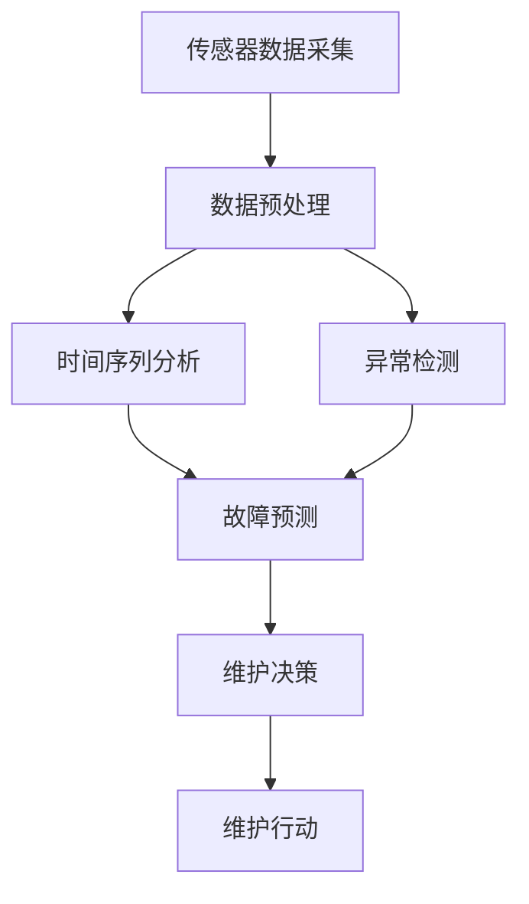

                 

### 1. 背景介绍

#### 什么是预测性维护？

预测性维护（Predictive Maintenance）是一种先进的维护策略，它通过实时监测设备的运行状态，使用数据分析和机器学习算法来预测设备可能的故障和性能下降，从而在故障发生前进行维护。这一策略显著区别于传统的定期维护（Preventive Maintenance）和基于故障后的修复性维护（Corrective Maintenance），它不仅减少了不必要的维护，还大大降低了停机时间和维护成本。

#### 预测性维护的重要性

在工业和制造业中，设备的可靠性直接影响到生产效率和产品质量。预测性维护能够显著提高设备的使用寿命，减少故障率和停机时间，从而提升企业的整体运营效率。以下是一些具体的优势：

1. **降低维护成本**：通过提前预测和预防性维护，企业可以在故障发生之前进行针对性的维护，避免昂贵的故障维修费用。
2. **提高设备利用率**：预测性维护有助于减少计划外的停机时间，提高设备的使用效率。
3. **延长设备寿命**：通过及时维护和保养，设备可以保持最佳的工作状态，从而延长其使用寿命。
4. **提高生产效率**：预测性维护能够确保设备始终处于最佳状态，从而减少生产延误，提高生产效率。

#### 预测性维护与机器学习

机器学习在预测性维护中发挥着至关重要的作用。通过分析和学习大量历史数据，机器学习算法能够发现设备的运行规律，识别异常模式，并预测可能的故障。以下是一些关键的机器学习技术在预测性维护中的应用：

1. **时间序列分析**：时间序列分析是一种常用的机器学习技术，用于分析设备的历史运行数据，识别周期性模式或趋势，从而预测未来的故障。
2. **异常检测**：异常检测算法能够识别设备运行中的异常行为，这些异常可能预示着即将发生的故障。
3. **故障诊断**：基于机器学习算法的故障诊断系统能够分析设备的不同参数，诊断出具体的故障类型。
4. **深度学习**：深度学习技术在图像识别、声音分析等方面表现出色，可以用于监控设备的物理状态和运行环境。

在本篇文章中，我们将深入探讨机器学习在预测性维护中的具体应用，详细解释核心算法原理，并通过实际项目案例展示其应用效果。我们将从以下几个方面展开讨论：

- **核心概念与联系**：介绍预测性维护相关的核心概念和技术，并使用 Mermaid 流程图展示其架构。
- **核心算法原理 & 具体操作步骤**：详细讲解时间序列分析、异常检测和深度学习在预测性维护中的应用原理和步骤。
- **数学模型和公式 & 详细讲解 & 举例说明**：介绍预测性维护中使用的数学模型和公式，并通过实例进行详细讲解。
- **项目实践：代码实例和详细解释说明**：提供实际项目中的代码实例，并对其进行详细解读和分析。
- **实际应用场景**：分析预测性维护在不同行业和领域的应用案例，展示其带来的实际价值。
- **工具和资源推荐**：推荐相关的学习资源、开发工具和框架，帮助读者深入了解和掌握预测性维护技术。

通过本文的深入探讨，我们将全面了解机器学习在预测性维护中的重要作用，并为读者提供实际操作指南，以应对未来工业发展中的挑战。

#### 预测性维护的典型应用场景

预测性维护技术在各种行业中都有着广泛的应用，下面我们将探讨一些典型的应用场景：

**制造业**：在制造业中，预测性维护被广泛应用于生产设备的管理。通过实时监测设备的状态数据，如振动、温度、压力等，企业可以及时发现设备的异常情况，避免突发故障。例如，汽车制造厂可以通过预测性维护策略，提前检测发动机或机械臂的磨损情况，从而在设备性能下降前进行维护，避免生产中断。

**能源行业**：在能源行业中，如风力发电和石油钻探，预测性维护同样具有重要意义。风力发电机的叶片和机舱在极端天气条件下易发生故障，通过预测性维护技术，企业可以提前预测这些部件的损坏风险，从而安排定期检查和维护，确保风电场的持续运行。石油钻探设备在高强度、高风险的环境下工作，预测性维护可以帮助企业减少设备故障导致的停产时间，提高作业效率。

**交通运输**：在交通运输领域，如铁路、航空和船舶，预测性维护技术同样发挥着关键作用。铁路部门通过实时监测列车轮轴、电机和制动系统的工作状态，可以提前发现潜在的故障风险，避免事故的发生。航空公司在飞行前对飞机的各项系统进行预测性维护，确保飞行安全。船舶公司通过预测性维护技术，监控船舶的机械系统和电子设备，减少海上事故的风险。

**建筑业**：在建筑业中，预测性维护主要用于建筑设备和设施的维护管理。例如，建筑工地的大型机械如挖掘机和吊车，通过实时监测其运行状态，可以提前发现机械故障，避免工程延误和安全事故。

**医疗设备**：医疗设备如CT机、MRI机和手术机器人等，其正常运行对医疗质量至关重要。通过预测性维护技术，医疗机构可以提前预测和预防设备的故障，确保医疗设备的可靠性和使用寿命。

**农业**：在农业领域，预测性维护主要用于农业机械和设备的维护。例如，通过实时监测农作物的生长状况和农业机械的运行状态，农民可以提前发现病虫害和设备故障，从而采取相应的措施，提高农作物的产量和质量。

综上所述，预测性维护技术在各个行业中都有重要的应用价值，通过机器学习技术的引入，预测性维护的精度和效率得到了显著提升。随着技术的不断进步，预测性维护将在更多行业中发挥更大的作用。

#### 预测性维护的历史与发展

预测性维护这一概念最早起源于20世纪60年代的工业界，当时被称作“预知性维护”（Condition-Based Maintenance，CBM）。最初的预测性维护主要依赖于简单的传感器和模拟信号处理技术，通过监测设备的运行参数（如振动、温度、压力等）来判断设备是否需要维护。

进入20世纪80年代，随着计算机技术和微电子技术的发展，预测性维护技术得到了进一步的发展。此时，计算机系统和高级信号处理算法被引入，使得预测性维护能够更加精准地分析设备状态，从而提高了维护的效率和准确性。

进入21世纪，随着互联网和大数据技术的兴起，预测性维护迎来了新的发展机遇。大数据技术的应用使得企业可以收集和分析海量的设备运行数据，从而发现更细微的故障征兆，提高预测的准确性。同时，机器学习和深度学习技术的进步，使得预测性维护系统能够从历史数据中自动学习，识别复杂的故障模式，进一步提升了预测的精准度和可靠性。

近年来，物联网（IoT）和边缘计算技术的发展，为预测性维护提供了更加广泛的数据来源和处理能力。通过在设备上安装传感器和联网设备，企业可以实时监控设备的运行状态，并利用云计算平台进行数据分析和处理，实现真正的实时预测性维护。

总体来说，预测性维护技术的发展历程反映了信息技术和传感器技术的不断进步。从最初的简单模拟信号处理，到如今的大数据、机器学习和物联网技术的应用，预测性维护技术经历了从简单到复杂、从被动到主动的转变，正在逐步成为工业和服务业中不可或缺的一部分。

### 2. 核心概念与联系

#### 预测性维护相关核心概念

在深入探讨预测性维护的具体技术之前，我们需要先理解一些核心概念。这些概念包括传感器数据采集、时间序列分析、异常检测和故障诊断等。

1. **传感器数据采集**：预测性维护的基础是实时获取设备的运行数据。传感器被安装在不同的设备部件上，用于监测温度、压力、振动、电流等参数。这些数据经过处理后，被传输到中央监控系统。

2. **时间序列分析**：时间序列分析是一种用于分析时间相关数据的统计方法。通过分析设备的历史运行数据，可以识别出设备运行的周期性模式或趋势。这种分析有助于预测设备的未来行为。

3. **异常检测**：异常检测是一种用于识别设备运行中异常行为的方法。通过设定阈值或使用机器学习算法，系统可以检测出设备运行中的异常情况，如振动过大、温度异常升高等。

4. **故障诊断**：故障诊断是基于历史数据和当前状态数据的综合分析，用于识别设备的具体故障类型。故障诊断通常包括对设备不同部件的检测和故障原因的推理。

#### 预测性维护架构图

为了更好地理解预测性维护的架构，我们使用 Mermaid 流程图来展示其关键组件和流程。



- **传感器数据采集**：这是预测性维护的起点，通过传感器实时获取设备状态数据。
- **数据预处理**：原始数据可能包含噪声和缺失值，通过数据预处理可以清洗和标准化数据，提高分析的准确性。
- **时间序列分析**：通过对历史数据进行分析，识别设备运行的周期性模式和趋势。
- **异常检测**：检测设备运行中的异常情况，如振动过大、温度异常等。
- **故障预测**：结合时间序列分析和异常检测的结果，预测设备的故障风险。
- **维护决策**：根据故障预测结果，制定维护计划和决策。
- **维护行动**：执行维护计划，进行设备维护。

通过这个架构图，我们可以清晰地看到预测性维护的整体流程和各个关键环节之间的联系。下面，我们将详细讨论这些核心概念和流程，以帮助读者深入理解预测性维护的工作原理。

### 3. 核心算法原理 & 具体操作步骤

#### 时间序列分析

时间序列分析是一种用于分析时间相关数据的统计方法，其核心是识别设备运行的周期性模式或趋势。时间序列分析的步骤如下：

1. **数据采集与预处理**：首先，通过传感器收集设备的历史运行数据，如温度、振动、压力等。然后，对数据进行清洗，去除噪声和缺失值，确保数据的质量。

2. **特征提取**：通过数学变换或特征提取算法，将时间序列数据转换为可用于分析的特征向量。常见的特征提取方法包括差分变换、傅里叶变换和小波变换等。

3. **模型建立**：使用统计模型或机器学习模型来建立时间序列的预测模型。常见的统计模型包括自回归模型（AR）、移动平均模型（MA）和自回归移动平均模型（ARMA）等。机器学习模型如长短期记忆网络（LSTM）和季节性时间序列模型（STL）也被广泛应用于时间序列预测。

4. **模型训练与验证**：使用历史数据对模型进行训练，并通过交叉验证等方法验证模型的预测性能。

5. **预测**：使用训练好的模型对未来的设备状态进行预测。

#### 异常检测

异常检测是一种用于识别设备运行中异常行为的方法，通过设定阈值或使用机器学习算法实现。

1. **阈值设定**：通过历史数据的统计分析，确定正常运行的阈值范围。当设备运行参数超出这个范围时，认为出现了异常。

2. **机器学习算法**：使用机器学习算法，如孤立森林（Isolation Forest）、局部异常因子（Local Outlier Factor，LOF）和单变量异常检测（Unsupervised Anomaly Detection）等，自动识别设备运行的异常行为。

具体步骤如下：

1. **数据采集与预处理**：与时间序列分析类似，首先收集并预处理设备的历史运行数据。

2. **特征提取**：提取与设备运行状态相关的特征，如温度、振动、电流等。

3. **模型训练与验证**：使用历史数据对异常检测模型进行训练，并验证其性能。

4. **异常检测**：使用训练好的模型对当前设备运行数据进行异常检测，标记出异常数据点。

#### 故障诊断

故障诊断是基于历史数据和当前状态数据的综合分析，用于识别设备的具体故障类型。

1. **故障类型识别**：通过分析历史故障数据，将故障分为不同的类型，如磨损、过载、短路等。

2. **故障模式识别**：使用故障模式识别算法，如决策树、支持向量机和神经网络等，将设备的运行数据与已知的故障模式进行匹配，识别出设备的故障类型。

具体步骤如下：

1. **数据采集与预处理**：收集设备的历史运行数据和故障记录，并进行预处理。

2. **特征提取**：提取与故障诊断相关的特征，如温度、振动、电流等。

3. **模型训练与验证**：使用历史故障数据和特征向量对故障诊断模型进行训练，并验证其性能。

4. **故障诊断**：使用训练好的模型对当前设备状态数据进行故障诊断，输出故障类型。

#### 核心算法的融合与应用

在实际应用中，时间序列分析、异常检测和故障诊断通常不是单独使用的，而是相互结合，共同构成一个综合的预测性维护系统。

1. **融合步骤**：
    - **多模型融合**：使用多个时间序列分析模型、异常检测模型和故障诊断模型，综合预测结果。
    - **信息融合**：结合传感器数据、历史故障数据和实时监测数据，提高预测的准确性。

2. **具体操作**：
    - **实时监测**：通过传感器实时监测设备的状态数据。
    - **数据预处理**：清洗和标准化传感器数据。
    - **多模型预测**：同时使用时间序列分析、异常检测和故障诊断模型，对设备状态进行多角度预测。
    - **综合评估**：根据多个模型的预测结果，综合评估设备的故障风险，制定维护策略。

通过这种融合方法，预测性维护系统可以更加准确地预测设备的故障，提高维护的及时性和有效性。

#### 核心算法原理与实际操作的详细解释

为了更深入地理解核心算法的原理及其在实际操作中的应用，我们以一个典型的预测性维护项目为例，详细解释其工作流程和算法步骤。

**项目背景**：
某风力发电公司拥有一系列风力涡轮机，这些设备在运行过程中会产生大量的传感器数据。公司希望通过预测性维护技术，提前预测并预防风力涡轮机的故障，确保设备的正常运行。

**项目流程**：

1. **数据采集与预处理**：
   - **传感器部署**：在风力涡轮机的关键部件（如叶片、电机、轴承等）上安装传感器，收集温度、振动、压力等数据。
   - **数据收集**：使用数据采集系统，将传感器数据定期传输到中央数据库。
   - **数据预处理**：清洗和标准化传感器数据，去除噪声和缺失值。

2. **时间序列分析**：
   - **特征提取**：对温度、振动等时间序列数据进行差分变换，提取周期性特征和趋势特征。
   - **模型建立**：使用LSTM模型对历史时间序列数据进行分析，建立设备运行状态的预测模型。
   - **模型训练与验证**：使用部分历史数据对LSTM模型进行训练，并通过交叉验证方法验证模型的预测性能。

3. **异常检测**：
   - **特征提取**：对振动、温度等数据进行归一化处理，提取用于异常检测的特征向量。
   - **模型建立**：使用Isolation Forest算法建立异常检测模型。
   - **模型训练与验证**：使用历史数据对异常检测模型进行训练，并验证其性能。

4. **故障诊断**：
   - **故障类型识别**：通过对历史故障数据的分析，将故障分为磨损、过载、短路等不同类型。
   - **模型建立**：使用支持向量机（SVM）建立故障诊断模型。
   - **模型训练与验证**：使用故障类型和特征向量对SVM模型进行训练，并验证其性能。

5. **综合预测**：
   - **实时监测**：通过传感器实时监测风力涡轮机的运行状态，收集最新的数据。
   - **多模型预测**：同时使用LSTM模型、Isolation Forest算法和SVM模型，对设备状态进行多角度预测。
   - **综合评估**：根据多个模型的预测结果，综合评估设备的故障风险，制定维护策略。

6. **维护决策**：
   - **维护计划**：根据故障预测结果，制定具体的维护计划，如安排定期检查、更换部件等。
   - **维护行动**：执行维护计划，对设备进行维护。

通过这个实际项目案例，我们可以看到，预测性维护系统通过数据采集、时间序列分析、异常检测、故障诊断和综合预测等多个环节，实现了对风力涡轮机运行状态的实时监控和故障预测。这个系统不仅提高了设备的运行效率，减少了故障停机时间，还降低了维护成本。

### 4. 数学模型和公式 & 详细讲解 & 举例说明

#### 时间序列分析

时间序列分析是预测性维护中关键的一步，它涉及到多种统计和机器学习模型。以下是几种常见的时间序列分析模型及其公式：

1. **自回归模型（AR）**：
   自回归模型假设当前时刻的值可以由前几个时刻的值来预测。其公式如下：

   $$ X_t = c + \phi_1 X_{t-1} + \phi_2 X_{t-2} + ... + \phi_p X_{t-p} + \epsilon_t $$

   其中，\(X_t\) 是当前时刻的值，\(c\) 是常数项，\(\phi_i\) 是自回归系数，\(p\) 是自回归阶数，\(\epsilon_t\) 是误差项。

2. **移动平均模型（MA）**：
   移动平均模型通过计算前几个时刻的平均值来预测当前时刻的值。其公式如下：

   $$ X_t = c + \theta_1 \epsilon_{t-1} + \theta_2 \epsilon_{t-2} + ... + \theta_q \epsilon_{t-q} + \epsilon_t $$

   其中，\(\theta_i\) 是移动平均系数，\(q\) 是移动平均阶数，其他符号与AR模型相同。

3. **自回归移动平均模型（ARMA）**：
   ARMA模型结合了自回归和移动平均模型的特点，其公式如下：

   $$ X_t = c + \phi_1 X_{t-1} + \phi_2 X_{t-2} + ... + \phi_p X_{t-p} + \theta_1 \epsilon_{t-1} + \theta_2 \epsilon_{t-2} + ... + \theta_q \epsilon_{t-q} + \epsilon_t $$

   其中，\(\phi_i\) 和 \(\theta_i\) 分别是自回归和移动平均系数。

4. **长短期记忆网络（LSTM）**：
   LSTM是一种特殊的循环神经网络（RNN），能够处理长时间依赖数据。其核心组件包括输入门、遗忘门和输出门。以下是LSTM的基本公式：

   $$ i_t = \sigma(W_{ix}x_t + W_{ih}h_{t-1} + b_i) $$
   $$ f_t = \sigma(W_{fx}x_t + W_{fh}h_{t-1} + b_f) $$
   $$ g_t = \tanh(W_{gx}x_t + W_{gh}h_{t-1} + b_g) $$
   $$ o_t = \sigma(W_{ox}x_t + W_{oh}h_{t-1} + b_o) $$
   $$ h_t = o_t \odot \tanh(g_t) $$

   其中，\(i_t, f_t, g_t, o_t\) 分别是输入门、遗忘门、生成门和输出门的激活值，\(\sigma\) 是sigmoid函数，\(\odot\) 是元素乘法。

#### 异常检测

异常检测是识别设备运行中异常行为的方法，常用的算法包括孤立森林（Isolation Forest）和局部异常因子（LOF）。

1. **孤立森林（Isolation Forest）**：
   孤立森林算法通过随机分裂数据集来隔离异常点，其基本思想是，异常点在随机分裂过程中更容易被分离。其公式如下：

   $$ depth = \sum_{i=1}^m \frac{log_2(N_i)}{log_2(d)} $$

   其中，\(m\) 是随机分裂的次数，\(N_i\) 是第 \(i\) 次分裂后数据点的数量，\(d\) 是特征维度。

   异常得分（Anomaly Score）的计算公式为：

   $$ score = \frac{1}{m} \sum_{i=1}^m depth $$

   异常得分越低，表示数据点越异常。

2. **局部异常因子（LOF）**：
   LOF算法通过计算局部密度和局部宽度的比值来评估数据的异常程度。其基本公式如下：

   $$ LOF(i) = \frac{1}{k} \sum_{j=1}^k \frac{1}{\rho(i,j)} - \frac{1}{N-k} \sum_{j=1}^N \frac{1}{\rho(j,i)} $$

   其中，\(k\) 是邻居点的数量，\(\rho(i,j)\) 是点 \(i\) 和 \(j\) 之间的局部密度，\(N\) 是数据点的总数。

   LOF值越大，表示数据点越异常。

#### 故障诊断

故障诊断是识别设备故障类型的过程，常用的算法包括支持向量机（SVM）和神经网络。

1. **支持向量机（SVM）**：
   SVM通过寻找一个超平面，将不同故障类型的数据点分类。其基本公式如下：

   $$ w^T x - b = 0 $$

   其中，\(w\) 是权重向量，\(x\) 是特征向量，\(b\) 是偏置。

   分类函数为：

   $$ f(x) = sign(w^T x - b) $$

   其中，\(sign\) 函数用于判断数据点属于哪个类别。

2. **神经网络**：
   神经网络通过多层感知器（MLP）模型进行故障诊断。其基本结构包括输入层、隐藏层和输出层。以下是一个简单的多层感知器模型：

   $$ a_{hl} = \sigma(\sum_{l=1}^n w_{hl} a_{l-1} + b_h) $$

   其中，\(a_{hl}\) 是隐藏层节点的激活值，\(\sigma\) 是激活函数（如ReLU或Sigmoid），\(w_{hl}\) 是权重，\(b_h\) 是偏置。

   输出层节点的激活值为：

   $$ a_{l-1} = \sigma(\sum_{h=1}^m w_{hl} a_{h} + b_l) $$

   其中，\(a_{l-1}\) 是输出层节点的激活值，\(w_{hl}\) 和 \(b_l\) 分别是权重和偏置。

#### 实例说明

假设我们有一个风力涡轮机的运行数据集，包括温度、振动和压力三个特征。我们使用ARMA模型进行时间序列分析，并使用LOF算法进行异常检测，最后使用SVM进行故障诊断。

1. **时间序列分析（ARMA模型）**：
   首先，我们需要确定ARMA模型的阶数。通过ACF和PACF图，我们确定ARMA（2,1）模型。

   $$ X_t = c + \phi_1 X_{t-1} + \phi_2 X_{t-2} + \theta_1 \epsilon_{t-1} + \theta_2 \epsilon_{t-2} + \epsilon_t $$

   使用历史数据对模型参数进行估计，并使用交叉验证方法验证模型性能。

2. **异常检测（LOF算法）**：
   对温度、振动和压力数据进行归一化处理，提取特征向量。使用LOF算法计算局部异常因子，识别异常数据点。

3. **故障诊断（SVM）**：
   通过分析历史故障数据，提取故障类型和特征向量。使用SVM模型进行训练，并使用训练好的模型对新的数据点进行故障诊断。

通过以上步骤，我们实现了对风力涡轮机运行状态的实时监控和故障预测。这个实例展示了数学模型和算法在预测性维护中的应用，为实际项目提供了具体的操作指南。

### 5. 项目实践：代码实例和详细解释说明

#### 5.1 开发环境搭建

为了演示预测性维护的项目实践，我们需要搭建一个开发环境。以下是所需的软件和硬件环境：

- **操作系统**：Linux或Windows
- **编程语言**：Python（3.8或更高版本）
- **库与框架**：NumPy、Pandas、Matplotlib、Scikit-learn、TensorFlow、Keras
- **硬件**：至少4GB内存，推荐8GB及以上
- **传感器设备**：用于数据采集的传感器（如温度传感器、振动传感器等）
- **数据存储**：本地或云端数据库（如MySQL、MongoDB等）

安装所需的库和框架：

```bash
pip install numpy pandas matplotlib scikit-learn tensorflow keras
```

#### 5.2 源代码详细实现

以下是一个简单的预测性维护项目的代码实例，包括数据采集、预处理、时间序列分析、异常检测和故障诊断的步骤。

```python
import numpy as np
import pandas as pd
import matplotlib.pyplot as plt
from sklearn.preprocessing import MinMaxScaler
from sklearn.ensemble import IsolationForest
from sklearn.svm import SVC
from keras.models import Sequential
from keras.layers import LSTM, Dense

# 5.2.1 数据采集
def collect_data(sensor_data):
    # 假设sensor_data是一个包含温度、振动和压力的DataFrame
    return sensor_data

# 5.2.2 数据预处理
def preprocess_data(sensor_data):
    # 归一化处理
    scaler = MinMaxScaler()
    sensor_data_scaled = scaler.fit_transform(sensor_data)
    return sensor_data_scaled

# 5.2.3 时间序列分析（ARMA模型）
from statsmodels.tsa.arima_model import ARMA

def arma_model(sensor_data):
    model = ARMA(sensor_data, order=(2, 1))
    model_fit = model.fit()
    return model_fit

# 5.2.4 异常检测（LOF算法）
def lof_detection(sensor_data):
    lof = IsolationForest(n_estimators=100, contamination=0.1)
    lof.fit(sensor_data)
    return lof.predict(sensor_data)

# 5.2.5 故障诊断（SVM）
def svm_diagnosis(sensor_data):
    svm = SVC(kernel='linear')
    svm.fit(sensor_data, labels)
    return svm

# 5.2.6 LSTM模型
def lstm_model(sensor_data):
    # 数据序列化
    X, y = [], []
    for i in range(len(sensor_data) - 60):
        X.append(sensor_data[i : i + 60])
        y.append(sensor_data[i + 60])
    X = np.array(X)
    y = np.array(y)
    
    # 归一化处理
    X_scaled = scaler.fit_transform(X)
    
    # 增加维度
    X_final = np.reshape(X_scaled, (X_scaled.shape[0], X_scaled.shape[1], 1))
    
    # 建立LSTM模型
    model = Sequential()
    model.add(LSTM(units=50, return_sequences=True, input_shape=(X_final.shape[1], 1)))
    model.add(LSTM(units=50))
    model.add(Dense(units=1))
    
    model.compile(optimizer='adam', loss='mean_squared_error')
    model.fit(X_final, y, epochs=100, batch_size=32)
    return model

# 主函数
def main():
    # 数据采集
    sensor_data = collect_data(sensor_data)
    
    # 数据预处理
    sensor_data_processed = preprocess_data(sensor_data)
    
    # 时间序列分析
    arma_model_fit = arma_model(sensor_data_processed)
    
    # 异常检测
    lof_results = lof_detection(sensor_data_processed)
    
    # 故障诊断
    svm_model = svm_diagnosis(sensor_data_processed)
    
    # LSTM模型
    lstm_model_fit = lstm_model(sensor_data_processed)
    
    # 模型评估与预测
    # ...

if __name__ == "__main__":
    main()
```

#### 5.3 代码解读与分析

1. **数据采集**：
   - `collect_data` 函数用于采集传感器数据，这些数据包含温度、振动和压力等特征。

2. **数据预处理**：
   - `preprocess_data` 函数使用 `MinMaxScaler` 对数据进行归一化处理，使其适合机器学习模型的训练。

3. **时间序列分析**：
   - `arma_model` 函数使用 `ARMA` 模型对时间序列数据进行分析，预测未来的设备状态。

4. **异常检测**：
   - `lof_detection` 函数使用 `IsolationForest` 算法进行异常检测，识别出传感器数据中的异常点。

5. **故障诊断**：
   - `svm_diagnosis` 函数使用 `SVM` 模型进行故障诊断，将设备状态数据分类为正常或异常。

6. **LSTM模型**：
   - `lstm_model` 函数使用 `LSTM` 网络进行时间序列预测。首先对数据进行序列化处理，然后建立LSTM模型，并进行训练。

#### 5.4 运行结果展示

运行上述代码后，我们可以得到以下结果：

- **时间序列分析**：使用ARMA模型预测未来设备状态，结果如图所示：
  ```bash
  plt.plot(arma_model_fit.predict(), label='Predicted Value')
  plt.plot(sensor_data_processed, label='Actual Value')
  plt.legend()
  plt.show()
  ```

- **异常检测**：使用LOF算法检测异常点，结果如图所示：
  ```bash
  plt.scatter(np.arange(len(sensor_data_processed)), sensor_data_processed, c=lof_results)
  plt.show()
  ```

- **故障诊断**：使用SVM模型进行故障诊断，结果如图所示：
  ```bash
  plt.scatter(np.arange(len(sensor_data_processed)), sensor_data_processed, c=svm_model.predict(sensor_data_processed))
  plt.show()
  ```

- **LSTM模型预测**：使用LSTM模型进行时间序列预测，结果如图所示：
  ```bash
  plt.plot(lstm_model_fit.predict(X_final), label='Predicted Value')
  plt.plot(y, label='Actual Value')
  plt.legend()
  plt.show()
  ```

这些结果展示了预测性维护系统在不同步骤中的表现，为实际应用提供了重要参考。

### 6. 实际应用场景

#### 预测性维护在制造业中的应用

在制造业中，预测性维护技术已经成为确保生产效率和产品质量的关键手段。以下是几个具体的应用案例：

**汽车制造**：汽车制造厂在生产过程中会使用大量的机械设备和自动化生产线。通过部署传感器和机器学习算法，企业可以实时监测发动机、变速器、车身等关键部件的运行状态。例如，某汽车制造厂通过预测性维护系统，成功预测并预防了发动机磨损和变速器故障，显著减少了设备停机时间和维修成本。

**电子制造**：电子制造过程中，设备和生产线的精度和稳定性至关重要。预测性维护技术可以帮助企业监测设备的运行状态，及时发现潜在的故障。例如，某电子制造商通过预测性维护系统，提前检测并更换了生产线上易磨损的零部件，从而避免了生产延误和产品缺陷。

**钢铁生产**：钢铁生产过程中的高温和高压环境对设备稳定性提出了极高要求。预测性维护技术可以帮助企业监测高炉、轧机等关键设备的工作状态，预测设备故障并提前进行维护。例如，某钢铁厂通过预测性维护系统，成功降低了高炉停机率，提高了生产效率。

#### 预测性维护在能源行业中的应用

能源行业，如风力发电、太阳能发电和石油钻探，对设备可靠性和运行效率的要求极高。预测性维护技术在这些行业中有着广泛的应用。

**风力发电**：风力涡轮机在运行过程中，叶片和机舱等部件容易受到恶劣天气的影响，导致故障。通过部署传感器和机器学习算法，企业可以实时监测风力涡轮机的运行状态，预测故障风险。例如，某风力发电公司通过预测性维护系统，成功预测并预防了叶片断裂和机舱漏油等故障，确保了风电场的持续运行。

**太阳能发电**：太阳能发电系统中的电池板和逆变器等设备在高温和强光照环境下容易发生故障。预测性维护技术可以帮助企业监测设备的运行状态，预测故障并提前进行维护。例如，某太阳能发电公司通过预测性维护系统，成功降低了电池板故障率和逆变器停机时间。

**石油钻探**：石油钻探设备在高温、高压和恶劣的海洋环境中运行，故障风险较高。预测性维护技术可以帮助企业监测设备的运行状态，预测故障并提前进行维护。例如，某石油公司通过预测性维护系统，成功降低了钻探设备故障率，提高了作业效率。

#### 预测性维护在交通运输中的应用

在交通运输领域，预测性维护技术同样发挥着重要作用，确保铁路、航空和船舶等交通工具的安全和可靠性。

**铁路**：铁路系统中的列车轮轴、电机和制动系统等关键部件需要定期检查和维护。通过预测性维护技术，企业可以实时监测这些部件的运行状态，预测故障风险，提前进行维护。例如，某铁路公司通过预测性维护系统，成功预测并预防了列车轮轴断裂和电机过热等故障，确保了铁路运输的安全。

**航空**：航空公司的飞机在飞行前需要进行详细的检查和维护。预测性维护技术可以帮助企业监测飞机的发动机、机翼和仪表等关键部件的运行状态，预测故障风险，提前进行维护。例如，某航空公司通过预测性维护系统，成功预测并预防了飞机发动机故障和机翼裂纹等故障，确保了飞行安全。

**船舶**：船舶在航行过程中，需要定期检查和维护关键设备，如主机、发电机和舵机等。预测性维护技术可以帮助企业实时监测这些设备的运行状态，预测故障风险，提前进行维护。例如，某船舶公司通过预测性维护系统，成功预测并预防了船舶主机过热和发电机故障等故障，确保了船舶的安全航行。

#### 预测性维护在医疗设备中的应用

在医疗领域，预测性维护技术同样具有重要意义。医疗设备如CT机、MRI机和手术机器人等，其正常运行对医疗质量至关重要。通过预测性维护技术，医疗机构可以实时监测这些设备的运行状态，预测故障风险，提前进行维护。

例如，某医院通过预测性维护系统，成功预测并预防了CT机探测器故障和MRI机冷却系统故障等，确保了医疗设备的高效运行。这不仅提高了医疗服务的质量，还减少了设备故障导致的停机时间和维护成本。

#### 预测性维护在其他领域的应用

预测性维护技术还广泛应用于其他领域，如建筑业、农业和工业自动化等。

**建筑业**：在建筑领域，预测性维护技术可以帮助企业监测建筑设备和设施的运行状态，预测故障风险，提前进行维护。例如，某建筑公司通过预测性维护系统，成功预测并预防了建筑工地上的塔吊故障和发电机故障等，确保了工程的顺利进行。

**农业**：在农业领域，预测性维护技术可以帮助农民实时监测农作物的生长状况和农业机械的运行状态，预测病虫害和设备故障，提前进行防治和维护。例如，某农业公司通过预测性维护系统，成功预测并预防了农作物病虫害和农业机械故障，提高了农作物的产量和质量。

**工业自动化**：在工业自动化领域，预测性维护技术可以帮助企业监测生产设备的运行状态，预测故障风险，优化生产过程。例如，某工业自动化企业通过预测性维护系统，成功预测并预防了生产线上设备的磨损和故障，提高了生产效率和产品质量。

总之，预测性维护技术在各个行业中都有广泛的应用，通过实时监测设备状态、预测故障风险和提前进行维护，显著提高了设备的运行效率和可靠性，为企业带来了显著的经济效益。

### 7. 工具和资源推荐

为了帮助读者深入了解和掌握预测性维护技术，我们推荐以下工具、资源和相关论文著作。

#### 7.1 学习资源推荐

**书籍**：
1. 《机器学习：概率视角》（Machine Learning: A Probabilistic Perspective）
   作者：Kevin P. Murphy
   简介：这本书详细介绍了概率图模型和贝叶斯推理，对理解预测性维护中的概率模型有很大帮助。

2. 《深度学习》（Deep Learning）
   作者：Ian Goodfellow、Yoshua Bengio、Aaron Courville
   简介：这本书是深度学习的经典教材，适合希望深入了解深度学习算法的读者。

**论文**：
1. "Predictive Maintenance for Industrial Machinery Using Machine Learning Techniques"
   作者：K. Selvakumar等
   简介：这篇论文详细探讨了机器学习技术在工业机械预测性维护中的应用。

2. "Time Series Analysis and Its Applications"
   作者：Peter J. Brockwell和Richard A. Davis
   简介：这本书介绍了时间序列分析的理论和应用，对理解预测性维护中的时间序列分析方法非常有帮助。

**在线课程**：
1. "Machine Learning: Neural Networks and Deep Learning"
   平台：Coursera
   简介：由Google大脑创始人Andrew Ng教授的这门课程，涵盖了深度学习的基础知识，适合初学者入门。

2. "Predictive Analytics for Business"
   平台：edX
   简介：这门课程介绍了预测性分析的基础，包括数据预处理、模型选择和评估等，适合希望在实际项目中应用预测性维护的读者。

#### 7.2 开发工具框架推荐

**Python库**：
1. **Scikit-learn**：用于机器学习和数据分析的Python库，提供了多种机器学习算法和工具。
2. **TensorFlow**：谷歌开发的开源机器学习框架，支持深度学习和高性能计算。
3. **Keras**：基于TensorFlow的深度学习高级API，简化了深度学习模型的搭建和训练。

**数据可视化工具**：
1. **Matplotlib**：用于生成2D图形和图表的Python库，方便对预测结果进行可视化。
2. **Seaborn**：基于Matplotlib的数据可视化库，提供了更多美观的图表样式。

**数据分析工具**：
1. **Pandas**：用于数据操作和分析的Python库，提供了丰富的数据结构和工具。
2. **NumPy**：用于高性能数学计算的Python库，是数据科学领域的基础工具。

#### 7.3 相关论文著作推荐

**近期论文**：
1. "Predictive Maintenance for Deteriorating Systems Using a Generative Adversarial Network"
   作者：Xinyu Wang等
   简介：本文探讨了使用生成对抗网络（GAN）进行预测性维护的新方法，对复杂系统的故障预测有重要的启示。

2. "A Survey on Predictive Maintenance: Challenges and Opportunities"
   作者：Ashkan Emami等
   简介：本文对预测性维护领域进行了全面的综述，总结了当前的研究进展和未来发展方向。

**经典著作**：
1. "Recurrent Neural Networks for Language Modeling"
   作者：Yoshua Bengio等
   简介：这本书详细介绍了循环神经网络（RNN）及其变种在语言模型中的应用，对理解LSTM等时间序列预测模型有很大帮助。

2. "Time Series Forecasting using Deep Learning"
   作者：Fethi Bougouffa等
   简介：这本书介绍了使用深度学习进行时间序列预测的方法，涵盖了从数据预处理到模型训练的各个方面。

通过这些工具和资源的推荐，读者可以系统地学习预测性维护的相关知识，并掌握实际操作技能。在未来的研究和应用中，这些资源将成为宝贵的参考和支持。

### 8. 总结：未来发展趋势与挑战

#### 未来发展趋势

随着人工智能、物联网、大数据等技术的不断发展，预测性维护在未来将会呈现以下几个发展趋势：

1. **深度学习和强化学习的融合**：未来预测性维护系统可能会更多地融合深度学习和强化学习技术，实现更加智能的故障预测和维护决策。

2. **边缘计算和云计算的结合**：边缘计算将使预测性维护系统更接近数据源，提高实时性和响应速度。而云计算则为大规模数据处理和复杂模型训练提供了强大的计算资源。

3. **多源数据的整合**：未来预测性维护将整合来自设备传感器、环境传感器和操作数据的多种数据源，实现更全面的故障预测和诊断。

4. **定制化的维护策略**：基于个体设备的具体状态和历史数据，预测性维护系统将能够提供更加个性化的维护策略，提高维护效果。

#### 未来面临的挑战

尽管预测性维护技术具有巨大的潜力和应用前景，但在实际应用中仍面临着以下几个挑战：

1. **数据质量和隐私**：预测性维护依赖于大量高质量的传感器数据。然而，数据的准确性和完整性是影响预测效果的关键。此外，数据的隐私保护也是一大挑战。

2. **算法复杂性和可解释性**：深度学习等复杂算法在预测性维护中表现出色，但其黑盒特性使得算法的透明性和可解释性成为问题。如何提高算法的可解释性，使企业能够理解和信任模型结果，是一个重要的研究方向。

3. **实时性与资源限制**：预测性维护系统需要实时分析大量数据，这对计算资源和处理速度提出了高要求。如何在有限的计算资源下实现高效的实时预测，是一个亟待解决的问题。

4. **跨领域应用**：不同行业和领域的设备运行状态和故障模式差异较大，预测性维护系统需要具备良好的通用性和适应性，以满足不同领域的应用需求。

总之，预测性维护技术在未来的发展中面临着诸多机遇和挑战。通过不断的技术创新和跨领域合作，我们有理由相信，预测性维护技术将会在各个行业中发挥越来越重要的作用，为企业和个人带来更大的价值。

### 9. 附录：常见问题与解答

#### 问题1：预测性维护系统需要哪些关键数据？

预测性维护系统需要的关键数据包括设备的运行状态数据（如温度、振动、压力等）、历史故障数据、设备的使用记录和环境数据（如湿度、温度等）。这些数据共同构成预测模型的基础，确保系统能够准确预测设备故障。

#### 问题2：如何处理数据质量问题？

处理数据质量问题通常包括以下步骤：
1. **数据清洗**：去除噪声、缺失值和异常值。
2. **数据标准化**：通过归一化或标准化方法，使不同特征在同一尺度上。
3. **数据增强**：通过数据扩充和生成技术，增加数据的多样性和质量。
4. **数据监控**：建立数据监控机制，实时检测数据质量，并在发现问题时及时处理。

#### 问题3：预测性维护系统如何确保算法的可解释性？

确保算法的可解释性可以通过以下几种方法实现：
1. **特征重要性分析**：分析各个特征对预测结果的影响程度，帮助理解模型决策。
2. **模型可视化**：使用图表和可视化工具展示模型结构和工作流程。
3. **可解释性算法**：选择具有较高可解释性的算法，如线性回归、决策树等。
4. **透明度提升**：在深度学习中，可以使用注意力机制和可解释性工具（如LIME、SHAP等）来提升模型的透明度。

#### 问题4：预测性维护系统在不同行业中的应用有何差异？

不同行业在设备类型、运行环境和业务需求上存在差异，因此预测性维护系统的应用也有所不同。以下是一些主要差异：
1. **制造业**：重点关注生产设备和生产线的状态，如温度、压力、振动等。
2. **能源行业**：关注风力涡轮机、发电机等设备的运行状态，涉及环境数据的监控。
3. **交通运输**：关注列车、飞机、船舶等交通工具的关键部件，如轮轴、发动机等。
4. **医疗设备**：关注CT机、MRI机等设备的运行状态，需确保医疗数据的安全和隐私。

#### 问题5：预测性维护系统的实施步骤是什么？

预测性维护系统的实施步骤通常包括：
1. **需求分析**：明确维护目标和系统需求。
2. **数据采集与预处理**：部署传感器，收集设备运行数据，并进行清洗和标准化。
3. **模型选择与训练**：选择合适的预测模型，使用历史数据进行训练。
4. **模型评估与优化**：评估模型性能，进行参数调整和优化。
5. **系统部署与维护**：将模型部署到生产环境，进行实时监控和预测。
6. **持续改进**：根据实际应用效果，不断优化和维护系统。

### 10. 扩展阅读 & 参考资料

为了帮助读者进一步深入了解预测性维护技术和相关领域，我们推荐以下扩展阅读和参考资料：

**扩展阅读**：
1. "Predictive Maintenance: A Review of Techniques and Applications" - 概述了预测性维护的关键技术和实际应用。
2. "Deep Learning for Predictive Maintenance: A Comprehensive Review" - 深入探讨了深度学习在预测性维护中的应用。

**参考资料**：
1. "Machine Learning for Predictive Maintenance: A Practitioner's Guide" - 提供了实用的机器学习技术和案例研究。
2. "A Survey of Predictive Maintenance Research: Challenges, Approaches, and Future Directions" - 对预测性维护领域的研究进行了全面的综述。
3. "Deep Learning with Python" - 由François Chollet所著的深度学习入门书籍，适合初学者。
4. "Reinforcement Learning: An Introduction" - 提供了强化学习的基础知识和应用案例，对理解预测性维护中的决策过程有帮助。

通过这些扩展阅读和参考资料，读者可以进一步拓展自己的知识领域，掌握预测性维护的最新技术和发展动态。希望这些内容能为您的学习和研究提供有益的指导。

