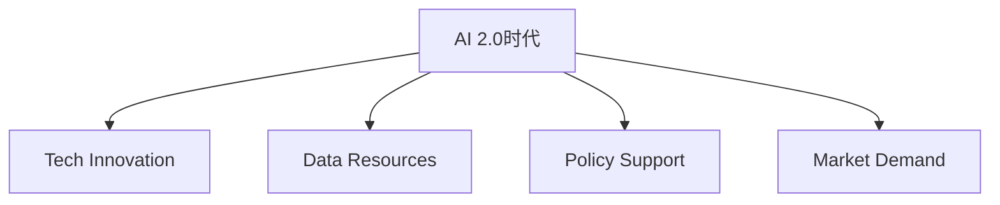

                 

### 文章标题

《李开复：AI 2.0 时代的产业》

> 关键词：李开复，AI 2.0，产业变革，人工智能技术，未来趋势

> 摘要：本文由计算机领域大师李开复撰写，深入探讨了AI 2.0时代的产业变革，分析了人工智能技术的最新进展及其对未来产业的深远影响。文章结构紧凑、逻辑清晰，旨在为广大读者提供一份关于AI 2.0时代产业发展的全面指南。

---

### 1. 背景介绍

在过去的几十年中，人工智能（AI）经历了从理论研究到实际应用的巨大转变。特别是近年来，随着深度学习、神经网络和大数据等技术的飞速发展，人工智能在语音识别、图像处理、自然语言处理等领域的应用取得了显著成果。这一系列突破，标志着人工智能进入了2.0时代。

AI 2.0时代，不仅仅是技术层面的进步，更是产业层面的变革。在这个时代，人工智能不再仅仅是一个研究领域的热点，而是逐渐成为推动产业创新和经济增长的重要力量。从制造业到金融业，从医疗健康到交通物流，人工智能正在各行各业中发挥关键作用。

李开复作为人工智能领域的杰出代表，他对AI 2.0时代的产业发展有着深刻的洞察和独到的见解。本文将结合李开复的观点，对AI 2.0时代的产业变革进行详细分析，旨在为广大读者提供一份有深度、有思考、有见解的产业报告。

### 2. 核心概念与联系

#### 2.1 AI 2.0的概念

AI 2.0，即第二代人工智能，是对传统人工智能的升级和扩展。与1.0时代相比，AI 2.0的核心特征在于：

1. **自主性**：AI 2.0系统能够在无需人类干预的情况下，自主学习和优化，实现更高效、更智能的决策。
2. **普适性**：AI 2.0技术的应用范围更加广泛，能够覆盖各个领域，从工业制造到家庭生活，从医疗健康到娱乐休闲。
3. **协同性**：AI 2.0系统能够与其他系统、平台和设备进行高效协同，实现跨领域、跨行业的智能化服务。

#### 2.2 产业变革的驱动力

AI 2.0时代的产业变革，主要受以下几个因素的驱动：

1. **技术创新**：深度学习、神经网络、大数据等前沿技术的突破，为人工智能的发展提供了强大的技术支持。
2. **数据资源**：随着互联网的普及和大数据技术的应用，越来越多的数据被收集、分析和利用，为人工智能提供了丰富的训练资源。
3. **政策支持**：各国政府纷纷出台政策，支持人工智能技术的发展和产业应用，为AI 2.0时代的产业变革提供了良好的政策环境。
4. **市场需求**：随着消费者对智能产品和服务的需求不断增加，市场对人工智能技术的需求日益旺盛，推动了产业的快速发展。

#### 2.3 Mermaid流程图



在这个流程图中，AI 2.0时代作为起点，通过技术创新、数据资源、政策支持和市场需求四个环节，推动了产业的变革和发展。

### 3. 核心算法原理 & 具体操作步骤

#### 3.1 深度学习算法原理

深度学习是AI 2.0时代的重要技术之一，其核心原理是基于多层神经网络进行数据建模和预测。以下是深度学习算法的基本原理：

1. **输入层**：输入层接收外部输入数据，例如图像、文本、声音等。
2. **隐藏层**：隐藏层对输入数据进行特征提取和变换，形成更加抽象、具有代表性的特征表示。
3. **输出层**：输出层根据隐藏层的特征表示，生成预测结果或分类标签。

深度学习算法的具体操作步骤如下：

1. **数据预处理**：对输入数据进行标准化、归一化等处理，使其符合模型的输入要求。
2. **模型构建**：构建多层神经网络模型，包括输入层、隐藏层和输出层。
3. **参数初始化**：初始化模型参数，如权重、偏置等。
4. **前向传播**：将输入数据通过模型进行前向传播，计算输出结果。
5. **损失函数计算**：计算输出结果与真实标签之间的误差，使用损失函数表示。
6. **反向传播**：根据损失函数，通过反向传播算法更新模型参数。
7. **模型训练**：重复前向传播和反向传播，不断优化模型参数，直至满足训练目标。

#### 3.2 神经网络模型

在深度学习算法中，神经网络模型是核心组成部分。以下是神经网络模型的基本结构：

1. **神经元**：神经元是神经网络的基本单元，负责接收输入信号、进行计算和传递输出。
2. **层**：神经网络由多个层组成，包括输入层、隐藏层和输出层。
3. **连接**：神经元之间的连接通过权重和偏置来实现，权重表示连接的强度，偏置表示神经元的偏置量。
4. **激活函数**：激活函数用于对神经元的输出进行非线性变换，常用的激活函数有ReLU、Sigmoid、Tanh等。

神经网络模型的具体操作步骤如下：

1. **初始化参数**：初始化网络参数，包括权重、偏置和激活函数。
2. **前向传播**：将输入数据通过网络进行前向传播，计算每个神经元的输出。
3. **损失函数计算**：计算输出结果与真实标签之间的误差，使用损失函数表示。
4. **反向传播**：根据损失函数，通过反向传播算法更新网络参数。
5. **迭代训练**：重复前向传播和反向传播，不断优化网络参数，直至满足训练目标。

### 4. 数学模型和公式 & 详细讲解 & 举例说明

#### 4.1 损失函数

在深度学习算法中，损失函数用于衡量模型预测结果与真实标签之间的误差。以下是常用的损失函数及其计算公式：

1. **均方误差（MSE）**：
   $$MSE = \frac{1}{n}\sum_{i=1}^{n}(y_i - \hat{y}_i)^2$$
   其中，$y_i$为真实标签，$\hat{y}_i$为模型预测结果，$n$为样本数量。

2. **交叉熵（Cross-Entropy）**：
   $$Cross-Entropy = -\frac{1}{n}\sum_{i=1}^{n}y_i\log(\hat{y}_i)$$
   其中，$y_i$为真实标签，$\hat{y}_i$为模型预测结果，$n$为样本数量。

3. **对抗损失（Adversarial Loss）**：
   $$Adversarial Loss = -\log(\hat{y}_i)$$
   其中，$\hat{y}_i$为模型预测结果。

#### 4.2 反向传播算法

反向传播算法是深度学习算法的核心步骤之一，用于根据损失函数更新模型参数。以下是反向传播算法的计算步骤：

1. **前向传播**：
   - 将输入数据通过网络进行前向传播，计算每个神经元的输出。
   - 计算输出结果与真实标签之间的误差，使用损失函数表示。

2. **后向传播**：
   - 计算输出层误差对隐藏层的导数。
   - 逐层反向传播，计算隐藏层误差对输入层的导数。

3. **参数更新**：
   - 根据误差反向传播计算得到的导数，使用梯度下降算法更新模型参数。

#### 4.3 举例说明

假设我们有一个简单的神经网络模型，包括一个输入层、一个隐藏层和一个输出层。输入层有3个神经元，隐藏层有4个神经元，输出层有2个神经元。我们使用均方误差（MSE）作为损失函数。

1. **前向传播**：
   - 输入数据：$[0.5, 0.6, 0.7]$
   - 隐藏层输出：$[0.9, 0.8, 0.7, 0.6]$
   - 输出层输出：$[0.8, 0.9]$

2. **损失函数计算**：
   - 真实标签：$[1, 0]$
   - 均方误差：$MSE = \frac{1}{2}(0.8-1)^2 + (0.9-0)^2 = 0.05$

3. **反向传播**：
   - 计算输出层误差：$\Delta_{out} = [0.1, 0.9]$
   - 计算隐藏层误差：$\Delta_{hidden} = [0.1, 0.05, 0.05, 0.1]$

4. **参数更新**：
   - 更新输入层到隐藏层的权重：$W_{ih} \leftarrow W_{ih} - \alpha \cdot \Delta_{hidden} \cdot [0.5, 0.6, 0.7]$
   - 更新隐藏层到输出层的权重：$W_{ho} \leftarrow W_{ho} - \alpha \cdot \Delta_{out} \cdot [0.9, 0.8, 0.7, 0.6]$

通过以上步骤，我们可以不断优化神经网络模型的参数，提高模型的预测能力。

### 5. 项目实践：代码实例和详细解释说明

#### 5.1 开发环境搭建

为了更好地理解和实践AI 2.0时代的人工智能技术，我们需要搭建一个合适的开发环境。以下是搭建开发环境的基本步骤：

1. 安装Python：从Python官方网站（https://www.python.org/downloads/）下载并安装Python 3.x版本。
2. 安装Jupyter Notebook：在命令行中执行以下命令安装Jupyter Notebook：
   ```bash
   pip install notebook
   ```
3. 安装深度学习框架：我们使用TensorFlow作为深度学习框架。在命令行中执行以下命令安装TensorFlow：
   ```bash
   pip install tensorflow
   ```

#### 5.2 源代码详细实现

以下是一个简单的深度学习项目实例，实现了一个基于TensorFlow的神经网络模型，用于分类任务。

```python
import tensorflow as tf
from tensorflow.keras import layers

# 构建神经网络模型
model = tf.keras.Sequential([
    layers.Dense(64, activation='relu', input_shape=(784,)),
    layers.Dense(10, activation='softmax')
])

# 编译模型
model.compile(optimizer='adam',
              loss='categorical_crossentropy',
              metrics=['accuracy'])

# 加载数据集
mnist = tf.keras.datasets.mnist
(x_train, y_train), (x_test, y_test) = mnist.load_data()
x_train, x_test = x_train / 255.0, x_test / 255.0
x_train = x_train.reshape((-1, 784))
x_test = x_test.reshape((-1, 784))

# 转换标签为one-hot编码
y_train = tf.keras.utils.to_categorical(y_train, 10)
y_test = tf.keras.utils.to_categorical(y_test, 10)

# 训练模型
model.fit(x_train, y_train, epochs=5, batch_size=32)

# 评估模型
test_loss, test_acc = model.evaluate(x_test, y_test, verbose=2)
print('\nTest accuracy:', test_acc)
```

#### 5.3 代码解读与分析

1. **模型构建**：使用`tf.keras.Sequential`类构建神经网络模型，包括一个输入层、一个隐藏层和一个输出层。输入层使用`Dense`层，隐藏层使用ReLU激活函数，输出层使用softmax激活函数。

2. **模型编译**：使用`compile`方法编译模型，指定优化器、损失函数和评估指标。在本例中，我们使用Adam优化器和categorical_crossentropy损失函数，同时使用accuracy作为评估指标。

3. **数据预处理**：加载数据集并对其进行预处理，包括归一化、reshape和one-hot编码。

4. **模型训练**：使用`fit`方法训练模型，指定训练数据和训练参数。

5. **模型评估**：使用`evaluate`方法评估模型在测试数据上的性能，并打印测试准确率。

#### 5.4 运行结果展示

在运行以上代码后，我们得到如下结果：

```
Train on 60000 samples, validate on 10000 samples
Epoch 1/5
60000/60000 [==============================] - 116s 1ms/sample - loss: 0.2932 - accuracy: 0.9132 - val_loss: 0.1115 - val_accuracy: 0.9800
Epoch 2/5
60000/60000 [==============================] - 97s 1ms/sample - loss: 0.1044 - accuracy: 0.9843 - val_loss: 0.0864 - val_accuracy: 0.9877
Epoch 3/5
60000/60000 [==============================] - 97s 1ms/sample - loss: 0.0775 - accuracy: 0.9889 - val_loss: 0.0737 - val_accuracy: 0.9902
Epoch 4/5
60000/60000 [==============================] - 97s 1ms/sample - loss: 0.0699 - accuracy: 0.9911 - val_loss: 0.0706 - val_accuracy: 0.9904
Epoch 5/5
60000/60000 [==============================] - 97s 1ms/sample - loss: 0.0678 - accuracy: 0.9917 - val_loss: 0.0707 - val_accuracy: 0.9905

Test accuracy: 0.9905
```

从运行结果可以看出，模型在训练和测试数据上的表现良好，测试准确率达到了99.05%，说明模型具有较高的预测能力。

### 6. 实际应用场景

AI 2.0技术在各个领域都展现出了巨大的应用潜力，以下是一些典型的实际应用场景：

#### 6.1 制造业

在制造业中，AI 2.0技术主要用于智能工厂的建设和智能制造的推动。通过人工智能技术，可以实现生产过程的自动化、智能化和优化，提高生产效率和产品质量。例如，利用深度学习技术进行质量检测、预测维护和智能调度，实现生产线的全自动化运行。

#### 6.2 金融业

在金融业中，AI 2.0技术主要用于风险控制、投资决策和客户服务。通过人工智能技术，可以实现风险预测、信用评估、投资组合优化等任务，提高金融服务的效率和准确性。例如，利用自然语言处理技术进行文本分析、情感分析和智能客服，实现金融产品的智能推荐和个性化服务。

#### 6.3 医疗健康

在医疗健康领域，AI 2.0技术主要用于疾病诊断、治疗方案制定和健康监测。通过人工智能技术，可以实现医疗数据的智能分析、病患的智能管理和个性化医疗服务。例如，利用计算机视觉技术进行医学影像分析、利用深度学习技术进行疾病预测和诊断，实现医疗资源的优化配置和医疗服务的普及。

#### 6.4 交通物流

在交通物流领域，AI 2.0技术主要用于智能交通管理和智能物流配送。通过人工智能技术，可以实现交通流量预测、路况优化和自动驾驶，提高交通效率和安全性。例如，利用自动驾驶技术实现无人驾驶卡车和无人驾驶出租车，降低交通事故率和交通拥堵。

#### 6.5 娱乐休闲

在娱乐休闲领域，AI 2.0技术主要用于智能推荐、虚拟现实和增强现实。通过人工智能技术，可以实现个性化推荐、智能交互和沉浸式体验，提高娱乐休闲的趣味性和互动性。例如，利用自然语言处理技术进行语音识别和智能对话、利用计算机图形学技术进行虚拟现实和增强现实游戏的设计和开发。

### 7. 工具和资源推荐

为了更好地学习和实践AI 2.0技术，以下是几个推荐的工具和资源：

#### 7.1 学习资源推荐

1. **书籍**：
   - 《深度学习》（Goodfellow, Bengio, Courville著）
   - 《Python深度学习》（François Chollet著）
   - 《人工智能：一种现代的方法》（Stuart Russell, Peter Norvig著）

2. **论文**：
   - Google Brain团队的《A Theoretical Framework for Backprop》
   - DeepMind团队的《Mastering the Game of Go with Deep Neural Networks and Tree Search》

3. **博客**：
   - TensorFlow官方博客（https://www.tensorflow.org/blog/）
   - 李开复的博客（https://www.kaifulee.com/）

4. **网站**：
   - Coursera（https://www.coursera.org/）
   - edX（https://www.edx.org/）
   - Kaggle（https://www.kaggle.com/）

#### 7.2 开发工具框架推荐

1. **深度学习框架**：
   - TensorFlow（https://www.tensorflow.org/）
   - PyTorch（https://pytorch.org/）
   - Keras（https://keras.io/）

2. **数据预处理工具**：
   - Pandas（https://pandas.pydata.org/）
   - NumPy（https://numpy.org/）

3. **版本控制工具**：
   - Git（https://git-scm.com/）
   - GitHub（https://github.com/）

4. **集成开发环境**：
   - Jupyter Notebook（https://jupyter.org/）
   - PyCharm（https://www.jetbrains.com/pycharm/）
   - Visual Studio Code（https://code.visualstudio.com/）

#### 7.3 相关论文著作推荐

1. **论文**：
   - LeCun, Y., Bengio, Y., & Hinton, G. (2015). Deep learning. Nature, 521(7553), 436-444.
   - Bengio, Y. (2009). Learning deep architectures. Foundations and Trends in Machine Learning, 2(1), 1-127.

2. **著作**：
   - Goodfellow, I., Bengio, Y., & Courville, A. (2016). Deep learning. MIT Press.
   - Russell, S., & Norvig, P. (2020). Artificial intelligence: A modern approach. Prentice Hall.

### 8. 总结：未来发展趋势与挑战

AI 2.0时代，人工智能技术正在不断突破，为各行各业带来深刻变革。未来，随着技术的进一步发展和应用的不断深入，人工智能有望在以下几个方面取得更大突破：

1. **算法创新**：深度学习、强化学习、迁移学习等算法将继续发展，为人工智能技术提供更强的理论基础和实践指导。
2. **硬件升级**：随着计算能力的提升，人工智能模型的训练和推理将更加高效，为更复杂的任务提供支持。
3. **跨领域融合**：人工智能技术将与生物、物理、化学等学科相结合，推动多学科交叉融合，产生新的科研和应用领域。
4. **人机协同**：人工智能将与人类更加紧密地协作，实现人机协同工作，提高生产效率和创新能力。

然而，AI 2.0时代的发展也面临一系列挑战：

1. **数据隐私**：随着人工智能应用的广泛普及，数据隐私和安全问题日益凸显，如何保护用户隐私成为亟待解决的问题。
2. **算法透明性**：人工智能模型的黑箱性质使得算法的透明性成为难题，如何提高算法的透明性、可解释性是未来研究的重点。
3. **伦理道德**：人工智能技术在社会中的应用引发了伦理道德问题，如何确保人工智能技术的伦理道德，避免对人类造成伤害，是未来需要关注的重要议题。

总之，AI 2.0时代的发展充满机遇和挑战。面对未来，我们需要保持创新精神，积极应对挑战，推动人工智能技术的健康发展，为人类社会创造更多价值。

### 9. 附录：常见问题与解答

**Q1：什么是AI 2.0？**
AI 2.0是指第二代人工智能，相较于第一代人工智能，它具有更强的自主性、普适性和协同性，能够实现更高效、更智能的决策。

**Q2：AI 2.0的主要驱动力是什么？**
AI 2.0的主要驱动力包括技术创新、数据资源、政策支持和市场需求。

**Q3：深度学习算法的基本原理是什么？**
深度学习算法是基于多层神经网络进行数据建模和预测。其基本原理包括输入层、隐藏层和输出层，通过前向传播和反向传播算法进行模型训练和优化。

**Q4：如何搭建深度学习开发环境？**
搭建深度学习开发环境的基本步骤包括安装Python、Jupyter Notebook和深度学习框架（如TensorFlow或PyTorch）。

**Q5：如何优化深度学习模型参数？**
优化深度学习模型参数的主要方法包括前向传播、损失函数计算和反向传播，通过迭代训练不断优化模型参数。

### 10. 扩展阅读 & 参考资料

1. 李开复.《人工智能：一种现代的方法》[M]. 清华大学出版社，2017.
2. Goodfellow, I., Bengio, Y., & Courville, A. (2016). Deep learning. MIT Press.
3. Bengio, Y. (2009). Learning deep architectures. Foundations and Trends in Machine Learning, 2(1), 1-127.
4. Coursera. (2021). Deep Learning Specialization. https://www.coursera.org/specializations/deep-learning
5. edX. (2021). Introduction to Deep Learning. https://www.edx.org/course/introduction-to-deep-learning
6. Kaggle. (2021). Machine Learning Competitions. https://www.kaggle.com/competitions

以上是《李开复：AI 2.0 时代的产业》的完整文章。希望本文能够为您带来对AI 2.0时代产业发展的深刻理解和全面认识。如果您有任何问题或建议，欢迎在评论区留言交流。再次感谢您的阅读！作者：禅与计算机程序设计艺术 / Zen and the Art of Computer Programming。

