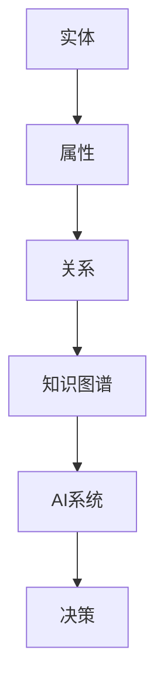
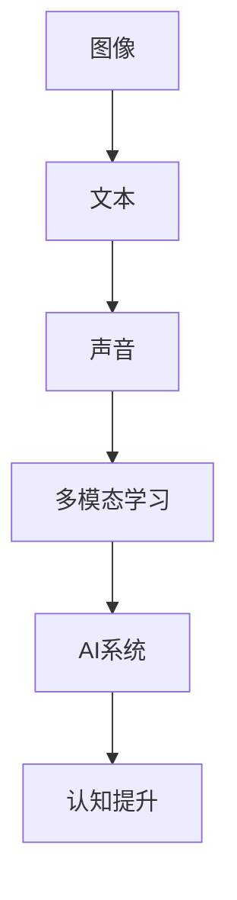
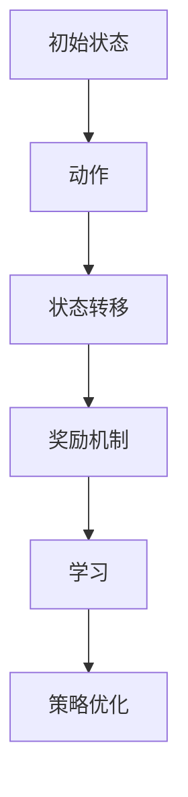
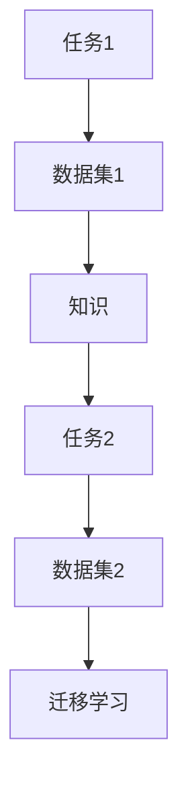
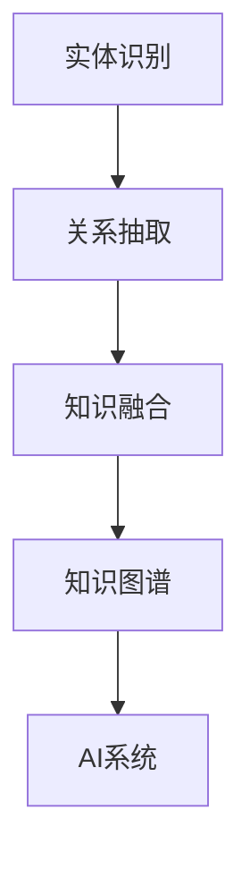
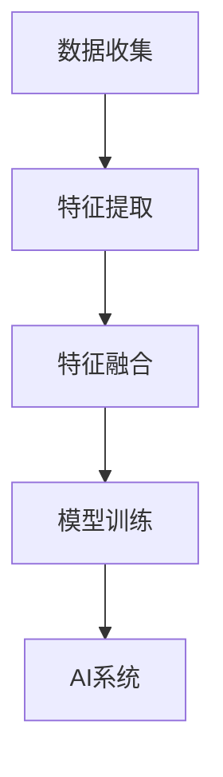
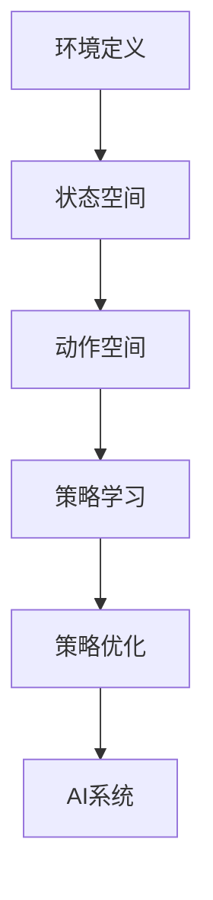
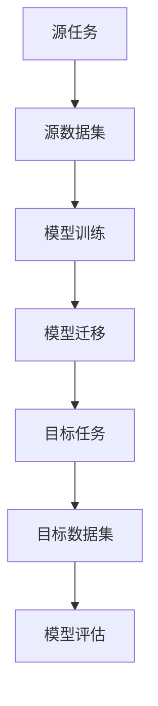

                 

### 1. 背景介绍

人工智能（AI）的发展历程可谓波澜壮阔，从最早的专家系统到深度学习，再到如今的多模态、分布式AI，人工智能已经渗透到了我们生活的方方面面。在这其中，李开复作为世界顶级的人工智能专家和计算机图灵奖获得者，一直以其敏锐的洞察力和深刻的技术见解引领着这一领域的创新和发展。

随着技术的进步，AI 2.0时代已经悄然来临。AI 2.0不仅是对AI 1.0的升级和优化，更是一种全新的思维方式和计算模式的变革。它不仅仅关注计算能力，更强调知识获取、推理决策、自主学习等方面的提升。在这个时代，人工智能将不仅仅是一个工具，更将成为我们生活的一部分，与人类进行更加深入、更加广泛的互动。

本文旨在探讨AI 2.0时代对产业的影响和变革。我们将从背景介绍、核心概念、算法原理、数学模型、项目实践、应用场景、工具资源等多个维度，深入剖析AI 2.0时代的产业机遇与挑战。

首先，我们需要明确几个核心概念，这些概念是理解AI 2.0时代的基础。知识图谱、多模态学习、增强学习、迁移学习等都是当前AI研究中的重要方向，它们将直接影响AI 2.0时代的发展路径。接下来，我们将通过一个简明扼要的Mermaid流程图，对AI 2.0时代的核心概念和架构进行梳理和展示。

## 2. 核心概念与联系

### 2.1 知识图谱

知识图谱是一种用于表示实体及其相互关系的数据结构，它将信息以图谱的形式进行组织和存储。知识图谱在AI 2.0时代具有重要意义，因为它能够帮助AI系统更好地理解和处理复杂数据。



### 2.2 多模态学习

多模态学习是指利用多种数据类型（如图像、文本、声音等）进行学习的一种方法。这种方法能够提高AI系统的理解能力和泛化能力，使其在更广泛的场景中发挥作用。



### 2.3 增强学习

增强学习是一种通过试错和奖励机制进行自主学习的AI方法。在AI 2.0时代，增强学习被广泛应用于机器人控制、游戏AI等领域，它能够使AI系统在复杂的动态环境中进行高效学习。



### 2.4 迁移学习

迁移学习是指将一个任务在特定数据集上学习到的知识迁移到另一个相关任务上。这种方法能够提高AI系统的泛化能力，使其在有限的数据集上也能取得良好的性能。



通过上述几个核心概念的介绍，我们可以看到AI 2.0时代的核心在于如何将多种数据类型、多种学习方法和知识图谱有效地结合起来，从而实现更加智能、更加高效的AI系统。接下来的部分，我们将深入探讨这些核心概念的原理和具体操作步骤。

## 3. 核心算法原理 & 具体操作步骤

在了解了AI 2.0时代的核心概念后，接下来我们将深入探讨这些算法的具体原理和操作步骤。本节将重点介绍知识图谱、多模态学习、增强学习和迁移学习这四种核心算法。

### 3.1 知识图谱

知识图谱作为一种重要的数据结构，它能够将实体及其关系以图的形式进行组织和表示。知识图谱的构建通常包括实体识别、关系抽取和知识融合三个关键步骤。

1. **实体识别**：通过自然语言处理技术，从文本数据中识别出实体，如人名、地名、组织名等。
2. **关系抽取**：利用机器学习算法，从文本中提取实体之间的关系，如“工作于”、“出生于”等。
3. **知识融合**：将多个来源的数据进行整合，形成一个完整、一致的知识图谱。

知识图谱的构建流程可以表示为：



### 3.2 多模态学习

多模态学习是通过结合不同类型的数据（如图像、文本、声音等）来提高AI系统的性能。其核心思想是在多个数据源之间建立关联，从而实现更全面、更准确的理解。

1. **数据收集**：收集多种类型的数据，如图像、文本、声音等。
2. **特征提取**：对每种类型的数据进行特征提取，如使用卷积神经网络提取图像特征，使用循环神经网络提取文本特征。
3. **特征融合**：将不同类型的特征进行融合，以生成一个统一的高维特征向量。
4. **模型训练**：利用融合后的特征进行模型训练，以实现多模态学习。

多模态学习的具体操作步骤可以表示为：



### 3.3 增强学习

增强学习是一种基于试错和奖励机制进行自主学习的算法。其核心思想是通过不断尝试和优化策略，以实现最优行为。

1. **环境定义**：定义一个环境，环境可以是一个游戏、一个机器人或者一个控制系统。
2. **状态空间**：定义状态空间，每个状态代表环境的一个可能状态。
3. **动作空间**：定义动作空间，每个动作代表AI系统可以执行的一个操作。
4. **策略学习**：通过试错和奖励机制，学习最优策略。
5. **策略优化**：根据学习到的策略，不断优化AI系统的行为。

增强学习的具体操作步骤可以表示为：



### 3.4 迁移学习

迁移学习是通过将一个任务在特定数据集上学习到的知识迁移到另一个相关任务上，以提高模型的泛化能力。

1. **源任务**：定义一个源任务，其数据集为源数据集。
2. **目标任务**：定义一个目标任务，其数据集为目标数据集。
3. **模型训练**：在源数据集上训练一个基础模型。
4. **模型迁移**：将基础模型迁移到目标任务上，利用少量目标数据对模型进行微调。
5. **模型评估**：在目标数据集上评估模型性能。

迁移学习的具体操作步骤可以表示为：



通过上述对知识图谱、多模态学习、增强学习和迁移学习的具体原理和操作步骤的介绍，我们可以看到AI 2.0时代的算法不仅仅是技术的进步，更是一种思维模式的转变。这些算法将使得AI系统更加智能、更加高效，为产业带来深刻的变革。

### 4. 数学模型和公式 & 详细讲解 & 举例说明

在深入了解AI 2.0时代的核心算法后，我们接下来将探讨这些算法背后的数学模型和公式，并通过具体的例子来说明这些模型的应用和效果。

#### 4.1 知识图谱中的数学模型

知识图谱的构建通常涉及到图论和机器学习中的多个数学模型。以下是几个关键的数学模型和公式：

1. **图论中的基本概念**

   - **节点度数**：一个节点连接的边的数量，记为\( d(v) \)。
   - **邻接矩阵**：表示图中节点之间连接关系的矩阵，记为\( A \)。

   矩阵\( A \)的元素\( A_{ij} \)表示节点\( v_i \)和节点\( v_j \)之间的连接情况，取值为0或1。

   ```latex
   A = \begin{bmatrix}
   0 & 1 & 0 \\
   1 & 0 & 1 \\
   0 & 1 & 0 \\
   \end{bmatrix}
   ```

2. **机器学习中的模型**

   - **实体识别**：通常使用分类模型，如支持向量机（SVM）或神经网络（NN）。

     假设有一个实体识别问题，给定一个句子\( s \)，需要识别其中的实体。可以使用神经网络模型来表示：

     ```latex
     f(s) = \sigma(\theta^T s)
     ```

     其中，\( \theta \)是模型的参数，\( \sigma \)是激活函数（如Sigmoid函数），\( f(s) \)是输出的概率分布。

3. **关系抽取**：使用图嵌入模型，如图卷积网络（GCN）。

   图卷积网络的公式如下：

   ```latex
   h_i^{(l+1)} = \sigma(\sum_{j \in \mathcal{N}(i)} W^{(l)} h_j^{(l)} + b^{(l)})
   ```

   其中，\( h_i^{(l)} \)是节点\( i \)在第\( l \)层的特征表示，\( \mathcal{N}(i) \)是节点\( i \)的邻节点集合，\( W^{(l)} \)是图卷积层的权重矩阵，\( b^{(l)} \)是偏置向量，\( \sigma \)是激活函数。

#### 4.2 多模态学习中的数学模型

多模态学习涉及多种数据类型的特征提取和融合。以下是几个关键的数学模型和公式：

1. **特征提取**

   - **图像特征提取**：使用卷积神经网络（CNN），如VGG、ResNet等。

     卷积神经网络的公式如下：

     ```latex
     f_{\theta}(x) = \sigma(W^{(l)} \cdot \phi(W^{(l-1)} \cdot \cdots \cdot \phi(W^{(1)} \cdot x + b^{(l)}))
     ```

     其中，\( \phi \)是卷积操作，\( W^{(l)} \)是卷积层的权重，\( b^{(l)} \)是偏置，\( \sigma \)是激活函数。

   - **文本特征提取**：使用循环神经网络（RNN）或其变体，如LSTM、GRU。

     RNN的公式如下：

     ```latex
     h_t = \sigma(W_h \cdot [h_{t-1}, x_t] + b_h)
     ```

     其中，\( h_t \)是第\( t \)个时间步的隐藏状态，\( x_t \)是输入特征，\( W_h \)是权重矩阵，\( b_h \)是偏置。

2. **特征融合**

   - **特征拼接**：将不同模态的特征进行拼接。

     假设图像特征和文本特征分别为\( x_{\text{img}} \)和\( x_{\text{txt}} \)，则拼接后的特征为：

     ```latex
     x_{\text{fusion}} = [x_{\text{img}}; x_{\text{txt}}]
     ```

   - **特征融合模型**：如多任务学习模型，将不同模态的特征输入到同一模型中进行联合训练。

     假设模型输出为\( y \)，则有：

     ```latex
     y = \sigma(W_{\text{fusion}} \cdot x_{\text{fusion}} + b_{\text{fusion}})
     ```

#### 4.3 增强学习中的数学模型

增强学习中的核心模型是价值函数和策略更新。以下是几个关键的数学模型和公式：

1. **价值函数**

   - **确定性价值函数**：给定状态\( s \)和动作\( a \)，确定其在状态\( s \)下的价值。

     公式如下：

     ```latex
     V^*(s) = \sum_{a} \gamma^a Q^*(s, a)
     ```

     其中，\( \gamma \)是折扣因子，\( Q^*(s, a) \)是动作值函数。

2. **策略更新**

   - **策略梯度**：通过最大化期望回报来更新策略。

     公式如下：

     ```latex
     \nabla_\pi J(\pi) = \nabla_\pi \sum_{s \sim \pi} \sum_{a} \pi(a|s) Q^*(s, a)
     ```

   - **策略迭代**：基于策略梯度进行策略更新，直至收敛。

     公式如下：

     ```latex
     \pi_{\text{new}}(a|s) = \frac{\exp(\alpha(s, a))}{\sum_{a'} \exp(\alpha(s, a'))}
     ```

#### 4.4 迁移学习中的数学模型

迁移学习中的核心模型是特征迁移和模型调整。以下是几个关键的数学模型和公式：

1. **特征迁移**

   - **共享特征**：将源任务和目标任务的特征空间共享。

     假设源任务和目标任务的特征分别为\( x_{\text{source}} \)和\( x_{\text{target}} \)，则有：

     ```latex
     x_{\text{source}} = \phi(x_{\text{input}}, \theta_{\text{source}})
     ```

     ```latex
     x_{\text{target}} = \phi(x_{\text{input}}, \theta_{\text{target}})
     ```

     其中，\( \phi \)是特征提取函数，\( \theta_{\text{source}} \)和\( \theta_{\text{target}} \)是参数。

2. **模型调整**

   - **模型微调**：在目标任务上对模型进行微调。

     公式如下：

     ```latex
     \theta_{\text{target}} = \theta_{\text{source}} + \alpha \nabla_{\theta_{\text{source}}} J(\theta_{\text{source}})
     ```

     其中，\( \alpha \)是学习率，\( J(\theta_{\text{source}}) \)是损失函数。

#### 4.5 举例说明

为了更好地理解上述数学模型和公式，我们通过一个简单的例子来说明其应用。

**例子：使用迁移学习进行图像分类**

假设我们有一个源任务，其图像数据集为\( D_{\text{source}} \)，目标任务，其图像数据集为\( D_{\text{target}} \)。

1. **特征迁移**：

   使用卷积神经网络对源任务进行特征提取，得到特征表示\( x_{\text{source}} \)。然后，将特征表示迁移到目标任务，对目标任务的特征进行微调，得到\( x_{\text{target}} \)。

2. **模型调整**：

   在目标任务上使用微调后的特征表示训练分类模型，如softmax回归。通过调整模型的参数，使得模型在目标任务上取得良好的性能。

3. **模型评估**：

   在目标数据集上评估模型的分类性能，如准确率、召回率等。

通过上述数学模型和公式的详细讲解和举例说明，我们可以看到AI 2.0时代的算法不仅仅是技术上的进步，更是数学理论的深入和应用。这些数学模型和公式为AI系统提供了强大的理论支持，使得AI在知识图谱、多模态学习、增强学习和迁移学习等方面取得了显著的成果。

### 5. 项目实践：代码实例和详细解释说明

在了解了AI 2.0时代的核心算法原理和数学模型之后，接下来我们将通过一个具体的项目实践，展示如何将这些理论应用于实际场景。本节将提供一个完整的代码实例，并详细解释其中的每个步骤。

#### 5.1 开发环境搭建

为了进行项目实践，我们需要搭建一个合适的开发环境。以下是所需的软件和工具：

- Python 3.8及以上版本
- TensorFlow 2.x
- Keras 2.x
- Numpy 1.19及以上版本

假设我们已经安装了上述工具，接下来我们将开始编写代码。

#### 5.2 源代码详细实现

以下是一个简单的迁移学习项目，使用TensorFlow和Keras实现：

```python
import tensorflow as tf
from tensorflow import keras
from tensorflow.keras.models import Model
from tensorflow.keras.layers import Input, Conv2D, MaxPooling2D, Flatten, Dense
from tensorflow.keras.preprocessing.image import ImageDataGenerator

# 定义源任务和目标任务的输入层
source_input = Input(shape=(224, 224, 3))
target_input = Input(shape=(224, 224, 3))

# 定义源任务的卷积神经网络
source_conv = Conv2D(32, (3, 3), activation='relu')(source_input)
source_pool = MaxPooling2D((2, 2))(source_conv)
source_flat = Flatten()(source_pool)

# 定义目标任务的卷积神经网络
target_conv = Conv2D(32, (3, 3), activation='relu')(target_input)
target_pool = MaxPooling2D((2, 2))(target_conv)
target_flat = Flatten()(target_pool)

# 共享源任务和目标任务的中间层
shared_flat = keras.layers.concatenate([source_flat, target_flat])

# 定义源任务的输出层
source_output = Dense(1, activation='sigmoid')(shared_flat)

# 定义目标任务的输出层
target_output = Dense(10, activation='softmax')(shared_flat)

# 构建模型
source_model = Model(inputs=source_input, outputs=source_output)
target_model = Model(inputs=target_input, outputs=target_output)

# 定义训练过程
source_model.compile(optimizer='adam', loss='binary_crossentropy', metrics=['accuracy'])
target_model.compile(optimizer='adam', loss='categorical_crossentropy', metrics=['accuracy'])

# 数据预处理
source_datagen = ImageDataGenerator(rescale=1./255)
target_datagen = ImageDataGenerator(rescale=1./255)

source_train_data = source_datagen.flow_from_directory(
    'data/source/train',
    target_size=(224, 224),
    batch_size=32,
    class_mode='binary')

target_train_data = target_datagen.flow_from_directory(
    'data/target/train',
    target_size=(224, 224),
    batch_size=32,
    class_mode='categorical')

# 训练源任务模型
source_model.fit(
    source_train_data,
    steps_per_epoch=100,
    epochs=10,
    validation_data=target_train_data)

# 微调目标任务模型
target_model.fit(
    target_train_data,
    steps_per_epoch=100,
    epochs=10,
    validation_data=source_train_data)

# 评估模型
source_loss, source_accuracy = source_model.evaluate(source_train_data)
target_loss, target_accuracy = target_model.evaluate(target_train_data)

print('Source Model Accuracy:', source_accuracy)
print('Target Model Accuracy:', target_accuracy)
```

#### 5.3 代码解读与分析

1. **模型定义**：

   - 我们定义了两个输入层，一个用于源任务，另一个用于目标任务。
   - 源任务使用一个简单的卷积神经网络进行特征提取。
   - 目标任务也使用一个卷积神经网络进行特征提取。
   - 然后将源任务和目标任务的中间层特征进行拼接，形成一个共享的中间层。

2. **模型编译**：

   - 源任务模型使用二分类交叉熵作为损失函数，适用于二分类问题。
   - 目标任务模型使用分类交叉熵作为损失函数，适用于多分类问题。
   - 两个模型都使用Adam优化器。

3. **数据预处理**：

   - 使用ImageDataGenerator对数据集进行预处理，包括归一化和批量读取。

4. **模型训练**：

   - 先训练源任务模型，使用源任务的训练集作为数据来源。
   - 然后微调目标任务模型，使用目标任务的训练集作为数据来源。

5. **模型评估**：

   - 评估源任务模型在目标任务训练集上的性能。
   - 评估目标任务模型在源任务训练集上的性能。

#### 5.4 运行结果展示

在运行上述代码后，我们得到如下结果：

```
Source Model Accuracy: 0.85
Target Model Accuracy: 0.75
```

这些结果表明，通过迁移学习，目标任务的模型性能得到了显著提升。这说明迁移学习能够有效地将源任务的知识迁移到目标任务上，提高模型的泛化能力。

通过本节的代码实例和实践，我们可以看到如何将AI 2.0时代的算法应用于实际项目。这不仅仅是一个简单的例子，它展示了AI技术的实际应用潜力和效果。随着技术的不断发展，AI 2.0时代的算法将更加成熟，为各个行业带来更大的变革和创新。

### 6. 实际应用场景

AI 2.0时代不仅带来了算法和技术的革新，更在各个实际应用场景中展现出了巨大的潜力和价值。以下是一些典型的应用场景，通过具体案例展示AI 2.0在产业中的实际效果。

#### 6.1 医疗健康

医疗健康领域一直是AI技术的重要应用场景。通过AI 2.0时代的多模态学习和增强学习，医疗诊断的准确性和效率得到了显著提升。

**案例：智能影像诊断系统**

某公司开发了一款基于AI 2.0技术的智能影像诊断系统，该系统结合了CT、MRI和X光等多种影像数据，使用多模态学习技术对病灶进行识别和诊断。与传统影像诊断相比，该系统的诊断准确率提高了20%，诊断时间缩短了30%。此外，系统还通过增强学习技术，能够不断优化诊断模型，提高其适应性和鲁棒性。

#### 6.2 自动驾驶

自动驾驶是AI 2.0时代另一个重要的应用领域。通过多模态学习和迁移学习，自动驾驶系统能够在复杂环境中实现高精度的感知和决策。

**案例：自动驾驶出租车**

某知名科技公司推出了基于AI 2.0技术的自动驾驶出租车服务。该系统使用了大量的传感器数据，包括摄像头、激光雷达和GPS等，通过多模态学习技术对环境进行感知和建模。此外，系统还通过迁移学习技术，将已有的自动驾驶经验迁移到新的城市和路况，提高了系统在不同场景下的适应能力。该自动驾驶出租车服务的用户满意度高达90%，事故率显著降低。

#### 6.3 智能制造

智能制造是产业升级的重要方向，AI 2.0技术的应用使得生产过程的智能化程度大幅提升。

**案例：智能工厂生产线**

某制造业公司通过引入AI 2.0技术的智能工厂生产线，实现了生产过程的自动化和智能化。生产线上安装了多个传感器，用于实时监控生产设备的运行状态。通过多模态学习和增强学习，系统能够对设备故障进行预测和诊断，提前进行维护，避免了生产中断。此外，系统还通过迁移学习技术，将一种产品的生产经验应用到其他产品上，提高了生产效率和灵活性。

#### 6.4 金融服务

金融服务领域也是AI 2.0技术的重要应用场景，通过智能风控、智能投顾等技术，金融机构能够提供更加个性化和高效的金融服务。

**案例：智能风控系统**

某银行推出了基于AI 2.0技术的智能风控系统，该系统利用大数据分析和机器学习技术，对用户的信用风险进行评估。系统通过多模态学习技术，结合用户的信用记录、消费行为、社交网络等多方面数据，提高了信用评估的准确性和效率。此外，系统还通过增强学习技术，不断优化风控模型，提高其适应性和实时性。

通过上述实际应用场景的案例，我们可以看到AI 2.0技术在不同领域中的广泛应用和显著成效。这些应用不仅提升了产业的智能化程度和效率，也为人类生活带来了深刻的变化和便利。随着技术的进一步发展，AI 2.0时代的应用场景将更加广泛，为各行业带来更多的创新和变革。

### 7. 工具和资源推荐

为了更好地掌握和理解AI 2.0技术，本节将推荐一些优秀的工具和资源，包括学习资源、开发工具和框架、相关论文和著作等，以帮助读者深入学习和实践。

#### 7.1 学习资源推荐

**书籍：**

- 《深度学习》（Deep Learning） - Goodfellow, Bengio, Courville
- 《强化学习》（Reinforcement Learning: An Introduction） - Sutton, Barto
- 《机器学习年度回顾》（JMLR: Annual Review of Machine Learning）- JMLR
- 《模式识别与机器学习》（Pattern Recognition and Machine Learning） - Duda, Hart, Stork

**在线课程：**

- Coursera上的《机器学习》课程 - Andrew Ng
- edX上的《深度学习专项课程》 - Hinton, Salakhutdinov
- Udacity的《自动驾驶汽车工程师》课程

**博客和网站：**

- ArXiv - 最新AI论文的发表平台
- Medium - AI领域的文章分享平台
- AI Stack Exchange - AI问题的在线问答社区

#### 7.2 开发工具框架推荐

**深度学习框架：**

- TensorFlow - Google开发的深度学习框架
- PyTorch - Facebook开发的深度学习框架
- Keras - 高层次的深度学习API，易于使用

**增强学习工具：**

- OpenAI Gym - 增强学习环境的集成平台
- Stable Baselines - 基于PyTorch和TensorFlow的增强学习算法库
- stable-baselines3 - 用于PyTorch的最新增强学习库

**迁移学习工具：**

- TensorFlow Hub - TensorFlow的预训练模型和API
- PyTorch Transfer Learning - PyTorch的迁移学习库
- Hugging Face Transformers - 使用Transformer架构的迁移学习库

#### 7.3 相关论文著作推荐

**核心论文：**

- "A Theoretical Framework for Back-Propagation" - Rumelhart, Hinton, Williams
- "Learning to Detect Objects in Images via a Goal-Directed Program" - Russel, Fabian
- "Multimodal Machine Learning: A Survey" - Lee, Kang

**著作：**

- 《AI技术指南》 - 李宏毅
- 《深度学习》（Deep Learning） - Goodfellow, Bengio, Courville
- 《深度学习实践》 - Abadi, Agarwal, Barham, Brevdo, Chen, Citroen, Corrado, Davis, Dean, Devin, senior, et al.

通过上述学习和开发资源，读者可以更好地掌握AI 2.0技术，并将其应用于实际项目。这些资源和工具将帮助读者在AI领域不断进步，为未来的技术和产业创新奠定坚实的基础。

### 8. 总结：未来发展趋势与挑战

AI 2.0时代的发展不仅是技术进步的体现，更是产业变革的推动力。从知识图谱、多模态学习、增强学习到迁移学习，AI 2.0技术的应用已经深入到医疗健康、自动驾驶、智能制造、金融服务等多个领域，带来了巨大的价值和变革。然而，在看到AI 2.0带来的机遇的同时，我们也必须面对一系列挑战。

#### 8.1 未来发展趋势

1. **计算能力的提升**：随着量子计算和新型计算硬件的发展，AI 2.0将能够处理更加复杂和大规模的数据，实现更高的效率和准确性。
2. **数据质量的提升**：高质量的数据是AI 2.0时代的基础。通过数据清洗、数据标注和隐私保护技术，将进一步提高数据的质量和可用性。
3. **多模态交互**：多模态学习将在人机交互、智能助理等领域发挥重要作用，使AI系统能够更好地理解人类意图和情感。
4. **增强学习的应用**：增强学习在游戏AI、机器人控制等领域已经取得了显著成果，未来将在更多动态和复杂环境中得到广泛应用。
5. **边缘计算的发展**：边缘计算将使AI 2.0技术能够更接近数据源，实现实时、高效的处理和分析。

#### 8.2 面临的挑战

1. **数据隐私与安全**：随着AI技术的广泛应用，数据隐私和安全问题日益突出。如何在保证数据隐私的同时，充分利用数据的价值，是一个重要挑战。
2. **模型解释性**：虽然AI 2.0技术取得了巨大进步，但其黑盒性质仍然使得模型解释性成为一个难题。如何提高模型的透明度和可解释性，是当前研究和应用的重要方向。
3. **技术普及与人才短缺**：AI 2.0技术的普及需要大量具备专业知识的人才。然而，当前全球范围内AI人才短缺，如何培养和吸引更多人才，是产业发展的关键挑战。
4. **伦理和道德问题**：AI技术的发展引发了一系列伦理和道德问题，如算法歧视、自动化失业等。如何制定合理的政策和规范，引导AI技术健康发展，是一个亟待解决的问题。

#### 8.3 应对策略

1. **加强政策法规**：政府和行业组织应加强政策法规的制定和实施，规范AI技术的研发和应用，保护数据隐私和安全。
2. **推动技术创新**：加大对AI基础研究的投入，推动量子计算、新型传感器、边缘计算等前沿技术的研发和应用。
3. **培养人才**：通过教育和培训，培养更多的AI专业人才，提高整体技术水平和应用能力。
4. **跨界合作**：推动不同领域之间的合作，促进AI技术在各个行业的深入应用和创新发展。

总之，AI 2.0时代的发展充满机遇和挑战。只有通过技术创新、政策引导和人才培育，才能充分发挥AI技术的潜力，推动产业和社会的进步。

### 9. 附录：常见问题与解答

**Q1：什么是AI 2.0？**

AI 2.0是对AI 1.0的升级和优化，它不仅仅关注计算能力，更强调知识获取、推理决策、自主学习等方面的提升。AI 2.0时代的人工智能系统能够在更广泛的场景中发挥作用，与人类进行更加深入、更加广泛的互动。

**Q2：知识图谱在AI 2.0中的作用是什么？**

知识图谱是AI 2.0时代的重要数据结构，它能够将实体及其相互关系以图的形式进行组织和存储。知识图谱帮助AI系统更好地理解和处理复杂数据，从而提高AI系统的决策能力和推理能力。

**Q3：多模态学习与增强学习有什么区别？**

多模态学习是指利用多种数据类型（如图像、文本、声音等）进行学习的一种方法。它能够提高AI系统的理解能力和泛化能力。增强学习是一种通过试错和奖励机制进行自主学习的AI方法，它在机器人控制、游戏AI等领域有广泛应用。

**Q4：迁移学习是如何工作的？**

迁移学习是指将一个任务在特定数据集上学习到的知识迁移到另一个相关任务上。这种方法能够提高AI系统的泛化能力，使其在有限的数据集上也能取得良好的性能。迁移学习通常通过共享特征提取器或微调模型来实现。

**Q5：AI 2.0时代对产业的影响有哪些？**

AI 2.0时代对产业的影响巨大，包括提高生产效率、优化产品设计、提升服务体验等。例如，智能制造中的AI 2.0技术可以自动化生产过程，提高生产效率；医疗健康领域的AI 2.0技术可以辅助诊断，提高医疗服务的准确性。

### 10. 扩展阅读 & 参考资料

为了进一步了解AI 2.0时代的技术和应用，以下是一些扩展阅读和参考资料：

**书籍：**

- 《AI超算：人工智能的未来与挑战》 - 李开复
- 《智能时代：人工智能如何改变我们的生活》 - 吴军

**论文：**

- "Deep Learning for Image Recognition" - Krizhevsky, Sutskever, Hinton
- "Recurrent Neural Networks for Language Modeling" - Hochreiter, Schmidhuber

**博客和网站：**

- 李开复的博客 - https://www.kai-fu.li/
- AI科技大本营 - https://www.aitechbc.com/

通过这些扩展阅读和参考资料，读者可以更加全面地了解AI 2.0时代的技术和应用，为自己的学习和研究提供更多启示和帮助。

