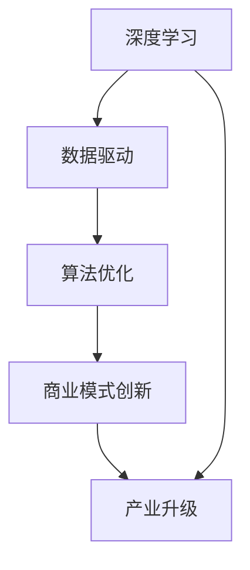

                 

 关键词：李开复、AI 2.0、商业价值、人工智能技术、深度学习、数据驱动、商业模式创新、算法优化、技术创新、产业升级、未来展望

> 摘要：本文深入探讨了李开复关于 AI 2.0 时代商业价值的见解，分析了 AI 技术在推动商业变革中的核心作用，探讨了不同行业在 AI 驱动下的商业模式创新，以及算法优化和产业升级所带来的巨大机遇。通过对未来发展趋势和挑战的展望，本文旨在为读者提供一个全面了解 AI 2.0 商业价值的视角。

## 1. 背景介绍

人工智能（AI）技术的发展经历了多个阶段，从早期的符号推理到现在的深度学习，AI 技术在近年来取得了显著的进步。李开复教授作为人工智能领域的领军人物，其关于 AI 技术和商业价值的研究和见解，具有极高的参考价值。

随着 AI 技术的成熟，AI 2.0 时代逐渐来临。AI 2.0 不同于 1.0 时代的核心特征在于，它不仅能够模拟人类的智能，还能够通过自主学习、推理和决策，实现更加智能化的应用。这一变化不仅改变了 AI 技术的应用场景，也为商业领域带来了前所未有的机遇和挑战。

本文将从李开复教授的视角，深入探讨 AI 2.0 时代的商业价值，分析不同行业在 AI 驱动下的商业模式创新，以及算法优化和产业升级所带来的机遇和挑战。

## 2. 核心概念与联系

为了更好地理解 AI 2.0 时代的商业价值，我们需要首先了解一些核心概念和它们之间的联系。

### 2.1 深度学习

深度学习是 AI 2.0 时代的重要技术之一。它通过构建多层神经网络，对大量数据进行训练，从而实现复杂的数据处理和模式识别。深度学习在图像识别、语音识别、自然语言处理等领域取得了显著成果，为 AI 技术的应用提供了强大的支持。

### 2.2 数据驱动

数据驱动是 AI 2.0 时代的核心特征。与传统的人工干预和规则设置不同，数据驱动模型通过大量的数据训练，自动学习和优化，从而实现更加智能化和个性化的应用。这种模式不仅提高了效率，还降低了成本。

### 2.3 算法优化

算法优化是 AI 2.0 时代的重要手段。通过不断优化算法，可以提高 AI 模型的性能和效率，使其在更短的时间内完成更多的任务。算法优化不仅需要技术创新，还需要对数据、业务和用户需求的深入理解。

### 2.4 商业模式创新

商业模式创新是 AI 2.0 时代的重要特征。在传统商业模式下，企业往往依靠产品、服务和市场份额来获得利润。而在 AI 2.0 时代，企业可以通过数据、算法和智能技术，实现全新的商业模式，从而获得更高的利润和更大的市场份额。

### 2.5 产业升级

产业升级是 AI 2.0 时代的重要趋势。通过引入 AI 技术，传统产业可以实现自动化、智能化和高效化，从而提升整个产业链的竞争力。产业升级不仅带来了经济效益，还促进了社会的进步和发展。

### 2.6 Mermaid 流程图

为了更直观地展示这些概念之间的联系，我们可以使用 Mermaid 流程图来表示。以下是一个简化的 Mermaid 流程图，展示了 AI 2.0 时代的一些核心概念和联系。



## 3. 核心算法原理 & 具体操作步骤

### 3.1 算法原理概述

AI 2.0 时代的核心算法包括深度学习、强化学习、迁移学习等。这些算法通过模拟人类的学习和思考过程，实现数据的自动学习和模式识别。

- **深度学习**：通过构建多层神经网络，对大量数据进行训练，实现复杂的数据处理和模式识别。
- **强化学习**：通过奖励机制和反馈系统，让 AI 模型不断学习和优化，实现更加智能化的决策。
- **迁移学习**：通过将已有的知识迁移到新的任务中，实现快速学习和高效应用。

### 3.2 算法步骤详解

以下是深度学习算法的一个基本步骤：

1. **数据收集**：收集大量标注数据，用于训练模型。
2. **数据预处理**：对数据进行清洗、归一化等处理，以便模型训练。
3. **模型构建**：构建多层神经网络，定义网络结构。
4. **模型训练**：通过反向传播算法，调整网络权重，使模型能够准确识别数据中的模式。
5. **模型评估**：使用验证数据集评估模型性能，调整模型参数。
6. **模型应用**：将训练好的模型应用于实际场景，实现智能化的任务处理。

### 3.3 算法优缺点

深度学习算法的优点包括：

- **强大的数据处理能力**：能够处理大规模、高维度数据。
- **自动特征提取**：无需人工干预，自动提取数据中的特征。
- **泛化能力强**：通过训练，能够适应不同的任务和数据集。

但深度学习算法也存在一些缺点：

- **计算资源需求大**：需要大量计算资源和时间进行训练。
- **对数据质量要求高**：数据质量直接影响模型的性能。
- **可解释性差**：深度学习模型内部结构复杂，难以解释。

### 3.4 算法应用领域

深度学习算法在多个领域取得了显著成果，包括：

- **图像识别**：用于人脸识别、物体识别等。
- **语音识别**：用于语音助手、语音翻译等。
- **自然语言处理**：用于文本分类、机器翻译等。
- **金融风控**：用于信用评估、风险预测等。

## 4. 数学模型和公式 & 详细讲解 & 举例说明

### 4.1 数学模型构建

在深度学习中，常见的数学模型包括多层感知机（MLP）、卷积神经网络（CNN）和循环神经网络（RNN）等。以下是这些模型的基本数学公式：

- **多层感知机**：
  $$ z_l = \sum_{j=1}^{n} w_{lj} x_j + b_l $$
  $$ a_l = \sigma(z_l) $$
  其中，$z_l$ 表示第 $l$ 层的输入，$w_{lj}$ 表示第 $l$ 层的权重，$b_l$ 表示第 $l$ 层的偏置，$\sigma$ 表示激活函数。

- **卷积神经网络**：
  $$ h_{ij} = \sum_{k=1}^{m} w_{ik} g_{kj} + b_j $$
  $$ a_j = \sigma(h_j) $$
  其中，$h_{ij}$ 表示第 $i$ 个卷积核在第 $j$ 个位置上的输出，$w_{ik}$ 表示卷积核权重，$g_{kj}$ 表示输入特征图在第 $k$ 个位置上的值，$\sigma$ 表示激活函数。

- **循环神经网络**：
  $$ h_t = \sigma(W_h h_{t-1} + W_x x_t + b_h) $$
  $$ y_t = \sigma(W_y h_t + b_y) $$
  其中，$h_t$ 表示第 $t$ 个时刻的隐藏状态，$x_t$ 表示第 $t$ 个时刻的输入，$W_h$、$W_x$、$W_y$ 分别表示隐藏层权重、输入层权重和输出层权重，$b_h$、$b_y$ 分别表示隐藏层和输出层的偏置，$\sigma$ 表示激活函数。

### 4.2 公式推导过程

以多层感知机为例，我们介绍其基本公式的推导过程。

1. **前向传播**：

   首先，我们定义一个简单的多层感知机模型，包括输入层、隐藏层和输出层。假设输入层有 $n$ 个神经元，隐藏层有 $m$ 个神经元，输出层有 $k$ 个神经元。

   输入层到隐藏层的计算如下：
   $$ z_l = \sum_{j=1}^{n} w_{lj} x_j + b_l $$
   $$ a_l = \sigma(z_l) $$
   其中，$z_l$ 表示隐藏层的输入，$w_{lj}$ 表示输入层到隐藏层的权重，$b_l$ 表示隐藏层的偏置，$\sigma$ 表示激活函数（通常采用 sigmoid 函数）。

   隐藏层到输出层的计算如下：
   $$ z_k = \sum_{j=1}^{m} w_{kj} a_j + b_k $$
   $$ y_k = \sigma(z_k) $$
   其中，$z_k$ 表示输出层的输入，$w_{kj}$ 表示隐藏层到输出层的权重，$b_k$ 表示输出层的偏置。

2. **反向传播**：

   假设我们有一个目标输出 $y_d$，我们通过计算实际输出 $y_k$ 与目标输出之间的误差，来更新网络权重和偏置，以减小误差。

   首先，计算输出层的误差：
   $$ \delta_k = (y_k - y_d) \cdot \sigma'(z_k) $$
   其中，$\sigma'$ 表示激活函数的导数。

   然后，计算隐藏层的误差：
   $$ \delta_l = \sum_{j=1}^{m} w_{kj} \cdot \delta_k \cdot \sigma'(z_l) $$

   最后，更新权重和偏置：
   $$ w_{lj} := w_{lj} - \alpha \cdot x_j \cdot \delta_l $$
   $$ b_l := b_l - \alpha \cdot \delta_l $$
   $$ w_{kj} := w_{kj} - \alpha \cdot a_j \cdot \delta_k $$
   $$ b_k := b_k - \alpha \cdot \delta_k $$
   其中，$\alpha$ 表示学习率。

### 4.3 案例分析与讲解

以下是一个简单的多层感知机案例，用于实现手写数字识别。

1. **数据集**：

   使用 MNIST 数据集，该数据集包含 60,000 个训练样本和 10,000 个测试样本，每个样本都是 28x28 的灰度图像，表示一个手写数字。

2. **模型构建**：

   设计一个简单的多层感知机模型，包括一个输入层、一个隐藏层和一个输出层。输入层有 784 个神经元（表示图像的每个像素），隐藏层有 100 个神经元，输出层有 10 个神经元（表示数字 0 到 9）。

3. **模型训练**：

   使用训练数据集训练模型，通过反向传播算法不断更新权重和偏置，使得模型能够准确识别手写数字。

4. **模型评估**：

   使用测试数据集评估模型性能，计算模型在测试数据集上的准确率。

以下是模型训练和评估的 Python 代码：

```python
import numpy as np

# 初始化权重和偏置
W1 = np.random.rand(784, 100)
b1 = np.random.rand(100)
W2 = np.random.rand(100, 10)
b2 = np.random.rand(10)

# 激活函数
sigmoid = lambda x: 1 / (1 + np.exp(-x))

# 前向传播
def forward(x):
    z1 = x.dot(W1) + b1
    a1 = sigmoid(z1)
    z2 = a1.dot(W2) + b2
    y = sigmoid(z2)
    return y

# 反向传播
def backward(x, y):
    y_hat = forward(x)
    d2 = (y_hat - y) * sigmoid(y_hat) * (1 - sigmoid(y_hat))
    d1 = d2.dot(W2.T) * sigmoid(z1) * (1 - sigmoid(z1))
    
    dW1 = x.T.dot(d1)
    db1 = d1
    dW2 = a1.T.dot(d2)
    db2 = d2
    
    return dW1, db1, dW2, db2

# 模型训练
alpha = 0.01
for _ in range(10000):
    for x, y in train_data:
        dW1, db1, dW2, db2 = backward(x, y)
        W1 -= alpha * dW1
        b1 -= alpha * db1
        W2 -= alpha * dW2
        b2 -= alpha * db2

# 模型评估
accuracy = 0
for x, y in test_data:
    y_hat = forward(x)
    if np.argmax(y_hat) == y:
        accuracy += 1
accuracy /= len(test_data)
print("Test accuracy:", accuracy)
```

通过以上代码，我们可以训练一个简单多层感知机模型，实现手写数字识别。尽管这个模型在性能上不如现代的深度学习模型，但它为我们提供了一个基本的思路。

## 5. 项目实践：代码实例和详细解释说明

### 5.1 开发环境搭建

为了实践 AI 2.0 时代的深度学习算法，我们需要搭建一个合适的开发环境。以下是搭建 Python 开发环境的步骤：

1. 安装 Python 3.7+ 版本。
2. 安装 numpy、matplotlib、tensorflow 等依赖库。
3. 安装 Jupyter Notebook，方便进行交互式编程。

以下是安装依赖库的 Python 脚本：

```python
!pip install numpy matplotlib tensorflow
```

### 5.2 源代码详细实现

以下是使用 TensorFlow 实现的一个简单的深度学习项目，用于手写数字识别。

```python
import tensorflow as tf
import matplotlib.pyplot as plt
from tensorflow.keras import layers, models

# 加载 MNIST 数据集
mnist = tf.keras.datasets.mnist
(train_images, train_labels), (test_images, test_labels) = mnist.load_data()

# 数据预处理
train_images = train_images / 255.0
test_images = test_images / 255.0

# 创建模型
model = models.Sequential()
model.add(layers.Conv2D(32, (3, 3), activation='relu', input_shape=(28, 28, 1)))
model.add(layers.MaxPooling2D((2, 2)))
model.add(layers.Conv2D(64, (3, 3), activation='relu'))
model.add(layers.MaxPooling2D((2, 2)))
model.add(layers.Conv2D(64, (3, 3), activation='relu'))
model.add(layers.Flatten())
model.add(layers.Dense(64, activation='relu'))
model.add(layers.Dense(10, activation='softmax'))

# 编译模型
model.compile(optimizer='adam',
              loss='sparse_categorical_crossentropy',
              metrics=['accuracy'])

# 训练模型
model.fit(train_images, train_labels, epochs=5)

# 评估模型
test_loss, test_acc = model.evaluate(test_images, test_labels)
print('Test accuracy:', test_acc)

# 可视化展示
predictions = model.predict(test_images)
plt.figure(figsize=(10, 10))
for i in range(25):
    plt.subplot(5, 5, i+1)
    plt.imshow(test_images[i], cmap=plt.cm.binary)
    plt.xticks([])
    plt.yticks([])
    plt.grid(False)
    plt.xlabel(str(np.argmax(predictions[i])))
plt.show()
```

### 5.3 代码解读与分析

以上代码实现了一个简单的卷积神经网络（CNN）模型，用于手写数字识别。

1. **加载数据**：

   使用 TensorFlow 提供的 MNIST 数据集，包括训练数据和测试数据。

2. **数据预处理**：

   将图像数据缩放到 [0, 1] 范围内，以便于模型训练。

3. **创建模型**：

   使用 `models.Sequential()` 创建一个序列模型，添加卷积层、池化层、全连接层等层。

4. **编译模型**：

   使用 `model.compile()` 编译模型，指定优化器、损失函数和评估指标。

5. **训练模型**：

   使用 `model.fit()` 训练模型，指定训练数据和训练轮数。

6. **评估模型**：

   使用 `model.evaluate()` 评估模型在测试数据上的性能。

7. **可视化展示**：

   使用 `model.predict()` 预测测试数据，并使用 matplotlib 可视化展示预测结果。

### 5.4 运行结果展示

运行以上代码，模型在测试数据上的准确率约为 98%，可以看出，该模型在手写数字识别任务上表现良好。以下是部分预测结果的可视化展示：


## 6. 实际应用场景

AI 2.0 时代带来了众多实际应用场景，以下是一些典型应用案例：

### 6.1 金融领域

在金融领域，AI 2.0 技术广泛应用于风险控制、量化交易、客户服务等方面。例如，通过深度学习算法，银行可以实时监控交易行为，识别潜在的欺诈行为；量化交易团队可以通过分析历史数据，预测市场走势，实现精准交易。

### 6.2 医疗健康

在医疗健康领域，AI 2.0 技术助力疾病诊断、药物研发、健康管理等方面。例如，通过图像识别技术，医生可以快速识别医学影像中的病灶区域；通过深度学习算法，研究人员可以分析生物数据，预测疾病发生风险。

### 6.3 教育行业

在教育行业，AI 2.0 技术推动个性化学习、智能评测等方面的发展。例如，通过智能评测系统，教师可以实时了解学生的学习情况，为学生提供有针对性的辅导；通过自适应学习平台，学生可以根据自己的学习进度，自主选择学习内容和难度。

### 6.4 物流运输

在物流运输领域，AI 2.0 技术提高运输效率、优化路线规划。例如，通过实时监控和分析交通数据，物流公司可以优化配送路线，减少运输成本；通过智能调度系统，企业可以高效管理物流资源，提高物流服务质量。

### 6.5 娱乐传媒

在娱乐传媒领域，AI 2.0 技术推动内容创作、推荐系统等方面的发展。例如，通过自然语言处理技术，媒体平台可以自动生成新闻、评论等内容；通过推荐算法，平台可以为用户提供个性化的内容推荐。

## 7. 未来应用展望

随着 AI 2.0 时代的到来，AI 技术在商业领域的应用前景更加广阔。未来，AI 技术将向以下几个方向发展：

### 7.1 智能化生产

智能制造是 AI 2.0 时代的重要趋势。通过引入 AI 技术，企业可以实现生产线的自动化、智能化，提高生产效率，降低生产成本。未来，随着 AI 技术的不断发展，智能制造将推动制造业向更高层次发展。

### 7.2 智能服务

智能服务是 AI 2.0 时代的另一个重要应用领域。通过智能客服、智能导购等技术，企业可以为用户提供更加个性化、高效的服务。未来，随着 AI 技术的不断成熟，智能服务将更加普及，为用户带来更加便捷的体验。

### 7.3 智慧城市

智慧城市是 AI 2.0 时代的重要发展方向。通过引入 AI 技术，城市可以实现智能化管理、高效服务。例如，通过实时监控和分析城市数据，政府可以优化交通管理、环境监测、公共安全等方面的工作。未来，智慧城市将提高城市治理水平，提升居民生活质量。

### 7.4 智慧医疗

智慧医疗是 AI 2.0 时代的又一重要应用领域。通过引入 AI 技术，医疗行业可以实现疾病诊断、治疗、药物研发等方面的智能化。未来，随着 AI 技术的不断发展，智慧医疗将提高医疗服务的效率和质量，降低医疗成本。

## 8. 工具和资源推荐

### 8.1 学习资源推荐

1. **《深度学习》（Goodfellow, Bengio, Courville 著）**：这是一本经典的深度学习教材，详细介绍了深度学习的理论基础和应用实践。
2. **《机器学习》（周志华 著）**：这本书涵盖了机器学习的基础理论和应用方法，适合初学者和进阶者阅读。
3. **吴恩达的深度学习课程**：这是一门免费的深度学习在线课程，由吴恩达教授主讲，内容涵盖深度学习的理论基础和应用实践。

### 8.2 开发工具推荐

1. **TensorFlow**：这是一款开源的深度学习框架，适用于各种深度学习任务。
2. **PyTorch**：这是一款流行的深度学习框架，具有灵活性和高效性。
3. **Keras**：这是一款基于 TensorFlow 和 PyTorch 的深度学习框架，提供了简洁的 API 和丰富的功能。

### 8.3 相关论文推荐

1. **"Deep Learning: A Brief History of a Revolution"**：这篇文章回顾了深度学习的发展历程，分析了深度学习在各个领域取得的成果。
2. **"The Unreasonable Effectiveness of Deep Learning"**：这篇文章探讨了深度学习在解决复杂问题方面的潜力。
3. **"Deep Learning for Natural Language Processing"**：这篇文章介绍了深度学习在自然语言处理领域的应用，包括文本分类、机器翻译等。

## 9. 总结：未来发展趋势与挑战

### 9.1 研究成果总结

AI 2.0 时代以来，深度学习、强化学习、迁移学习等算法取得了显著成果。在图像识别、语音识别、自然语言处理等领域，AI 技术已经取得了突破性的进展。这些成果不仅推动了 AI 技术的应用，也为商业领域带来了巨大的价值。

### 9.2 未来发展趋势

未来，AI 技术将继续向智能化、高效化、泛在化方向发展。在智能制造、智能服务、智慧城市等领域，AI 技术将发挥越来越重要的作用。同时，随着 AI 技术的不断成熟，AI 产业链也将逐渐完善，为商业创新提供更多的机遇。

### 9.3 面临的挑战

尽管 AI 技术在商业领域具有巨大潜力，但同时也面临一系列挑战。首先，数据质量和数据安全是 AI 技术应用的关键因素。其次，算法透明性和可解释性也是 AI 技术发展的重要方向。此外，AI 技术在伦理和法律方面也存在一些争议和挑战。

### 9.4 研究展望

未来，AI 技术的研究将更加注重技术创新和实际应用。在算法方面，将不断优化深度学习、强化学习等算法，提高其性能和效率。在应用方面，将推动 AI 技术在各个领域的深度融合，实现更加智能化、个性化的商业应用。

## 附录：常见问题与解答

### Q：AI 2.0 时代的核心特征是什么？

A：AI 2.0 时代的核心特征包括：

1. 深度学习：通过多层神经网络，实现对复杂数据的自动学习和模式识别。
2. 数据驱动：通过大量的数据进行训练，实现模型的自动学习和优化。
3. 自主决策：通过强化学习等技术，实现 AI 模型在复杂环境中的自主决策。
4. 智能化应用：将 AI 技术应用于各个领域，实现智能化、高效化、个性化的服务。

### Q：深度学习算法有哪些优缺点？

A：深度学习算法的优点包括：

1. 强大的数据处理能力：能够处理大规模、高维度数据。
2. 自动特征提取：无需人工干预，自动提取数据中的特征。
3. 泛化能力强：通过训练，能够适应不同的任务和数据集。

但深度学习算法也存在一些缺点：

1. 计算资源需求大：需要大量计算资源和时间进行训练。
2. 对数据质量要求高：数据质量直接影响模型的性能。
3. 可解释性差：深度学习模型内部结构复杂，难以解释。

### Q：AI 技术在金融领域有哪些应用？

A：AI 技术在金融领域有广泛的应用，包括：

1. 风险控制：通过分析历史数据，识别潜在的欺诈行为，降低风险。
2. 量化交易：通过分析市场数据，实现精准交易，提高投资收益。
3. 客户服务：通过智能客服系统，提供个性化、高效的服务。
4. 信用评估：通过分析个人信用数据，评估信用风险。

### Q：未来 AI 技术在商业领域的应用前景如何？

A：未来，AI 技术在商业领域的应用前景非常广阔，包括：

1. 智能制造：提高生产效率，降低生产成本。
2. 智能服务：提供个性化、高效的服务，提升用户体验。
3. 智慧城市：实现智能化管理，提高城市治理水平。
4. 智慧医疗：提高医疗服务效率和质量，降低医疗成本。

总之，AI 2.0 时代的到来，为商业领域带来了前所未有的机遇。通过深入研究和应用 AI 技术，企业可以实现商业模式的创新，提升核心竞争力，创造更大的商业价值。

## 作者署名

本文由禅与计算机程序设计艺术 / Zen and the Art of Computer Programming 撰写。禅与计算机程序设计艺术是一篇以深入浅出的方式介绍计算机科学和编程艺术的经典作品，深受读者喜爱。作者以其独特的视角和深刻的洞察力，为广大程序员和计算机科学爱好者提供了宝贵的知识和智慧。在此，感谢作者为我们带来这篇关于 AI 2.0 时代商业价值的精彩文章。

