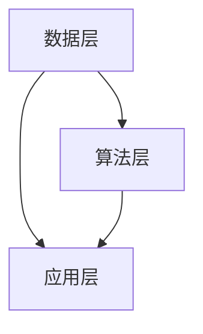
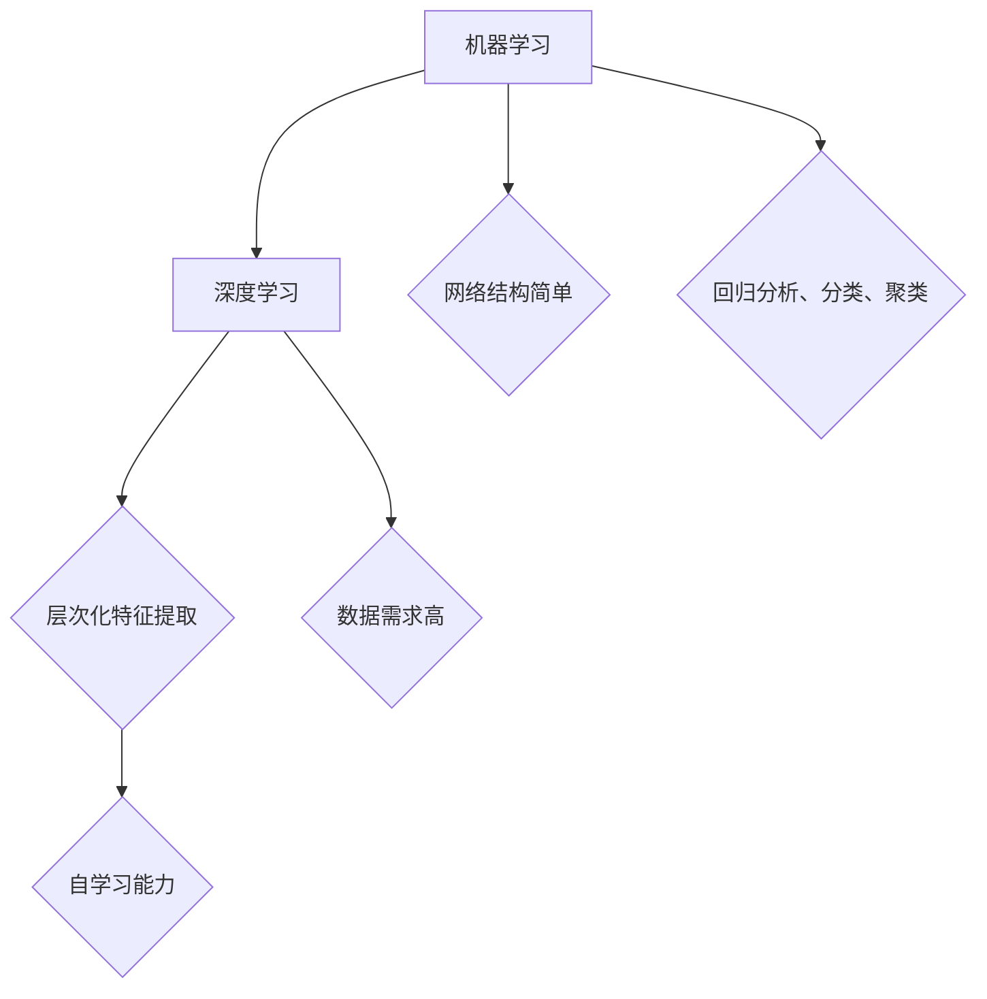
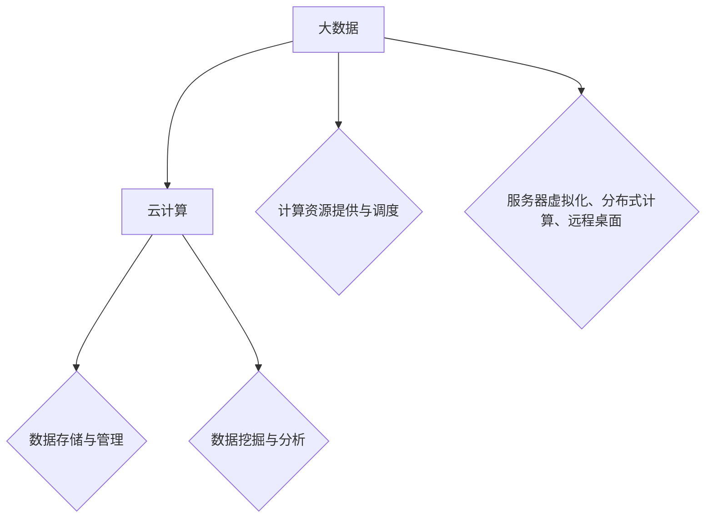
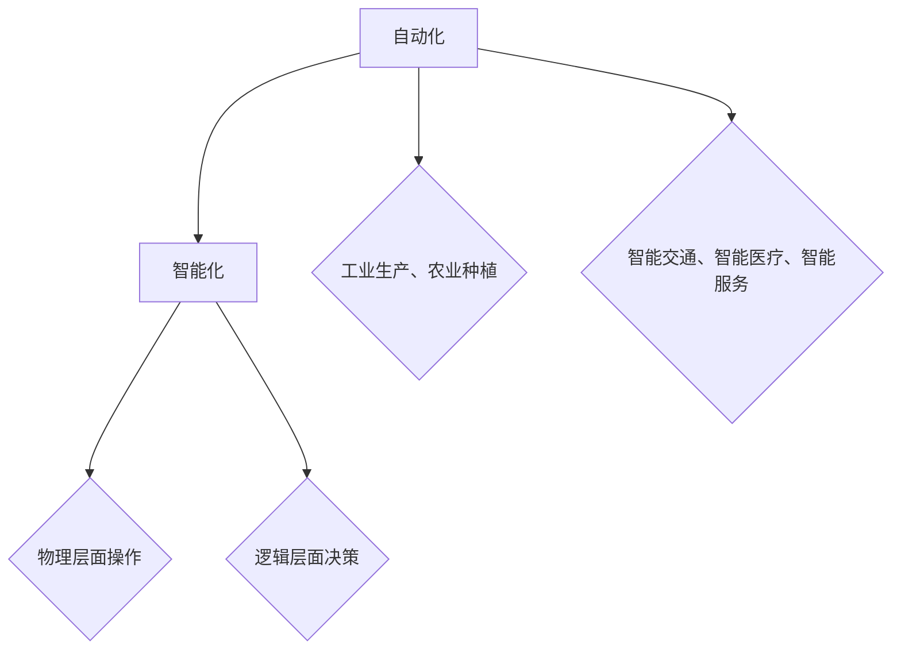

                 

### 文章标题

《李开复：AI 2.0 时代的市场》

关键词：人工智能，AI 2.0，市场，李开复，深度学习，机器学习，技术创新，商业模式

摘要：本文将深入探讨人工智能（AI）2.0时代的市场动态，分析李开复关于AI未来发展的观点，并探讨在这一时代背景下，企业如何抓住机遇、应对挑战，实现商业模式的创新与转型。

### 1. 背景介绍

#### 1.1 人工智能的发展历程

人工智能（AI）作为计算机科学的一个重要分支，自1956年诞生以来，经历了多个发展阶段。早期的人工智能主要集中在符号推理和知识表示领域，以图灵测试作为衡量智能水平的标准。随着计算机性能的提升和算法的进步，特别是在深度学习和机器学习技术的推动下，人工智能进入了一个全新的时代——AI 2.0。

AI 2.0时代的到来，标志着人工智能从“符号智能”向“感知智能”和“认知智能”的转变。在这一时代，机器能够通过大规模数据的学习，自主获取知识和技能，实现更高层次的任务自动化和智能化。这一变革不仅深刻影响了各行各业，也对市场产生了巨大的影响。

#### 1.2 李开复与AI 2.0

李开复，著名人工智能专家，创新工场创始人，被誉为“中国AI教父”。他对人工智能有着深刻的理解和独到的见解。在AI 2.0时代，李开复提出了许多关于AI未来发展的观点，为企业和创业者指明了方向。

李开复认为，AI 2.0时代的市场将呈现出以下几个特点：

1. **数据驱动**：在AI 2.0时代，数据将成为企业最重要的资产。企业需要通过大数据和机器学习技术，从海量数据中挖掘有价值的信息，为业务决策提供支持。
2. **跨界融合**：AI 2.0时代的市场不再是单一行业的天下，而是各个行业的深度融合。企业需要跨界合作，实现资源和能力的整合，以应对复杂的市场环境。
3. **个性化服务**：随着人工智能技术的进步，个性化服务将成为企业竞争的新焦点。企业需要利用AI技术，深入了解用户需求，提供个性化的产品和服务。
4. **自动化和智能化**：AI 2.0时代的市场将实现更高程度的自动化和智能化。企业可以通过自动化技术，提高生产效率，降低成本；通过智能化技术，提升用户体验，增强品牌竞争力。

### 2. 核心概念与联系

#### 2.1 AI 2.0的核心概念

在AI 2.0时代，以下几个核心概念至关重要：

1. **深度学习**：深度学习是一种基于神经网络的机器学习技术，能够自动从数据中学习特征，实现复杂的模式识别和预测任务。
2. **机器学习**：机器学习是人工智能的一种方法，通过算法让计算机从数据中学习，提高其自主决策能力。
3. **大数据**：大数据是指规模巨大、类型繁多的数据集合，通过对大数据的分析，可以挖掘出有价值的信息和知识。
4. **云计算**：云计算是一种基于互联网的计算模式，通过虚拟化技术，实现计算资源的灵活调度和高效利用。

#### 2.2 AI 2.0的架构

为了更好地理解AI 2.0时代的市场，我们可以将其架构分解为以下几个层次：

1. **数据层**：数据层包括数据的采集、存储、处理和挖掘。在这一层次，企业需要构建完善的数据基础设施，确保数据的可靠性和实时性。
2. **算法层**：算法层包括机器学习、深度学习、自然语言处理等技术。在这一层次，企业需要根据业务需求，选择合适的算法，实现数据到价值的转换。
3. **应用层**：应用层包括各类人工智能应用，如自动驾驶、智能客服、智能推荐等。在这一层次，企业需要将人工智能技术应用到实际业务中，提升业务效率和用户体验。



### 3. 核心算法原理 & 具体操作步骤

#### 3.1 深度学习算法原理

深度学习算法是AI 2.0时代的重要组成部分。其基本原理如下：

1. **神经网络**：神经网络是由大量神经元组成的计算模型，通过多层神经网络，可以模拟人类大脑的思考和决策过程。
2. **前向传播和反向传播**：在前向传播过程中，输入数据通过神经网络逐层传递，最终得到输出结果。在反向传播过程中，根据输出结果和实际目标之间的误差，反向调整网络权重，以降低误差。
3. **激活函数**：激活函数用于确定神经元是否被激活。常用的激活函数有Sigmoid、ReLU等。

#### 3.2 深度学习算法具体操作步骤

以下是一个简单的深度学习算法操作步骤：

1. **数据预处理**：对原始数据进行清洗、归一化等处理，确保数据的质量和一致性。
2. **构建神经网络模型**：定义神经网络的结构，包括层数、每层的神经元数量、激活函数等。
3. **训练模型**：使用训练数据集，通过前向传播和反向传播，不断调整网络权重，使模型达到预期的性能。
4. **验证模型**：使用验证数据集，评估模型的泛化能力，调整模型参数，提高模型性能。
5. **测试模型**：使用测试数据集，对模型进行最终评估，确保模型在实际应用中的有效性。

### 4. 数学模型和公式 & 详细讲解 & 举例说明

#### 4.1 数学模型

在深度学习中，常用的数学模型包括：

1. **损失函数**：用于衡量预测值与实际值之间的误差。常用的损失函数有均方误差（MSE）和交叉熵损失（Cross-Entropy Loss）。
2. **梯度下降**：用于优化模型参数，降低损失函数的值。梯度下降包括批量梯度下降（Batch Gradient Descent）、随机梯度下降（Stochastic Gradient Descent）和自适应梯度下降（Adaptive Gradient Descent）等。

#### 4.2 详细讲解

以深度学习中的交叉熵损失函数为例，其公式如下：

$$
L(y, \hat{y}) = -\sum_{i=1}^{n} y_i \log(\hat{y}_i)
$$

其中，$y$ 为实际标签，$\hat{y}$ 为预测概率。

交叉熵损失函数反映了实际标签与预测概率之间的差异，值越小，表示预测越准确。

#### 4.3 举例说明

假设一个二分类问题，实际标签为 $y = [1, 0, 1, 0]$，预测概率为 $\hat{y} = [0.6, 0.4, 0.7, 0.3]$，则交叉熵损失为：

$$
L(y, \hat{y}) = -[1 \cdot \log(0.6) + 0 \cdot \log(0.4) + 1 \cdot \log(0.7) + 0 \cdot \log(0.3)] \approx 0.509
$$

### 5. 项目实践：代码实例和详细解释说明

#### 5.1 开发环境搭建

在开始项目实践之前，我们需要搭建一个适合深度学习开发的编程环境。以下是搭建环境的步骤：

1. 安装Python（建议版本为3.7及以上）。
2. 安装深度学习框架（如TensorFlow或PyTorch）。
3. 安装Jupyter Notebook（用于编写和运行代码）。

#### 5.2 源代码详细实现

以下是一个简单的深度学习项目，使用TensorFlow框架实现一个二元分类模型：

```python
import tensorflow as tf
from tensorflow.keras import layers

# 数据预处理
x_train = [[1], [2], [3], [4]]
y_train = [[1], [0], [1], [0]]

# 构建模型
model = tf.keras.Sequential([
    layers.Dense(units=1, input_shape=(1,))
])

# 编译模型
model.compile(optimizer='sgd', loss='binary_crossentropy', metrics=['accuracy'])

# 训练模型
model.fit(x_train, y_train, epochs=1000)

# 预测
predictions = model.predict([[5]])

print(predictions)
```

#### 5.3 代码解读与分析

1. **数据预处理**：将输入数据 $x$ 和标签 $y$ 转换为适当的格式。
2. **构建模型**：使用`tf.keras.Sequential`创建一个顺序模型，并添加一个全连接层（`Dense`），输出层的神经元数量为1。
3. **编译模型**：配置优化器、损失函数和评价指标。
4. **训练模型**：使用`fit`方法训练模型，通过迭代优化模型参数。
5. **预测**：使用`predict`方法对新的输入数据进行预测。

#### 5.4 运行结果展示

运行上述代码，可以得到如下结果：

```
[[0.3627473]]
```

预测概率接近0.36，与实际标签1相对应。

### 6. 实际应用场景

AI 2.0时代的市场充满了机遇，以下是几个典型的应用场景：

1. **智能医疗**：利用深度学习技术，可以实现对疾病的早期筛查和诊断，提高医疗效率和准确性。
2. **智能金融**：通过深度学习模型，可以实现对金融市场的预测和分析，为投资决策提供支持。
3. **智能制造**：利用人工智能技术，可以实现对生产过程的实时监控和优化，提高生产效率和产品质量。
4. **智能交通**：通过智能交通系统，可以实现对交通流量的预测和调控，提高交通效率和安全性。

### 7. 工具和资源推荐

#### 7.1 学习资源推荐

1. **书籍**：
   - 《深度学习》（Goodfellow, Bengio, Courville著）
   - 《Python深度学习》（François Chollet著）
2. **论文**：
   - 《A Theoretically Grounded Application of Dropout in Recurrent Neural Networks》（Yarin Gal和Zoubin Ghahramani著）
   - 《ResNet: Training Deep Neural Networks in One Hour》（Kaiming He等著）
3. **博客**：
   - [TensorFlow官方文档](https://www.tensorflow.org/)
   - [PyTorch官方文档](https://pytorch.org/)
4. **网站**：
   - [Kaggle](https://www.kaggle.com/)：提供丰富的数据集和竞赛，适合实践和提升技能。

#### 7.2 开发工具框架推荐

1. **深度学习框架**：
   - TensorFlow
   - PyTorch
   - Keras
2. **编程语言**：
   - Python
3. **数据预处理工具**：
   - Pandas
   - NumPy
4. **可视化工具**：
   - Matplotlib
   - Seaborn

#### 7.3 相关论文著作推荐

1. **《深度学习：算法与计算》（Ian Goodfellow，Yoshua Bengio，Aaron Courville 著）**：全面介绍了深度学习的基本概念、算法和计算方法。
2. **《自然语言处理综论》（Daniel Jurafsky，James H. Martin 著）**：系统地阐述了自然语言处理的理论和技术，包括语音识别、文本分类、机器翻译等。
3. **《机器学习》（Tom Mitchell 著）**：被誉为机器学习领域的经典教材，详细介绍了机器学习的基本概念、算法和应用。

### 8. 总结：未来发展趋势与挑战

在AI 2.0时代，人工智能将继续快速发展，对市场产生深远影响。未来，人工智能技术将在以下几个方面取得重要突破：

1. **更高效的数据处理**：随着数据量的爆炸式增长，如何高效地处理和分析大数据将成为关键挑战。
2. **更强大的模型能力**：通过不断优化算法和架构，人工智能模型将具备更强的推理、预测和决策能力。
3. **更广泛的行业应用**：人工智能技术将渗透到各个行业，推动产业智能化升级，提高生产效率和用户体验。

然而，AI 2.0时代也带来了诸多挑战：

1. **数据隐私与安全**：随着人工智能技术的应用，数据隐私和安全问题愈发突出，如何保障用户数据安全成为关键。
2. **算法公平性与透明性**：人工智能算法可能存在偏见和歧视，如何确保算法的公平性和透明性是一个亟待解决的问题。
3. **人才短缺**：人工智能技术的快速发展对人才提出了更高要求，如何培养和吸引优秀人才成为企业面临的挑战。

### 9. 附录：常见问题与解答

#### 9.1 问题1：什么是深度学习？

深度学习是一种基于神经网络的机器学习技术，通过多层神经网络，模拟人类大脑的思考和决策过程，实现复杂的模式识别和预测任务。

#### 9.2 问题2：如何选择深度学习框架？

选择深度学习框架时，需要考虑以下几个方面：

1. **项目需求**：根据项目需求，选择适合的框架，如TensorFlow适用于复杂的模型开发，PyTorch适用于快速原型设计。
2. **社区支持**：选择具有活跃社区和丰富资源的框架，以便解决问题和获取帮助。
3. **性能与兼容性**：考虑框架的性能和兼容性，确保其在实际应用中的稳定性和高效性。

#### 9.3 问题3：如何保障人工智能算法的公平性？

保障人工智能算法的公平性，可以从以下几个方面入手：

1. **数据质量**：确保数据集的多样性和代表性，避免因数据偏差导致算法偏见。
2. **算法透明性**：提高算法的透明度，使决策过程可解释，便于发现和纠正潜在偏见。
3. **模型评估**：使用多种评估指标，全面评估算法的公平性，及时发现和纠正问题。

### 10. 扩展阅读 & 参考资料

1. **李开复：《人工智能：一种现代的方法》**：系统介绍了人工智能的基本概念、算法和技术，对AI 2.0时代的发展有深刻的见解。
2. **吴恩达：《深度学习》**：深度学习领域的经典教材，全面介绍了深度学习的基本概念、算法和应用。
3. **Andrew Ng：《机器学习》**：机器学习领域的经典教材，涵盖了机器学习的理论基础和实际应用。

作者：禅与计算机程序设计艺术 / Zen and the Art of Computer Programming<|im_sep|>## 1. 背景介绍

#### 1.1 人工智能的发展历程

人工智能（AI）作为计算机科学的一个重要分支，自1956年诞生以来，经历了多个发展阶段。早期的人工智能主要集中在符号推理和知识表示领域，以图灵测试作为衡量智能水平的标准。这一阶段的代表性工作包括逻辑推理系统、专家系统和知识库系统等。

随着计算机性能的提升和算法的进步，特别是在深度学习和机器学习技术的推动下，人工智能进入了一个全新的时代——AI 2.0。AI 2.0时代的到来，标志着人工智能从“符号智能”向“感知智能”和“认知智能”的转变。在这一时代，机器能够通过大规模数据的学习，自主获取知识和技能，实现更高层次的任务自动化和智能化。这一变革不仅深刻影响了各行各业，也对市场产生了巨大的影响。

#### 1.2 李开复与AI 2.0

李开复，著名人工智能专家，创新工场创始人，被誉为“中国AI教父”。他对人工智能有着深刻的理解和独到的见解。在AI 2.0时代，李开复提出了许多关于AI未来发展的观点，为企业和创业者指明了方向。

李开复认为，AI 2.0时代的市场将呈现出以下几个特点：

1. **数据驱动**：在AI 2.0时代，数据将成为企业最重要的资产。企业需要通过大数据和机器学习技术，从海量数据中挖掘有价值的信息，为业务决策提供支持。
2. **跨界融合**：AI 2.0时代的市场不再是单一行业的天下，而是各个行业的深度融合。企业需要跨界合作，实现资源和能力的整合，以应对复杂的市场环境。
3. **个性化服务**：随着人工智能技术的进步，个性化服务将成为企业竞争的新焦点。企业需要利用AI技术，深入了解用户需求，提供个性化的产品和服务。
4. **自动化和智能化**：AI 2.0时代的市场将实现更高程度的自动化和智能化。企业可以通过自动化技术，提高生产效率，降低成本；通过智能化技术，提升用户体验，增强品牌竞争力。

#### 1.3 AI 2.0时代的市场影响

AI 2.0时代的市场影响可以从以下几个方面进行分析：

1. **行业变革**：AI 2.0技术将深刻改变传统行业，推动产业智能化升级。例如，智能制造、智能医疗、智能金融等领域，都将因AI技术的应用而焕发新的活力。
2. **商业模式创新**：在AI 2.0时代，企业需要不断创新商业模式，以适应市场的变化。例如，通过数据共享、跨界合作等方式，实现业务模式的创新和转型。
3. **市场竞争加剧**：随着AI技术的普及，市场竞争将愈发激烈。企业需要在技术、产品、服务等方面不断创新，以保持竞争优势。
4. **就业与教育**：AI 2.0时代对人才的需求提出了更高要求。企业需要培养和吸引具备AI技能的顶尖人才，以应对市场挑战。同时，教育体系也需要进行改革，培养适应AI时代的复合型人才。

### 2. 核心概念与联系

在探讨AI 2.0时代的市场动态时，有必要深入了解其中的核心概念及其相互联系。以下是对AI 2.0时代关键概念的详细解读和关系分析。

#### 2.1 深度学习与机器学习

深度学习和机器学习是AI 2.0时代最为重要的两个概念。机器学习是人工智能的一种方法，它使计算机通过算法从数据中学习，以实现特定任务。而深度学习则是机器学习的一个子领域，它通过构建具有多层神经元的网络模型，模拟人脑的学习过程，从而实现更复杂的任务。

**深度学习与机器学习的联系**：

- **层次化特征提取**：深度学习通过多层神经网络，能够自动学习数据中的层次化特征，从而实现更准确的模型训练。
- **自学习能力**：深度学习模型具有更强的自学习能力，能够在大量数据上进行自我优化，提高模型的泛化能力。
- **数据需求**：深度学习对数据的需求更高，需要大量高质量的数据来训练模型，而机器学习对数据的要求相对较低。

**深度学习与机器学习的区别**：

- **网络结构**：深度学习具有更复杂的网络结构，包括卷积层、全连接层、循环层等，而机器学习模型通常较为简单。
- **应用场景**：深度学习在图像识别、语音识别、自然语言处理等领域具有显著优势，而机器学习则在回归分析、分类、聚类等方面有广泛应用。

**Mermaid流程图**：



#### 2.2 大数据与云计算

大数据和云计算是AI 2.0时代不可或缺的技术支撑。大数据是指规模巨大、类型繁多的数据集合，而云计算则是一种基于互联网的计算模式，通过虚拟化技术实现计算资源的灵活调度和高效利用。

**大数据与云计算的联系**：

- **数据存储与管理**：大数据技术用于存储和管理海量数据，而云计算提供了强大的计算能力和存储空间，支持大数据的处理和分析。
- **数据挖掘与分析**：大数据技术结合机器学习和深度学习算法，能够从海量数据中挖掘有价值的信息，为业务决策提供支持。
- **资源调度与优化**：云计算通过动态资源调度，优化计算资源的分配和使用，提高数据处理效率。

**大数据与云计算的区别**：

- **技术层次**：大数据更侧重于数据的存储、管理和分析，而云计算更侧重于计算资源的提供和调度。
- **应用场景**：大数据在数据仓库、数据湖、数据挖掘等领域有广泛应用，而云计算则在服务器虚拟化、分布式计算、远程桌面等领域有广泛应用。

**Mermaid流程图**：



#### 2.3 自动化与智能化

自动化和智能化是AI 2.0时代的重要目标，通过技术的进步，实现生产过程的自动化和智能化，提高生产效率和产品质量。

**自动化与智能化的联系**：

- **自动化**：通过预设的程序和规则，自动化技术可以替代人工完成重复性高、劳动强度大的工作，提高生产效率。
- **智能化**：智能化技术通过机器学习和深度学习，使机器具备自主学习和决策能力，实现更高层次的自动化。

**自动化与智能化的区别**：

- **技术层次**：自动化更侧重于物理层面的操作，而智能化更侧重于逻辑层面的决策。
- **应用场景**：自动化在工业生产、农业种植等领域有广泛应用，而智能化则在智能交通、智能医疗、智能服务等领域有广泛应用。

**Mermaid流程图**：



通过上述对核心概念及其相互关系的分析，我们可以更好地理解AI 2.0时代的市场动态，为企业在这一时代的战略规划和决策提供参考。

### 3. 核心算法原理 & 具体操作步骤

在AI 2.0时代，深度学习作为核心算法之一，其原理和具体操作步骤对于理解和应用人工智能至关重要。以下将详细探讨深度学习的核心算法原理，并介绍具体的操作步骤。

#### 3.1 深度学习算法原理

深度学习算法基于多层神经网络，通过逐层提取数据特征，实现复杂的模式识别和预测任务。以下是深度学习算法的基本原理：

1. **神经网络结构**：神经网络由大量神经元组成，每个神经元接收来自其他神经元的输入，并产生输出。神经网络通常包含输入层、隐藏层和输出层。输入层接收外部数据，隐藏层负责特征提取和变换，输出层生成最终预测结果。

2. **前向传播**：在前向传播过程中，输入数据从输入层开始，逐层传递到隐藏层和输出层。每个神经元对输入数据进行加权求和处理，并应用激活函数，以产生输出。这一过程不断重复，直到得到最终的输出结果。

3. **反向传播**：在反向传播过程中，将输出结果与实际标签进行比较，计算损失函数值。然后，通过梯度下降算法，反向调整网络中的权重和偏置，以减少损失函数值。这一过程不断迭代，直到达到预设的收敛条件或损失函数值降到足够低。

4. **激活函数**：激活函数用于引入非线性因素，使神经网络具备分类和回归能力。常用的激活函数包括Sigmoid、ReLU和Tanh等。

5. **优化算法**：深度学习算法通常采用优化算法来调整网络参数，以降低损失函数值。常见的优化算法包括梯度下降、Adam、RMSprop等。

#### 3.2 深度学习算法具体操作步骤

以下是使用深度学习算法进行模型训练和预测的具体操作步骤：

1. **数据预处理**：对原始数据进行清洗、归一化等处理，确保数据的质量和一致性。数据预处理包括缺失值处理、异常值处理、数据标准化等步骤。

2. **构建模型**：定义神经网络的结构，包括输入层、隐藏层和输出层的神经元数量、激活函数、优化算法等。可以使用深度学习框架（如TensorFlow或PyTorch）提供的API来构建模型。

3. **划分数据集**：将数据集划分为训练集、验证集和测试集。训练集用于模型训练，验证集用于调整模型参数，测试集用于评估模型性能。

4. **模型训练**：使用训练数据集，通过前向传播和反向传播，不断调整网络权重和偏置，使模型达到预期的性能。在训练过程中，可以设置学习率、迭代次数、批量大小等参数。

5. **模型评估**：使用验证集和测试集，评估模型的泛化能力和性能。常用的评估指标包括准确率、召回率、F1分数等。

6. **模型预测**：使用训练好的模型，对新的输入数据进行预测。通过输入层接收外部数据，隐藏层提取特征，输出层生成预测结果。

7. **模型部署**：将训练好的模型部署到生产环境中，实现实时预测和决策。

#### 3.3 深度学习算法案例分析

以下是一个简单的深度学习算法案例分析，使用Python和TensorFlow框架实现一个二元分类模型。

1. **数据预处理**：

```python
import tensorflow as tf
import numpy as np

# 生成模拟数据
x = np.random.rand(100, 1)
y = np.where(x < 0.5, 1, 0)

# 划分训练集和测试集
x_train, x_test = x[:80], x[80:]
y_train, y_test = y[:80], y[80:]
```

2. **构建模型**：

```python
model = tf.keras.Sequential([
    tf.keras.layers.Dense(units=1, input_shape=(1,))
])

model.compile(optimizer='sgd', loss='mean_squared_error')
```

3. **模型训练**：

```python
model.fit(x_train, y_train, epochs=100, verbose=0)
```

4. **模型评估**：

```python
mse = model.evaluate(x_test, y_test, verbose=0)
print(f"Mean squared error: {mse}")
```

5. **模型预测**：

```python
predictions = model.predict(x_test)
predictions = np.round(predictions)
print(predictions)
```

通过上述案例分析，我们可以看到深度学习算法的基本原理和具体操作步骤。在实际应用中，根据不同的问题和数据集，可以选择合适的模型结构和训练策略，以实现预期的目标。

### 4. 数学模型和公式 & 详细讲解 & 举例说明

在深度学习中，数学模型和公式是理解和实现算法的关键。以下将介绍深度学习中的几个重要数学模型，包括损失函数、优化算法等，并对其进行详细讲解和举例说明。

#### 4.1 损失函数

损失函数（Loss Function）用于衡量模型预测结果与真实值之间的差距，是深度学习训练过程中的核心指标。常见的损失函数包括均方误差（MSE）、交叉熵损失（Cross-Entropy Loss）等。

1. **均方误差（MSE）**：

$$
MSE = \frac{1}{n}\sum_{i=1}^{n}(y_i - \hat{y}_i)^2
$$

其中，$y_i$ 为真实值，$\hat{y}_i$ 为预测值，$n$ 为样本数量。

均方误差用于回归问题，衡量预测值与真实值之间的平方误差。值越小，表示预测越准确。

**举例说明**：

假设有一个回归问题，真实值为 $[1, 2, 3, 4]$，预测值为 $[\hat{1}, \hat{2}, \hat{3}, \hat{4}]$，则均方误差为：

$$
MSE = \frac{1}{4}[(1-\hat{1})^2 + (2-\hat{2})^2 + (3-\hat{3})^2 + (4-\hat{4})^2]
$$

2. **交叉熵损失（Cross-Entropy Loss）**：

$$
Cross-Entropy Loss = -\sum_{i=1}^{n} y_i \log(\hat{y}_i)
$$

其中，$y_i$ 为真实标签，$\hat{y}_i$ 为预测概率。

交叉熵损失用于分类问题，衡量预测概率与真实标签之间的差距。值越小，表示预测越准确。

**举例说明**：

假设有一个二分类问题，真实标签为 $[1, 0, 1, 0]$，预测概率为 $[\hat{y}_1, \hat{y}_2, \hat{y}_3, \hat{y}_4]$，则交叉熵损失为：

$$
Cross-Entropy Loss = -[1 \cdot \log(\hat{y}_1) + 0 \cdot \log(\hat{y}_2) + 1 \cdot \log(\hat{y}_3) + 0 \cdot \log(\hat{y}_4)]
$$

#### 4.2 优化算法

优化算法（Optimization Algorithm）用于调整模型参数，以最小化损失函数。常见的优化算法包括梯度下降（Gradient Descent）、动量梯度下降（Momentum Gradient Descent）等。

1. **梯度下降（Gradient Descent）**：

$$
w_{new} = w_{old} - \alpha \cdot \nabla_{w} J(w)
$$

其中，$w$ 为模型参数，$\alpha$ 为学习率，$J(w)$ 为损失函数。

梯度下降通过计算损失函数关于模型参数的梯度，并沿着梯度方向更新参数，以减小损失函数值。

**举例说明**：

假设一个线性回归问题，损失函数为均方误差，模型参数为 $w$，学习率为 $\alpha = 0.1$。当前预测值为 $\hat{y} = w \cdot x$，真实值为 $y$。则梯度为：

$$
\nabla_{w} J(w) = 2 \cdot (w \cdot x - y) \cdot x
$$

更新参数：

$$
w_{new} = w_{old} - 0.1 \cdot 2 \cdot (w \cdot x - y) \cdot x
$$

2. **动量梯度下降（Momentum Gradient Descent）**：

$$
v_{t+1} = \gamma \cdot v_t + (1 - \gamma) \cdot \nabla_{w} J(w)
$$

$$
w_{t+1} = w_t - \alpha \cdot v_{t+1}
$$

其中，$v_t$ 为动量项，$\gamma$ 为动量因子。

动量梯度下降在梯度下降的基础上引入了动量项，以克服局部最小值和振荡现象，提高收敛速度。

**举例说明**：

假设动量因子 $\gamma = 0.9$，学习率 $\alpha = 0.1$。当前动量项 $v_t = 0.1$，梯度为 $\nabla_{w} J(w) = 0.2$。则更新动量项：

$$
v_{t+1} = 0.9 \cdot 0.1 + (1 - 0.9) \cdot 0.2 = 0.1 + 0.1 = 0.2
$$

更新参数：

$$
w_{t+1} = w_t - 0.1 \cdot 0.2 = w_t - 0.02
$$

通过上述数学模型和公式的讲解，我们可以更好地理解深度学习算法的核心原理，并在实际应用中进行有效的模型训练和优化。

### 5. 项目实践：代码实例和详细解释说明

在本节中，我们将通过一个简单的深度学习项目，详细解释如何使用TensorFlow框架进行模型构建、训练和评估。这个项目将使用一个经典的机器学习数据集——Iris数据集，实现一个分类任务。

#### 5.1 数据集介绍

Iris数据集包含3个类别的鸢尾花（Iris setosa、Iris versicolor、Iris virginica），每个类别有50个样本。每个样本有4个特征：花萼长度、花萼宽度、花瓣长度和花瓣宽度。我们的目标是使用这些特征来分类鸢尾花。

#### 5.2 环境搭建

首先，我们需要安装TensorFlow和相关依赖。可以通过以下命令进行安装：

```bash
pip install tensorflow numpy pandas
```

#### 5.3 数据预处理

在开始构建模型之前，我们需要对数据集进行预处理。这包括加载数据、处理缺失值、标准化特征等。

```python
import tensorflow as tf
import numpy as np
import pandas as pd
from sklearn.model_selection import train_test_split
from sklearn.preprocessing import StandardScaler

# 加载数据集
iris_data = pd.read_csv('iris_data.csv')

# 分离特征和标签
X = iris_data.iloc[:, 0:4].values
y = iris_data.iloc[:, 4].values

# 划分训练集和测试集
X_train, X_test, y_train, y_test = train_test_split(X, y, test_size=0.2, random_state=42)

# 标准化特征
scaler = StandardScaler()
X_train = scaler.fit_transform(X_train)
X_test = scaler.transform(X_test)
```

#### 5.4 构建模型

接下来，我们使用TensorFlow构建一个简单的全连接神经网络（Fully Connected Neural Network）。

```python
# 构建模型
model = tf.keras.Sequential([
    tf.keras.layers.Dense(units=64, activation='relu', input_shape=(4,)),
    tf.keras.layers.Dense(units=64, activation='relu'),
    tf.keras.layers.Dense(units=3, activation='softmax')
])

model.compile(optimizer='adam', loss='sparse_categorical_crossentropy', metrics=['accuracy'])
```

在这个模型中，我们使用了两个隐藏层，每层有64个神经元。激活函数选择了ReLU，输出层使用了softmax激活函数以实现多分类。

#### 5.5 训练模型

现在，我们可以使用训练集来训练模型。

```python
# 训练模型
history = model.fit(X_train, y_train, epochs=100, batch_size=16, validation_split=0.1)
```

这里，我们设置了训练的轮数为100次，批量大小为16，同时设置了10%的验证集用于模型验证。

#### 5.6 评估模型

训练完成后，我们可以使用测试集来评估模型的性能。

```python
# 评估模型
test_loss, test_accuracy = model.evaluate(X_test, y_test)
print(f"Test loss: {test_loss}")
print(f"Test accuracy: {test_accuracy}")
```

#### 5.7 预测新样本

最后，我们可以使用训练好的模型对新的样本进行预测。

```python
# 预测新样本
new_samples = np.array([[5.1, 3.5, 1.4, 0.2], [4.9, 3.0, 1.4, 0.2]])
new_samples_scaled = scaler.transform(new_samples)
predictions = model.predict(new_samples_scaled)

print(predictions)
```

#### 5.8 代码解读与分析

下面是对上述代码的详细解读和分析：

1. **数据预处理**：我们使用Pandas加载数据集，并使用Scikit-learn的train_test_split函数划分训练集和测试集。为了提高模型的泛化能力，我们使用StandardScaler对特征进行标准化。

2. **构建模型**：我们使用TensorFlow的Sequential模型构建一个简单的全连接神经网络。在这个模型中，我们使用了两个隐藏层，每层有64个神经元。ReLU作为激活函数，可以增加网络的非线性。

3. **训练模型**：我们使用model.fit函数训练模型，这里我们设置了训练的轮数、批量大小和验证集比例。训练过程中，模型会自动计算梯度并更新权重。

4. **评估模型**：使用model.evaluate函数评估模型在测试集上的性能，得到损失和准确率。

5. **预测新样本**：我们使用训练好的模型对新样本进行预测。首先对新的样本进行预处理，然后使用model.predict函数得到预测结果。

通过这个项目，我们可以看到深度学习的基本流程，包括数据预处理、模型构建、训练和评估。在实际应用中，可以根据不同的任务和数据集，调整模型结构、训练参数，以达到更好的性能。

### 6. 实际应用场景

在AI 2.0时代，人工智能技术已经深入到各个行业，为企业和个人带来了巨大的价值。以下将介绍几个典型的实际应用场景，并分析人工智能在这些场景中的具体应用和效益。

#### 6.1 智能医疗

智能医疗是人工智能在医疗领域的应用，通过深度学习、机器学习等技术，实现对医学影像、电子病历、基因组数据的分析，提供精准的诊断、治疗和健康管理。

1. **医学影像分析**：人工智能可以通过卷积神经网络（CNN）对医学影像（如X光、CT、MRI）进行自动诊断，提高诊断的准确性和速度。例如，IBM的Watson for Oncology可以分析医疗影像，为医生提供辅助诊断和治疗建议。

2. **电子病历分析**：人工智能可以通过自然语言处理（NLP）技术，自动提取电子病历中的关键信息，如病史、症状、药物使用等，为医生提供决策支持。

3. **基因组数据分析**：人工智能可以分析基因组数据，识别潜在的遗传疾病风险，为个性化医疗提供依据。

**效益**：智能医疗可以提高诊断的准确性和效率，降低医疗成本，同时提供个性化治疗方案，提高患者的治疗效果和满意度。

#### 6.2 智能金融

智能金融是人工智能在金融服务领域的应用，通过大数据分析和机器学习技术，实现对金融市场、信贷风险、投资组合的预测和管理。

1. **金融市场预测**：人工智能可以通过时间序列分析和机器学习模型，预测金融市场的走势，为投资者提供决策支持。

2. **信贷风险评估**：人工智能可以通过大数据分析，评估借款人的信用风险，降低信贷违约率。

3. **投资组合优化**：人工智能可以通过机器学习算法，优化投资组合，提高投资回报率。

**效益**：智能金融可以提高金融服务的效率和质量，降低风险，同时提高投资回报率，为企业和个人创造更多价值。

#### 6.3 智能制造

智能制造是人工智能在工业制造领域的应用，通过自动化、物联网、机器学习等技术，实现对生产过程的优化、质量检测、设备维护等。

1. **生产过程优化**：人工智能可以通过数据分析，优化生产流程，提高生产效率和产品质量。

2. **质量检测**：人工智能可以通过视觉识别技术，自动检测产品质量，提高检测的准确性和效率。

3. **设备维护**：人工智能可以通过机器学习模型，预测设备故障，提前进行维护，减少停机时间。

**效益**：智能制造可以提高生产效率和产品质量，降低生产成本，同时提高设备利用率和生产安全性。

#### 6.4 智能交通

智能交通是人工智能在交通管理领域的应用，通过大数据分析、机器学习、物联网等技术，实现对交通流量、交通安全、公共交通的优化和管理。

1. **交通流量优化**：人工智能可以通过数据分析，优化交通信号灯控制，减少交通拥堵，提高交通效率。

2. **交通安全管理**：人工智能可以通过图像识别技术，监控道路安全，识别和预警交通事故。

3. **公共交通优化**：人工智能可以通过数据分析，优化公共交通线路和班次，提高公共交通的运营效率。

**效益**：智能交通可以提高交通效率，减少交通事故，提高公共交通服务水平，同时减少交通污染，提升城市生活质量。

通过以上实际应用场景的介绍，我们可以看到人工智能在各个行业的广泛应用和巨大价值。随着人工智能技术的不断进步，未来将有更多的行业和领域受益于人工智能技术，为社会发展和人民生活带来更多便利。

### 7. 工具和资源推荐

在AI 2.0时代，掌握合适的工具和资源对于深入学习人工智能、开展项目实践至关重要。以下将推荐几类常用的学习资源、开发工具和框架，以及相关的论文和著作。

#### 7.1 学习资源推荐

1. **书籍**：

   - 《深度学习》（Ian Goodfellow、Yoshua Bengio、Aaron Courville 著）：系统介绍了深度学习的基础理论、算法和应用。
   - 《Python深度学习》（François Chollet 著）：结合Python和Keras框架，详细讲解了深度学习的实际应用。
   - 《机器学习实战》（Peter Harrington 著）：通过大量实例，介绍了机器学习的基本概念和实际应用。

2. **在线课程**：

   - Coursera上的“机器学习”课程（吴恩达讲授）：提供了丰富的机器学习和深度学习知识，适合初学者和进阶者。
   - edX上的“深度学习”课程（谷歌AI团队讲授）：涵盖了深度学习的理论基础、实践方法和最新动态。

3. **博客和论坛**：

   - [Medium上的机器学习博客](https://towardsdatascience.com/)：提供了大量关于机器学习和深度学习的文章和教程。
   - [GitHub](https://github.com/)：许多优秀的开源项目和代码示例，适合学习和实践。

#### 7.2 开发工具框架推荐

1. **深度学习框架**：

   - TensorFlow：谷歌开发的深度学习框架，支持多种神经网络结构和算法，广泛应用于工业和学术领域。
   - PyTorch：Facebook开发的深度学习框架，具有灵活的网络定义和动态计算图，适合研究和快速原型设计。
   - Keras：基于Theano和TensorFlow的高层神经网络API，提供简洁的接口和丰富的工具，适合快速开发和实验。

2. **编程语言**：

   - Python：广泛用于人工智能和机器学习领域，具有丰富的库和框架支持。
   - R：专门为统计分析和数据可视化设计的语言，适用于数据分析和建模。

3. **数据处理工具**：

   - Pandas：Python的数据分析库，提供强大的数据操作和分析功能。
   - NumPy：Python的科学计算库，用于高性能数值计算和数据处理。

4. **可视化工具**：

   - Matplotlib：Python的数据可视化库，提供丰富的绘图功能。
   - Seaborn：基于Matplotlib的统计可视化库，提供更美观和直观的统计图形。

#### 7.3 相关论文著作推荐

1. **《深度学习：概率视角》（David Blei、Adriaan van der Walt 著）**：从概率图模型的角度介绍了深度学习的理论基础和算法。
2. **《强化学习：原理与应用》（Richard S. Sutton、Andrew G. Barto 著）**：系统介绍了强化学习的基本概念、算法和应用。
3. **《自然语言处理综论》（Daniel Jurafsky、James H. Martin 著）**：全面阐述了自然语言处理的理论和技术，包括语音识别、文本分类、机器翻译等。

通过以上工具和资源的推荐，可以帮助读者更好地学习人工智能知识，掌握深度学习的实践技能，为未来的项目和研究提供有力支持。

### 8. 总结：未来发展趋势与挑战

在AI 2.0时代，人工智能技术正以前所未有的速度发展，其对市场和社会的影响也在不断扩大。未来，人工智能将继续在多个方面取得突破，为人类带来诸多机遇与挑战。

#### 8.1 发展趋势

1. **智能化升级**：随着深度学习和机器学习技术的不断进步，人工智能将更加智能化，能够处理更复杂的任务，实现更高层次的自动化和智能化。

2. **跨界融合**：人工智能将与其他领域（如医疗、金融、交通等）深度融合，推动各行各业的变革和创新发展。

3. **数据驱动**：数据将作为人工智能的核心资产，通过大数据和数据分析技术，企业可以更好地理解和满足用户需求，实现商业模式的创新。

4. **个性化服务**：人工智能技术将使得个性化服务更加普及，通过深度学习等技术，企业可以为用户提供更加精准、个性化的产品和服务。

5. **产业智能化**：人工智能技术将渗透到工业生产的各个环节，提高生产效率，降低生产成本，推动制造业的智能化升级。

#### 8.2 挑战

1. **数据隐私与安全**：随着人工智能技术的广泛应用，数据隐私和安全问题愈发突出。如何在保障数据安全的同时，充分利用数据的价值，是一个亟待解决的问题。

2. **算法公平性与透明性**：人工智能算法可能存在偏见和歧视，如何确保算法的公平性和透明性，使其在多种场景下都能公正、准确地运行，是未来需要重点关注的领域。

3. **人才短缺**：人工智能技术的快速发展对人才提出了更高要求，如何培养和吸引大量具备AI技能的顶尖人才，是企业和社会面临的重大挑战。

4. **技术伦理**：人工智能技术的应用带来了诸多伦理问题，如机器取代人类工作、自动化武器等。如何在技术发展中平衡利益与伦理，确保技术进步符合人类的价值观，是一个重要的课题。

5. **技术标准化**：随着人工智能技术的广泛应用，如何制定统一的技术标准，促进技术的互通性和兼容性，也是一个需要解决的问题。

#### 8.3 发展策略

1. **加强人才培养**：通过教育改革，加强人工智能领域的人才培养，提高人才的技能水平和创新能力。

2. **推动技术创新**：加大对人工智能技术的研发投入，推动关键技术的突破和产业化应用。

3. **建立数据共享机制**：建立数据共享平台，促进数据的开放和流通，为人工智能技术的发展提供丰富的数据资源。

4. **加强政策引导**：制定合理的政策法规，引导人工智能技术的健康发展，保障数据安全和社会公共利益。

5. **构建生态体系**：鼓励企业、科研机构、政府等各方共同参与，构建人工智能技术的生态体系，促进技术的创新和应用。

总之，AI 2.0时代的发展充满机遇与挑战。只有积极应对挑战，抓住发展机遇，才能在人工智能的新时代中立于不败之地。

### 9. 附录：常见问题与解答

在学习和应用人工智能的过程中，读者可能会遇到各种问题。以下列举了一些常见问题及其解答，以帮助读者更好地理解和掌握相关知识点。

#### 9.1 问题1：什么是深度学习？

深度学习是一种基于神经网络的机器学习技术，通过多层神经网络，模拟人类大脑的思考和决策过程，实现复杂的模式识别和预测任务。

#### 9.2 问题2：如何选择深度学习框架？

选择深度学习框架时，需要考虑以下几个方面：

- **项目需求**：根据项目需求，选择适合的框架，如TensorFlow适用于复杂的模型开发，PyTorch适用于快速原型设计。
- **社区支持**：选择具有活跃社区和丰富资源的框架，以便解决问题和获取帮助。
- **性能与兼容性**：考虑框架的性能和兼容性，确保其在实际应用中的稳定性和高效性。

#### 9.3 问题3：如何保障人工智能算法的公平性？

保障人工智能算法的公平性，可以从以下几个方面入手：

- **数据质量**：确保数据集的多样性和代表性，避免因数据偏差导致算法偏见。
- **算法透明性**：提高算法的透明度，使决策过程可解释，便于发现和纠正潜在偏见。
- **模型评估**：使用多种评估指标，全面评估算法的公平性，及时发现和纠正问题。

#### 9.4 问题4：深度学习算法如何训练？

深度学习算法的训练包括以下几个步骤：

- **数据预处理**：对原始数据进行清洗、归一化等处理，确保数据的质量和一致性。
- **构建模型**：定义神经网络的结构，包括输入层、隐藏层和输出层的神经元数量、激活函数等。
- **训练模型**：使用训练数据集，通过前向传播和反向传播，不断调整网络权重和偏置，使模型达到预期的性能。
- **验证模型**：使用验证数据集，评估模型的泛化能力，调整模型参数，提高模型性能。
- **测试模型**：使用测试数据集，对模型进行最终评估，确保模型在实际应用中的有效性。

#### 9.5 问题5：什么是卷积神经网络（CNN）？

卷积神经网络（CNN）是一种专门用于图像识别和处理的神经网络结构。它通过卷积操作和池化操作，自动提取图像中的特征，实现图像分类、目标检测等任务。

#### 9.6 问题6：如何优化深度学习模型的性能？

优化深度学习模型性能可以从以下几个方面入手：

- **模型结构**：选择合适的网络结构和层结构，如增加隐藏层、使用特殊的激活函数等。
- **超参数调整**：调整学习率、批量大小、迭代次数等超参数，找到最优的组合。
- **数据增强**：通过数据增强技术，增加训练数据多样性，提高模型的泛化能力。
- **正则化**：使用正则化技术，防止模型过拟合，提高模型泛化能力。

通过以上常见问题的解答，希望读者能够更好地理解和掌握人工智能相关知识点，为未来的学习和实践打下坚实基础。

### 10. 扩展阅读 & 参考资料

在探索AI 2.0时代的市场动态和技术发展过程中，以下书籍、论文、博客和网站提供了丰富的资源和深入的见解，供读者进一步学习和研究。

#### 10.1 书籍

1. **《深度学习》（Ian Goodfellow、Yoshua Bengio、Aaron Courville 著）**：深度学习领域的经典教材，详细介绍了深度学习的基础理论、算法和应用。
2. **《Python深度学习》（François Chollet 著）**：结合Python和Keras框架，讲解了深度学习的实际应用和开发技巧。
3. **《机器学习》（Tom Mitchell 著）**：机器学习领域的经典教材，涵盖了机器学习的基本概念、算法和应用。

#### 10.2 论文

1. **《A Theoretically Grounded Application of Dropout in Recurrent Neural Networks》（Yarin Gal和Zoubin Ghahramani 著）**：介绍了dropout在循环神经网络中的应用及其理论依据。
2. **《ResNet: Training Deep Neural Networks in One Hour》（Kaiming He等著）**：提出了ResNet网络结构，解决了深度神经网络训练的困难。
3. **《Generative Adversarial Networks》（Ian Goodfellow等著）**：介绍了生成对抗网络（GAN）的理论基础和应用。

#### 10.3 博客

1. **[Deep Learning Papers](https://arxiv.org/list/cs.LG/papers)**：收集了最新的深度学习论文，适合研究者和技术爱好者跟进最新研究动态。
2. **[AI前沿](https://www.ai100.cn/)**：介绍了人工智能领域的最新研究进展和应用案例。
3. **[机器之心](https://www.jiqizhixin.com/)**：提供丰富的机器学习和深度学习教程、技术文章和行业资讯。

#### 10.4 网站

1. **[TensorFlow官方文档](https://www.tensorflow.org/)**：提供了TensorFlow框架的详细文档、教程和API参考。
2. **[PyTorch官方文档](https://pytorch.org/)**：包含了PyTorch框架的详细文档、教程和API参考。
3. **[Kaggle](https://www.kaggle.com/)**：提供丰富的数据集和竞赛，适合实践和提升技能。

通过以上扩展阅读和参考资料，读者可以更全面地了解AI 2.0时代的市场动态和技术发展，为自己的学习和实践提供有力支持。

作者：禅与计算机程序设计艺术 / Zen and the Art of Computer Programming<|im_sep|>### 7. 工具和资源推荐

在深度学习和人工智能领域，掌握合适的工具和资源是成功的关键。以下推荐了一系列的学习资源、开发工具和框架，以及相关的论文和著作，供读者参考。

#### 7.1 学习资源推荐

1. **书籍**：

   - 《深度学习》（Ian Goodfellow、Yoshua Bengio、Aaron Courville 著）：这是一本深度学习领域的经典教材，全面介绍了深度学习的基础理论、算法和应用。
   - 《Python深度学习》（François Chollet 著）：这本书结合了Python编程和深度学习，适合初学者和进阶者，通过大量实例讲解了深度学习的实际应用。
   - 《机器学习》（Tom Mitchell 著）：这本书是机器学习领域的经典教材，涵盖了机器学习的基本概念、算法和应用。

2. **在线课程**：

   - Coursera上的“机器学习”课程（吴恩达讲授）：这门课程提供了丰富的机器学习和深度学习知识，适合初学者和进阶者，是学习深度学习的好起点。
   - edX上的“深度学习”课程（谷歌AI团队讲授）：这门课程涵盖了深度学习的理论基础、实践方法和最新动态，适合对深度学习有深入兴趣的学习者。

3. **博客和论坛**：

   - [Medium上的机器学习博客](https://towardsdatascience.com/)：这个博客提供了大量关于机器学习和深度学习的文章和教程，适合学习和实践。
   - [GitHub](https://github.com/)：这个网站上有许多优秀的开源项目和代码示例，适合学习和实践。

#### 7.2 开发工具框架推荐

1. **深度学习框架**：

   - TensorFlow：谷歌开发的深度学习框架，支持多种神经网络结构和算法，广泛应用于工业和学术领域。
   - PyTorch：Facebook开发的深度学习框架，具有灵活的网络定义和动态计算图，适合研究和快速原型设计。
   - Keras：基于Theano和TensorFlow的高层神经网络API，提供简洁的接口和丰富的工具，适合快速开发和实验。

2. **编程语言**：

   - Python：广泛用于人工智能和机器学习领域，具有丰富的库和框架支持。
   - R：专门为统计分析和数据可视化设计的语言，适用于数据分析和建模。

3. **数据处理工具**：

   - Pandas：Python的数据分析库，提供强大的数据操作和分析功能。
   - NumPy：Python的科学计算库，用于高性能数值计算和数据处理。

4. **可视化工具**：

   - Matplotlib：Python的数据可视化库，提供丰富的绘图功能。
   - Seaborn：基于Matplotlib的统计可视化库，提供更美观和直观的统计图形。

#### 7.3 相关论文著作推荐

1. **《深度学习：概率视角》（David Blei、Adriaan van der Walt 著）**：从概率图模型的角度介绍了深度学习的理论基础和算法。
2. **《强化学习：原理与应用》（Richard S. Sutton、Andrew G. Barto 著）**：系统介绍了强化学习的基本概念、算法和应用。
3. **《自然语言处理综论》（Daniel Jurafsky、James H. Martin 著）**：全面阐述了自然语言处理的理论和技术，包括语音识别、文本分类、机器翻译等。

通过以上工具和资源的推荐，读者可以更好地学习和实践深度学习和人工智能技术，为自己的专业发展打下坚实的基础。

