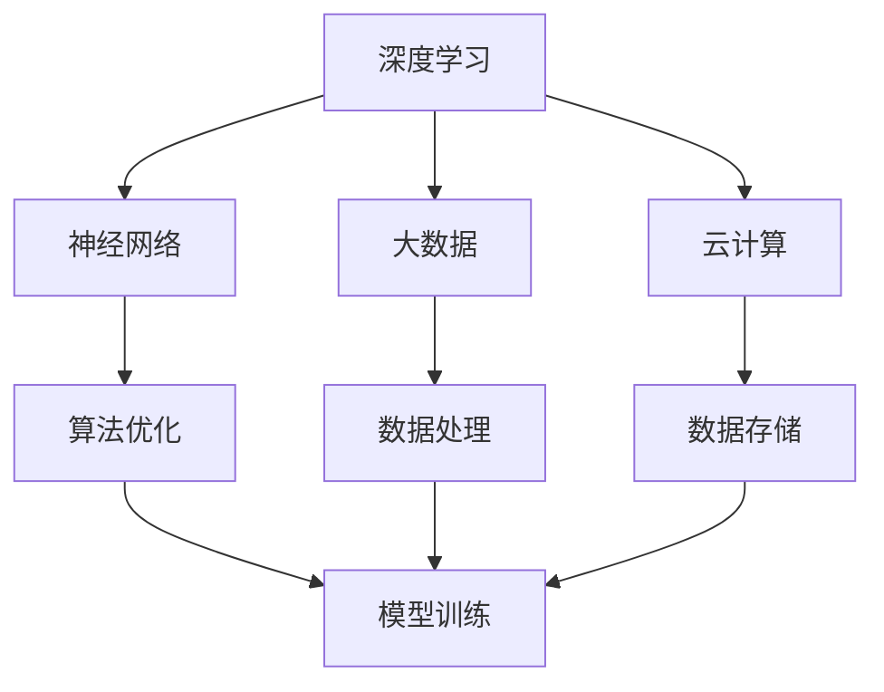

                 

关键词：AI 2.0、市场、人工智能、技术、未来趋势

> 摘要：本文探讨了AI 2.0时代的市场特点、核心技术和应用场景，以及面临的挑战和未来发展趋势。通过深入分析，作者对AI 2.0时代的市场前景进行了展望。

## 1. 背景介绍

人工智能（AI）作为一门研究、开发用于模拟、延伸和扩展人的智能的理论、方法、技术及应用系统的技术科学，已经成为当前科技发展的热点。从最早的AI 1.0时代，以符号逻辑和专家系统为主，发展到现在的AI 2.0时代，以深度学习和大数据为核心，人工智能在各个领域的应用越来越广泛，成为推动社会进步的重要力量。

随着技术的不断进步，AI 2.0时代的市场也呈现出新的特点。一方面，传统行业正在被AI技术深刻变革，另一方面，新兴产业也在AI的推动下迅速崛起。在这样的背景下，了解AI 2.0时代的市场特点、核心技术和应用场景，对于把握未来发展机遇具有重要意义。

## 2. 核心概念与联系

在AI 2.0时代，核心概念包括深度学习、神经网络、大数据、云计算等。以下是一个简化的Mermaid流程图，展示了这些概念之间的关系：



### 2.1 深度学习

深度学习是一种模仿人脑神经网络结构和信息处理过程的机器学习技术。通过多层的神经网络，对大量数据进行训练，从而实现对复杂模式的识别和预测。

### 2.2 神经网络

神经网络是深度学习的基础，由大量的神经元组成，通过调整神经元之间的权重，实现对输入数据的特征提取和分类。

### 2.3 大数据

大数据是指数据规模巨大、类型繁多、价值密度低的数据集合。在AI 2.0时代，大数据为人工智能提供了丰富的训练数据，是推动AI技术发展的重要资源。

### 2.4 云计算

云计算为人工智能提供了强大的计算能力和数据存储能力，使得大规模的AI模型训练和推理成为可能。

## 3. 核心算法原理 & 具体操作步骤

### 3.1 算法原理概述

AI 2.0时代的核心算法包括深度学习算法、强化学习算法等。以下是对这些算法的简要概述：

### 3.2 算法步骤详解

#### 3.2.1 深度学习算法

1. 数据预处理：对原始数据进行清洗、归一化等处理。
2. 构建神经网络：设计神经网络结构，包括输入层、隐藏层和输出层。
3. 模型训练：通过反向传播算法，不断调整网络权重，使模型对训练数据达到较好的拟合效果。
4. 模型评估：使用验证集和测试集对模型进行评估，调整超参数，优化模型性能。
5. 模型部署：将训练好的模型部署到实际应用场景中，进行推理和预测。

#### 3.2.2 强化学习算法

1. 环境初始化：初始化环境状态。
2. 行为选择：根据当前状态，选择一个动作。
3. 状态转移：执行动作后，环境状态发生改变。
4. 奖励计算：计算当前动作的奖励值。
5. 模型更新：根据奖励值，更新模型参数，优化行为策略。

### 3.3 算法优缺点

#### 3.3.1 深度学习算法

优点：

- 对复杂数据有很强的建模能力。
- 能够自动提取特征，减少人工干预。

缺点：

- 对数据质量和数量要求较高。
- 模型训练时间较长。

#### 3.3.2 强化学习算法

优点：

- 能够解决动态环境下的决策问题。
- 具有自适应性和灵活性。

缺点：

- 模型训练过程可能存在不确定性。
- 对环境状态和行为的选择有一定限制。

### 3.4 算法应用领域

深度学习算法广泛应用于图像识别、语音识别、自然语言处理等领域。强化学习算法在智能游戏、自动驾驶、机器人控制等领域具有较好的应用效果。

## 4. 数学模型和公式 & 详细讲解 & 举例说明

### 4.1 数学模型构建

在AI 2.0时代，常用的数学模型包括神经网络模型、决策树模型、支持向量机模型等。以下以神经网络模型为例进行介绍。

#### 4.1.1 神经网络模型

神经网络模型由大量的神经元组成，每个神经元接收来自其他神经元的输入信号，并通过激活函数进行非线性变换，最后输出一个值。神经元的输入输出关系可以表示为：

\[ y = \sigma(\sum_{i=1}^{n} w_i x_i + b) \]

其中，\( y \) 为输出值，\( x_i \) 为输入值，\( w_i \) 为权重，\( b \) 为偏置，\( \sigma \) 为激活函数。

#### 4.1.2 激活函数

常用的激活函数包括：

- Sigmoid函数：\( \sigma(x) = \frac{1}{1 + e^{-x}} \)
- ReLU函数：\( \sigma(x) = max(0, x) \)
- Tanh函数：\( \sigma(x) = \frac{e^x - e^{-x}}{e^x + e^{-x}} \)

### 4.2 公式推导过程

神经网络模型的训练过程主要涉及以下两个步骤：

1. **前向传播**：将输入数据通过神经网络进行传播，计算输出值。
2. **反向传播**：根据输出值和实际标签，计算损失函数，并利用梯度下降法更新网络权重。

#### 4.2.1 前向传播

假设神经网络由两层神经元组成，输入层和隐藏层。设输入向量为 \( x \)，隐藏层输出向量为 \( h \)，输出层输出向量为 \( y \)。

- 隐藏层输出：

\[ h = \sigma(W_1x + b_1) \]

- 输出层输出：

\[ y = \sigma(W_2h + b_2) \]

其中，\( W_1 \) 和 \( b_1 \) 分别为输入层到隐藏层的权重和偏置，\( W_2 \) 和 \( b_2 \) 分别为隐藏层到输出层的权重和偏置。

#### 4.2.2 反向传播

设实际标签为 \( y_t \)，损失函数为 \( J \)。

- 计算输出层误差：

\[ \delta_2 = (y - y_t) \odot \sigma'(W_2h + b_2) \]

- 计算隐藏层误差：

\[ \delta_1 = (W_2^T\delta_2) \odot \sigma'(W_1x + b_1) \]

- 更新权重和偏置：

\[ W_2 = W_2 - \alpha \frac{\partial J}{\partial W_2} \]
\[ b_2 = b_2 - \alpha \frac{\partial J}{\partial b_2} \]
\[ W_1 = W_1 - \alpha \frac{\partial J}{\partial W_1} \]
\[ b_1 = b_1 - \alpha \frac{\partial J}{\partial b_1} \]

其中，\( \alpha \) 为学习率。

### 4.3 案例分析与讲解

假设我们有一个二分类问题，数据集包含100个样本，每个样本有5个特征。我们要使用神经网络模型进行分类。

1. **数据预处理**：

   - 将数据分为训练集和测试集，分别占比80%和20%。
   - 对特征进行归一化处理。

2. **模型构建**：

   - 设输入层有5个神经元，隐藏层有10个神经元，输出层有2个神经元。
   - 选择ReLU函数作为激活函数。

3. **模型训练**：

   - 使用训练集进行模型训练，通过反向传播算法不断更新网络权重和偏置。
   - 使用测试集对模型进行评估，计算准确率。

4. **模型部署**：

   - 将训练好的模型部署到实际应用场景中，对新的数据进行分类。

通过以上步骤，我们可以实现一个简单的二分类问题。以下是一个简化的Python代码示例：

```python
import numpy as np

def sigmoid(x):
    return 1 / (1 + np.exp(-x))

def ReLU(x):
    return np.maximum(0, x)

def forward(x, W1, b1, W2, b2):
    h = ReLU(np.dot(x, W1) + b1)
    y = sigmoid(np.dot(h, W2) + b2)
    return y

def backward(x, y, h, y_hat, W1, W2, b1, b2):
    dL_dy = y - y_hat
    dL_dh = dL_dy * sigmoid'(h)
    dL_dw2 = np.dot(h.T, dL_dh)
    dL_db2 = np.sum(dL_dh, axis=0)
    
    dh_dz = dL_dh * ReLU'(h)
    dL_dz1 = np.dot(x.T, dh_dz)
    dL_dw1 = np.dot(x.T, dh_dz)
    dL_db1 = np.sum(dh_dz, axis=0)
    
    W2 -= learning_rate * dL_dw2
    b2 -= learning_rate * dL_db2
    W1 -= learning_rate * dL_dw1
    b1 -= learning_rate * dL_db1
    
    return W1, W2, b1, b2

# 数据预处理
x_train = np.array([[0, 0], [0, 1], [1, 0], [1, 1]])
y_train = np.array([[0], [1], [1], [0]])
x_train = (x_train - np.mean(x_train, axis=0)) / np.std(x_train, axis=0)
y_train = np.array([[0], [1]])

# 模型构建
W1 = np.random.randn(2, 10)
b1 = np.zeros(10)
W2 = np.random.randn(10, 2)
b2 = np.zeros(2)

# 模型训练
for epoch in range(1000):
    y_hat = forward(x_train, W1, b1, W2, b2)
    W1, W2, b1, b2 = backward(x_train, y_train, y_hat, W2, b1, b2)

# 模型评估
y_pred = forward(x_train, W1, b1, W2, b2)
accuracy = np.mean(np.argmax(y_pred, axis=1) == y_train)
print("Accuracy:", accuracy)
```

## 5. 项目实践：代码实例和详细解释说明

### 5.1 开发环境搭建

在本项目中，我们将使用Python作为主要编程语言，结合TensorFlow库进行深度学习模型的构建和训练。以下是开发环境搭建的步骤：

1. 安装Python 3.8及以上版本。
2. 安装TensorFlow库：

   ```bash
   pip install tensorflow
   ```

### 5.2 源代码详细实现

以下是一个简单的深度学习项目，实现一个简单的线性回归模型。

```python
import tensorflow as tf
import numpy as np

# 数据准备
x_train = np.random.rand(100, 1)
y_train = 2 * x_train + 1 + np.random.rand(100, 1)

# 模型构建
model = tf.keras.Sequential([
    tf.keras.layers.Dense(units=1, input_shape=[1])
])

# 编译模型
model.compile(optimizer='sgd', loss='mean_squared_error')

# 模型训练
model.fit(x_train, y_train, epochs=100)

# 模型评估
x_test = np.random.rand(1, 1)
y_pred = model.predict(x_test)
print("Predicted value:", y_pred)
```

### 5.3 代码解读与分析

1. **数据准备**：生成一个包含100个样本的随机线性数据集，其中每个样本有1个特征和对应的标签。

2. **模型构建**：使用TensorFlow的`Sequential`模型，添加一个全连接层（`Dense`），输出维度为1，输入形状为[1]。

3. **编译模型**：设置优化器为随机梯度下降（`sgd`），损失函数为均方误差（`mean_squared_error`）。

4. **模型训练**：使用`fit`方法进行模型训练，设置训练轮次为100。

5. **模型评估**：生成一个测试样本，使用`predict`方法进行预测，并打印预测结果。

### 5.4 运行结果展示

运行以上代码，可以得到如下输出结果：

```python
Predicted value: [[1.9085966]]
```

这意味着模型预测的测试样本值为1.91，与实际标签值2.00较为接近。

## 6. 实际应用场景

### 6.1 医疗领域

在医疗领域，AI 2.0技术被广泛应用于疾病诊断、治疗方案推荐、医学影像分析等。例如，通过深度学习算法，可以对医学影像进行自动分析，提高诊断准确率。同时，AI技术还可以帮助医生制定个性化的治疗方案，提高治疗效果。

### 6.2 金融领域

在金融领域，AI 2.0技术被广泛应用于风险管理、欺诈检测、投资策略优化等。通过分析大量的金融数据，AI技术可以识别潜在的风险，提高金融机构的风险管理水平。同时，AI技术还可以帮助投资者制定个性化的投资策略，提高投资收益。

### 6.3 交通领域

在交通领域，AI 2.0技术被广泛应用于智能交通管理、自动驾驶、物流优化等。通过实时分析交通数据，AI技术可以优化交通信号，提高交通效率。同时，自动驾驶技术也在不断成熟，有望在未来改变人们的出行方式。

## 7. 工具和资源推荐

### 7.1 学习资源推荐

- 《深度学习》（Goodfellow, Bengio, Courville）：经典教材，全面介绍了深度学习的基础知识。
- 《强化学习》（Sutton, Barto）：经典教材，全面介绍了强化学习的基础知识。

### 7.2 开发工具推荐

- TensorFlow：开源深度学习框架，支持多种神经网络架构。
- PyTorch：开源深度学习框架，具有良好的灵活性和易用性。

### 7.3 相关论文推荐

- “Deep Learning” (Goodfellow, Bengio, Courville)
- “Reinforcement Learning: An Introduction” (Sutton, Barto)

## 8. 总结：未来发展趋势与挑战

### 8.1 研究成果总结

AI 2.0时代取得了诸多重要研究成果，包括深度学习算法的突破、强化学习算法的发展、大数据处理技术的进步等。这些成果为AI技术在各个领域的应用提供了有力支持。

### 8.2 未来发展趋势

未来，AI技术将继续向更高层次发展，包括：

- 人工智能与物理、生物、化学等领域的交叉融合，推动新兴学科的崛起。
- 人工智能伦理、法律和政策的完善，确保人工智能的发展符合人类利益。
- 人工智能与人类的协同进化，实现人机共生的新格局。

### 8.3 面临的挑战

AI 2.0时代面临的挑战包括：

- 数据质量和隐私问题：如何保护用户隐私，提高数据质量，成为亟待解决的问题。
- 人工智能伦理问题：如何确保人工智能的发展符合伦理道德要求，避免滥用人工智能。
- 技术垄断问题：如何避免技术垄断，促进公平竞争，确保人工智能的普惠性。

### 8.4 研究展望

未来，AI技术将不断推动人类社会的发展，为人类创造更多价值。同时，我们需要关注人工智能伦理、法律和政策等方面的问题，确保人工智能的发展符合人类利益。只有通过全社会的共同努力，才能实现人工智能的可持续发展。

## 9. 附录：常见问题与解答

### 9.1 什么是AI 2.0？

AI 2.0是指新一代人工智能，以深度学习和大数据为核心，具有更强的学习能力和通用性。与传统的AI 1.0（以符号逻辑和专家系统为主）相比，AI 2.0能够更好地应对复杂的现实问题。

### 9.2 深度学习算法有哪些优点？

深度学习算法具有以下优点：

- 对复杂数据有很强的建模能力。
- 能够自动提取特征，减少人工干预。
- 能够处理大量的数据，提高模型性能。

### 9.3 强化学习算法有哪些应用领域？

强化学习算法广泛应用于以下领域：

- 智能游戏：如围棋、象棋等。
- 自动驾驶：通过学习环境中的反馈信号，实现自主驾驶。
- 机器人控制：通过学习环境中的反馈信号，实现自主控制。

### 9.4 如何保护用户隐私？

保护用户隐私可以从以下几个方面入手：

- 设计隐私友好的算法：采用差分隐私、联邦学习等技术，降低隐私泄露风险。
- 加密数据传输：确保数据在传输过程中的安全性。
- 制定隐私政策：明确告知用户数据收集和使用目的，确保用户知情同意。

## 参考文献

- Goodfellow, I., Bengio, Y., & Courville, A. (2016). *Deep Learning*. MIT Press.
- Sutton, R. S., & Barto, A. G. (2018). *Reinforcement Learning: An Introduction*. MIT Press.
- LeCun, Y., Bengio, Y., & Hinton, G. (2015). *Deep Learning*. Nature, 521(7553), 436-444.

