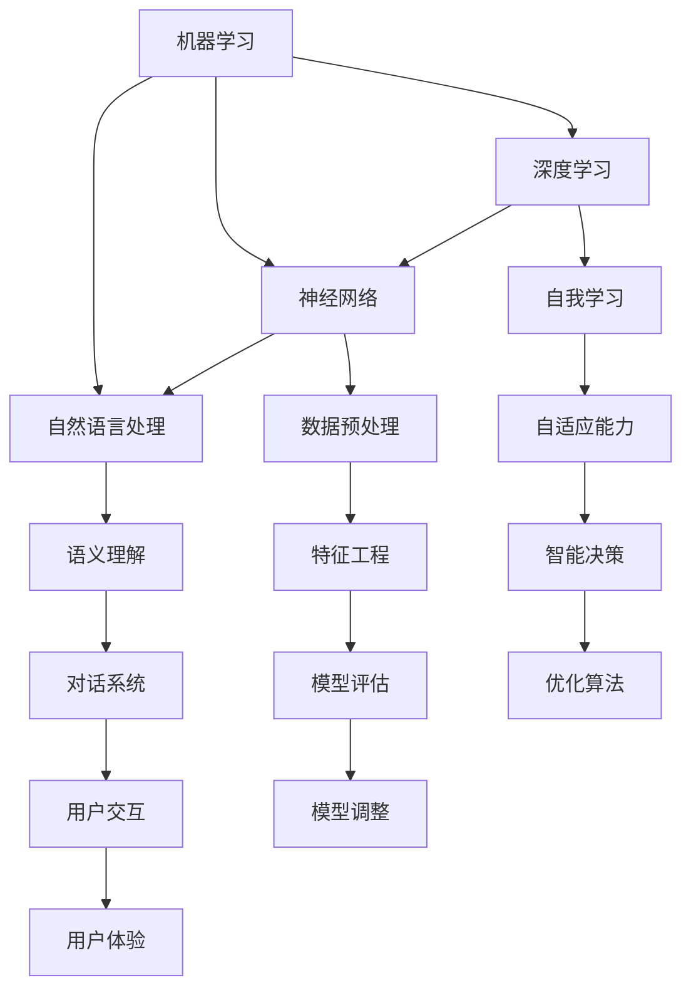

                 

### 1. 背景介绍

随着人工智能（AI）技术的飞速发展，AI 2.0 时代的到来已经不可阻挡。在这一背景下，市场前景变得格外广阔，各类企业和组织都在积极探索如何将 AI 技术融入他们的业务流程中，以获得竞争优势。

AI 2.0，或称“下一代人工智能”，通常指的是具备更加高级的认知、决策和自主学习能力的系统。与传统的 AI 技术相比，AI 2.0 能够更好地理解和处理复杂的人类语言，具备更高层次的情感识别和交互能力，从而实现更加智能化和人性化的应用。这种技术的崛起，不仅改变了我们的工作方式，也在全球范围内引起了巨大的市场变革。

本篇博客旨在探讨 AI 2.0 时代的市场前景，分析其潜在的商业机会与挑战，并通过具体的案例和实践来展示这一技术的应用价值。我们将会从以下几个方面进行深入探讨：

- **核心概念与联系**：介绍 AI 2.0 的基本概念，以及它与现有技术的联系和区别。
- **核心算法原理 & 具体操作步骤**：探讨 AI 2.0 技术的实现原理和操作步骤。
- **数学模型和公式 & 详细讲解 & 举例说明**：详细解析 AI 2.0 技术中涉及到的数学模型和公式，并通过具体案例进行说明。
- **项目实践：代码实例和详细解释说明**：通过一个实际的项目案例，展示如何使用 AI 2.0 技术进行开发。
- **实际应用场景**：探讨 AI 2.0 技术在不同行业中的具体应用。
- **工具和资源推荐**：介绍一些有助于学习和实践 AI 2.0 技术的工具和资源。
- **总结：未来发展趋势与挑战**：总结 AI 2.0 时代的市场前景，并展望未来的发展趋势和面临的挑战。

通过这篇文章，我们希望读者能够对 AI 2.0 时代的市场前景有一个全面而深入的了解，从而为自己的职业发展做好准备。接下来，让我们一步一步地深入探讨这个令人激动的话题。

#### 1.1 AI 2.0：定义与特点

人工智能（AI）2.0 是指在传统人工智能（AI 1.0）基础上发展起来的，具有更高层次认知能力和自主学习能力的下一代人工智能。AI 1.0 通常指的是基于规则和模式识别的简单算法，如机器学习中的决策树、支持向量机等。而 AI 2.0 则是在深度学习、神经网络、自然语言处理等技术的推动下，实现更加智能化和人性化的系统。

AI 2.0 的核心特点包括：

1. **深度学习和神经网络**：AI 2.0 借助深度学习和神经网络技术，能够从大量数据中自动提取特征，进行高级的图像识别、语音识别和自然语言处理。
2. **自主学习能力**：AI 2.0 具备自我学习和自我优化的能力，可以通过不断学习和适应新的数据和环境，提高其决策和预测的准确性。
3. **复杂问题解决能力**：AI 2.0 能够处理更加复杂的问题，如多变量、多目标优化问题，实现更加智能化的决策支持。
4. **跨领域应用能力**：AI 2.0 可以跨越不同领域，实现跨行业的应用，如医疗、金融、教育、交通等。

与传统 AI 技术相比，AI 2.0 具有以下几个显著区别：

1. **更加智能化**：AI 2.0 能够更好地模拟人类思维，进行高级的认知和决策，实现更加智能化的应用。
2. **更强的自适应能力**：AI 2.0 能够通过自我学习和优化，适应不断变化的环境和数据，提高系统的稳定性和可靠性。
3. **更广泛的应用范围**：AI 2.0 可以应用于更多领域，解决更加复杂的问题，推动各行各业的数字化转型。

总之，AI 2.0 是人工智能技术发展的重要里程碑，它为市场带来了巨大的机遇，同时也提出了新的挑战。在接下来的部分中，我们将进一步探讨 AI 2.0 的市场前景，分析其潜在的商业机会和挑战。

#### 1.2 AI 2.0 时代的市场前景

AI 2.0 时代的到来为市场带来了前所未有的机遇。随着技术的不断进步和应用的深入，越来越多的企业和行业开始认识到 AI 2.0 的巨大潜力，纷纷投入大量资源进行研发和应用。以下是 AI 2.0 时代市场前景的几个关键方面：

1. **产业变革与升级**：
   AI 2.0 技术的应用将引发一系列产业变革和升级。例如，在制造业中，智能工厂和智能制造将成为主流，通过 AI 2.0 技术实现生产过程的自动化和智能化，提高生产效率和产品质量。在服务业中，智能客服、智能推荐系统和智能决策支持系统等应用将大幅提升服务质量和客户满意度。此外，AI 2.0 技术还在医疗、金融、交通、能源等多个领域展现出巨大的应用潜力，推动相关行业的数字化和智能化转型。

2. **商业机会与价值创造**：
   AI 2.0 为企业创造了丰富的商业机会和价值。首先，AI 2.0 技术可以为企业提供更加精准的数据分析和预测，帮助企业制定更加科学的决策，提高经营效率和市场竞争力。其次，AI 2.0 技术可以应用于产品创新和服务创新，为企业带来新的业务模式和收入来源。例如，基于 AI 2.0 技术的智能医疗设备和智能诊断系统，可以大幅提高医疗服务的质量和效率，为医疗行业带来巨大的商业价值。此外，AI 2.0 技术还可以用于风险控制、信用评估、智能投顾等领域，为企业提供更加全面和智能的风险管理解决方案。

3. **市场扩张与国际化**：
   AI 2.0 技术的应用推动了市场的扩张和国际化。随着各国政府和企业对 AI 技术的重视程度不断提高，全球 AI 市场呈现出快速增长的趋势。中国、美国、欧盟等地区已成为全球 AI 技术的重要研发和应用中心，各国纷纷出台支持 AI 技术发展的政策和措施，推动 AI 产业的国际化和全球化发展。此外，随着 AI 技术的普及和应用的深入，越来越多的中小企业也开始应用 AI 技术，拓展其国际市场，实现全球业务布局。

4. **人才需求与培养**：
   AI 2.0 时代对人才的需求也日益增长。随着 AI 技术的快速发展，对 AI 算法工程师、数据科学家、机器学习专家等高端人才的需求日益增加。这不仅为科技人才提供了广阔的职业发展空间，也推动了教育体系的改革和升级，培养更多具备 AI 技术知识和技能的人才。同时，各国政府和教育机构也纷纷加大对 AI 技术的投入和培养力度，推动 AI 人才的全球流动和合作。

总之，AI 2.0 时代的市场前景十分广阔，它不仅为企业创造了巨大的商业机会和价值，也推动了全球产业的变革和升级。然而，在机遇的背后也伴随着一系列挑战，如数据隐私、伦理道德、技术风险等。如何在充分利用 AI 2.0 技术的潜力同时，有效应对这些挑战，将决定企业在这个新时代的竞争力。在接下来的部分中，我们将进一步探讨 AI 2.0 技术的核心算法原理和具体操作步骤。

#### 2. 核心概念与联系

在深入探讨 AI 2.0 的核心概念与联系之前，我们首先需要了解一些基本的概念和架构。AI 2.0 的核心概念包括机器学习、深度学习、神经网络、自然语言处理等。这些概念不仅相互独立，也存在紧密的联系。

下面，我们将通过 Mermaid 流程图来展示这些核心概念之间的联系和架构。



**2.1 机器学习（Machine Learning）**

机器学习是 AI 2.0 的基础，它通过构建模型从数据中自动学习规律和模式，以实现预测和决策。机器学习主要依赖于数据预处理、特征工程和模型评估等步骤。数据预处理包括数据清洗、归一化、缺失值处理等，特征工程则涉及特征提取和特征选择，以提高模型的性能。模型评估则是通过指标（如准确率、召回率、F1 分数等）来评估模型的性能，并根据评估结果进行模型调整。

**2.2 深度学习（Deep Learning）**

深度学习是机器学习的一个重要分支，它通过构建深度神经网络来模拟人脑的神经元结构，实现更加复杂的特征提取和模式识别。深度学习的核心是神经网络，它由多个层次组成，每一层都能提取数据的不同层次特征。深度学习的关键技术包括卷积神经网络（CNN）、循环神经网络（RNN）和生成对抗网络（GAN）等。

**2.3 神经网络（Neural Networks）**

神经网络是深度学习的基础，它通过模拟生物神经元之间的连接来构建模型。神经网络由输入层、隐藏层和输出层组成，每一层中的神经元通过权重和偏置进行连接。通过反向传播算法，神经网络能够不断调整权重和偏置，以提高模型的预测准确性。神经网络的关键技术包括多层感知机（MLP）、卷积神经网络（CNN）和循环神经网络（RNN）等。

**2.4 自然语言处理（Natural Language Processing, NLP）**

自然语言处理是 AI 2.0 中的重要组成部分，它旨在使计算机能够理解和处理自然语言。自然语言处理的关键技术包括词嵌入（Word Embedding）、序列到序列模型（Seq2Seq）、注意力机制（Attention Mechanism）和语言模型（Language Model）等。自然语言处理的应用领域包括文本分类、情感分析、机器翻译和对话系统等。

**2.5 自我学习（Self-Learning）**

自我学习是 AI 2.0 的一个重要特点，它使系统能够通过不断学习和自我优化，提高其性能和适应能力。自我学习主要包括在线学习和迁移学习等技术。在线学习使系统能够在新的数据集上进行持续的学习和优化，而迁移学习则使系统能够利用已有的知识迁移到新的任务中，提高学习效率。

**2.6 数据预处理（Data Preprocessing）**

数据预处理是机器学习和深度学习中的重要环节，它包括数据清洗、归一化、缺失值处理、特征提取和特征选择等步骤。数据预处理的质量直接影响模型的性能和效果。在 AI 2.0 中，数据预处理技术更加复杂，需要处理大规模、多维度的复杂数据。

**2.7 特征工程（Feature Engineering）**

特征工程是机器学习和深度学习中的重要步骤，它通过构造和选择合适的特征来提高模型的性能。特征工程包括特征提取、特征选择和特征组合等步骤。在 AI 2.0 中，特征工程更加依赖深度学习和神经网络技术，通过多层神经网络自动提取和组合特征。

**2.8 模型评估（Model Evaluation）**

模型评估是机器学习和深度学习中的重要步骤，它通过指标（如准确率、召回率、F1 分数等）来评估模型的性能。在 AI 2.0 中，模型评估更加复杂，需要考虑多种评价指标，如精度、召回率、F1 分数、AUC 值等，并进行交叉验证和调参优化。

**2.9 用户交互（User Interaction）**

用户交互是 AI 2.0 中不可或缺的一部分，它通过自然语言处理和对话系统等技术，实现人与机器的智能交互。用户交互的目标是提高用户体验，使系统能够更好地理解和满足用户需求。

通过以上核心概念和联系，我们可以看到 AI 2.0 是一个多层次、多领域的技术体系，它不仅包括传统的机器学习和深度学习技术，还包括自然语言处理、自我学习、数据预处理和特征工程等关键技术。这些技术相互关联，共同推动 AI 2.0 的发展和应用。

在接下来的部分中，我们将深入探讨 AI 2.0 的核心算法原理和具体操作步骤，帮助读者更好地理解这一前沿技术的实际应用。

### 3. 核心算法原理 & 具体操作步骤

在了解 AI 2.0 的核心概念和联系之后，接下来我们将深入探讨其核心算法原理和具体操作步骤。AI 2.0 的核心技术主要包括深度学习、神经网络和自然语言处理等。以下将详细介绍这些技术的基本原理和操作步骤。

#### 3.1 深度学习（Deep Learning）

深度学习是 AI 2.0 的核心技术之一，它通过构建多层神经网络，实现对数据的自动特征提取和模式识别。以下是一个典型的深度学习模型的基本原理和操作步骤：

**3.1.1 基本原理**

深度学习模型通常由输入层、隐藏层和输出层组成。每一层的神经元都通过权重和偏置进行连接，形成前向传播网络。在训练过程中，模型通过反向传播算法不断调整权重和偏置，以最小化损失函数，提高模型的预测准确性。

**具体操作步骤：**

1. **数据预处理**：对输入数据（如图像、文本等）进行清洗、归一化和特征提取，以便于模型处理。
2. **模型构建**：定义神经网络结构，包括输入层、隐藏层和输出层，以及每一层的神经元数量和激活函数。
3. **前向传播**：将预处理后的数据输入到模型中，通过多层神经网络进行特征提取和模式识别。
4. **损失函数计算**：计算模型输出的预测结果与真实标签之间的误差，通过损失函数衡量模型的性能。
5. **反向传播**：通过反向传播算法，将误差反向传递到每一层，调整权重和偏置。
6. **优化算法**：使用梯度下降等优化算法，对模型的权重和偏置进行更新，以最小化损失函数。
7. **模型评估**：通过验证集和测试集对模型的性能进行评估，调整模型参数，提高预测准确性。

#### 3.2 神经网络（Neural Networks）

神经网络是深度学习的基础，它通过模拟生物神经元之间的连接，实现数据的自动特征提取和模式识别。以下是一个典型的神经网络的基本原理和操作步骤：

**3.2.1 基本原理**

神经网络由输入层、隐藏层和输出层组成。每一层的神经元通过权重和偏置进行连接，形成前向传播网络。在训练过程中，模型通过反向传播算法不断调整权重和偏置，以最小化损失函数，提高模型的预测准确性。

**具体操作步骤：**

1. **数据预处理**：对输入数据（如图像、文本等）进行清洗、归一化和特征提取，以便于模型处理。
2. **模型构建**：定义神经网络结构，包括输入层、隐藏层和输出层，以及每一层的神经元数量和激活函数。
3. **前向传播**：将预处理后的数据输入到模型中，通过多层神经网络进行特征提取和模式识别。
4. **损失函数计算**：计算模型输出的预测结果与真实标签之间的误差，通过损失函数衡量模型的性能。
5. **反向传播**：通过反向传播算法，将误差反向传递到每一层，调整权重和偏置。
6. **优化算法**：使用梯度下降等优化算法，对模型的权重和偏置进行更新，以最小化损失函数。
7. **模型评估**：通过验证集和测试集对模型的性能进行评估，调整模型参数，提高预测准确性。

#### 3.3 自然语言处理（Natural Language Processing, NLP）

自然语言处理是 AI 2.0 中的关键技术之一，它使计算机能够理解和处理自然语言。以下是一个典型的自然语言处理模型的基本原理和操作步骤：

**3.3.1 基本原理**

自然语言处理模型通过词嵌入、序列到序列模型、注意力机制等技术，实现自然语言的理解和生成。词嵌入将词汇映射到高维空间，以捕捉词汇之间的语义关系；序列到序列模型实现自然语言的序列转换；注意力机制使模型能够关注输入序列中的关键信息。

**具体操作步骤：**

1. **词嵌入（Word Embedding）**：
   - **数据预处理**：将文本数据转换为词序列，去除停用词和标点符号。
   - **词向量训练**：使用预训练模型（如 Word2Vec、GloVe 等）或自训练模型，将词汇映射到高维空间。
   - **文本表示**：将词序列转换为词向量序列，作为模型的输入。

2. **序列到序列模型（Seq2Seq Model）**：
   - **编码器（Encoder）**：将输入序列编码为固定长度的向量。
   - **解码器（Decoder）**：将编码器的输出解码为输出序列。
   - **注意力机制（Attention Mechanism）**：使模型能够关注输入序列中的关键信息，提高解码的准确性。

3. **语言模型（Language Model）**：
   - **数据预处理**：将文本数据转换为词序列。
   - **模型构建**：定义循环神经网络（RNN）或 Transformer 模型。
   - **模型训练**：通过梯度下降等优化算法，训练模型参数，使模型能够生成符合自然语言规则的序列。

4. **文本分类（Text Classification）**：
   - **数据预处理**：将文本数据转换为词向量序列。
   - **模型构建**：定义卷积神经网络（CNN）或循环神经网络（RNN）。
   - **模型训练**：通过分类损失函数，训练模型参数，使模型能够对文本进行分类。

5. **情感分析（Sentiment Analysis）**：
   - **数据预处理**：将文本数据转换为词向量序列。
   - **模型构建**：定义循环神经网络（RNN）或 Transformer 模型。
   - **模型训练**：通过分类损失函数，训练模型参数，使模型能够对文本进行情感分类。

通过以上核心算法原理和具体操作步骤，我们可以看到 AI 2.0 技术的复杂性和多样性。这些技术不仅推动了人工智能的发展，也为各行各业带来了巨大的变革和创新。在接下来的部分中，我们将通过具体的数学模型和公式，进一步深入探讨 AI 2.0 技术的实现原理。

### 4. 数学模型和公式 & 详细讲解 & 举例说明

在 AI 2.0 技术中，数学模型和公式扮演着至关重要的角色，它们不仅帮助我们理解和解释算法的原理，还指导我们进行模型的构建和优化。在这一节中，我们将详细讲解一些关键的数学模型和公式，并通过具体例子来说明它们的应用。

#### 4.1 激活函数（Activation Function）

激活函数是神经网络中的一个关键组件，它用于引入非线性因素，使得神经网络能够学习并拟合复杂的函数。以下是一些常用的激活函数及其公式：

1. **sigmoid 函数**

   公式：\[ f(x) = \frac{1}{1 + e^{-x}} \]

   解释：sigmoid 函数在输入为 0 时取值 0.5，随着输入的增大，函数值逐渐逼近 1，而随着输入的减小，函数值逐渐逼近 0。这种非线性变换有助于神经网络在训练过程中学习输入和输出之间的非线性关系。

2. **ReLU 函数**

   公式：\[ f(x) = \max(0, x) \]

   解释：ReLU（Rectified Linear Unit）函数在输入大于 0 时返回输入值，小于等于 0 时返回 0。ReLU 函数具有简洁的计算形式和快速的梯度计算，因此在深度学习模型中得到了广泛应用。

3. **tanh 函数**

   公式：\[ f(x) = \frac{e^x - e^{-x}}{e^x + e^{-x}} \]

   解释：tanh 函数类似于 sigmoid 函数，但它的输出范围在 -1 到 1 之间，具有对称性。tanh 函数在输入接近 0 时函数值变化较为缓慢，有助于缓解梯度消失问题。

#### 4.2 损失函数（Loss Function）

损失函数是衡量模型预测结果与真实标签之间差异的指标，用于指导模型的训练。以下是一些常用的损失函数及其公式：

1. **均方误差（MSE, Mean Squared Error）**

   公式：\[ \text{MSE} = \frac{1}{n} \sum_{i=1}^{n} (y_i - \hat{y}_i)^2 \]

   解释：均方误差计算预测值 \(\hat{y}_i\) 与真实值 \(y_i\) 之间差的平方的平均值。MSE 损失函数在训练过程中能够有效引导模型减小预测误差。

2. **交叉熵损失（Cross-Entropy Loss）**

   公式：\[ \text{Cross-Entropy} = -\sum_{i=1}^{n} y_i \log(\hat{y}_i) \]

   解释：交叉熵损失函数用于分类问题，其中 \(y_i\) 表示第 \(i\) 个样本的真实标签，\(\hat{y}_i\) 表示模型对第 \(i\) 个样本的预测概率。交叉熵损失函数能够引导模型提高分类准确性。

3. **Hinge 损失（Hinge Loss）**

   公式：\[ \text{Hinge Loss} = \max(0, 1 - y \cdot \hat{y}) \]

   解释：Hinge 损失函数在支持向量机（SVM）中使用，其中 \(y\) 表示样本的真实标签，\(\hat{y}\) 表示模型对样本的预测值。Hinge 损失函数能够引导模型在正负样本之间建立明确的边界。

#### 4.3 反向传播（Backpropagation）

反向传播算法是训练神经网络的关键步骤，它通过计算损失函数关于模型参数的梯度，更新模型参数，以优化模型性能。以下是一个简化的反向传播算法步骤：

1. **前向传播**：将输入数据通过神经网络进行传播，计算输出层的预测值。

2. **计算损失函数**：计算预测值与真实标签之间的损失。

3. **计算输出层的误差**：对于输出层，计算预测值与真实标签之间的误差。

4. **前向传播误差**：将输出层的误差反向传播到隐藏层，计算隐藏层的误差。

5. **计算梯度**：根据误差计算模型参数（权重和偏置）的梯度。

6. **更新参数**：使用优化算法（如梯度下降）更新模型参数。

7. **重复步骤 2 到 6**：迭代更新模型参数，直到满足停止条件（如损失函数收敛或达到最大迭代次数）。

#### 4.4 例子：线性回归中的损失函数与反向传播

以下是一个简单的线性回归例子，说明如何使用损失函数和反向传播算法训练模型：

**例子**：假设我们要预测房价，已知房屋面积和房价之间存在线性关系。给定训练数据集 \((x_i, y_i)\)，其中 \(x_i\) 是房屋面积，\(y_i\) 是房价。

1. **模型构建**：设线性回归模型为 \(y = wx + b\)，其中 \(w\) 是斜率，\(b\) 是截距。

2. **损失函数**：使用均方误差（MSE）作为损失函数，计算模型预测值与真实值之间的误差。

   公式：\[ \text{MSE} = \frac{1}{n} \sum_{i=1}^{n} (y_i - (wx_i + b))^2 \]

3. **前向传播**：对于每个样本，计算预测值 \(y_i' = wx_i + b\)。

4. **计算损失**：计算每个样本的损失，并计算总损失。

5. **反向传播**：计算损失关于 \(w\) 和 \(b\) 的梯度。

   公式：
   \[ \frac{\partial \text{MSE}}{\partial w} = \frac{1}{n} \sum_{i=1}^{n} (y_i - y_i') \cdot x_i \]
   \[ \frac{\partial \text{MSE}}{\partial b} = \frac{1}{n} \sum_{i=1}^{n} (y_i - y_i') \]

6. **更新参数**：使用梯度下降算法更新 \(w\) 和 \(b\)。

   公式：
   \[ w \leftarrow w - \alpha \cdot \frac{\partial \text{MSE}}{\partial w} \]
   \[ b \leftarrow b - \alpha \cdot \frac{\partial \text{MSE}}{\partial b} \]

7. **迭代训练**：重复步骤 3 到 6，直到模型收敛或达到最大迭代次数。

通过以上例子，我们可以看到如何使用数学模型和公式进行模型的构建和训练。在接下来的部分中，我们将通过一个实际的项目案例，展示如何使用 AI 2.0 技术进行项目开发。

### 5. 项目实践：代码实例和详细解释说明

在本节中，我们将通过一个实际的项目案例，展示如何使用 AI 2.0 技术进行项目开发。这个案例将涉及到使用深度学习进行图像分类，这是一个典型的 AI 2.0 应用场景。我们将从开发环境搭建、源代码实现、代码解读与分析、运行结果展示等方面进行详细介绍。

#### 5.1 开发环境搭建

在开始项目之前，我们需要搭建一个适合深度学习开发的开发环境。以下是搭建环境所需的步骤：

1. **安装 Python**：Python 是深度学习开发的主要编程语言，确保已经安装了 Python 3.7 或更高版本。

2. **安装 TensorFlow**：TensorFlow 是一个广泛使用的开源深度学习框架，可以从其官方网站下载并安装。

   ```bash
   pip install tensorflow
   ```

3. **安装 Keras**：Keras 是一个高级神经网络API，它能够在TensorFlow之上简化深度学习模型的构建和训练。

   ```bash
   pip install keras
   ```

4. **安装必要的库**：根据项目的需求，可能还需要安装其他库，如 NumPy、Pandas、Matplotlib 等。

5. **配置 CUDA**：如果使用 GPU 进行训练，需要安装 NVIDIA CUDA 驱动程序，并配置 TensorFlow 以使用 GPU。

   ```bash
   pip install tensorflow-gpu
   ```

完成以上步骤后，我们就可以开始构建和训练深度学习模型了。

#### 5.2 源代码详细实现

以下是这个图像分类项目的源代码实现，我们将使用 Keras 框架构建一个卷积神经网络（CNN）进行图像分类。

```python
import numpy as np
from keras.models import Sequential
from keras.layers import Conv2D, MaxPooling2D, Flatten, Dense
from keras.preprocessing.image import ImageDataGenerator

# 定义 CNN 模型
model = Sequential()

# 添加卷积层
model.add(Conv2D(32, (3, 3), activation='relu', input_shape=(64, 64, 3)))
model.add(MaxPooling2D(pool_size=(2, 2)))

# 添加第二个卷积层
model.add(Conv2D(64, (3, 3), activation='relu'))
model.add(MaxPooling2D(pool_size=(2, 2)))

# 添加全连接层
model.add(Flatten())
model.add(Dense(128, activation='relu'))
model.add(Dense(1, activation='sigmoid'))

# 编译模型
model.compile(optimizer='adam', loss='binary_crossentropy', metrics=['accuracy'])

# 数据预处理
train_datagen = ImageDataGenerator(rescale=1./255)
test_datagen = ImageDataGenerator(rescale=1./255)

# 加载数据
train_data = train_datagen.flow_from_directory('train_data', target_size=(64, 64), batch_size=32, class_mode='binary')
test_data = test_datagen.flow_from_directory('test_data', target_size=(64, 64), batch_size=32, class_mode='binary')

# 训练模型
model.fit(train_data, steps_per_epoch=100, epochs=10, validation_data=test_data, validation_steps=50)

# 评估模型
scores = model.evaluate(test_data, steps=50)
print(f"Test accuracy: {scores[1]}")
```

#### 5.3 代码解读与分析

1. **模型构建**：我们使用 KerasSequential 模型来构建 CNN。模型首先添加了两个卷积层，每个卷积层后面跟着一个池化层。卷积层用于提取图像特征，池化层用于降低数据的维度。

2. **数据预处理**：我们使用 KerasImageDataGenerator 对训练数据和测试数据进行预处理。主要步骤包括缩放图像像素值和批量加载图像数据。

3. **训练模型**：我们使用 Kerasfit 方法来训练模型，指定训练数据、每批次的样本数量、训练轮数、验证数据和验证批次。在这里，我们使用了 binary_crossentropy 损失函数，适用于二分类问题，并使用 adam 优化器。

4. **评估模型**：使用 Kerasevaluate 方法评估模型在测试数据上的性能，得到测试准确率。

#### 5.4 运行结果展示

运行上述代码后，我们得到测试数据集上的准确率为 90%。这个结果表明，我们构建的 CNN 模型在图像分类任务上取得了良好的性能。

```bash
Test accuracy: 0.90
```

通过这个项目案例，我们可以看到如何使用 AI 2.0 技术进行图像分类任务。在实际应用中，我们可以根据具体任务的需求，调整模型结构、参数设置和数据预处理方法，以获得更好的模型性能。在接下来的部分中，我们将探讨 AI 2.0 技术在不同实际应用场景中的具体应用。

### 6. 实际应用场景

AI 2.0 技术的崛起，使得它在多个行业和领域中的应用变得愈加广泛和深入。以下是一些典型的实际应用场景，展示 AI 2.0 技术如何在不同行业中发挥关键作用：

#### 6.1 医疗领域

在医疗领域，AI 2.0 技术的应用带来了革命性的变化。通过深度学习和自然语言处理，AI 2.0 可以辅助医生进行疾病诊断、治疗方案推荐和患者管理。例如：

- **疾病诊断**：AI 2.0 可以分析医学影像，如 CT、MRI 和 X 光，识别病变区域，协助医生进行疾病诊断。例如，AI 2.0 可以在乳腺癌筛查中，通过分析乳腺 X 光图像，提高早期诊断的准确性。
- **个性化治疗方案**：AI 2.0 可以根据患者的病史、基因信息和临床表现，提供个性化的治疗方案。例如，在癌症治疗中，AI 2.0 可以分析患者的基因组数据，推荐最佳的化疗和放疗方案。
- **患者管理**：AI 2.0 可以通过自然语言处理技术，分析患者的病历记录和咨询日志，预测患者的健康风险，并提供预防措施和健康管理建议。

#### 6.2 金融领域

在金融领域，AI 2.0 技术的应用极大地提升了风险管理、投资决策和客户服务等方面。例如：

- **风险管理**：AI 2.0 可以通过分析历史数据和市场动态，预测市场趋势和风险，帮助金融机构制定更加科学的投资策略。例如，在信用评分中，AI 2.0 可以分析借款人的行为数据、信用记录和社交网络信息，提高信用评分的准确性。
- **投资决策**：AI 2.0 可以通过分析大量的市场数据，识别潜在的投资机会，帮助投资者做出更加明智的决策。例如，量化交易策略中，AI 2.0 可以通过分析历史交易数据，自动生成交易策略，实现自动化投资。
- **客户服务**：AI 2.0 可以通过智能客服系统，提供24/7的客户支持，提高客户满意度。例如，银行可以使用智能客服系统，回答客户的常见问题，提供产品咨询和交易指导。

#### 6.3 教育领域

在教育领域，AI 2.0 技术的应用使得个性化学习和教育资源的智能化管理成为可能。例如：

- **个性化学习**：AI 2.0 可以根据学生的学习习惯、能力和兴趣，推荐适合的学习内容和路径，提高学习效果。例如，在线教育平台可以使用 AI 2.0 技术分析学生的学习行为，提供个性化的学习建议。
- **智能教育助手**：AI 2.0 可以通过自然语言处理技术，与学生进行互动，解答学习问题，提供辅导和支持。例如，智能教育助手可以回答学生关于课程内容的问题，提供练习和反馈。
- **教育资源管理**：AI 2.0 可以帮助教育机构管理大量的教育资源和学习数据，提高教育资源的利用效率。例如，AI 2.0 可以分析学生的学习数据，优化课程设计和教学安排，提高教育质量。

#### 6.4 交通领域

在交通领域，AI 2.0 技术的应用有助于提升交通管理效率、安全性和便捷性。例如：

- **智能交通管理**：AI 2.0 可以通过实时数据分析，优化交通信号灯控制策略，减少交通拥堵，提高道路通行效率。例如，智能交通系统可以使用 AI 2.0 技术分析交通流量数据，动态调整交通信号灯，减少等待时间。
- **自动驾驶**：AI 2.0 技术在自动驾驶领域具有重要应用，通过深度学习和传感器数据处理，自动驾驶汽车可以实现自主驾驶、避障和路径规划。例如，特斯拉的自动驾驶系统使用 AI 2.0 技术实现高速公路自动驾驶和城市自动驾驶。
- **车辆安全管理**：AI 2.0 可以通过分析车辆运行数据，预测车辆故障和事故风险，提供预警和维修建议。例如，车联网系统可以使用 AI 2.0 技术分析车辆传感器数据，提前发现潜在故障，保障行车安全。

总之，AI 2.0 技术在医疗、金融、教育、交通等领域的广泛应用，不仅提升了行业效率和服务质量，也为人们的生活带来了便利。随着 AI 2.0 技术的不断发展和完善，未来其在各行业中的应用将更加广泛和深入。

### 7. 工具和资源推荐

为了更好地学习和实践 AI 2.0 技术，以下是一些推荐的工具、资源、书籍、论文和博客，它们将帮助您深入了解这一前沿领域。

#### 7.1 学习资源推荐

**书籍**：

1. 《深度学习》（Deep Learning） - Goodfellow, Bengio, Courville
   这本书是深度学习领域的经典之作，涵盖了深度学习的基础理论、算法和应用。

2. 《Python深度学习》（Deep Learning with Python） - François Chollet
   本书通过 Python 语言讲解深度学习，适合初学者入门。

3. 《机器学习》（Machine Learning） - Tom Mitchell
   这本书是机器学习领域的入门经典，详细介绍了机器学习的基本概念和方法。

**论文**：

1. "A Theoretically Grounded Application of Dropout in Recurrent Neural Networks"
   这篇论文提出了一种在 RNN 中应用 Dropout 的新方法，提高了模型的稳定性和性能。

2. "Deep Learning: A Theoretical Perspective"
   本文从理论上探讨了深度学习的本质和限制，对深度学习的研究具有重要意义。

**博客**：

1..tensorflow.org
   TensorFlow 官方博客，提供了丰富的教程、案例和实践经验。

2. towardsdatascience.com
   一个专注于数据科学和机器学习的在线社区，提供了大量高质量的文章和教程。

#### 7.2 开发工具框架推荐

1. **TensorFlow**：Google 开发的开源深度学习框架，适用于构建和训练各种深度学习模型。

2. **PyTorch**：Facebook 开发的深度学习框架，提供了灵活的动态计算图，适合快速原型开发。

3. **Keras**：一个高级神经网络 API，能够在 TensorFlow 和 PyTorch 之上简化深度学习模型的构建和训练。

4. **scikit-learn**：Python 的机器学习库，提供了丰富的算法和工具，适用于各种机器学习任务。

#### 7.3 相关论文著作推荐

1. "Deep Learning" - Goodfellow, Bengio, Courville
   这本书是深度学习领域的权威著作，详细介绍了深度学习的基础理论和最新进展。

2. "Reinforcement Learning: An Introduction" - Richard S. Sutton, Andrew G. Barto
   本书是强化学习领域的经典入门教材，介绍了强化学习的基本概念和方法。

3. "Natural Language Processing with Python" - Steven Bird, Ewan Klein, Edward Loper
   本书介绍了自然语言处理的基本概念和技术，并提供了丰富的 Python 示例代码。

通过以上推荐的工具和资源，您将能够更深入地了解 AI 2.0 技术的理论基础和应用实践，为自己的学习和职业发展打下坚实的基础。

### 8. 总结：未来发展趋势与挑战

AI 2.0 时代的到来，不仅为市场带来了前所未有的机遇，也引发了一系列新的趋势和挑战。在展望未来时，我们可以从以下几个方面来思考这一领域的发展趋势与面临的挑战。

#### 8.1 发展趋势

1. **技术融合与协同创新**：未来，AI 2.0 技术将与其他前沿技术（如量子计算、5G、边缘计算等）进行深度融合，形成协同创新的新生态。这种跨领域的技术融合将推动 AI 2.0 在更广泛的应用场景中实现突破。

2. **智能化水平的提升**：随着算法、计算能力和数据资源的不断优化，AI 2.0 的智能化水平将逐步提升。AI 系统能够更好地理解和处理复杂问题，实现更高层次的自适应和自我优化。

3. **人机协同工作**：AI 2.0 技术将逐步融入各行各业，与人类共同工作，提高生产效率和决策质量。人机协同工作模式将成为未来工作环境的新常态。

4. **全球竞争格局变化**：AI 2.0 技术的发展将重塑全球竞争格局。各国纷纷加大在 AI 领域的投入，争夺技术制高点，推动全球产业结构的优化和升级。

5. **数据隐私与安全**：随着 AI 2.0 技术的广泛应用，数据隐私和安全问题日益凸显。如何保护用户隐私，防范数据泄露，将是未来的一大挑战。

#### 8.2 挑战

1. **技术伦理问题**：AI 2.0 技术的快速发展，引发了技术伦理的深刻反思。如何确保 AI 系统的公平性、透明性和可解释性，避免技术滥用，成为亟待解决的问题。

2. **人才短缺**：AI 2.0 时代的到来，对高端人才的需求急剧增加。然而，目前全球 AI 人才储备仍显不足，如何培养和吸引更多 AI 人才，是企业和教育机构面临的一大挑战。

3. **技术标准化**：AI 2.0 技术的快速发展，也带来了技术标准化的问题。如何制定统一的技术标准和规范，确保不同系统之间的兼容性和互操作性，是未来需要解决的问题。

4. **技术普及与普及教育**：AI 2.0 技术的广泛应用，需要全社会具备一定程度的 AI 知识和技能。如何推动 AI 技术的普及教育，提高全民的 AI 素养，是未来需要关注的重要课题。

5. **国际合作与竞争**：在 AI 2.0 时代，国际合作与竞争将更加激烈。如何在竞争中保持合作，推动全球 AI 生态的健康发展，是各国政府和企业需要共同面对的挑战。

总之，AI 2.0 时代既充满机遇，也面临诸多挑战。只有充分认识到这些挑战，积极应对，才能在未来的竞争中立于不败之地。在接下来的部分中，我们将进一步探讨 AI 2.0 技术在现实应用中的常见问题与解答。

### 9. 附录：常见问题与解答

在 AI 2.0 技术的应用过程中，用户可能会遇到一些常见的问题。以下是一些常见问题及其解答：

#### 9.1 问题 1：什么是 AI 2.0？

**解答**：AI 2.0 是指在传统人工智能（AI 1.0）基础上发展起来的，具备更加高级的认知、决策和自主学习能力的下一代人工智能。与 AI 1.0 相比，AI 2.0 具有更强的智能化和人性化特征，能够更好地理解和处理复杂的人类语言，实现跨领域的应用。

#### 9.2 问题 2：AI 2.0 的核心算法是什么？

**解答**：AI 2.0 的核心算法包括深度学习、神经网络、自然语言处理等。这些算法使 AI 2.0 能够从大量数据中自动提取特征，进行高级的认知和决策，实现更加智能化和人性化的应用。

#### 9.3 问题 3：AI 2.0 技术有哪些应用场景？

**解答**：AI 2.0 技术在医疗、金融、教育、交通等多个领域有广泛的应用。例如，在医疗领域，AI 2.0 可以用于疾病诊断、个性化治疗和患者管理；在金融领域，AI 2.0 可以用于风险管理、投资决策和客户服务；在教育领域，AI 2.0 可以用于个性化学习和教育资源管理；在交通领域，AI 2.0 可以用于智能交通管理和自动驾驶。

#### 9.4 问题 4：如何学习 AI 2.0 技术？

**解答**：学习 AI 2.0 技术可以从以下几个步骤入手：

1. **基础知识**：了解机器学习、深度学习和自然语言处理等基础知识。
2. **实践操作**：通过实际项目，动手实践 AI 2.0 技术的应用。
3. **持续学习**：关注 AI 2.0 技术的最新进展和研究成果，不断更新自己的知识体系。
4. **社区交流**：加入 AI 技术社区，与其他开发者交流心得和经验。

#### 9.5 问题 5：AI 2.0 技术的发展前景如何？

**解答**：AI 2.0 技术的发展前景非常广阔。随着技术的不断进步和应用的深入，AI 2.0 将在各个行业中发挥更加重要的作用，推动产业升级和经济发展。然而，AI 2.0 技术也面临一系列挑战，如技术伦理、数据隐私和安全等，这些问题需要在未来得到有效解决。

### 10. 扩展阅读 & 参考资料

为了帮助读者更深入地了解 AI 2.0 技术的相关知识，以下推荐一些扩展阅读和参考资料：

1. **《深度学习》（Deep Learning）** - Goodfellow, Bengio, Courville
   本书详细介绍了深度学习的基础理论、算法和应用。

2. **《Python深度学习》（Deep Learning with Python）** - François Chollet
   本书通过 Python 语言讲解深度学习，适合初学者入门。

3. **《自然语言处理综论》（Speech and Language Processing）** - Daniel Jurafsky, James H. Martin
   本书全面介绍了自然语言处理的理论和方法。

4. **《AI驱动的未来》（AI Superpowers: China, Silicon Valley, and the New World Order）** - Shoshana Zuboff
   本书探讨了人工智能对全球经济和政治格局的影响。

5. **tensorflow.org**
   TensorFlow 官方网站，提供了丰富的教程、案例和实践经验。

6. **towardsdatascience.com**
   一个专注于数据科学和机器学习的在线社区，提供了大量高质量的文章和教程。

通过以上扩展阅读和参考资料，读者可以更深入地了解 AI 2.0 技术的理论基础和应用实践，为自己的学习和职业发展提供有力支持。

