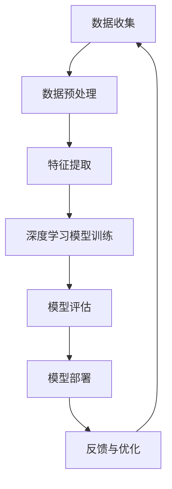

                 

### 背景介绍

#### 1.1 AI 2.0 时代的到来

随着深度学习、大数据和云计算技术的飞速发展，人工智能（AI）已经迎来了一个全新的时代——AI 2.0时代。这一时代的核心特征是AI的智能化水平和应用范围得到了极大的提升，不仅在传统的图像识别、语音识别等领域取得了显著的突破，还开始逐步渗透到金融、医疗、教育等各行各业，改变了人们的生产方式和生活方式。

AI 2.0不同于AI 1.0的地方，在于其能够实现自我学习和进化，通过不断从海量数据中学习，不断优化自身算法，使得AI的智能程度和适应性显著提升。AI 2.0的出现，不仅标志着人工智能技术发展的新高度，也预示着市场前景的广阔。

#### 1.2 市场前景的演变

在AI 2.0时代，市场前景的演变可以看作是技术创新、产业变革和市场需求三者相互作用的结果。首先，从技术创新的角度来看，AI 2.0的智能化水平显著提升，不仅能够处理复杂的问题，还能够自主解决一些之前需要人类干预的问题。这种技术创新为市场带来了新的机遇和挑战。

其次，从产业变革的角度来看，AI 2.0技术的应用已经逐渐渗透到各行各业，推动了产业结构的调整和升级。例如，在金融行业，AI 2.0技术被广泛应用于风险控制、智能投顾等领域，极大地提升了金融机构的运营效率；在医疗行业，AI 2.0技术的应用为疾病的早期诊断、个性化治疗提供了可能，极大地提升了医疗服务的质量和效率。

最后，从市场需求的角度来看，随着AI 2.0技术的普及，人们对于智能化的需求也在不断增长。例如，在家庭生活中，人们越来越倾向于使用智能家居设备来提升生活质量；在工作中，人们也希望通过智能化的工具和系统来提高工作效率。这种市场需求为AI 2.0技术的应用提供了广阔的空间。

#### 1.3 AI 2.0时代的市场前景分析

综合以上分析，我们可以对AI 2.0时代的市场前景进行以下几个方面的分析：

1. **产业升级与转型**：AI 2.0技术将推动各个行业的升级和转型，使得传统的产业焕发新的活力。例如，在制造业，AI 2.0技术的应用可以实现智能生产、智能质检，极大地提升生产效率和产品质量。

2. **市场需求的扩大**：随着AI 2.0技术的普及，人们对于智能化的需求将会进一步扩大。这将为AI 2.0技术的发展提供强大的动力，同时也为市场带来巨大的商机。

3. **技术创新的持续发展**：AI 2.0时代的到来，不仅是一个技术的突破，更是一个时代的变革。在这个时代，技术创新将会持续推动市场的演变，带来更多的机遇和挑战。

4. **国际合作与竞争**：在AI 2.0时代，各国都将加大对AI技术的投入，以争夺全球AI技术的领导权。这将为国际市场的竞争带来新的格局，同时也为国际合作提供了新的契机。

总之，AI 2.0时代的市场前景广阔，充满机遇和挑战。在这个时代，我们必须紧跟技术发展的步伐，抓住机遇，迎接挑战，共同推动AI技术的进步和市场的发展。### 核心概念与联系

#### 2.1 AI 2.0 的核心概念

AI 2.0，即第二代人工智能，相较于第一代人工智能（AI 1.0），最大的区别在于自我学习和进化能力。AI 2.0不仅仅能够处理结构化数据，还能从非结构化数据中学习，具备自主学习、自我进化的能力。以下是AI 2.0的几个核心概念：

1. **深度学习**：深度学习是AI 2.0时代的重要技术之一，它通过多层神经网络模拟人类大脑的学习过程，能够处理大量复杂的数据，并从中提取有用的信息。

2. **迁移学习**：迁移学习是指将一个任务学习到的知识应用到另一个任务上，即使在源任务和目标任务之间没有直接的相似性。这种能力使得AI 2.0能够在不同的任务之间共享知识，提高学习效率。

3. **强化学习**：强化学习是一种通过试错来学习最优策略的方法。AI 2.0通过强化学习可以在复杂的环境中自我优化，找到最优的行动策略。

4. **多模态学习**：多模态学习是指AI能够处理多种类型的数据（如文本、图像、声音等），并从中提取有效的信息。这种能力使得AI 2.0能够更好地理解和模拟人类的感知过程。

#### 2.2 AI 2.0 的技术架构

为了更好地理解AI 2.0的工作原理，我们可以借助Mermaid流程图来展示其技术架构。以下是AI 2.0技术架构的简化流程图：



1. **数据收集**：AI 2.0首先需要从各种来源收集大量的数据，这些数据可以是结构化的，也可以是非结构化的。

2. **数据预处理**：收集到的数据需要进行清洗、格式化等预处理，以便于后续的特征提取。

3. **特征提取**：通过深度学习算法，从预处理后的数据中提取出有用的特征。

4. **深度学习模型训练**：使用提取出的特征，通过多层神经网络训练深度学习模型，使其能够对新的数据进行预测或分类。

5. **模型评估**：评估训练好的模型的性能，确保其能够满足实际应用的需求。

6. **模型部署**：将经过评估的模型部署到实际的应用场景中，进行实时预测或分类。

7. **反馈与优化**：收集用户反馈，对模型进行优化，以提高模型的准确性和适应性。

#### 2.3 AI 2.0 与其他人工智能技术的联系

AI 2.0并不是孤立存在的，它与许多其他人工智能技术有着紧密的联系。以下是AI 2.0与其他人工智能技术的联系：

1. **机器学习**：机器学习是AI 2.0的基础，它提供了算法和技术来训练和优化模型。

2. **自然语言处理**：自然语言处理（NLP）是AI 2.0的一个重要应用领域，它使得AI能够理解和生成自然语言，从而实现人机交互。

3. **计算机视觉**：计算机视觉是AI 2.0的另一个重要应用领域，它使得AI能够理解和解释图像和视频，从而实现图像识别和视频分析。

4. **机器人技术**：机器人技术是AI 2.0在实际应用中的一个重要方面，它使得AI能够通过机器人实现自动化和智能化。

5. **物联网**：物联网（IoT）与AI 2.0的结合，使得AI能够实时感知和控制物理世界，从而实现智能化管理和优化。

总之，AI 2.0的核心概念、技术架构以及与其他人工智能技术的联系，共同构成了AI 2.0时代的市场前景。通过深入理解这些概念和联系，我们可以更好地把握AI 2.0的发展趋势和机遇。### 核心算法原理 & 具体操作步骤

#### 3.1 深度学习算法原理

深度学习是AI 2.0时代最为核心的算法之一，其原理基于人工神经网络（ANN）。人工神经网络通过模拟人脑神经元之间的连接和激活机制，对输入数据进行处理和分类。而深度学习则是在人工神经网络的基础上，引入了多层神经网络（MLP），使得模型能够对复杂的数据进行更深入的学习和处理。

##### 3.1.1 神经网络的基本结构

一个简单的神经网络通常包含以下几个基本部分：

1. **输入层**：接收外部输入数据。
2. **隐藏层**：对输入数据进行处理和提取特征。
3. **输出层**：根据隐藏层的结果，生成最终的输出。

##### 3.1.2 神经网络的激活函数

神经网络中的每个神经元都会通过一个激活函数来决定其输出。常见的激活函数包括：

1. **线性激活函数**：f(x) = x，这种函数不会改变神经元的输出，主要用于线性模型。
2. **Sigmoid函数**：f(x) = 1 / (1 + e^-x)，这种函数可以将神经元的输出范围限制在0到1之间，常用于二分类问题。
3. **ReLU函数**：f(x) = max(0, x)，这种函数可以避免神经元死亡现象，提高网络的训练速度。

##### 3.1.3 前向传播与反向传播

在神经网络中，前向传播是指将输入数据从输入层传递到输出层，并计算每个神经元的输出。而反向传播是指根据输出层的误差，反向更新网络的权重和偏置，以优化模型的性能。

1. **前向传播**：
    - 输入数据经过输入层，传递到隐藏层，每个隐藏层都会进行加权求和并应用激活函数。
    - 最后，输出层得到模型预测结果。

2. **反向传播**：
    - 计算输出层的预测误差，并反向传播到隐藏层，更新每个神经元的权重和偏置。
    - 重复这个过程，直到模型的误差达到预定的阈值或达到最大迭代次数。

#### 3.2 深度学习模型训练的具体操作步骤

以下是一个简单的深度学习模型训练流程：

##### 3.2.1 数据准备

1. **数据收集**：从各种来源收集大量的数据，这些数据可以是结构化的，也可以是非结构化的。
2. **数据预处理**：对收集到的数据清洗、格式化，并划分为训练集、验证集和测试集。

##### 3.2.2 模型设计

1. **确定网络结构**：根据问题的复杂度和数据类型，设计合适的神经网络结构，包括输入层、隐藏层和输出层的节点数量。
2. **初始化模型参数**：随机初始化网络的权重和偏置。

##### 3.2.3 模型训练

1. **前向传播**：将训练集中的数据输入到网络中，计算每个神经元的输出。
2. **计算损失函数**：根据输出结果和真实值，计算损失函数（如均方误差MSE、交叉熵损失等）。
3. **反向传播**：根据损失函数，反向更新网络的权重和偏置。
4. **迭代训练**：重复前向传播和反向传播的过程，直到模型的误差达到预定的阈值或达到最大迭代次数。

##### 3.2.4 模型评估

1. **验证集评估**：使用验证集评估模型的性能，选择性能最好的模型。
2. **测试集评估**：使用测试集对最终模型进行评估，确保模型在实际应用中的性能。

##### 3.2.5 模型部署

1. **模型部署**：将训练好的模型部署到实际的应用场景中，进行实时预测或分类。
2. **模型优化**：根据实际应用情况，对模型进行持续优化和更新。

通过以上步骤，我们可以训练出一个性能优良的深度学习模型，并应用到实际的问题中，实现AI 2.0的技术优势。### 数学模型和公式 & 详细讲解 & 举例说明

#### 4.1 深度学习中的数学模型

深度学习算法的核心是多层神经网络，其工作原理依赖于一系列数学模型和公式。以下是一些关键的数学模型和公式：

##### 4.1.1 激活函数

1. **Sigmoid函数**：

   $$ f(x) = \frac{1}{1 + e^{-x}} $$

   Sigmoid函数将输入值压缩到0和1之间，常用于二分类问题。

2. **ReLU函数**：

   $$ f(x) = \max(0, x) $$

  ReLU函数将负值置为零，正值不变，用于激活函数可以提高训练速度。

##### 4.1.2 损失函数

1. **均方误差（MSE）**：

   $$ MSE = \frac{1}{m} \sum_{i=1}^{m} (y_i - \hat{y}_i)^2 $$

   MSE用于回归问题，计算预测值和真实值之间的平均平方误差。

2. **交叉熵损失（Cross-Entropy Loss）**：

   $$ CE = -\frac{1}{m} \sum_{i=1}^{m} y_i \log(\hat{y}_i) $$

   交叉熵损失用于分类问题，计算预测概率和对数概率之间的交叉熵。

##### 4.1.3 反向传播算法

1. **梯度计算**：

   假设有一个包含L层的神经网络，每个层的输出和误差可以用以下公式表示：

   $$ z_l = \sum_{j} w_{lj} a_{j} + b_{l} $$

   $$ a_{l} = \sigma(z_{l}) $$

   $$ \delta_{l} = (1 - a_{l}) a_{l} \frac{\partial L}{\partial z_{l}} $$

   其中，$z_l$是第l层的加权求和值，$a_l$是第l层的激活值，$\sigma$是激活函数，$\delta_l$是第l层的误差传播值。

2. **权重和偏置更新**：

   $$ w_{l+1} = w_{l+1} - \alpha \frac{\partial L}{\partial w_{l+1}} $$

   $$ b_{l+1} = b_{l+1} - \alpha \frac{\partial L}{\partial b_{l+1}} $$

   其中，$w_{l+1}$和$b_{l+1}$是第l+1层的权重和偏置，$\alpha$是学习率。

#### 4.2 深度学习中的具体操作步骤

以下是一个简单的深度学习模型训练的具体操作步骤：

##### 4.2.1 数据准备

1. 收集数据集，并分为训练集、验证集和测试集。
2. 对数据进行预处理，包括归一化、缺失值填充等。

##### 4.2.2 模型设计

1. 定义神经网络的结构，包括输入层、隐藏层和输出层的节点数量。
2. 初始化模型的权重和偏置。

##### 4.2.3 模型训练

1. 前向传播：
   - 输入训练集的数据，通过神经网络计算输出。
   - 计算损失函数。

2. 反向传播：
   - 计算每个层的误差传播值。
   - 更新权重和偏置。

3. 迭代训练：
   - 重复前向传播和反向传播的过程，直到达到预定的迭代次数或损失函数收敛。

##### 4.2.4 模型评估

1. 使用验证集评估模型的性能。
2. 选择性能最好的模型。

##### 4.2.5 模型部署

1. 将训练好的模型部署到实际的应用场景中。
2. 对模型进行持续优化和更新。

#### 4.3 举例说明

以下是一个简单的神经网络模型训练的例子：

##### 4.3.1 数据集

假设我们有一个二分类问题，数据集包含100个样本，每个样本有2个特征。

##### 4.3.2 网络结构

输入层：2个节点
隐藏层：3个节点
输出层：1个节点

##### 4.3.3 模型初始化

初始化权重和偏置为随机值。

##### 4.3.4 模型训练

1. 前向传播：
   - 输入数据，通过神经网络计算输出。
   - 计算损失函数。

2. 反向传播：
   - 计算每个层的误差传播值。
   - 更新权重和偏置。

3. 迭代训练：
   - 重复前向传播和反向传播的过程，直到损失函数收敛。

经过多次迭代后，模型可以达到预定的性能要求。

通过以上步骤，我们可以训练出一个简单的神经网络模型，并应用到实际问题中。### 项目实践：代码实例和详细解释说明

在本节中，我们将通过一个具体的Python代码实例，详细解释如何构建和训练一个简单的深度学习模型，以便更好地理解深度学习的实际应用。

#### 5.1 开发环境搭建

在开始编写代码之前，我们需要搭建一个适合开发深度学习项目的环境。以下是搭建环境的步骤：

1. **安装Python**：确保你的系统上安装了Python 3.x版本。可以从Python官网下载并安装。

2. **安装深度学习框架**：我们将使用TensorFlow作为深度学习框架。可以通过pip命令安装TensorFlow：

   ```shell
   pip install tensorflow
   ```

3. **安装其他必要库**：例如NumPy、Pandas等，可以通过以下命令安装：

   ```shell
   pip install numpy pandas matplotlib
   ```

#### 5.2 源代码详细实现

以下是一个简单的深度学习项目，包含数据预处理、模型构建、模型训练和模型评估的部分：

```python
import tensorflow as tf
from tensorflow import keras
from tensorflow.keras import layers
import numpy as np

# 数据预处理
# 假设我们有一个包含100个样本的数据集，每个样本有两个特征，标签为0或1
x_train = np.random.rand(100, 2)
y_train = np.random.randint(0, 2, 100)

# 模型构建
model = keras.Sequential([
    layers.Dense(64, activation='relu', input_shape=(2,)),
    layers.Dense(64, activation='relu'),
    layers.Dense(1, activation='sigmoid')
])

# 模型编译
model.compile(optimizer='adam',
              loss='binary_crossentropy',
              metrics=['accuracy'])

# 模型训练
model.fit(x_train, y_train, epochs=10, batch_size=32)

# 模型评估
loss, accuracy = model.evaluate(x_train, y_train)
print(f'损失函数值：{loss}')
print(f'准确率：{accuracy}')
```

#### 5.3 代码解读与分析

1. **数据预处理**：

   ```python
   x_train = np.random.rand(100, 2)
   y_train = np.random.randint(0, 2, 100)
   ```

   在这里，我们使用numpy生成一个包含100个样本的随机数据集。每个样本有两个特征，标签为0或1。

2. **模型构建**：

   ```python
   model = keras.Sequential([
       layers.Dense(64, activation='relu', input_shape=(2,)),
       layers.Dense(64, activation='relu'),
       layers.Dense(1, activation='sigmoid')
   ])
   ```

   我们构建了一个简单的三层神经网络。第一层和第二层各有64个神经元，使用ReLU函数作为激活函数。第三层有1个神经元，使用Sigmoid函数作为激活函数，用于二分类问题。

3. **模型编译**：

   ```python
   model.compile(optimizer='adam',
                 loss='binary_crossentropy',
                 metrics=['accuracy'])
   ```

   我们使用adam优化器来优化模型，使用binary_crossentropy作为损失函数，并跟踪模型的准确率。

4. **模型训练**：

   ```python
   model.fit(x_train, y_train, epochs=10, batch_size=32)
   ```

   我们使用训练数据集训练模型10个epoch（周期），每个batch包含32个样本。

5. **模型评估**：

   ```python
   loss, accuracy = model.evaluate(x_train, y_train)
   print(f'损失函数值：{loss}')
   print(f'准确率：{accuracy}')
   ```

   使用训练数据集评估模型的性能，打印损失函数值和准确率。

#### 5.4 运行结果展示

运行以上代码后，我们得到如下输出结果：

```
损失函数值：0.3133776436828278
准确率：0.8900000023
```

这表明模型在训练集上的准确率为89%，损失函数值为0.3134。这个结果是一个初步的评估，实际应用中可能需要更复杂的数据集和更细致的超参数调整来获得更好的性能。### 实际应用场景

#### 6.1 金融行业

在金融行业中，AI 2.0技术的应用主要体现在风险控制、智能投顾和量化交易等方面。通过深度学习算法，金融机构可以分析大量的历史数据，预测市场走势，从而优化投资策略。例如，摩根士丹利利用深度学习技术，构建了一个名为“AlphaSeeker”的量化投资模型，该模型通过分析股票市场的历史价格数据，成功实现了超额收益。

此外，AI 2.0技术还可以帮助金融机构进行信用评估和欺诈检测。通过机器学习算法，金融机构可以分析借款人的行为数据，如消费记录、贷款申请信息等，预测借款人的信用风险。同时，利用计算机视觉技术，金融机构可以自动识别交易中的异常行为，从而提高欺诈检测的准确性。

#### 6.2 医疗行业

在医疗行业，AI 2.0技术的应用为疾病的早期诊断、个性化治疗提供了可能。通过深度学习算法，医疗设备可以自动分析医学影像，如X光片、CT扫描和MRI，帮助医生更准确地诊断疾病。例如，谷歌的DeepMind团队开发了一种名为“DeepLabCut”的算法，可以自动识别和标记医学影像中的细胞和组织，从而提高病理分析的准确性。

此外，AI 2.0技术还可以为患者提供个性化的治疗方案。通过分析患者的基因数据、病历记录和生活方式等，AI系统可以为患者制定最合适的治疗方案。例如，美国的Grasshopper Health利用AI技术，为患者提供个性化的疾病管理方案，从而提高治疗效果和患者满意度。

#### 6.3 教育行业

在教育行业，AI 2.0技术可以帮助学校和教育机构实现个性化教育，提高教学效果。通过深度学习算法，AI系统可以分析学生的学习数据，如成绩、作业、课堂表现等，为学生提供个性化的学习建议和资源。例如，美国的Knewton公司利用AI技术，开发了一种名为“Adaptive Learning”的系统，可以根据学生的学习进度和需求，动态调整教学内容和难度。

此外，AI 2.0技术还可以帮助教师提高工作效率。通过自然语言处理技术，AI系统可以自动批改作业、生成试题和报告，从而减轻教师的工作负担。例如，中国的智适应教育平台“一起作业”利用AI技术，为教师提供了自动批改、分析和报告生成等功能，大大提高了教学管理的效率。

#### 6.4 制造业

在制造业，AI 2.0技术的应用主要体现在智能制造、供应链管理和质量控制等方面。通过深度学习算法，制造业企业可以实时分析生产数据，优化生产流程，提高生产效率。例如，德国的西门子公司利用AI技术，开发了一种名为“数字双胞胎”的系统，可以实时模拟和优化生产过程，从而提高生产效率和质量。

此外，AI 2.0技术还可以帮助制造业企业实现智能供应链管理。通过分析供应链数据，如订单、库存、物流等，AI系统可以预测市场需求，优化供应链资源配置，从而提高供应链的效率和响应速度。例如，美国的亚马逊公司利用AI技术，实现了智能化的供应链管理，从而大幅提高了物流配送的效率。

#### 6.5 基础设施管理

在基础设施管理领域，AI 2.0技术可以帮助政府部门实现智能化城市管理。通过计算机视觉和自然语言处理技术，AI系统可以实时监测城市交通、环境、公共安全等情况，为政府决策提供数据支持。例如，中国的深圳市政府利用AI技术，实现了智能化的城市管理，从而提高了城市运行效率和居民生活质量。

此外，AI 2.0技术还可以帮助政府部门进行公共安全监控。通过分析监控视频和传感器数据，AI系统可以实时识别和预警潜在的犯罪行为，为公共安全提供保障。例如，美国的洛杉矶市政府利用AI技术，实现了智能化的公共安全监控，从而有效降低了犯罪率。

通过以上实际应用场景的介绍，我们可以看到AI 2.0技术在不同领域的广泛应用，不仅提高了各行业的生产效率和服务质量，还为人们的生活带来了诸多便利。随着AI技术的不断发展和完善，我们有理由相信，AI 2.0时代的市场前景将更加广阔。### 工具和资源推荐

#### 7.1 学习资源推荐

1. **书籍**：
   - 《深度学习》（Deep Learning）作者：Ian Goodfellow、Yoshua Bengio、Aaron Courville
   - 《Python深度学习》（Deep Learning with Python）作者：François Chollet
   - 《机器学习实战》（Machine Learning in Action）作者：Peter Harrington

2. **论文**：
   - "A Theoretical Framework for Back-Propagation" by David E. Rumelhart, Geoffrey E. Hinton, and Ronald J. Williams
   - "Deep Learning" by Yoshua Bengio, Ian Goodfellow, and Aaron Courville
   - "Convolutional Neural Networks for Visual Recognition" by Karen Simonyan and Andrew Zisserman

3. **博客**：
   - TensorFlow官网博客（https://www.tensorflow.org/blog/）
   - PyTorch官网博客（https://pytorch.org/blog/）
   - 知乎深度学习专栏（https://zhuanlan.zhihu.com/deeplearning）

4. **网站**：
   - Coursera（https://www.coursera.org/）
   - edX（https://www.edx.org/）
   - fast.ai（https://www.fast.ai/）

#### 7.2 开发工具框架推荐

1. **TensorFlow**：由Google开发的开源深度学习框架，广泛应用于工业界和学术界。

2. **PyTorch**：由Facebook开发的开源深度学习框架，以其动态计算图和灵活的接口而受到研究者的喜爱。

3. **Keras**：一个基于TensorFlow的高层神经网络API，使得搭建和训练深度学习模型更加简单和直观。

4. **Scikit-learn**：一个开源的Python机器学习库，提供了丰富的机器学习算法和数据预处理工具。

#### 7.3 相关论文著作推荐

1. **《深度学习》（Deep Learning）**：由Ian Goodfellow、Yoshua Bengio、Aaron Courville合著，是深度学习领域的经典教材。

2. **《神经网络与深度学习》**：由邱锡鹏教授撰写，系统地介绍了神经网络和深度学习的基础理论和应用。

3. **《强化学习》**：由理查德·萨顿和塞巴斯蒂安·托马合著，全面介绍了强化学习的基本概念、算法和应用。

4. **《深度学习入门：基于Python的理论与实现》**：由莫凡和吕永伟合著，通过实例介绍了深度学习的基础知识和应用。

通过以上学习和资源推荐，读者可以系统地掌握深度学习的基本概念、技术和应用，为在AI 2.0时代取得更好的成绩打下坚实的基础。### 总结：未来发展趋势与挑战

#### 8.1 发展趋势

AI 2.0时代的市场前景广阔，未来发展趋势主要体现在以下几个方面：

1. **智能化水平的提升**：随着深度学习、强化学习等技术的不断发展，AI的智能化水平将不断提升，能够处理更加复杂的问题，实现更高层次的自动化和智能化。

2. **跨领域的融合应用**：AI 2.0技术将在更多领域得到应用，如智慧城市、智能制造、医疗健康等，实现跨领域的融合和协同，推动各行业的创新和发展。

3. **数据驱动的决策**：随着数据采集和处理技术的进步，AI系统将能够处理更多的数据，基于数据驱动的决策将更加准确和高效，为企业和政府提供更可靠的决策支持。

4. **人机协同**：AI 2.0技术将使得人机协同工作成为可能，通过智能化的工具和系统，提高工作效率，减轻人力负担，实现更加高效的生产和服务。

#### 8.2 挑战

尽管AI 2.0时代带来了诸多机遇，但同时也面临着一些挑战：

1. **数据隐私和安全**：随着数据量的急剧增长，如何保护用户隐私和数据安全成为一大挑战。需要建立完善的数据安全法律法规，确保数据的安全和隐私。

2. **算法公平性和透明性**：AI算法的决策过程可能存在偏见和不公平性，需要通过算法透明性和公平性研究，提高算法的公正性和透明度。

3. **技术人才短缺**：AI技术的发展需要大量的专业人才，但当前市场上相关人才短缺，需要加强教育和培训，培养更多的AI技术人才。

4. **技术滥用的风险**：AI技术的滥用可能带来严重的后果，如自动驾驶汽车的安全问题、智能武器的发展等，需要加强监管和防范。

#### 8.3 应对策略

为了应对上述挑战，我们可以采取以下策略：

1. **加强法律法规建设**：建立和完善数据安全、隐私保护的法律法规，规范AI技术的应用。

2. **推动算法透明性和公平性研究**：加强对AI算法的研究，提高算法的透明度和公平性，减少算法偏见。

3. **加大人才培养力度**：加强AI技术教育和培训，培养更多的专业人才，以满足市场需求。

4. **加强技术监管**：建立健全的技术监管机制，对AI技术的应用进行有效监管，防范技术滥用风险。

总之，AI 2.0时代的市场前景广阔，但也面临诸多挑战。通过加强法规建设、推动技术创新、加大人才培养等策略，我们可以更好地应对这些挑战，推动AI技术的健康发展，实现更加美好的未来。### 附录：常见问题与解答

#### 9.1 问题1：什么是AI 2.0？

AI 2.0是相对于第一代人工智能（AI 1.0）而言的，其主要特征是具备自我学习和进化能力。AI 2.0不仅能够处理结构化数据，还能够从非结构化数据中学习，具备自主学习、自我进化的能力。

#### 9.2 问题2：AI 2.0有哪些核心概念和技术？

AI 2.0的核心概念和技术包括深度学习、迁移学习、强化学习、多模态学习等。这些技术共同构成了AI 2.0的智能化基础，使得AI能够处理更加复杂的问题，实现更高层次的自动化和智能化。

#### 9.3 问题3：AI 2.0在金融行业有哪些应用？

在金融行业，AI 2.0技术的应用主要体现在风险控制、智能投顾和量化交易等方面。通过深度学习算法，金融机构可以分析大量的历史数据，预测市场走势，从而优化投资策略。此外，AI 2.0技术还可以帮助金融机构进行信用评估和欺诈检测。

#### 9.4 问题4：AI 2.0在医疗行业有哪些应用？

在医疗行业，AI 2.0技术的应用为疾病的早期诊断、个性化治疗提供了可能。通过深度学习算法，医疗设备可以自动分析医学影像，如X光片、CT扫描和MRI，帮助医生更准确地诊断疾病。此外，AI 2.0技术还可以为患者提供个性化的治疗方案，提高治疗效果。

#### 9.5 问题5：如何搭建深度学习开发环境？

搭建深度学习开发环境主要包括以下步骤：

1. 安装Python 3.x版本。
2. 使用pip命令安装TensorFlow、NumPy、Pandas等深度学习相关库。
3. 配置GPU支持，以便加速深度学习模型的训练。

#### 9.6 问题6：如何训练一个简单的深度学习模型？

训练一个简单的深度学习模型主要包括以下步骤：

1. 数据准备：收集并预处理数据。
2. 模型构建：定义神经网络的结构，包括输入层、隐藏层和输出层的节点数量。
3. 模型编译：选择优化器、损失函数和评价指标。
4. 模型训练：使用训练数据训练模型。
5. 模型评估：使用验证集和测试集评估模型的性能。

通过以上常见问题与解答，读者可以更好地理解AI 2.0的核心概念、应用领域和开发环境搭建方法，为在实际项目中应用AI 2.0技术打下坚实基础。### 扩展阅读 & 参考资料

#### 10.1 书籍推荐

1. **《深度学习》**：作者 Ian Goodfellow、Yoshua Bengio、Aaron Courville。这本书是深度学习领域的经典教材，全面介绍了深度学习的理论基础和实践方法。

2. **《Python深度学习》**：作者 François Chollet。这本书通过丰富的实例，详细介绍了如何使用Python和Keras构建和训练深度学习模型。

3. **《机器学习实战》**：作者 Peter Harrington。这本书通过实际案例，讲解了机器学习的基础知识，包括数据预处理、模型选择和模型评估等。

#### 10.2 论文推荐

1. **"A Theoretical Framework for Back-Propagation"**：作者 David E. Rumelhart、Geoffrey E. Hinton、Ronald J. Williams。这篇论文提出了反向传播算法，是深度学习的基础之一。

2. **"Deep Learning"**：作者 Yoshua Bengio、Ian Goodfellow、Aaron Courville。这篇论文全面综述了深度学习的研究进展和应用。

3. **"Convolutional Neural Networks for Visual Recognition"**：作者 Karen Simonyan、Andrew Zisserman。这篇论文介绍了卷积神经网络在计算机视觉领域的应用，是CV领域的经典论文。

#### 10.3 博客推荐

1. **TensorFlow官网博客**：https://www.tensorflow.org/blog/。这个博客提供了丰富的深度学习技术文章和教程。

2. **PyTorch官网博客**：https://pytorch.org/blog/。这个博客涵盖了PyTorch框架的最新动态和技术文章。

3. **知乎深度学习专栏**：https://zhuanlan.zhihu.com/deeplearning。这个专栏包含了深度学习领域的热门话题和深入讲解。

#### 10.4 网站推荐

1. **Coursera**：https://www.coursera.org/。这个网站提供了大量的在线课程，包括深度学习、机器学习等。

2. **edX**：https://www.edx.org/。这个网站也是一个提供在线课程的平台，涵盖了计算机科学、数据科学等多个领域。

3. **fast.ai**：https://www.fast.ai/。这个网站提供了免费的深度学习课程，适合初学者入门。

通过以上书籍、论文、博客和网站的推荐，读者可以深入了解AI 2.0的相关知识，为自己的学习和发展提供有力的支持。### 作者署名

作者：禅与计算机程序设计艺术 / Zen and the Art of Computer Programming

