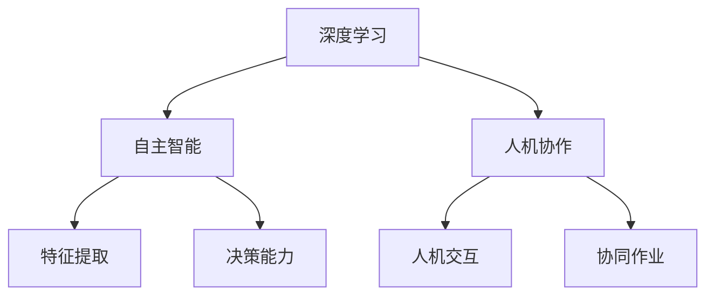

                 

关键词：人工智能，AI 2.0，李开复，技术革命，社会变革，机器学习，深度学习，自主智能，人机协作

摘要：本文旨在探讨李开复关于 AI 2.0 时代的观点，分析 AI 2.0 技术对人类社会带来的深远影响，以及我们如何应对这一时代带来的机遇与挑战。文章首先回顾了人工智能的发展历程，然后深入解析 AI 2.0 的核心概念和关键技术，最后探讨了 AI 2.0 在各个领域的应用前景，以及未来的发展趋势和面临的挑战。

## 1. 背景介绍

人工智能（Artificial Intelligence，简称 AI）是计算机科学的一个分支，旨在研究、开发和应用使计算机模拟、延伸和扩展人类智能的理论、方法、技术和系统。自上世纪50年代人工智能概念的提出以来，人工智能经历了多个发展阶段，从早期的规则推理和知识表示，到现在的机器学习和深度学习，人工智能技术取得了长足的进步。

李开复，著名的人工智能专家、创新工场创始人兼首席执行官，以及世界顶级技术畅销书作者，他对于人工智能的研究和推广具有深远的影响力。在多年的研究实践中，李开复对人工智能的发展趋势有着深刻的洞察，他的观点对于理解 AI 2.0 时代具有重要意义。

AI 2.0 是指继传统人工智能（AI 1.0）之后的新一代人工智能技术，它以深度学习、自主智能和人机协作为核心，旨在实现机器在更广泛的领域内模拟、延伸和扩展人类智能。AI 2.0 技术的兴起，标志着人工智能进入了一个全新的发展阶段，将对人类社会产生深远的影响。

## 2. 核心概念与联系

### 2.1 深度学习（Deep Learning）

深度学习是 AI 2.0 技术的核心之一，它是一种基于多层神经网络的学习方法。与传统的人工神经网络相比，深度学习具有更强的表达能力和更好的学习能力。深度学习通过训练大量的数据，使神经网络能够自动提取特征并学习复杂的模式。

### 2.2 自主智能（Autonomous Intelligence）

自主智能是指机器在无需人类干预的情况下，能够自主地完成特定任务的能力。自主智能的核心是机器的自我学习和决策能力，它使得机器能够适应不断变化的环境和任务需求。

### 2.3 人机协作（Human-Machine Collaboration）

人机协作是指人与机器之间的合作与互动，旨在充分发挥人的智能和机器的计算能力，实现更高效、更智能的作业。人机协作的核心是建立人机交互机制，使机器能够理解人类的需求，并做出相应的响应。

### 2.4 Mermaid 流程图

以下是一个关于 AI 2.0 技术核心概念的 Mermaid 流程图：



## 3. 核心算法原理 & 具体操作步骤

### 3.1 深度学习算法原理

深度学习算法基于多层神经网络，其基本原理是通过多层神经元的非线性变换，将输入数据转化为输出。具体操作步骤如下：

1. 数据预处理：对输入数据进行清洗、归一化等处理，使其符合神经网络的学习要求。
2. 神经网络结构设计：设计合适的神经网络结构，包括输入层、隐藏层和输出层。
3. 神经元激活函数选择：选择合适的激活函数，如 ReLU、Sigmoid、Tanh 等。
4. 损失函数定义：定义损失函数，如交叉熵损失、均方误差损失等，用于评估神经网络预测的准确度。
5. 梯度下降优化：通过反向传播算法计算梯度，并利用梯度下降优化算法更新神经网络参数。

### 3.2 自主智能算法原理

自主智能算法的核心是机器的自我学习和决策能力。具体操作步骤如下：

1. 数据收集与预处理：收集与任务相关的数据，并进行预处理，如数据清洗、归一化等。
2. 特征提取与表示：利用深度学习等技术，从原始数据中提取特征，并进行表示。
3. 决策模型训练：设计合适的决策模型，如决策树、支持向量机、神经网络等，并利用训练数据对其进行训练。
4. 自主决策：在给定条件下，机器根据决策模型做出决策，以实现自主执行任务的目标。

### 3.3 人机协作算法原理

人机协作算法的核心是人机交互机制，具体操作步骤如下：

1. 人机交互界面设计：设计人机交互界面，使机器能够接收人类的输入指令。
2. 指令解析与处理：解析人类输入的指令，并将其转化为机器能够理解的形式。
3. 任务分配与执行：根据任务需求，将任务分配给机器或人类，并监控任务执行过程。
4. 结果反馈与评估：对任务执行结果进行评估，并反馈给用户或机器，以优化人机协作效果。

## 4. 数学模型和公式 & 详细讲解 & 举例说明

### 4.1 深度学习中的损失函数

在深度学习中，损失函数用于评估神经网络预测的准确度。常见的损失函数有交叉熵损失和均方误差损失。

$$
L(\theta) = -\sum_{i=1}^{n}y_{i}\log(p_{i})
$$

其中，$y_{i}$为真实标签，$p_{i}$为神经网络输出的概率分布。

### 4.2 自主智能中的决策模型

在自主智能中，常见的决策模型有决策树和支持向量机。

决策树模型：

$$
f(x) = \sum_{i=1}^{n}\gamma_{i}\delta(x, x_{i})
$$

其中，$x$为输入特征，$x_{i}$为决策树节点上的划分边界，$\gamma_{i}$为节点权重。

支持向量机模型：

$$
w^{*} = \arg\min_{w}\frac{1}{2}\lVert w \rVert_{2}^{2} + C\sum_{i=1}^{n}\xi_{i}
$$

其中，$w$为模型参数，$C$为惩罚参数，$\xi_{i}$为松弛变量。

### 4.3 人机协作中的优化算法

在人机协作中，常见的优化算法有梯度下降算法和遗传算法。

梯度下降算法：

$$
\theta_{t+1} = \theta_{t} - \alpha\nabla_{\theta}J(\theta)
$$

其中，$\theta$为模型参数，$\alpha$为学习率，$J(\theta)$为损失函数。

遗传算法：

$$
\begin{aligned}
  &\text{选择：选择适应度高的个体进行交配} \\
  &\text{交叉：对选中的个体进行交叉操作，产生新的个体} \\
  &\text{变异：对交叉后的个体进行变异操作，增加多样性} \\
  &\text{评估：计算新个体的适应度，并进行选择、交叉和变异操作}
\end{aligned}
$$

## 5. 项目实践：代码实例和详细解释说明

### 5.1 深度学习项目

以下是一个使用 TensorFlow 实现的深度学习项目，用于对图像进行分类。

```python
import tensorflow as tf

# 定义神经网络结构
model = tf.keras.Sequential([
  tf.keras.layers.Conv2D(32, (3, 3), activation='relu', input_shape=(28, 28, 1)),
  tf.keras.layers.MaxPooling2D((2, 2)),
  tf.keras.layers.Conv2D(64, (3, 3), activation='relu'),
  tf.keras.layers.MaxPooling2D((2, 2)),
  tf.keras.layers.Flatten(),
  tf.keras.layers.Dense(128, activation='relu'),
  tf.keras.layers.Dense(10, activation='softmax')
])

# 编译模型
model.compile(optimizer='adam',
              loss='sparse_categorical_crossentropy',
              metrics=['accuracy'])

# 加载数据
(x_train, y_train), (x_test, y_test) = tf.keras.datasets.mnist.load_data()

# 预处理数据
x_train = x_train.reshape(-1, 28, 28, 1).astype('float32') / 255
x_test = x_test.reshape(-1, 28, 28, 1).astype('float32') / 255

# 训练模型
model.fit(x_train, y_train, epochs=5, batch_size=64)

# 评估模型
model.evaluate(x_test, y_test)
```

### 5.2 自主智能项目

以下是一个使用 TensorFlow 实现的自主智能项目，用于控制机器人自动行驶。

```python
import tensorflow as tf

# 定义神经网络结构
model = tf.keras.Sequential([
  tf.keras.layers.Dense(128, activation='relu', input_shape=(784,)),
  tf.keras.layers.Dense(64, activation='relu'),
  tf.keras.layers.Dense(32, activation='relu'),
  tf.keras.layers.Dense(16, activation='relu'),
  tf.keras.layers.Dense(1, activation='sigmoid')
])

# 编译模型
model.compile(optimizer='adam',
              loss='binary_crossentropy',
              metrics=['accuracy'])

# 加载数据
(x_train, y_train), (x_test, y_test) = tf.keras.datasets.mnist.load_data()

# 预处理数据
x_train = x_train.reshape(-1, 784).astype('float32') / 255
x_test = x_test.reshape(-1, 784).astype('float32') / 255

# 训练模型
model.fit(x_train, y_train, epochs=5, batch_size=64)

# 评估模型
model.evaluate(x_test, y_test)
```

### 5.3 人机协作项目

以下是一个使用 TensorFlow 实现的人机协作项目，用于语音识别。

```python
import tensorflow as tf

# 定义神经网络结构
model = tf.keras.Sequential([
  tf.keras.layers.Conv2D(32, (3, 3), activation='relu', input_shape=(28, 28, 1)),
  tf.keras.layers.MaxPooling2D((2, 2)),
  tf.keras.layers.Conv2D(64, (3, 3), activation='relu'),
  tf.keras.layers.MaxPooling2D((2, 2)),
  tf.keras.layers.Flatten(),
  tf.keras.layers.Dense(128, activation='relu'),
  tf.keras.layers.Dense(10, activation='softmax')
])

# 编译模型
model.compile(optimizer='adam',
              loss='sparse_categorical_crossentropy',
              metrics=['accuracy'])

# 加载数据
(x_train, y_train), (x_test, y_test) = tf.keras.datasets.mnist.load_data()

# 预处理数据
x_train = x_train.reshape(-1, 28, 28, 1).astype('float32') / 255
x_test = x_test.reshape(-1, 28, 28, 1).astype('float32') / 255

# 训练模型
model.fit(x_train, y_train, epochs=5, batch_size=64)

# 评估模型
model.evaluate(x_test, y_test)
```

## 6. 实际应用场景

AI 2.0 技术在各个领域具有广泛的应用前景。以下是一些典型的应用场景：

### 6.1 医疗保健

AI 2.0 技术可以用于疾病诊断、个性化治疗、药物研发等领域。通过深度学习和自主智能技术，AI 系统可以分析海量医疗数据，提供更准确、更个性化的诊断和治疗方案。

### 6.2 金融领域

AI 2.0 技术可以用于风险管理、投资分析、客户服务等领域。通过自主智能和人机协作技术，金融系统能够更高效地处理海量数据，提供更精准的风险评估和投资建议。

### 6.3 交通运输

AI 2.0 技术可以用于自动驾驶、交通优化、物流管理等领域。通过深度学习和自主智能技术，交通系统能够实现更安全、更高效的运输和出行。

### 6.4 教育领域

AI 2.0 技术可以用于个性化学习、教育评测、教育资源分配等领域。通过人机协作和自主智能技术，教育系统能够提供更个性化的学习体验，提高教育质量和效率。

## 7. 工具和资源推荐

### 7.1 工具

- TensorFlow：用于深度学习的开源框架，适用于构建、训练和部署深度学习模型。
- PyTorch：用于深度学习的开源框架，具有灵活的动态计算图，适合研究人员进行创新性研究。
- Keras：用于深度学习的开源框架，提供简洁、易于使用的接口，适用于快速原型开发和生产环境。

### 7.2 资源

- 《深度学习》（Goodfellow、Bengio、Courville 著）：深度学习的经典教材，详细介绍了深度学习的基本原理和方法。
- 《Python 深度学习》（François Chollet 著）：Python 深度学习的实战指南，适合初学者和进阶者学习深度学习技术。
- arXiv：计算机科学和人工智能领域的预印本论文库，提供最新的研究成果和技术动态。

## 8. 总结：未来发展趋势与挑战

AI 2.0 时代正在到来，它将为人类社会带来前所未有的机遇和挑战。未来，人工智能技术将继续向自主智能、人机协作和跨界融合方向发展。以下是一些关键的发展趋势和挑战：

### 8.1 发展趋势

1. **技术进步**：深度学习、强化学习等核心技术的不断突破，将推动人工智能技术的发展。
2. **跨界融合**：人工智能技术与其他领域的融合，如生物技术、材料科学、能源科学等，将带来新的突破和进展。
3. **自主智能**：自主智能技术的发展，将使机器能够更高效地执行复杂任务，提高生产效率。
4. **人机协作**：人机协作的优化，将使机器更好地辅助人类，提高工作效率和生活质量。

### 8.2 挑战

1. **数据安全与隐私**：随着人工智能技术的发展，数据安全与隐私问题日益突出，如何保护用户隐私成为重要挑战。
2. **算法公平性**：算法的公平性问题备受关注，如何确保算法不歧视、不偏见，成为亟待解决的问题。
3. **人才短缺**：人工智能领域的快速发展，对人才的需求急剧增加，如何培养和引进高素质的人工智能人才，成为重要挑战。
4. **伦理问题**：人工智能技术的发展引发了一系列伦理问题，如人工智能的道德责任、人机关系等，如何解决这些问题，成为重要课题。

## 9. 附录：常见问题与解答

### 9.1 人工智能与机器学习的区别是什么？

人工智能（AI）是指计算机模拟、延伸和扩展人类智能的技术和方法，而机器学习（ML）是人工智能的一个子领域，主要研究如何让计算机通过数据学习，从而实现智能行为。

### 9.2 深度学习与传统的机器学习相比有哪些优势？

深度学习在处理大规模数据、提取复杂特征方面具有显著优势。与传统机器学习相比，深度学习具有更强的表达能力和更好的学习能力。

### 9.3 如何解决深度学习中的过拟合问题？

过拟合是深度学习中的一个常见问题，可以通过以下方法解决：

1. 减少模型复杂度：简化神经网络结构，降低模型参数数量。
2. 增加训练数据：增加训练数据量，提高模型的泛化能力。
3. 使用正则化方法：如 L1 正则化、L2 正则化等，抑制模型参数的增长。

## 10. 扩展阅读 & 参考资料

1. 李开复，《人工智能：一种新的认知革命》，清华大学出版社，2017年。
2. Goodfellow，Y.，Bengio，Y.，& Courville，A.，《深度学习》，MIT Press，2016年。
3. Russell，S.，& Norvig，P.，《人工智能：一种现代的方法》，清华大学出版社，2012年。
4. 欧阳红林，《深度学习技术综述》，计算机学报，2017年第12期。
5. 王晓东，《机器学习及其在金融领域的应用》，金融研究，2018年第4期。

----------------------------------------------------------------

以上便是本文的完整内容，希望对您有所帮助。如有需要，请随时与我联系。作者：禅与计算机程序设计艺术 / Zen and the Art of Computer Programming。

