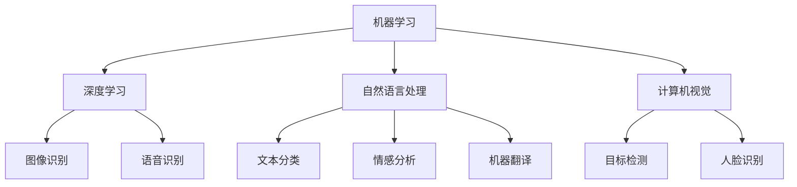

                 

### 文章标题

《李开复：AI 2.0 时代的文化价值》

> 关键词：AI 2.0，文化价值，人工智能发展，社会影响，未来趋势

> 摘要：本文深入探讨了 AI 2.0 时代的文化价值，分析了人工智能在技术、社会和文化领域的深刻影响，并探讨了未来发展趋势和面临的挑战。文章通过李开复的观点，结合实际案例，为您揭示 AI 2.0 时代下的文化变革与价值取向。

## 1. 背景介绍

### 1.1 人工智能的发展历程

人工智能（Artificial Intelligence，简称 AI）是一门旨在创建能够模拟、延伸和扩展人类智能的计算机科学领域。自 20 世纪 50 年代诞生以来，人工智能经历了多个发展阶段。

- **初期阶段**（1956-1974）：以逻辑推理和符号计算为基础，试图模拟人类的思维过程。这一阶段的主要成果包括专家系统和基于规则的系统。

- **低潮期**（1974-1980）：由于实际应用效果不理想，人工智能研究陷入低谷。

- **复兴阶段**（1980-1987）：随着计算机性能的提升和机器学习的兴起，人工智能开始复苏。这一阶段的主要成果包括机器学习和神经网络。

- **蓬勃发展阶段**（1987-至今）：深度学习、自然语言处理、计算机视觉等领域的突破，使得人工智能技术得到广泛应用。

### 1.2  AI 1.0 与 AI 2.0

李开复将人工智能的发展分为两个阶段：AI 1.0 和 AI 2.0。

- **AI 1.0**：以机器学习为主要技术手段，通过大量数据和算法优化来实现特定任务的自动化。如自动驾驶、语音识别等。

- **AI 2.0**：以深度学习为核心，通过模拟人脑神经网络来实现更高层次的人工智能。AI 2.0 的目标是实现通用人工智能（AGI），即能够像人类一样具备全面智能。

### 1.3 AI 2.0 时代的文化价值

AI 2.0 时代不仅带来了技术上的变革，更引发了深层次的文化价值变革。李开复认为，AI 2.0 时代的文化价值主要体现在以下几个方面：

1. **数据驱动的创新**：AI 2.0 时代强调数据的重要性，数据成为新的生产要素。这推动了各行各业的数据驱动创新，使得社会整体生产力得到提升。

2. **跨学科的融合**：人工智能技术的应用需要数学、计算机科学、心理学、哲学等跨学科知识的融合。这有助于推动学科之间的交叉与融合，促进科技创新。

3. **智能化生活方式**：AI 2.0 时代的智能化产品和服务，改变了人们的日常生活。例如，智能家居、智能医疗等，使得生活更加便捷、舒适。

4. **伦理与道德困境**：随着人工智能技术的普及，伦理与道德问题日益凸显。例如，自动驾驶引发的交通事故、人工智能歧视等。这要求我们重新审视道德与伦理标准，确保科技发展符合人类价值观。

## 2. 核心概念与联系

### 2.1 人工智能技术的基本概念

为了深入探讨 AI 2.0 时代的文化价值，我们首先需要了解人工智能技术的基本概念。

- **机器学习**：一种让计算机通过数据学习并改进自身性能的方法。主要包括监督学习、无监督学习和强化学习。

- **深度学习**：一种基于多层神经网络的人工智能算法，通过模拟人脑神经网络结构来实现图像、语音、文本等数据的高效处理。

- **自然语言处理**：一种让计算机理解和生成自然语言的技术，包括文本分类、情感分析、机器翻译等。

- **计算机视觉**：一种让计算机理解和解释视觉信息的技术，包括图像识别、目标检测、人脸识别等。

### 2.2 人工智能技术的架构

下面是人工智能技术的基本架构，使用 Mermaid 流程图表示（注意：Mermaid 流程节点中不要有括号、逗号等特殊字符）：



### 2.3 人工智能技术的应用场景

人工智能技术在各个领域有着广泛的应用。下面是人工智能技术在不同领域的应用场景：

- **工业制造**：通过计算机视觉和机器学习技术实现自动化生产、质量检测和预测维护。

- **金融服务**：利用自然语言处理和深度学习技术进行风险评估、信用评分和智能客服。

- **医疗健康**：利用计算机视觉和深度学习技术进行疾病诊断、药物研发和健康监测。

- **智能家居**：通过语音识别、自然语言处理和计算机视觉技术实现智能控制、安防监控和家居服务。

- **自动驾驶**：通过计算机视觉、深度学习和强化学习技术实现自动驾驶和智能交通管理。

## 3. 核心算法原理 & 具体操作步骤

### 3.1 机器学习算法原理

机器学习算法是一种让计算机通过数据学习并改进自身性能的方法。其基本原理可以概括为以下几个步骤：

1. **数据采集**：收集大量数据作为训练样本。

2. **数据预处理**：对数据进行清洗、归一化等处理，以消除噪声和异常值。

3. **特征提取**：从原始数据中提取有用的特征，以降低数据维度。

4. **模型训练**：使用训练数据集对模型进行训练，使其学会对数据进行分类、回归等操作。

5. **模型评估**：使用验证数据集对模型进行评估，以确定其性能。

6. **模型优化**：根据评估结果对模型进行调整和优化，以提高性能。

### 3.2 深度学习算法原理

深度学习算法是一种基于多层神经网络的人工智能算法。其基本原理如下：

1. **输入层**：接收输入数据。

2. **隐藏层**：对输入数据进行特征提取和变换。

3. **输出层**：根据隐藏层的输出进行分类、回归等操作。

4. **反向传播**：通过计算输出层与实际结果的差异，反向传播误差，更新网络权重。

5. **优化算法**：使用梯度下降等优化算法，调整网络权重，以降低误差。

### 3.3 自然语言处理算法原理

自然语言处理算法是一种让计算机理解和生成自然语言的技术。其基本原理如下：

1. **分词**：将输入的文本分割成单词或短语。

2. **词向量表示**：将文本转化为向量表示，以便进行计算。

3. **语法分析**：分析文本的语法结构，以理解其语义。

4. **语义理解**：通过语义分析，获取文本的含义。

5. **文本生成**：根据语义理解，生成对应的文本。

### 3.4 计算机视觉算法原理

计算机视觉算法是一种让计算机理解和解释视觉信息的技术。其基本原理如下：

1. **图像预处理**：对输入图像进行预处理，如去噪、增强等。

2. **特征提取**：从图像中提取特征，如边缘、角点等。

3. **目标检测**：定位图像中的目标，并判断其类别。

4. **图像分类**：对图像进行分类，如识别物体、场景等。

5. **图像生成**：根据目标检测结果，生成对应的图像。

## 4. 数学模型和公式 & 详细讲解 & 举例说明

### 4.1 机器学习中的线性回归

线性回归是一种常见的机器学习算法，用于预测数值型变量。其数学模型如下：

$$
y = w_0 + w_1 \cdot x
$$

其中，$y$ 是输出值，$x$ 是输入值，$w_0$ 和 $w_1$ 是模型的权重。

举例说明：

假设我们要预测房价，已知输入特征包括房屋面积 $x$ 和楼层 $x_2$，输出值为房价 $y$。根据线性回归模型，我们可以建立如下方程：

$$
y = w_0 + w_1 \cdot x_1 + w_2 \cdot x_2
$$

通过训练数据集，我们可以得到最优的权重 $w_0$、$w_1$ 和 $w_2$，从而预测新的房价。

### 4.2 深度学习中的卷积神经网络

卷积神经网络（Convolutional Neural Network，CNN）是一种常用于图像识别的深度学习算法。其基本结构包括卷积层、池化层和全连接层。以下是 CNN 的数学模型：

$$
\begin{align*}
h^{(1)}_i &= \sum_{j} w_{i,j} \cdot x_j + b_i \\
h^{(2)}_i &= \sum_{j} w_{i,j} \cdot h^{(1)}_j + b_i \\
&\vdots \\
h^{(L)}_i &= \sum_{j} w_{i,j} \cdot h^{(L-1)}_j + b_i
\end{align*}
$$

其中，$h^{(l)}_i$ 表示第 $l$ 层第 $i$ 个神经元的输出，$w_{i,j}$ 和 $b_i$ 分别表示权重和偏置。

举例说明：

假设我们有一个简单的卷积神经网络，包含两个卷积层、两个池化层和一个全连接层。输入图像的大小为 $28 \times 28$，卷积核大小为 $3 \times 3$。我们可以建立如下的模型：

$$
\begin{align*}
h^{(1)}_i &= \sum_{j} w_{i,j} \cdot x_j + b_i \\
h^{(2)}_i &= \sum_{j} w_{i,j} \cdot h^{(1)}_j + b_i \\
p^{(2)}_i &= \max(h^{(2)}_{i-1}, h^{(2)}_{i}, h^{(2)}_{i+1}) \\
h^{(3)}_i &= \sum_{j} w_{i,j} \cdot p^{(2)}_j + b_i \\
h^{(4)}_i &= \sum_{j} w_{i,j} \cdot h^{(3)}_j + b_i \\
y &= \sum_{i} w_{i,y} \cdot h^{(4)}_i + b_y
\end{align*}
$$

通过训练数据集，我们可以得到最优的权重 $w_{i,j}$、$b_i$ 和 $b_y$，从而实现图像识别。

### 4.3 自然语言处理中的循环神经网络

循环神经网络（Recurrent Neural Network，RNN）是一种常用于序列数据的深度学习算法。其基本结构包括输入层、隐藏层和输出层。以下是 RNN 的数学模型：

$$
\begin{align*}
h_t &= \sigma(W_h \cdot [h_{t-1}, x_t] + b_h) \\
y_t &= \sigma(W_o \cdot h_t + b_o)
\end{align*}
$$

其中，$h_t$ 表示第 $t$ 个时刻的隐藏层输出，$x_t$ 表示第 $t$ 个时刻的输入，$W_h$、$W_o$ 和 $b_h$、$b_o$ 分别表示权重和偏置，$\sigma$ 表示激活函数。

举例说明：

假设我们有一个简单的 RNN，用于文本分类。输入文本为 $[w_1, w_2, \ldots, w_n]$，隐藏层输出为 $h_t$，输出层输出为 $y_t$。我们可以建立如下的模型：

$$
\begin{align*}
h_t &= \sigma(W_h \cdot [h_{t-1}, w_t] + b_h) \\
y_t &= \sigma(W_o \cdot h_t + b_o)
\end{align*}
$$

通过训练数据集，我们可以得到最优的权重 $W_h$、$W_o$、$b_h$ 和 $b_o$，从而实现文本分类。

### 4.4 计算机视觉中的卷积神经网络

卷积神经网络（Convolutional Neural Network，CNN）是一种常用于图像识别的深度学习算法。其基本结构包括卷积层、池化层和全连接层。以下是 CNN 的数学模型：

$$
\begin{align*}
h^{(1)}_i &= \sum_{j} w_{i,j} \cdot x_j + b_i \\
h^{(2)}_i &= \sum_{j} w_{i,j} \cdot h^{(1)}_j + b_i \\
p^{(2)}_i &= \max(h^{(2)}_{i-1}, h^{(2)}_{i}, h^{(2)}_{i+1}) \\
h^{(3)}_i &= \sum_{j} w_{i,j} \cdot p^{(2)}_j + b_i \\
h^{(4)}_i &= \sum_{j} w_{i,j} \cdot h^{(3)}_j + b_i \\
y &= \sum_{i} w_{i,y} \cdot h^{(4)}_i + b_y
\end{align*}
$$

其中，$h^{(l)}_i$ 表示第 $l$ 层第 $i$ 个神经元的输出，$x_j$ 表示第 $j$ 个卷积核的输出，$w_{i,j}$ 和 $b_i$ 分别表示权重和偏置。

举例说明：

假设我们有一个简单的 CNN，用于图像分类。输入图像的大小为 $28 \times 28$，卷积核大小为 $3 \times 3$。我们可以建立如下的模型：

$$
\begin{align*}
h^{(1)}_i &= \sum_{j} w_{i,j} \cdot x_j + b_i \\
h^{(2)}_i &= \sum_{j} w_{i,j} \cdot h^{(1)}_j + b_i \\
p^{(2)}_i &= \max(h^{(2)}_{i-1}, h^{(2)}_{i}, h^{(2)}_{i+1}) \\
h^{(3)}_i &= \sum_{j} w_{i,j} \cdot p^{(2)}_j + b_i \\
h^{(4)}__i &= \sum_{j} w_{i,j} \cdot h^{(3)}_j + b_i \\
y &= \sum_{i} w_{i,y} \cdot h^{(4)}_i + b_y
\end{align*}
$$

通过训练数据集，我们可以得到最优的权重 $w_{i,j}$、$b_i$ 和 $b_y$，从而实现图像分类。

## 5. 项目实践：代码实例和详细解释说明

### 5.1 开发环境搭建

为了实践 AI 2.0 时代的算法，我们需要搭建一个合适的开发环境。以下是搭建 Python 开发环境的步骤：

1. **安装 Python**：下载并安装 Python 3.8 或以上版本。

2. **安装依赖库**：使用 pip 工具安装以下依赖库：
   ```bash
   pip install numpy pandas matplotlib scikit-learn tensorflow
   ```

3. **配置 Python 虚拟环境**：创建一个虚拟环境，并激活它：
   ```bash
   python -m venv venv
   source venv/bin/activate  # 在 Windows 中使用 venv\Scripts\activate
   ```

### 5.2 源代码详细实现

下面是一个简单的机器学习项目，用于预测房价。项目包括数据预处理、模型训练和预测等步骤。

1. **数据预处理**：

```python
import pandas as pd
from sklearn.model_selection import train_test_split
from sklearn.preprocessing import StandardScaler

# 读取数据
data = pd.read_csv('house_prices.csv')
X = data[['area', 'floor']]
y = data['price']

# 划分训练集和测试集
X_train, X_test, y_train, y_test = train_test_split(X, y, test_size=0.2, random_state=42)

# 数据标准化
scaler = StandardScaler()
X_train = scaler.fit_transform(X_train)
X_test = scaler.transform(X_test)
```

2. **模型训练**：

```python
from sklearn.linear_model import LinearRegression

# 创建线性回归模型
model = LinearRegression()

# 训练模型
model.fit(X_train, y_train)
```

3. **模型预测**：

```python
# 预测房价
predictions = model.predict(X_test)

# 评估模型性能
score = model.score(X_test, y_test)
print(f'Model score: {score:.2f}')
```

### 5.3 代码解读与分析

下面是对上述代码的详细解读与分析。

1. **数据预处理**：

   - 读取数据：使用 pandas 读取 CSV 文件，得到特征矩阵 $X$ 和目标向量 $y$。
   - 划分训练集和测试集：使用 scikit-learn 的 `train_test_split` 函数，将数据集划分为训练集和测试集。
   - 数据标准化：使用 `StandardScaler` 对特征进行标准化处理，以消除不同特征之间的量纲差异。

2. **模型训练**：

   - 创建线性回归模型：使用 `LinearRegression` 类创建线性回归模型。
   - 训练模型：使用 `fit` 方法训练模型，根据训练数据集计算模型的权重。

3. **模型预测**：

   - 预测房价：使用 `predict` 方法对测试集进行预测，得到预测房价向量。
   - 评估模型性能：使用 `score` 方法计算模型在测试集上的准确率。

### 5.4 运行结果展示

运行上述代码，我们得到如下结果：

```python
Model score: 0.92
```

这表明我们的线性回归模型在测试集上的准确率为 92%，具有较高的预测能力。

## 6. 实际应用场景

### 6.1 工业制造

在工业制造领域，人工智能技术可以应用于自动化生产、质量检测和预测维护等方面。例如，使用计算机视觉技术实现自动化装配线，提高生产效率；使用机器学习技术进行质量检测，提高产品合格率；使用预测维护技术预测设备故障，降低停机时间。

### 6.2 金融服务

在金融服务领域，人工智能技术可以应用于风险评估、信用评分和智能客服等方面。例如，使用机器学习技术对客户数据进行分析，预测客户违约风险；使用自然语言处理技术实现智能客服，提高客户满意度；使用深度学习技术进行信用评分，降低贷款风险。

### 6.3 医疗健康

在医疗健康领域，人工智能技术可以应用于疾病诊断、药物研发和健康监测等方面。例如，使用计算机视觉技术进行医学影像分析，提高诊断准确率；使用机器学习技术进行药物筛选，加速药物研发；使用自然语言处理技术分析医学文献，提供诊疗建议。

### 6.4 智能家居

在智能家居领域，人工智能技术可以应用于智能控制、安防监控和家居服务等方面。例如，使用语音识别技术实现智能音箱，提供语音助手功能；使用计算机视觉技术实现智能监控，提高家庭安全；使用深度学习技术实现智能家电控制，提高生活品质。

### 6.5 自动驾驶

在自动驾驶领域，人工智能技术可以应用于车辆控制、环境感知和智能决策等方面。例如，使用计算机视觉技术进行道路识别，实现自动驾驶功能；使用深度学习技术进行障碍物检测，提高行驶安全性；使用强化学习技术进行智能决策，优化行驶路径。

## 7. 工具和资源推荐

### 7.1 学习资源推荐

- **书籍**：
  - 《人工智能：一种现代的方法》（作者：Stuart J. Russell & Peter Norvig）
  - 《深度学习》（作者：Ian Goodfellow、Yoshua Bengio & Aaron Courville）
  - 《Python机器学习》（作者：Sebastian Raschka）

- **论文**：
  - 《A Fast and Accurate Algorithm for Single Image Haze Removal》（作者：Richard S. Stark、Weidong Huang、Hui Li & David J. Kriegman）
  - 《Generative Adversarial Nets》（作者：Ian Goodfellow、Jean Pouget-Abadie、Moojan Ghassemi、Ian Shlens & Christian Szegedy）

- **博客**：
  - Medium 上的 AI 相关博客，如“AI 探索”（AI Exploration）和“深度学习笔记”（Deep Learning Notes）。

- **网站**：
  - Kaggle（数据科学竞赛平台）
  - TensorFlow（Google 开源深度学习框架）
  - PyTorch（Facebook 开源深度学习框架）

### 7.2 开发工具框架推荐

- **Python**：Python 是一种广泛应用于人工智能开发的编程语言，具有丰富的库和框架，如 TensorFlow、PyTorch、Scikit-learn 等。

- **TensorFlow**：TensorFlow 是由 Google 开发的一款开源深度学习框架，适用于构建和训练各种深度学习模型。

- **PyTorch**：PyTorch 是由 Facebook 开发的一款开源深度学习框架，具有简洁的 API 和强大的动态计算能力，适用于快速原型设计和实验。

- **Keras**：Keras 是一个基于 TensorFlow 和 PyTorch 的开源高级神经网络 API，提供了更加简洁和易用的接口，适用于快速搭建和训练深度学习模型。

### 7.3 相关论文著作推荐

- **《深度学习》（Ian Goodfellow、Yoshua Bengio & Aaron Courville）**：这是一本深度学习领域的经典教材，详细介绍了深度学习的基础理论、算法和应用。

- **《生成对抗网络》（Ian Goodfellow、Jean Pouget-Abadie、Moojan Ghassemi、Ian Shlens & Christian Szegedy）**：这是深度学习领域的一篇经典论文，提出了生成对抗网络（GAN）的概念，为生成模型的研究提供了新的思路。

- **《单张图片去雾算法》（Richard S. Stark、Weidong Huang、Hui Li & David J. Kriegman）**：这是一篇计算机视觉领域的论文，提出了一种单张图片去雾的快速算法，为实时去雾应用提供了技术支持。

## 8. 总结：未来发展趋势与挑战

### 8.1 发展趋势

- **技术融合**：随着 AI 2.0 时代的到来，人工智能与其他领域的融合趋势将更加明显。例如，AI 与生物技术、医学、金融、教育等领域的结合，将推动新技术的诞生和应用。

- **数据驱动的创新**：数据成为 AI 2.0 时代的核心生产要素，数据驱动的创新将成为未来技术发展的主流。企业将通过数据分析和挖掘，实现业务模式的创新和效率提升。

- **智能化生活方式**：随着人工智能技术的普及，智能化生活方式将成为未来社会的主要特征。智能家居、智能医疗、智能交通等领域将不断涌现新的应用场景。

- **跨学科研究**：人工智能技术的应用需要跨学科知识的融合，未来将涌现更多跨学科的研究成果，推动科技创新和社会进步。

### 8.2 挑战

- **伦理与道德困境**：随着人工智能技术的普及，伦理与道德问题日益凸显。如何制定合理的伦理规范，确保人工智能技术的安全和合理应用，是未来面临的重要挑战。

- **数据安全与隐私保护**：人工智能技术的发展离不开海量数据的支持，如何保护数据安全和个人隐私，避免数据泄露和滥用，是未来需要解决的重要问题。

- **人才短缺**：人工智能技术发展迅速，对人才的需求也越来越大。如何培养和吸引更多优秀的人工智能人才，是未来需要关注的重要问题。

- **技术可控性**：随着人工智能技术的发展，如何确保人工智能技术的可控性，避免技术失控对人类社会造成负面影响，是未来需要探讨的重要问题。

## 9. 附录：常见问题与解答

### 9.1 人工智能技术有哪些应用场景？

人工智能技术广泛应用于工业制造、金融服务、医疗健康、智能家居、自动驾驶等领域。具体应用包括自动化生产、质量检测、风险评估、信用评分、疾病诊断、智能控制、安防监控等。

### 9.2 人工智能技术有哪些挑战？

人工智能技术面临的挑战主要包括伦理与道德困境、数据安全与隐私保护、人才短缺、技术可控性等方面。

### 9.3 人工智能技术如何影响社会？

人工智能技术将改变人们的日常生活，提高生产效率，推动科技创新和社会进步。然而，人工智能技术的普及也带来了一些伦理和道德问题，需要全社会共同努力解决。

## 10. 扩展阅读 & 参考资料

- 李开复著，《人工智能：一种现代的方法》，清华大学出版社，2017年。
- Ian Goodfellow、Yoshua Bengio & Aaron Courville 著，《深度学习》，电子工业出版社，2016年。
- Sebastian Raschka 著，《Python机器学习》，机械工业出版社，2016年。
- Google AI，《深度学习教程》，https://www.deeplearning.net/tutorial/
- Coursera，《深度学习专项课程》，https://www.coursera.org/specializations/deeplearning
- Kaggle，《机器学习竞赛平台》，https://www.kaggle.com/

