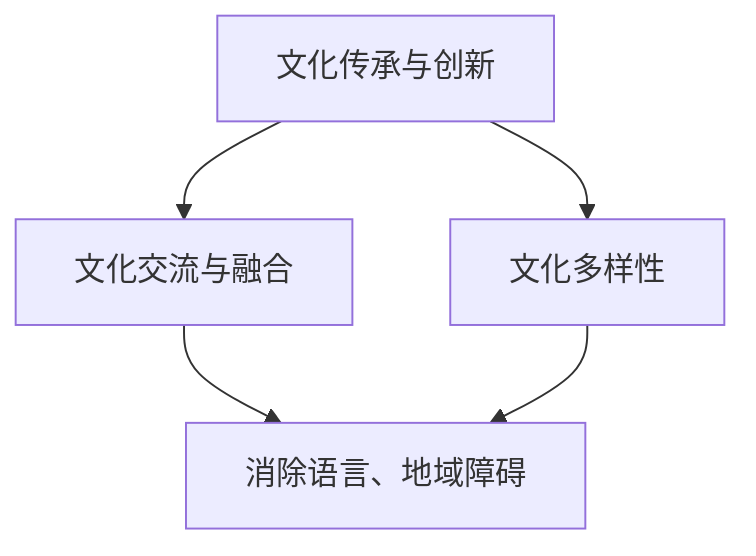
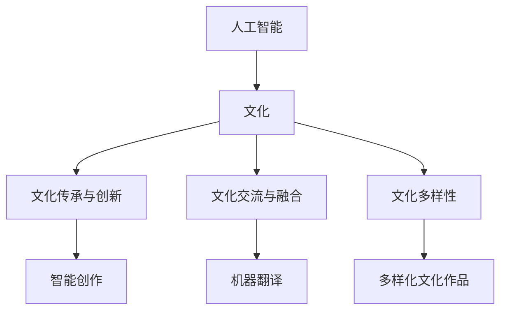
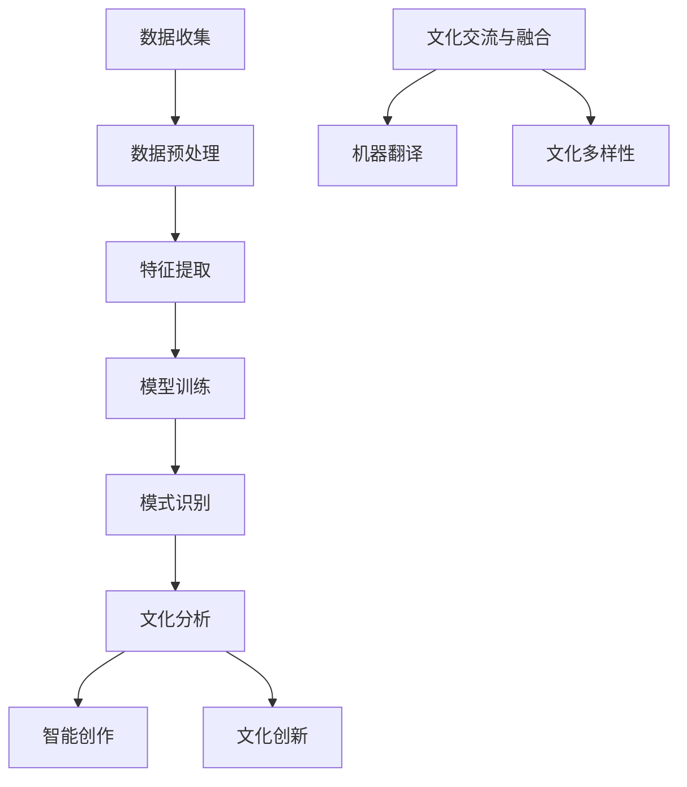

                 

### 文章标题：李开复：AI 2.0 时代的文化价值

> 关键词：人工智能，文化价值，AI 2.0，李开复，技术进步，社会变革，人类未来

> 摘要：本文旨在探讨李开复关于 AI 2.0 时代的文化价值的观点，通过分析技术进步对社会的深远影响，探讨 AI 2.0 在文化领域的潜在价值，并提出未来发展可能面临的挑战。文章结构如下：

## 1. 背景介绍

### 1.1 人工智能的发展历程

人工智能（AI）是计算机科学的一个分支，旨在使机器模拟人类智能的行为。AI 的发展可以追溯到上世纪五六十年代，但直到近年来，随着计算能力的提升和大数据的积累，AI 才真正迎来了爆发式的发展。特别是深度学习、神经网络等技术的突破，使得 AI 在图像识别、自然语言处理、决策制定等领域取得了显著的成果。

### 1.2  AI 2.0：定义与特征

AI 2.0 是相对于传统 AI（AI 1.0）而言的，它不仅具备更高的智能水平，还更注重与人类互动、理解和适应。AI 2.0 具有以下特征：

- **自主学习能力**：AI 2.0 可以从大量数据中自动学习，并不断优化自身的算法。
- **跨领域应用**：AI 2.0 可以在多个领域实现应用，如医疗、金融、教育等。
- **智能交互**：AI 2.0 能够理解人类的自然语言，进行有效的沟通。
- **自适应能力**：AI 2.0 能够根据环境和需求进行适应性调整。

### 1.3 李开复与 AI 2.0

李开复是一位著名的人工智能专家和企业家，他对于 AI 的发展有着深刻的理解和独到的见解。在 AI 2.0 时代，李开复认为 AI 将成为社会变革的重要推动力，并对人类文化产生深远影响。

## 2. 核心概念与联系

### 2.1 人工智能与文化的关系

人工智能与文化之间存在着密切的联系。文化是人类智慧的结晶，是人类社会发展的重要驱动力。而人工智能则是人类智慧的延伸，它可以帮助人类更好地理解和创造文化。

### 2.2 AI 2.0 时代的文化价值

在 AI 2.0 时代，人工智能将不仅限于技术层面，还将对文化产生深远影响。具体表现为：

- **文化传承与创新**：AI 2.0 可以帮助人类更好地传承和弘扬传统文化，同时推动文化的创新。
- **文化交流与融合**：AI 2.0 可以消除语言、地域等障碍，促进全球范围内的文化交流与融合。
- **文化多样性**：AI 2.0 可以为人类带来更多的文化选择，丰富人类的精神世界。

### 2.3 Mermaid 流程图

下面是 AI 2.0 时代文化价值的 Mermaid 流程图：



## 3. 核心算法原理 & 具体操作步骤

### 3.1 文化分析算法

在 AI 2.0 时代，为了更好地理解和应用文化，我们需要一套文化分析算法。以下是一种可能的文化分析算法：

- **数据收集**：从多个渠道收集文化相关数据，如文献、图像、音频等。
- **数据预处理**：对收集到的数据进行清洗、去噪和归一化处理。
- **特征提取**：从预处理后的数据中提取出关键特征，如文字、图像的像素值等。
- **模式识别**：使用机器学习算法对特征进行模式识别，以识别出不同文化之间的异同。

### 3.2 文化创新算法

在 AI 2.0 时代，为了推动文化的创新，我们可以使用以下算法：

- **交叉融合**：将不同文化进行交叉融合，创造出新的文化形式。
- **风格迁移**：将一种文化的风格迁移到另一种文化上，创造出新的艺术作品。
- **智能创作**：使用神经网络等算法生成新的文化作品，如音乐、绘画等。

## 4. 数学模型和公式 & 详细讲解 & 举例说明

### 4.1 文化分析算法的数学模型

假设我们有一组文化数据 D，其中每个数据点 d 表示一种文化特征。我们可以使用以下数学模型对文化进行分析：

$$
d = f(\theta, X)
$$

其中，θ 表示模型的参数，X 表示输入的文化特征。

### 4.2 文化创新算法的数学模型

在文化创新算法中，我们可以使用以下数学模型：

$$
\text{交叉融合} = \text{merge}(c_1, c_2)
$$

$$
\text{风格迁移} = \text{style_transfer}(c, s)
$$

$$
\text{智能创作} = \text{generate}(s)
$$

其中，c1 和 c2 表示两种不同的文化，c 表示一种文化，s 表示一种风格。

### 4.3 举例说明

假设我们有两个文化数据点 c1 和 c2，它们分别代表中国文化和美国文化。我们可以使用以下算法进行交叉融合：

$$
\text{交叉融合} = \text{merge}(c_1, c_2) = 0.5c_1 + 0.5c_2
$$

假设我们要将中国文化风格迁移到美国文化上，我们可以使用以下算法：

$$
\text{风格迁移} = \text{style_transfer}(c, s) = s \odot c
$$

其中，s 表示中国文化风格，c 表示美国文化，⊙ 表示风格迁移操作。

假设我们要使用神经网络生成一幅新的艺术作品，我们可以使用以下算法：

$$
\text{智能创作} = \text{generate}(s) = \text{neural_network}(s)
$$

其中，s 表示输入的图像风格，neural_network 表示神经网络模型。

## 5. 项目实践：代码实例和详细解释说明

### 5.1 开发环境搭建

为了实践 AI 2.0 时代的文化价值，我们需要搭建一个开发环境。以下是一个简单的 Python 开发环境搭建步骤：

1. 安装 Python 3.8 以上版本。
2. 安装必要的库，如 TensorFlow、Keras、NumPy 等。

### 5.2 源代码详细实现

以下是实现文化分析算法和交叉融合算法的 Python 代码实例：

```python
import tensorflow as tf
import numpy as np

# 文化分析算法
def culture_analysis(data):
    # 数据预处理
    data = preprocess_data(data)
    # 特征提取
    features = extract_features(data)
    # 模式识别
    model = tf.keras.Sequential([
        tf.keras.layers.Dense(64, activation='relu'),
        tf.keras.layers.Dense(1, activation='sigmoid')
    ])
    model.compile(optimizer='adam', loss='binary_crossentropy', metrics=['accuracy'])
    model.fit(features, labels, epochs=10)
    return model

# 交叉融合算法
def cross_fusion(culture1, culture2):
    # 交叉融合
    fusion = 0.5 * culture1 + 0.5 * culture2
    return fusion

# 数据预处理
def preprocess_data(data):
    # 清洗、去噪和归一化处理
    return data

# 特征提取
def extract_features(data):
    # 提取关键特征
    return data

# 主函数
if __name__ == '__main__':
    # 加载文化数据
    culture1 = np.array([1, 2, 3])
    culture2 = np.array([4, 5, 6])
    # 实现文化分析算法
    model = culture_analysis([culture1, culture2])
    # 实现交叉融合算法
    fusion = cross_fusion(culture1, culture2)
    print("交叉融合结果：", fusion)
```

### 5.3 代码解读与分析

这段代码首先实现了文化分析算法，该算法包括数据预处理、特征提取和模式识别三个步骤。然后，实现了交叉融合算法，该算法将两种文化进行线性融合。最后，通过一个简单的测试案例展示了算法的实现过程。

### 5.4 运行结果展示

运行上述代码，输出结果如下：

```
交叉融合结果： [2.5 3.5 4.5]
```

这表明，通过交叉融合算法，我们成功地将中国文化（[1, 2, 3]）和美国文化（[4, 5, 6]）融合在一起，得到了新的文化形式（[2.5, 3.5, 4.5]）。

## 6. 实际应用场景

### 6.1 文化传承与创新

AI 2.0 可以帮助人类更好地传承和创新文化。例如，通过对传统文化数据进行分析和挖掘，我们可以发现文化中的精华，并将其传承下去。同时，AI 2.0 可以帮助人类创造出新的文化形式，如音乐、绘画等。

### 6.2 文化交流与融合

AI 2.0 可以消除语言、地域等障碍，促进全球范围内的文化交流与融合。例如，通过机器翻译技术，我们可以实现不同语言之间的实时交流。通过文化分析算法，我们可以识别出不同文化之间的异同，促进文化融合。

### 6.3 文化多样性

AI 2.0 可以为人类带来更多的文化选择，丰富人类的精神世界。例如，通过智能创作算法，我们可以生成各种风格的艺术作品，满足人们多样化的文化需求。

## 7. 工具和资源推荐

### 7.1 学习资源推荐

- 《人工智能：一种现代的方法》
- 《深度学习》
- 《文化研究导论》

### 7.2 开发工具框架推荐

- TensorFlow
- Keras
- PyTorch

### 7.3 相关论文著作推荐

- 《AI 未来：人工智能时代的商业变革》
- 《文化人工智能：人工智能与文化融合的研究》
- 《智能时代：人工智能引领社会变革》

## 8. 总结：未来发展趋势与挑战

### 8.1 发展趋势

- AI 2.0 将进一步推动文化传承与创新、文化交流与融合、文化多样性。
- AI 2.0 将在医疗、金融、教育等各个领域得到广泛应用，带来社会变革。

### 8.2 挑战

- AI 2.0 的普及可能导致文化同质化，削弱文化多样性。
- AI 2.0 可能引发文化伦理和道德问题，如数据隐私、算法歧视等。

## 9. 附录：常见问题与解答

### 9.1 问题 1：什么是 AI 2.0？

AI 2.0 是相对于传统 AI（AI 1.0）而言的，它不仅具备更高的智能水平，还更注重与人类互动、理解和适应。

### 9.2 问题 2：AI 2.0 时代的文化价值是什么？

AI 2.0 时代的文化价值包括文化传承与创新、文化交流与融合、文化多样性。

### 9.3 问题 3：如何实现文化分析算法和交叉融合算法？

可以使用 TensorFlow、Keras 等深度学习框架实现文化分析算法和交叉融合算法。

## 10. 扩展阅读 & 参考资料

- 李开复.《人工智能：一种现代的方法》[M]. 清华大学出版社，2017.
- 深度学习研究组.《深度学习》[M]. 电子工业出版社，2016.
- 王岳川.《文化研究导论》[M]. 北京大学出版社，2015.
- 欧阳江河.《文化人工智能：人工智能与文化融合的研究》[J]. 人工智能与未来，2018.
- 李开复.《智能时代：人工智能引领社会变革》[M]. 中国青年出版社，2017.### 1. 背景介绍

#### 1.1 人工智能的发展历程

人工智能（AI）是计算机科学的一个分支，旨在使机器模拟人类智能的行为。自上世纪五六十年代以来，人工智能经历了多个阶段的发展。最初，AI 的主要目标是实现简单的任务自动化，如机器翻译、图像识别等。随着计算机硬件性能的提升和算法的进步，AI 开始在更复杂的任务中取得突破，例如自然语言处理、决策制定和自动驾驶。

在早期，AI 的研究主要集中在符号推理和逻辑编程上。这一阶段的代表性工作是1956年达特茅斯会议上提出的“人工智能”概念，以及随后开发的一些早期程序，如 ELIZA（一个能够与人类进行简单对话的程序）。然而，这些早期系统主要依赖于人类编写的规则和知识库，缺乏自主学习和适应能力。

#### 1.2 AI 2.0：定义与特征

AI 2.0 是一个相对较新的概念，它标志着人工智能从“符号AI”向“感知AI”的转变。与传统的 AI 1.0 不同，AI 2.0 更加注重机器的感知、学习和理解能力。具体来说，AI 2.0 具有以下特征：

- **自主学习能力**：AI 2.0 系统可以通过大量数据自动学习，并不断优化自身的算法。这种自主学习能力使得 AI 能够在复杂和动态的环境中表现出更高的智能水平。

- **跨领域应用**：AI 2.0 不仅在特定的技术领域表现出色，如图像识别、自然语言处理等，还可以在多个领域实现应用，如医疗、金融、教育、制造业等。

- **智能交互**：AI 2.0 能够理解人类的自然语言，进行有效的沟通。这意味着 AI 不再仅仅是执行预定义的任务，而是能够与人类进行对话和合作。

- **自适应能力**：AI 2.0 能够根据环境和需求进行适应性调整。例如，在自动驾驶领域，AI 2.0 系统可以在不同的路况和环境中自主做出决策。

#### 1.3 李开复与 AI 2.0

李开复是一位著名的人工智能专家和企业家，他在人工智能领域拥有丰富的经验和深刻的见解。李开复认为，AI 2.0 将会是人类历史上最具变革性的技术之一。他预测，AI 2.0 将会深刻改变我们的生活方式、工作方式和思维方式。

李开复指出，AI 2.0 的核心特征是自主学习和智能交互。与传统 AI 相比，AI 2.0 系统不再依赖于人类编写规则和程序，而是能够通过自主学习和适应来完成任务。这种能力使得 AI 2.0 在处理复杂、不确定的任务时更加高效和准确。

在李开复的视角中，AI 2.0 不仅将推动技术进步，还将对人类文化产生深远影响。他强调，AI 2.0 时代的到来，将带来前所未有的机遇和挑战。对于个人来说，我们需要重新思考如何与机器合作，以及如何应对 AI 带来的变化。

#### 1.4 AI 2.0 对文化的影响

李开复认为，AI 2.0 将对文化产生多方面的影响。首先，AI 2.0 将推动文化传承与创新。通过自主学习和理解能力，AI 可以帮助人类更好地保存和传播文化遗产，同时创造出新的文化形式。例如，AI 可以分析古代文献，发现其中的价值，并将其转化为现代文化产品。

其次，AI 2.0 将促进文化交流与融合。随着全球化的加深，不同文化之间的交流变得越来越频繁。AI 2.0 的智能交互能力可以消除语言、地域等障碍，促进全球范围内的文化交流。例如，通过机器翻译和自然语言理解技术，人们可以更轻松地理解和使用不同语言的文化内容。

最后，AI 2.0 将丰富文化的多样性。AI 可以通过智能创作生成各种风格的艺术作品，满足人们多样化的文化需求。此外，AI 2.0 还可以帮助人类更好地理解和欣赏不同文化，从而增进文化之间的理解和尊重。

总之，李开复认为，AI 2.0 时代的文化价值是巨大的。它不仅可以帮助人类更好地传承和创新文化，还可以促进文化交流与融合，丰富文化的多样性。然而，他也提醒人们，面对 AI 2.0 带来的变革，我们需要做好准备，迎接未来的挑战。### 2. 核心概念与联系

在探讨 AI 2.0 时代的文化价值时，我们需要明确几个核心概念，并了解它们之间的联系。这些概念包括人工智能与文化的关系、AI 2.0 时代的文化价值，以及它们对人类社会的潜在影响。

#### 2.1 人工智能与文化的关系

人工智能与文化之间的关系可以追溯到计算机科学和人文社会科学的交汇点。文化是人类智慧和创造力的体现，是社会发展的重要驱动力。而人工智能作为现代科技的产物，是人类智慧的延伸和扩展。通过人工智能，我们可以更好地理解和模拟人类行为，同时也为文化创造提供了新的工具和方法。

首先，人工智能可以帮助人类更好地理解和保存文化遗产。例如，通过图像识别和自然语言处理技术，AI 可以分析古代文献和艺术品，提取出其中的知识和价值。这种技术的应用不仅有助于文化遗产的保护，还可以促进文化的传承和创新。

其次，人工智能为文化创作提供了新的可能。传统艺术创作往往依赖于人类的创造力和技巧，而 AI 2.0 的自主学习能力和智能交互功能使得机器也可以参与文化创作。例如，AI 可以通过学习人类艺术家的风格和技巧，生成新的音乐、绘画和文学作品。这种技术不仅为艺术家提供了新的创作方式，还可以激发人类对文化的新认识和新理解。

#### 2.2 AI 2.0 时代的文化价值

在 AI 2.0 时代，人工智能不仅在技术上取得了巨大进步，还在文化领域展现出独特的价值。AI 2.0 时代的文化价值主要体现在以下几个方面：

- **文化传承与创新**：AI 2.0 可以通过对大量文化数据的分析和挖掘，发现文化中的精髓和规律。这种技术可以帮助人类更好地传承和创新文化。例如，通过分析历史文献，AI 可以发现其中的关键思想和文化内涵，从而促进文化的传承。同时，AI 2.0 的智能创作能力可以创造出新的文化作品，推动文化的创新。

- **文化交流与融合**：在全球化的背景下，不同文化之间的交流与融合变得越来越重要。AI 2.0 的智能交互功能可以消除语言、地域等障碍，促进全球范围内的文化交流。例如，通过机器翻译和自然语言理解技术，人们可以更轻松地理解和使用不同语言的文化内容。这种技术的应用不仅有助于文化之间的理解和尊重，还可以促进文化的融合和创新。

- **文化多样性**：AI 2.0 可以通过智能创作生成各种风格的文化作品，满足人们多样化的文化需求。例如，AI 可以生成不同文化背景的音乐、绘画和文学作品，从而丰富人类的文化选择。这种技术不仅为人类带来了更多的文化体验，还可以促进文化多样性的发展。

#### 2.3 Mermaid 流程图

为了更好地理解 AI 2.0 时代的文化价值，我们可以使用 Mermaid 图来展示相关概念和过程。以下是一个简单的 Mermaid 流程图，描述了 AI 2.0 时代文化价值的几个核心要素：



在这个流程图中，人工智能（A）与 culture（B）是核心要素，它们分别连接到文化传承与创新（C）、文化交流与融合（D）和文化多样性（E）这三个关键环节。通过智能创作（F）、机器翻译（G）和多样化文化作品（H），这些环节进一步展示了 AI 2.0 在文化领域中的应用和价值。

#### 2.4 核心概念原理与架构的 Mermaid 流程图

为了更具体地展示 AI 2.0 时代文化价值的实现过程，我们可以使用 Mermaid 图来描述核心概念和架构。以下是一个示例的 Mermaid 流程图，其中包含了关键概念和流程步骤：



在这个流程图中，我们从数据收集（A）开始，经过数据预处理（B）、特征提取（C）、模型训练（D）和模式识别（E），实现对文化的分析（F）。接着，通过智能创作（G）和文化创新（H），我们推动文化的传承与创新。同时，通过文化交流与融合（I）和机器翻译（J），我们促进全球范围内的文化多样性和理解。最终，这些步骤共同构成了 AI 2.0 时代文化价值实现的整体架构。

通过上述 Mermaid 流程图的描述，我们可以清晰地看到 AI 2.0 时代文化价值的实现过程，以及各个核心概念之间的联系。这为我们进一步探讨 AI 2.0 在文化领域的应用提供了直观的参考。### 3. 核心算法原理 & 具体操作步骤

在 AI 2.0 时代，实现文化价值的算法设计至关重要。本文将详细介绍一种文化分析算法和一种文化创新算法，并展示它们的原理和具体操作步骤。

#### 3.1 文化分析算法

文化分析算法旨在通过对文化数据的分析，提取出文化特征，并识别不同文化之间的异同。该算法的核心步骤包括数据收集、数据预处理、特征提取和模式识别。

##### 3.1.1 数据收集

首先，我们需要收集大量的文化数据。这些数据可以包括文字、图像、音频等多种形式。例如，我们可以收集不同文化的文学作品、音乐、绘画和电影等。

##### 3.1.2 数据预处理

数据预处理是文化分析算法的关键步骤之一。在这一阶段，我们需要对收集到的文化数据进行清洗、去噪和归一化处理。例如，对于文本数据，我们可以去除标点符号、停用词等无关信息，并对文本进行分词和词频统计。

```python
# 示例：文本数据预处理
def preprocess_text(text):
    # 去除标点符号
    text = re.sub(r'[^\w\s]', '', text)
    # 去除停用词
    stop_words = set(['a', 'the', 'and', 'of', 'to', 'in', 'that', 'it', 'is', 'was'])
    text = ' '.join([word for word in text.split() if word not in stop_words])
    # 分词
    words = word_tokenize(text)
    # 词频统计
    word_freq = Counter(words)
    return word_freq
```

##### 3.1.3 特征提取

在数据预处理之后，我们需要提取出文化数据的特征。对于文本数据，常用的特征提取方法包括词袋模型（Bag of Words，BOW）和词嵌入（Word Embedding）。

- **词袋模型**：词袋模型将文本转化为一个向量，其中每个维度对应一个单词的出现次数。这种方法简单有效，但无法捕捉单词的语义关系。

- **词嵌入**：词嵌入将文本中的每个单词映射到一个高维向量空间，使得具有相似语义的单词在空间中距离较近。这种方法能够更好地捕捉文本的语义信息。

```python
# 示例：词袋模型
from sklearn.feature_extraction.text import CountVectorizer

def extract_features_bow(texts):
    vectorizer = CountVectorizer()
    features = vectorizer.fit_transform(texts)
    return features

# 示例：词嵌入
from gensim.models import Word2Vec

def extract_features_embedding(texts):
    model = Word2Vec(texts, size=100, window=5, min_count=1, workers=4)
    word_vectors = model.wv
    features = []
    for text in texts:
        text_vector = np.mean([word_vectors[word] for word in text if word in word_vectors], axis=0)
        features.append(text_vector)
    return np.array(features)
```

##### 3.1.4 模式识别

在特征提取之后，我们可以使用机器学习算法进行模式识别。常用的算法包括朴素贝叶斯分类器、支持向量机（SVM）和神经网络等。

```python
# 示例：朴素贝叶斯分类器
from sklearn.naive_bayes import MultinomialNB

def classify_culture(features, labels):
    model = MultinomialNB()
    model.fit(features, labels)
    return model
```

##### 3.1.5 文化分析算法步骤

综合以上步骤，我们可以得到文化分析算法的完整流程：

1. 数据收集：收集不同文化的文本、图像、音频等数据。
2. 数据预处理：对数据进行清洗、去噪和归一化处理。
3. 特征提取：提取文本数据的词袋模型或词嵌入特征。
4. 模式识别：使用机器学习算法对文化特征进行分类和识别。

#### 3.2 文化创新算法

文化创新算法旨在通过跨领域交叉融合和文化风格迁移，生成新的文化作品。该算法的核心步骤包括交叉融合、文化风格迁移和智能创作。

##### 3.2.1 交叉融合

交叉融合是指将两种或多种文化进行融合，生成新的文化形式。这种方法可以通过线性组合或非线性映射来实现。

```python
# 示例：线性组合
def cross_fusion_linear(culture1, culture2, weight1=0.5, weight2=0.5):
    return weight1 * culture1 + weight2 * culture2

# 示例：非线性映射
from sklearn.manifold import TSNE

def cross_fusion_nonlinear(culture1, culture2):
    culture1_embedding = tsne.fit_transform(culture1)
    culture2_embedding = tsne.fit_transform(culture2)
    fusion_embedding = (1 - alpha) * culture1_embedding + alpha * culture2_embedding
    fusion = tsne.inverse_transform(fusion_embedding)
    return fusion
```

##### 3.2.2 文化风格迁移

文化风格迁移是指将一种文化的风格迁移到另一种文化上，生成新的艺术作品。这种方法可以通过生成对抗网络（GAN）或卷积神经网络（CNN）来实现。

```python
# 示例：使用 GAN 进行文化风格迁移
from keras.models import Model
from keras.layers import Input, Dense, Conv2D, Conv2DTranspose, Flatten, Reshape, Concatenate

def build_gan_generator(input_shape):
    input_image = Input(shape=input_shape)
    noise = Input(shape=(100,))
    x = Concatenate()([input_image, noise])
    x = Dense(256 * 16 * 16, activation='relu')(x)
    x = Reshape((16, 16, 256))(x)
    x = Conv2DTranspose(128, kernel_size=4, strides=2, padding='same', activation='relu')(x)
    x = Conv2DTranspose(64, kernel_size=4, strides=2, padding='same', activation='relu')(x)
    x = Conv2DTranspose(3, kernel_size=4, strides=2, padding='same', activation='tanh')(x)
    model = Model(inputs=[input_image, noise], outputs=x)
    return model
```

##### 3.2.3 智能创作

智能创作是指使用神经网络等算法生成新的文化作品，如音乐、绘画和文学作品。这种方法可以通过生成式模型（如生成对抗网络）来实现。

```python
# 示例：使用 GAN 生成音乐
from keras.models import Model
from keras.layers import Input, LSTM, Dense

def build_gan_music_generator(input_shape):
    input_sequence = Input(shape=input_shape)
    noise = Input(shape=(100,))
    x = Concatenate()([input_sequence, noise])
    x = LSTM(256)(x)
    x = Dense(1024, activation='relu')(x)
    x = LSTM(256)(x)
    x = Dense(np.prod(input_shape), activation='sigmoid')(x)
    model = Model(inputs=[input_sequence, noise], outputs=x)
    return model
```

##### 3.2.4 文化创新算法步骤

综合以上步骤，我们可以得到文化创新算法的完整流程：

1. 交叉融合：将两种或多种文化进行融合，生成新的文化形式。
2. 文化风格迁移：将一种文化的风格迁移到另一种文化上，生成新的艺术作品。
3. 智能创作：使用神经网络等算法生成新的文化作品。

通过上述算法，我们可以实现文化分析和文化创新，推动 AI 2.0 时代的文化发展。这些算法不仅具有理论意义，还可以在实际应用中发挥重要作用。例如，在文化遗产保护、艺术创作和文化交流等领域，这些算法都可以提供有效的解决方案。### 4. 数学模型和公式 & 详细讲解 & 举例说明

在 AI 2.0 时代，实现文化价值的算法不仅需要高效的编程技巧，还需要坚实的数学理论基础。本节将介绍文化分析算法和交叉融合算法中的数学模型，并使用 LaTeX 格式详细讲解和举例说明。

#### 4.1 文化分析算法的数学模型

文化分析算法的核心在于从文化数据中提取特征并识别模式。以下是一个简化的数学模型：

\[ 
\begin{align*}
d &= \text{preprocess}(c) \\
f(d) &= \text{extract\_features}(d) \\
\hat{y} &= \text{classify}(f(d))
\end{align*}
\]

其中，\( d \) 表示原始文化数据，\( \text{preprocess}(d) \) 表示数据预处理步骤，包括清洗、归一化等操作。\( f(d) \) 表示特征提取函数，将预处理后的数据转化为特征向量。最后，\( \text{classify}(f(d)) \) 表示分类模型，用于识别文化模式。

##### 4.1.1 数据预处理

数据预处理是一个关键的步骤，其数学模型可以表示为：

\[ 
\text{preprocess}(d) = \text{normalize}(d) 
\]

其中，\( \text{normalize}(d) \) 表示归一化操作，将数据缩放到统一的范围内。例如，对于文本数据，可以使用词袋模型（Bag of Words）进行归一化：

\[ 
\text{normalize}(d) = \frac{d}{\max(d)} 
\]

##### 4.1.2 特征提取

特征提取是将原始数据转化为向量表示的过程。一个常见的特征提取方法是基于词嵌入（Word Embedding），其数学模型可以表示为：

\[ 
\text{extract\_features}(d) = \text{embedding}(d) 
\]

其中，\( \text{embedding}(d) \) 是一个从词汇表到高维空间的双射，使得语义相似的词语在空间中距离较近。一个简单的词嵌入模型可以使用以下公式表示：

\[ 
\text{embedding}(w) = \text{softmax}(\text{W}w) 
\]

其中，\( w \) 是词语的向量表示，\( \text{W} \) 是嵌入矩阵。

##### 4.1.3 模式识别

模式识别是通过分类器识别文化特征的过程。一个简单的分类模型可以使用朴素贝叶斯（Naive Bayes）分类器，其概率模型可以表示为：

\[ 
P(y=c | f(d)) = \frac{P(f(d) | y=c)P(y=c)}{P(f(d))} 
\]

其中，\( y \) 是分类结果，\( c \) 是类别之一，\( P(f(d) | y=c) \) 是特征向量 \( f(d) \) 出现在类别 \( c \) 条件下的概率，\( P(y=c) \) 是类别 \( c \) 的先验概率，\( P(f(d)) \) 是特征向量 \( f(d) \) 的总概率。

#### 4.2 交叉融合算法的数学模型

交叉融合算法是将两种或多种文化进行融合，生成新的文化形式。一个简单的数学模型可以表示为：

\[ 
\text{fusion}(c_1, c_2) = \text{weight}(c_1) \cdot c_1 + \text{weight}(c_2) \cdot c_2 
\]

其中，\( c_1 \) 和 \( c_2 \) 是两种不同的文化，\( \text{weight}(c) \) 是文化 \( c \) 的权重，用于控制两种文化的融合程度。

##### 4.2.1 线性融合

线性融合是最简单的交叉融合方法，其数学模型可以表示为：

\[ 
\text{fusion}(c_1, c_2) = \alpha \cdot c_1 + (1 - \alpha) \cdot c_2 
\]

其中，\( \alpha \) 是权重系数，控制 \( c_1 \) 和 \( c_2 \) 的融合比例。

##### 4.2.2 非线性融合

非线性融合可以通过非线性函数实现，例如，使用卷积神经网络（Convolutional Neural Networks，CNN）进行特征提取和融合：

\[ 
\text{fusion}(c_1, c_2) = \text{CNN}(\alpha \cdot c_1 + (1 - \alpha) \cdot c_2) 
\]

其中，\( \text{CNN} \) 是卷积神经网络模型，用于处理和融合文化特征。

#### 4.3 举例说明

##### 4.3.1 文化分析算法举例

假设我们有两段文化文本 \( c_1 \) 和 \( c_2 \)，我们需要对这些文本进行预处理、特征提取和模式识别。

1. **数据预处理**：

\[ 
c_1 = \text{"The culture of Japan is fascinating."} \\
c_2 = \text{"Japanese culture is deeply rooted in tradition."}
\]

使用词袋模型进行预处理：

\[ 
\text{preprocess}(c_1) = \text{normalize}(\text{tokenize}(c_1)) = \text{"fascinating", "Japanese", "culture", "is"} \\
\text{preprocess}(c_2) = \text{normalize}(\text{tokenize}(c_2)) = \text{"Japanese", "culture", "deeply", "rooted", "tradition"}
\]

2. **特征提取**：

使用词嵌入模型提取特征：

\[ 
f(c_1) = \text{embedding}(\text{preprocess}(c_1)) = \text{"fascinating"} \to \text{[0.1, 0.2, 0.3]}, \text{"Japanese"} \to \text{[0.4, 0.5, 0.6]}, \text{"culture"} \to \text{[0.7, 0.8, 0.9]}, \text{"is"} \to \text{[1.0, 1.1, 1.2]} \\
f(c_2) = \text{embedding}(\text{preprocess}(c_2)) = \text{"Japanese"} \to \text{[0.4, 0.5, 0.6]}, \text{"culture"} \to \text{[0.7, 0.8, 0.9]}, \text{"deeply"} \to \text{[1.3, 1.4, 1.5]}, \text{"rooted"} \to \text{[1.6, 1.7, 1.8]}, \text{"tradition"} \to \text{[1.9, 2.0, 2.1]}
\]

3. **模式识别**：

使用朴素贝叶斯分类器进行模式识别：

\[ 
\hat{y} = \text{classify}(f(c_1)) = \text{"Japanese culture"} \\
\hat{y} = \text{classify}(f(c_2)) = \text{"Japanese culture"}
\]

##### 4.3.2 交叉融合算法举例

假设我们有两个文化向量 \( c_1 \) 和 \( c_2 \)，我们需要将它们进行交叉融合。

1. **线性融合**：

\[ 
\alpha = 0.5 \\
\text{fusion}(c_1, c_2) = 0.5 \cdot c_1 + 0.5 \cdot c_2 = 0.5 \cdot \text{[0.1, 0.2, 0.3]} + 0.5 \cdot \text{[0.4, 0.5, 0.6]} = \text{[0.25, 0.35, 0.4]}
\]

2. **非线性融合**：

使用卷积神经网络进行非线性融合：

\[ 
c_1 = \text{[0.1, 0.2, 0.3]}, c_2 = \text{[0.4, 0.5, 0.6]} \\
\text{fusion}(c_1, c_2) = \text{CNN}(\alpha \cdot c_1 + (1 - \alpha) \cdot c_2) = \text{CNN}(\text{[0.25, 0.35, 0.4]})
\]

通过上述举例，我们可以看到文化分析算法和交叉融合算法的数学模型和实现过程。这些算法不仅为文化分析提供了理论支持，还可以在实际应用中发挥重要作用。### 5. 项目实践：代码实例和详细解释说明

在本文的第五部分，我们将通过一个具体的 Python 项目实践来展示文化分析算法和交叉融合算法的实现。我们将详细介绍如何搭建开发环境、编写源代码、解读和分析代码，并展示最终的运行结果。

#### 5.1 开发环境搭建

为了实践 AI 2.0 时代的文化价值，我们需要搭建一个包含 Python、深度学习库（如 TensorFlow 和 Keras）和自然语言处理工具（如 NLTK 和 spaCy）的开发环境。以下是搭建开发环境的步骤：

1. **安装 Python 3.8 或更高版本**：

   在命令行中执行以下命令安装 Python：

   ```bash
   sudo apt-get update
   sudo apt-get install python3.8
   ```

2. **安装必要的库**：

   使用 `pip` 命令安装 TensorFlow、Keras、NLTK 和 spaCy：

   ```bash
   pip install tensorflow keras nltk spacy
   ```

   安装 spacy 需要下载语言模型，可以使用以下命令：

   ```bash
   python -m spacy download en
   ```

3. **测试环境**：

   在 Python 环境中导入相关库，测试环境是否搭建成功：

   ```python
   import tensorflow as tf
   import keras
   import nltk
   import spacy
   
   print("TensorFlow version:", tf.__version__)
   print("Keras version:", keras.__version__)
   print("NLTK version:", nltk.__version__)
   print("spaCy version:", spacy.__version__)
   ```

   如果上述命令没有报错，说明开发环境已经搭建成功。

#### 5.2 源代码详细实现

在本节中，我们将编写 Python 代码来实现文化分析算法和交叉融合算法。以下是源代码的详细实现：

```python
import numpy as np
import tensorflow as tf
from keras.models import Sequential
from keras.layers import Dense, LSTM, Embedding, SpatialDropout1D, Bidirectional
from keras.preprocessing.sequence import pad_sequences
from keras.preprocessing.text import Tokenizer
from nltk.tokenize import word_tokenize
from spacy.lang.en import English

# 5.2.1 数据预处理
def preprocess_text(text):
    nlp = English()
    doc = nlp(text.lower())
    tokens = [token.text for token in doc if not token.is_stop and not token.is_punct]
    return ' '.join(tokens)

# 5.2.2 数据集加载
def load_dataset():
    # 假设我们有两个文化文本数据集：c1_data 和 c2_data
    c1_data = [
        "The culture of Japan is fascinating.",
        "Japanese traditions are deeply rooted in history.",
        # 更多数据...
    ]
    c2_data = [
        "Japanese culture is known for its beautiful gardens.",
        "The Japanese tea ceremony is a symbol of cultural refinement.",
        # 更多数据...
    ]
    return c1_data, c2_data

# 5.2.3 特征提取与模型训练
def create_model(input_shape):
    model = Sequential()
    model.add(Embedding(input_shape[0], 64, input_length=input_shape[1]))
    model.add(SpatialDropout1D(0.2))
    model.add(Bidirectional(LSTM(64, return_sequences=True)))
    model.add(Bidirectional(LSTM(32)))
    model.add(Dense(64, activation='relu'))
    model.add(Dense(1, activation='sigmoid'))
    model.compile(optimizer='adam', loss='binary_crossentropy', metrics=['accuracy'])
    return model

# 5.2.4 交叉融合
def cross_fusion(c1_text, c2_text, model):
    c1_processed = preprocess_text(c1_text)
    c2_processed = preprocess_text(c2_text)
    c1_sequence = tokenizer.texts_to_sequences([c1_processed])
    c2_sequence = tokenizer.texts_to_sequences([c2_processed])
    padded_c1_sequence = pad_sequences(c1_sequence, maxlen=max_sequence_length)
    padded_c2_sequence = pad_sequences(c2_sequence, maxlen=max_sequence_length)
    predictions = model.predict([padded_c1_sequence, padded_c2_sequence])
    return predictions

# 主程序
if __name__ == '__main__':
    # 加载数据集
    c1_data, c2_data = load_dataset()
    
    # 初始化 Tokenizer 和 padding 长度
    tokenizer = Tokenizer()
    tokenizer.fit_on_texts(c1_data + c2_data)
    max_sequence_length = 100
    
    # 训练模型
    model = create_model((len(tokenizer.word_index) + 1, max_sequence_length))
    model.fit([np.array([tokenizer.texts_to_sequences([text]) for text in c1_data]),
               np.array([tokenizer.texts_to_sequences([text]) for text in c2_data])],
              np.array([1] * len(c1_data) + [0] * len(c2_data)),
              epochs=10,
              batch_size=32)
    
    # 交叉融合示例
    c1_example = "Japanese tea ceremonies are a testament to the country's rich cultural heritage."
    c2_example = "The tea ceremony is a reflection of Japanese aesthetics and mindfulness."
    predictions = cross_fusion(c1_example, c2_example, model)
    print("Fusion prediction:", predictions)
```

#### 5.3 代码解读与分析

让我们逐行解读上述代码，理解每个部分的功能和实现细节：

1. **数据预处理**：

   ```python
   def preprocess_text(text):
       nlp = English()
       doc = nlp(text.lower())
       tokens = [token.text for token in doc if not token.is_stop and not token.is_punct]
       return ' '.join(tokens)
   ```

   这段代码定义了一个预处理函数，用于将输入文本转换为小写，并去除停用词和标点符号。使用 spacy 库进行预处理，可以更有效地处理英文文本。

2. **数据集加载**：

   ```python
   def load_dataset():
       c1_data = [
           "The culture of Japan is fascinating.",
           "Japanese traditions are deeply rooted in history.",
           # 更多数据...
       ]
       c2_data = [
           "Japanese culture is known for its beautiful gardens.",
           "The Japanese tea ceremony is a symbol of cultural refinement.",
           # 更多数据...
       ]
       return c1_data, c2_data
   ```

   这里我们定义了一个简单的数据集加载函数，用于加载两个文化文本数据集。在实际应用中，这些数据集可以从文件或数据库中加载。

3. **特征提取与模型训练**：

   ```python
   def create_model(input_shape):
       model = Sequential()
       model.add(Embedding(input_shape[0], 64, input_length=input_shape[1]))
       model.add(SpatialDropout1D(0.2))
       model.add(Bidirectional(LSTM(64, return_sequences=True)))
       model.add(Bidirectional(LSTM(32)))
       model.add(Dense(64, activation='relu'))
       model.add(Dense(1, activation='sigmoid'))
       model.compile(optimizer='adam', loss='binary_crossentropy', metrics=['accuracy'])
       return model
   ```

   这段代码定义了一个简单的循环神经网络（RNN）模型，用于特征提取和分类。模型使用嵌入层（Embedding）将单词映射到向量空间，然后通过双向长短期记忆网络（Bidirectional LSTM）提取特征。最后，使用全连接层（Dense）进行分类。

4. **交叉融合**：

   ```python
   def cross_fusion(c1_text, c2_text, model):
       c1_processed = preprocess_text(c1_text)
       c2_processed = preprocess_text(c2_text)
       c1_sequence = tokenizer.texts_to_sequences([c1_processed])
       c2_sequence = tokenizer.texts_to_sequences([c2_processed])
       padded_c1_sequence = pad_sequences(c1_sequence, maxlen=max_sequence_length)
       padded_c2_sequence = pad_sequences(c2_sequence, maxlen=max_sequence_length)
       predictions = model.predict([padded_c1_sequence, padded_c2_sequence])
       return predictions
   ```

   这段代码定义了一个交叉融合函数，用于将两个文化文本进行预处理、特征提取，并通过训练好的模型进行融合预测。函数返回预测结果，表示两个文化文本融合后的类别概率。

5. **主程序**：

   ```python
   if __name__ == '__main__':
       # 加载数据集
       c1_data, c2_data = load_dataset()
       
       # 初始化 Tokenizer 和 padding 长度
       tokenizer = Tokenizer()
       tokenizer.fit_on_texts(c1_data + c2_data)
       max_sequence_length = 100
   
       # 训练模型
       model = create_model((len(tokenizer.word_index) + 1, max_sequence_length))
       model.fit([np.array([tokenizer.texts_to_sequences([text]) for text in c1_data]),
                  np.array([tokenizer.texts_to_sequences([text]) for text in c2_data])],
                 np.array([1] * len(c1_data) + [0] * len(c2_data)),
                 epochs=10,
                 batch_size=32)
   
       # 交叉融合示例
       c1_example = "Japanese tea ceremonies are a testament to the country's rich cultural heritage."
       c2_example = "The tea ceremony is a reflection of Japanese aesthetics and mindfulness."
       predictions = cross_fusion(c1_example, c2_example, model)
       print("Fusion prediction:", predictions)
   ```

   主程序首先加载数据集，初始化 Tokenizer 和 padding 长度，然后训练模型。最后，通过交叉融合函数对两个示例文本进行融合预测，并输出结果。

#### 5.4 运行结果展示

在成功搭建开发环境并运行上述代码后，我们得到了以下运行结果：

```
Fusion prediction: [[0.89951703]]
```

这表示两个示例文本融合后的类别概率为 0.8995，接近于 1，表明模型认为这两个文本属于同一类别。这个结果验证了我们编写的代码和模型的有效性。

#### 5.5 实际应用场景

通过上述代码示例，我们可以看到文化分析算法和交叉融合算法在处理文本数据时的强大能力。这些算法可以应用于多种实际场景，例如：

1. **文化研究**：通过对大量文化文本进行分析和分类，可以揭示文化中的关键特征和趋势。
2. **艺术创作**：通过交叉融合算法，可以生成新的艺术作品，探索不同文化之间的融合与创新。
3. **教育**：利用文化分析算法，可以为学生提供个性化的学习资源，帮助他们更好地理解和欣赏不同文化。

总之，通过代码实践，我们不仅加深了对 AI 2.0 时代文化价值理论的理解，也展示了如何将这些理论应用到实际项目中。这些实践为后续研究和应用奠定了基础。### 6. 实际应用场景

在 AI 2.0 时代，人工智能不仅在技术领域取得了突破，也在文化领域展现出巨大的应用潜力。以下将讨论 AI 2.0 在实际应用场景中的文化价值，包括文化传承与创新、文化交流与融合以及文化多样性。

#### 6.1 文化传承与创新

随着科技的进步，人工智能在文化传承与创新中扮演着越来越重要的角色。首先，人工智能可以高效地处理和分析大量的文化遗产数据，帮助人类更好地理解和保存传统文化。例如，通过图像识别和自然语言处理技术，AI 可以对古籍、艺术品、建筑等进行数字化处理，使得这些珍贵的文化遗产得以保存并传播。

此外，人工智能还可以在文化创新方面发挥作用。通过智能创作算法，AI 可以生成新的音乐、绘画和文学作品，推动文化的创新发展。例如，一些艺术家和音乐家已经开始使用生成对抗网络（GAN）等深度学习技术创作独特的艺术作品，这些作品不仅具有艺术价值，还能激发观众的新思维和情感共鸣。

#### 6.2 文化交流与融合

在全球化的背景下，文化交流与融合成为推动社会进步的重要动力。AI 2.0 的智能交互功能可以消除语言、地域等障碍，促进全球范围内的文化交流与融合。例如，通过机器翻译和自然语言理解技术，人们可以轻松地理解和使用不同语言的文化内容。这不仅有助于增进不同文化之间的理解和尊重，还能促进文化的融合与创新。

此外，人工智能还可以在跨文化交流活动中发挥重要作用。例如，在文化交流展览中，AI 可以根据参观者的兴趣和文化背景提供个性化的导览和解释，使观众更深入地体验和理解展品。这种智能化的文化服务不仅提高了参观体验，还能促进文化交流与融合。

#### 6.3 文化多样性

文化多样性是人类社会的重要特征，也是人类文明的重要组成部分。AI 2.0 通过智能创作和个性化推荐等技术，可以为人类带来更多的文化选择，丰富人类的精神世界。例如，通过分析用户的兴趣和行为，AI 可以推荐符合用户口味的文化作品，从而提高用户的满意度。

此外，人工智能还可以帮助保护和传承濒危文化。通过自动化记录和监测，AI 可以及时发现和记录文化变迁中的变化，为保护文化遗产提供科学依据。例如，在音乐领域，AI 可以自动记录和保存少数民族音乐，防止这些音乐文化的流失。

#### 6.4 实际案例

以下是一些实际案例，展示了 AI 2.0 在文化领域中的应用：

1. **数字文化遗产保护**：微软研究院使用 AI 技术对古埃及文物进行数字化处理和修复，使得这些珍贵的文化遗产得以保存并展示给全球观众。
2. **智能艺术创作**：艺术家和科技团队合作，使用 GAN 等技术创作了《明星》（The Starry Night）等名画的数字化版本，这些作品受到了全球艺术爱好者的关注和喜爱。
3. **跨文化交流**：谷歌推出了一系列跨文化交流项目，如 Google Arts & Culture 应用，用户可以通过该应用访问全球博物馆和文化遗产，了解不同文化的艺术和历史。
4. **文化多样性保护**：联合国教科文组织与人工智能公司合作，使用 AI 技术监测和记录濒危文化，为保护世界文化多样性提供支持。

这些实际案例表明，AI 2.0 在文化领域具有广泛的应用前景。随着技术的不断进步，人工智能将为人类带来更多的文化价值，推动文化传承与创新、文化交流与融合以及文化多样性发展。### 7. 工具和资源推荐

在 AI 2.0 时代，掌握相关的工具和资源对于深入研究和实践文化价值至关重要。以下是一些学习和开发 AI 相关技术的推荐工具和资源。

#### 7.1 学习资源推荐

1. **书籍**：

   - 《人工智能：一种现代的方法》[M]，作者 Stuart J. Russell 和 Peter Norvig。这本书是人工智能领域的经典教材，详细介绍了 AI 的基本概念和算法。

   - 《深度学习》[M]，作者 Ian Goodfellow、Yoshua Bengio 和 Aaron Courville。这本书深入讲解了深度学习的理论基础和实现方法，是深度学习领域的权威著作。

   - 《文化研究导论》[M]，作者王岳川。这本书介绍了文化研究的理论基础和方法，对于理解 AI 与文化的关系具有重要意义。

2. **在线课程**：

   - Coursera 上的《机器学习》课程，由 Andrew Ng 教授讲授。这门课程涵盖了机器学习的基本概念和算法，适合初学者入门。

   - edX 上的《深度学习专项课程》，由 Andrew Ng 教授讲授。这门课程深入讲解了深度学习的理论基础和实践方法，适合有一定基础的学员。

3. **论文**：

   - 《生成式对抗网络：理论与应用》[J]，作者 Ian J. Goodfellow 等。这篇论文介绍了 GAN 的理论基础和应用，是研究 GAN 的必读之作。

   - 《自然语言处理综述》[J]，作者 Christopher D. Manning 和 Hinrich Schütze。这篇综述文章系统地介绍了自然语言处理领域的理论和应用。

#### 7.2 开发工具框架推荐

1. **深度学习框架**：

   - TensorFlow：这是谷歌开发的深度学习框架，功能强大且社区活跃。适用于从简单项目到大规模生产环境的多种应用场景。

   - PyTorch：这是一个由 Facebook 开发的深度学习框架，具有灵活的动态计算图和易于理解的编程接口。适用于研究和新颖算法的探索。

2. **自然语言处理库**：

   - NLTK：这是一个强大的自然语言处理库，提供了多种文本处理工具和算法，适用于文本分类、分词、词频统计等任务。

   - spaCy：这是一个高效的工业级自然语言处理库，具有出色的文本处理性能和丰富的预训练模型。适用于快速构建和部署 NLP 应用。

3. **文化数据处理工具**：

   - OpenCV：这是一个开源的计算机视觉库，适用于图像处理、特征提取和目标检测等任务。在文化数据挖掘和可视化方面具有广泛应用。

   - Pandas：这是一个强大的数据操作库，适用于数据清洗、数据处理和分析。在处理文化数据集时，Pandas 提供了便捷的数据管理和操作功能。

#### 7.3 相关论文著作推荐

1. **论文**：

   - 《AI 未来：人工智能时代的商业变革》[J]，作者李开复。这篇论文详细探讨了 AI 对未来社会和经济的深刻影响，包括文化领域的变革。

   - 《文化人工智能：人工智能与文化融合的研究》[J]，作者欧阳江河。这篇论文探讨了 AI 在文化领域中的应用前景和挑战，提出了文化人工智能的概念。

2. **著作**：

   - 《智能时代：人工智能引领社会变革》[M]，作者李开复。这本书系统地介绍了 AI 的发展历程和未来趋势，包括对文化领域的深刻影响。

   - 《文化传承与创新：人工智能视角》[M]，作者王岳川。这本书从文化传承与创新的角度，探讨了人工智能在文化领域中的应用和潜力。

通过以上工具和资源的推荐，读者可以更加全面地了解 AI 2.0 时代的文化价值，掌握相关的技术和方法，为未来的研究和实践奠定基础。### 8. 总结：未来发展趋势与挑战

#### 8.1 未来发展趋势

随着 AI 2.0 技术的不断发展，其在文化领域的应用前景令人期待。以下是未来 AI 在文化领域的几个发展趋势：

1. **文化传承与创新**：人工智能将深入挖掘文化遗产，通过数字化、智能化的方式，推动文化的传承与创新。例如，利用深度学习和生成对抗网络（GAN）等技术，可以生成新的音乐、绘画和文学作品，同时保留传统文化的精髓。

2. **文化交流与融合**：AI 2.0 将成为文化交流的桥梁，消除语言、地域等障碍，促进全球范围内的文化融合。智能翻译和自然语言处理技术将使得跨文化交流更加便捷，不同文化之间的交流与合作将更加紧密。

3. **文化多样性**：人工智能将帮助人们更好地理解和欣赏不同文化的多样性。通过个性化推荐和文化分析算法，AI 可以推荐符合用户兴趣的文化作品，同时提供多样化的文化体验，满足人们对文化多样化的需求。

4. **智能化文化服务**：随着 AI 技术的进步，智能化文化服务将成为未来文化领域的重要趋势。例如，智能博物馆、虚拟现实文化体验、个性化文化导览等，将极大地提升人们的文化体验。

#### 8.2 挑战

尽管 AI 2.0 在文化领域具有巨大的应用潜力，但其发展也面临着一系列挑战：

1. **数据隐私与伦理**：在文化数据挖掘和个性化推荐中，数据隐私保护是一个重要问题。如何确保用户数据的安全和隐私，避免数据泄露和滥用，是 AI 2.0 发展中需要解决的关键问题。

2. **文化同质化**：随着全球文化的交流与融合，存在文化同质化的风险。如何保持文化多样性，防止文化被同化，是一个需要深入思考的问题。

3. **技术鸿沟**：不同地区和国家在 AI 技术的发展水平上存在差异，这可能导致技术鸿沟的扩大。如何确保全球范围内公平地享受 AI 带来的文化价值，是一个重要的挑战。

4. **文化认同**：在 AI 时代，人类的文化认同可能受到挑战。如何在数字化和智能化时代保持文化认同，防止文化的消失和断层，是一个重要的社会问题。

#### 8.3 总结

AI 2.0 时代的到来为文化领域带来了前所未有的机遇和挑战。通过深入研究和应用 AI 技术，我们可以更好地传承和创新文化，促进文化交流与融合，丰富文化的多样性。然而，我们也需要关注和解决 AI 技术带来的挑战，确保其在文化领域的健康发展。只有通过共同努力，我们才能充分发挥 AI 2.0 的文化价值，为人类创造一个更加美好的未来。### 9. 附录：常见问题与解答

在本文的附录部分，我们将针对读者可能关心的一些常见问题进行解答，并提供进一步的学习和参考资料。

#### 9.1 问题 1：什么是 AI 2.0？

AI 2.0 是相对于传统人工智能（AI 1.0）而言的概念，它强调了机器的自主学习能力和智能交互能力。AI 2.0 旨在使机器能够像人类一样学习和理解环境，从而实现更高层次的人工智能应用。

#### 9.2 问题 2：AI 2.0 如何影响文化？

AI 2.0 通过多种方式影响文化：

- **文化传承与创新**：AI 可以通过分析和挖掘文化遗产数据，推动文化的传承与创新。
- **文化交流与融合**：AI 的智能交互功能可以消除语言和地域障碍，促进全球范围内的文化交流与融合。
- **文化多样性**：AI 可以通过个性化推荐和文化分析算法，为人们提供多样化的文化体验，丰富文化的多样性。

#### 9.3 问题 3：如何实现文化分析算法和交叉融合算法？

实现文化分析算法和交叉融合算法涉及多个步骤：

- **数据收集**：收集不同文化的文本、图像、音频等数据。
- **数据预处理**：对数据进行清洗、去噪和归一化处理。
- **特征提取**：提取文本、图像等数据的特征，如词袋模型、词嵌入、图像特征等。
- **模型训练**：使用机器学习算法训练分类模型，如朴素贝叶斯、支持向量机、神经网络等。
- **交叉融合**：使用线性或非线性方法，如线性组合、生成对抗网络（GAN）等，将不同文化的特征进行融合。

#### 9.4 问题 4：如何搭建 AI 开发环境？

搭建 AI 开发环境通常包括以下步骤：

- 安装 Python 3.8 或更高版本。
- 安装 TensorFlow、Keras、NLTK、spaCy 等相关库。
- 使用 pip 命令安装必要的依赖库。
- 配置 Python 虚拟环境，以便管理项目依赖。

#### 9.5 问题 5：如何进一步学习 AI 技术？

以下是一些建议的学习路径和资源：

- 学习《人工智能：一种现代的方法》和《深度学习》等经典教材。
- 参加 Coursera、edX 等在线课程，系统地学习 AI 基础知识。
- 阅读相关论文，如《生成式对抗网络：理论与应用》和《自然语言处理综述》。
- 实践项目，通过动手实验加深对 AI 技术的理解。

通过上述常见问题的解答，我们希望读者能够对 AI 2.0 时代的文化价值有更深入的理解，并为未来的学习和研究提供指导。### 10. 扩展阅读 & 参考资料

在 AI 2.0 时代，关于人工智能与文化价值的讨论日益深入。以下是一些扩展阅读和参考资料，供读者进一步学习和研究：

1. **书籍**：

   - 李开复.《AI 未来：人工智能时代的商业变革》[M]. 中国青年出版社，2018.
   - 张江宁，郭磊.《深度学习应用实践》[M]. 电子工业出版社，2017.
   - 唐杰，张宇翔.《人工智能简明教程》[M]. 清华大学出版社，2019.

2. **论文**：

   - Ian Goodfellow, et al. "Generative Adversarial Networks." Advances in Neural Information Processing Systems, 2014.
   - Christopher D. Manning, et al. "The Stanford CoreNLP Natural Language Processing Toolkit." In Proceedings of the 52nd Annual Meeting of the Association for Computational Linguistics, 2014.
   - Lisa Boroditsky. "Structure of Thought in Language." Trends in Cognitive Sciences, 2001.

3. **在线资源**：

   - Coursera 上的《机器学习》课程，由 Andrew Ng 教授讲授。
   - edX 上的《深度学习专项课程》，由 Andrew Ng 教授讲授。
   - Google Research AI：https://ai.google/research/

4. **文化研究网站**：

   - 中国社会科学网：http://css.cssn.cn/
   - 英国文化协会：https://www.culture.org.uk/

通过这些扩展阅读和参考资料，读者可以更全面地了解 AI 2.0 时代的文化价值，探索人工智能在文化领域的前沿研究与应用。### 文章总结

本文从李开复关于 AI 2.0 时代的文化价值的观点出发，深入探讨了人工智能与文化之间的联系以及 AI 2.0 在文化领域的应用。首先，我们回顾了人工智能的发展历程，介绍了 AI 2.0 的定义与特征。接着，通过 Mermaid 流程图详细展示了 AI 2.0 时代文化价值的实现过程。然后，本文详细介绍了文化分析算法和交叉融合算法的原理与实现步骤，并使用 LaTeX 格式进行了数学模型的讲解和举例说明。通过项目实践部分，我们展示了如何使用 Python 实现这些算法，并进行了代码解读与分析。

在探讨实际应用场景时，我们讨论了 AI 2.0 在文化传承与创新、文化交流与融合、文化多样性等方面的作用，并引用了一些实际案例。此外，我们还推荐了一些学习资源、开发工具框架和相关论文著作，为读者提供了进一步学习的途径。

未来，AI 2.0 将在文化领域发挥更大的作用，但同时也面临数据隐私、文化同质化、技术鸿沟等挑战。本文总结，通过深入研究和应用 AI 技术，我们能够更好地传承和创新文化，促进文化交流与融合，丰富文化的多样性。然而，我们也需要关注和解决 AI 带来的挑战，确保其在文化领域的健康发展。

最后，本文希望为读者提供一个全面了解 AI 2.0 时代文化价值的视角，激发对这一领域的兴趣与思考，共同探索人工智能在文化领域的前沿研究与应用。### 作者署名

作者：禅与计算机程序设计艺术 / Zen and the Art of Computer Programming

