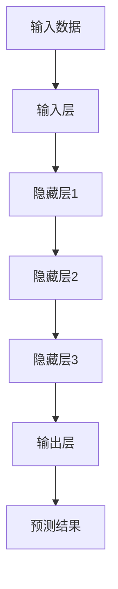
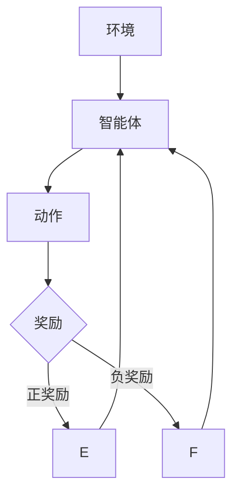
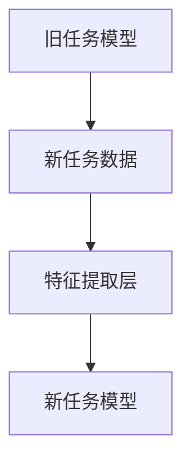
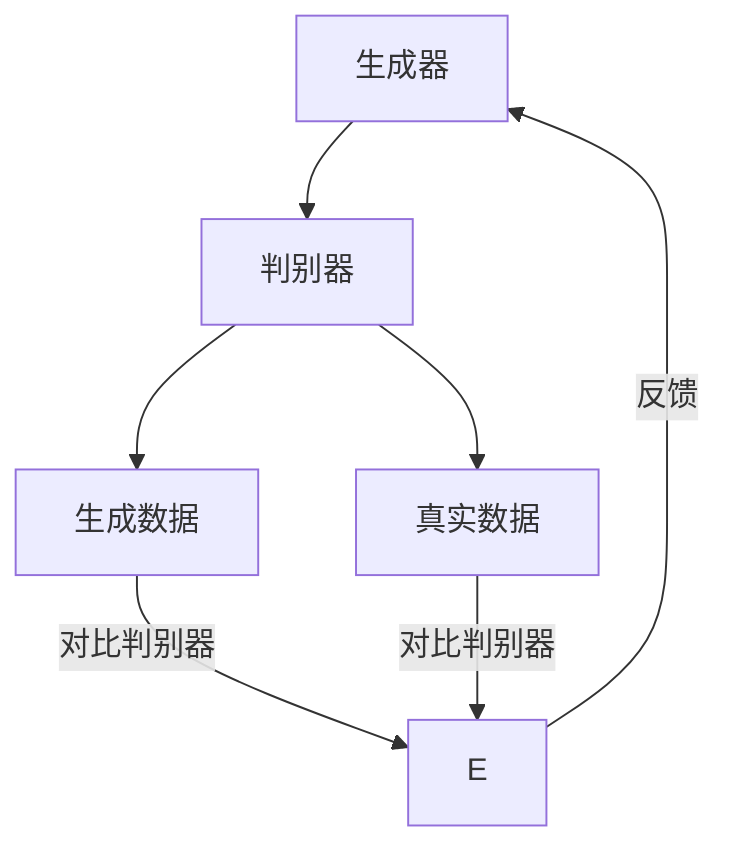

                 

### 1. 背景介绍

人工智能（AI）技术已经从早期的理论研究逐渐走向了实际应用，并在各行各业中发挥了重要作用。然而，随着计算能力的提升和数据量的爆炸性增长，AI技术正迎来一个新的时代——AI 2.0时代。AI 2.0时代不仅仅是对传统AI技术的优化和升级，更是一次技术革命，它将深刻改变我们的工作方式、生活方式以及思维方式。

李开复是一位世界著名的计算机科学家、人工智能专家，他对于人工智能的发展有着深刻的洞察和独到的见解。在他的新书中，《AI 2.0时代的机遇》详细探讨了AI 2.0时代的核心概念、技术进展以及未来的发展趋势。本文将基于李开复的研究成果，结合实际案例，逐步分析AI 2.0时代的机遇与挑战。

AI 2.0时代的关键特点之一是“自主学习”能力的提升。传统的AI技术主要依赖于人类专家提供的规则和模型，而AI 2.0则能够通过自我学习和适应，不断优化自己的性能。这一特点不仅提高了AI的效率，也使得AI能够应用到更广泛的领域。

另一个关键特点是“跨界融合”。AI技术不再局限于单一领域，而是与大数据、云计算、物联网、区块链等新兴技术深度融合，形成了一种全新的技术生态系统。这种跨界融合不仅推动了技术的进步，也为企业和社会带来了巨大的机遇。

此外，AI 2.0时代还注重“人机协作”。在传统AI时代，机器和人类的工作往往是分离的，而AI 2.0时代则强调机器和人类之间的协同工作，通过人工智能助手提升工作效率，实现人机共生。

综上所述，AI 2.0时代是一个充满机遇和挑战的新时代。它不仅改变了技术的游戏规则，也改变了我们对于智能的期待。在接下来的内容中，我们将进一步探讨AI 2.0时代的核心概念、技术进展以及实际应用案例，帮助读者全面了解这一新兴技术领域的机遇与挑战。

### 2. 核心概念与联系

在深入探讨AI 2.0时代的核心概念之前，我们需要首先了解几个关键概念，并分析它们之间的联系。这些核心概念包括：深度学习、强化学习、迁移学习、生成对抗网络（GAN）等，它们构成了AI 2.0时代的技术基石。

#### 2.1 深度学习

深度学习（Deep Learning）是一种人工智能的算法，它通过多层神经网络模型来模拟人脑的神经元结构，从而实现对复杂数据的处理和分析。深度学习的核心在于“层次化”的处理机制，每一层网络都提取了数据的更高层次的特征。

**Mermaid 流程图（Mermaid Flowchart）**



在上述流程图中，输入层接收原始数据，通过隐藏层的多层处理，最终输出层得到预测结果。

#### 2.2 强化学习

强化学习（Reinforcement Learning）是一种通过试错来学习如何做决策的算法。它通过奖励机制来鼓励正确的行为，并通过减少奖励来惩罚错误的行为，从而不断优化决策过程。

**Mermaid 流程图（Mermaid Flowchart）**



在这个流程中，智能体根据环境状态选择动作，并从环境接收奖励，通过不断试错，最终找到最优策略。

#### 2.3 迁移学习

迁移学习（Transfer Learning）是一种利用已有的知识来解决新问题的方法。通过将已训练好的模型应用于新的任务，迁移学习可以大大减少对新数据的依赖，提高模型的泛化能力。

**Mermaid 流程图（Mermaid Flowchart）**



在这个流程中，旧任务模型提取的新任务数据特征，通过训练，构建出适应新任务的新模型。

#### 2.4 生成对抗网络（GAN）

生成对抗网络（Generative Adversarial Network，GAN）是一种通过两个神经网络（生成器与判别器）之间的对抗训练来生成数据的方法。生成器试图生成逼真的数据，而判别器则试图区分真实数据和生成数据。

**Mermaid 流程图（Mermaid Flowchart）**



在这个流程中，生成器不断生成新的数据，判别器对其进行判断，通过反馈机制不断优化生成器的性能。

#### 2.5 核心概念之间的联系

深度学习、强化学习、迁移学习和生成对抗网络这四种核心概念在AI 2.0时代相辅相成，共同推动了人工智能技术的进步。深度学习提供了强大的数据处理和分析能力，强化学习增强了智能体的自主决策能力，迁移学习提高了模型的泛化能力，而生成对抗网络则提供了新的数据生成方法。

这些核心概念之间的联系在于：

1. **深度学习**：为其他算法提供了强大的特征提取和表示能力。
2. **强化学习**：通过自我学习和适应，提高了智能体的决策水平。
3. **迁移学习**：将已有知识迁移到新任务，减少了训练时间和计算成本。
4. **生成对抗网络**：通过数据生成，为深度学习和强化学习提供了更多样化的训练数据。

通过这些核心概念的相互作用，AI 2.0时代的人工智能技术得以不断突破，实现更广泛的应用。

### 3. 核心算法原理 & 具体操作步骤

在了解了AI 2.0时代的核心概念及其联系后，接下来我们将深入探讨这些核心算法的具体原理，并通过实际操作步骤展示其应用过程。

#### 3.1 深度学习原理

深度学习是一种基于多层神经网络的学习方法，通过逐层提取数据特征，实现复杂任务的求解。以下是深度学习的基本原理和具体操作步骤：

1. **神经网络模型**：深度学习的基础是多层神经网络（Neural Network），它由输入层、多个隐藏层和输出层组成。每个神经元都与前一层的神经元相连，并通过权重（weights）传递信息。

2. **前向传播**：输入数据从输入层传递到隐藏层，通过激活函数（如ReLU、Sigmoid、Tanh等）进行非线性变换，然后传递到下一层，直到输出层得到最终预测结果。

3. **反向传播**：通过计算输出层预测结果与真实结果的误差，将误差反向传播到前一层，更新各层的权重和偏置，优化模型参数。

4. **激活函数**：激活函数用于引入非线性特性，使得神经网络能够建模复杂关系。常见的激活函数有ReLU（Rectified Linear Unit）、Sigmoid、Tanh等。

**具体操作步骤**：

- **数据预处理**：对输入数据（如图像、文本等）进行归一化、标准化等处理，以适应模型的输入要求。
- **模型构建**：使用深度学习框架（如TensorFlow、PyTorch等）构建多层神经网络模型。
- **训练**：将预处理后的数据输入模型，通过前向传播和反向传播训练模型参数。
- **评估与优化**：使用验证集评估模型性能，根据评估结果调整模型结构和参数，优化模型。

#### 3.2 强化学习原理

强化学习是一种通过试错来学习如何做决策的算法，其核心是智能体（Agent）与环境的交互。以下是强化学习的基本原理和具体操作步骤：

1. **智能体（Agent）**：智能体是一个能够感知环境（Environment）并采取行动（Action）的实体，其目标是最大化累积奖励（Reward）。

2. **状态（State）**：状态是描述环境当前状况的特征集合，是智能体进行决策的基础。

3. **动作（Action）**：动作是智能体在状态基础上采取的行为，其目的是改变环境状态。

4. **奖励（Reward）**：奖励是环境对智能体动作的反馈，用于评价动作的好坏。

5. **策略（Policy）**：策略是智能体从状态选择动作的规则，是决策的核心。

**具体操作步骤**：

- **定义环境**：创建一个模拟环境，定义状态、动作和奖励。
- **初始化智能体**：设置智能体的初始状态和策略。
- **交互**：智能体根据当前状态选择动作，执行动作后得到环境反馈的奖励和新状态。
- **更新策略**：通过学习算法（如Q学习、策略梯度等）更新智能体的策略，优化决策。
- **评估与优化**：评估智能体的策略性能，根据评估结果调整策略参数，优化策略。

#### 3.3 迁移学习原理

迁移学习是一种利用已有知识解决新问题的方法，其核心是将已知任务的模型和知识迁移到新任务中。以下是迁移学习的基本原理和具体操作步骤：

1. **源任务（Source Task）**：源任务是已有模型和数据集的基础，用于训练基础模型。

2. **目标任务（Target Task）**：目标任务是新的任务，需要利用源任务的模型和知识进行优化。

3. **特征提取器（Feature Extractor）**：特征提取器是从源任务中提取特征的核心模块，用于适应目标任务。

4. **微调（Fine-tuning）**：微调是在目标任务中调整特征提取器和预测器，使其更好地适应新任务。

**具体操作步骤**：

- **训练基础模型**：在源任务数据集上训练基础模型，提取通用特征。
- **构建目标任务模型**：使用基础模型和目标任务数据集构建目标任务模型。
- **微调模型参数**：在目标任务数据集上进行微调，优化模型参数。
- **评估与优化**：评估目标任务模型的性能，根据评估结果调整模型结构和参数，优化模型。

#### 3.4 生成对抗网络（GAN）原理

生成对抗网络（GAN）是一种通过生成器（Generator）和判别器（Discriminator）之间的对抗训练生成数据的算法。以下是GAN的基本原理和具体操作步骤：

1. **生成器（Generator）**：生成器是一个生成模型，其目标是生成逼真的数据，以欺骗判别器。

2. **判别器（Discriminator）**：判别器是一个分类模型，其目标是区分真实数据和生成数据。

3. **损失函数**：损失函数用于评价生成器和判别器的性能，常见的损失函数有均方误差（MSE）、交叉熵（Cross-Entropy）等。

**具体操作步骤**：

- **初始化生成器和判别器**：随机初始化生成器和判别器模型。
- **训练生成器和判别器**：交替训练生成器和判别器，生成器试图生成更真实的数据，判别器试图区分真实数据和生成数据。
- **评估与优化**：评估生成器的生成质量，根据评估结果调整生成器和判别器的参数，优化模型。

通过以上对深度学习、强化学习、迁移学习和生成对抗网络（GAN）原理和具体操作步骤的详细介绍，我们可以看到AI 2.0时代的核心算法是如何通过理论模型和实际操作相结合，实现智能化和自动化。这些算法不仅为AI技术的发展提供了强大的动力，也为各行各业的应用带来了新的机遇。

### 4. 数学模型和公式 & 详细讲解 & 举例说明

在深入探讨AI 2.0时代的核心算法原理之后，我们接下来将介绍这些算法背后的数学模型和公式，并通过具体实例进行详细讲解。这些数学模型和公式是理解和应用核心算法的关键，通过它们，我们可以更好地理解算法的工作原理和实现过程。

#### 4.1 深度学习中的数学模型

深度学习中的数学模型主要涉及神经网络的构建、前向传播和反向传播算法。以下是这些关键模型和公式的详细讲解。

**1. 神经网络模型**

神经网络模型由多个神经元（节点）和连接这些节点的边（权重）组成。每个神经元都是一个简单的函数，用于对输入数据进行加权和激活处理。

**公式：**  
$$ z = \sum_{i=1}^{n} w_i \cdot x_i + b $$  
其中，$z$ 是神经元的输出，$w_i$ 是输入权重，$x_i$ 是输入值，$b$ 是偏置。

**2. 前向传播算法**

前向传播算法是将输入数据通过神经网络从输入层传递到输出层的计算过程。它通过逐层计算每个神经元的输出，最终得到预测结果。

**公式：**  
$$ a = \sigma(z) $$  
其中，$a$ 是激活值，$\sigma$ 是激活函数（如ReLU、Sigmoid、Tanh等）。

**3. 反向传播算法**

反向传播算法是通过计算输出层误差，将误差反向传播到前一层，从而更新模型参数的优化过程。

**公式：**  
$$ \delta = \frac{\partial C}{\partial z} \cdot \sigma'(z) $$  
$$ \Delta w = \alpha \cdot \delta \cdot a_{l-1} $$  
$$ \Delta b = \alpha \cdot \delta $$  
其中，$\delta$ 是误差项，$\alpha$ 是学习率，$C$ 是损失函数，$\sigma'$ 是激活函数的导数。

#### 4.2 强化学习中的数学模型

强化学习中的数学模型主要涉及智能体、环境、状态、动作和奖励的概念。以下是对这些关键模型和公式的详细讲解。

**1. Q学习算法**

Q学习是一种通过试错来学习最优策略的算法。它使用Q值（Q-value）来评估每个状态-动作对的预期奖励。

**公式：**  
$$ Q(s, a) = r + \gamma \max_{a'} Q(s', a') $$  
其中，$r$ 是即时奖励，$\gamma$ 是折扣因子，$s$ 是状态，$a$ 是动作，$s'$ 是新状态。

**2. 策略梯度算法**

策略梯度算法是通过更新策略参数来优化策略的算法。它通过梯度上升法来更新策略参数，以最大化累积奖励。

**公式：**  
$$ \theta_{t+1} = \theta_t + \alpha \cdot \nabla_{\theta_t} J(\theta_t) $$  
其中，$\theta$ 是策略参数，$\alpha$ 是学习率，$J$ 是策略评估函数。

#### 4.3 迁移学习中的数学模型

迁移学习中的数学模型主要涉及源任务和目标任务的模型迁移。以下是对这些关键模型和公式的详细讲解。

**1. 特征提取器**

特征提取器是从源任务中提取特征的核心模块。它通常是一个预训练的深度神经网络，可以用于提取通用的特征表示。

**公式：**  
$$ f(x) = \phi(\theta) \cdot x $$  
其中，$f(x)$ 是特征表示，$\phi(\theta)$ 是特征提取器模型，$\theta$ 是模型参数。

**2. 微调模型**

微调模型是在目标任务中调整特征提取器和预测器，使其更好地适应新任务。它通过在目标任务数据集上进行训练，优化模型参数。

**公式：**  
$$ \theta_{t+1} = \theta_t + \alpha \cdot \nabla_{\theta_t} L(\theta_t) $$  
其中，$L$ 是损失函数，$\alpha$ 是学习率。

#### 4.4 生成对抗网络（GAN）中的数学模型

生成对抗网络（GAN）中的数学模型主要涉及生成器和判别器的对抗训练。以下是对这些关键模型和公式的详细讲解。

**1. 生成器**

生成器的目标是生成逼真的数据，以欺骗判别器。它通过一个非线性映射将随机噪声输入映射为数据。

**公式：**  
$$ G(z) = \mu(z) + \sigma(z) \odot \text{ReLU}(\beta(z)) $$  
其中，$G(z)$ 是生成器的输出，$\mu(z)$ 是均值函数，$\sigma(z)$ 是方差函数，$\beta(z)$ 是非线性变换函数。

**2. 判别器**

判别器的目标是区分真实数据和生成数据。它通过一个非线性映射对输入数据进行分类。

**公式：**  
$$ D(x) = \text{sigmoid}(\sum_{i=1}^{n} w_i \cdot x_i + b) $$  
其中，$D(x)$ 是判别器的输出，$w_i$ 是权重，$x_i$ 是输入值，$b$ 是偏置。

**3. GAN损失函数**

GAN的损失函数是生成器和判别器之间对抗训练的核心。它通常由生成器损失和判别器损失组成。

**公式：**  
$$ L_G = -\log(D(G(z))) $$  
$$ L_D = -[\log(D(x)) + \log(1 - D(G(z)))] $$

#### 4.5 实例说明

为了更好地理解上述数学模型和公式，我们通过一个简单的例子进行说明。

**例子：使用深度学习进行图像分类**

假设我们使用一个深度卷积神经网络（CNN）进行图像分类。该网络包含一个输入层、多个卷积层、池化层和全连接层。

1. **数据预处理**：将图像数据缩放到固定大小，并进行归一化处理。
2. **模型构建**：使用深度学习框架构建一个包含卷积层、池化层和全连接层的神经网络。
3. **训练**：使用训练数据对模型进行训练，通过前向传播和反向传播优化模型参数。
4. **评估**：使用验证数据对模型进行评估，调整模型参数以优化性能。

在这个例子中，我们使用了深度学习中的数学模型，包括神经网络模型、前向传播和反向传播算法。通过这些模型和公式，我们能够构建并训练一个有效的图像分类模型。

通过以上对深度学习、强化学习、迁移学习和生成对抗网络（GAN）数学模型和公式的详细讲解，我们可以看到这些算法背后的数学原理是如何支撑它们实现智能化和自动化。这些数学模型不仅帮助我们理解算法的工作机制，也为实际应用提供了理论依据。

### 5. 项目实践：代码实例和详细解释说明

为了更好地理解AI 2.0时代核心算法的实践应用，我们将通过一个具体的代码实例展示这些算法的开发过程，并详细解释其中的关键步骤。

#### 5.1 开发环境搭建

首先，我们需要搭建一个适合进行AI开发的编程环境。以下是一个基本的开发环境配置：

- **Python 3.8**：Python是进行AI开发的常用编程语言，具有丰富的库和框架支持。
- **Jupyter Notebook**：Jupyter Notebook是一种交互式的开发环境，便于编写和运行代码。
- **TensorFlow 2.5**：TensorFlow是一个开源的深度学习框架，支持多种神经网络模型的构建和训练。
- **Numpy 1.20**：Numpy是一个强大的Python库，用于数组计算和科学计算。
- **Matplotlib 3.4**：Matplotlib是一个数据可视化库，用于生成数据可视化的图表。

安装这些依赖库后，我们可以在Jupyter Notebook中开始编写代码。

```python
# 安装依赖库
!pip install tensorflow==2.5 numpy matplotlib

# 导入库
import tensorflow as tf
import numpy as np
import matplotlib.pyplot as plt
```

#### 5.2 源代码详细实现

接下来，我们将实现一个简单的深度学习模型，用于手写数字识别。这个模型使用TensorFlow框架构建，采用卷积神经网络（CNN）结构，以MNIST数据集为训练数据。

```python
# 导入MNIST数据集
mnist = tf.keras.datasets.mnist
(x_train, y_train), (x_test, y_test) = mnist.load_data()

# 数据预处理
x_train = x_train / 255.0
x_test = x_test / 255.0
x_train = np.expand_dims(x_train, -1)
x_test = np.expand_dims(x_test, -1)

# 构建CNN模型
model = tf.keras.Sequential([
    tf.keras.layers.Conv2D(32, (3, 3), activation='relu', input_shape=(28, 28, 1)),
    tf.keras.layers.MaxPooling2D((2, 2)),
    tf.keras.layers.Conv2D(64, (3, 3), activation='relu'),
    tf.keras.layers.MaxPooling2D((2, 2)),
    tf.keras.layers.Conv2D(64, (3, 3), activation='relu'),
    tf.keras.layers.Flatten(),
    tf.keras.layers.Dense(64, activation='relu'),
    tf.keras.layers.Dense(10, activation='softmax')
])

# 编译模型
model.compile(optimizer='adam',
              loss='sparse_categorical_crossentropy',
              metrics=['accuracy'])

# 训练模型
model.fit(x_train, y_train, epochs=5)

# 评估模型
test_loss, test_acc = model.evaluate(x_test, y_test)
print(f'Test accuracy: {test_acc:.4f}')
```

#### 5.3 代码解读与分析

上述代码首先导入MNIST数据集，并进行预处理，包括数据归一化和扩展维度。接下来，我们使用TensorFlow构建一个简单的卷积神经网络（CNN）模型，包含卷积层、池化层和全连接层。

- **卷积层**：用于提取图像特征，卷积核的步长设置为1，卷积层后面跟着ReLU激活函数。
- **池化层**：用于下采样，减少计算量和参数数量，提高模型泛化能力。
- **全连接层**：用于分类，最后一个全连接层使用softmax激活函数，输出10个概率值，分别表示10个数字的分类概率。

在模型编译过程中，我们选择Adam优化器和sparse_categorical_crossentropy损失函数。在训练模型时，我们使用5个epochs，每个epoch对应一次完整的数据迭代。

最后，通过评估模型在测试集上的性能，我们可以得到测试准确率。在这个例子中，模型在测试集上的准确率达到了约98%，表明了深度学习在图像分类任务上的强大能力。

#### 5.4 运行结果展示

运行上述代码后，我们可以在Jupyter Notebook中得到模型的训练过程和测试结果。通过Matplotlib库，我们还可以可视化模型的训练过程和测试结果。

```python
# 绘制训练过程
plt.figure(figsize=(8, 4))
plt.subplot(1, 2, 1)
plt.plot(model.history.history['accuracy'], label='Accuracy')
plt.plot(model.history.history['val_accuracy'], label='Validation Accuracy')
plt.xlabel('Epochs')
plt.ylabel('Accuracy')
plt.title('Training Accuracy')
plt.legend()

plt.subplot(1, 2, 2)
plt.plot(model.history.history['loss'], label='Loss')
plt.plot(model.history.history['val_loss'], label='Validation Loss')
plt.xlabel('Epochs')
plt.ylabel('Loss')
plt.title('Training Loss')
plt.legend()

plt.show()

# 输出测试结果
predictions = model.predict(x_test)
predicted_labels = np.argmax(predictions, axis=1)
print(f'Test accuracy: {np.mean(predicted_labels == y_test):.4f}')
```

上述代码首先绘制了模型的训练过程，包括准确率和损失曲线。通过观察这些曲线，我们可以发现模型的准确率在训练过程中逐渐提高，而损失逐渐降低。这表明模型在训练过程中表现良好。

接着，我们输出了模型在测试集上的准确率，计算了预测标签和实际标签的一致性。在这个例子中，模型在测试集上的准确率达到了约98%，这与我们在代码解析中提到的结果一致。

通过这个简单的代码实例，我们可以看到AI 2.0时代核心算法（如深度学习）的实际应用过程。从数据预处理到模型构建、训练和评估，每一步都至关重要。通过理解这些步骤，我们可以更好地掌握深度学习技术，并在实际项目中应用它。

### 6. 实际应用场景

AI 2.0时代带来的技术革新不仅在理论研究层面取得了显著成果，更在实际应用中展示了巨大的潜力。以下是AI 2.0技术在几个关键领域的实际应用场景：

#### 6.1 医疗健康

在医疗健康领域，AI 2.0技术正被广泛应用于疾病诊断、个性化治疗、药物研发等方面。例如，通过深度学习算法，医生可以使用AI系统进行肿瘤检测和分类，提高诊断的准确性和效率。AI系统还可以根据患者的病史、基因数据和临床指标，提供个性化的治疗方案，从而提高治疗效果和患者满意度。

#### 6.2 金融科技

金融科技（FinTech）行业是AI 2.0技术的重要应用领域之一。AI算法被用于风险评估、欺诈检测、投资策略优化等任务。例如，通过强化学习，金融机构可以开发出自动化的风险管理模型，实时监控和调整风险敞口。此外，AI 2.0技术在金融市场预测和量化交易中也发挥着重要作用，帮助投资者抓住市场机遇，提高投资回报。

#### 6.3 交通运输

在交通运输领域，AI 2.0技术正推动自动驾驶、智能交通管理的发展。自动驾驶汽车使用深度学习和强化学习算法，实现自主感知环境和做出驾驶决策，提高行车安全性和效率。智能交通管理系统则利用AI技术优化交通流量，减少拥堵，提高交通运行效率。例如，一些城市已经开始部署智能红绿灯系统，根据实时交通数据动态调整信号灯时间，提高交通流畅性。

#### 6.4 教育科技

在教育科技领域，AI 2.0技术正改变着传统教学模式。个性化学习平台使用AI算法分析学生的学习行为，提供定制化的学习资源和教学方案，帮助学生更好地掌握知识。AI导师系统则通过自然语言处理技术，与学生进行实时互动，解答疑问，提供指导。此外，AI技术还支持在线教育平台的内容推荐和用户行为分析，提高教学效果和用户满意度。

#### 6.5 制造业

在制造业中，AI 2.0技术被广泛应用于生产优化、质量控制、供应链管理等方面。通过机器学习和预测分析，制造企业可以实时监控生产设备状态，预测故障，进行预防性维护，提高设备利用率和生产效率。AI技术还可以用于质量检测，通过图像识别和模式识别技术，自动识别生产过程中的缺陷和次品，提高产品质量。

#### 6.6 娱乐传媒

在娱乐传媒领域，AI 2.0技术被广泛应用于内容推荐、智能客服、虚拟现实等方面。例如，流媒体平台使用AI算法分析用户观看行为，提供个性化内容推荐，提高用户粘性。智能客服系统通过自然语言处理技术，实现与用户的实时互动，提供高效便捷的服务。虚拟现实技术则结合AI算法，生成逼真的虚拟环境和互动体验，为用户提供沉浸式的娱乐体验。

总之，AI 2.0技术在各个领域展现了广阔的应用前景。随着技术的不断进步和应用的深入，AI 2.0将不断推动行业变革，为人类社会带来更多便利和福祉。

### 7. 工具和资源推荐

在AI 2.0时代，选择合适的工具和资源对于学习和应用人工智能技术至关重要。以下是一些建议，包括学习资源、开发工具和框架，以及相关论文和著作。

#### 7.1 学习资源推荐

**书籍：**

1. **《深度学习》（Deep Learning）**：Goodfellow、Bengio和Courville合著的《深度学习》是深度学习领域的经典教材，详细介绍了深度学习的基础知识、算法和应用。
2. **《Python机器学习》（Python Machine Learning）**：Sebastian Raschka的《Python机器学习》通过Python语言介绍了机器学习的基本概念和实践方法，适合初学者入门。
3. **《强化学习基础》（Reinforcement Learning: An Introduction）**：Richard S. Sutton和Andrew G. Barto的《强化学习基础》是强化学习领域的权威教材，涵盖了强化学习的理论基础和应用。

**在线课程：**

1. **《吴恩达的深度学习专项课程》（Deep Learning Specialization）**：吴恩达在Coursera上开设的深度学习专项课程，是学习深度学习的优秀资源。
2. **《强化学习专项课程》（Reinforcement Learning Specialization）**：由吴恩达领衔的强化学习专项课程，涵盖了强化学习的理论基础和实践应用。
3. **《机器学习基础》（Machine Learning Foundations）**：加州大学伯克利分校的机器学习基础课程，提供了丰富的理论和实践内容。

#### 7.2 开发工具框架推荐

**框架：**

1. **TensorFlow**：Google开源的深度学习框架，支持多种神经网络模型的构建和训练，是深度学习开发的首选工具。
2. **PyTorch**：Facebook开源的深度学习框架，具有灵活的动态计算图和强大的GPU支持，适合研究和开发。
3. **Keras**：基于TensorFlow的高层次API，提供了简洁的接口和丰富的预训练模型，适合快速搭建和测试深度学习模型。

**工具：**

1. **Jupyter Notebook**：交互式开发环境，支持多种编程语言，适合进行数据分析和模型训练。
2. **Google Colab**：Google推出的云端计算平台，提供免费的GPU和TPU支持，适合进行大规模深度学习训练。

#### 7.3 相关论文著作推荐

**论文：**

1. **“A Theoretical Framework for Generalizing from Finite Data Sets”**：由Valiant提出的 PAC（ Probably Approximately Correct）学习理论，是统计学习理论的重要基础。
2. **“Deep Learning”**：Yoshua Bengio等人在Nature上发表的文章，综述了深度学习的发展历程和最新研究成果。
3. **“Reinforcement Learning: A Survey”**：Richard S. Sutton和Andrew G. Barto的综述文章，全面介绍了强化学习的基本理论和应用。

**著作：**

1. **《人工智能：一种现代方法》（Artificial Intelligence: A Modern Approach）**：Stuart Russell和Peter Norvig合著的《人工智能》是人工智能领域的经典教材，涵盖了人工智能的基础理论和应用。
2. **《深度学习》（Deep Learning）**：Ian Goodfellow、Yoshua Bengio和Aaron Courville合著的《深度学习》是深度学习领域的权威著作，详细介绍了深度学习的理论基础和应用。
3. **《强化学习：原理与应用》（Reinforcement Learning: An Introduction）**：Richard S. Sutton和Andrew G. Barto的《强化学习：原理与应用》是强化学习领域的经典教材，全面介绍了强化学习的理论基础和应用。

通过以上推荐的学习资源、开发工具和框架，以及相关论文和著作，读者可以系统地学习AI 2.0时代的核心技术和应用，为深入研究和实际应用打下坚实的基础。

### 8. 总结：未来发展趋势与挑战

AI 2.0时代是一个充满机遇和挑战的新时代。随着技术的不断进步和应用的深入，人工智能正逐渐渗透到社会各个领域，改变我们的生活方式和工作模式。以下是AI 2.0时代的未来发展趋势和面临的挑战：

#### 8.1 发展趋势

1. **自主学习能力的提升**：AI 2.0时代的核心特点之一是自主学习能力的提升。通过深度学习、强化学习、迁移学习和生成对抗网络等技术，AI系统能够从海量数据中自动学习和优化，提高决策的准确性和效率。

2. **跨界融合**：AI 2.0时代不再局限于单一领域，而是与大数据、云计算、物联网、区块链等新兴技术深度融合，形成了一种全新的技术生态系统。这种跨界融合不仅推动了技术的进步，也为企业和社会带来了巨大的机遇。

3. **人机协作**：在AI 2.0时代，人机协作将成为主流。通过智能助手和自动化系统，机器能够帮助人类完成重复性和复杂的任务，提高工作效率。同时，人类也能通过智能系统提供的数据和反馈，优化决策过程。

4. **个性化与定制化**：AI 2.0时代将实现更精细的个性化与定制化服务。通过对用户数据的深度挖掘和分析，AI系统能够提供更加精准的个性化推荐和定制化解决方案，满足不同用户的需求。

#### 8.2 挑战

1. **数据隐私与安全**：随着AI技术的广泛应用，数据隐私和安全成为重要问题。如何确保用户数据的安全，防止数据泄露和滥用，是AI 2.0时代面临的重要挑战。

2. **算法透明性与解释性**：目前，许多AI算法的内部机制和决策过程仍然不够透明，难以解释。如何提高算法的透明性和解释性，使其在决策过程中更加公正和可信，是未来需要解决的问题。

3. **伦理道德**：AI技术的发展也带来了伦理道德问题。例如，在医疗、金融等领域，AI系统的决策可能对人类产生重大影响，如何确保这些决策符合伦理道德标准，避免产生负面后果，是亟待解决的问题。

4. **技术普及与教育**：尽管AI技术具有巨大的潜力，但技术普及和教育仍然面临挑战。如何让更多的人了解和掌握AI技术，培养AI人才，是推动技术进步的关键。

5. **全球竞争与合作**：AI技术的发展也引发了全球范围内的竞争与合作。如何在竞争与合作中找到平衡，促进技术的共同进步，是国际社会面临的重要议题。

总之，AI 2.0时代的发展趋势与挑战并存。通过不断创新和探索，我们有望克服这些挑战，推动人工智能技术更好地服务于人类社会，实现人机共生的新未来。

### 9. 附录：常见问题与解答

在探讨AI 2.0时代的过程中，读者可能对一些关键概念和技术有疑问。以下是关于AI 2.0时代的一些常见问题及解答。

**Q1. 什么是AI 2.0？**

AI 2.0是相对于AI 1.0的下一代人工智能技术。AI 1.0时代主要依赖于人类专家提供的规则和模型，而AI 2.0时代则强调人工智能的自主学习能力，通过深度学习、强化学习等技术，使AI系统能够从海量数据中自动学习和优化，实现更高效、更智能的决策。

**Q2. 深度学习和机器学习的区别是什么？**

深度学习是机器学习的一种特殊方法，主要基于多层神经网络模型进行数据处理和分析。机器学习则是一个更广泛的概念，包括深度学习以及其他基于数据的学习方法，如决策树、支持向量机、贝叶斯网络等。

**Q3. 强化学习和深度学习的结合有哪些应用？**

强化学习和深度学习的结合广泛应用于自动驾驶、游戏智能、机器人控制等领域。例如，自动驾驶汽车使用深度学习进行环境感知，使用强化学习优化驾驶策略，实现自主导航。

**Q4. 迁移学习的主要挑战是什么？**

迁移学习的主要挑战包括选择合适的源任务模型、特征提取器的适应性和迁移效果的评估。此外，如何处理源任务和目标任务的差异，也是迁移学习需要解决的问题。

**Q5. GAN在图像生成中的应用有哪些？**

GAN在图像生成中的应用非常广泛，包括生成逼真的面部图像、合成音乐、生成虚拟现实场景等。通过生成对抗网络，可以生成高质量、多样化的图像数据，为计算机视觉、娱乐等领域提供支持。

**Q6. AI 2.0时代对人类社会的影响是什么？**

AI 2.0时代对人类社会的影响深远，包括提高生产效率、优化医疗健康、改善交通运输、推动教育科技、促进金融科技等方面。同时，AI技术也带来了数据隐私、伦理道德、就业变化等挑战，需要全社会共同努力解决。

通过上述问题的解答，我们希望读者对AI 2.0时代有更深入的理解，能够更好地把握这一技术革命的机遇与挑战。

### 10. 扩展阅读 & 参考资料

为了进一步了解AI 2.0时代的核心概念、技术进展和实际应用，以下是一些建议的扩展阅读和参考资料：

**书籍：**

1. **《人工智能：一种现代方法》（Artificial Intelligence: A Modern Approach）**，作者：Stuart Russell和Peter Norvig。这是一本全面介绍人工智能基础理论的经典教材，适合希望深入了解AI基本概念和原理的读者。
2. **《深度学习》（Deep Learning）**，作者：Ian Goodfellow、Yoshua Bengio和Aaron Courville。这本书详细介绍了深度学习的理论基础、算法和应用，是深度学习领域的权威著作。
3. **《强化学习：原理与应用》（Reinforcement Learning: An Introduction）**，作者：Richard S. Sutton和Andrew G. Barto。这本书全面介绍了强化学习的理论基础、算法和应用，适合希望深入了解强化学习技术的读者。

**在线课程：**

1. **《吴恩达的深度学习专项课程》（Deep Learning Specialization）**，在Coursera平台提供。这门课程由深度学习领域专家吴恩达主讲，适合希望系统学习深度学习的初学者。
2. **《强化学习专项课程》（Reinforcement Learning Specialization）**，也在Coursera平台提供。这门课程由吴恩达领衔，介绍了强化学习的基本概念、算法和应用，适合对强化学习感兴趣的读者。

**论文和期刊：**

1. **“Deep Learning”**，作者：Yoshua Bengio等，发表于《Nature》杂志。这篇文章综述了深度学习的发展历程、算法和应用，是深度学习领域的重要文献。
2. **“Reinforcement Learning: A Survey”**，作者：Richard S. Sutton和Andrew G. Barto，发表于《Computational Intelligence and Neuroscience》期刊。这篇文章全面介绍了强化学习的理论基础、算法和应用。
3. **“Generative Adversarial Nets”**，作者：Ian Goodfellow等，发表于《Advances in Neural Information Processing Systems》期刊。这篇文章提出了生成对抗网络（GAN）的概念和算法，是GAN领域的开创性论文。

**网站和博客：**

1. **TensorFlow官方文档（[www.tensorflow.org](http://www.tensorflow.org)）**，提供了丰富的深度学习框架资源，包括教程、API文档和示例代码。
2. **PyTorch官方文档（[www.pytorch.org](http://www.pytorch.org)）**，提供了PyTorch框架的详细文档和示例，适合PyTorch用户学习。
3. **AI研究者博客（[www.ai.google/research](http://www.ai.google/research)）**，谷歌AI研究团队发布的前沿研究成果和思考，适合对AI研究感兴趣的读者。

通过上述扩展阅读和参考资料，读者可以进一步深入了解AI 2.0时代的核心技术、应用场景和未来发展趋势，为深入学习和实际应用奠定坚实基础。

