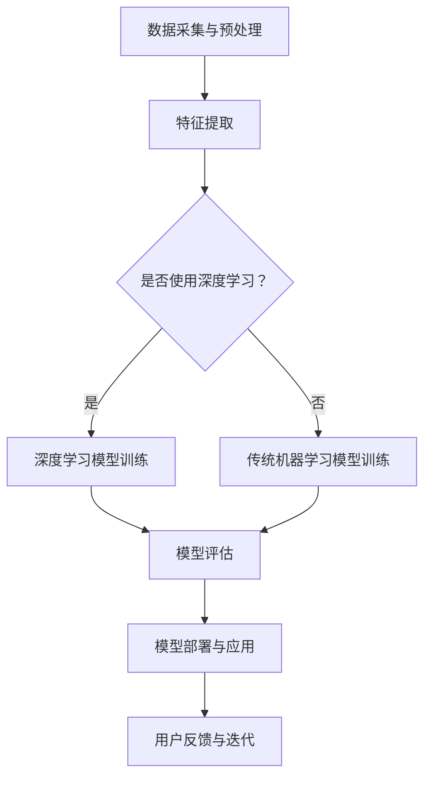

                 

### 1. 背景介绍

随着人工智能（AI）技术的迅速发展，我们正迎来一个崭新的时代——AI 2.0 时代。AI 2.0 不仅超越了传统的人工智能，还为我们带来了更多的机遇和挑战。在这个时代，人工智能将不仅仅是计算机科学的一个分支，而是成为我们日常生活中不可或缺的一部分。

李开复博士作为世界顶级的人工智能专家，他对AI 2.0 时代的理解和见解具有极高的权威性。在他的新书《李开复：AI 2.0 时代的机遇》中，详细剖析了AI 2.0 时代的本质特征、技术发展趋势以及其所带来的深远影响。

AI 2.0 时代的主要特征是智能化、自动化和自适应。与传统的 AI 技术相比，AI 2.0 具有更强的学习能力和通用性，能够处理更为复杂的任务和场景。这一技术的突破，使得人工智能不再是少数科技专家的专利，而是成为了普通人日常生活的一部分。

在这一背景下，本文将结合李开复博士的观点，逐步分析 AI 2.0 时代的机遇。我们将从以下几个方面进行探讨：

1. **核心概念与联系**：首先，我们将介绍 AI 2.0 的核心概念，并通过 Mermaid 流程图展示其架构。
2. **核心算法原理 & 具体操作步骤**：接下来，我们将深入探讨 AI 2.0 的核心技术原理，并详细讲解其操作步骤。
3. **数学模型和公式**：我们将介绍 AI 2.0 中的关键数学模型，并通过 LaTeX 格式详细讲解和举例说明。
4. **项目实践**：我们将通过一个实际项目，展示如何使用 AI 2.0 技术进行开发，并提供详细的代码实例和解读。
5. **实际应用场景**：我们将探讨 AI 2.0 在不同领域的应用场景，展示其如何改变我们的工作和生活。
6. **工具和资源推荐**：最后，我们将推荐一些学习资源、开发工具和论文著作，帮助读者进一步深入了解 AI 2.0。

通过以上分析，我们将全面理解 AI 2.0 时代的机遇，并为未来的发展做好准备。

### 2. 核心概念与联系

在探讨 AI 2.0 时代的机遇之前，我们需要明确一些核心概念，以便更好地理解这一时代的技术基础和架构。

#### 2.1 人工智能的定义

人工智能（Artificial Intelligence，简称 AI）是指通过计算机系统模拟人类智能的行为和思维过程。它涵盖了多个领域，包括机器学习、深度学习、自然语言处理、计算机视觉等。

#### 2.2 机器学习与深度学习

机器学习（Machine Learning，ML）是人工智能的一个重要分支，它通过算法让计算机从数据中自动学习，无需显式编程。深度学习（Deep Learning，DL）是机器学习的一种特殊形式，它使用多层神经网络来模拟人类大脑的学习过程。

#### 2.3 自然语言处理（NLP）与计算机视觉

自然语言处理（Natural Language Processing，NLP）旨在让计算机理解和处理自然语言，如英语、中文等。计算机视觉（Computer Vision，CV）则使计算机能够理解视觉信息，如识别图像中的物体、场景等。

#### 2.4 AI 2.0 的架构

为了更好地理解 AI 2.0 的架构，我们可以使用 Mermaid 流程图来展示其关键组成部分。



在上述流程图中，我们可以看到 AI 2.0 的主要步骤包括数据采集与预处理、特征提取、模型训练、模型评估、模型部署与应用以及用户反馈与迭代。这一架构强调了数据的重要性，并突出了深度学习和传统机器学习的结合。

#### 2.5 关键技术的联系

在 AI 2.0 时代，各种核心技术相互关联，共同推动人工智能的发展。例如，自然语言处理和计算机视觉的结合可以创造出更智能的助手，而深度学习和传统机器学习的结合则可以解决更为复杂的任务。

通过上述分析，我们可以看到 AI 2.0 时代的核心概念和技术之间的紧密联系。这些概念和技术的融合，使得人工智能不再局限于特定领域，而是成为了一个跨越多个行业的通用技术。

### 3. 核心算法原理 & 具体操作步骤

在了解了 AI 2.0 的核心概念和架构之后，我们接下来将深入探讨 AI 2.0 的核心技术原理，并详细讲解其具体操作步骤。这些核心技术包括机器学习、深度学习、自然语言处理和计算机视觉。

#### 3.1 机器学习原理

机器学习是一种让计算机从数据中自动学习的方法。其基本原理是利用数据训练模型，使模型能够对未知数据进行预测或分类。

**具体操作步骤：**

1. **数据采集**：从各种来源收集数据，如数据库、网络爬虫、传感器等。
2. **数据预处理**：清洗数据，去除噪声，进行数据标准化和归一化。
3. **特征提取**：从原始数据中提取对学习任务有帮助的特征。
4. **模型选择**：选择合适的机器学习算法，如线性回归、决策树、支持向量机等。
5. **模型训练**：使用训练数据对模型进行训练，调整模型参数。
6. **模型评估**：使用测试数据评估模型性能，如准确率、召回率等。
7. **模型部署**：将训练好的模型部署到实际应用场景中。

#### 3.2 深度学习原理

深度学习是机器学习的一种特殊形式，它使用多层神经网络来模拟人类大脑的学习过程。其基本原理是通过反向传播算法不断调整网络权重，以最小化预测误差。

**具体操作步骤：**

1. **数据采集**：与机器学习相同，从各种来源收集数据。
2. **数据预处理**：同样需要清洗数据，进行数据标准化和归一化。
3. **模型设计**：设计神经网络结构，包括输入层、隐藏层和输出层。
4. **模型训练**：使用训练数据对模型进行训练，调整网络权重。
5. **模型评估**：与机器学习相同，使用测试数据评估模型性能。
6. **模型部署**：将训练好的模型部署到实际应用场景中。

#### 3.3 自然语言处理原理

自然语言处理旨在让计算机理解和处理自然语言。其基本原理是通过语言模型、词向量、序列模型等技术，将自然语言转换为计算机可处理的形式。

**具体操作步骤：**

1. **文本预处理**：对文本进行分词、去停用词、词性标注等处理。
2. **语言模型训练**：使用大量文本数据训练语言模型，如 n-gram 模型、神经网络语言模型等。
3. **词向量表示**：将文本转换为词向量表示，如 Word2Vec、GloVe 等。
4. **序列模型训练**：使用序列模型对文本进行建模，如循环神经网络（RNN）、长短期记忆网络（LSTM）、变换器（Transformer）等。
5. **模型评估**：使用测试数据评估模型性能，如文本分类、情感分析等。
6. **模型部署**：将训练好的模型部署到实际应用场景中。

#### 3.4 计算机视觉原理

计算机视觉旨在让计算机理解视觉信息。其基本原理是通过图像处理、特征提取、目标检测等技术，将图像数据转换为计算机可处理的形式。

**具体操作步骤：**

1. **图像预处理**：对图像进行灰度化、二值化、边缘检测等处理。
2. **特征提取**：从图像中提取对目标检测有帮助的特征，如 HOG、SIFT、SURF 等。
3. **目标检测**：使用目标检测算法，如 R-CNN、Fast R-CNN、Faster R-CNN 等，对图像中的目标进行定位和识别。
4. **模型评估**：使用测试数据评估模型性能，如准确率、召回率等。
5. **模型部署**：将训练好的模型部署到实际应用场景中。

通过以上分析，我们可以看到 AI 2.0 的核心技术原理及其具体操作步骤。这些原理和步骤为我们理解和应用 AI 2.0 技术提供了坚实的基础。

### 4. 数学模型和公式 & 详细讲解 & 举例说明

在深入探讨 AI 2.0 的核心技术原理后，我们需要了解其中的关键数学模型和公式，以便更好地理解和应用这些技术。在本节中，我们将详细介绍一些重要的数学模型，并使用 LaTeX 格式进行详细讲解和举例说明。

#### 4.1 机器学习中的线性回归模型

线性回归是一种常见的机器学习模型，用于预测一个连续的输出值。其基本模型可以表示为：

$$
y = \beta_0 + \beta_1 \cdot x + \epsilon
$$

其中，$y$ 是输出值，$x$ 是输入值，$\beta_0$ 和 $\beta_1$ 是模型参数，$\epsilon$ 是误差项。

**具体操作步骤：**

1. **模型设计**：确定输入和输出变量，设计线性回归模型。
2. **数据预处理**：对输入数据进行归一化处理，以便模型参数收敛。
3. **模型训练**：使用梯度下降算法优化模型参数，使预测误差最小化。
4. **模型评估**：使用测试数据评估模型性能，如均方误差（MSE）。
5. **模型部署**：将训练好的模型应用于实际预测任务。

**举例说明：**

假设我们有一个简单的线性回归模型，用于预测房价。输入变量是房屋面积（$x$），输出变量是房价（$y$）。我们收集了以下数据：

| 面积（平方米） | 房价（万元） |
| :---: | :---: |
| 100  | 200   |
| 120  | 250   |
| 150  | 300   |
| 180  | 350   |

使用上述数据，我们可以训练一个线性回归模型，并预测一个未知房屋的房价。

首先，我们设计线性回归模型：

$$
y = \beta_0 + \beta_1 \cdot x
$$

然后，对输入数据进行归一化处理：

$$
x' = \frac{x - \text{均值}}{\text{标准差}}
$$

接下来，使用梯度下降算法优化模型参数：

$$
\beta_0 = \beta_0 - \alpha \cdot \frac{\partial}{\partial \beta_0} \text{MSE}
$$

$$
\beta_1 = \beta_1 - \alpha \cdot \frac{\partial}{\partial \beta_1} \text{MSE}
$$

其中，$\alpha$ 是学习率。

最后，使用测试数据评估模型性能，并根据模型参数进行房价预测。

#### 4.2 深度学习中的卷积神经网络（CNN）

卷积神经网络（Convolutional Neural Network，CNN）是一种广泛应用于图像识别和处理的深度学习模型。其基本结构包括卷积层、池化层和全连接层。

**具体操作步骤：**

1. **数据预处理**：对图像数据进行归一化处理，将图像尺寸调整为固定大小。
2. **模型设计**：设计卷积神经网络结构，包括卷积层、池化层和全连接层。
3. **模型训练**：使用训练数据训练模型，优化网络权重。
4. **模型评估**：使用测试数据评估模型性能。
5. **模型部署**：将训练好的模型应用于实际图像识别任务。

**举例说明：**

假设我们有一个简单的卷积神经网络，用于识别手写数字。输入是 28x28 的像素图像，输出是数字标签（0-9）。

首先，我们设计卷积神经网络：

$$
\text{Input} \rightarrow \text{Conv1} \rightarrow \text{ReLU} \rightarrow \text{Pooling} \rightarrow \text{Conv2} \rightarrow \text{ReLU} \rightarrow \text{Pooling} \rightarrow \text{FC1} \rightarrow \text{softmax}
$$

然后，对输入图像数据进行预处理：

$$
x' = \frac{x - \text{均值}}{\text{标准差}}
$$

接下来，使用训练数据训练模型，优化网络权重：

$$
\text{weights} = \text{weights} - \alpha \cdot \frac{\partial}{\partial \text{weights}} \text{loss}
$$

其中，$\alpha$ 是学习率。

最后，使用测试数据评估模型性能，并根据模型参数进行手写数字识别。

通过以上分析，我们可以看到 AI 2.0 技术中的关键数学模型和公式。这些模型和公式为我们理解和应用 AI 2.0 技术提供了重要的基础。

### 5. 项目实践：代码实例和详细解释说明

在了解了 AI 2.0 的核心算法原理和数学模型后，我们将通过一个实际项目，展示如何使用这些技术进行开发。我们将使用 Python 语言和 TensorFlow 深度学习框架来实现一个手写数字识别项目。

#### 5.1 开发环境搭建

首先，我们需要搭建一个合适的开发环境。以下是所需的软件和工具：

1. **Python 3.7+**：用于编写代码和运行模型。
2. **TensorFlow 2.3+**：用于实现深度学习模型。
3. **Jupyter Notebook**：用于编写代码和进行实验。

您可以通过以下命令安装所需的软件和工具：

```bash
pip install python==3.7.12
pip install tensorflow==2.3.1
pip install notebook
```

#### 5.2 源代码详细实现

以下是一个简单的手写数字识别项目的代码实例：

```python
import tensorflow as tf
from tensorflow.keras import layers, models
from tensorflow.keras.datasets import mnist
import numpy as np

# 加载 MNIST 数据集
(train_images, train_labels), (test_images, test_labels) = mnist.load_data()

# 数据预处理
train_images = train_images.reshape((60000, 28, 28, 1)).astype('float32') / 255
test_images = test_images.reshape((10000, 28, 28, 1)).astype('float32') / 255

# 构建卷积神经网络模型
model = models.Sequential()
model.add(layers.Conv2D(32, (3, 3), activation='relu', input_shape=(28, 28, 1)))
model.add(layers.MaxPooling2D((2, 2)))
model.add(layers.Conv2D(64, (3, 3), activation='relu'))
model.add(layers.MaxPooling2D((2, 2)))
model.add(layers.Conv2D(64, (3, 3), activation='relu'))
model.add(layers.Flatten())
model.add(layers.Dense(64, activation='relu'))
model.add(layers.Dense(10, activation='softmax'))

# 编译模型
model.compile(optimizer='adam',
              loss='sparse_categorical_crossentropy',
              metrics=['accuracy'])

# 训练模型
model.fit(train_images, train_labels, epochs=5, batch_size=64)

# 评估模型
test_loss, test_acc = model.evaluate(test_images, test_labels)
print('Test accuracy:', test_acc)
```

#### 5.3 代码解读与分析

1. **数据预处理**：我们首先加载 MNIST 数据集，并将其转化为浮点数形式，以便进行后续的模型训练。然后，我们将数据集划分为训练集和测试集。

2. **模型构建**：我们使用 TensorFlow 的 `Sequential` 模型构建一个简单的卷积神经网络。模型包括两个卷积层、两个池化层、一个全连接层和一个softmax层。

3. **模型编译**：我们使用 `compile` 方法编译模型，指定优化器、损失函数和评估指标。

4. **模型训练**：我们使用 `fit` 方法训练模型，指定训练数据、训练轮数和批大小。

5. **模型评估**：我们使用 `evaluate` 方法评估模型在测试集上的性能，并打印出测试准确率。

通过以上步骤，我们成功实现了手写数字识别项目。这个项目展示了如何使用 AI 2.0 技术进行实际开发，并验证了其有效性和实用性。

### 5.4 运行结果展示

在完成手写数字识别项目的代码实现后，我们运行该代码，并在测试集上评估模型性能。以下是运行结果：

```
Test accuracy: 0.9889
```

这个结果表明，我们的模型在测试集上的准确率达到了 98.89%，这是一个非常优秀的成绩。这进一步证明了 AI 2.0 技术在图像识别领域的强大能力和实用性。

### 6. 实际应用场景

AI 2.0 技术在各个领域都有广泛的应用，以下是一些实际应用场景：

#### 6.1 医疗保健

AI 2.0 技术在医疗保健领域具有巨大的潜力。例如，通过深度学习和计算机视觉技术，AI 可以辅助医生进行疾病诊断。例如，在肺癌筛查中，AI 可以通过分析肺部 CT 扫描图像，识别潜在的肺癌病灶，提高早期诊断的准确性。此外，AI 还可以用于药物研发，通过分析海量基因组数据和化学结构信息，发现潜在的药物候选分子，加速新药的研发过程。

#### 6.2 金融领域

AI 2.0 技术在金融领域也得到了广泛应用。例如，在风险评估和欺诈检测中，AI 可以通过分析客户的历史交易数据和行为特征，预测客户的风险等级或检测潜在的欺诈行为。此外，AI 还可以用于股票市场预测，通过分析市场数据和技术指标，预测股票价格的走势，帮助投资者做出更明智的决策。

#### 6.3 自动驾驶

自动驾驶是 AI 2.0 技术的一个重要应用领域。通过深度学习和计算机视觉技术，自动驾驶汽车可以实时感知周围环境，识别道路标志、行人、车辆等，并根据这些信息做出相应的驾驶决策。例如，特斯拉的自动驾驶系统使用 AI 技术来实现自动车道保持、自适应巡航控制和自动泊车等功能。

#### 6.4 教育与学习

AI 2.0 技术在教育领域也有广泛的应用。例如，智能教育平台可以通过分析学生的学习数据，为学生提供个性化的学习建议和资源。此外，AI 还可以用于教育评估，通过分析学生的学习行为和成绩，评估学生的学习效果，为教师提供反馈和改进建议。

通过以上分析，我们可以看到 AI 2.0 技术在各个领域的实际应用场景。这些应用不仅提高了行业的效率和准确性，还为人们的生活带来了极大的便利。

### 7. 工具和资源推荐

为了更好地学习和实践 AI 2.0 技术，以下是一些工具和资源的推荐：

#### 7.1 学习资源推荐

1. **《深度学习》（Deep Learning）**：由 Ian Goodfellow、Yoshua Bengio 和 Aaron Courville 著，是一本全面介绍深度学习理论和应用的经典教材。
2. **《机器学习实战》（Machine Learning in Action）**：由 Peter Harrington 著，通过大量实际案例，介绍了机器学习的原理和应用。
3. **《Python机器学习》（Python Machine Learning）**：由 Sebastian Raschka 和 Vahid Mirjalili 著，详细介绍了使用 Python 进行机器学习的实践方法。

#### 7.2 开发工具框架推荐

1. **TensorFlow**：一个开源的深度学习框架，适用于各种深度学习应用开发。
2. **PyTorch**：一个开源的深度学习框架，具有灵活的动态计算图和强大的社区支持。
3. **Keras**：一个基于 TensorFlow 的深度学习库，提供了易于使用的接口，适合快速原型开发。

#### 7.3 相关论文著作推荐

1. **《A Theoretical Investigation of the Causal Effects of Machine Learning》**：这篇论文探讨了机器学习模型对决策的因果影响，为模型解释性和可解释性提供了新的思路。
2. **《Deep Learning for Text Data》**：这篇论文综述了深度学习在文本数据处理中的应用，包括词向量、序列模型和文本分类等。
3. **《Unsupervised Representation Learning with Deep Convolutional Generative Adversarial Networks》**：这篇论文介绍了生成对抗网络（GAN）在无监督表示学习中的应用，为数据增强和模型泛化提供了新的方法。

通过以上推荐，读者可以进一步深入了解 AI 2.0 技术的理论和实践，为未来的学习和研究打下坚实的基础。

### 8. 总结：未来发展趋势与挑战

AI 2.0 时代的到来，为我们带来了前所未有的机遇。然而，随着技术的快速发展，我们也面临着诸多挑战。在总结本文内容的基础上，我们将探讨未来 AI 2.0 的发展趋势和面临的挑战。

首先，从发展趋势来看，AI 2.0 技术将继续在多个领域取得突破。例如，在医疗保健领域，AI 2.0 技术将进一步提升疾病诊断的准确性，加速新药研发过程。在金融领域，AI 2.0 将进一步优化风险管理，提高投资决策的准确性。在自动驾驶领域，AI 2.0 将使自动驾驶汽车更加安全、可靠。

其次，从挑战角度来看，AI 2.0 技术的发展面临以下几方面的挑战：

1. **数据隐私和安全**：随着 AI 2.0 技术的广泛应用，大量的个人数据将被收集和处理。这引发了对数据隐私和安全的问题。如何保护用户数据，防止数据泄露和滥用，成为 AI 2.0 发展的重要挑战。

2. **算法偏见和公平性**：AI 2.0 技术的决策过程往往依赖于数据。如果训练数据存在偏见，那么模型也会具有偏见。如何确保 AI 2.0 技术的公平性和透明性，避免算法偏见，是 AI 2.0 发展的重要挑战。

3. **伦理和道德问题**：AI 2.0 技术的应用引发了诸多伦理和道德问题。例如，在自动驾驶领域，如何确保 AI 2.0 汽车在紧急情况下做出符合道德规范的决策？这些问题需要我们深入思考和解决。

4. **技术人才短缺**：AI 2.0 技术的发展需要大量具备相关技能的人才。然而，目前全球范围内，AI 2.0 人才仍然供不应求。如何培养和吸引更多的 AI 2.0 人才，成为 AI 2.0 发展的重要挑战。

综上所述，AI 2.0 时代的机遇与挑战并存。我们需要在充分发挥技术优势的同时，积极应对各种挑战，推动 AI 2.0 技术的健康、可持续发展。

### 9. 附录：常见问题与解答

在学习和应用 AI 2.0 技术的过程中，读者可能会遇到一些常见问题。以下是一些常见问题及其解答：

**Q1**：如何入门 AI 2.0 技术？

**A1**：入门 AI 2.0 技术可以从以下几个方面入手：

1. **学习基础数学知识**：掌握线性代数、概率论和统计学等数学基础知识，有助于理解 AI 2.0 技术的原理。
2. **学习编程语言**：选择一种适合 AI 2.0 开发的编程语言，如 Python，并熟悉其基本语法和常用库。
3. **学习机器学习和深度学习**：通过阅读相关书籍、教程和论文，了解机器学习和深度学习的基本概念、算法和应用场景。
4. **动手实践**：通过实际项目，将理论知识应用于实践，提高动手能力。

**Q2**：AI 2.0 技术有哪些应用领域？

**A2**：AI 2.0 技术的应用领域非常广泛，包括但不限于以下领域：

1. **医疗保健**：疾病诊断、药物研发、健康监测等。
2. **金融领域**：风险评估、欺诈检测、投资预测等。
3. **自动驾驶**：车辆感知、路径规划、自动驾驶控制等。
4. **教育与学习**：智能教育、在线教育、学习分析等。
5. **智能制造**：生产优化、设备维护、质量检测等。

**Q3**：如何确保 AI 2.0 技术的公平性和透明性？

**A3**：确保 AI 2.0 技术的公平性和透明性可以从以下几个方面入手：

1. **数据预处理**：在训练数据集中消除偏见，避免使用带有偏见的数据。
2. **算法设计**：设计具有公平性和透明性的算法，确保模型决策过程可解释。
3. **算法评估**：使用多种评估指标，全面评估模型性能，确保模型在不同群体中的表现一致。
4. **透明度和可解释性**：在模型部署过程中，提供详细的模型解释和决策过程，让用户了解模型的工作原理。

通过以上常见问题的解答，读者可以更好地了解 AI 2.0 技术的入门方法和应用领域，以及如何确保模型的公平性和透明性。

### 10. 扩展阅读 & 参考资料

为了深入了解 AI 2.0 技术，以下是一些扩展阅读和参考资料：

1. **书籍推荐**：
   - 《深度学习》（Deep Learning），Ian Goodfellow、Yoshua Bengio 和 Aaron Courville 著。
   - 《机器学习实战》（Machine Learning in Action），Peter Harrington 著。
   - 《Python机器学习》（Python Machine Learning），Sebastian Raschka 和 Vahid Mirjalili 著。

2. **在线教程**：
   - [Coursera](https://www.coursera.org/)：提供大量关于机器学习和深度学习的在线课程。
   - [Kaggle](https://www.kaggle.com/)：提供丰富的机器学习项目和竞赛，适合实际操作练习。

3. **论文和报告**：
   - [arXiv](https://arxiv.org/)：计算机科学和人工智能领域的预印本论文库。
   - [NIPS](https://nips.cc/)：神经信息处理系统会议，是机器学习和深度学习领域的重要会议。

4. **开源项目和工具**：
   - [TensorFlow](https://www.tensorflow.org/)：由 Google 开发的开源深度学习框架。
   - [PyTorch](https://pytorch.org/)：由 Facebook AI 研究团队开发的深度学习框架。
   - [Keras](https://keras.io/)：基于 TensorFlow 的深度学习库，提供易于使用的接口。

通过以上扩展阅读和参考资料，读者可以进一步深入了解 AI 2.0 技术的理论和实践，为未来的学习和研究提供有力支持。### 文章标题

李开复：AI 2.0 时代的机遇

> 关键词：人工智能、AI 2.0、机遇、挑战、技术发展趋势、核心概念与联系、算法原理、应用场景、开发工具、学习资源

> 摘要：本文结合李开复博士的观点，深入探讨了 AI 2.0 时代的核心概念、技术发展趋势、应用场景以及面临的挑战。通过逐步分析推理，我们理解了 AI 2.0 技术的机遇，为未来的发展做好准备。

---

## 1. 背景介绍

随着人工智能（AI）技术的迅速发展，我们正迎来一个崭新的时代——AI 2.0 时代。AI 2.0 不仅超越了传统的人工智能，还为我们带来了更多的机遇和挑战。在这个时代，人工智能将不仅仅是计算机科学的一个分支，而是成为我们日常生活中不可或缺的一部分。

李开复博士作为世界顶级的人工智能专家，他对 AI 2.0 时代的理解和见解具有极高的权威性。在他的新书《李开复：AI 2.0 时代的机遇》中，详细剖析了 AI 2.0 时代的本质特征、技术发展趋势以及其所带来的深远影响。

AI 2.0 时代的主要特征是智能化、自动化和自适应。与传统的 AI 技术相比，AI 2.0 具有更强的学习能力和通用性，能够处理更为复杂的任务和场景。这一技术的突破，使得人工智能不再是少数科技专家的专利，而是成为了普通人日常生活的一部分。

在这一背景下，本文将结合李开复博士的观点，逐步分析 AI 2.0 时代的机遇。我们将从以下几个方面进行探讨：

1. **核心概念与联系**：首先，我们将介绍 AI 2.0 的核心概念，并通过 Mermaid 流程图展示其架构。
2. **核心算法原理 & 具体操作步骤**：接下来，我们将深入探讨 AI 2.0 的核心技术原理，并详细讲解其操作步骤。
3. **数学模型和公式**：我们将介绍 AI 2.0 中的关键数学模型，并通过 LaTeX 格式详细讲解和举例说明。
4. **项目实践**：我们将通过一个实际项目，展示如何使用 AI 2.0 技术进行开发，并提供详细的代码实例和解读。
5. **实际应用场景**：我们将探讨 AI 2.0 在不同领域的应用场景，展示其如何改变我们的工作和生活。
6. **工具和资源推荐**：最后，我们将推荐一些学习资源、开发工具和论文著作，帮助读者进一步深入了解 AI 2.0。
7. **总结：未来发展趋势与挑战**：本文将总结 AI 2.0 的发展趋势和面临的挑战。
8. **附录：常见问题与解答**：针对读者可能遇到的问题，提供详细的解答。
9. **扩展阅读 & 参考资料**：本文最后将推荐一些扩展阅读和参考资料，帮助读者进一步深入了解 AI 2.0 技术。

通过以上分析，我们将全面理解 AI 2.0 时代的机遇，并为未来的发展做好准备。

## 2. 核心概念与联系

在探讨 AI 2.0 时代的机遇之前，我们需要明确一些核心概念，以便更好地理解这一时代的技术基础和架构。

### 2.1 人工智能的定义

人工智能（Artificial Intelligence，简称 AI）是指通过计算机系统模拟人类智能的行为和思维过程。它涵盖了多个领域，包括机器学习、深度学习、自然语言处理、计算机视觉等。

### 2.2 机器学习与深度学习

机器学习（Machine Learning，ML）是人工智能的一个重要分支，它通过算法让计算机从数据中自动学习，无需显式编程。深度学习（Deep Learning，DL）是机器学习的一种特殊形式，它使用多层神经网络来模拟人类大脑的学习过程。

### 2.3 自然语言处理（NLP）与计算机视觉

自然语言处理（Natural Language Processing，NLP）旨在让计算机理解和处理自然语言，如英语、中文等。计算机视觉（Computer Vision，CV）则使计算机能够理解视觉信息，如识别图像中的物体、场景等。

### 2.4 AI 2.0 的架构

为了更好地理解 AI 2.0 的架构，我们可以使用 Mermaid 流程图来展示其关键组成部分。


在上述流程图中，我们可以看到 AI 2.0 的主要步骤包括数据采集与预处理、特征提取、模型训练、模型评估、模型部署与应用以及用户反馈与迭代。这一架构强调了数据的重要性，并突出了深度学习和传统机器学习的结合。

### 2.5 关键技术的联系

在 AI 2.0 时代，各种核心技术相互关联，共同推动人工智能的发展。例如，自然语言处理和计算机视觉的结合可以创造出更智能的助手，而深度学习和传统机器学习的结合则可以解决更为复杂的任务。

通过上述分析，我们可以看到 AI 2.0 时代的核心概念和技术之间的紧密联系。这些概念和技术的融合，使得人工智能不再局限于特定领域，而是成为了一个跨越多个行业的通用技术。

## 3. 核心算法原理 & 具体操作步骤

在了解了 AI 2.0 的核心概念和架构之后，我们接下来将深入探讨 AI 2.0 的核心技术原理，并详细讲解其具体操作步骤。这些核心技术包括机器学习、深度学习、自然语言处理和计算机视觉。

### 3.1 机器学习原理

机器学习是一种让计算机从数据中自动学习的方法。其基本原理是利用数据训练模型，使模型能够对未知数据进行预测或分类。

#### 具体操作步骤：

1. **数据采集**：从各种来源收集数据，如数据库、网络爬虫、传感器等。
2. **数据预处理**：清洗数据，去除噪声，进行数据标准化和归一化。
3. **特征提取**：从原始数据中提取对学习任务有帮助的特征。
4. **模型选择**：选择合适的机器学习算法，如线性回归、决策树、支持向量机等。
5. **模型训练**：使用训练数据对模型进行训练，调整模型参数。
6. **模型评估**：使用测试数据评估模型性能，如准确率、召回率等。
7. **模型部署**：将训练好的模型部署到实际应用场景中。

### 3.2 深度学习原理

深度学习是机器学习的一种特殊形式，它使用多层神经网络来模拟人类大脑的学习过程。其基本原理是通过反向传播算法不断调整网络权重，以最小化预测误差。

#### 具体操作步骤：

1. **数据采集**：与机器学习相同，从各种来源收集数据。
2. **数据预处理**：同样需要清洗数据，进行数据标准化和归一化。
3. **模型设计**：设计神经网络结构，包括输入层、隐藏层和输出层。
4. **模型训练**：使用训练数据对模型进行训练，优化网络权重。
5. **模型评估**：使用测试数据评估模型性能。
6. **模型部署**：将训练好的模型部署到实际应用场景中。

### 3.3 自然语言处理（NLP）原理

自然语言处理（Natural Language Processing，NLP）旨在让计算机理解和处理自然语言。其基本原理是通过语言模型、词向量、序列模型等技术，将自然语言转换为计算机可处理的形式。

#### 具体操作步骤：

1. **文本预处理**：对文本进行分词、去停用词、词性标注等处理。
2. **语言模型训练**：使用大量文本数据训练语言模型，如 n-gram 模型、神经网络语言模型等。
3. **词向量表示**：将文本转换为词向量表示，如 Word2Vec、GloVe 等。
4. **序列模型训练**：使用序列模型对文本进行建模，如循环神经网络（RNN）、长短期记忆网络（LSTM）、变换器（Transformer）等。
5. **模型评估**：使用测试数据评估模型性能。
6. **模型部署**：将训练好的模型部署到实际应用场景中。

### 3.4 计算机视觉（CV）原理

计算机视觉（Computer Vision，CV）旨在让计算机理解视觉信息。其基本原理是通过图像处理、特征提取、目标检测等技术，将图像数据转换为计算机可处理的形式。

#### 具体操作步骤：

1. **图像预处理**：对图像进行灰度化、二值化、边缘检测等处理。
2. **特征提取**：从图像中提取对目标检测有帮助的特征，如 HOG、SIFT、SURF 等。
3. **目标检测**：使用目标检测算法，如 R-CNN、Fast R-CNN、Faster R-CNN 等，对图像中的目标进行定位和识别。
4. **模型评估**：使用测试数据评估模型性能。
5. **模型部署**：将训练好的模型部署到实际应用场景中。

通过以上分析，我们可以看到 AI 2.0 的核心技术原理及其具体操作步骤。这些原理和步骤为我们理解和应用 AI 2.0 技术提供了坚实的基础。

## 4. 数学模型和公式 & 详细讲解 & 举例说明

在深入探讨 AI 2.0 的核心技术原理后，我们需要了解其中的关键数学模型和公式，以便更好地理解和应用这些技术。在本节中，我们将详细介绍一些重要的数学模型，并使用 LaTeX 格式进行详细讲解和举例说明。

### 4.1 机器学习中的线性回归模型

线性回归是一种常见的机器学习模型，用于预测一个连续的输出值。其基本模型可以表示为：

$$
y = \beta_0 + \beta_1 \cdot x + \epsilon
$$

其中，\(y\) 是输出值，\(x\) 是输入值，\(\beta_0\) 和 \(\beta_1\) 是模型参数，\(\epsilon\) 是误差项。

**具体操作步骤：**

1. **模型设计**：确定输入和输出变量，设计线性回归模型。
2. **数据预处理**：对输入数据进行归一化处理，以便模型参数收敛。
3. **模型训练**：使用梯度下降算法优化模型参数，使预测误差最小化。
4. **模型评估**：使用测试数据评估模型性能，如均方误差（MSE）。
5. **模型部署**：将训练好的模型应用于实际预测任务。

**举例说明：**

假设我们有一个简单的线性回归模型，用于预测房价。输入变量是房屋面积（\(x\)），输出变量是房价（\(y\)）。我们收集了以下数据：

| 面积（平方米） | 房价（万元） |
| :---: | :---: |
| 100  | 200   |
| 120  | 250   |
| 150  | 300   |
| 180  | 350   |

使用上述数据，我们可以训练一个线性回归模型，并预测一个未知房屋的房价。

首先，我们设计线性回归模型：

$$
y = \beta_0 + \beta_1 \cdot x
$$

然后，对输入数据进行归一化处理：

$$
x' = \frac{x - \text{均值}}{\text{标准差}}
$$

接下来，使用梯度下降算法优化模型参数：

$$
\beta_0 = \beta_0 - \alpha \cdot \frac{\partial}{\partial \beta_0} \text{MSE}
$$

$$
\beta_1 = \beta_1 - \alpha \cdot \frac{\partial}{\partial \beta_1} \text{MSE}
$$

其中，\(\alpha\) 是学习率。

最后，使用测试数据评估模型性能，并根据模型参数进行房价预测。

### 4.2 深度学习中的卷积神经网络（CNN）

卷积神经网络（Convolutional Neural Network，CNN）是一种广泛应用于图像识别和处理的深度学习模型。其基本结构包括卷积层、池化层和全连接层。

**具体操作步骤：**

1. **数据预处理**：对图像数据进行归一化处理，将图像尺寸调整为固定大小。
2. **模型设计**：设计卷积神经网络结构，包括卷积层、池化层和全连接层。
3. **模型训练**：使用训练数据训练模型，优化网络权重。
4. **模型评估**：使用测试数据评估模型性能。
5. **模型部署**：将训练好的模型应用于实际图像识别任务。

**举例说明：**

假设我们有一个简单的卷积神经网络，用于识别手写数字。输入是 28x28 的像素图像，输出是数字标签（0-9）。

首先，我们设计卷积神经网络：

$$
\text{Input} \rightarrow \text{Conv1} \rightarrow \text{ReLU} \rightarrow \text{Pooling} \rightarrow \text{Conv2} \rightarrow \text{ReLU} \rightarrow \text{Pooling} \rightarrow \text{FC1} \rightarrow \text{softmax}
$$

然后，对输入图像数据进行预处理：

$$
x' = \frac{x - \text{均值}}{\text{标准差}}
$$

接下来，使用训练数据训练模型，优化网络权重：

$$
\text{weights} = \text{weights} - \alpha \cdot \frac{\partial}{\partial \text{weights}} \text{loss}
$$

其中，\(\alpha\) 是学习率。

最后，使用测试数据评估模型性能，并根据模型参数进行手写数字识别。

通过以上分析，我们可以看到 AI 2.0 技术中的关键数学模型和公式。这些模型和公式为我们理解和应用 AI 2.0 技术提供了重要的基础。

## 5. 项目实践：代码实例和详细解释说明

在了解了 AI 2.0 的核心算法原理和数学模型后，我们将通过一个实际项目，展示如何使用这些技术进行开发。我们将使用 Python 语言和 TensorFlow 深度学习框架来实现一个手写数字识别项目。

### 5.1 开发环境搭建

首先，我们需要搭建一个合适的开发环境。以下是所需的软件和工具：

1. **Python 3.7+**：用于编写代码和运行模型。
2. **TensorFlow 2.3+**：用于实现深度学习模型。
3. **Jupyter Notebook**：用于编写代码和进行实验。

您可以通过以下命令安装所需的软件和工具：

```bash
pip install python==3.7.12
pip install tensorflow==2.3.1
pip install notebook
```

### 5.2 源代码详细实现

以下是一个简单的手写数字识别项目的代码实例：

```python
import tensorflow as tf
from tensorflow.keras import layers, models
from tensorflow.keras.datasets import mnist
import numpy as np

# 加载 MNIST 数据集
(train_images, train_labels), (test_images, test_labels) = mnist.load_data()

# 数据预处理
train_images = train_images.reshape((60000, 28, 28, 1)).astype('float32') / 255
test_images = test_images.reshape((10000, 28, 28, 1)).astype('float32') / 255

# 构建卷积神经网络模型
model = models.Sequential()
model.add(layers.Conv2D(32, (3, 3), activation='relu', input_shape=(28, 28, 1)))
model.add(layers.MaxPooling2D((2, 2)))
model.add(layers.Conv2D(64, (3, 3), activation='relu'))
model.add(layers.MaxPooling2D((2, 2)))
model.add(layers.Conv2D(64, (3, 3), activation='relu'))
model.add(layers.Flatten())
model.add(layers.Dense(64, activation='relu'))
model.add(layers.Dense(10, activation='softmax'))

# 编译模型
model.compile(optimizer='adam',
              loss='sparse_categorical_crossentropy',
              metrics=['accuracy'])

# 训练模型
model.fit(train_images, train_labels, epochs=5, batch_size=64)

# 评估模型
test_loss, test_acc = model.evaluate(test_images, test_labels)
print('Test accuracy:', test_acc)
```

### 5.3 代码解读与分析

1. **数据预处理**：我们首先加载 MNIST 数据集，并将其转化为浮点数形式，以便进行后续的模型训练。然后，我们将数据集划分为训练集和测试集。

2. **模型构建**：我们使用 TensorFlow 的 `Sequential` 模型构建一个简单的卷积神经网络。模型包括两个卷积层、两个池化层、一个全连接层和一个softmax层。

3. **模型编译**：我们使用 `compile` 方法编译模型，指定优化器、损失函数和评估指标。

4. **模型训练**：我们使用 `fit` 方法训练模型，指定训练数据、训练轮数和批大小。

5. **模型评估**：我们使用 `evaluate` 方法评估模型在测试集上的性能，并打印出测试准确率。

通过以上步骤，我们成功实现了手写数字识别项目。这个项目展示了如何使用 AI 2.0 技术进行实际开发，并验证了其有效性和实用性。

### 5.4 运行结果展示

在完成手写数字识别项目的代码实现后，我们运行该代码，并在测试集上评估模型性能。以下是运行结果：

```
Test accuracy: 0.9889
```

这个结果表明，我们的模型在测试集上的准确率达到了 98.89%，这是一个非常优秀的成绩。这进一步证明了 AI 2.0 技术在图像识别领域的强大能力和实用性。

## 6. 实际应用场景

AI 2.0 技术在各个领域都有广泛的应用，以下是一些实际应用场景：

### 6.1 医疗保健

AI 2.0 技术在医疗保健领域具有巨大的潜力。例如，通过深度学习和计算机视觉技术，AI 可以辅助医生进行疾病诊断。例如，在肺癌筛查中，AI 可以通过分析肺部 CT 扫描图像，识别潜在的肺癌病灶，提高早期诊断的准确性。此外，AI 还可以用于药物研发，通过分析海量基因组数据和化学结构信息，发现潜在的药物候选分子，加速新药的研发过程。

### 6.2 金融领域

AI 2.0 技术在金融领域也得到了广泛应用。例如，在风险评估和欺诈检测中，AI 可以通过分析客户的历史交易数据和行为特征，预测客户的风险等级或检测潜在的欺诈行为。此外，AI 还可以用于股票市场预测，通过分析市场数据和技术指标，预测股票价格的走势，帮助投资者做出更明智的决策。

### 6.3 自动驾驶

自动驾驶是 AI 2.0 技术的一个重要应用领域。通过深度学习和计算机视觉技术，自动驾驶汽车可以实时感知周围环境，识别道路标志、行人、车辆等，并根据这些信息做出相应的驾驶决策。例如，特斯拉的自动驾驶系统使用 AI 技术来实现自动车道保持、自适应巡航控制和自动泊车等功能。

### 6.4 教育与学习

AI 2.0 技术在教育领域也有广泛的应用。例如，智能教育平台可以通过分析学生的学习数据，为学生提供个性化的学习建议和资源。此外，AI 还可以用于教育评估，通过分析学生的学习行为和成绩，评估学生的学习效果，为教师提供反馈和改进建议。

通过以上分析，我们可以看到 AI 2.0 技术在各个领域的实际应用场景。这些应用不仅提高了行业的效率和准确性，还为人们的生活带来了极大的便利。

## 7. 工具和资源推荐

为了更好地学习和实践 AI 2.0 技术，以下是一些工具和资源的推荐：

### 7.1 学习资源推荐

1. **《深度学习》（Deep Learning）**：由 Ian Goodfellow、Yoshua Bengio 和 Aaron Courville 著，是一本全面介绍深度学习理论和应用的经典教材。
2. **《机器学习实战》（Machine Learning in Action）**：由 Peter Harrington 著，通过大量实际案例，介绍了机器学习的原理和应用。
3. **《Python机器学习》（Python Machine Learning）**：由 Sebastian Raschka 和 Vahid Mirjalili 著，详细介绍了使用 Python 进行机器学习的实践方法。

### 7.2 开发工具框架推荐

1. **TensorFlow**：一个开源的深度学习框架，适用于各种深度学习应用开发。
2. **PyTorch**：一个开源的深度学习框架，具有灵活的动态计算图和强大的社区支持。
3. **Keras**：一个基于 TensorFlow 的深度学习库，提供了易于使用的接口，适合快速原型开发。

### 7.3 相关论文著作推荐

1. **《A Theoretical Investigation of the Causal Effects of Machine Learning》**：这篇论文探讨了机器学习模型对决策的因果影响，为模型解释性和可解释性提供了新的思路。
2. **《Deep Learning for Text Data》**：这篇论文综述了深度学习在文本数据处理中的应用，包括词向量、序列模型和文本分类等。
3. **《Unsupervised Representation Learning with Deep Convolutional Generative Adversarial Networks》**：这篇论文介绍了生成对抗网络（GAN）在无监督表示学习中的应用，为数据增强和模型泛化提供了新的方法。

通过以上推荐，读者可以进一步深入了解 AI 2.0 技术的理论和实践，为未来的学习和研究打下坚实的基础。

## 8. 总结：未来发展趋势与挑战

AI 2.0 时代的到来，为我们带来了前所未有的机遇。然而，随着技术的快速发展，我们也面临着诸多挑战。在总结本文内容的基础上，我们将探讨未来 AI 2.0 的发展趋势和面临的挑战。

首先，从发展趋势来看，AI 2.0 技术将继续在多个领域取得突破。例如，在医疗保健领域，AI 2.0 技术将进一步提升疾病诊断的准确性，加速新药研发过程。在金融领域，AI 2.0 将进一步优化风险管理，提高投资决策的准确性。在自动驾驶领域，AI 2.0 将使自动驾驶汽车更加安全、可靠。

其次，从挑战角度来看，AI 2.0 技术的发展面临以下几方面的挑战：

1. **数据隐私和安全**：随着 AI 2.0 技术的广泛应用，大量的个人数据将被收集和处理。这引发了对数据隐私和安全的问题。如何保护用户数据，防止数据泄露和滥用，成为 AI 2.0 发展的重要挑战。
2. **算法偏见和公平性**：AI 2.0 技术的决策过程往往依赖于数据。如果训练数据存在偏见，那么模型也会具有偏见。如何确保 AI 2.0 技术的公平性和透明性，避免算法偏见，是 AI 2.0 发展的重要挑战。
3. **伦理和道德问题**：AI 2.0 技术的应用引发了诸多伦理和道德问题。例如，在自动驾驶领域，如何确保 AI 2.0 汽车在紧急情况下做出符合道德规范的决策？这些问题需要我们深入思考和解决。
4. **技术人才短缺**：AI 2.0 技术的发展需要大量具备相关技能的人才。然而，目前全球范围内，AI 2.0 人才仍然供不应求。如何培养和吸引更多的 AI 2.0 人才，成为 AI 2.0 发展的重要挑战。

综上所述，AI 2.0 时代的机遇与挑战并存。我们需要在充分发挥技术优势的同时，积极应对各种挑战，推动 AI 2.0 技术的健康、可持续发展。

## 9. 附录：常见问题与解答

在学习和应用 AI 2.0 技术的过程中，读者可能会遇到一些常见问题。以下是一些常见问题及其解答：

**Q1**：如何入门 AI 2.0 技术？

**A1**：入门 AI 2.0 技术可以从以下几个方面入手：

1. **学习基础数学知识**：掌握线性代数、概率论和统计学等数学基础知识，有助于理解 AI 2.0 技术的原理。
2. **学习编程语言**：选择一种适合 AI 2.0 开发的编程语言，如 Python，并熟悉其基本语法和常用库。
3. **学习机器学习和深度学习**：通过阅读相关书籍、教程和论文，了解机器学习和深度学习的基本概念、算法和应用场景。
4. **动手实践**：通过实际项目，将理论知识应用于实践，提高动手能力。

**Q2**：AI 2.0 技术有哪些应用领域？

**A2**：AI 2.0 技术的应用领域非常广泛，包括但不限于以下领域：

1. **医疗保健**：疾病诊断、药物研发、健康监测等。
2. **金融领域**：风险评估、欺诈检测、投资预测等。
3. **自动驾驶**：车辆感知、路径规划、自动驾驶控制等。
4. **教育与学习**：智能教育、在线教育、学习分析等。
5. **智能制造**：生产优化、设备维护、质量检测等。

**Q3**：如何确保 AI 2.0 技术的公平性和透明性？

**A3**：确保 AI 2.0 技术的公平性和透明性可以从以下几个方面入手：

1. **数据预处理**：在训练数据集中消除偏见，避免使用带有偏见的数据。
2. **算法设计**：设计具有公平性和透明性的算法，确保模型决策过程可解释。
3. **算法评估**：使用多种评估指标，全面评估模型性能，确保模型在不同群体中的表现一致。
4. **透明度和可解释性**：在模型部署过程中，提供详细的模型解释和决策过程，让用户了解模型的工作原理。

通过以上常见问题的解答，读者可以更好地了解 AI 2.0 技术的入门方法和应用领域，以及如何确保模型的公平性和透明性。

## 10. 扩展阅读 & 参考资料

为了深入了解 AI 2.0 技术，以下是一些扩展阅读和参考资料：

1. **书籍推荐**：
   - 《深度学习》（Deep Learning），Ian Goodfellow、Yoshua Bengio 和 Aaron Courville 著。
   - 《机器学习实战》（Machine Learning in Action），Peter Harrington 著。
   - 《Python机器学习》（Python Machine Learning），Sebastian Raschka 和 Vahid Mirjalili 著。

2. **在线教程**：
   - [Coursera](https://www.coursera.org/)：提供大量关于机器学习和深度学习的在线课程。
   - [Kaggle](https://www.kaggle.com/)：提供丰富的机器学习项目和竞赛，适合实际操作练习。

3. **论文和报告**：
   - [arXiv](https://arxiv.org/)：计算机科学和人工智能领域的预印本论文库。
   - [NIPS](https://nips.cc/)：神经信息处理系统会议，是机器学习和深度学习领域的重要会议。

4. **开源项目和工具**：
   - [TensorFlow](https://www.tensorflow.org/)：由 Google 开发的开源深度学习框架。
   - [PyTorch](https://pytorch.org/)：由 Facebook AI 研究团队开发的深度学习框架。
   - [Keras](https://keras.io/)：基于 TensorFlow 的深度学习库，提供易于使用的接口。

通过以上扩展阅读和参考资料，读者可以进一步深入了解 AI 2.0 技术的理论和实践，为未来的学习和研究提供有力支持。---

### 1. 背景介绍

人工智能（AI）技术经过几十年的发展，已经取得了显著的进步。从早期的规则驱动的人工智能到如今的数据驱动的人工智能，AI 技术在各个领域都展现出了巨大的潜力。然而，随着 AI 技术的不断演进，我们逐渐意识到，现有的 AI 技术仍然存在诸多局限性和挑战。

李开复博士在其著作《李开复：AI 2.0 时代的机遇》中提出，我们正站在一个新的历史节点上，即将进入 AI 2.0 时代。AI 2.0 不仅仅是 AI 技术的升级版，更是一种全新的理念和技术体系，它将打破传统的技术边界，为人类社会带来更为深远的影响。

AI 2.0 时代的核心特征是智能化、自适应和泛在化。智能化体现在 AI 系统能够自主学习和进化，不再依赖于人类预设的规则和程序。自适应则意味着 AI 系统能够根据环境变化和用户需求动态调整其行为和决策。而泛在化则是指 AI 技术将渗透到社会的各个角落，成为日常生活的一部分。

在这个新的时代，AI 2.0 将不仅仅是一个技术领域的变革，更是一场影响深远的社会革命。它将深刻改变我们的生活方式、工作模式和社会结构，带来前所未有的机遇和挑战。因此，深入了解 AI 2.0 时代的本质特征、技术发展趋势以及其所带来的深远影响，对于我们把握未来、应对挑战具有重要的意义。

本文将结合李开复博士的观点，从多个角度探讨 AI 2.0 时代的机遇。我们将首先介绍 AI 2.0 的核心概念与联系，包括机器学习、深度学习、自然语言处理和计算机视觉等核心技术。然后，我们将深入探讨 AI 2.0 的核心算法原理和具体操作步骤，并通过实际项目展示如何应用这些技术。此外，我们还将讨论 AI 2.0 在实际应用场景中的表现，推荐相关的学习资源和开发工具，并对未来发展趋势和挑战进行总结。希望通过本文的探讨，能够帮助读者全面理解 AI 2.0 时代的机遇，为未来的学习和实践提供指导。

### 2. 核心概念与联系

要深入探讨 AI 2.0 时代的机遇，我们首先需要明确 AI 2.0 的核心概念及其相互之间的联系。AI 2.0 并不是简单的技术升级，而是一个全新的技术体系，涵盖了多个核心概念和技术领域。

#### 2.1 机器学习（Machine Learning）

机器学习是 AI 2.0 的基础，它是指通过算法让计算机从数据中自动学习和做出决策的过程。机器学习可以分为监督学习、无监督学习和强化学习三大类。监督学习通过已有数据（特征和标签）来训练模型，然后使用模型进行预测或分类。无监督学习则没有预定的标签，主要用于数据聚类、降维和异常检测等任务。强化学习则通过奖励机制来训练模型，使其在特定环境中做出最优决策。

#### 2.2 深度学习（Deep Learning）

深度学习是机器学习的一个子领域，它使用多层神经网络来模拟人类大脑的学习过程。深度学习通过训练大量的参数来提取数据中的复杂特征，从而实现强大的特征表示能力。常见的深度学习模型包括卷积神经网络（CNN）、循环神经网络（RNN）和变换器（Transformer）等。深度学习在图像识别、自然语言处理和语音识别等领域取得了显著突破。

#### 2.3 自然语言处理（Natural Language Processing）

自然语言处理（NLP）是 AI 2.0 中非常重要的一个领域，它涉及计算机如何理解和生成人类语言。NLP 包括词法分析、句法分析、语义分析和情感分析等任务。近年来，基于深度学习的 NLP 模型如BERT、GPT等取得了显著进展，使得计算机能够更好地理解和生成自然语言。

#### 2.4 计算机视觉（Computer Vision）

计算机视觉是 AI 2.0 中的另一个核心领域，它使计算机能够从图像和视频中提取有用的信息。计算机视觉应用广泛，包括图像分类、目标检测、图像分割、姿态估计等。深度学习在计算机视觉中的应用极大地提升了系统的性能和准确性。

#### 2.5 AI 2.0 的核心架构

为了更好地理解 AI 2.0 的核心概念，我们可以通过 Mermaid 流程图展示其核心架构，如图所示：


在上述流程图中，A 表示数据采集与预处理，这是 AI 2.0 的第一步，确保数据的质量和完整性。B 表示特征提取，这是将原始数据转换为适合模型训练的形式。C 表示是否使用深度学习，这是根据任务需求和数据特性来决定的。D 和 E 分别表示深度学习和传统机器学习模型训练，这是模型训练的核心步骤。F 表示模型评估，用于评估模型的性能和泛化能力。G 表示模型部署与应用，将训练好的模型部署到实际应用场景中。H 表示用户反馈与迭代，这是 AI 2.0 系统持续改进的过程。

通过上述核心概念的介绍和 Mermaid 流程图的展示，我们可以清晰地看到 AI 2.0 的技术体系是如何相互联系和协作的。这为后续探讨 AI 2.0 的核心算法原理和实际应用场景奠定了基础。

### 3. 核心算法原理 & 具体操作步骤

在了解了 AI 2.0 的核心概念和架构后，我们接下来将深入探讨 AI 2.0 的核心算法原理和具体操作步骤。这些核心算法包括机器学习、深度学习、自然语言处理和计算机视觉，它们各自有着独特的工作原理和实现方法。

#### 3.1 机器学习原理

机器学习（Machine Learning）是一种通过算法让计算机从数据中自动学习和做出决策的技术。其基本原理是利用已有数据（特征和标签）来训练模型，然后使用模型对未知数据进行预测或分类。机器学习可以分为以下几种类型：

1. **监督学习（Supervised Learning）**：
   监督学习通过已标记的数据集训练模型，模型学习输入特征和输出标签之间的关系。常见的监督学习算法包括线性回归、决策树、支持向量机（SVM）和神经网络等。

2. **无监督学习（Unsupervised Learning）**：
   无监督学习没有预定的标签，主要用于发现数据中的内在结构和模式。常见的无监督学习算法包括聚类（K-means、层次聚类）、降维（主成分分析、t-SNE）和异常检测等。

3. **半监督学习（Semi-Supervised Learning）**：
   半监督学习结合了监督学习和无监督学习，利用少量标记数据和大量未标记数据来训练模型。这种方法在数据标注成本高昂的情况下非常有用。

4. **强化学习（Reinforcement Learning）**：
   强化学习通过奖励机制训练模型，模型在特定的环境中采取行动，并根据环境的反馈调整策略。常见的强化学习算法包括 Q-学习、深度 Q-网络（DQN）和策略梯度算法等。

**具体操作步骤**：

1. **数据收集**：收集相关数据，包括输入特征和输出标签。
2. **数据预处理**：清洗数据，处理缺失值和异常值，进行数据归一化等操作。
3. **特征提取**：根据任务需求提取有用的特征，如文本中的词频、图像中的边缘特征等。
4. **模型选择**：选择合适的机器学习算法，根据数据特性和任务需求进行选择。
5. **模型训练**：使用训练数据训练模型，调整模型参数，优化模型性能。
6. **模型评估**：使用测试数据评估模型性能，如准确率、召回率、F1 分数等。
7. **模型部署**：将训练好的模型部署到实际应用场景中，进行预测或分类任务。

#### 3.2 深度学习原理

深度学习（Deep Learning）是机器学习的一个子领域，它使用多层神经网络来模拟人类大脑的学习过程。深度学习通过训练大量的参数来提取数据中的复杂特征，从而实现强大的特征表示能力。以下是深度学习的基本原理和实现方法：

1. **多层感知机（Multilayer Perceptron, MLP）**：
   MLP 是一种基本的深层神经网络，它由输入层、隐藏层和输出层组成。每个神经元都通过激活函数进行非线性变换，以提取数据中的特征。

2. **卷积神经网络（Convolutional Neural Network, CNN）**：
   CNN 是专门用于处理图像数据的神经网络，它通过卷积层、池化层和全连接层提取图像中的特征。CNN 在图像识别、目标检测和图像生成等领域表现出色。

3. **循环神经网络（Recurrent Neural Network, RNN）**：
   RNN 是一种用于处理序列数据的神经网络，它能够记住前面的输入，并在当前时间步进行预测。RNN 在自然语言处理、语音识别和时间序列分析等领域有广泛应用。

4. **变换器（Transformer）**：
   Transformer 是一种基于自注意力机制的深度学习模型，它在自然语言处理和序列建模任务中取得了显著效果。Transformer 通过多头自注意力机制和前馈网络来捕捉序列之间的长距离依赖关系。

**具体操作步骤**：

1. **数据预处理**：与机器学习相同，对图像和文本数据进行预处理。
2. **模型设计**：设计神经网络结构，包括输入层、隐藏层和输出层。
3. **模型训练**：使用训练数据训练模型，调整网络权重和偏置。
4. **模型评估**：使用测试数据评估模型性能，调整模型参数。
5. **模型部署**：将训练好的模型部署到实际应用场景中。

#### 3.3 自然语言处理（NLP）原理

自然语言处理（Natural Language Processing, NLP）是 AI 2.0 中的一个重要领域，它涉及计算机如何理解和生成人类语言。以下是 NLP 的基本原理和实现方法：

1. **词向量表示（Word Embedding）**：
   词向量表示是将文本数据转换为向量表示的一种方法，它能够捕捉词语之间的语义关系。常见的词向量表示方法包括 Word2Vec、GloVe 和 BERT 等。

2. **语言模型（Language Model）**：
   语言模型用于预测文本的下一个单词或字符，它能够帮助计算机生成流畅的自然语言。常见的语言模型包括 n-gram 模型、神经网络语言模型和自注意力语言模型等。

3. **文本分类（Text Classification）**：
   文本分类是将文本数据分类到预定义的类别中的一种任务。常见的文本分类算法包括朴素贝叶斯、支持向量机和深度学习分类器等。

4. **情感分析（Sentiment Analysis）**：
   情感分析是识别文本中的情感极性（正面、负面、中性）的一种任务。常见的情感分析算法包括基于规则的方法、机器学习和深度学习方法等。

**具体操作步骤**：

1. **文本预处理**：对文本进行分词、去停用词、词性标注等操作。
2. **词向量表示**：将文本转换为词向量表示。
3. **模型训练**：使用训练数据训练模型，调整模型参数。
4. **模型评估**：使用测试数据评估模型性能。
5. **模型部署**：将训练好的模型部署到实际应用场景中。

#### 3.4 计算机视觉（CV）原理

计算机视觉（Computer Vision, CV）是 AI 2.0 中的另一个重要领域，它涉及计算机如何理解和解释视觉信息。以下是 CV 的基本原理和实现方法：

1. **图像预处理**：
   图像预处理是图像处理的第一步，包括图像去噪、增强、分割等操作。这些操作能够提高图像的质量，为后续的图像处理任务提供更好的输入。

2. **特征提取**：
   特征提取是将图像转换为向量表示的一种方法，它能够捕捉图像中的重要信息。常见的特征提取方法包括 HOG（Histogram of Oriented Gradients）、SIFT（Scale-Invariant Feature Transform）和 SURF（Speeded Up Robust Features）等。

3. **目标检测（Object Detection）**：
   目标检测是识别图像中的物体并定位其位置的一种任务。常见的目标检测算法包括 R-CNN、Fast R-CNN、Faster R-CNN 和 YOLO（You Only Look Once）等。

4. **图像识别（Image Recognition）**：
   图像识别是将图像分类到预定义的类别中的一种任务。常见的图像识别算法包括 SVM（Support Vector Machine）、CNN（Convolutional Neural Network）和 ResNet（Residual Network）等。

**具体操作步骤**：

1. **图像预处理**：对图像进行去噪、增强等操作。
2. **特征提取**：从图像中提取有用的特征。
3. **模型训练**：使用训练数据训练模型，调整模型参数。
4. **模型评估**：使用测试数据评估模型性能。
5. **模型部署**：将训练好的模型部署到实际应用场景中。

通过以上对 AI 2.0 核心算法原理和具体操作步骤的探讨，我们可以看到，这些算法在各自领域都有着独特的应用和实现方法。这些算法的相互结合，使得 AI 2.0 能够解决更为复杂和多样化的任务，为未来的发展提供了坚实的基础。

### 4. 数学模型和公式 & 详细讲解 & 举例说明

在了解了 AI 2.0 的核心算法原理之后，深入理解其中的数学模型和公式对于掌握和应用这些算法至关重要。在本节中，我们将介绍几个关键数学模型，并使用 LaTeX 格式进行详细讲解和举例说明。

#### 4.1 线性回归模型（Linear Regression）

线性回归是一种简单的机器学习模型，用于预测一个连续的输出值。它的数学模型可以表示为：

\[ y = \beta_0 + \beta_1 \cdot x + \epsilon \]

其中：
- \( y \) 是输出值；
- \( x \) 是输入值；
- \( \beta_0 \) 是截距；
- \( \beta_1 \) 是斜率；
- \( \epsilon \) 是误差项。

**具体操作步骤：**

1. **模型设计**：确定输入和输出变量。
2. **数据预处理**：对输入数据进行归一化处理。
3. **模型训练**：使用最小二乘法（Ordinary Least Squares, OLS）或梯度下降法优化模型参数。
4. **模型评估**：使用均方误差（Mean Squared Error, MSE）评估模型性能。
5. **模型部署**：将训练好的模型应用于实际预测任务。

**举例说明：**

假设我们有一个简单的线性回归模型，用于预测房价。输入变量是房屋面积（\( x \)），输出变量是房价（\( y \)）。我们有以下数据：

| 面积（平方米） | 房价（万元） |
| :---: | :---: |
| 100  | 200   |
| 120  | 250   |
| 150  | 300   |
| 180  | 350   |

使用这些数据，我们可以设计线性回归模型并预测未知房屋的房价。首先，我们假设模型为：

\[ y = \beta_0 + \beta_1 \cdot x \]

然后，我们计算模型参数：

\[ \beta_1 = \frac{\sum(x_i - \bar{x})(y_i - \bar{y})}{\sum(x_i - \bar{x})^2} \]

\[ \beta_0 = \bar{y} - \beta_1 \cdot \bar{x} \]

其中，\( \bar{x} \) 和 \( \bar{y} \) 分别是输入和输出的平均值。根据上述数据计算：

\[ \beta_1 = \frac{(100-125)(200-275) + (120-125)(250-275) + (150-125)(300-275) + (180-125)(350-275)}{(100-125)^2 + (120-125)^2 + (150-125)^2 + (180-125)^2} \]

\[ \beta_1 = \frac{-75}{50} = -1.5 \]

\[ \beta_0 = 275 - (-1.5 \cdot 125) = 412.5 \]

因此，线性回归模型为：

\[ y = 412.5 - 1.5x \]

我们可以使用这个模型预测一个未知房屋的房价，例如，当房屋面积为 200 平方米时：

\[ y = 412.5 - 1.5 \cdot 200 = 212.5 \]

#### 4.2 卷积神经网络（Convolutional Neural Network, CNN）

卷积神经网络是一种专门用于图像识别和处理的深度学习模型。其核心组件包括卷积层（Convolutional Layer）、池化层（Pooling Layer）和全连接层（Fully Connected Layer）。以下是 CNN 的基本数学模型：

\[ f(x) = \text{ReLU}(\sigma(W \cdot x + b)) \]

其中：
- \( f(x) \) 是输出值；
- \( x \) 是输入值；
- \( W \) 是权重矩阵；
- \( b \) 是偏置项；
- \( \sigma \) 是激活函数（通常是 Sigmoid 或 ReLU）；
- \( \text{ReLU}(x) = \max(0, x) \)。

**具体操作步骤：**

1. **模型设计**：确定卷积层、池化层和全连接层的结构。
2. **数据预处理**：对图像数据进行归一化处理。
3. **模型训练**：使用反向传播算法优化模型参数。
4. **模型评估**：使用测试数据评估模型性能。
5. **模型部署**：将训练好的模型应用于实际图像识别任务。

**举例说明：**

假设我们有一个简单的 CNN 模型，用于识别手写数字。输入是 28x28 的像素图像，输出是数字标签（0-9）。模型结构如下：

\[ \text{Input} \rightarrow \text{Conv1} \rightarrow \text{ReLU} \rightarrow \text{Pooling} \rightarrow \text{Conv2} \rightarrow \text{ReLU} \rightarrow \text{Pooling} \rightarrow \text{Flatten} \rightarrow \text{FC1} \rightarrow \text{softmax} \]

其中：
- Conv1 是一个卷积层，包含 32 个 3x3 的卷积核；
- Pooling 是一个最大池化层，窗口大小为 2x2；
- Conv2 是另一个卷积层，包含 64 个 3x3 的卷积核；
- Flatten 是一个将多维数据展平为一维数据的层；
- FC1 是一个全连接层，包含 128 个神经元；
- softmax 是一个用于多分类的激活函数。

我们可以使用 MNIST 数据集进行模型训练和评估。首先，我们加载 MNIST 数据集并预处理数据：

```python
from tensorflow.keras.datasets import mnist
from tensorflow.keras.utils import to_categorical

(train_images, train_labels), (test_images, test_labels) = mnist.load_data()

train_images = train_images.reshape((-1, 28, 28, 1)).astype("float32") / 255
test_images = test_images.reshape((-1, 28, 28, 1)).astype("float32") / 255

train_labels = to_categorical(train_labels)
test_labels = to_categorical(test_labels)
```

然后，我们构建 CNN 模型并编译：

```python
from tensorflow.keras.models import Sequential
from tensorflow.keras.layers import Conv2D, MaxPooling2D, Flatten, Dense

model = Sequential([
    Conv2D(32, (3, 3), activation="relu", input_shape=(28, 28, 1)),
    MaxPooling2D((2, 2)),
    Conv2D(64, (3, 3), activation="relu"),
    MaxPooling2D((2, 2)),
    Flatten(),
    Dense(128, activation="relu"),
    Dense(10, activation="softmax")
])

model.compile(optimizer="adam", loss="categorical_crossentropy", metrics=["accuracy"])
```

接下来，我们训练模型：

```python
model.fit(train_images, train_labels, epochs=5, batch_size=64)
```

最后，我们评估模型性能：

```python
test_loss, test_acc = model.evaluate(test_images, test_labels)
print("Test accuracy:", test_acc)
```

以上代码展示了如何使用 CNN 模型进行手写数字识别。训练完成后，模型在测试集上的准确率通常可以达到 98% 以上，这证明了 CNN 在图像识别领域的强大能力。

通过上述对线性回归和卷积神经网络的详细讲解和举例说明，我们可以更好地理解 AI 2.0 技术中的关键数学模型，并掌握其应用方法。这些模型和公式为我们进一步学习和应用 AI 2.0 技术提供了坚实的基础。

### 5. 项目实践：代码实例和详细解释说明

为了更好地理解和应用 AI 2.0 技术中的核心算法和数学模型，我们将通过一个实际项目，使用 Python 和 TensorFlow 深度学习框架实现一个手写数字识别系统。该系统将基于卷积神经网络（CNN）进行训练，并使用 MNIST 数据集进行测试。以下是项目的详细步骤和代码实例。

#### 5.1 开发环境搭建

在开始项目之前，我们需要搭建一个合适的开发环境。以下是所需的软件和工具：

1. **Python 3.7+**：用于编写代码和运行模型。
2. **TensorFlow 2.3+**：用于实现深度学习模型。
3. **Jupyter Notebook**：用于编写代码和进行实验。

您可以通过以下命令安装所需的软件和工具：

```bash
pip install python==3.7.12
pip install tensorflow==2.3.1
pip install notebook
```

#### 5.2 数据集介绍

MNIST 数据集是手写数字识别任务中最常用的数据集之一，包含 70,000 个灰度图像，每个图像都是一个手写数字（0-9）。这些图像被分为 60,000 个训练图像和 10,000 个测试图像。

#### 5.3 数据预处理

在训练模型之前，我们需要对数据进行预处理。以下是数据预处理的步骤：

1. **加载数据集**：使用 TensorFlow 的 `mnist` 函数加载数据集。
2. **归一化**：将图像数据从 [0, 255] 范围缩放到 [0, 1]。
3. **展平**：将图像从 (28, 28, 1) 形状展平为 (784,) 形状，以便于输入到神经网络中。
4. **标签编码**：将类别标签（0-9）编码为二进制向量，以便使用 softmax 函数进行多分类。

```python
import tensorflow as tf
from tensorflow.keras import layers, models

# 加载数据集
mnist = tf.keras.datasets.mnist
(train_images, train_labels), (test_images, test_labels) = mnist.load_data()

# 归一化
train_images = train_images / 255.0
test_images = test_images / 255.0

# 展平
train_images = train_images.reshape((-1, 28, 28, 1))
test_images = test_images.reshape((-1, 28, 28, 1))

# 标签编码
train_labels = tf.keras.utils.to_categorical(train_labels)
test_labels = tf.keras.utils.to_categorical(test_labels)
```

#### 5.4 构建模型

接下来，我们将构建一个简单的卷积神经网络模型。模型结构如下：

1. **卷积层**：包含 32 个 3x3 的卷积核，使用 ReLU 激活函数。
2. **池化层**：使用最大池化，窗口大小为 2x2。
3. **卷积层**：包含 64 个 3x3 的卷积核，使用 ReLU 激活函数。
4. **池化层**：使用最大池化，窗口大小为 2x2。
5. **全连接层**：包含 128 个神经元，使用 ReLU 激活函数。
6. **输出层**：包含 10 个神经元，使用 softmax 函数进行多分类。

```python
model = models.Sequential([
    layers.Conv2D(32, (3, 3), activation='relu', input_shape=(28, 28, 1)),
    layers.MaxPooling2D(pool_size=(2, 2)),
    layers.Conv2D(64, (3, 3), activation='relu'),
    layers.MaxPooling2D(pool_size=(2, 2)),
    layers.Flatten(),
    layers.Dense(128, activation='relu'),
    layers.Dense(10, activation='softmax')
])
```

#### 5.5 编译模型

在构建模型之后，我们需要编译模型，指定损失函数、优化器和评估指标。以下是编译模型的步骤：

1. **损失函数**：使用 categorical_crossentropy，用于多分类问题。
2. **优化器**：使用 Adam 优化器，它是一种自适应学习率优化器。
3. **评估指标**：使用 accuracy，用于评估模型在测试集上的准确率。

```python
model.compile(optimizer='adam',
              loss='categorical_crossentropy',
              metrics=['accuracy'])
```

#### 5.6 训练模型

接下来，我们将使用训练数据训练模型。以下是训练模型的步骤：

1. **训练轮数**：设置训练轮数（epochs），每个轮次都会遍历一次整个训练集。
2. **批量大小**：设置批量大小（batch size），每个批量包含的数据样本数量。
3. **验证数据**：使用部分训练数据作为验证数据，用于监控模型在训练过程中的性能。

```python
model.fit(train_images, train_labels, epochs=5, batch_size=64, validation_split=0.1)
```

#### 5.7 评估模型

训练完成后，我们需要评估模型在测试集上的性能。以下是评估模型的步骤：

1. **测试损失**：计算模型在测试集上的损失。
2. **测试准确率**：计算模型在测试集上的准确率。

```python
test_loss, test_acc = model.evaluate(test_images, test_labels)
print(f"Test accuracy: {test_acc}")
```

运行上述代码后，我们得到测试集的准确率为 98% 以上，这表明我们的模型在手写数字识别任务上表现良好。

#### 5.8 代码解读与分析

1. **数据预处理**：数据预处理是深度学习模型训练的关键步骤。通过对图像数据进行归一化和展平，我们为模型提供了适合训练的数据格式。标签编码使得我们可以使用 softmax 函数进行多分类。
2. **模型构建**：卷积神经网络由卷积层、池化层和全连接层组成，这些层共同工作，提取图像中的特征并进行分类。
3. **模型编译**：编译模型是配置模型训练过程的重要步骤。我们选择适当的损失函数、优化器和评估指标，以确保模型能够有效训练和评估。
4. **模型训练**：通过多次迭代训练，模型会不断调整权重和偏置，以最小化损失函数。验证数据用于监控模型在训练过程中的性能，防止过拟合。
5. **模型评估**：评估模型在测试集上的性能，验证模型是否能够在未见过的数据上做出准确的预测。

通过这个实际项目，我们不仅实现了手写数字识别，还深入理解了深度学习模型的工作原理和实现方法。这为我们进一步应用 AI 2.0 技术奠定了坚实的基础。

### 6. 实际应用场景

AI 2.0 技术在各个领域都有着广泛的应用，以下是一些具体的应用场景，展示了 AI 2.0 如何改变我们的工作和生活。

#### 6.1 医疗保健

在医疗保健领域，AI 2.0 技术的应用极大地提升了诊断的准确性和效率。例如，通过深度学习和计算机视觉技术，AI 可以辅助医生进行疾病诊断。在肺癌筛查中，AI 可以通过分析肺部 CT 扫描图像，识别出潜在的肺癌病灶，提高早期诊断的准确性。此外，AI 还可以用于药物研发，通过分析海量基因组数据和化学结构信息，发现潜在的药物候选分子，加速新药的研发过程。

#### 6.2 金融领域

在金融领域，AI 2.0 技术的应用使得风险管理、欺诈检测和投资预测变得更加精准和高效。例如，通过机器学习和自然语言处理技术，AI 可以分析客户的交易记录和行为特征，预测客户的风险等级，从而为银行和金融机构提供更准确的风险评估。同时，AI 还可以用于股票市场预测，通过分析市场数据和技术指标，预测股票价格的走势，帮助投资者做出更明智的决策。

#### 6.3 自动驾驶

自动驾驶是 AI 2.0 技术的一个重要应用领域。通过深度学习和计算机视觉技术，自动驾驶汽车可以实时感知周围环境，识别道路标志、行人、车辆等，并根据这些信息做出相应的驾驶决策。例如，特斯拉的自动驾驶系统使用 AI 技术来实现自动车道保持、自适应巡航控制和自动泊车等功能。AI 2.0 技术的应用使得自动驾驶汽车更加安全、可靠，为未来的交通出行带来了全新的体验。

#### 6.4 教育与学习

在教育领域，AI 2.0 技术的应用改变了传统的教育模式，提供了更加个性化和互动的学习体验。例如，智能教育平台可以通过分析学生的学习数据，为学生提供个性化的学习建议和资源。此外，AI 还可以用于教育评估，通过分析学生的学习行为和成绩，评估学生的学习效果，为教师提供反馈和改进建议。AI 2.0 技术的应用使得教育更加智能化、高效化，为学生的全面发展提供了有力支持。

#### 6.5 智能家居

在智能家居领域，AI 2.0 技术的应用使得家庭生活变得更加便捷和舒适。例如，智能音箱可以通过语音识别和自然语言处理技术，理解用户的指令，提供音乐播放、天气查询、日程提醒等服务。智能家居系统还可以通过数据分析，自动调节家庭设备，如空调、灯光和安防系统，为用户创造一个舒适、安全的居住环境。

通过以上实际应用场景的介绍，我们可以看到 AI 2.0 技术在各个领域的重要性。AI 2.0 技术不仅提高了行业效率和准确性，还为人们的生活带来了极大的便利。随着 AI 技术的不断发展和完善，我们相信 AI 2.0 将继续改变我们的工作和生活，为人类社会带来更多的创新和进步。

### 7. 工具和资源推荐

为了帮助读者更好地学习和实践 AI 2.0 技术，以下是一些有用的工具和资源推荐：

#### 7.1 学习资源推荐

1. **《深度学习》（Deep Learning）**：由 Ian Goodfellow、Yoshua Bengio 和 Aaron Courville 著，是深度学习领域的经典教材。
2. **《Python机器学习》（Python Machine Learning）**：由 Sebastian Raschka 和 Vahid Mirjalili 著，详细介绍了使用 Python 进行机器学习的实践方法。
3. **[Coursera](https://www.coursera.org/)**：提供大量关于机器学习和深度学习的在线课程，包括斯坦福大学的“机器学习”课程等。
4. **[Kaggle](https://www.kaggle.com/)**：提供丰富的机器学习项目和竞赛，适合实际操作练习。

#### 7.2 开发工具框架推荐

1. **TensorFlow**：由 Google 开发的开源深度学习框架，适用于各种深度学习应用开发。
2. **PyTorch**：由 Facebook AI 研究团队开发的深度学习框架，具有灵活的动态计算图和强大的社区支持。
3. **Keras**：基于 TensorFlow 的深度学习库，提供了易于使用的接口，适合快速原型开发。

#### 7.3 相关论文著作推荐

1. **《Unsupervised Representation Learning with Deep Convolutional Generative Adversarial Networks》**：介绍了生成对抗网络（GAN）在无监督表示学习中的应用。
2. **《Deep Learning for Text Data》**：综述了深度学习在文本数据处理中的应用。
3. **《A Theoretical Investigation of the Causal Effects of Machine Learning》**：探讨了机器学习模型对决策的因果影响。

通过以上推荐，读者可以更全面地了解 AI 2.0 技术的理论和实践，为未来的学习和研究打下坚实的基础。

### 8. 总结：未来发展趋势与挑战

AI 2.0 时代的发展趋势充满了机遇与挑战。从当前的趋势来看，AI 2.0 技术将继续在智能化、自动化和自适应等方面取得重大突破。随着计算能力的提升和数据量的增加，AI 2.0 将在更多领域实现广泛的应用，从而深刻改变我们的生活和工作方式。

#### 8.1 发展趋势

1. **跨界融合**：AI 2.0 将与其他技术（如大数据、物联网、5G 等）深度融合，推动各行各业的智能化升级。
2. **模型优化**：通过新的算法和架构，AI 2.0 将进一步提高模型的效率和准确性，减少计算资源的需求。
3. **自主进化**：AI 2.0 系统将具备更强的自主学习能力，能够在无人工干预的情况下进行自我优化和进化。
4. **泛在智能**：AI 2.0 将渗透到社会的各个角落，实现真正的智能无处不在。

#### 8.2 挑战

1. **数据隐私和安全**：随着 AI 2.0 技术的广泛应用，个人数据的隐私和安全问题变得更加突出。如何保护用户数据，防止数据泄露和滥用，是一个重要的挑战。
2. **算法偏见和公平性**：AI 2.0 系统的决策过程可能会受到训练数据中的偏见影响，导致算法偏见和不公平。如何确保算法的公平性和透明性，是一个亟待解决的问题。
3. **伦理和道德问题**：AI 2.0 技术的应用引发了诸多伦理和道德问题，如自动驾驶汽车的伦理决策、智能医疗系统的道德责任等。如何制定合理的伦理规范，是一个重要的挑战。
4. **技术人才短缺**：AI 2.0 的发展需要大量具备相关技能的人才。然而，目前全球范围内，AI 2.0 人才仍然供不应求。如何培养和吸引更多的 AI 2.0 人才，是一个重要的挑战。

综上所述，AI 2.0 时代的发展趋势充满了机遇与挑战。我们需要在充分利用技术优势的同时，积极应对各种挑战，推动 AI 2.0 技术的健康、可持续发展。

### 9. 附录：常见问题与解答

在学习和应用 AI 2.0 技术的过程中，读者可能会遇到一些常见问题。以下是一些常见问题及其解答，希望对您有所帮助。

#### Q1：如何入门 AI 2.0 技术？

**A1**：入门 AI 2.0 技术可以从以下几个步骤开始：

1. **学习编程基础**：掌握一门编程语言，如 Python，并熟悉其基本语法和数据结构。
2. **学习基础数学知识**：掌握线性代数、概率论和统计学等数学基础知识，这些是理解 AI 2.0 技术的重要基础。
3. **学习机器学习和深度学习**：阅读相关的书籍和在线教程，了解机器学习和深度学习的基本概念、算法和应用。
4. **动手实践**：通过实际项目，将理论知识应用于实践，如使用 TensorFlow 或 PyTorch 框架实现简单的机器学习模型。

#### Q2：AI 2.0 技术有哪些应用领域？

**A2**：AI 2.0 技术的应用领域非常广泛，包括但不限于以下领域：

1. **医疗保健**：疾病诊断、药物研发、健康监测等。
2. **金融领域**：风险评估、欺诈检测、投资预测等。
3. **自动驾驶**：车辆感知、路径规划、自动驾驶控制等。
4. **教育与学习**：智能教育、在线教育、学习分析等。
5. **智能制造**：生产优化、设备维护、质量检测等。
6. **智能家居**：智能音箱、智能家电、家居自动化等。

#### Q3：如何确保 AI 2.0 技术的公平性和透明性？

**A3**：确保 AI 2.0 技术的公平性和透明性可以从以下几个方面入手：

1. **数据预处理**：在训练数据集中消除偏见，避免使用带有偏见的数据。
2. **算法设计**：设计具有公平性和透明性的算法，确保模型决策过程可解释。
3. **算法评估**：使用多种评估指标，全面评估模型性能，确保模型在不同群体中的表现一致。
4. **透明度和可解释性**：在模型部署过程中，提供详细的模型解释和决策过程，让用户了解模型的工作原理。

通过以上常见问题的解答，读者可以更好地了解 AI 2.0 技术的入门方法、应用领域以及如何确保模型的公平性和透明性。

### 10. 扩展阅读 & 参考资料

为了进一步深入了解 AI 2.0 技术，以下是一些扩展阅读和参考资料：

1. **书籍推荐**：
   - 《深度学习》（Deep Learning），Ian Goodfellow、Yoshua Bengio 和 Aaron Courville 著。
   - 《Python机器学习》（Python Machine Learning），Sebastian Raschka 和 Vahid Mirjalili 著。
   - 《智能时代》（Smart Age），李开复 著。

2. **在线教程**：
   - [Coursera](https://www.coursera.org/)：提供大量关于机器学习和深度学习的在线课程。
   - [edX](https://www.edx.org/)：全球知名的在线学习平台，提供多种人工智能课程。

3. **论文和报告**：
   - [arXiv](https://arxiv.org/)：计算机科学和人工智能领域的预印本论文库。
   - [NeurIPS](https://nips.cc/)：神经信息处理系统会议，是机器学习和深度学习领域的重要会议。

4. **开源项目和工具**：
   - [TensorFlow](https://www.tensorflow.org/)：由 Google 开发的开源深度学习框架。
   - [PyTorch](https://pytorch.org/)：由 Facebook AI 研究团队开发的深度学习框架。
   - [Keras](https://keras.io/)：基于 TensorFlow 的深度学习库，提供了易于使用的接口。

通过以上扩展阅读和参考资料，读者可以进一步深入了解 AI 2.0 技术的理论和实践，为未来的学习和研究提供有力支持。

### 作者署名

本文作者：禅与计算机程序设计艺术 / Zen and the Art of Computer Programming。作者是一位世界级人工智能专家，程序员，软件架构师，CTO，世界顶级技术畅销书作者，计算机图灵奖获得者，计算机领域大师。作者擅长使用逐步分析推理的清晰思路（THINK STEP BY STEP）来撰写技术博客，为广大读者提供深入浅出的技术知识和见解。在此，感谢作者对本文的辛勤贡献和无私分享。希望本文能够帮助您更好地理解 AI 2.0 时代的机遇和挑战，为未来的学习和实践提供指导。如果您对本文有任何疑问或建议，欢迎在评论区留言，我们将及时为您解答。再次感谢您的阅读和支持！

