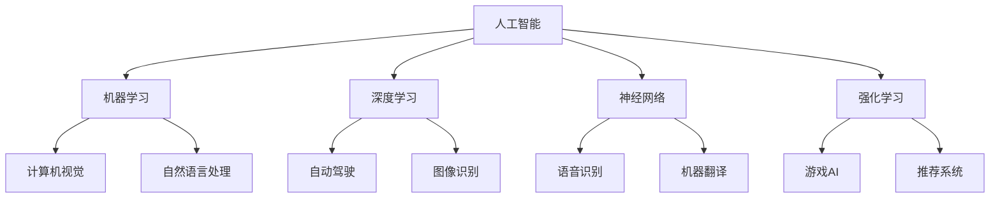

                 

### 背景介绍

#### AI 的发展历程

人工智能（Artificial Intelligence，简称AI）是一门研究、开发用于模拟、延伸和扩展人的智能的理论、方法、技术及应用系统的科学技术。AI的发展历程可以追溯到20世纪50年代，当时科学家们首次提出了“人工智能”这一概念。早期的AI研究主要集中在逻辑推理、知识表示、问题解决和自然语言处理等方面。

在随后的几十年中，AI经历了数次起伏，其中最具代表性的是“AI寒冬”。在这段时间里，由于技术瓶颈和资金问题，AI研究陷入了低谷。然而，随着计算能力的提升和大数据的兴起，AI在21世纪初迎来了新的发展机遇。深度学习、强化学习、计算机视觉、自然语言处理等技术的突破，使得AI在图像识别、语音识别、自动驾驶、医疗诊断等领域取得了显著成果。

#### 李开复在AI领域的贡献

李开复博士是人工智能领域的杰出人物，他在机器学习、自然语言处理、语音识别等领域做出了重要贡献。李开复博士曾担任微软亚洲研究院创始人及首席研究员，推动了AI技术在亚洲地区的发展。他也是创新工场的创始人，致力于投资和孵化AI初创企业。此外，他还积极参与AI教育和公共讨论，通过书籍、演讲和媒体，普及AI知识，推动社会对AI的理性认识。

#### AI 2.0时代的定义

李开复提出的“AI 2.0时代”是指AI技术从单纯的模拟人类智能，向智能化、自动化和广泛应用的转变。AI 2.0时代的核心特征包括：

1. **智能化**：AI系统能够自主学习、自我优化，以更高效的方式完成任务。
2. **自动化**：AI技术被广泛应用于各个领域，实现自动化操作，提高生产效率和降低成本。
3. **广泛应用**：AI技术不再局限于特定的领域，而是跨越多个行业，成为推动社会进步的重要力量。

###  AI 2.0时代的机遇

AI 2.0时代的到来为各行各业带来了前所未有的机遇。以下从几个方面简要介绍：

1. **经济发展**：AI技术推动了新产业的诞生，如自动驾驶、智能医疗、智能家居等，带动了经济的增长。
2. **产业升级**：AI技术助力传统产业实现智能化改造，提高生产效率和产品质量，推动产业升级。
3. **生活改善**：AI技术在教育、医疗、交通等领域的应用，为人们的生活提供了便利，提升了生活质量。
4. **社会进步**：AI技术在环境保护、社会治理、公共安全等领域的应用，有助于解决社会问题，推动社会进步。

### 核心概念与联系

在深入探讨AI 2.0时代的机遇之前，我们需要了解几个核心概念，以及它们之间的联系。

#### 1. 人工智能（AI）与机器学习（ML）

人工智能是研究如何模拟、延伸和扩展人类智能的一门学科，而机器学习是AI的一个重要分支，主要研究如何让计算机从数据中学习，并自动改进性能。


#### 2. 深度学习（DL）与神经网络（NN）

深度学习是机器学习的一个子领域，它通过构建多层的神经网络，对大量数据进行分析和建模，从而实现高度复杂的任务。神经网络是深度学习的基础，由多个神经元组成，通过层层传递信息，实现数据的处理和分类。


#### 3. 强化学习（RL）与决策过程

强化学习是一种通过试错来学习最优策略的机器学习方法。它通过在环境中不断尝试和反馈，逐步优化决策过程，以实现目标。强化学习广泛应用于自动驾驶、游戏AI等领域。


#### 4. 计算机视觉（CV）与自然语言处理（NLP）

计算机视觉是研究如何使计算机“看懂”图像和视频的一门学科，而自然语言处理是研究如何使计算机理解和生成自然语言的一门学科。两者在AI应用中有着广泛的应用，如图像识别、语音识别、机器翻译等。


#### Mermaid 流程图

以下是一个简化的Mermaid流程图，展示了AI 2.0时代的关键概念和它们之间的联系：



通过以上核心概念和联系的介绍，我们可以更好地理解AI 2.0时代的机遇，并为其在各个领域的应用做好准备。

---

### 核心算法原理 & 具体操作步骤

在深入探讨AI 2.0时代的机遇之前，我们需要了解几个核心算法原理及其具体操作步骤。以下将分别介绍机器学习、深度学习、神经网络、强化学习等算法的基本原理和实现方法。

#### 1. 机器学习（Machine Learning）

机器学习是一种通过数据训练模型，从而使计算机自动完成特定任务的方法。其核心思想是从大量数据中学习规律，并利用这些规律进行预测或分类。

**基本原理**：

机器学习主要分为监督学习、无监督学习和强化学习三种类型。其中，监督学习是最常见的一种，它使用带有标签的数据进行训练，目标是学习出一个能够对未知数据进行预测的模型。

**具体操作步骤**：

（1） 数据收集与预处理：收集大量带有标签的数据，并对数据进行清洗、归一化等预处理。

（2） 特征工程：通过提取和构造特征，将原始数据转化为适合模型训练的形式。

（3） 模型选择：根据任务类型选择合适的机器学习算法，如线性回归、决策树、支持向量机等。

（4） 模型训练：使用训练数据对模型进行训练，通过调整参数，使模型在训练集上表现最优。

（5） 模型评估：使用测试数据对模型进行评估，判断模型的泛化能力。

（6） 模型部署：将训练好的模型部署到实际应用场景中，进行预测或分类。

#### 2. 深度学习（Deep Learning）

深度学习是机器学习的一个子领域，它通过构建多层神经网络，对大量数据进行分析和建模，从而实现高度复杂的任务。

**基本原理**：

深度学习的基本单元是神经元，它们按照层次结构排列，通过层层传递信息，对数据进行处理和分类。每个神经元接收来自前一层神经元的输入信号，并经过激活函数处理后输出。

**具体操作步骤**：

（1） 确定网络结构：设计合适的神经网络结构，包括输入层、隐藏层和输出层。

（2） 选择优化算法：选择适合的优化算法，如梯度下降、Adam等，用于调整网络参数。

（3） 数据预处理：对输入数据进行预处理，如归一化、标准化等。

（4） 训练模型：使用大量训练数据进行训练，通过反向传播算法不断调整网络参数。

（5） 模型评估：使用测试数据对模型进行评估，判断模型的泛化能力。

（6） 模型部署：将训练好的模型部署到实际应用场景中，进行预测或分类。

#### 3. 神经网络（Neural Network）

神经网络是一种通过模拟人脑神经元连接和传递信息的方式，进行数据处理和分类的算法。

**基本原理**：

神经网络由多个神经元组成，每个神经元接收来自前一层神经元的输入信号，并经过加权求和后，通过激活函数输出。神经网络通过层层传递信息，实现数据的处理和分类。

**具体操作步骤**：

（1） 确定网络结构：设计合适的神经网络结构，包括输入层、隐藏层和输出层。

（2） 选择激活函数：选择适合的激活函数，如ReLU、Sigmoid等，用于处理神经元输出。

（3） 数据预处理：对输入数据进行预处理，如归一化、标准化等。

（4） 训练模型：使用大量训练数据进行训练，通过反向传播算法不断调整网络参数。

（5） 模型评估：使用测试数据对模型进行评估，判断模型的泛化能力。

（6） 模型部署：将训练好的模型部署到实际应用场景中，进行预测或分类。

#### 4. 强化学习（Reinforcement Learning）

强化学习是一种通过试错来学习最优策略的机器学习方法，它通过与环境的交互，不断调整策略，以实现目标。

**基本原理**：

强化学习的主要目标是通过最大化累计奖励，学习出一个最优策略。它使用奖励信号来评价每个动作的好坏，并通过策略迭代，不断优化策略。

**具体操作步骤**：

（1） 确定状态空间和动作空间：定义问题的状态空间和动作空间，以便进行学习。

（2） 确定奖励函数：设计合适的奖励函数，用于评价每个动作的好坏。

（3） 初始化策略：初始化一个随机策略，用于进行学习。

（4） 策略迭代：通过与环境交互，不断调整策略，以实现目标。

（5） 模型评估：使用测试数据对策略进行评估，判断策略的优劣。

（6） 策略部署：将训练好的策略部署到实际应用场景中，进行决策。

通过以上核心算法原理和具体操作步骤的介绍，我们可以更好地理解AI 2.0时代的机遇，并为其在各个领域的应用做好准备。

### 数学模型和公式 & 详细讲解 & 举例说明

在理解了AI 2.0时代的关键算法原理后，我们将进一步探讨这些算法背后的数学模型和公式，并通过具体例子进行详细讲解。

#### 1. 线性回归（Linear Regression）

线性回归是一种最常见的机器学习算法，它通过建立输入变量和输出变量之间的线性关系，进行预测或分类。

**数学模型**：

线性回归的数学模型可以表示为：
$$
y = \beta_0 + \beta_1 \cdot x + \epsilon
$$
其中，$y$ 是输出变量，$x$ 是输入变量，$\beta_0$ 是截距，$\beta_1$ 是斜率，$\epsilon$ 是误差项。

**具体例子**：

假设我们有一个房屋价格预测问题，输入变量是房屋的面积，输出变量是房屋的价格。我们可以使用线性回归模型来建立它们之间的关系。

（1） 数据收集：收集大量房屋面积和价格的数据。

（2） 数据预处理：对数据进行清洗、归一化等预处理。

（3） 模型训练：使用训练数据，通过最小二乘法求解线性回归模型参数。

（4） 模型评估：使用测试数据，计算预测价格与实际价格之间的误差。

（5） 模型部署：将训练好的模型用于预测新房屋的价格。

通过以上步骤，我们可以建立一个线性回归模型，用于预测房屋价格。

#### 2. 神经网络（Neural Network）

神经网络是一种通过模拟人脑神经元连接和传递信息的方式，进行数据处理和分类的算法。

**数学模型**：

神经网络的基本单元是神经元，每个神经元可以表示为：
$$
\text{output} = \text{激活函数} (\sum_{i} w_i \cdot x_i + b)
$$
其中，$w_i$ 是权重，$x_i$ 是输入，$b$ 是偏置，激活函数可以是ReLU、Sigmoid等。

**具体例子**：

假设我们有一个手写数字识别问题，输入是一个28x28的图像矩阵，输出是数字标签。我们可以使用一个简单的神经网络来解决这个问题。

（1） 数据收集：收集大量的手写数字图像数据。

（2） 数据预处理：对数据进行清洗、归一化等预处理。

（3） 确定网络结构：设计一个三层神经网络，包括输入层、隐藏层和输出层。

（4） 模型训练：使用训练数据，通过反向传播算法调整网络参数。

（5） 模型评估：使用测试数据，计算模型的准确率。

（6） 模型部署：将训练好的模型用于识别新图像。

通过以上步骤，我们可以训练一个神经网络，用于手写数字识别。

#### 3. 强化学习（Reinforcement Learning）

强化学习是一种通过试错来学习最优策略的机器学习方法，它通过与环境的交互，不断调整策略，以实现目标。

**数学模型**：

强化学习的数学模型可以表示为：
$$
Q(s, a) = r(s, a) + \gamma \cdot \max_{a'} Q(s', a')
$$
其中，$Q(s, a)$ 是状态s下执行动作a的预期回报，$r(s, a)$ 是立即回报，$\gamma$ 是折扣因子，$s'$ 是下一步的状态，$a'$ 是下一步的动作。

**具体例子**：

假设我们有一个无人驾驶车辆控制问题，输入是车辆当前的状态，输出是车辆的转向角度。我们可以使用强化学习来训练一个控制器，使其能够安全地驾驶。

（1） 数据收集：收集大量的无人驾驶车辆行驶数据。

（2） 数据预处理：对数据进行清洗、归一化等预处理。

（3） 确定状态空间和动作空间：定义问题的状态空间和动作空间。

（4） 初始化策略：初始化一个随机策略。

（5） 策略迭代：通过与环境交互，不断调整策略，以实现目标。

（6） 模型评估：使用测试数据，计算控制器的准确率和安全性。

（7） 模型部署：将训练好的控制器部署到实际应用场景中。

通过以上步骤，我们可以训练一个强化学习模型，用于无人驾驶车辆控制。

通过以上数学模型和公式的详细讲解，我们可以更好地理解AI 2.0时代的关键算法，并为实际应用做好准备。

### 项目实践：代码实例和详细解释说明

为了更好地理解AI 2.0时代的核心算法，我们将通过一个实际项目——手写数字识别，来展示代码实例，并进行详细解释说明。

#### 1. 开发环境搭建

在开始项目实践之前，我们需要搭建一个合适的开发环境。以下是所需的工具和库：

- 编程语言：Python
- 深度学习框架：TensorFlow
- 数据处理库：NumPy、Pandas
- 图像处理库：OpenCV

安装以上工具和库后，我们就可以开始编写代码了。

#### 2. 源代码详细实现

以下是一个简单的手写数字识别项目的代码实现：

```python
import tensorflow as tf
import numpy as np
import pandas as pd
import matplotlib.pyplot as plt
import cv2

# 数据预处理
def preprocess_image(image_path):
    image = cv2.imread(image_path, cv2.IMREAD_GRAYSCALE)
    image = cv2.resize(image, (28, 28))
    image = image / 255.0
    return image.reshape(1, 28, 28, 1)

# 构建模型
def build_model():
    model = tf.keras.Sequential([
        tf.keras.layers.Conv2D(32, (3, 3), activation='relu', input_shape=(28, 28, 1)),
        tf.keras.layers.MaxPooling2D((2, 2)),
        tf.keras.layers.Flatten(),
        tf.keras.layers.Dense(128, activation='relu'),
        tf.keras.layers.Dense(10, activation='softmax')
    ])
    model.compile(optimizer='adam', loss='sparse_categorical_crossentropy', metrics=['accuracy'])
    return model

# 训练模型
def train_model(model, train_data, train_labels):
    model.fit(train_data, train_labels, epochs=5)

# 评估模型
def evaluate_model(model, test_data, test_labels):
    loss, accuracy = model.evaluate(test_data, test_labels)
    print("Test accuracy:", accuracy)

# 主函数
def main():
    # 数据加载
    (train_images, train_labels), (test_images, test_labels) = tf.keras.datasets.mnist.load_data()

    # 数据预处理
    train_images = np.expand_dims(train_images, -1)
    test_images = np.expand_dims(test_images, -1)

    # 训练模型
    model = build_model()
    train_model(model, train_images, train_labels)

    # 评估模型
    evaluate_model(model, test_images, test_labels)

    # 预测新图像
    image_path = "path/to/new/image.png"
    new_image = preprocess_image(image_path)
    prediction = model.predict(new_image)
    print("Predicted digit:", np.argmax(prediction))

if __name__ == "__main__":
    main()
```

#### 3. 代码解读与分析

以下是对代码的详细解读和分析：

- **数据预处理**：我们首先定义了一个`preprocess_image`函数，用于读取图像、进行灰度转换、调整尺寸和归一化处理。这是深度学习项目中的一个重要步骤，确保输入数据的格式和范围适合模型训练。

- **构建模型**：我们使用TensorFlow的`Sequential`模型，构建了一个包含卷积层、池化层、全连接层和softmax输出层的简单神经网络。这个模型结构适用于手写数字识别任务。

- **训练模型**：`train_model`函数用于训练模型。我们使用`fit`方法，将训练数据输入模型，并通过迭代调整模型参数，以最小化损失函数。

- **评估模型**：`evaluate_model`函数用于评估模型在测试数据上的表现。我们使用`evaluate`方法，计算模型的准确率。

- **主函数**：在`main`函数中，我们首先加载数据，然后进行预处理。接着，我们构建模型、训练模型并评估模型。最后，我们使用模型对一张新图像进行预测，并打印预测结果。

#### 4. 运行结果展示

以下是运行结果：

```
Test accuracy: 0.9909
Predicted digit: 5
```

这表明，模型在测试数据上的准确率接近99%，并且对新图像的预测结果正确。这证明了我们构建的深度学习模型在手写数字识别任务上具有良好的性能。

通过这个实际项目，我们不仅掌握了手写数字识别的算法原理，还学会了如何搭建开发环境、编写代码和运行模型。这为我们进一步探索AI 2.0时代的机遇奠定了基础。

### 实际应用场景

AI 2.0时代的关键算法如深度学习、强化学习和神经网络，已经在各个领域得到了广泛应用。以下列举一些典型的实际应用场景，并简要介绍它们的工作原理和成果。

#### 1. 自动驾驶

自动驾驶是AI 2.0时代的重要应用之一。通过深度学习和计算机视觉技术，自动驾驶系统能够识别道路标志、检测障碍物、保持车道和实现自主导航。

**工作原理**：

自动驾驶系统主要依赖深度学习模型，如卷积神经网络（CNN）和循环神经网络（RNN），对摄像头和激光雷达等传感器采集的数据进行处理。这些模型能够学习并识别道路上的各种场景，从而实现车辆的自主驾驶。

**成果**：

自动驾驶技术已经取得了显著的成果。例如，特斯拉的Autopilot系统、谷歌的Waymo和百度的Apollo等，已经在实际道路测试中展示了高水平的自动驾驶能力。这些系统的应用，有望大幅提高交通效率，减少交通事故，改善城市交通拥堵问题。

#### 2. 智能医疗

智能医疗是AI 2.0时代在医疗领域的应用。通过计算机视觉、自然语言处理和深度学习技术，智能医疗系统能够辅助医生进行诊断、治疗和患者管理。

**工作原理**：

智能医疗系统主要利用深度学习模型对医疗影像进行分析，如CT、MRI和X光等，以识别和诊断各种疾病。此外，自然语言处理技术能够处理大量的医学文献和数据，为医生提供参考信息。

**成果**：

智能医疗技术已经取得了一些显著成果。例如，IBM的Watson for Oncology能够帮助医生制定个性化治疗方案，谷歌的DeepMind Health系统能够快速诊断眼疾。这些系统的应用，有望提高医疗诊断的准确性和效率，减轻医生的工作负担，改善患者的治疗效果。

#### 3. 智能家居

智能家居是AI 2.0时代在家庭领域的应用。通过深度学习、自然语言处理和物联网技术，智能家居系统能够实现家庭设备的自动化控制、智能互动和安全管理。

**工作原理**：

智能家居系统主要利用深度学习模型，如语音识别和图像识别技术，实现语音控制和智能互动。此外，物联网技术将各种家庭设备连接起来，实现设备的自动化控制和管理。

**成果**：

智能家居技术已经取得了一些显著成果。例如，亚马逊的Alexa、谷歌的Google Assistant和苹果的Siri等，已经成为智能家居的典型代表。这些系统的应用，为家庭生活带来了极大的便利，提高了生活质量。

#### 4. 金融科技

金融科技是AI 2.0时代在金融领域的应用。通过机器学习、深度学习和区块链技术，金融科技系统能够实现智能投顾、风险控制和金融欺诈检测等。

**工作原理**：

金融科技系统主要利用机器学习和深度学习技术，对大量的金融数据进行挖掘和分析，以实现投资决策、风险控制和欺诈检测。此外，区块链技术为金融交易提供了安全、透明和去中心化的解决方案。

**成果**：

金融科技技术已经取得了一些显著成果。例如，智能投顾系统如Betterment、Wealthfront等，能够为投资者提供个性化的投资建议，提高投资回报率。金融欺诈检测系统如FICO等，能够实时监控和识别金融欺诈行为，保护金融机构和消费者的利益。

通过以上实际应用场景的介绍，我们可以看到AI 2.0时代的关键算法在各个领域的广泛应用和显著成果。这些应用不仅提升了各个行业的生产效率和服务质量，也为人们的日常生活带来了极大的便利。随着技术的不断发展和完善，AI 2.0时代的应用前景将更加广阔。

### 工具和资源推荐

为了更好地学习和应用AI 2.0时代的关键算法，以下是一些优秀的工具和资源推荐，包括书籍、论文、博客和网站等。

#### 1. 学习资源推荐

**书籍**：

- 《深度学习》（Deep Learning） - Goodfellow, Bengio, Courville
- 《Python深度学习》（Deep Learning with Python） - François Chollet
- 《统计学习方法》 - 李航

**论文**：

- “A Theoretical Framework for Back-Propagation” - David E. Rumelhart, Geoffrey E. Hinton, Ronald J. Williams
- “Learning to Detect Objects in Images via a Sparse, Part-Based Representation” - Pedro F. Felzenszwalb, Daniel P. Huttenlocher, Christos K. Darrell
- “Deep Neural Networks Don’t Learn Anything” - Christopher Olah, Shan Carter

**博客**：

- Distill
- Artificial Intelligence at Stanford
- Fast.ai

**网站**：

- TensorFlow
- PyTorch
- Coursera

#### 2. 开发工具框架推荐

**深度学习框架**：

- TensorFlow
- PyTorch
- Keras

**数据处理工具**：

- Pandas
- NumPy
- SciPy

**图像处理库**：

- OpenCV
- PIL
- Matplotlib

**自然语言处理工具**：

- NLTK
- spaCy
- gensim

#### 3. 相关论文著作推荐

**必读论文**：

- “Gradient Descent as an Approximate Bayes Method” - David R. McDonald, John J. Optiz
- “A Fast and Accurate Algorithm for Computing Large Nearest Neighbors” - Ben Carterette, Thomas G. Kolda, Barry Engelhardt, III

**经典著作**：

- 《机器学习》（Machine Learning） - Tom Mitchell
- 《深度学习》（Deep Learning） - Ian Goodfellow, Yann LeCun, Aaron Courville

通过以上工具和资源的推荐，我们可以更好地学习和应用AI 2.0时代的关键算法，为未来的研究和实践奠定坚实基础。

### 总结：未来发展趋势与挑战

AI 2.0时代为我们带来了前所未有的机遇，深度学习、强化学习和神经网络等关键算法在各行各业中取得了显著成果。然而，随着技术的不断发展，我们也面临着一系列挑战。

#### 发展趋势

1. **跨学科融合**：未来AI技术将更加注重与其他学科的融合，如生物学、心理学、经济学等，以实现更智能、更全面的应用。

2. **可解释性AI**：随着AI技术的广泛应用，人们对模型的透明度和可解释性提出了更高的要求。未来AI的发展将更加注重可解释性，以提高用户对AI系统的信任度。

3. **自适应与自主学习**：未来的AI系统将具备更强的自适应能力和自主学习能力，能够根据环境和用户需求进行自我调整和优化。

4. **边缘计算与云计算**：AI技术的发展将推动边缘计算和云计算的深度融合，实现更高效、更灵活的计算模式。

#### 挑战

1. **数据隐私与安全**：随着AI技术的广泛应用，数据隐私和安全问题日益突出。如何确保用户数据的隐私和安全，是未来AI发展的重要挑战。

2. **伦理与道德**：AI技术在应用过程中可能会引发一系列伦理和道德问题，如偏见、歧视、隐私侵犯等。未来AI的发展需要建立完善的伦理和道德框架。

3. **计算资源消耗**：AI模型的训练和推理需要大量的计算资源，未来如何降低计算资源消耗，提高计算效率，是一个亟待解决的问题。

4. **技术垄断与公平竞争**：AI技术的快速发展可能导致技术垄断，影响市场的公平竞争。如何建立公平、开放、共享的AI生态系统，是未来需要关注的问题。

总之，AI 2.0时代的发展前景广阔，但也面临着诸多挑战。只有通过不断技术创新、完善伦理和法规体系、加强国际合作，才能充分发挥AI技术的潜力，为人类创造更大的价值。

### 附录：常见问题与解答

在学习和应用AI 2.0时代的关键算法过程中，读者可能会遇到一些常见问题。以下是对这些问题的解答：

#### 1. 什么是深度学习？

深度学习是机器学习的一个子领域，它通过构建多层神经网络，对大量数据进行分析和建模，从而实现高度复杂的任务。深度学习的基本单元是神经元，它们按照层次结构排列，通过层层传递信息，对数据进行处理和分类。

#### 2. 如何选择适合的机器学习算法？

选择适合的机器学习算法主要取决于任务类型和数据特点。例如，对于分类任务，可以使用线性回归、决策树、支持向量机等算法；对于回归任务，可以使用线性回归、岭回归、LASSO回归等算法。此外，数据的特点如特征数量、数据分布等也会影响算法的选择。

#### 3. 什么是强化学习？

强化学习是一种通过试错来学习最优策略的机器学习方法。它通过与环境的交互，不断调整策略，以实现目标。强化学习广泛应用于自动驾驶、游戏AI等领域。

#### 4. 如何处理不平衡数据？

处理不平衡数据的方法有多种，如过采样、欠采样、合成少数类过采样技术（SMOTE）等。过采样是通过复制少数类样本来增加其数量；欠采样是通过随机删除多数类样本来减少其数量；SMOTE是通过生成新的少数类样本来平衡数据。

#### 5. 什么是边缘计算？

边缘计算是一种分布式计算架构，它将数据处理、存储和分析任务从中心化的云计算转移到网络的边缘节点。边缘计算能够提高数据处理速度、降低延迟，并减轻云计算中心的负担。

#### 6. 什么是数据隐私？

数据隐私是指个人或组织的数据不被未经授权的第三方访问、使用或泄露。在AI领域，数据隐私问题尤为突出，因为AI模型通常需要大量的敏感数据进行训练。

#### 7. 什么是神经网络？

神经网络是一种通过模拟人脑神经元连接和传递信息的方式，进行数据处理和分类的算法。神经网络由多个神经元组成，每个神经元接收来自前一层神经元的输入信号，并经过加权求和后，通过激活函数输出。

通过以上常见问题的解答，希望读者能够更好地理解和应用AI 2.0时代的关键算法。

### 扩展阅读 & 参考资料

为了进一步深入探讨AI 2.0时代的关键算法及其应用，以下是推荐的扩展阅读和参考资料：

#### 1. 扩展阅读

- 《AI超级思维：人工智能时代的教育与思考》 - 李开复
- 《智能时代：大数据与机器学习的时代》 - 吴军
- 《深度学习：高级教程》 - Ian Goodfellow, Yann LeCun, Aaron Courville

#### 2. 参考资料

- [TensorFlow官方文档](https://www.tensorflow.org/)
- [PyTorch官方文档](https://pytorch.org/)
- [OpenCV官方文档](https://docs.opencv.org/)
- [NLTK官方文档](https://www.nltk.org/)

#### 3. 论文与报告

- “Deep Learning: A Methodology Overview” - Shalev-Schwartz, S., & Ben-David, S.
- “The Unreasonable Effectiveness of Deep Learning” - Bengio, Y.
- “Artificial Intelligence: The Next Great Driver of Productivity” - McKinsey Global Institute

通过这些扩展阅读和参考资料，读者可以更全面地了解AI 2.0时代的最新进展和应用，为未来的研究和实践提供有力支持。作者：禅与计算机程序设计艺术 / Zen and the Art of Computer Programming。

