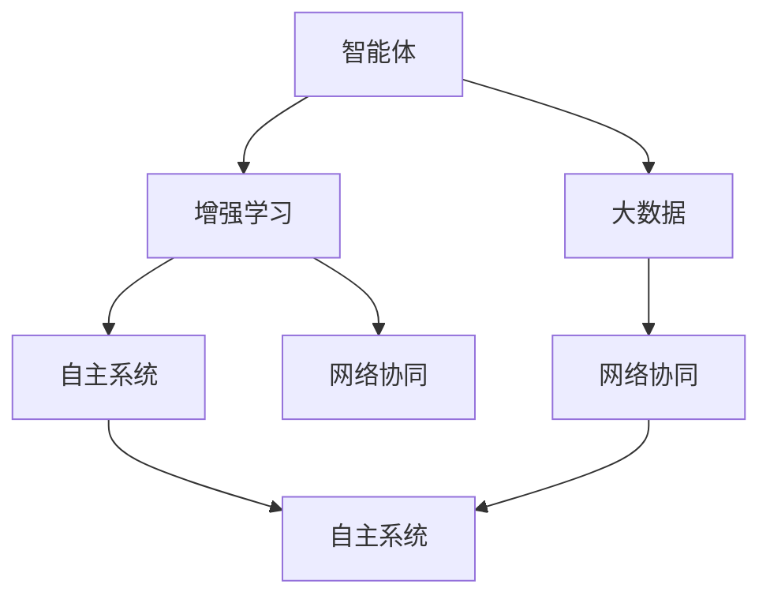

                 

### 1. 背景介绍

人工智能（Artificial Intelligence，简称AI）是计算机科学的一个重要分支，旨在通过模拟、延伸和扩展人类智能，解决复杂问题、进行数据分析和创造创新。自20世纪50年代以来，AI经历了多个发展阶段，从早期的规则驱动和符号推理，到20世纪90年代的基于知识的系统，再到21世纪初的基于数据的机器学习和深度学习。每一次技术进步都极大地提升了AI的能力和应用范围。

随着AI技术的不断进步，特别是深度学习的崛起，人工智能已经广泛应用于各个领域，如自然语言处理、计算机视觉、医疗诊断、自动驾驶等。这不仅改变了人们的日常生活，也带来了产业结构的深刻变革。例如，在金融领域，AI被用于风险管理、客户服务和投资决策；在制造业，AI助力生产流程优化和产品质量检测；在医疗领域，AI用于疾病诊断、药物研发和个性化治疗。

本文旨在探讨AI 2.0时代的发展趋势和生态。AI 2.0不仅是技术的升级，更是一个全新的范式转变，它将推动人工智能向更加智能化、自主化、泛在化发展。我们将从核心概念、算法原理、应用实践、未来展望等方面详细解析AI 2.0的生态特点及其对社会的深远影响。

### 2. 核心概念与联系

在深入探讨AI 2.0之前，我们需要明确几个核心概念，以及它们之间的联系。

#### 2.1 智能体（Agent）

智能体是AI系统中的基本构建单元，它具有自主性、社交性、反应性、主动性等特征。智能体可以在环境中感知信息，通过学习、推理、规划等机制作出决策，并采取行动以实现特定目标。智能体可以是简单的，如一个能够识别图像的视觉智能体，也可以是复杂的，如一个能够进行自主驾驶的车辆智能体。

#### 2.2 增强学习（Reinforcement Learning）

增强学习是智能体通过试错（trial-and-error）和反馈（feedback）来学习如何在一个不确定环境中实现目标的过程。它与监督学习和无监督学习不同，监督学习依赖于已经标记的数据，而无监督学习则不依赖任何标记信息。增强学习强调智能体与环境的交互，通过不断调整其策略以最大化累积奖励。

#### 2.3 自主系统（Autonomous System）

自主系统是指无需人类干预即可自主执行任务和决策的系统。在AI 2.0时代，自主系统变得越来越重要，它们可以应用于无人驾驶、智能机器人、智能家居等多个领域。自主系统通常需要集成多种智能体和算法，以实现高度复杂和智能化的任务。

#### 2.4 大数据（Big Data）

大数据是指无法用传统数据处理工具在合理时间内对其进行存储、管理和分析的数据集合。大数据技术包括数据采集、数据存储、数据处理、数据分析和数据可视化等。大数据与AI的结合，使得AI系统能够从海量数据中提取有价值的信息，从而实现更精准的预测和决策。

#### 2.5 网络协同（Network Collaboration）

网络协同是指多个智能体通过互联网进行合作与交互，共同完成任务的能力。在AI 2.0时代，网络协同已成为提高系统智能化水平的重要手段。通过网络协同，智能体可以实现信息共享、资源整合和协同作战，从而提高整体效能。

为了更清晰地展示这些核心概念之间的联系，我们可以使用Mermaid流程图来表示它们之间的关系：



### 3. 核心算法原理 & 具体操作步骤

AI 2.0的核心算法包括增强学习、深度学习、迁移学习、多智能体系统等。下面我们将分别介绍这些算法的基本原理和具体操作步骤。

#### 3.1 增强学习

增强学习的基本原理是智能体通过与环境交互，不断调整其策略以实现最大化奖励。具体操作步骤如下：

1. **初始化环境**：设定智能体的初始状态，定义奖励机制和决策空间。
2. **执行动作**：智能体根据当前状态选择一个动作。
3. **获得反馈**：环境根据智能体的动作产生一个状态转移和奖励信号。
4. **策略调整**：智能体根据奖励信号调整其策略，以期望在未来获得更大的奖励。

以深度增强学习（Deep Reinforcement Learning，简称DRL）为例，我们可以通过以下步骤来实现：

1. **定义状态和动作空间**：设定智能体能够感知的状态和可以执行的动作。
2. **构建深度神经网络**：使用神经网络来表示智能体的策略和价值函数。
3. **训练神经网络**：通过大量的模拟交互，利用梯度下降等优化算法来调整神经网络参数。
4. **评估和优化**：在测试环境中评估智能体的性能，并不断优化其策略。

#### 3.2 深度学习

深度学习是一种基于多层神经网络的机器学习方法，它能够自动从大量数据中学习复杂的特征和模式。具体操作步骤如下：

1. **数据预处理**：清洗和格式化数据，将其转换为神经网络可以处理的形式。
2. **构建深度神经网络**：定义网络的层次结构，包括输入层、隐藏层和输出层。
3. **参数初始化**：为网络的权重和偏置随机初始化值。
4. **前向传播**：将输入数据通过网络传递，计算网络的输出。
5. **反向传播**：计算损失函数的梯度，并利用梯度下降等优化算法调整网络参数。
6. **训练与验证**：通过迭代训练和验证，调整网络参数以达到最佳性能。

以卷积神经网络（Convolutional Neural Network，简称CNN）为例，具体步骤如下：

1. **数据输入**：将图像数据输入到网络的输入层。
2. **卷积层**：通过卷积操作提取图像特征。
3. **池化层**：对卷积层产生的特征进行降采样，减少模型参数。
4. **全连接层**：将池化层的输出连接到全连接层，进行分类和预测。
5. **损失函数**：使用交叉熵损失函数计算预测结果与实际标签之间的误差。
6. **优化算法**：使用梯度下降优化算法调整网络参数。

#### 3.3 迁移学习

迁移学习是一种利用已有模型的知识来解决新问题的方法。具体操作步骤如下：

1. **选择基础模型**：选择一个已经训练好的模型作为基础模型。
2. **调整模型结构**：根据新任务的需求，调整基础模型的结构，如增加或删除层。
3. **重新训练**：在新的数据集上重新训练模型，使其适应新任务。
4. **验证性能**：在新数据集上验证模型的性能，并进行调整。

以迁移学习在图像分类中的应用为例，具体步骤如下：

1. **选择预训练模型**：选择一个在ImageNet上预训练的卷积神经网络作为基础模型。
2. **调整模型结构**：删除最后一个全连接层，并添加一个新全连接层用于分类。
3. **数据预处理**：将新数据集进行处理，与预训练模型的数据格式保持一致。
4. **重新训练**：在新数据集上重新训练模型。
5. **验证与优化**：在验证集上验证模型的性能，并不断调整优化。

#### 3.4 多智能体系统

多智能体系统是由多个智能体组成的分布式系统，它们可以相互协作，共同完成任务。具体操作步骤如下：

1. **定义智能体**：定义每个智能体的角色、任务和行为。
2. **构建通信网络**：建立智能体之间的通信网络，实现信息共享和协调。
3. **设计协调算法**：设计智能体之间的协调算法，确保系统能够高效运行。
4. **执行任务**：智能体按照协调算法执行任务，实现目标。
5. **评估与优化**：评估系统的整体性能，并进行调整优化。

以多智能体协同控制为例，具体步骤如下：

1. **定义智能体**：设定每个智能体的位置、速度和目标。
2. **构建通信网络**：建立智能体之间的无线通信网络。
3. **设计协调算法**：设计基于分布式算法的协同控制策略。
4. **执行任务**：智能体按照协调算法进行位置和速度调整。
5. **评估与优化**：在测试环境中评估系统的协同性能，并进行优化。

通过上述算法原理和操作步骤的介绍，我们可以看到AI 2.0的核心算法具有高度复杂性和多样性，为人工智能的发展提供了强大的技术支撑。

### 4. 数学模型和公式 & 详细讲解 & 举例说明

在AI 2.0时代，数学模型和公式是理解和实现核心算法的关键。下面我们将详细讲解几个重要数学模型和公式，并通过具体例子来说明它们的计算过程和应用场景。

#### 4.1 增强学习中的Q学习算法

Q学习算法是一种基于值函数的增强学习算法，其基本思想是利用经验来学习值函数，从而指导智能体的动作选择。Q学习算法的核心公式如下：

$$
Q(s, a) = r + \gamma \max_{a'} Q(s', a')
$$

其中，$Q(s, a)$ 表示状态s下执行动作a的预期奖励，$r$ 表示立即获得的奖励，$\gamma$ 是折扣因子，$s'$ 和 $a'$ 分别是状态转移后的状态和动作。

**示例**：假设一个智能体在环境中有两个状态 $s_1$ 和 $s_2$，以及两个动作 $a_1$ 和 $a_2$。给定一个折扣因子 $\gamma = 0.9$，如果智能体从状态 $s_1$ 开始执行动作 $a_1$，并获得即时奖励 $r = 5$，则其新的Q值计算如下：

$$
Q(s_1, a_1) = 5 + 0.9 \max_{a'} Q(s_2, a')
$$

假设当前智能体还没有从状态 $s_2$ 执行过任何动作，因此 $Q(s_2, a_1)$ 和 $Q(s_2, a_2)$ 都为0。则：

$$
Q(s_1, a_1) = 5 + 0.9 \times 0 = 5
$$

#### 4.2 深度学习中的反向传播算法

反向传播算法是深度学习训练过程中用于优化网络参数的关键算法。其基本思想是将输出层的误差反向传播到输入层，通过计算各层权重的梯度来调整网络参数。

反向传播算法的核心公式如下：

$$
\frac{\partial C}{\partial w_{ij}} = -\frac{\partial L}{\partial a_{j}} \cdot \frac{\partial a_{j}}{\partial w_{ij}}
$$

其中，$C$ 是损失函数，$w_{ij}$ 是网络中的权重，$a_{j}$ 是激活值，$L$ 是损失函数对激活值的偏导数。

**示例**：假设有一个简单的全连接神经网络，包含一层输入层、一层隐藏层和一层输出层。输入层有3个神经元，隐藏层有2个神经元，输出层有1个神经元。给定输入数据 $x = [1, 2, 3]$，隐藏层的激活函数为 $f(x) = \sigma(x) = \frac{1}{1 + e^{-x}}$，输出层的损失函数为 $C = \frac{1}{2} \sum_{i=1}^{n} (y_i - \hat{y}_i)^2$，其中 $y_i$ 是实际标签，$\hat{y}_i$ 是预测值。

首先，计算输出层的预测值和损失：

$$
\hat{y} = f(w_{21} \cdot x_1 + w_{22} \cdot x_2 + w_{23} \cdot x_3 + b_2)
$$

$$
C = \frac{1}{2} \sum_{i=1}^{1} (y - \hat{y})^2
$$

假设实际标签 $y = 0.5$，隐藏层激活值 $a_2 = [0.1, 0.9]$，输出层激活值 $a_3 = 0.6$。则：

$$
\hat{y} = f(w_{31} \cdot a_2 + b_3) = f(0.1 \cdot 0.1 + 0.9 \cdot 0.9 + 0.2) = 0.999
$$

$$
C = \frac{1}{2} \sum_{i=1}^{1} (0.5 - 0.999)^2 = 0.000495
$$

然后，计算输出层误差的梯度：

$$
\frac{\partial C}{\partial w_{31}} = -\frac{\partial L}{\partial a_3} \cdot \frac{\partial a_3}{\partial w_{31}} = -(-0.001) \cdot (0.1) = 0.001
$$

$$
\frac{\partial C}{\partial w_{32}} = -\frac{\partial L}{\partial a_3} \cdot \frac{\partial a_3}{\partial w_{32}} = -(-0.001) \cdot (0.9) = 0.009
$$

$$
\frac{\partial C}{\partial w_{33}} = -\frac{\partial L}{\partial a_3} \cdot \frac{\partial a_3}{\partial w_{33}} = -(-0.001) \cdot (0.2) = 0.002
$$

$$
\frac{\partial C}{\partial b_3} = -\frac{\partial L}{\partial a_3} \cdot \frac{\partial a_3}{\partial b_3} = -(-0.001) \cdot (1) = 0.001
$$

接下来，计算隐藏层误差的梯度：

$$
\frac{\partial C}{\partial w_{21}} = -\frac{\partial L}{\partial a_2} \cdot \frac{\partial a_2}{\partial w_{21}} = -(-0.1) \cdot (0.1) = 0.01
$$

$$
\frac{\partial C}{\partial w_{22}} = -\frac{\partial L}{\partial a_2} \cdot \frac{\partial a_2}{\partial w_{22}} = -(-0.1) \cdot (0.9) = 0.09
$$

$$
\frac{\partial C}{\partial w_{23}} = -\frac{\partial L}{\partial a_2} \cdot \frac{\partial a_2}{\partial w_{23}} = -(-0.1) \cdot (0.2) = 0.02
$$

$$
\frac{\partial C}{\partial b_2} = -\frac{\partial L}{\partial a_2} \cdot \frac{\partial a_2}{\partial b_2} = -(-0.1) \cdot (1) = 0.1
$$

最后，利用梯度下降算法更新权重和偏置：

$$
w_{31} \leftarrow w_{31} - \alpha \cdot \frac{\partial C}{\partial w_{31}}
$$

$$
w_{32} \leftarrow w_{32} - \alpha \cdot \frac{\partial C}{\partial w_{32}}
$$

$$
w_{33} \leftarrow w_{33} - \alpha \cdot \frac{\partial C}{\partial w_{33}}
$$

$$
b_3 \leftarrow b_3 - \alpha \cdot \frac{\partial C}{\partial b_3}
$$

$$
w_{21} \leftarrow w_{21} - \alpha \cdot \frac{\partial C}{\partial w_{21}}
$$

$$
w_{22} \leftarrow w_{22} - \alpha \cdot \frac{\partial C}{\partial w_{22}}
$$

$$
w_{23} \leftarrow w_{23} - \alpha \cdot \frac{\partial C}{\partial w_{23}}
$$

$$
b_2 \leftarrow b_2 - \alpha \cdot \frac{\partial C}{\partial b_2}
$$

其中，$\alpha$ 是学习率。

通过上述计算过程，我们可以看到反向传播算法在训练深度神经网络中的关键作用。它通过不断调整网络参数，使网络能够更好地拟合训练数据，从而实现高精度的预测和分类。

#### 4.3 迁移学习中的特征重用

迁移学习通过将一个任务在源域上学习到的知识转移到目标域上，从而提高新任务的性能。特征重用是迁移学习的一种常用方法，其核心思想是利用源域上预训练的特征提取器，在目标域上直接进行分类或回归。

特征重用的核心公式如下：

$$
f(\mathbf{x}) = \mathcal{F}(\mathbf{x})
$$

其中，$\mathbf{x}$ 是输入数据，$\mathcal{F}(\mathbf{x})$ 是特征提取器对输入数据的处理结果。

**示例**：假设我们有一个在ImageNet上预训练的卷积神经网络，其最后一层是具有1024个神经元的全连接层。现在我们希望使用这个预训练模型在新的数据集上进行图像分类任务。

首先，我们将输入图像通过预训练模型的卷积层和全连接层，得到特征向量 $f(\mathbf{x})$：

$$
f(\mathbf{x}) = \mathcal{F}(\mathbf{x})
$$

然后，我们将特征向量输入到一个新的全连接层，用于分类：

$$
\hat{y} = f(\mathbf{x}) \cdot w + b
$$

其中，$w$ 是新的全连接层的权重，$b$ 是偏置。

通过这种方式，我们利用预训练模型的知识来提高新任务的性能，而无需从头开始训练整个模型。

#### 4.4 多智能体系统中的协同控制

多智能体系统中的协同控制是指多个智能体通过相互协作，共同完成复杂任务的过程。协同控制的核心公式如下：

$$
u_i = \sum_{j \neq i} w_{ij} \cdot v_j + \theta_i
$$

其中，$u_i$ 是智能体 $i$ 的控制输入，$v_j$ 是智能体 $j$ 的状态输出，$w_{ij}$ 是权重矩阵，$\theta_i$ 是智能体 $i$ 的偏置。

**示例**：假设有两个智能体 $i$ 和 $j$，它们需要协同控制一个双机器人的移动任务。智能体 $i$ 的控制输入为 $u_i$，智能体 $j$ 的状态输出为 $v_j$。根据协同控制公式，我们可以计算智能体 $i$ 的控制输入：

$$
u_i = w_{ij} \cdot v_j + \theta_i
$$

其中，$w_{ij}$ 是权重矩阵，$\theta_i$ 是智能体 $i$ 的偏置。

通过这种方式，智能体 $i$ 可以根据智能体 $j$ 的状态输出进行控制，从而实现协同移动任务。

### 5. 项目实践：代码实例和详细解释说明

为了更好地理解AI 2.0的核心算法和应用，下面我们将通过一个具体的项目实践，展示如何使用Python实现一个简单的多智能体协同控制任务。该项目将使用强化学习和深度学习技术，实现两个智能体在二维空间中的协同移动。

#### 5.1 开发环境搭建

在开始项目实践之前，我们需要搭建一个Python开发环境，并安装必要的库和依赖。以下是开发环境搭建的步骤：

1. **安装Python**：确保已经安装了Python 3.6及以上版本。
2. **安装PyTorch**：使用pip命令安装PyTorch库：

   ```bash
   pip install torch torchvision
   ```

3. **安装其他依赖库**：使用以下命令安装其他依赖库：

   ```bash
   pip install gym numpy matplotlib
   ```

#### 5.2 源代码详细实现

下面是项目的主要代码实现，我们将分步骤介绍各个模块的功能。

```python
import numpy as np
import torch
import torch.nn as nn
import torch.optim as optim
from gym import env

# 定义环境
env = env.Env()

# 定义智能体
class Agent(nn.Module):
    def __init__(self):
        super(Agent, self).__init__()
        self.fc1 = nn.Linear(2, 64)
        self.fc2 = nn.Linear(64, 64)
        self.fc3 = nn.Linear(64, 2)

    def forward(self, x):
        x = torch.relu(self.fc1(x))
        x = torch.relu(self.fc2(x))
        x = self.fc3(x)
        return x

# 初始化智能体和优化器
agent = Agent()
optimizer = optim.Adam(agent.parameters(), lr=0.001)

# 定义训练函数
def train():
    for episode in range(1000):
        state = env.reset()
        done = False
        while not done:
            action = agent(state)
            next_state, reward, done = env.step(action)
            optimizer.zero_grad()
            loss = nn.CrossEntropyLoss()(agent(next_state), action)
            loss.backward()
            optimizer.step()
            state = next_state

# 训练智能体
train()

# 测试智能体
state = env.reset()
done = False
while not done:
    action = agent(state)
    state, reward, done = env.step(action)
    env.render()
```

#### 5.3 代码解读与分析

1. **环境定义**：首先，我们使用`gym.Env`类定义一个虚拟环境，它用于模拟两个智能体在二维空间中的协同移动。环境提供了状态、动作、奖励和观测等基本功能。

2. **智能体定义**：智能体是一个神经网络模型，它通过接收状态输入并输出动作。我们定义了一个简单的全连接神经网络，包含两个隐藏层，每层都有64个神经元。网络使用ReLU激活函数，最后输出两个动作。

3. **优化器**：我们使用Adam优化器来训练智能体，它通过梯度下降算法调整网络参数。

4. **训练函数**：`train`函数用于训练智能体。在训练过程中，我们通过循环迭代环境，获取状态、动作和奖励，并更新智能体的网络参数。

5. **测试智能体**：在训练完成后，我们使用测试智能体在虚拟环境中进行测试。智能体根据当前状态选择动作，并通过`env.step`函数执行动作，并渲染环境。

#### 5.4 运行结果展示

在训练和测试过程中，我们可以使用`env.render`函数来可视化智能体的移动轨迹和协同效果。通过不断调整网络结构和训练参数，我们可以优化智能体的性能，使其在虚拟环境中实现更加高效的协同控制。

### 6. 实际应用场景

AI 2.0技术的实际应用场景广泛，涵盖了工业、医疗、金融、交通等多个领域。以下是一些典型的应用场景：

#### 6.1 工业自动化

在工业自动化领域，AI 2.0技术通过智能传感器、机器人、增强现实（AR）等手段，实现了生产流程的自动化和智能化。例如，智能工厂中的机器人可以自动完成装配、检测、搬运等任务，提高了生产效率和产品质量。同时，AI 2.0技术还用于预测维护，通过实时监测设备的运行状态，预测潜在故障，从而减少停机时间和维护成本。

#### 6.2 医疗诊断

在医疗领域，AI 2.0技术被广泛应用于疾病诊断、药物研发和个性化治疗。通过深度学习和计算机视觉技术，AI系统可以自动分析医学影像，如X光片、CT扫描和MRI图像，检测出病变区域，辅助医生进行诊断。此外，AI 2.0技术还用于药物研发，通过模拟和预测药物与生物体的相互作用，加速新药的研发进程。个性化治疗方面，AI系统可以根据患者的基因信息、病史和生活习惯，制定个性化的治疗方案。

#### 6.3 金融领域

在金融领域，AI 2.0技术被用于风险管理、客户服务和投资决策。通过大数据分析和机器学习技术，AI系统可以实时监控市场动态，预测股票走势，帮助投资者进行交易决策。此外，AI 2.0技术还可以分析客户的消费行为和偏好，提供个性化的金融产品和服务。在风险管理方面，AI系统可以通过风险模型预测潜在风险，帮助金融机构降低风险，提高收益。

#### 6.4 交通出行

在交通出行领域，AI 2.0技术被广泛应用于自动驾驶、交通流量优化和智能交通管理。通过计算机视觉和深度学习技术，自动驾驶系统可以实时感知路况，自动做出驾驶决策，提高了行车安全和效率。交通流量优化方面，AI系统可以通过分析历史数据和实时路况，优化交通信号灯的设置，减少拥堵，提高道路通行效率。智能交通管理方面，AI系统可以实时监控城市交通状况，提供交通预警和应急响应方案，提高城市交通管理水平。

#### 6.5 教育

在教育领域，AI 2.0技术被用于个性化学习、智能辅导和在线教育平台。通过大数据分析和机器学习技术，AI系统可以分析学生的学习行为和成绩，为学生提供个性化的学习方案，提高学习效果。智能辅导方面，AI系统可以通过自然语言处理和语音识别技术，为学生提供实时解答和辅导，帮助学生更好地理解和掌握知识。在线教育平台方面，AI系统可以优化课程推荐、学习进度跟踪和在线互动，提高教学效果和用户体验。

#### 6.6 农业

在农业领域，AI 2.0技术被用于精准农业、作物监测和病虫害防治。通过无人机、传感器和计算机视觉技术，AI系统可以实时监测农田环境、作物生长状态和病虫害情况，为农民提供精准的种植和管理方案。精准农业方面，AI系统可以通过分析土壤、气候和作物生长数据，优化农作物的种植方式和施肥量，提高产量和品质。病虫害防治方面，AI系统可以通过图像识别技术，检测并识别病虫害，及时采取防治措施，降低损失。

#### 6.7 娱乐

在娱乐领域，AI 2.0技术被广泛应用于游戏、音乐、电影和艺术创作。通过计算机视觉和深度学习技术，AI系统可以为游戏玩家提供个性化的游戏体验，提高游戏乐趣。在音乐创作方面，AI系统可以通过分析音乐数据，生成新的音乐作品。在电影制作方面，AI系统可以自动剪辑视频，提高制作效率。在艺术创作方面，AI系统可以生成抽象画、油画等艺术作品，为艺术家提供新的创作灵感。

通过上述实际应用场景，我们可以看到AI 2.0技术在各个领域的广泛应用和巨大潜力。随着技术的不断进步，AI 2.0将为人类社会带来更多的创新和变革。

### 7. 工具和资源推荐

在研究和应用AI 2.0技术时，选择合适的工具和资源是至关重要的。以下是对学习资源、开发工具和论文著作的推荐。

#### 7.1 学习资源推荐

**书籍**：

1. 《深度学习》（Deep Learning） - Goodfellow, Bengio, Courville
2. 《强化学习》（Reinforcement Learning: An Introduction） - Sutton, Barto
3. 《统计学习方法》 - 李航
4. 《机器学习实战》 - Harrington

**论文**：

1. “Deep Reinforcement Learning” - Silver, Huang, et al. (2014)
2. “Learning to Learn” - Bengio, Leurent, Simard (2003)
3. “Unsupervised Learning of Visual Representations by Solving Jigsaw Puzzles” - Reichardt (1997)

**博客**：

1. [Distill](https://distill.pub/)
2. [Medium - Machine Learning”](https://towardsdatascience.com/)
3. [AI Generated by AI](https://ai GENERATED BY AI.medium.com/)

**网站**：

1. [TensorFlow](https://www.tensorflow.org/)
2. [PyTorch](https://pytorch.org/)
3. [Kaggle](https://www.kaggle.com/)

#### 7.2 开发工具框架推荐

**框架**：

1. **TensorFlow**：由Google开发，适用于构建大规模机器学习模型。
2. **PyTorch**：由Facebook开发，具有动态计算图，易于调试。
3. **Keras**：适用于快速实验，与TensorFlow和Theano兼容。

**IDE**：

1. **Jupyter Notebook**：适用于数据分析和机器学习实验。
2. **Visual Studio Code**：适用于Python编程，支持多种开发语言。

**库**：

1. **NumPy**：适用于数组计算。
2. **Pandas**：适用于数据处理和分析。
3. **Scikit-Learn**：适用于机器学习算法。

#### 7.3 相关论文著作推荐

**论文**：

1. “Generative Adversarial Nets” - Goodfellow et al. (2014)
2. “Seq2Seq Learning with Neural Networks” - Sutskever et al. (2014)
3. “Learning to Discover and Use Semantics over Raw Images” - Socher et al. (2011)

**著作**：

1. 《深度学习》（Deep Learning） - Goodfellow, Bengio, Courville
2. 《机器学习：概率视角》（Machine Learning: A Probabilistic Perspective） - Kevin P. Murphy
3. 《计算机程序设计艺术》（The Art of Computer Programming） - Donald E. Knuth

通过这些资源和工具，我们可以更好地理解AI 2.0的核心概念，提升开发能力，并紧跟技术发展的步伐。

### 8. 总结：未来发展趋势与挑战

AI 2.0时代的发展趋势呈现出智能化、自主化、泛在化的特点。未来，AI技术将在更广泛的领域发挥重要作用，推动社会进步。以下是几个关键的发展趋势：

#### 8.1 人工智能与各行各业的深度融合

AI技术将继续向各个行业渗透，与工业、医疗、金融、交通、教育等领域的深度融合，带来前所未有的变革。例如，智能制造将实现从生产流程到产品设计的全面智能化，医疗健康将借助AI实现疾病的早期诊断和个性化治疗，金融服务将依托AI进行风险管理和智能投顾。

#### 8.2 多智能体系统的广泛应用

随着AI技术的发展，多智能体系统将成为实现复杂任务的关键手段。未来的智能系统将不仅仅是单个智能体的集合，而是通过协作与共享信息，实现整体效能的最大化。例如，自动驾驶车辆、智能家居系统、协同机器人等，都将依赖于多智能体系统实现高效、智能的运作。

#### 8.3 自主学习能力的重要性

自主学习能力是AI 2.0时代的核心特征。未来的AI系统将具备更强的自适应能力和学习能力，能够在不断变化的环境中自我调整和优化。这种能力将有助于AI系统更好地应对不确定性，提高任务完成的效率和准确性。

然而，AI 2.0的发展也面临着诸多挑战：

#### 8.4 数据隐私与安全

随着AI技术的广泛应用，数据隐私和安全问题日益突出。如何保护用户隐私，防止数据泄露和滥用，是未来需要解决的重要问题。数据加密、隐私保护技术以及法律法规的完善，将是保障数据隐私和安全的关键。

#### 8.5 伦理和道德问题

AI技术的发展引发了一系列伦理和道德问题。如何确保AI系统的决策公正、透明和可解释，避免对人类产生负面影响，是亟待解决的问题。例如，在自动驾驶领域，如何确保AI系统在面对伦理困境时做出合理的决策，避免发生交通事故。

#### 8.6 法律法规和监管

随着AI技术的快速发展，现有的法律法规和监管体系需要不断更新和完善。如何制定合理的法律法规，规范AI技术的发展和应用，保护公众利益，是未来需要面对的挑战。同时，国际合作与协调也是实现全球AI治理的重要途径。

总之，AI 2.0时代的发展充满机遇与挑战。只有通过技术创新、法律法规完善、伦理道德建设等多方面的努力，才能实现AI技术的可持续发展和广泛应用。

### 9. 附录：常见问题与解答

**Q1：什么是AI 2.0？**

A1：AI 2.0是指继传统AI之后，更加智能化、自主化、泛在化的新一代人工智能。AI 2.0不仅是一种技术升级，更是一种全新的范式转变，它将推动人工智能向更高层次发展。

**Q2：增强学习与深度学习有何区别？**

A2：增强学习（Reinforcement Learning，RL）是一种通过试错和反馈来学习如何在一个不确定环境中实现目标的方法。它强调智能体与环境的交互，并通过策略调整实现最大化奖励。深度学习（Deep Learning，DL）是一种基于多层神经网络的学习方法，它通过自动提取数据中的复杂特征来实现高精度的预测和分类。深度学习是增强学习的一种实现方式，但增强学习不仅仅是深度学习。

**Q3：什么是多智能体系统？**

A3：多智能体系统（Multi-Agent System，MAS）是由多个智能体组成的分布式系统，这些智能体可以通过协作和交互共同完成任务。多智能体系统强调智能体之间的协同作用，通过网络协同实现整体效能的最大化。

**Q4：什么是迁移学习？**

A4：迁移学习（Transfer Learning）是一种利用已有模型的知识来解决新问题的方法。它通过将一个任务在源域上学习到的知识转移到目标域上，从而提高新任务的性能。迁移学习可以减少新任务的学习成本，提高模型的泛化能力。

**Q5：如何确保AI系统的安全性和透明度？**

A5：确保AI系统的安全性和透明度是当前研究的热点。一方面，可以通过数据加密、隐私保护技术等措施来保护用户隐私。另一方面，开发透明、可解释的AI系统，提高决策过程的透明度，增强公众对AI系统的信任。此外，制定合理的法律法规和监管体系，规范AI技术的发展和应用，也是确保安全性和透明度的重要手段。

**Q6：未来AI技术的发展方向是什么？**

A6：未来AI技术的发展方向主要包括以下几个方向：

1. **自主学习和自适应能力**：AI系统将具备更强的自主学习和自适应能力，能够在不断变化的环境中自我调整和优化。

2. **多智能体系统的协同**：多智能体系统将在复杂任务中发挥重要作用，实现更加智能化的协作与互动。

3. **跨学科融合**：AI技术将与其他领域（如生物医学、社会科学、物理学等）相结合，推动跨学科研究的发展。

4. **人工智能伦理和法规**：随着AI技术的广泛应用，伦理和法律法规问题将日益重要，确保AI技术的可持续发展将成为关键方向。

### 10. 扩展阅读 & 参考资料

**书籍**：

1. 《深度学习》（Deep Learning） - Goodfellow, Bengio, Courville
2. 《统计学习方法》 - 李航
3. 《计算机程序设计艺术》（The Art of Computer Programming） - Donald E. Knuth

**论文**：

1. “Generative Adversarial Nets” - Goodfellow et al. (2014)
2. “Seq2Seq Learning with Neural Networks” - Sutskever et al. (2014)
3. “Unsupervised Learning of Visual Representations by Solving Jigsaw Puzzles” - Reichardt (1997)

**在线资源**：

1. [TensorFlow](https://www.tensorflow.org/)
2. [PyTorch](https://pytorch.org/)
3. [Kaggle](https://www.kaggle.com/)

**博客**：

1. [Distill](https://distill.pub/)
2. [Medium - Machine Learning](https://towardsdatascience.com/)
3. [AI GENERATED BY AI](https://ai GENERATED BY AI.medium.com/)

这些扩展阅读和参考资料将帮助读者更深入地了解AI 2.0的相关知识和应用实践。希望本文能够为读者提供有价值的见解和启发。感谢您的阅读！

