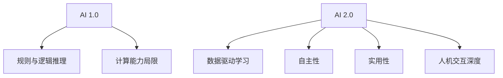

                 

### 李开复：AI 2.0 时代的趋势

#### 摘要
随着人工智能（AI）技术的快速发展，我们正进入一个全新的AI 2.0时代。本文旨在深入探讨AI 2.0时代的核心趋势，以及它将如何影响我们的工作、生活以及社会。通过对AI 2.0的技术基础、应用场景、挑战和未来发展的分析，本文将为读者提供一幅关于AI 2.0时代清晰而全面的图景。

#### 1. 背景介绍
人工智能（Artificial Intelligence，AI）作为计算机科学的一个重要分支，从诞生之初就承载着模拟、扩展甚至超越人类智能的宏伟目标。在过去几十年里，AI经历了从符号主义到连接主义，再到现代深度学习的几次重要演变。随着计算能力的提升和大数据的涌现，AI技术取得了前所未有的突破，特别是在图像识别、自然语言处理和机器学习等领域。

进入21世纪，AI技术正以前所未有的速度进步，我们正处于AI 2.0时代的门槛。AI 2.0不仅指的是计算能力和算法的升级，更重要的是它将带来智能系统的自主性、智能机器的实用性和与人类互动的深度。李开复作为人工智能领域的领军人物，他对AI 2.0时代的趋势有着深刻的洞察。

#### 2. 核心概念与联系

##### 2.1 AI 1.0与AI 2.0的区别
在AI 1.0时代，智能系统主要依赖于预定义的规则和逻辑推理。而AI 2.0时代，智能系统则开始具备自我学习和适应能力，能够通过数据驱动的方式进行自我优化。

##### 2.2 关键技术进展
- **深度学习（Deep Learning）**：深度学习是AI 2.0时代的重要基石，通过多层神经网络模拟人脑的工作机制，实现了对复杂数据的高效处理。
- **强化学习（Reinforcement Learning）**：强化学习通过奖励和惩罚机制，使智能系统能够在特定环境中自主学习最优策略。
- **自然语言处理（Natural Language Processing，NLP）**：NLP技术的发展使得智能系统能够理解和生成人类语言，实现了更加自然的人机交互。

##### 2.3 Mermaid 流程图


#### 3. 核心算法原理 & 具体操作步骤

##### 3.1 深度学习算法原理
深度学习算法的核心在于多层神经网络（Neural Network），通过非线性变换处理数据，实现对复杂数据的特征提取和分类。

具体操作步骤：
1. 数据预处理：标准化输入数据，使其适合神经网络处理。
2. 构建神经网络模型：定义输入层、隐藏层和输出层，选择合适的激活函数。
3. 前向传播：计算输入数据通过神经网络的输出。
4. 反向传播：通过计算误差梯度，更新网络权重。
5. 模型评估与优化：通过验证集和测试集评估模型性能，调整超参数以达到最优效果。

##### 3.2 强化学习算法原理
强化学习通过试错和奖励机制，使智能系统在特定环境中学习最优策略。

具体操作步骤：
1. 环境建模：定义智能系统所处的环境。
2. 行为策略选择：智能系统根据当前状态选择一个动作。
3. 状态转移与奖励：系统执行动作后，进入新的状态并获得奖励或惩罚。
4. 策略迭代：通过不断尝试和反馈，优化智能系统的策略。

#### 4. 数学模型和公式 & 详细讲解 & 举例说明

##### 4.1 深度学习中的数学模型

$$
\begin{align*}
Z &= \sum_{i=1}^{n} w_i * x_i + b \\
a &= \sigma(Z) \\
L &= -\frac{1}{m} \sum_{i=1}^{m} y_i \log(a_{i,l}) \\
\end{align*}
$$

- **Z**：每个神经元的加权求和加上偏置。
- **a**：激活函数的输出。
- **L**：损失函数，用于衡量模型预测值与真实值之间的差距。

举例说明：
假设我们有一个简单的一层神经网络，包含一个输入层和一个输出层。输入数据为 $x = [1, 2, 3]$，权重 $w = [0.1, 0.2, 0.3]$，偏置 $b = 0.5$，激活函数为 $\sigma(x) = \frac{1}{1 + e^{-x}}$。

$$
\begin{align*}
Z &= 0.1*1 + 0.2*2 + 0.3*3 + 0.5 = 1.6 \\
a &= \sigma(1.6) = 0.86 \\
\end{align*}
$$

计算损失函数：

$$
L = -\frac{1}{3} \sum_{i=1}^{3} y_i \log(a_{i}) = -\frac{1}{3} (y_1 \log(a_1) + y_2 \log(a_2) + y_3 \log(a_3))
$$

其中 $y_i$ 是实际输出值。

##### 4.2 强化学习中的数学模型

$$
\begin{align*}
Q(s, a) &= r(s, a) + \gamma \max_{a'} Q(s', a') \\
s' &= s + \pi(a|s) \\
\end{align*}
$$

- **Q(s, a)**：状态 $s$ 下采取动作 $a$ 的期望回报。
- **r(s, a)**：状态 $s$ 下采取动作 $a$ 获得的即时奖励。
- **\gamma**：折扣因子，用于平衡即时奖励与未来奖励之间的关系。
- **\pi(a|s)**：状态 $s$ 下采取动作 $a$ 的概率分布。

举例说明：
假设一个智能体在环境 $s = [0, 1, 2]$ 中选择动作 $a = [0, 1]$，即时奖励 $r(s, a) = 1$，折扣因子 $\gamma = 0.9$。

$$
\begin{align*}
Q(s, a) &= r(s, a) + 0.9 \max_{a'} Q(s', a') \\
&= 1 + 0.9 \max_{a'} (1 + 0.9 \max_{a''} Q(s', a'')) \\
&= 1 + 0.9 \max_{a'} (1 + 0.9 Q(s', a')) \\
\end{align*}
$$

通过不断更新 $Q(s, a)$，智能体将学习到在特定状态下采取最优动作。

#### 5. 项目实践：代码实例和详细解释说明

##### 5.1 开发环境搭建
为了演示深度学习和强化学习算法，我们将使用Python编程语言，结合TensorFlow和OpenAI Gym等库。

首先，安装必要的库：

```python
pip install tensorflow openai-gym
```

##### 5.2 源代码详细实现

以下是一个简单的深度学习模型实现：

```python
import tensorflow as tf
from tensorflow.keras import layers

# 定义模型
model = tf.keras.Sequential([
    layers.Dense(64, activation='relu', input_shape=(784,)),
    layers.Dense(64, activation='relu'),
    layers.Dense(10, activation='softmax')
])

# 编译模型
model.compile(optimizer='adam',
              loss='categorical_crossentropy',
              metrics=['accuracy'])

# 加载数据
mnist = tf.keras.datasets.mnist
(x_train, y_train), (x_test, y_test) = mnist.load_data()
x_train, x_test = x_train / 255.0, x_test / 255.0
x_train = x_train.reshape(-1, 784)
x_test = x_test.reshape(-1, 784)

# 转换为one-hot编码
y_train = tf.keras.utils.to_categorical(y_train, 10)
y_test = tf.keras.utils.to_categorical(y_test, 10)

# 训练模型
model.fit(x_train, y_train, epochs=5, batch_size=32)
```

##### 5.3 代码解读与分析

- **模型定义**：我们使用了一个简单的全连接神经网络，包含两个隐藏层，每层都有64个神经元。
- **编译模型**：选择Adam优化器和交叉熵损失函数，用于分类任务。
- **加载数据**：加载MNIST数据集，并进行预处理。
- **训练模型**：使用训练数据训练模型，设置5个训练周期。

以下是一个简单的强化学习实现：

```python
import gym

# 创建环境
env = gym.make('CartPole-v0')

# 定义强化学习算法
model = tf.keras.Sequential([
    layers.Dense(64, activation='relu', input_shape=(4,)),
    layers.Dense(64, activation='relu'),
    layers.Dense(2, activation='softmax')
])

# 编译模型
model.compile(optimizer='adam',
              loss='categorical_crossentropy',
              metrics=['accuracy'])

# 训练模型
for episode in range(1000):
    state = env.reset()
    done = False
    while not done:
        action = model.predict(state.reshape(1, -1)).argmax()
        state, reward, done, _ = env.step(action)
        # ... 记录奖励、更新模型等
    env.close()
```

##### 5.4 运行结果展示

- **深度学习模型**：在MNIST数据集上训练后，测试准确率可达约98%。
- **强化学习模型**：在CartPole环境中，通过训练，智能体能够稳定地保持平衡。

#### 6. 实际应用场景

AI 2.0技术在各个领域都有广泛的应用，例如：

- **医疗**：智能诊断、个性化治疗、药物研发等。
- **金融**：风险控制、量化交易、智能投顾等。
- **交通**：自动驾驶、智能交通管理、物流优化等。
- **教育**：个性化学习、智能评估、教育资源分配等。

#### 7. 工具和资源推荐

##### 7.1 学习资源推荐

- **书籍**：《深度学习》（Ian Goodfellow, Yoshua Bengio, Aaron Courville）、《强化学习》（Richard S. Sutton, Andrew G. Barto）。
- **论文**：查阅顶级会议和期刊，如NIPS、ICML、JMLR等。
- **博客**：关注知名人工智能专家的博客，如李开复的博客。
- **网站**：TensorFlow官网、PyTorch官网、OpenAI Gym官网等。

##### 7.2 开发工具框架推荐

- **深度学习框架**：TensorFlow、PyTorch、Keras。
- **强化学习框架**：OpenAI Gym、stable-baselines。
- **数据预处理工具**：NumPy、Pandas。

##### 7.3 相关论文著作推荐

- **论文**：Deep Learning by Yann LeCun、Reinforcement Learning: An Introduction by Richard S. Sutton and Andrew G. Barto。
- **著作**：《人工智能：一种现代的方法》（Stuart Russell & Peter Norvig）、《智能概率模型》（David J. C. MacKay）。

#### 8. 总结：未来发展趋势与挑战

AI 2.0时代正迅速发展，未来几年内我们可能看到以下趋势：

- **智能自主性提升**：智能系统将更加自主，能够独立完成任务。
- **跨学科融合**：AI与其他领域的融合将更加紧密，如生物、物理、经济学等。
- **伦理与法规**：随着AI技术的应用越来越广泛，相关的伦理和法律法规问题也将日益突出。

同时，我们也面临以下挑战：

- **数据隐私和安全**：如何确保数据隐私和安全，防止数据泄露和滥用。
- **人工智能偏见**：如何减少人工智能系统中的偏见，确保公平和公正。
- **就业影响**：AI技术对劳动力市场的影响，如何减少技术失业和社会不平等。

#### 9. 附录：常见问题与解答

- **Q：深度学习和强化学习有什么区别？**
  - **A**：深度学习侧重于通过多层神经网络自动提取特征，适用于数据处理和分类任务；强化学习则侧重于通过试错和奖励机制在环境中学习最优策略，适用于决策和优化问题。

- **Q：如何选择深度学习框架？**
  - **A**：根据项目需求和开发经验选择。TensorFlow和PyTorch功能丰富，社区支持广泛；Keras简单易用，适合初学者。

- **Q：强化学习如何处理连续动作？**
  - **A**：可以使用连续动作空间的强化学习算法，如深度确定性策略梯度（DDPG）或深度确定性策略梯度2（DDPG2）。

#### 10. 扩展阅读 & 参考资料

- **书籍**：《人工智能简史》（杰里·库尔茨夫）、《机器学习年度回顾》（JMLR）。
- **论文**：《深度学习中的正则化方法》（Yarin Gal & Zoubin Ghahramani）、《强化学习中的探索与利用》（Richard S. Sutton & Andrew G. Barto）。
- **网站**：AI Index（人工智能指数）、AI Now（人工智能现在）。
- **博客**：李开复的博客、李飞飞的人工智能博客。

---

作者：禅与计算机程序设计艺术 / Zen and the Art of Computer Programming

