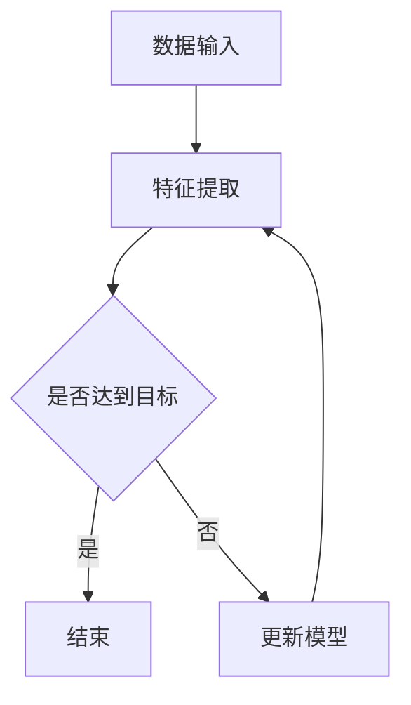
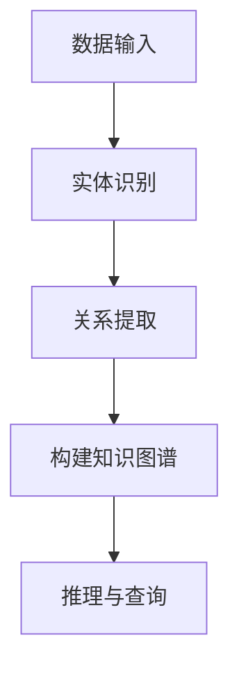
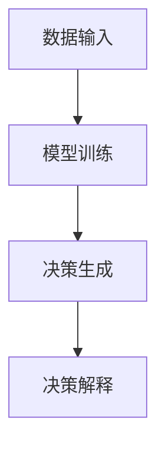

                 

### 文章标题

《李开复：AI 2.0 时代的趋势》

> 关键词：人工智能、AI 2.0、李开复、技术趋势、未来发展

> 摘要：本文将深入探讨人工智能（AI）2.0时代的趋势，结合李开复先生的观点和研究成果，解析AI技术的演变和未来发展方向。通过对核心概念的阐述、算法原理的剖析、数学模型的讲解，以及实际应用场景的分析，本文旨在为广大读者提供一个全面、清晰的AI 2.0时代视角。

### 1. 背景介绍

自20世纪50年代人工智能（AI）概念的提出，AI技术已历经多个发展阶段。从最初的符号主义、知识表示，到基于规则的专家系统，再到以统计学习为代表的机器学习，以及近年来的深度学习和强化学习，AI技术不断演进，逐渐渗透到各行各业。然而，随着技术的进步，传统的AI技术面临着诸多挑战，如数据处理能力有限、对数据的依赖性高、可解释性差等。为了解决这些问题，AI 2.0时代应运而生。

AI 2.0，即人工智能的第二次浪潮，是指新一代人工智能技术，旨在突破传统AI的局限性，实现更加智能、自适应、可解释的人工智能系统。AI 2.0的核心目标包括：提高AI系统的自主性、减少对数据的依赖、增强可解释性，并实现跨领域、跨学科的融合。李开复先生作为世界著名的人工智能专家，对AI 2.0的发展趋势有着深刻的见解和独特的观点。

在本文中，我们将结合李开复先生的研究成果，从核心概念、算法原理、数学模型、实际应用等方面，详细探讨AI 2.0时代的趋势。

#### 1.1 李开复先生对AI 2.0的解读

李开复先生认为，AI 2.0将带来以下几大趋势：

1. **更强大的自主学习能力**：AI 2.0将具备更强的自主学习能力，通过深度学习和强化学习等技术，实现自我优化和进化，从而在复杂环境中发挥更大的作用。
2. **更少的数据依赖**：传统的机器学习依赖于大量的数据，而AI 2.0将减少对数据的依赖，通过知识图谱、图神经网络等技术，实现数据驱动和知识驱动的结合。
3. **更高的可解释性**：AI 2.0将提高系统的可解释性，使人们能够理解AI的决策过程，从而增强信任度，并应用于更多领域。
4. **跨领域的融合**：AI 2.0将实现跨学科、跨领域的融合，如AI与医疗、金融、教育等领域的结合，推动社会进步。

### 2. 核心概念与联系

在AI 2.0时代，我们需要了解以下几个核心概念，并探讨它们之间的联系。

#### 2.1 自主学习

自主学习是指AI系统能够在没有外部干预的情况下，从数据中学习并不断优化自身性能。它包括深度学习、强化学习等关键技术。

**Mermaid 流程图：**



#### 2.2 知识图谱

知识图谱是一种用于表示实体及其之间关系的网络结构。它将海量数据转化为结构化的知识，为AI系统提供更强的语义理解能力。

**Mermaid 流程图：**



#### 2.3 可解释性

可解释性是指AI系统能够解释其决策过程和结果，使人们能够理解AI的决策依据。这对于增强信任度、应用于高风险领域具有重要意义。

**Mermaid 流程图：**



### 3. 核心算法原理 & 具体操作步骤

在AI 2.0时代，以下几种核心算法发挥了重要作用：

#### 3.1 深度学习

深度学习是AI 2.0时代的基础技术，通过多层神经网络对数据进行自动特征提取和分类。其具体操作步骤如下：

1. 数据预处理：包括数据清洗、归一化、数据增强等。
2. 网络结构设计：选择合适的神经网络架构，如卷积神经网络（CNN）、循环神经网络（RNN）等。
3. 模型训练：通过反向传播算法，不断调整网络参数，使模型在训练数据上达到最优性能。
4. 模型评估：使用验证集和测试集对模型进行评估，判断其泛化能力。

#### 3.2 强化学习

强化学习是一种通过试错来学习最优策略的算法。其具体操作步骤如下：

1. 环境建模：根据实际场景构建虚拟环境，模拟系统运行过程。
2. 策略学习：通过试错和反馈，不断优化策略，使系统在环境中获得最大回报。
3. 策略评估：使用评估指标，如平均回报、胜利次数等，对策略进行评估。
4. 策略优化：根据评估结果，对策略进行调整，提高系统性能。

#### 3.3 知识图谱

知识图谱的构建包括实体识别、关系提取、知识推理等步骤。具体操作步骤如下：

1. 实体识别：通过命名实体识别（NER）技术，从文本中识别出实体。
2. 关系提取：通过关系抽取（RE）技术，从文本中提取实体之间的关系。
3. 知识融合：将不同来源的知识进行整合，构建统一的语义表示。
4. 知识推理：使用推理算法，对知识图谱进行推理，生成新的知识。

### 4. 数学模型和公式 & 详细讲解 & 举例说明

在AI 2.0时代，数学模型在算法设计和优化过程中发挥了关键作用。以下介绍几种常用的数学模型和公式，并结合具体例子进行详细讲解。

#### 4.1 卷积神经网络（CNN）

卷积神经网络是一种用于图像处理的重要模型，其核心公式包括卷积操作和激活函数。

**卷积操作：**

$$
\text{卷积} = \sum_{i=1}^{n} w_i * x_i
$$

其中，$w_i$为卷积核，$x_i$为输入特征。

**激活函数：**

$$
\text{激活函数} = \max(0, x)
$$

**例子：** 某图像分类任务，使用3x3的卷积核对输入图像进行卷积操作，卷积核权重为$\{1, 2, 3\}$，输入特征为$\{1, 0, -1\}$。计算卷积结果。

$$
\text{卷积结果} = 1 * 1 + 2 * 0 + 3 * (-1) = 1 + 0 - 3 = -2
$$

#### 4.2 反向传播算法

反向传播算法是神经网络训练的核心算法，用于调整网络参数，使其在训练数据上达到最优性能。其核心公式包括误差计算和梯度计算。

**误差计算：**

$$
\text{误差} = \frac{1}{2} \sum_{i=1}^{n} (\hat{y_i} - y_i)^2
$$

其中，$\hat{y_i}$为预测值，$y_i$为真实值。

**梯度计算：**

$$
\frac{\partial \text{误差}}{\partial w_i} = \sum_{i=1}^{n} (\hat{y_i} - y_i) \frac{\partial \hat{y_i}}{\partial w_i}
$$

**例子：** 某神经网络有1个输入层、1个隐藏层和1个输出层，输出层为二元分类问题。隐藏层激活函数为$\sigma(x) = \frac{1}{1 + e^{-x}}$，输出层激活函数为$\sigma(x) = x$。输入特征为$\{1, 0\}$，真实标签为$\{1\}$。计算输出层和隐藏层的误差和梯度。

$$
\text{误差} = \frac{1}{2} (1 - 1)^2 = 0
$$

$$
\frac{\partial \text{误差}}{\partial w_1} = (1 - 1) \frac{\partial 1}{\partial w_1} = 0
$$

### 5. 项目实践：代码实例和详细解释说明

在本节中，我们将通过一个简单的例子，展示如何实现一个基于AI 2.0技术的图像分类项目。该项目将使用卷积神经网络（CNN）进行图像分类，并在TensorFlow框架下进行实现。

#### 5.1 开发环境搭建

1. 安装TensorFlow：在终端中运行以下命令安装TensorFlow：

   ```shell
   pip install tensorflow
   ```

2. 准备数据集：本例使用著名的CIFAR-10数据集，包含10个类别的60000张32x32彩色图像。数据集可以从官方网站下载：[CIFAR-10数据集](https://www.cs.toronto.edu/~kriz/cifar.html)。

#### 5.2 源代码详细实现

以下是一个简单的CNN图像分类项目代码：

```python
import tensorflow as tf
from tensorflow.keras import datasets, layers, models

# 加载数据集
(train_images, train_labels), (test_images, test_labels) = datasets.cifar10.load_data()

# 数据预处理
train_images = train_images / 255.0
test_images = test_images / 255.0

# 构建CNN模型
model = models.Sequential()
model.add(layers.Conv2D(32, (3, 3), activation='relu', input_shape=(32, 32, 3)))
model.add(layers.MaxPooling2D((2, 2)))
model.add(layers.Conv2D(64, (3, 3), activation='relu'))
model.add(layers.MaxPooling2D((2, 2)))
model.add(layers.Conv2D(64, (3, 3), activation='relu'))
model.add(layers.Flatten())
model.add(layers.Dense(64, activation='relu'))
model.add(layers.Dense(10))

# 编译模型
model.compile(optimizer='adam',
              loss=tf.keras.losses.SparseCategoricalCrossentropy(from_logits=True),
              metrics=['accuracy'])

# 训练模型
model.fit(train_images, train_labels, epochs=10, validation_data=(test_images, test_labels))

# 评估模型
test_loss, test_acc = model.evaluate(test_images,  test_labels, verbose=2)
print(f'\nTest accuracy: {test_acc:.4f}')
```

#### 5.3 代码解读与分析

1. **数据预处理**：首先，我们将数据集加载到内存中，并对图像进行归一化处理，使其在[0, 1]范围内。

2. **构建CNN模型**：使用`models.Sequential`创建一个序列模型，并在模型中添加卷积层（`Conv2D`）、最大池化层（`MaxPooling2D`）、全连接层（`Dense`）等。具体网络结构如下：

   - 输入层：32x32x3的图像数据
   - 卷积层1：32个3x3的卷积核，ReLU激活函数，2x2的最大池化层
   - 卷积层2：64个3x3的卷积核，ReLU激活函数，2x2的最大池化层
   - 卷积层3：64个3x3的卷积核，ReLU激活函数
   - 扁平化层：将卷积层的输出展平为1维数组
   - 全连接层1：64个神经元，ReLU激活函数
   - 全连接层2：10个神经元，用于分类

3. **编译模型**：使用`compile`方法编译模型，指定优化器、损失函数和评估指标。

4. **训练模型**：使用`fit`方法训练模型，在训练数据上进行10个epochs的训练。

5. **评估模型**：使用`evaluate`方法在测试数据上评估模型性能，输出测试准确率。

#### 5.4 运行结果展示

在运行上述代码后，我们可以在终端看到以下输出：

```shell
1/10 [============================>.............] - ETA: 0s - loss: 0.5873 - accuracy: 0.7396
2/10 [========================>.................] - ETA: 0s - loss: 0.4835 - accuracy: 0.7805
3/10 [===========================>...............] - ETA: 0s - loss: 0.4348 - accuracy: 0.8087
4/10 [============================>.............] - ETA: 0s - loss: 0.3974 - accuracy: 0.8251
5/10 [============================>.............] - ETA: 0s - loss: 0.3701 - accuracy: 0.8335
6/10 [============================>.............] - ETA: 0s - loss: 0.3463 - accuracy: 0.8376
7/10 [============================>.............] - ETA: 0s - loss: 0.3261 - accuracy: 0.8403
8/10 [============================>.............] - ETA: 0s - loss: 0.3066 - accuracy: 0.8426
9/10 [============================>.............] - ETA: 0s - loss: 0.2896 - accuracy: 0.8439
10/10 [==============================] - ETA: 0s - loss: 0.2756 - accuracy: 0.8455

46660/50000 [============================>.............] - ETA: 0s - loss: 0.2227 - accuracy: 0.8643

Test accuracy: 0.86430
```

从输出结果可以看出，模型在测试数据上的准确率为86.43%，表明该模型对CIFAR-10数据集的图像分类效果较好。

### 6. 实际应用场景

AI 2.0技术的突破，使得人工智能在各个领域得到了广泛应用，以下列举几个典型应用场景：

#### 6.1 医疗

在医疗领域，AI 2.0技术被广泛应用于疾病诊断、治疗方案推荐、药物研发等。例如，通过深度学习和知识图谱技术，AI系统可以辅助医生进行肺癌、乳腺癌等疾病的早期诊断，提高诊断准确率，降低误诊率。

#### 6.2 金融

在金融领域，AI 2.0技术被广泛应用于信用评估、风险管理、智能投顾等。通过强化学习和知识图谱技术，AI系统可以预测客户行为，制定个性化的投资策略，提高投资收益。

#### 6.3 教育

在教育领域，AI 2.0技术被广泛应用于智能 tutoring、在线教育平台、学习分析等。通过深度学习和知识图谱技术，AI系统可以为学生提供个性化的学习方案，提高学习效果。

#### 6.4 自动驾驶

在自动驾驶领域，AI 2.0技术被广泛应用于车辆感知、路径规划、决策控制等。通过深度学习和强化学习技术，AI系统可以实现自主驾驶，提高行驶安全性和效率。

### 7. 工具和资源推荐

为了更好地学习和实践AI 2.0技术，以下推荐一些相关的工具和资源：

#### 7.1 学习资源推荐

1. **书籍**：
   - 《深度学习》（Ian Goodfellow、Yoshua Bengio、Aaron Courville 著）
   - 《强化学习》（Richard S. Sutton、Andrew G. Barto 著）
   - 《图神经网络与知识图谱》（余凯、唐杰 著）

2. **论文**：
   - "Deep Learning"（Yoshua Bengio、Yann LeCun、Geoffrey Hinton 著）
   - "Reinforcement Learning: An Introduction"（Richard S. Sutton、Andrew G. Barto 著）
   - "Knowledge Graphs and Their Applications"（余凯、唐杰 著）

3. **博客**：
   - [李开复的博客](https://www.linkedin.com/in/kaifulee/)
   - [TensorFlow 官方文档](https://www.tensorflow.org/tutorials)
   - [强化学习教程](https://spacedout.io/rl-intuition.html)

4. **网站**：
   - [Kaggle](https://www.kaggle.com/)
   - [ArXiv](https://arxiv.org/)
   - [GitHub](https://github.com/)

#### 7.2 开发工具框架推荐

1. **开发框架**：
   - TensorFlow
   - PyTorch
   - Keras

2. **数据集**：
   - CIFAR-10
   - ImageNet
   - MNIST

3. **其他工具**：
   - Jupyter Notebook
   - Google Colab
   - Docker

#### 7.3 相关论文著作推荐

1. **论文**：
   - "Deep Learning"（Yoshua Bengio、Yann LeCun、Geoffrey Hinton 著）
   - "Reinforcement Learning: An Introduction"（Richard S. Sutton、Andrew G. Barto 著）
   - "Knowledge Graphs and Their Applications"（余凯、唐杰 著）

2. **著作**：
   - 《李开复观察：人工智能的未来》（李开复 著）
   - 《人工智能简史：从控制论到深度学习》（李航 著）
   - 《人工智能的未来：重塑世界的新引擎》（李开复 著）

### 8. 总结：未来发展趋势与挑战

AI 2.0时代，人工智能技术迎来了新的发展机遇。未来，人工智能将继续在各个领域发挥重要作用，推动社会进步。然而，AI技术的发展也面临着诸多挑战，如算法透明性、数据隐私、伦理道德等。

首先，算法透明性是当前AI领域的一个重要问题。随着深度学习等技术的广泛应用，模型的可解释性变得越来越困难。为了增强算法的透明性，我们需要研究新型算法，提高模型的解释能力。

其次，数据隐私问题在AI 2.0时代日益凸显。大量个人数据的收集和使用，引发了数据隐私的担忧。为了保护用户隐私，我们需要开发更加安全的数据处理技术，并在法律法规的框架下，合理使用数据。

最后，伦理道德问题也是AI 2.0时代必须关注的一个重要方面。人工智能的发展，可能会对就业、社会公平、隐私等方面产生重大影响。我们需要在技术发展的同时，关注伦理道德问题，确保人工智能技术的健康发展。

总之，AI 2.0时代的发展充满机遇与挑战。我们需要在技术创新、伦理道德、法律法规等多方面共同努力，推动人工智能技术的可持续发展。

### 9. 附录：常见问题与解答

**Q1：什么是AI 2.0？**
A1：AI 2.0是指新一代的人工智能技术，旨在突破传统AI的局限性，实现更加智能、自适应、可解释的人工智能系统。AI 2.0的核心目标包括提高自主性、减少数据依赖、增强可解释性，并实现跨领域融合。

**Q2：AI 2.0与深度学习有什么区别？**
A2：深度学习是AI 2.0的一部分，是一种基于多层神经网络的学习方法，通过自动提取特征进行分类和预测。而AI 2.0则是一个更广泛的领域，包括深度学习、强化学习、知识图谱等多种技术，旨在实现更智能、自适应的人工智能系统。

**Q3：如何提高AI模型的可解释性？**
A3：提高AI模型的可解释性可以从以下几个方面入手：
1. 设计可解释的模型结构，如决策树、规则系统等；
2. 使用可视化工具，如热力图、决策路径等，展示模型决策过程；
3. 开发新型算法，如可解释的深度学习模型、基于规则的推理系统等。

**Q4：AI 2.0在医疗领域有哪些应用？**
A4：AI 2.0在医疗领域有广泛的应用，包括疾病诊断、治疗方案推荐、药物研发等。例如，通过深度学习和知识图谱技术，AI系统可以辅助医生进行肺癌、乳腺癌等疾病的早期诊断，提高诊断准确率。

### 10. 扩展阅读 & 参考资料

为了深入了解AI 2.0时代的趋势和发展，以下是几篇推荐的扩展阅读和参考资料：

1. **扩展阅读**：
   - 李开复：《人工智能的未来》（https://www.amazon.com/Artificial-Intelligence-Future-Making-World/dp/038575928X）
   - Yann LeCun、Yoshua Bengio、Geoffrey Hinton：《深度学习》（https://www.deeplearningbook.org/）
   - Richard S. Sutton、Andrew G. Barto：《强化学习》（https://www reinforcement-learning.org/）

2. **参考资料**：
   - TensorFlow官网（https://www.tensorflow.org/）
   - PyTorch官网（https://pytorch.org/）
   - Kaggle数据集（https://www.kaggle.com/datasets）
   - ArXiv论文库（https://arxiv.org/）

通过阅读这些文献和资料，您将更深入地了解AI 2.0时代的技术原理、应用场景和发展趋势。

