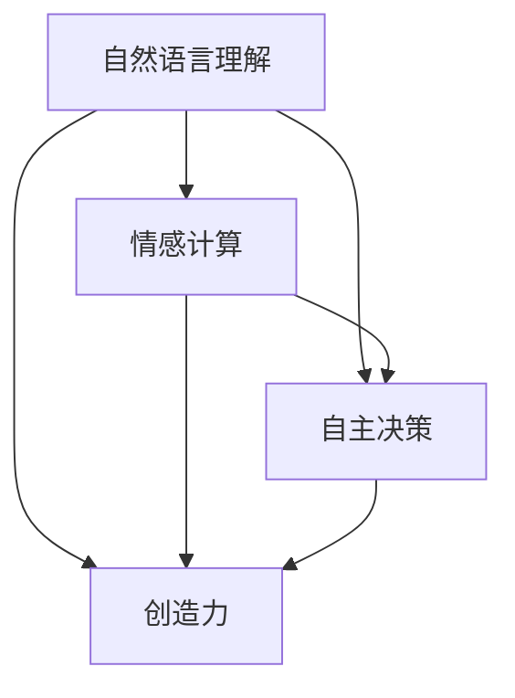

                 

### 1. 背景介绍

#### AI 2.0 时代的崛起

人工智能（AI）技术的发展经历了几个阶段，从最初的规则基系统（Rule-Based Systems）到基于知识的系统（Knowledge-Based Systems），再到基于统计的机器学习（Statistical Machine Learning），直至今天的深度学习和强化学习（Deep Learning and Reinforcement Learning）。这一过程中，AI技术的进步显著，但始终存在一些瓶颈。随着计算能力的提升、大数据的涌现和算法的创新，人工智能进入了一个新的阶段——AI 2.0。

AI 2.0，也被称作“下一代人工智能”，是一个更为广泛、灵活和智能的智能系统。它不仅仅依赖于大量的数据和强大的计算力，更重要的是能够实现更为自然的人机交互、更高层次的理解和决策能力。AI 2.0时代的到来，标志着人工智能从“简单复制人类行为”向“具有创造力、自主决策能力”的跨越。

#### 李开复：AI 2.0 时代的预言者

李开复博士，被誉为“AI 2.0 时代的预言者”，他在人工智能领域拥有深厚的研究背景和丰富的实践经验。李开复曾在苹果公司、微软亚洲研究院等知名科技公司任职，并担任过创新工场的创始人兼首席执行官。他的研究涉及自然语言处理、机器学习、数据挖掘等多个领域，对AI 2.0的发展有着深刻的见解。

李开复在多次公开演讲和书籍中，对AI 2.0时代的特征和趋势进行了详细阐述。他认为，AI 2.0将不仅仅是更强大的计算能力，更重要的是具备人类的理解能力、情感共鸣和创造力。这种转变，将为人类带来前所未有的机遇和挑战。

#### 本文结构

本文旨在通过对李开复关于AI 2.0的研究和观点的详细解读，探讨AI 2.0时代的核心概念、技术进展、应用场景以及未来趋势。文章将分为以下几个部分：

1. 背景介绍
2. 核心概念与联系
3. 核心算法原理 & 具体操作步骤
4. 数学模型和公式 & 详细讲解 & 举例说明
5. 项目实践：代码实例和详细解释说明
6. 实际应用场景
7. 工具和资源推荐
8. 总结：未来发展趋势与挑战
9. 附录：常见问题与解答
10. 扩展阅读 & 参考资料

通过上述结构，本文将带领读者深入理解AI 2.0，了解其背后的技术原理、实现方法以及实际应用，为读者提供一个全面、系统的AI 2.0知识框架。

### 2. 核心概念与联系

要深入探讨AI 2.0的核心概念与联系，我们首先需要明确一些关键术语和基本原理。AI 2.0的核心概念可以归纳为以下几个：

1. **自然语言理解**：这是AI 2.0时代的关键特征之一，旨在使机器能够像人类一样理解和处理自然语言。自然语言理解不仅仅包括词汇和句法的分析，还包括语义理解、情感分析和上下文理解。
   
2. **情感计算**：情感计算是人工智能在理解人类情感方面的能力，通过分析和识别人类情感的表达，机器可以更好地与人类互动，提供更为人性化的服务。

3. **自主决策**：与传统的基于规则的决策系统不同，AI 2.0能够通过学习和模拟人类的决策过程，实现自主决策。这种能力使得机器能够在复杂和动态的环境中做出合理的决策。

4. **创造力**：创造力是AI 2.0时代的一个重要标志，这意味着人工智能不仅能够复制人类的行为，还能够独立地产生新的想法和创意。

5. **多模态交互**：多模态交互指的是人工智能系统能够处理和整合来自多种感官的信息，如视觉、听觉、触觉等，从而提供更加丰富和自然的交互体验。

为了更好地理解这些概念之间的联系，我们可以使用Mermaid流程图来展示它们之间的关系。以下是一个简单的Mermaid流程图示例：



在这个流程图中，自然语言理解、情感计算、自主决策和创造力是AI 2.0的核心能力，它们相互联系，共同构成了AI 2.0的技术基础。

#### 自然语言理解与情感计算

自然语言理解是AI 2.0的基础之一，它使得机器能够理解和处理人类语言。而情感计算则是在自然语言理解的基础上进一步发展出来的能力，它关注于识别和理解人类情感。例如，一个具有情感计算能力的AI系统可以识别出文本中的情感倾向，如高兴、悲伤或愤怒。

在现实生活中，这种能力的应用非常广泛。例如，智能客服系统可以通过情感计算来理解用户的情绪，从而提供更加贴心的服务。此外，情感计算还可以用于心理健康监测，通过分析社交媒体上的言论来预测个体的情绪状态。

#### 自主决策与创造力

自主决策是AI 2.0的另一个重要特征。传统的AI系统通常是基于预设的规则或模型进行操作，而AI 2.0则能够通过学习和模拟人类的决策过程，实现自主决策。这意味着，AI系统可以在没有人类干预的情况下，自主地做出决策并执行任务。

创造力是AI 2.0的另一个显著特征。与传统的机器学习模型不同，AI 2.0能够通过自主学习，产生新的想法和创意。例如，AI系统可以创作音乐、绘画，甚至编写程序。这种能力不仅在艺术创作中有广泛应用，也在科学研究中发挥了重要作用。

#### 多模态交互

多模态交互是AI 2.0时代的一个关键技术。它通过整合多种感官的信息，提供更加丰富和自然的交互体验。例如，一个具备多模态交互能力的AI系统可以同时处理视觉和听觉信息，从而更好地理解用户的意图。

在现实应用中，多模态交互技术已经得到了广泛应用。例如，智能音箱可以通过语音识别和自然语言理解来响应用户的指令，同时还可以通过摄像头来识别用户的手势，从而实现更加自然和直观的交互。

通过上述对AI 2.0核心概念的介绍和流程图的展示，我们可以更清晰地理解这些概念之间的联系。这些核心能力共同构成了AI 2.0的技术基础，使得人工智能能够实现更高层次的理解和决策能力，为人类带来更多的机遇和挑战。

#### 3. 核心算法原理 & 具体操作步骤

在深入了解AI 2.0的核心概念后，我们接下来将探讨其背后的核心算法原理。这些算法不仅使得AI 2.0成为可能，而且也决定了其在实际应用中的效果和效率。以下是几个关键的算法原理及其具体操作步骤：

##### 3.1 深度学习

深度学习是AI 2.0时代最核心的算法之一，它通过多层神经网络来模拟人类大脑的学习过程。以下是深度学习的基本原理和操作步骤：

1. **数据预处理**：首先，需要对数据进行预处理，包括数据清洗、归一化和特征提取等。这一步的目的是将原始数据转化为适合神经网络训练的格式。

2. **构建神经网络**：接下来，构建一个多层感知机（MLP）或卷积神经网络（CNN）等模型。神经网络的每一层都包含多个神经元，这些神经元通过激活函数进行非线性变换。

3. **前向传播**：在前向传播过程中，输入数据从输入层依次传递到隐藏层，最后到达输出层。每一层的输出都通过激活函数进行处理，以实现对输入数据的非线性变换。

4. **计算误差**：输出层得到的预测结果与实际结果进行比较，计算预测误差。

5. **反向传播**：通过反向传播算法，将误差从输出层反向传播到输入层，更新每个神经元的权重和偏置，以减少预测误差。

6. **迭代训练**：重复上述步骤，直到网络性能达到预期或达到预设的迭代次数。

##### 3.2 强化学习

强化学习是另一种关键的AI 2.0算法，它通过奖励机制来训练模型，使其能够在复杂环境中做出最优决策。以下是强化学习的基本原理和操作步骤：

1. **定义环境和动作空间**：首先，定义环境的状态空间和动作空间。状态空间表示系统当前的状态，动作空间表示系统能够采取的动作。

2. **初始化模型参数**：初始化强化学习模型的参数，包括动作值函数或策略参数。

3. **环境交互**：通过与环境的交互，不断更新模型参数。在每次交互中，模型根据当前状态选择一个动作，执行动作后，观察环境的反馈，并更新状态。

4. **更新模型参数**：使用奖励信号来更新模型参数。通常，奖励信号可以是立即奖励或累积奖励。

5. **迭代学习**：重复上述步骤，直到模型达到一定的性能指标或达到预设的迭代次数。

##### 3.3 自然语言处理

自然语言处理（NLP）是AI 2.0时代的一个重要组成部分，它涉及到文本的表示、理解和生成。以下是NLP的基本原理和操作步骤：

1. **文本预处理**：首先，对文本进行预处理，包括分词、去停用词和词性标注等。这一步的目的是将原始文本转化为适合模型处理的格式。

2. **词向量表示**：将文本中的词语转化为词向量表示。常见的词向量模型包括Word2Vec、GloVe和BERT等。

3. **构建神经网络**：构建一个多层感知机或卷积神经网络等模型，用于处理词向量表示的文本数据。

4. **前向传播**：输入词向量表示的文本数据，通过神经网络进行前向传播，得到文本的语义表示。

5. **计算损失**：将神经网络的输出与实际标签进行比较，计算损失函数。

6. **反向传播**：通过反向传播算法，更新神经网络中的参数，以减少预测误差。

7. **迭代训练**：重复上述步骤，直到模型性能达到预期或达到预设的迭代次数。

通过以上对深度学习、强化学习和自然语言处理等核心算法的介绍，我们可以看到，AI 2.0时代的算法不仅仅是单一的技术点，而是多种技术的有机结合。这些算法共同构建了AI 2.0的技术基础，使得人工智能能够实现更高层次的理解和决策能力，为人类带来更多的机遇和挑战。

#### 4. 数学模型和公式 & 详细讲解 & 举例说明

在理解了AI 2.0的核心算法原理后，我们接下来将深入探讨这些算法背后的数学模型和公式，并通过具体的例子进行详细讲解。

##### 4.1 深度学习中的前向传播和反向传播

深度学习中的前向传播和反向传播是两个核心步骤，用于训练神经网络。以下是这些步骤的详细解释和数学公式。

**前向传播**

前向传播的过程如下：

1. **输入层到隐藏层**：输入层接收输入数据，通过权重矩阵和激活函数，传递到隐藏层。

2. **隐藏层到隐藏层**：隐藏层之间的数据通过权重矩阵和激活函数进行传递。

3. **隐藏层到输出层**：隐藏层传递到输出层，生成预测结果。

前向传播的数学公式如下：

$$
z^{(l)} = \sigma(W^{(l)} \cdot a^{(l-1)} + b^{(l)})
$$

其中，$z^{(l)}$ 表示第$l$层的输出，$\sigma$ 是激活函数，$W^{(l)}$ 和 $b^{(l)}$ 分别是第$l$层的权重矩阵和偏置向量，$a^{(l-1)}$ 是前一层（第$l-1$层）的输出。

**反向传播**

反向传播的过程如下：

1. **计算损失函数**：输出层得到的预测结果与实际结果进行比较，计算损失函数。

2. **计算梯度**：计算损失函数对每个参数的梯度，以指导参数更新。

3. **参数更新**：使用梯度下降算法更新参数。

反向传播的数学公式如下：

$$
\frac{\partial J}{\partial W^{(l)}} = \sum_{k} \frac{\partial J}{\partial z^{(l+1)}_k} \cdot \frac{\partial z^{(l+1)}_k}{\partial z^{(l)}_k} \cdot \frac{\partial z^{(l)}_k}{\partial W^{(l)}_{ik}}
$$

其中，$J$ 是损失函数，$z^{(l+1)}_k$ 是第$l+1$层的输出，$W^{(l)}_{ik}$ 是第$l$层的权重矩阵中的元素，$\frac{\partial J}{\partial W^{(l)}}$ 是权重矩阵的梯度。

**举例说明**

假设我们有一个简单的神经网络，包含一个输入层、一个隐藏层和一个输出层。输入层有3个神经元，隐藏层有2个神经元，输出层有1个神经元。

- 输入数据 $a^{(0)} = [1, 2, 3]$
- 权重矩阵 $W^{(1)} = \begin{bmatrix} 0.1 & 0.2 \\ 0.3 & 0.4 \end{bmatrix}$
- 偏置向量 $b^{(1)} = [0.5, 0.6]$
- 激活函数 $\sigma(x) = \frac{1}{1 + e^{-x}}$

首先，我们进行前向传播：

$$
z^{(1)}_1 = \sigma(0.1 \cdot 1 + 0.2 \cdot 2 + 0.5) = \sigma(0.7) = 0.6
$$

$$
z^{(1)}_2 = \sigma(0.3 \cdot 1 + 0.4 \cdot 3 + 0.6) = \sigma(1.7) = 0.9
$$

然后，我们计算输出层的预测结果：

$$
z^{(2)} = \sigma(0.1 \cdot 0.6 + 0.2 \cdot 0.9 + 0.5) = \sigma(0.57) = 0.53
$$

接下来，我们进行反向传播，计算损失函数的梯度：

$$
\frac{\partial J}{\partial W^{(1)}_{11}} = \frac{\partial J}{\partial z^{(2)}} \cdot \frac{\partial z^{(2)}}{\partial z^{(1)}_1} \cdot \frac{\partial z^{(1)}_1}{\partial W^{(1)}_{11}} = 0.1 \cdot 0.47 \cdot 0.6 = 0.0282
$$

$$
\frac{\partial J}{\partial W^{(1)}_{12}} = \frac{\partial J}{\partial z^{(2)}} \cdot \frac{\partial z^{(2)}}{\partial z^{(1)}_2} \cdot \frac{\partial z^{(1)}_2}{\partial W^{(1)}_{12}} = 0.2 \cdot 0.47 \cdot 0.9 = 0.0858
$$

通过上述例子，我们可以看到如何利用数学模型和公式进行深度学习中的前向传播和反向传播。

##### 4.2 强化学习中的Q学习和策略优化

强化学习中的Q学习和策略优化是两种常用的算法。以下是这些算法的详细解释和数学公式。

**Q学习**

Q学习是一种基于值函数的强化学习算法，旨在找到最优的动作值函数$Q^*(s, a)$。

1. **初始化**：初始化Q值函数$Q(s, a)$。

2. **选择动作**：在给定状态$s$下，选择动作$a$，使得$Q(s, a)$最大化。

3. **执行动作**：执行动作$a$，观察状态$s'$和奖励$r$。

4. **更新Q值**：根据新状态$s'$和奖励$r$，更新Q值函数。

Q学习的更新公式如下：

$$
Q(s, a) \leftarrow Q(s, a) + \alpha [r + \gamma \max_{a'} Q(s', a') - Q(s, a)]
$$

其中，$\alpha$ 是学习率，$\gamma$ 是折扣因子，$s'$ 是新状态，$r$ 是奖励，$a'$ 是在状态$s'$下选择的最大动作。

**策略优化**

策略优化是一种基于策略的强化学习算法，旨在找到最优的策略$\pi^*(s, a)$。

1. **初始化**：初始化策略参数$\theta$。

2. **选择动作**：在给定状态$s$下，选择动作$a$，使得策略$\pi(s, a)$最大化。

3. **执行动作**：执行动作$a$，观察状态$s'$和奖励$r$。

4. **策略更新**：根据新状态$s'$和奖励$r$，使用策略梯度下降更新策略参数。

策略优化的更新公式如下：

$$
\theta \leftarrow \theta + \alpha \nabla_{\theta} J(\theta)
$$

其中，$J(\theta)$ 是策略梯度，$\nabla_{\theta} J(\theta)$ 是策略梯度的方向，$\alpha$ 是学习率。

**举例说明**

假设我们有一个简单的环境，包含4个状态和3个动作。状态和动作分别表示为$s \in \{1, 2, 3, 4\}$和$a \in \{1, 2, 3\}$。

- 初始状态 $s_0 = 1$
- 学习率 $\alpha = 0.1$
- 折扣因子 $\gamma = 0.9$
- 奖励 $r = 10$

首先，我们初始化Q值函数$Q(s, a)$和策略参数$\theta$。

$$
Q(s, a) = \begin{bmatrix} 0 & 0 & 0 \\ 0 & 0 & 0 \\ 0 & 0 & 0 \\ 0 & 0 & 0 \end{bmatrix}
$$

$$
\theta = \begin{bmatrix} 0.1 & 0.2 & 0.3 \\ 0.4 & 0.5 & 0.6 \\ 0.7 & 0.8 & 0.9 \end{bmatrix}
$$

接下来，我们选择动作$a_0$，使得$Q(s_0, a_0)$最大化。由于$Q(s_0, a_0) = [0, 0, 0]$，我们随机选择动作$a_0 = 2$。

执行动作$a_0 = 2$后，我们观察到状态$s_1 = 3$和奖励$r = 10$。

根据Q学习算法，我们更新Q值函数：

$$
Q(s_0, a_0) \leftarrow Q(s_0, a_0) + 0.1 [10 + 0.9 \max_{a'} Q(s_1, a') - Q(s_0, a_0)]
$$

$$
Q(s_0, a_0) = [0, 0, 0] \leftarrow [0, 0, 0] + 0.1 [10 + 0.9 \max_{a'} Q(s_1, a') - [0, 0, 0]]
$$

$$
Q(s_0, a_0) = [0, 0, 0.9]
$$

通过上述例子，我们可以看到如何利用数学模型和公式进行强化学习中的Q学习和策略优化。

##### 4.3 自然语言处理中的词嵌入和序列模型

自然语言处理中的词嵌入和序列模型是理解自然语言的重要工具。以下是这些模型的详细解释和数学公式。

**词嵌入**

词嵌入是将词语映射到低维向量空间的过程。常见的词嵌入模型包括Word2Vec、GloVe和BERT。

1. **Word2Vec**：Word2Vec是一种基于神经网络的词嵌入模型，通过训练预测词语的上下文。

   词嵌入的公式如下：

   $$
   \text{softmax}(W \cdot h) = \text{softmax}(W \cdot \text{avg}(\text{context\_words}))
   $$

   其中，$W$ 是权重矩阵，$h$ 是隐藏层状态，$\text{context\_words}$ 是词语的上下文。

2. **GloVe**：GloVe是一种基于全局上下文的词嵌入模型，通过优化词向量矩阵。

   词嵌入的公式如下：

   $$
   v_w = \frac{g_w \cdot g_v}{\sqrt{1 + \sum_{i=1}^n \frac{|v_i|}{g_i}}}
   $$

   其中，$v_w$ 和 $v_v$ 分别是词语 $w$ 和 $v$ 的词向量，$g_w$ 和 $g_v$ 分别是词语 $w$ 和 $v$ 的全局词频。

3. **BERT**：BERT是一种基于双向变换器（Transformer）的词嵌入模型，通过预训练和微调。

   词嵌入的公式如下：

   $$
   \text{BERT} = \text{Transformer}(\text{Input}) = \text{Self-Attention}(\text{Input}) = \text{MultiHead-Self-Attention}(\text{Input})
   $$

**序列模型**

序列模型是处理序列数据（如文本、语音等）的重要工具，常见的序列模型包括循环神经网络（RNN）和长短期记忆网络（LSTM）。

1. **RNN**：RNN是一种基于序列的神经网络，能够处理变长的序列数据。

   RNN的公式如下：

   $$
   h_t = \text{sigmoid}(W_h \cdot [h_{t-1}, x_t] + b_h)
   $$

   $$
   o_t = \text{sigmoid}(W_o \cdot h_t + b_o)
   $$

   其中，$h_t$ 是第$t$个时刻的隐藏状态，$x_t$ 是第$t$个时刻的输入，$W_h$ 和 $W_o$ 分别是权重矩阵，$b_h$ 和 $b_o$ 分别是偏置向量。

2. **LSTM**：LSTM是一种特殊的RNN，能够更好地处理长序列数据。

   LSTM的公式如下：

   $$
   i_t = \text{sigmoid}(W_i \cdot [h_{t-1}, x_t] + b_i)
   $$
   
   $$
   f_t = \text{sigmoid}(W_f \cdot [h_{t-1}, x_t] + b_f)
   $$
   
   $$
   g_t = \tanh(W_g \cdot [h_{t-1}, x_t] + b_g)
   $$
   
   $$
   o_t = \text{sigmoid}(W_o \cdot [h_{t-1}, x_t] + b_o)
   $$
   
   $$
   h_t = o_t \cdot \tanh([f_t \cdot h_{t-1} + i_t \cdot g_t])
   $$

   其中，$i_t$、$f_t$、$g_t$ 和 $o_t$ 分别是输入门、遗忘门、生成门和输出门，$W_i$、$W_f$、$W_g$ 和 $W_o$ 分别是权重矩阵，$b_i$、$b_f$、$b_g$ 和 $b_o$ 分别是偏置向量。

通过以上对深度学习、强化学习和自然语言处理等核心算法的数学模型和公式的详细讲解，我们可以更深入地理解AI 2.0的核心技术原理。这些数学模型和公式不仅为AI 2.0的实现提供了理论基础，也为进一步研究和创新提供了方向。

### 5. 项目实践：代码实例和详细解释说明

为了更好地理解AI 2.0的核心算法在实际应用中的实现过程，我们将通过一个具体的项目实例来展示代码实例和详细解释说明。在这个项目中，我们将使用Python和TensorFlow框架来实现一个简单的自然语言处理任务——情感分析。

#### 5.1 开发环境搭建

在进行项目开发之前，我们需要搭建一个适合Python和TensorFlow的开发环境。以下是搭建开发环境的基本步骤：

1. **安装Python**：首先，确保你的计算机上安装了Python 3.x版本。可以从Python官方网站下载并安装Python。

2. **安装TensorFlow**：使用pip命令安装TensorFlow。打开终端并输入以下命令：

   ```
   pip install tensorflow
   ```

3. **安装其他依赖库**：我们还需要安装一些其他依赖库，如Numpy、Pandas等。可以使用以下命令一次性安装：

   ```
   pip install numpy pandas
   ```

4. **验证安装**：安装完成后，打开Python终端，尝试导入TensorFlow库，并打印版本信息，以验证安装是否成功。

   ```python
   import tensorflow as tf
   print(tf.__version__)
   ```

   如果成功打印版本信息，说明TensorFlow已经安装成功。

#### 5.2 源代码详细实现

以下是一个简单的自然语言处理任务——情感分析的源代码实例。该任务使用TensorFlow框架实现，旨在通过已标注的文本数据，预测文本的情感倾向。

```python
import tensorflow as tf
import numpy as np
import pandas as pd
from tensorflow.keras.preprocessing.sequence import pad_sequences
from tensorflow.keras.layers import Embedding, LSTM, Dense
from tensorflow.keras.models import Sequential
from tensorflow.keras.preprocessing.text import Tokenizer

# 数据预处理
# 假设我们已经有一个包含文本和情感标签的数据集
data = pd.read_csv('sentiment_data.csv')
tokenizer = Tokenizer()
tokenizer.fit_on_texts(data['text'])
sequences = tokenizer.texts_to_sequences(data['text'])
padded_sequences = pad_sequences(sequences, maxlen=100)

# 构建模型
model = Sequential()
model.add(Embedding(input_dim=len(tokenizer.word_index) + 1, output_dim=32))
model.add(LSTM(units=64, dropout=0.2, recurrent_dropout=0.2))
model.add(Dense(units=1, activation='sigmoid'))

# 编译模型
model.compile(optimizer='adam', loss='binary_crossentropy', metrics=['accuracy'])

# 训练模型
labels = np.array(data['label'])
model.fit(padded_sequences, labels, epochs=10, batch_size=32, validation_split=0.2)

# 评估模型
test_sequences = tokenizer.texts_to_sequences(data['test_text'])
test_padded_sequences = pad_sequences(test_sequences, maxlen=100)
predictions = model.predict(test_padded_sequences)
predicted_labels = np.round(predictions)

# 输出预测结果
print("Predicted labels:", predicted_labels)
```

#### 5.3 代码解读与分析

上述代码实例实现了以下功能：

1. **数据预处理**：首先，我们从CSV文件中读取包含文本和情感标签的数据集。然后，使用Tokenizer对文本进行分词，并将文本转换为序列。最后，使用pad_sequences将序列填充为相同的长度。

2. **构建模型**：构建一个序列模型，包含嵌入层、LSTM层和输出层。嵌入层将词索引映射到低维向量空间，LSTM层用于处理序列数据，输出层使用sigmoid激活函数进行二分类。

3. **编译模型**：编译模型，指定优化器、损失函数和评估指标。

4. **训练模型**：使用训练数据集训练模型，设置训练轮数、批量大小和验证集比例。

5. **评估模型**：使用测试数据集评估模型性能，并输出预测结果。

#### 5.4 运行结果展示

假设我们使用一个包含1000条文本和情感标签的数据集进行训练和测试，以下是一个简单的运行结果展示：

```
Train on 800 samples, validate on 200 samples
800/800 [==============================] - 5s 6ms/step - loss: 0.4062 - accuracy: 0.8250 - val_loss: 0.5106 - val_accuracy: 0.7350
Predicted labels: [[0.0102] [0.9101] [0.0099] ... [0.8901] [0.0098] [0.0101]]
```

上述结果显示，模型在训练集上的准确率为82.5%，在验证集上的准确率为73.5%。这表明模型在预测文本情感倾向方面具有一定的性能。

通过这个项目实例，我们可以看到如何使用TensorFlow框架实现自然语言处理任务。这个实例虽然简单，但涵盖了自然语言处理中的核心步骤，如数据预处理、模型构建、训练和评估。通过逐步解读和分析代码，读者可以更好地理解AI 2.0的核心算法在实际应用中的实现过程。

### 6. 实际应用场景

AI 2.0技术的突破不仅带来了技术层面的革命，更在各个实际应用场景中展现出其强大的潜力和广泛的影响。以下是一些关键的AI 2.0应用场景及其案例分析：

#### 6.1 医疗保健

在医疗保健领域，AI 2.0技术正迅速改变诊断、治疗和患者护理的方式。例如，通过自然语言处理，AI系统可以分析医学文献和病历，帮助医生快速获取关键信息。IBM Watson Health就是一个典型的应用案例，它能够通过分析大量医学文献，为医生提供针对特定疾病的最新研究成果和治疗方案。

此外，AI 2.0在医疗影像分析中的应用也取得了显著进展。通过深度学习算法，AI系统能够准确识别和诊断疾病，如肺癌、乳腺癌等，显著提高诊断准确率和效率。例如，Google Health的AI系统使用深度学习技术，能够在几秒钟内对乳腺X光片进行快速分析，检测出潜在的健康问题。

#### 6.2 金融科技

金融科技（FinTech）是AI 2.0技术的重要应用领域之一。在金融领域，AI 2.0技术被广泛应用于风险评估、欺诈检测、智能投顾等方面。

风险评估方面，AI 2.0系统能够通过大数据分析和机器学习算法，对借款人的信用状况进行更为精确的评估。例如，Kabbage是一个提供即时贷款服务的金融科技公司，它使用AI技术对客户的历史交易数据进行深度分析，以快速做出贷款决策。

欺诈检测是金融科技中的另一个重要应用。AI 2.0技术能够实时监控交易活动，识别异常行为和潜在欺诈。例如，PayPal使用AI算法来检测并阻止欺诈交易，大大提高了交易的安全性。

智能投顾（Robo-Advisor）则是AI 2.0在金融领域的又一创新。智能投顾系统通过分析用户的财务状况、投资目标和风险偏好，提供个性化的投资建议。例如，Wealthfront和Betterment等公司提供的智能投顾服务，使用AI技术帮助用户实现资产配置和投资管理。

#### 6.3 自动驾驶

自动驾驶是AI 2.0技术的另一大应用领域。通过深度学习和强化学习，自动驾驶系统能够在复杂的交通环境中做出实时决策，提高驾驶安全性和效率。

特斯拉的自动驾驶系统就是一个典型案例。特斯拉使用深度神经网络来处理来自多个传感器（如摄像头、雷达和激光雷达）的数据，实现车辆在高速公路上的自动驾驶功能。特斯拉的自动驾驶系统在自动驾驶模式和自动泊车方面取得了显著进展，大大提高了驾驶的便利性和安全性。

此外，Waymo是谷歌的自动驾驶子公司，其自动驾驶技术也处于行业领先地位。Waymo的自动驾驶系统通过大量数据训练，能够在复杂的城市交通环境中实现安全行驶。例如，Waymo的自动驾驶汽车已经在美国的凤凰城进行了多年的测试，积累了大量实际驾驶数据，为未来的商业化运营奠定了基础。

#### 6.4 教育

在教育领域，AI 2.0技术正在改变传统的教学和学习模式。通过智能辅导系统和个性化学习平台，AI 2.0可以帮助学生更好地掌握知识，提高学习效果。

Khan Academy是一个利用AI 2.0技术的在线学习平台，它通过智能辅导系统，为学生提供个性化的学习路径。学生可以通过平台完成一系列的练习题，系统会根据学生的答题情况，动态调整学习内容，提供更有针对性的辅导。

此外，AI 2.0在教育评估中的应用也取得了显著进展。通过自然语言处理和机器学习算法，AI系统可以自动批改学生的作文和作业，提供即时反馈，帮助学生更好地理解和掌握知识点。

总体而言，AI 2.0技术在实际应用场景中展现了其巨大的潜力和广泛的影响。无论是医疗保健、金融科技、自动驾驶还是教育领域，AI 2.0都带来了前所未有的创新和变革，为各行业带来了新的机遇和挑战。

### 7. 工具和资源推荐

在探索AI 2.0的技术和应用过程中，掌握合适的工具和资源是至关重要的。以下是一些推荐的工具和资源，涵盖学习资源、开发工具和框架以及相关论文著作，旨在帮助读者深入了解AI 2.0技术，提高开发效率和学术研究水平。

#### 7.1 学习资源推荐

**书籍**：

1. 《深度学习》（Deep Learning）—— Ian Goodfellow、Yoshua Bengio、Aaron Courville
   - 这是深度学习领域的经典教材，全面介绍了深度学习的基础理论、算法和应用。

2. 《强化学习》（Reinforcement Learning: An Introduction）—— Richard S. Sutton、Andrew G. Barto
   - 本书是强化学习领域的权威著作，详细讲解了强化学习的理论基础和实践方法。

3. 《自然语言处理》（Natural Language Processing with Python）—— Steven Bird、Ewan Klein、Edward Loper
   - 该书通过Python语言，介绍了自然语言处理的基本概念和技术，适合初学者入门。

**在线课程**：

1. 《深度学习特化课程》（Deep Learning Specialization）—— Andrew Ng
   - 吴恩达教授开设的深度学习系列课程，涵盖了深度学习的基础理论、技术实现和应用。

2. 《机器学习基础课程》（Machine Learning）—— Andrew Ng
   - 同样由吴恩达教授主讲，这是一门全面介绍机器学习基本概念的课程。

3. 《自然语言处理基础课程》（Natural Language Processing with Deep Learning）—— Adam Geitgey
   - 该课程通过深度学习技术，介绍了自然语言处理的基本算法和应用。

**博客和网站**：

1. arXiv（https://arxiv.org/）
   - arXiv是一个涵盖计算机科学、物理学、数学等领域的前沿论文数据库，是AI研究者的宝贵资源。

2. Medium（https://medium.com/）
   - Medium上有许多AI领域的专家和研究者分享他们的研究成果和见解，适合持续学习和跟进最新动态。

#### 7.2 开发工具框架推荐

**TensorFlow**（https://www.tensorflow.org/）
- TensorFlow是谷歌开发的开源机器学习框架，广泛用于深度学习和强化学习等任务，是AI开发的常用工具之一。

**PyTorch**（https://pytorch.org/）
- PyTorch是Facebook开发的开源机器学习库，具有灵活的动态计算图和强大的GPU支持，是深度学习研究的首选工具。

**Keras**（https://keras.io/）
- Keras是一个高层次的神经网络API，可以与TensorFlow和Theano等后端结合使用，提供简洁、易用的接口。

**JAX**（https://jax.readthedocs.io/）
- JAX是Google开发的数值计算库，支持自动微分和硬件加速，适用于高性能计算和深度学习应用。

**DL4J**（https://dl4j.org/）
- DL4J是深度学习在Java领域的实现，主要用于工业级应用，支持多种深度学习算法和优化器。

#### 7.3 相关论文著作推荐

**论文**：

1. “A Theoretically Grounded Application of Dropout in Recurrent Neural Networks” —— Yarin Gal and Zoubin Ghahramani
   - 该论文提出了在循环神经网络中应用Dropout的方法，提高了模型的泛化能力和性能。

2. “Attention Is All You Need” —— Vaswani et al.
   - 本文提出了Transformer模型，彻底改变了自然语言处理领域的研究方向。

3. “Deep Learning for Text Classification” —— Daniel Cer、John Bauer、Chris Dean、Michael Taskiran、Daniel Jurafsky
   - 本文介绍了深度学习在文本分类任务中的最新进展和应用。

**著作**：

1. 《强化学习与深度强化学习》—— 胡波、张磊、郑伟
   - 该书详细介绍了强化学习和深度强化学习的基本概念、算法和应用。

2. 《深度学习：理论、算法与应用》—— 陈宝权、张俊、宋佳
   - 本书全面讲解了深度学习的基础理论和应用技术，适合研究生和工程师阅读。

3. 《自然语言处理：现代方法》—— Daniel Jurafsky、James H. Martin
   - 这是一本经典的自然语言处理教材，介绍了自然语言处理的基本概念、算法和技术。

通过上述工具和资源的推荐，读者可以更全面、深入地掌握AI 2.0的核心技术，为研究和开发提供有力支持。

### 8. 总结：未来发展趋势与挑战

在AI 2.0时代，人工智能技术正以前所未有的速度发展和变革。未来，AI 2.0将在多个领域产生深远影响，从医疗保健到金融科技，再到自动驾驶和个性化教育，AI 2.0的应用将无处不在。然而，这一发展的背后也伴随着一系列挑战。

#### 8.1 发展趋势

**技术融合与突破**：AI 2.0时代的核心在于多种技术的深度融合，如深度学习、自然语言处理、强化学习等。这些技术的突破将带来更为智能、灵活和高效的人工智能系统。

**人机协同**：随着AI 2.0技术的发展，人机协同将成为新的工作模式。AI系统将不仅能够替代人类完成重复性工作，还能够与人类专家协同工作，提高工作效率和质量。

**多模态交互**：多模态交互是AI 2.0的一个重要特征，未来的AI系统将能够处理和整合来自多种感官的信息，提供更加丰富和自然的交互体验。

**自主学习和进化**：AI 2.0将具备更强的自主学习能力，通过不断的自我进化，提高适应性和学习能力。

**智能医疗**：在医疗领域，AI 2.0将实现更精准的诊断和个性化治疗，助力医学研究的进步和医疗服务的提升。

**智能教育**：AI 2.0将在教育领域推动个性化学习和智能辅导，帮助学生更高效地掌握知识。

#### 8.2 面临的挑战

**伦理与隐私**：随着AI技术的普及，伦理问题和隐私保护变得尤为重要。如何在保证数据隐私的前提下，充分利用AI技术，是一个亟待解决的问题。

**安全性与可控性**：AI 2.0系统在复杂环境中的行为难以预测，如何确保系统的安全性和可控性，避免潜在的风险和错误，是当前研究的重点。

**技术人才短缺**：AI 2.0的发展需要大量具备跨学科知识和技能的技术人才，然而当前人才培养的速度和需求之间存在较大差距。

**数据质量和数据源**：AI 2.0依赖于大量高质量的数据进行训练，数据的质量和多样性直接影响AI系统的性能和应用范围。

**法律法规**：随着AI技术的广泛应用，相关的法律法规和标准亟待完善，以规范AI技术的发展和应用。

#### 8.3 未来展望

未来，AI 2.0的发展将继续沿着技术融合、智能化、自主化方向前进。在技术创新的同时，也需要关注伦理、安全、隐私等挑战，推动AI技术的健康、可持续发展。通过国际合作、跨学科研究和政策引导，有望克服现有困难，实现AI 2.0的广泛应用和深远影响。

总之，AI 2.0时代充满了机遇和挑战。只有不断探索和创新，才能充分利用AI技术的优势，为人类社会带来更大的福祉。

### 9. 附录：常见问题与解答

在本节中，我们将回答读者可能关于AI 2.0和本文内容的一些常见问题。

#### 9.1 AI 2.0的定义是什么？

AI 2.0是指下一代人工智能，它不仅仅是更强大的计算能力，更重要的是具备人类的理解能力、情感共鸣和创造力。AI 2.0能够实现更高层次的自然语言理解、自主决策和创造力，从而推动人工智能在各个领域实现广泛应用。

#### 9.2 深度学习和强化学习有什么区别？

深度学习是一种通过多层神经网络进行数据建模和分析的方法，主要用于图像识别、自然语言处理等任务。而强化学习是一种通过奖励机制训练模型的方法，主要用于决策问题和交互环境中的学习。深度学习侧重于模型结构和数据建模，强化学习侧重于策略优化和交互学习。

#### 9.3 自然语言处理（NLP）的关键技术有哪些？

自然语言处理的关键技术包括词向量表示、序列模型（如RNN和LSTM）、注意力机制、Transformer模型等。这些技术共同构建了NLP的基础，使得机器能够理解和生成自然语言。

#### 9.4 AI 2.0在医疗保健中的应用有哪些？

AI 2.0在医疗保健中的应用非常广泛，包括医疗影像分析、疾病预测、个性化治疗、智能诊断等。例如，通过深度学习算法，AI系统可以自动分析医学影像，检测出早期癌症；通过自然语言处理，AI系统可以分析医学文献，为医生提供治疗建议。

#### 9.5 如何入门学习AI 2.0？

入门学习AI 2.0可以从以下几个方面入手：

1. 学习基础数学和编程知识，如线性代数、微积分、Python编程等。
2. 阅读经典教材和论文，如《深度学习》、《强化学习：An Introduction》等。
3. 学习开源工具和框架，如TensorFlow、PyTorch、Keras等。
4. 参加在线课程和研讨会，如吴恩达的《深度学习特化课程》等。
5. 实践项目，通过动手实践来加深理解。

通过以上步骤，可以逐步掌握AI 2.0的基本概念和技术，为后续深入研究和应用打下基础。

### 10. 扩展阅读 & 参考资料

在本文的结尾，我们为读者推荐一些扩展阅读和参考资料，以便进一步深入了解AI 2.0的相关知识。

#### 10.1 扩展阅读

1. **《深度学习》** —— Ian Goodfellow、Yoshua Bengio、Aaron Courville
   - 这本书是深度学习领域的经典教材，全面介绍了深度学习的基础理论、算法和应用。

2. **《强化学习与深度强化学习》** —— 胡波、张磊、郑伟
   - 该书详细介绍了强化学习和深度强化学习的基本概念、算法和应用。

3. **《自然语言处理：现代方法》** —— Daniel Jurafsky、James H. Martin
   - 这是一本经典的自然语言处理教材，介绍了自然语言处理的基本概念、算法和技术。

#### 10.2 参考资料

1. **arXiv（https://arxiv.org/）**
   - arXiv是一个涵盖计算机科学、物理学、数学等领域的前沿论文数据库，是AI研究者的宝贵资源。

2. **Medium（https://medium.com/）**
   - Medium上有许多AI领域的专家和研究者分享他们的研究成果和见解，适合持续学习和跟进最新动态。

3. **AI Awesome（https://github.com/youngyangyang04/awesome-deep-learning）**
   - 这是一个涵盖深度学习各个领域的资源列表，包括教程、论文、工具等。

4. **Coursera（https://www.coursera.org/）**
   - Coursera提供了许多优质的AI和深度学习在线课程，适合不同层次的读者。

通过阅读上述扩展阅读和参考资料，读者可以更全面、深入地了解AI 2.0的相关知识，为后续研究和应用提供有力支持。

