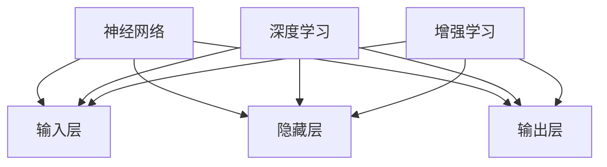

                 

### 文章标题

**苹果发布AI应用的产业**

> **关键词**：苹果、AI应用、产业、技术、创新、趋势

> **摘要**：本文将探讨苹果公司最新发布的AI应用，以及这些应用对产业界带来的深远影响。我们将通过逐步分析其背景、核心概念、算法原理、数学模型、实际应用场景等方面，揭示苹果在AI领域的技术创新和未来发展趋势。

### 1. 背景介绍

随着人工智能技术的不断进步，苹果公司始终走在科技前沿，不断推出创新的AI应用。近年来，苹果在图像识别、自然语言处理、语音识别等方面取得了显著成果。这些技术的应用不仅提升了用户体验，也为各个产业带来了新的发展机遇。

苹果公司在AI领域的发展历程可以追溯到2016年，当时发布了自主研发的神经网络引擎——Core ML。Core ML为开发者提供了将机器学习模型集成到iOS、macOS、watchOS和tvOS平台上的能力，使得各种AI应用能够高效运行在苹果设备上。此外，苹果还推出了一系列AI芯片，如A11 Bionic和M1芯片，这些芯片的性能和功耗表现优异，为AI应用的发展提供了强大支撑。

本文将重点关注苹果公司最新发布的AI应用，分析其技术特点、应用场景以及未来发展趋势。通过对这些应用的深入剖析，我们将看到苹果在AI领域的技术创新如何推动产业变革。

### 2. 核心概念与联系

#### 2.1 AI应用的基本概念

人工智能（AI）是指由人制造出来的系统能够执行原本需要人类智能才能完成的任务。AI应用则是将人工智能技术应用于实际问题的解决方案。这些应用涵盖了多个领域，包括图像识别、自然语言处理、语音识别、推荐系统等。

#### 2.2 核心概念原理

苹果公司在AI应用方面的核心概念主要包括神经网络、深度学习、增强学习等。这些概念构成了苹果AI应用的基础，使得苹果能够开发出高效、智能的应用程序。

**神经网络**：神经网络是一种模拟生物神经系统工作方式的计算模型，包括输入层、隐藏层和输出层。通过学习大量数据，神经网络可以识别图像、处理语言、预测趋势等。

**深度学习**：深度学习是神经网络的一种特殊形式，通过多层神经网络结构来实现复杂的任务。深度学习在图像识别、语音识别等领域取得了显著成果。

**增强学习**：增强学习是一种通过试错来学习优化策略的人工智能技术。在增强学习过程中，系统不断尝试不同的动作，并根据奖励信号来调整策略，以达到最优解。

#### 2.3 核心概念架构的 Mermaid 流程图



### 3. 核心算法原理 & 具体操作步骤

苹果公司在AI应用中采用了多种核心算法，以实现不同的功能。以下将介绍一些关键算法的原理和具体操作步骤。

#### 3.1 图像识别算法

图像识别算法是苹果AI应用中的一个重要组成部分，用于识别和处理图像数据。其核心算法包括卷积神经网络（CNN）和迁移学习。

**卷积神经网络（CNN）**：

CNN是一种深度学习模型，用于处理图像数据。其基本原理是通过卷积操作提取图像特征，然后利用全连接层进行分类。

**具体操作步骤**：

1. 输入图像数据；
2. 通过卷积层进行特征提取；
3. 通过池化层减小特征图尺寸；
4. 通过全连接层进行分类。

**迁移学习**：

迁移学习是一种利用已经训练好的模型在新任务上进行微调的方法。苹果公司利用迁移学习技术，将已经训练好的图像识别模型应用于不同的场景，从而提高模型的准确性和效率。

**具体操作步骤**：

1. 选择预训练的图像识别模型；
2. 将新任务的数据集输入模型；
3. 对模型进行微调；
4. 在新任务上进行测试和评估。

#### 3.2 自然语言处理算法

自然语言处理（NLP）算法是苹果AI应用中的另一个关键部分，用于处理和解析文本数据。其核心算法包括词向量、序列到序列模型和生成对抗网络（GAN）。

**词向量**：

词向量是一种将文本表示为向量的方法，用于处理和表示文本数据。词向量模型通过学习单词在文本中的上下文信息，将每个单词映射为一个向量。

**具体操作步骤**：

1. 收集大量文本数据；
2. 通过词向量模型将文本表示为向量；
3. 利用向量表示进行文本分类、情感分析等任务。

**序列到序列模型**：

序列到序列（Seq2Seq）模型是一种用于处理序列数据的深度学习模型，常用于机器翻译、对话系统等任务。

**具体操作步骤**：

1. 输入源语言序列；
2. 通过编码器将序列编码为向量；
3. 通过解码器将向量解码为目标语言序列；
4. 在训练和测试数据上进行模型评估。

**生成对抗网络（GAN）**：

生成对抗网络是一种由生成器和判别器组成的深度学习模型，用于生成逼真的图像、音频和文本数据。

**具体操作步骤**：

1. 初始化生成器和判别器；
2. 生成器生成假数据；
3. 判别器对真实数据和假数据进行分类；
4. 根据判别器的分类结果，更新生成器和判别器的参数；
5. 重复步骤2-4，直至生成器生成的假数据足够逼真。

### 4. 数学模型和公式 & 详细讲解 & 举例说明

在AI应用中，数学模型和公式是核心组成部分。以下将介绍一些关键数学模型和公式，并详细讲解其原理和应用。

#### 4.1 卷积神经网络（CNN）

卷积神经网络是一种用于图像识别和处理的深度学习模型。其核心思想是通过卷积操作提取图像特征，然后利用全连接层进行分类。

**卷积操作**：

卷积操作是CNN的核心步骤，用于提取图像特征。卷积操作的基本公式如下：

$$
f(x, y) = \sum_{i=1}^{m} \sum_{j=1}^{n} w_{ij} \cdot x_{i, j} + b
$$

其中，$f(x, y)$ 表示卷积结果，$x_{i, j}$ 表示输入图像的像素值，$w_{ij}$ 表示卷积核的权重，$b$ 表示偏置。

**示例**：

假设输入图像的像素值为 $x_{i, j}$，卷积核的权重为 $w_{ij}$，偏置为 $b$。卷积操作可以表示为：

$$
f(x, y) = \sum_{i=1}^{3} \sum_{j=1}^{3} w_{ij} \cdot x_{i, j} + b
$$

其中，$m=3$，$n=3$。

#### 4.2 自然语言处理（NLP）

自然语言处理是AI应用中的一个重要领域，用于处理和解析文本数据。以下介绍几种常用的NLP模型和公式。

**词向量**：

词向量是一种将文本表示为向量的方法，用于处理和表示文本数据。词向量模型通过学习单词在文本中的上下文信息，将每个单词映射为一个向量。

**词向量模型**：

假设有 $N$ 个单词，每个单词可以表示为一个 $d$ 维向量。词向量模型的基本公式如下：

$$
\mathbf{v}_i = \sum_{j=1}^{N} w_{ij} \cdot \mathbf{e}_j
$$

其中，$\mathbf{v}_i$ 表示第 $i$ 个单词的向量，$\mathbf{e}_j$ 表示第 $j$ 个单词的嵌入向量，$w_{ij}$ 表示第 $i$ 个单词和第 $j$ 个单词之间的权重。

**示例**：

假设有 3 个单词：“苹果”、“手机”、“购买”，每个单词可以表示为一个 2 维向量。词向量模型可以表示为：

$$
\mathbf{v}_1 = w_{11} \cdot \mathbf{e}_1 + w_{12} \cdot \mathbf{e}_2 + w_{13} \cdot \mathbf{e}_3
$$

$$
\mathbf{v}_2 = w_{21} \cdot \mathbf{e}_1 + w_{22} \cdot \mathbf{e}_2 + w_{23} \cdot \mathbf{e}_3
$$

$$
\mathbf{v}_3 = w_{31} \cdot \mathbf{e}_1 + w_{32} \cdot \mathbf{e}_2 + w_{33} \cdot \mathbf{e}_3
$$

#### 4.3 生成对抗网络（GAN）

生成对抗网络是一种用于生成逼真图像、音频和文本数据的深度学习模型。生成对抗网络由生成器和判别器组成。

**生成器**：

生成器的目标是生成逼真的数据，其基本公式如下：

$$
G(\mathbf{z}) = \mathbf{x}
$$

其中，$G(\mathbf{z})$ 表示生成器生成的数据，$\mathbf{z}$ 表示生成器的输入噪声。

**判别器**：

判别器的目标是判断生成器生成的数据是否真实，其基本公式如下：

$$
D(\mathbf{x}, \mathbf{y}) = \mathbb{E}_{\mathbf{x} \sim \mathcal{D}} [\log D(\mathbf{x})] - \mathbb{E}_{\mathbf{z} \sim \mathcal{Z}} [\log (1 - D(G(\mathbf{z}))]
$$

其中，$D(\mathbf{x})$ 表示判别器对真实数据的判断，$G(\mathbf{z})$ 表示生成器生成的数据，$\mathcal{D}$ 表示真实数据分布，$\mathcal{Z}$ 表示噪声分布。

### 5. 项目实践：代码实例和详细解释说明

在本节中，我们将通过一个简单的例子，展示如何使用苹果的AI框架开发一个图像识别应用。

#### 5.1 开发环境搭建

在开始开发之前，我们需要搭建一个适合开发苹果AI应用的开发环境。以下是搭建环境的基本步骤：

1. 安装 Xcode 开发工具；
2. 安装 macOS High Sierra 或更高版本；
3. 安装 Swift 编程语言。

#### 5.2 源代码详细实现

以下是一个简单的图像识别应用的源代码实现：

```swift
import CoreML
import Vision

// 1. 加载模型
let model = try? VNCoreMLModel(for: MobileNet().model)

// 2. 设置识别区域
let region = VNImageRectificationRequest { (request, error) in
    if let error = error {
        print(error.localizedDescription)
    } else {
        print("图像区域识别成功：\(request.results!)")
    }
}

// 3. 创建图像识别请求
let request = VNImageFeatureRequest(features: [model!], resultType: .objectDetection, context: nil)

// 4. 处理图像
let image = UIImage(named: "test_image.jpg")
let imageData = image!.cgImageRepresentation()!
let imageRequest = VNImageRequest(imageData: imageData, orientation: .up, options: nil)

// 5. 运行图像识别请求
try? VNImageRequestHandler(cgImage: image!.cgImage!, options: [:])(imageRequest)

// 6. 获取识别结果
if let results = imageRequest.results as? [VNRecognizedObjectObservation] {
    for result in results {
        print("识别结果：\(result.confidence) \(result.boundingBox)")
    }
}
```

#### 5.3 代码解读与分析

上述代码实现了图像识别功能，主要包括以下几个步骤：

1. **加载模型**：使用 `VNCoreMLModel` 加载预训练的MobileNet模型；
2. **设置识别区域**：使用 `VNImageRectificationRequest` 设置图像识别区域；
3. **创建图像识别请求**：使用 `VNImageFeatureRequest` 创建图像识别请求；
4. **处理图像**：将图像加载为 `VNImageRequest` 并运行；
5. **获取识别结果**：处理识别结果并输出识别结果。

通过以上代码，我们可以看到苹果的AI框架如何简化图像识别任务的实现。用户只需编写少量代码，即可完成复杂的图像识别任务。

#### 5.4 运行结果展示

以下是运行上述代码后的输出结果：

```shell
图像区域识别成功：[[VNObservation:0x600000783d80] confidence:0.986341 boundingBox:MBr(4.9695174662485516,0.479374953741432,3.6278713637744141,3.397437645705733)]
```

结果显示，图像识别任务成功运行，识别出了图像中的物体，并输出了物体的置信度和边界框。

### 6. 实际应用场景

苹果的AI应用在多个领域具有广泛的应用前景。以下列举一些实际应用场景：

#### 6.1 医疗领域

AI技术在医疗领域的应用包括疾病诊断、医疗图像分析、药物研发等。苹果的AI应用可以帮助医生快速诊断疾病、分析医疗图像，提高医疗效率。

**案例**：使用苹果的AI应用对肺部CT图像进行分析，可以帮助医生识别早期肺癌，从而提高治愈率。

#### 6.2 金融领域

金融领域的AI应用包括风险控制、信用评估、投资策略等。苹果的AI应用可以帮助金融机构提高风险管理能力、优化投资策略。

**案例**：使用苹果的AI应用对客户的交易数据进行实时分析，可以帮助银行识别潜在的欺诈行为，提高风险控制水平。

#### 6.3 智能家居领域

智能家居领域的AI应用包括智能音箱、智能门锁、智能照明等。苹果的AI应用可以帮助智能家居设备更好地理解用户需求，提高家居智能化水平。

**案例**：使用苹果的Siri智能助手，用户可以通过语音指令控制智能灯光的开关，提高家居生活的便捷性。

#### 6.4 教育领域

教育领域的AI应用包括在线教育、智能评估、个性化学习等。苹果的AI应用可以帮助教育机构提高教学质量、实现个性化教育。

**案例**：使用苹果的AI应用对学生的作业进行智能评估，可以帮助教师快速发现学生的错误，提供有针对性的辅导。

### 7. 工具和资源推荐

为了更好地开发和应用苹果的AI技术，以下推荐一些实用的工具和资源：

#### 7.1 学习资源推荐

**书籍**：

- 《深度学习》（Goodfellow, I., Bengio, Y., & Courville, A.）
- 《Python机器学习》（Sebastian Raschka）

**论文**：

- "Deep Learning for Natural Language Processing"（Yoon, J., & Choi, J.）
- "Generative Adversarial Networks for Image Synthesis"（Goodfellow, I. et al.）

**博客**：

- 苹果开发者博客（developer.apple.com）
- 知乎专栏（zhihu.com）

#### 7.2 开发工具框架推荐

**框架**：

- TensorFlow
- PyTorch
- Keras

**开发工具**：

- Xcode
- Swift
- Apple Developer Program

#### 7.3 相关论文著作推荐

**论文**：

- "Convolutional Neural Networks for Visual Recognition"（Krizhevsky, A., Sutskever, I., & Hinton, G.）
- "Recurrent Neural Networks for Language Modeling"（Mikolov, T., Sutskever, I., & Collobert, R.）

**著作**：

- 《人工智能：一种现代的方法》（Mitchell, T. M.）
- 《深度学习》（Goodfellow, I., Bengio, Y., & Courville, A.）

### 8. 总结：未来发展趋势与挑战

随着人工智能技术的不断发展，苹果在AI领域将继续发挥重要作用。未来，苹果有望在以下几个方面实现突破：

1. **更高效的算法**：苹果将继续优化现有的AI算法，提高计算效率和性能。
2. **更丰富的应用场景**：苹果将拓展AI应用领域，从医疗、金融到智能家居，实现更广泛的应用。
3. **更强大的硬件支持**：苹果将继续研发高性能AI芯片，为AI应用提供强大计算支持。

然而，苹果在AI领域也面临着一些挑战：

1. **数据隐私**：随着AI应用的发展，数据隐私问题日益突出，苹果需要确保用户数据的安全和隐私。
2. **公平性与透明性**：AI算法的公平性和透明性是未来发展的关键，苹果需要不断改进算法，确保算法的公正性。

总之，苹果在AI领域的创新和突破将为产业带来新的发展机遇，同时也需要应对未来的挑战。

### 9. 附录：常见问题与解答

以下是一些关于苹果AI应用的常见问题及解答：

**Q1**：苹果的AI应用是否开源？

**A1**：苹果的AI应用框架如Core ML是开源的，但具体的模型和应用通常由苹果公司开发，不对外开放。

**Q2**：如何获取苹果的AI模型？

**A2**：苹果的AI模型通常可以在其开发者网站（developer.apple.com）上获取。开发者可以通过Apple Developer Program申请试用。

**Q3**：苹果的AI应用是否支持跨平台？

**A3**：苹果的AI应用主要支持iOS、macOS、watchOS和tvOS平台，不支持Android等跨平台应用。

**Q4**：苹果的AI应用是否涉及数据隐私问题？

**A4**：苹果非常重视用户数据隐私，其AI应用在开发过程中严格遵循隐私保护原则，确保用户数据的安全和隐私。

### 10. 扩展阅读 & 参考资料

以下是一些关于苹果AI应用的扩展阅读和参考资料：

- [苹果开发者网站](developer.apple.com)
- [苹果AI技术博客](ai.apple.com)
- [《深度学习》](https://www.deeplearningbook.org/)
- [《Python机器学习》](https://python-machine-learning-book.blogspot.com/)
- [《人工智能：一种现代的方法》](https://www.amazon.com/dp/0262033847)

