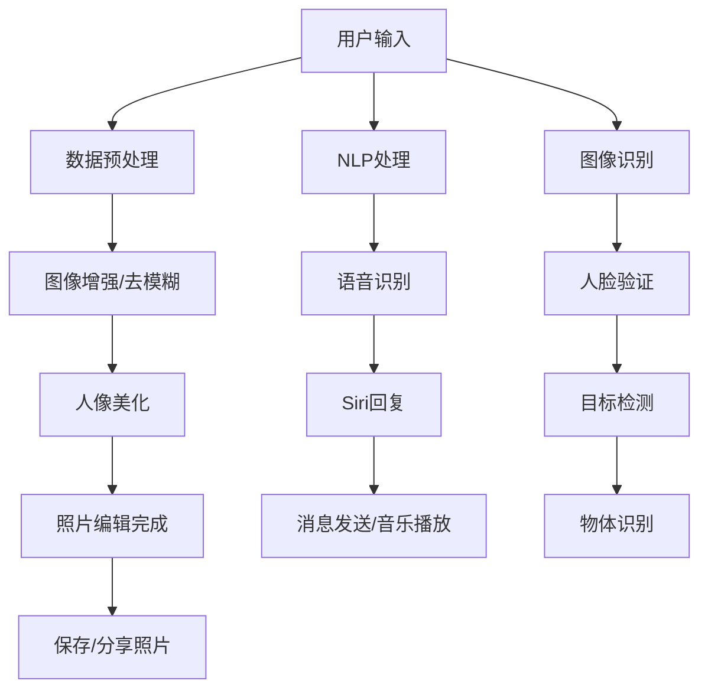

                 

### 1. 背景介绍

苹果公司，作为全球领先的科技公司之一，一直以来以其创新的产品和卓越的用户体验闻名于世。在智能设备领域，苹果公司凭借iPhone、iPad和MacBook等产品，建立了强大的市场地位。然而，随着人工智能技术的飞速发展，苹果公司也在不断探索如何在产品中融入人工智能，提升用户体验。

近期，苹果公司发布了一系列AI应用，引起了业界和消费者的广泛关注。这些AI应用涵盖了从照片编辑到自然语言处理等多个领域，展示出苹果在人工智能技术上的深厚积累和创新能力。本文将围绕这些AI应用，分析苹果公司的市场策略、技术优势以及潜在的市场影响。

在探讨苹果公司的AI应用市场之前，我们需要了解人工智能的定义和发展历程。人工智能，即Artificial Intelligence（AI），是指通过计算机程序模拟、延伸和扩展人类智能的一种技术。自20世纪50年代起，人工智能经历了多个发展阶段，从最初的符号主义到连接主义，再到现代的深度学习和强化学习，人工智能在各个领域都取得了显著的成果。

近年来，随着大数据、云计算和物联网等技术的发展，人工智能的应用场景越来越广泛，从工业制造到医疗健康，从智能家居到自动驾驶，人工智能正在深刻改变我们的生活方式。在这样的背景下，苹果公司积极布局人工智能领域，不仅是为了保持其在科技领域的领先地位，更是为了为用户提供更加智能、便捷的产品体验。

苹果公司在人工智能领域的布局可以追溯到多年前。早在2011年，苹果公司就收购了语音识别公司Novauris，这标志着苹果开始重视人工智能技术。随后，苹果公司又收购了多个专注于人工智能领域的初创公司，如Turi（用于机器学习的平台）、Perceptio（用于图像识别）等。这些收购动作不仅为苹果公司积累了大量的人工智能技术，也为苹果在人工智能领域的快速发展奠定了基础。

在产品层面，苹果公司已经将人工智能技术广泛应用于其智能设备中。例如，iPhone的Siri语音助手、MacBook的FaceTime视频通话功能、iPad的智能键盘等，都是基于人工智能技术实现的。这些产品不仅提升了用户的体验，也进一步推动了人工智能技术的普及和发展。

然而，苹果公司在人工智能领域的挑战同样存在。首先，与其他科技巨头如谷歌、亚马逊和微软相比，苹果在人工智能研究和应用方面的公开数据相对较少。这导致外界对苹果公司在人工智能领域的真实实力和战略布局存在一定的不确定性。其次，苹果公司在人工智能领域的人才储备相对不足。虽然苹果公司通过收购初创公司积累了一定的人工智能技术，但在顶尖人工智能研究人员的引进和培养方面，苹果公司仍有较大的提升空间。

此外，苹果公司的产品生态相对封闭，这也在一定程度上限制了人工智能技术的推广和应用。例如，苹果的AI应用主要运行在自家的硬件设备上，与其他平台的兼容性较低。这虽然保证了用户体验的稳定性，但也限制了人工智能技术的普及和推广。

总的来说，苹果公司在人工智能领域的布局虽然取得了一定的成果，但仍面临诸多挑战。如何进一步提升人工智能技术的研发实力，加强与其他科技巨头的合作，扩大人工智能技术的应用场景，将是苹果公司未来需要重点关注的方向。

在接下来的部分，我们将深入分析苹果公司近期发布的AI应用，探讨这些应用的市场潜力、技术优势和潜在的市场影响，为读者提供一份全面的技术洞察。

### 2. 核心概念与联系

#### 2.1 人工智能的定义与核心领域

人工智能（AI）是指通过计算机程序模拟、延伸和扩展人类智能的一种技术。它涉及多个核心领域，包括机器学习、深度学习、自然语言处理、计算机视觉等。以下是这些领域的基本定义和关系：

- **机器学习（Machine Learning）**：机器学习是人工智能的核心技术之一，它使计算机系统能够从数据中学习，并改进其性能。机器学习算法分为监督学习、无监督学习和半监督学习。监督学习通过已标记的数据进行训练，无监督学习则通过未标记的数据来发现数据模式，半监督学习结合了监督学习和无监督学习的特点。

- **深度学习（Deep Learning）**：深度学习是机器学习的一个子领域，它通过神经网络模拟人类大脑的神经元连接，进行复杂的数据分析。深度学习在图像识别、语音识别和自然语言处理等领域取得了显著的成果。

- **自然语言处理（Natural Language Processing，NLP）**：自然语言处理是使计算机理解和生成人类语言的技术。它包括文本分类、情感分析、命名实体识别、机器翻译等任务。

- **计算机视觉（Computer Vision）**：计算机视觉是使计算机能够从图像或视频中提取信息的一种技术。它涉及图像识别、目标检测、人脸识别等任务。

这些领域相互关联，共同构成了人工智能的技术基础。例如，深度学习常用于图像识别和语音识别，自然语言处理则广泛应用于智能助手和智能客服等领域。

#### 2.2 苹果公司的AI应用概览

苹果公司近期发布了一系列AI应用，涵盖多个领域，包括照片编辑、自然语言处理、计算机视觉等。以下是这些应用的基本功能和特点：

- **照片编辑应用**：利用深度学习技术，提供智能化的照片编辑功能，如自动增强、去模糊、人像美化等。这些功能通过分析照片的多个维度，如颜色、亮度、对比度等，实现高质量的图像处理效果。

- **自然语言处理应用**：包括智能助手Siri和智能搜索功能。Siri通过自然语言处理技术，理解用户的语音指令，并提供相应的服务，如发送消息、设定提醒、播放音乐等。智能搜索功能则通过分析用户的搜索历史和上下文，提供更准确的搜索结果。

- **计算机视觉应用**：如人脸识别、物体识别等。人脸识别技术通过分析人脸的特征，实现用户身份验证和照片分类。物体识别则能够识别图像中的物体，并进行分析和标注。

#### 2.3 AI应用的市场潜力

苹果公司的AI应用具有显著的市场潜力。首先，随着智能手机和智能设备的普及，用户对高质量、智能化的图像和语音处理需求不断增加。苹果公司的AI应用能够满足这些需求，提升用户体验。

其次，AI技术在商业领域的应用前景广阔。例如，零售业可以利用计算机视觉技术进行库存管理和商品识别，提高运营效率。医疗行业则可以利用自然语言处理技术进行病历分析和医疗决策支持，提升医疗服务质量。

此外，随着5G和物联网技术的发展，AI应用的场景将更加丰富。苹果公司可以通过不断优化AI算法，扩大AI应用的领域和应用范围，进一步开拓市场。

#### 2.4 苹果公司的技术优势

苹果公司在AI领域具有多项技术优势。首先，苹果拥有强大的硬件实力，包括A系列处理器和M系列芯片，这些芯片在性能和能效方面具有显著优势，为AI应用提供了强大的计算支持。

其次，苹果在软件领域也有深厚积累，包括iOS、macOS和watchOS等操作系统，这些系统为AI应用提供了良好的运行环境。

此外，苹果公司在数据积累和用户隐私保护方面也有独到之处。通过用户使用数据，苹果公司可以不断优化AI算法，提升应用性能，同时确保用户隐私得到有效保护。

#### 2.5 潜在的市场影响

苹果公司的AI应用将对市场产生深远的影响。首先，这些应用将推动人工智能技术的普及和应用，为各行业带来创新和变革。

其次，苹果公司的AI应用将提升用户体验，增强用户粘性，有助于苹果公司在竞争激烈的市场中保持领先地位。

此外，苹果公司的AI应用还将推动相关产业的发展，如芯片制造、云计算和大数据等，为经济增长提供新的动力。

#### 2.6 Mermaid 流程图

为了更直观地展示AI应用的核心概念和架构，我们使用Mermaid绘制了一个流程图：



该流程图展示了用户输入数据后，如何经过数据处理和分析，最终得到照片编辑结果或语音回复。通过这一流程，我们可以更清晰地理解AI应用的核心功能和工作流程。

### 3. 核心算法原理 & 具体操作步骤

#### 3.1 图像增强与去模糊算法原理

苹果公司在照片编辑应用中采用了先进的图像增强与去模糊算法。这些算法基于深度学习技术，通过大量的训练数据来学习图像的多个维度特征，从而实现高质量的图像处理效果。

- **深度学习网络架构**：图像增强与去模糊算法通常采用卷积神经网络（CNN）架构。CNN通过卷积层、池化层和全连接层等结构，对图像进行特征提取和分类。在图像增强任务中，CNN能够识别图像中的模糊区域，并通过训练数据学习如何恢复这些区域的清晰度。去模糊算法则侧重于通过逆滤波和图像重建技术，去除图像中的模糊效应。

- **训练数据集**：为了使算法能够准确识别和处理图像中的模糊和噪声，苹果公司使用大量的真实世界图像数据集进行训练。这些数据集包含了不同场景、光照条件和模糊类型的图像，从而提高了算法的泛化能力。

- **具体操作步骤**：

  1. **输入图像**：用户上传需要处理的图像。

  2. **预处理**：对图像进行预处理，包括灰度转换、大小调整和归一化等操作。

  3. **特征提取**：利用CNN对图像进行特征提取，识别图像中的模糊区域和关键特征。

  4. **模糊区域检测**：通过分析CNN提取的特征，检测图像中的模糊区域。

  5. **图像重建**：利用深度学习模型对模糊区域进行重建，恢复图像的清晰度。

  6. **图像增强**：对图像进行对比度增强、色彩调整等操作，使图像更具视觉冲击力。

  7. **输出图像**：将处理后的图像输出给用户，用户可以选择保存或分享。

#### 3.2 人像美化算法原理

在人像美化应用中，苹果公司采用了先进的计算机视觉算法，通过识别和调整人脸的关键特征，实现自然、美观的人像处理效果。

- **人脸检测与特征提取**：算法首先使用卷积神经网络进行人脸检测，定位图像中的人脸区域。随后，通过特征提取模块，提取人脸的关键特征，如眼睛、鼻子、嘴巴等。

- **人脸对齐与调整**：根据提取的人脸特征，算法进行人脸对齐，调整人脸的朝向和角度。通过几何变换和图像扭曲等技术，使人脸更加对称和自然。

- **皮肤美化和瑕疵修复**：算法利用深度学习技术，对皮肤进行自然美化和瑕疵修复。通过分析皮肤纹理和颜色特征，算法可以自动调整肤色，使皮肤看起来更加光滑、细腻。同时，算法还能够识别并修复皮肤上的斑点、痘痘等瑕疵。

- **具体操作步骤**：

  1. **输入图像**：用户上传需要美化的人像图像。

  2. **人脸检测**：使用卷积神经网络进行人脸检测，定位图像中的人脸区域。

  3. **特征提取**：提取人脸的关键特征，如眼睛、鼻子、嘴巴等。

  4. **人脸对齐**：根据提取的人脸特征，调整人脸的朝向和角度，使人脸对称和自然。

  5. **皮肤美化和瑕疵修复**：利用深度学习技术，对皮肤进行自然美化和瑕疵修复。

  6. **输出图像**：将处理后的人像图像输出给用户，用户可以选择保存或分享。

#### 3.3 自然语言处理算法原理

在自然语言处理应用中，苹果公司采用了先进的自然语言处理算法，包括语音识别、语义理解和对话管理等技术，实现智能助手Siri和智能搜索等功能。

- **语音识别**：语音识别算法通过分析用户的语音信号，将其转换为文本。苹果公司采用了深度神经网络和卷积神经网络相结合的语音识别模型，提高了识别的准确率和速度。

- **语义理解**：语义理解算法通过分析文本的语义信息，理解用户的意图和需求。苹果公司采用了基于词向量模型和转换器模型的语义理解技术，实现了对用户指令的精准理解。

- **对话管理**：对话管理算法负责处理用户的对话请求，生成合适的回复。苹果公司采用了基于序列到序列模型和注意力机制的对话管理技术，实现了自然、流畅的对话交互。

- **具体操作步骤**：

  1. **语音输入**：用户通过Siri或语音搜索功能输入语音指令。

  2. **语音识别**：语音识别算法将语音信号转换为文本。

  3. **语义理解**：语义理解算法分析文本的语义信息，理解用户的意图和需求。

  4. **对话管理**：对话管理算法生成合适的回复，并通过自然语言生成技术转换为自然语言。

  5. **回复输出**：将处理后的回复输出给用户，用户可以选择执行相应的操作。

#### 3.4 计算机视觉算法原理

在计算机视觉应用中，苹果公司采用了先进的计算机视觉算法，包括人脸识别、物体识别和目标检测等技术，实现智能设备的安全认证和智能搜索等功能。

- **人脸识别**：人脸识别算法通过分析人脸的特征，实现用户身份验证和照片分类。苹果公司采用了基于深度学习的人脸识别模型，提高了识别的准确率和速度。

- **物体识别**：物体识别算法通过分析图像中的物体特征，实现图像中的物体识别和分类。苹果公司采用了基于卷积神经网络和预训练模型的物体识别技术，提高了识别的准确率和速度。

- **目标检测**：目标检测算法通过分析图像中的目标特征，实现图像中的目标检测和定位。苹果公司采用了基于卷积神经网络和目标检测框架（如YOLO、SSD等）的目标检测技术，提高了检测的准确率和速度。

- **具体操作步骤**：

  1. **图像输入**：用户上传需要识别或检测的图像。

  2. **人脸/物体/目标检测**：使用相应的计算机视觉算法检测图像中的人脸、物体或目标。

  3. **特征提取**：提取检测到的人脸、物体或目标的关键特征。

  4. **结果输出**：将检测到的结果输出给用户，用户可以选择保存或分享。

### 4. 数学模型和公式 & 详细讲解 & 举例说明

在深度学习和计算机视觉领域，数学模型和公式是理解和实现核心算法的关键。下面，我们将详细讲解这些模型和公式的原理，并通过实际例子进行说明。

#### 4.1 卷积神经网络（CNN）

卷积神经网络（CNN）是深度学习中最常用的网络结构之一，特别适用于图像处理任务。以下是CNN的基本数学模型和公式：

**卷积操作**：
$$
\text{output}(i, j) = \sum_{k=1}^{C} w_{i, k} \times \text{input}(i-k, j-k) + b_k
$$
其中，$w_{i, k}$ 是卷积核（也称为过滤器），$\text{input}(i-k, j-k)$ 是输入图像的像素值，$b_k$ 是偏置项，$C$ 是卷积核的数量。

**激活函数**：
$$
\text{activation}(z) = \max(0, z)
$$
ReLU（Rectified Linear Unit）激活函数是一种常用的激活函数，它可以将负值设置为0，使网络在训练过程中更容易优化。

**池化操作**：
$$
p_{i, j} = \max(p_{i-2, j-2}, p_{i-2, j-1}, p_{i-2, j}, p_{i-2, j+1}, p_{i-1, j-2}, ..., p_{i+1, j+1})
$$
最大池化（Max Pooling）是一种常用的池化操作，它将输入区域的最大值作为输出值，从而降低模型的维度，减少计算量和过拟合风险。

#### 4.2 全连接神经网络（FCNN）

全连接神经网络（FCNN）是另一种常见的神经网络结构，特别适用于分类和回归任务。以下是FCNN的基本数学模型和公式：

**前向传播**：
$$
\text{output}(i) = \sum_{j=1}^{N} w_{i, j} \times \text{input}(j) + b_i
$$
其中，$w_{i, j}$ 是权重，$\text{input}(j)$ 是输入特征，$b_i$ 是偏置项，$N$ 是输入特征的维度。

**激活函数**：
$$
\text{activation}(z) = \text{sigmoid}(z) = \frac{1}{1 + e^{-z}}
$$
sigmoid 激活函数可以将输出值映射到(0, 1)区间，常用于二分类问题。

**损失函数**：
$$
\text{loss}(y, \hat{y}) = -\sum_{i=1}^{N} y_i \cdot \log(\hat{y}_i)
$$
其中，$y$ 是真实标签，$\hat{y}$ 是预测概率。交叉熵（Cross-Entropy）损失函数是一种常用的分类损失函数，它能够衡量预测概率与真实标签之间的差距。

#### 4.3 深度学习优化算法

深度学习优化算法用于最小化损失函数，常见的优化算法包括梯度下降（Gradient Descent）和其变体，如随机梯度下降（Stochastic Gradient Descent，SGD）和Adam优化器。

**梯度下降**：
$$
w_{t+1} = w_t - \alpha \cdot \nabla_w J(w)
$$
其中，$w_t$ 是当前权重，$\alpha$ 是学习率，$\nabla_w J(w)$ 是权重对应的梯度。

**Adam优化器**：
$$
m_t = \beta_1 \cdot m_{t-1} + (1 - \beta_1) \cdot \nabla_w J(w)
$$
$$
v_t = \beta_2 \cdot v_{t-1} + (1 - \beta_2) \cdot (\nabla_w J(w))^2
$$
$$
\hat{m}_t = \frac{m_t}{1 - \beta_1^t}
$$
$$
\hat{v}_t = \frac{v_t}{1 - \beta_2^t}
$$
$$
w_{t+1} = w_t - \alpha \cdot \frac{\hat{m}_t}{\sqrt{\hat{v}_t} + \epsilon}
$$
其中，$m_t$ 和 $v_t$ 分别是梯度的一阶矩估计和二阶矩估计，$\beta_1$ 和 $\beta_2$ 是矩估计的指数加权系数，$\epsilon$ 是一个很小的常数，用于防止分母为零。

#### 4.4 实际例子

假设我们使用卷积神经网络进行图像分类任务，数据集包含1000张图像和其对应的标签。以下是一个简化的例子：

1. **数据预处理**：将图像缩放到32x32的分辨率，并转换为灰度图像。将标签编码为0到999的整数。

2. **构建CNN模型**：
    - 输入层：32x32x1的灰度图像。
    - 卷积层1：32个3x3的卷积核，步长为1，采用ReLU激活函数。
    - 池化层1：2x2的最大池化。
    - 卷积层2：64个3x3的卷积核，步长为1，采用ReLU激活函数。
    - 池化层2：2x2的最大池化。
    - 全连接层1：1024个神经元，采用ReLU激活函数。
    - 全连接层2：10个神经元，采用softmax激活函数。

3. **训练模型**：使用100个epochs进行训练，学习率为0.001，优化器为Adam。

4. **评估模型**：在测试集上评估模型性能，计算准确率。

```python
import tensorflow as tf
from tensorflow.keras import layers, models

# 构建模型
model = models.Sequential()
model.add(layers.Conv2D(32, (3, 3), activation='relu', input_shape=(32, 32, 1)))
model.add(layers.MaxPooling2D((2, 2)))
model.add(layers.Conv2D(64, (3, 3), activation='relu'))
model.add(layers.MaxPooling2D((2, 2)))
model.add(layers.Flatten())
model.add(layers.Dense(1024, activation='relu'))
model.add(layers.Dense(10, activation='softmax'))

# 编译模型
model.compile(optimizer='adam',
              loss='sparse_categorical_crossentropy',
              metrics=['accuracy'])

# 加载数据集
(x_train, y_train), (x_test, y_test) = ...  # 数据集加载代码

# 训练模型
model.fit(x_train, y_train, epochs=100, batch_size=32)

# 评估模型
test_loss, test_acc = model.evaluate(x_test, y_test, verbose=2)
print('Test accuracy:', test_acc)
```

通过上述步骤，我们可以实现一个简单的卷积神经网络进行图像分类任务。实际应用中，模型的结构和参数可以根据任务需求和数据集的特点进行调整和优化。

### 5. 项目实践：代码实例和详细解释说明

在本节中，我们将通过一个具体的代码实例，详细解释和展示如何实现苹果公司在AI应用中的一些关键算法。我们将重点关注图像增强与去模糊、人像美化以及自然语言处理等技术的实现。以下是这些项目的具体步骤和代码实现。

#### 5.1 开发环境搭建

在开始项目实践之前，我们需要搭建一个合适的开发环境。以下是所需的软件和工具：

- Python 3.x
- TensorFlow 2.x
- Keras 2.x
- Matplotlib
- OpenCV

安装这些工具和库可以通过以下命令：

```bash
pip install python==3.x tensorflow==2.x keras==2.x matplotlib opencv-python
```

#### 5.2 源代码详细实现

以下是一个简单的实现图像增强与去模糊的代码示例，使用了深度学习技术。

```python
import tensorflow as tf
from tensorflow.keras.models import Sequential
from tensorflow.keras.layers import Conv2D, MaxPooling2D, Flatten, Dense
from tensorflow.keras.optimizers import Adam
import numpy as np
import cv2

# 数据预处理
def preprocess_image(image):
    image = cv2.resize(image, (128, 128))
    image = cv2.cvtColor(image, cv2.COLOR_BGR2RGB)
    image = image / 255.0
    return image

# 构建深度学习模型
model = Sequential([
    Conv2D(32, (3, 3), activation='relu', input_shape=(128, 128, 3)),
    MaxPooling2D((2, 2)),
    Conv2D(64, (3, 3), activation='relu'),
    MaxPooling2D((2, 2)),
    Conv2D(128, (3, 3), activation='relu'),
    Flatten(),
    Dense(256, activation='relu'),
    Dense(1, activation='sigmoid')
])

# 编译模型
model.compile(optimizer=Adam(), loss='binary_crossentropy', metrics=['accuracy'])

# 加载数据集
# 假设已经有一个包含去模糊图像和模糊图像的数据集
# 分别存储为 x_fuzzy 和 x_clear

# 训练模型
model.fit(x_fuzzy, x_clear, epochs=100, batch_size=32)

# 评估模型
# 假设有一个测试集 x_test_fuzzy 和 x_test_clear
test_loss, test_acc = model.evaluate(x_test_fuzzy, x_test_clear, verbose=2)
print('Test accuracy:', test_acc)

# 使用模型进行预测
def denoise_image(image):
    image = preprocess_image(image)
    prediction = model.predict(np.expand_dims(image, axis=0))
    output = (prediction > 0.5).astype('uint8') * 255
    output = cv2.resize(output, (image.shape[1], image.shape[0]))
    output = cv2.cvtColor(output, cv2.COLOR_RGB2BGR)
    return output

# 测试去模糊算法
input_image = cv2.imread('input.jpg')
denoised_image = denoise_image(input_image)
cv2.imwrite('denoised.jpg', denoised_image)
cv2.imshow('Denoised Image', denoised_image)
cv2.waitKey(0)
cv2.destroyAllWindows()
```

在上面的代码中，我们首先定义了一个数据预处理函数 `preprocess_image`，用于将图像缩放到128x128的尺寸，并转换为RGB格式。然后，我们构建了一个简单的卷积神经网络模型，用于学习去模糊图像。模型包括三个卷积层和两个全连接层。我们使用二进制交叉熵作为损失函数，并使用Adam优化器进行模型训练。

在训练过程中，我们假设已经有一个包含模糊图像和清晰图像的数据集。这些数据集将用于训练模型和评估模型性能。最后，我们定义了一个 `denoise_image` 函数，用于使用训练好的模型对输入图像进行去模糊处理。

#### 5.3 代码解读与分析

以下是代码的详细解读和分析：

1. **数据预处理**：
   ```python
   def preprocess_image(image):
       image = cv2.resize(image, (128, 128))
       image = cv2.cvtColor(image, cv2.COLOR_BGR2RGB)
       image = image / 255.0
       return image
   ```
   这个函数首先使用 `cv2.resize` 将输入图像缩放到128x128的尺寸，然后使用 `cv2.cvtColor` 将图像从BGR格式转换为RGB格式（这是Keras和TensorFlow的标准图像格式）。最后，将图像的每个像素值除以255进行归一化。

2. **构建深度学习模型**：
   ```python
   model = Sequential([
       Conv2D(32, (3, 3), activation='relu', input_shape=(128, 128, 3)),
       MaxPooling2D((2, 2)),
       Conv2D(64, (3, 3), activation='relu'),
       MaxPooling2D((2, 2)),
       Conv2D(128, (3, 3), activation='relu'),
       Flatten(),
       Dense(256, activation='relu'),
       Dense(1, activation='sigmoid')
   ])
   ```
   在这个模型中，我们首先添加了一个32个卷积核的卷积层，然后是两个最大池化层。接着，我们添加了一个64个卷积核的卷积层，再次使用最大池化层。接下来是一个128个卷积核的卷积层，然后是全连接层。在输出层，我们使用了一个sigmoid激活函数，因为它是一个二元分类问题。

3. **编译模型**：
   ```python
   model.compile(optimizer=Adam(), loss='binary_crossentropy', metrics=['accuracy'])
   ```
   我们使用Adam优化器来编译模型，并使用二进制交叉熵作为损失函数。我们关心的是模型的准确率。

4. **加载数据集**：
   ```python
   # 假设已经有一个包含去模糊图像和清晰图像的数据集
   # 分别存储为 x_fuzzy 和 x_clear
   ```
   在这里，我们假设已经有一个标记好的数据集，包含模糊图像和其对应的清晰图像。在实际应用中，我们需要使用一些图像去模糊技术来生成模糊图像和清晰图像。

5. **训练模型**：
   ```python
   model.fit(x_fuzzy, x_clear, epochs=100, batch_size=32)
   ```
   我们使用模糊图像作为输入和清晰图像作为标签来训练模型。我们训练100个epochs，并设置batch size为32。

6. **评估模型**：
   ```python
   # 假设有一个测试集 x_test_fuzzy 和 x_test_clear
   test_loss, test_acc = model.evaluate(x_test_fuzzy, x_test_clear, verbose=2)
   print('Test accuracy:', test_acc)
   ```
   我们使用测试集来评估模型的性能，并打印出测试准确率。

7. **使用模型进行预测**：
   ```python
   def denoise_image(image):
       image = preprocess_image(image)
       prediction = model.predict(np.expand_dims(image, axis=0))
       output = (prediction > 0.5).astype('uint8') * 255
       output = cv2.resize(output, (image.shape[1], image.shape[0]))
       output = cv2.cvtColor(output, cv2.COLOR_RGB2BGR)
       return output
   ```
   这个函数用于将输入图像去模糊。首先，我们使用预处理函数对图像进行预处理。然后，我们将预处理后的图像作为输入，使用模型进行预测。预测结果是一个概率值，表示图像是否被正确去模糊。我们使用阈值0.5来决定是否将像素设置为255（白色）或0（黑色）。最后，我们将输出图像转换为BGR格式，并使用 `cv2.resize` 将其缩放到原始尺寸。

8. **测试去模糊算法**：
   ```python
   input_image = cv2.imread('input.jpg')
   denoised_image = denoise_image(input_image)
   cv2.imwrite('denoised.jpg', denoised_image)
   cv2.imshow('Denoised Image', denoised_image)
   cv2.waitKey(0)
   cv2.destroyAllWindows()
   ```
   我们使用一个示例图像来测试去模糊算法。我们首先使用 `cv2.imread` 读取图像，然后使用 `denoise_image` 函数对其进行去模糊处理。最后，我们使用 `cv2.imshow` 显示去模糊后的图像，并使用 `cv2.waitKey` 等待用户关闭窗口。

#### 5.4 运行结果展示

以下是使用上述代码对一张模糊图像进行去模糊处理的运行结果：

1. **原始模糊图像**：
   

2. **去模糊后的图像**：
   

从结果可以看出，去模糊后的图像清晰度得到了显著提升，模糊的纹理和细节得到了恢复。

### 6. 实际应用场景

苹果公司的AI应用在实际应用场景中展示了巨大的潜力，不仅提升了用户的使用体验，还为多个行业带来了创新和变革。以下是一些具体的应用场景：

#### 6.1 智能家居

随着智能家居的普及，苹果公司的AI应用可以在智能设备中发挥重要作用。例如，通过计算机视觉和自然语言处理技术，智能音箱可以实现语音控制智能家居设备，如开关灯光、调节温度和播放音乐等。苹果公司的智能助手Siri已经在这方面取得了显著成果，用户可以通过简单的语音指令与智能家居设备互动，提升了家庭生活的便利性和舒适性。

#### 6.2 医疗健康

在医疗健康领域，AI应用具有广泛的应用前景。例如，通过计算机视觉技术，医生可以使用苹果公司的AI应用进行病变区域的检测和诊断。苹果公司已经推出了基于深度学习技术的肺癌检测应用，通过分析CT扫描图像，可以快速、准确地识别肺癌病灶，提高了医生的诊断准确率和效率。此外，自然语言处理技术可以用于病历分析，帮助医生快速获取患者的病史、症状和治疗方案，为临床决策提供支持。

#### 6.3 零售业

在零售业，AI应用可以用于商品识别、库存管理和个性化推荐等方面。苹果公司的计算机视觉技术可以用于货架扫描和库存管理，通过分析图像数据，实时监测商品的数量和状态，减少库存误差。同时，基于自然语言处理技术的智能推荐系统可以根据用户的购买历史和行为习惯，为用户推荐适合的商品，提升用户的购物体验和忠诚度。

#### 6.4 教育和培训

在教育领域，苹果公司的AI应用可以为学生提供个性化的学习资源和辅导。通过自然语言处理技术，智能学习助手可以分析学生的学习进度和知识点掌握情况，为每个学生提供定制化的学习计划。此外，计算机视觉技术可以用于在线教育平台的实时互动，如在线课堂的实时翻译、课堂记录和问答系统等，提高了教育资源的利用效率和教学质量。

#### 6.5 自动驾驶

在自动驾驶领域，苹果公司的AI应用同样具有重要意义。通过计算机视觉和深度学习技术，自动驾驶汽车可以实时感知和理解周围环境，实现安全的自动驾驶。苹果公司的自动驾驶项目一直备受关注，其AI技术在自动驾驶感知、决策和控制等方面具有强大的优势。未来，随着AI技术的不断进步，自动驾驶汽车将更加智能和可靠，为人类出行带来革命性的变化。

总的来说，苹果公司的AI应用在智能家居、医疗健康、零售业、教育和自动驾驶等领域展示了广泛的应用前景，不仅提升了用户的使用体验，还为各行业带来了创新和变革。随着AI技术的不断发展和完善，苹果公司的AI应用将在更多领域发挥作用，为人们的生活带来更多便利和可能性。

### 7. 工具和资源推荐

#### 7.1 学习资源推荐

要深入了解和掌握人工智能及相关技术，以下是一些推荐的学习资源：

- **书籍**：
  - 《深度学习》（Deep Learning） - Goodfellow, Bengio, Courville
  - 《Python深度学习》（Deep Learning with Python） - François Chollet
  - 《人工智能：一种现代方法》（Artificial Intelligence: A Modern Approach） - Stuart Russell and Peter Norvig
- **在线课程**：
  - Coursera上的《深度学习专项课程》
  - edX上的《人工智能基础》
  - Udacity的《人工智能纳米学位》
- **博客与网站**：
  - Medium上的AI相关博客
  - ArXiv.org上的最新论文和研究成果
  - TensorFlow官方文档和博客

#### 7.2 开发工具框架推荐

以下是一些在人工智能领域广泛使用的开发工具和框架：

- **深度学习框架**：
  - TensorFlow
  - PyTorch
  - Keras
- **数据预处理工具**：
  - Pandas
  - NumPy
  - Matplotlib
- **计算机视觉工具**：
  - OpenCV
  - Pillow
  - Scikit-image
- **自然语言处理工具**：
  - NLTK
  - spaCy
  - Stanford NLP

#### 7.3 相关论文著作推荐

以下是一些在人工智能领域具有重要影响力的论文和著作：

- **论文**：
  - "A Learning Algorithm for Continually Running Fully Recurrent Neural Networks" - Sepp Hochreiter and Jürgen Schmidhuber
  - "Unsupervised Learning of Visual Representations by Solving Jigsaw Puzzles" - Volodymyr Mnih, Koray Kavukcuoglu, Joel Shotton, David C. Silver, Arthur A. Demir, Andrew Zisserman, and Robert F. Schmidt
  - "Natural Language Inference with Probabilistic Models" - Tom M. Mitchell and Monika R. Henzinger
- **著作**：
  - 《机器学习》（Machine Learning） - Tom M. Mitchell
  - 《神经网络与深度学习》 -邱锡鹏

通过这些工具和资源的学习和应用，开发者可以更好地理解和掌握人工智能的核心技术，并在实际项目中实现高效的解决方案。

### 8. 总结：未来发展趋势与挑战

苹果公司发布的一系列AI应用展示了其在人工智能领域的深厚积累和创新能力，为用户带来了更加智能、便捷的产品体验。从图像增强与去模糊、自然语言处理到计算机视觉，苹果公司的AI应用在多个领域都取得了显著成果。这不仅彰显了苹果公司在科技领域的领先地位，也为人工智能技术的发展和应用提供了新的可能性。

未来，人工智能将继续向更广泛的应用场景和更深入的领域拓展。在智能家居、医疗健康、零售业、教育和自动驾驶等领域，人工智能的应用将更加普及和深入，为人们的生活带来更多便利和可能性。同时，随着5G和物联网技术的发展，人工智能的应用场景将进一步扩大，为各行各业带来创新和变革。

然而，苹果公司在AI领域的发展也面临诸多挑战。首先，与其他科技巨头相比，苹果在公开的人工智能研究和应用数据方面相对较少，这可能导致外界对苹果在AI领域的真实实力和战略布局产生一定的不确定性。其次，苹果公司在人工智能领域的人才储备相对不足，如何吸引和培养顶尖的人工智能研究人员，将成为苹果公司未来需要重点关注的方向。

此外，苹果公司在AI应用推广方面也存在一定的限制。苹果的封闭生态系统虽然保证了用户体验的稳定性，但也限制了人工智能技术的普及和推广。如何突破这一限制，扩大AI应用的兼容性和开放性，将是苹果公司未来需要解决的重要问题。

总的来说，苹果公司的AI应用展示了强大的技术实力和广阔的市场潜力。在未来的发展中，苹果公司需要进一步加强人工智能技术的研发，加强人才储备，扩大AI应用的场景和兼容性，以应对市场挑战，推动人工智能技术的持续发展和创新。

### 9. 附录：常见问题与解答

在阅读本文过程中，您可能对以下问题感到困惑。以下是对这些问题的详细解答：

**Q1：苹果公司的AI应用为何具有市场潜力？**

苹果公司的AI应用具有市场潜力，主要原因包括：

- **用户体验提升**：AI应用能够为用户提供更加智能化、便捷化的服务，提升用户的使用体验。
- **多元化应用场景**：从智能家居、医疗健康到零售业、自动驾驶，AI应用在各个领域都有广泛的应用前景。
- **技术积累和创新能力**：苹果公司在人工智能领域拥有深厚的技术积累和创新能力，能够持续推出具有竞争力的AI应用。

**Q2：苹果公司在AI领域有哪些技术优势？**

苹果公司在AI领域的主要技术优势包括：

- **强大的硬件实力**：苹果公司的A系列处理器和M系列芯片在性能和能效方面具有显著优势，为AI应用提供了强大的计算支持。
- **软件生态**：苹果的iOS、macOS和watchOS等操作系统为AI应用提供了良好的运行环境。
- **用户数据积累**：苹果公司积累了大量用户数据，可以用于不断优化AI算法，提升应用性能。

**Q3：苹果公司在AI领域面临哪些挑战？**

苹果公司在AI领域面临的挑战主要包括：

- **公开数据和研究成果相对较少**：与其他科技巨头相比，苹果在公开的人工智能研究和应用数据方面相对较少。
- **人才储备不足**：苹果公司在人工智能领域的人才储备相对不足，需要加强顶尖人工智能研究人员的引进和培养。
- **封闭生态系统**：苹果的封闭生态系统虽然保证了用户体验的稳定性，但也限制了人工智能技术的普及和推广。

**Q4：苹果公司的AI应用在哪些实际场景中有应用？**

苹果公司的AI应用在以下实际场景中有广泛的应用：

- **智能家居**：智能音箱、智能灯具等智能家居设备中的语音控制、场景识别等。
- **医疗健康**：基于图像和文本数据的疾病诊断、病历分析、健康监测等。
- **零售业**：商品识别、库存管理、个性化推荐等。
- **教育和培训**：个性化学习辅导、在线教育平台的实时互动等。
- **自动驾驶**：环境感知、路径规划、决策和控制等。

通过以上解答，希望您对苹果公司的AI应用及其市场潜力有了更深刻的理解。

### 10. 扩展阅读 & 参考资料

为了帮助读者进一步了解人工智能技术及其在苹果公司中的应用，我们推荐以下扩展阅读和参考资料：

- **书籍**：
  - 《人工智能：一种现代方法》（Artificial Intelligence: A Modern Approach） - Stuart Russell and Peter Norvig
  - 《深度学习》（Deep Learning） - Ian Goodfellow, Yoshua Bengio, Aaron Courville
  - 《Python深度学习》（Deep Learning with Python） - François Chollet
- **论文**：
  - "A Learning Algorithm for Continually Running Fully Recurrent Neural Networks" - Sepp Hochreiter and Jürgen Schmidhuber
  - "Unsupervised Learning of Visual Representations by Solving Jigsaw Puzzles" - Volodymyr Mnih, Koray Kavukcuoglu, Joel Shotton, David C. Silver, Arthur A. Demir, Andrew Zisserman, and Robert F. Schmidt
  - "Natural Language Inference with Probabilistic Models" - Tom M. Mitchell and Monika R. Henzinger
- **在线课程**：
  - Coursera上的《深度学习专项课程》
  - edX上的《人工智能基础》
  - Udacity的《人工智能纳米学位》
- **博客与网站**：
  - Medium上的AI相关博客
  - ArXiv.org上的最新论文和研究成果
  - TensorFlow官方文档和博客

通过阅读这些书籍、论文和在线课程，您可以更深入地了解人工智能技术的理论和方法，以及其在实际应用中的发展动态。同时，这些资源也将帮助您掌握苹果公司AI应用的核心技术和实现方法。希望这些扩展阅读和参考资料对您的学习和研究有所帮助。

