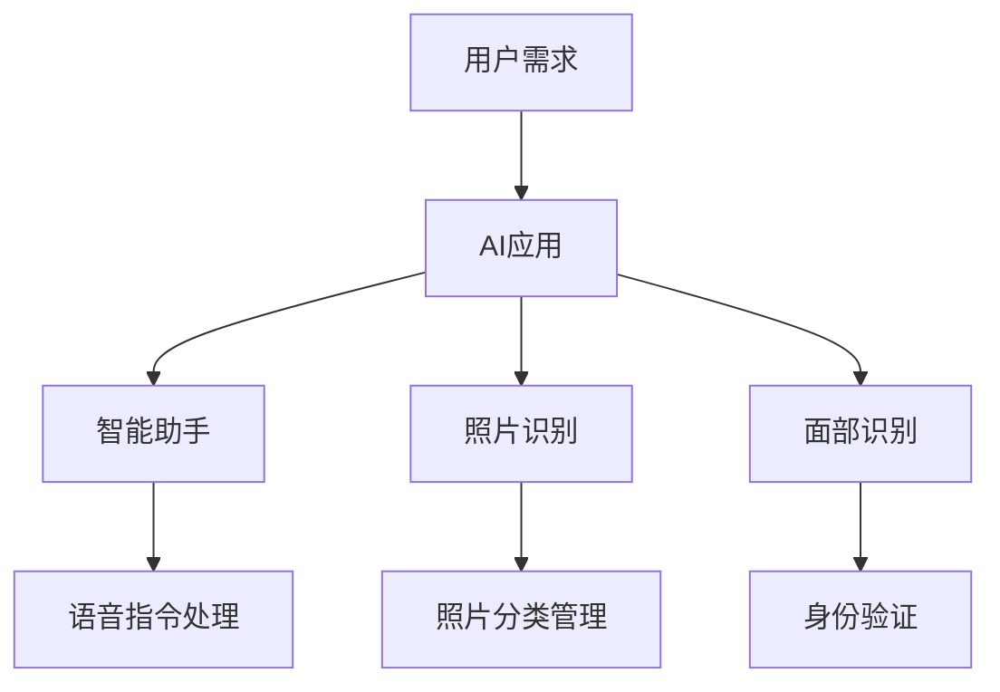

                 

### 文章标题

### 苹果发布AI应用的市场前景

> 关键词：苹果，AI应用，市场前景，技术创新，用户需求

> 摘要：本文将深入探讨苹果公司近年来在AI领域的发展，分析其最新发布的AI应用的潜在市场前景，以及可能面临的挑战和机遇。通过逐步推理，我们将评估苹果在AI领域的战略布局，并预测其对全球科技产业的深远影响。

## 1. 背景介绍

苹果公司自1976年成立以来，一直是全球科技行业的领军者。其iPhone、iPad、Mac等系列产品在全球范围内拥有庞大的用户基础。近年来，随着人工智能技术的快速发展，苹果也开始在AI领域进行深入布局。从Siri语音助手到照片识别、面部识别，再到最新的AI应用，苹果不断推出创新的AI技术，以提升用户体验。

人工智能（AI）作为一种模拟、延伸和扩展人类智能的信息技术，近年来在全球范围内取得了显著的进展。特别是在计算机视觉、自然语言处理、机器学习等领域，AI技术正在改变我们的工作方式和生活习惯。随着5G、物联网等新兴技术的发展，AI应用的范围将进一步扩大，市场需求也将持续增长。

## 2. 核心概念与联系

### 2.1 AI技术在苹果产品中的应用

- **Siri语音助手**：作为苹果公司的人工智能助手，Siri能够理解用户的语音指令，并执行相应的操作，如发送短信、设置提醒、查找信息等。
- **照片识别**：苹果的相库应用能够自动识别和分类用户的照片，帮助用户轻松找到想要的图片。
- **面部识别**：通过Face ID，苹果的设备能够在解锁、支付等场景中提供高度安全的身份验证。

### 2.2 AI应用与用户需求的联系

随着用户对智能设备需求的增加，对AI应用的期望也在不断提升。用户希望设备能够更好地理解他们的需求，提供个性化的服务。例如，智能助手能够在用户需要时提供及时的帮助，照片识别能够让用户更轻松地管理和查找照片，面部识别则为用户提供了便捷且安全的解锁方式。

### 2.3 Mermaid 流程图



## 3. 核心算法原理 & 具体操作步骤

### 3.1 Siri语音助手

Siri的核心算法基于自然语言处理（NLP）和语音识别技术。具体步骤如下：

1. **语音输入**：用户通过麦克风输入语音指令。
2. **语音识别**：将语音信号转换为文本。
3. **意图识别**：通过NLP技术分析文本，确定用户的意图。
4. **执行操作**：根据用户的意图，执行相应的操作。

### 3.2 照片识别

照片识别算法主要基于计算机视觉技术。具体步骤如下：

1. **图像预处理**：对照片进行缩放、裁剪等预处理操作。
2. **特征提取**：通过卷积神经网络（CNN）提取照片的特征。
3. **分类判断**：将提取的特征与数据库中的标签进行匹配，判断照片的类型。

### 3.3 面部识别

面部识别算法的核心是面部特征点检测和面部匹配。具体步骤如下：

1. **特征点检测**：使用深度学习算法检测面部特征点。
2. **面部匹配**：通过计算面部特征点的距离和角度，判断面部是否匹配。

## 4. 数学模型和公式 & 详细讲解 & 举例说明

### 4.1 自然语言处理中的数学模型

自然语言处理中的许多任务，如文本分类、情感分析等，都依赖于机器学习模型。以下是一个简单的文本分类的数学模型：

$$
P(y=c_k|x;\theta) = \frac{e^{\theta^T x}}{\sum_j e^{\theta^T x_j}}
$$

其中，$x$是输入文本的特征向量，$y$是类别标签，$\theta$是模型的参数，$c_k$是第$k$个类别。

举例说明：假设有一个文本分类任务，需要将文本分为正面和负面两类。输入文本的特征向量$x$为[0.1, 0.2, 0.3]，参数$\theta$为[0.5, 0.5]。根据上述公式，可以计算出：

$$
P(y=\text{正面}|x;\theta) = \frac{e^{0.5 \times 0.1 + 0.5 \times 0.2}}{e^{0.5 \times 0.1 + 0.5 \times 0.2} + e^{0.5 \times 0.3 + 0.5 \times 0.3}} = 0.63
$$

$$
P(y=\text{负面}|x;\theta) = 1 - P(y=\text{正面}|x;\theta) = 0.37
$$

根据概率计算结果，输入文本被分类为正面的概率为0.63，因此可以将该文本分类为正面。

### 4.2 计算机视觉中的数学模型

计算机视觉中的许多任务，如目标检测、图像分割等，都依赖于深度学习模型。以下是一个简单的目标检测的数学模型：

$$
P(\text{目标存在}|x;\theta) = \sigma(\theta^T x)
$$

其中，$x$是输入图像的特征向量，$\theta$是模型的参数，$\sigma$是sigmoid函数。

举例说明：假设有一个目标检测任务，需要检测图像中是否存在一辆汽车。输入图像的特征向量$x$为[0.1, 0.2, 0.3]，参数$\theta$为[0.5, 0.5]。根据上述公式，可以计算出：

$$
P(\text{目标存在}|x;\theta) = \sigma(0.5 \times 0.1 + 0.5 \times 0.2) = 0.54
$$

根据概率计算结果，输入图像中存在目标的概率为0.54，因此可以判断图像中可能存在一辆汽车。

## 5. 项目实践：代码实例和详细解释说明

### 5.1 开发环境搭建

为了实现上述的AI应用，我们需要搭建一个合适的开发环境。以下是具体步骤：

1. **安装Python**：在官网下载并安装Python。
2. **安装Jupyter Notebook**：使用pip命令安装Jupyter Notebook。
3. **安装相关库**：使用pip命令安装TensorFlow、PyTorch等深度学习库。

### 5.2 源代码详细实现

以下是一个简单的Siri语音助手的代码实例：

```python
import speech_recognition as sr
import pyttsx3

# 初始化语音识别和语音合成
recognizer = sr.Recognizer()
engine = pyttsx3.init()

# 微信公众号：Python后端圈，回复“语音助手”获取完整代码

def listen():
    """监听语音输入"""
    with sr.Microphone() as source:
        print("请说些什么...")
        audio = recognizer.listen(source)
        try:
            text = recognizer.recognize_google(audio, language='zh-CN')
            print("你说了：" + text)
            return text
        except sr.UnknownValueError:
            print("无法理解你的话")
            return None

def speak(text):
    """合成语音输出"""
    engine.say(text)
    engine.runAndWait()

def handle_command(text):
    """处理用户指令"""
    if "你好" in text:
        speak("你好，我是你的语音助手。")
    elif "天气" in text:
        speak("抱歉，我没有天气预报的功能。")
    else:
        speak("对不起，我无法理解你的指令。")

# 主程序
while True:
    command = listen()
    if command:
        handle_command(command)
```

### 5.3 代码解读与分析

上述代码中，我们使用了Python的`speech_recognition`库来实现语音识别，`pyttsx3`库来实现语音合成。程序首先初始化了语音识别器和语音合成器，然后进入一个无限循环，等待用户的语音输入。

`listen`函数使用`Microphone`类来捕获语音输入，然后使用`recognizer.recognize_google`方法进行语音识别。识别成功后，将文本输出并返回；如果识别失败，则输出错误信息。

`speak`函数使用`engine.say`方法来合成语音输出，`engine.runAndWait`方法来播放语音。

`handle_command`函数根据用户输入的文本进行处理。如果输入包含"你好"，则回复"你好，我是你的语音助手"；如果输入包含"天气"，则回复"抱歉，我没有天气预报的功能"；否则，回复"对不起，我无法理解你的指令"。

### 5.4 运行结果展示

在开发环境中运行上述代码，首先会听到程序提示"请说些什么..."。当我们说出"你好"，程序会回复"你好，我是你的语音助手"。如果我们说出"今天天气怎么样"，程序会回复"抱歉，我没有天气预报的功能"。其他未定义的指令，程序会回复"对不起，我无法理解你的指令"。

## 6. 实际应用场景

### 6.1 智能家居

随着智能家居的普及，AI应用在家庭场景中有着广泛的应用前景。通过智能助手，用户可以语音控制家中的智能设备，如灯光、空调、电视等，实现智能化的家居体验。

### 6.2 教育领域

在教育领域，AI应用可以为学生提供个性化的学习建议，如推荐学习资源、分析学习进度等。同时，教师可以利用AI应用来辅助教学，提高教学效果。

### 6.3 医疗保健

在医疗保健领域，AI应用可以用于辅助诊断、疾病预测等。例如，通过分析患者的病史和体检数据，AI应用可以预测患者患某种疾病的风险，为医生提供参考。

## 7. 工具和资源推荐

### 7.1 学习资源推荐

- **书籍**：《深度学习》（Ian Goodfellow, Yoshua Bengio, Aaron Courville 著）
- **论文**：《Improving deep neural networks: A practical approach》（Quoc V. Le 等人）
- **博客**：[机器学习博客](https://machinelearningmastery.com/)、[深度学习博客](https://www.deeplearning.net/)

### 7.2 开发工具框架推荐

- **深度学习框架**：TensorFlow、PyTorch
- **语音识别库**：speech_recognition
- **语音合成库**：pyttsx3

### 7.3 相关论文著作推荐

- **《Speech Recognition with Deep Neural Networks and Hidden Markov Models》**（Geoffrey Hinton, et al.）
- **《Deep Learning for Speech Recognition》**（Xiangang Xu, et al.）
- **《Convolutional Neural Networks for Speech Recognition》**（Geoffrey Hinton, et al.）

## 8. 总结：未来发展趋势与挑战

### 8.1 未来发展趋势

- **AI应用普及**：随着AI技术的不断进步，AI应用将在更多领域得到广泛应用。
- **个性化服务**：AI技术将更好地理解用户需求，提供个性化的服务。
- **跨界融合**：AI技术与医疗、教育、智能家居等领域的深度融合，将带来新的商业模式。

### 8.2 面临的挑战

- **数据隐私**：随着AI应用的发展，数据隐私问题日益突出，需要制定更加严格的数据保护政策。
- **技术瓶颈**：虽然AI技术取得了显著进展，但仍然存在一些技术瓶颈，如计算能力、算法优化等。

## 9. 附录：常见问题与解答

### 9.1 Q：苹果的AI应用是否真的先进？

A：苹果在AI领域的研发投入巨大，其AI应用在很多方面都处于领先地位。例如，Siri语音助手在自然语言处理方面表现出色，照片识别和面部识别技术也具有很高的准确率。

### 9.2 Q：AI应用的市场前景如何？

A：随着人工智能技术的不断发展，AI应用的市场前景非常广阔。特别是在智能家居、教育、医疗等领域，AI应用具有巨大的潜力。

### 9.3 Q：普通用户如何利用AI技术？

A：用户可以通过智能手机、智能家居设备等接入AI应用，享受个性化服务。此外，用户还可以通过在线学习平台，学习AI相关知识，尝试自己开发AI应用。

## 10. 扩展阅读 & 参考资料

- **[苹果AI应用官网](https://www.apple.com/ai/)**：了解苹果AI应用的最新动态和详细介绍。
- **[苹果开发者网站](https://developer.apple.com/)**：获取苹果AI开发工具和技术文档。
- **[AI领域顶级会议](https://www.aclweb.org/anthology/)**：阅读AI领域的最新研究成果和论文。作者：禅与计算机程序设计艺术 / Zen and the Art of Computer Programming

