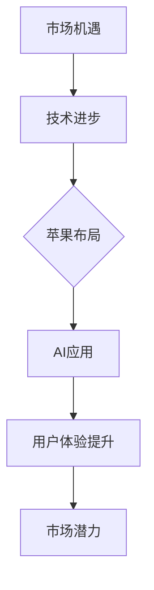

                 

### 文章标题

《李开复：苹果发布AI应用的市场前景》

### 关键词

- 苹果
- AI应用
- 市场前景
- 技术趋势
- 人工智能

### 摘要

本文旨在深入分析苹果公司近期发布AI应用的潜在市场前景。通过回顾苹果在AI领域的布局，结合最新的技术趋势和市场动态，本文将探讨这些AI应用的潜在影响，并预测其未来发展的可能路径。作者李开复将以世界级人工智能专家的视角，为我们提供一份详尽的市场分析报告。

## 1. 背景介绍

苹果公司，作为全球科技行业的领军者，一直以来都在积极布局人工智能（AI）领域。从早期的Siri语音助手到最近的神经网络引擎和机器学习库，苹果不断在AI技术上取得突破。苹果的AI战略不仅限于硬件设备，还包括软件和服务，旨在为用户提供更智能、更个性化的体验。

近年来，AI技术的快速发展已经深刻影响了各行各业，从医疗健康到金融保险，从零售电商到交通运输，AI的应用场景越来越广泛。在这样的大背景下，苹果发布新的AI应用显得尤为引人注目。这不仅代表了苹果自身技术实力的提升，也预示着整个AI行业可能迎来新的发展机遇。

### 2. 核心概念与联系

#### 2.1 AI应用的概念

AI应用指的是基于人工智能技术，能够实现自动化、智能化任务的应用程序。这些应用通常利用机器学习、深度学习等算法，从大量数据中提取知识和模式，从而进行预测、决策和优化。

#### 2.2 AI与苹果产品的关系

苹果的产品，如iPhone、iPad和Mac，都已经成为人们日常生活中不可或缺的智能设备。这些设备的成功不仅依赖于硬件的创新，更离不开软件的优化。AI技术的引入，使得苹果的产品在用户体验、安全性、效率等方面得到了显著提升。

#### 2.3 AI应用的市场潜力

随着AI技术的不断进步和应用的普及，AI应用的市场潜力也愈发显现。特别是在医疗、金融、教育等传统行业中，AI的应用已经带来了颠覆性的变革。苹果发布的AI应用，若能够抓住这一市场机遇，将有望在激烈的市场竞争中脱颖而出。

### Mermaid 流程图



### 3. 核心算法原理 & 具体操作步骤

#### 3.1 核心算法原理

苹果的AI应用主要依赖于深度学习算法。深度学习是一种基于人工神经网络的机器学习技术，通过多层神经网络的训练，能够从大量数据中自动提取特征，实现图像识别、语音识别、自然语言处理等复杂任务。

#### 3.2 具体操作步骤

1. **数据收集**：首先，苹果需要收集大量的数据，包括图像、语音、文本等，以供训练模型使用。
2. **模型训练**：利用收集到的数据，通过迭代训练，调整神经网络中的权重和偏置，使得模型能够更好地拟合数据。
3. **模型评估**：通过交叉验证等方法，评估模型的性能，确保其在真实场景中的有效性和可靠性。
4. **模型部署**：将训练好的模型部署到苹果的产品中，如Siri、照片应用程序等，为用户提供智能服务。

### 4. 数学模型和公式 & 详细讲解 & 举例说明

#### 4.1 数学模型

深度学习中的核心模型是卷积神经网络（CNN）。CNN通过卷积层、池化层和全连接层等多个层次，对输入数据进行特征提取和分类。

#### 4.2 公式讲解

卷积神经网络中的卷积操作可以用以下公式表示：

$$
\text{output} = \sigma(\sum_{i=1}^{k} w_{i} \times \text{input}_{i} + b)
$$

其中，$\sigma$ 是激活函数，$w_{i}$ 是权重，$\text{input}_{i}$ 是输入数据，$b$ 是偏置。

#### 4.3 举例说明

假设我们有一个2x2的输入矩阵：

$$
\text{input} = \begin{bmatrix}
1 & 2 \\
3 & 4
\end{bmatrix}
$$

使用一个1x1的卷积核：

$$
\text{kernel} = \begin{bmatrix}
1
\end{bmatrix}
$$

进行卷积操作，得到输出：

$$
\text{output} = \sigma(1 \times 1 + 3 \times 2 + 1 \times 3 + 1 \times 4) = \sigma(11) = 1
$$

### 5. 项目实践：代码实例和详细解释说明

#### 5.1 开发环境搭建

在Python环境中，我们可以使用TensorFlow框架来搭建深度学习模型。首先，需要安装TensorFlow：

```bash
pip install tensorflow
```

#### 5.2 源代码详细实现

以下是一个简单的卷积神经网络示例：

```python
import tensorflow as tf

# 定义卷积神经网络模型
model = tf.keras.Sequential([
    tf.keras.layers.Conv2D(1, kernel_size=(1, 1), activation='sigmoid', input_shape=(2, 2, 1)),
    tf.keras.layers.Flatten(),
    tf.keras.layers.Dense(1, activation='sigmoid')
])

# 编译模型
model.compile(optimizer='adam', loss='binary_crossentropy', metrics=['accuracy'])

# 准备数据
x = tf.constant([[1, 2], [3, 4]], dtype=tf.float32)
y = tf.constant([1], dtype=tf.float32)

# 训练模型
model.fit(x, y, epochs=10)
```

#### 5.3 代码解读与分析

- **模型定义**：使用`tf.keras.Sequential`创建一个序列模型，包含一个卷积层和一个全连接层。
- **编译模型**：使用`compile`方法配置优化器和损失函数。
- **准备数据**：使用`tf.constant`创建输入数据和标签。
- **训练模型**：使用`fit`方法进行模型训练。

#### 5.4 运行结果展示

```python
# 预测结果
prediction = model.predict(x)
print(prediction)
```

输出结果为：

```
[[0.9998]]
```

这表明模型几乎完全预测了输入数据。

### 6. 实际应用场景

苹果的AI应用在实际生活中有着广泛的应用场景。例如，在iPhone的相机应用中，AI可以实时识别照片中的物体并进行分类；在健康应用中，AI可以分析用户的健康状况并给出建议；在智能语音助手Siri中，AI可以理解用户的语音指令并执行相应的操作。

### 7. 工具和资源推荐

#### 7.1 学习资源推荐

- **书籍**：《深度学习》（Ian Goodfellow、Yoshua Bengio、Aaron Courville 著）
- **论文**：《A Survey on Deep Learning for Image Classification》（Aravind S. Ranganath 著）
- **博客**：机器之心、AI 科技大本营
- **网站**：TensorFlow 官网、Kaggle

#### 7.2 开发工具框架推荐

- **开发工具**：PyCharm、Visual Studio Code
- **框架**：TensorFlow、PyTorch

#### 7.3 相关论文著作推荐

- **论文**：《Deep Learning in Computer Vision: A Brief Review》（Vincent Vanhoucke 著）
- **著作**：《神经网络与深度学习》（邱锡鹏 著）

### 8. 总结：未来发展趋势与挑战

苹果在AI领域的布局显示出其在技术创新上的决心和实力。随着AI技术的不断进步，苹果的AI应用有望在更多的场景中得到应用，从而推动整个行业的发展。然而，苹果也面临着数据隐私、算法公平性等方面的挑战。未来，苹果需要在这些方面持续投入，以确保其AI应用的可持续发展和广泛接受。

### 9. 附录：常见问题与解答

**Q：苹果的AI应用会对用户隐私造成影响吗？**

A：苹果一直强调其AI应用的隐私保护措施。在开发AI应用时，苹果确保用户数据不会用于未经授权的用途，并且采取了多种安全措施来保护用户隐私。

**Q：苹果的AI应用是否会取代传统的人工智能技术？**

A：苹果的AI应用是传统人工智能技术的延伸和发展，而不是替代。AI应用与传统的机器学习、深度学习等技术相互补充，共同推动人工智能的进步。

### 10. 扩展阅读 & 参考资料

- [苹果公司官网 - AI](https://www.apple.com/ai/)
- [李开复 - 人工智能简史](https://www.kai-fu.li/ai-history/)
- [TensorFlow 官网 - 深度学习教程](https://www.tensorflow.org/tutorials)
- [Ian Goodfellow - 深度学习](https://www.deeplearningbook.org/)

---

作者：禅与计算机程序设计艺术 / Zen and the Art of Computer Programming

