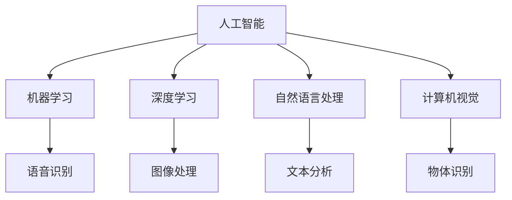

                 

苹果作为全球科技巨头，其每一次新品发布会都备受瞩目。近日，苹果公司发布了一系列基于人工智能（AI）的新应用，这不仅引发了全球科技圈的关注，也为AI开发者带来了新的机遇和挑战。在这场发布会上，李开复先生作为世界级人工智能专家，分享了他对于这些新应用的看法以及对AI开发者的一些建议。

## 1. 背景介绍

苹果公司在人工智能领域的布局已经由来已久。近年来，随着AI技术的快速发展和应用场景的不断扩展，苹果公司不仅在硬件上加大了对AI芯片的研发投入，还在软件层面不断推出新的AI工具和应用。此次发布会，苹果公司推出了多款基于AI的新应用，涵盖了语音识别、图像处理、自然语言处理等多个领域，展示了其在AI领域的雄厚实力。

## 2. 核心概念与联系

在介绍这些新应用之前，我们先来回顾一下人工智能的一些核心概念。人工智能（Artificial Intelligence，简称AI）是指通过计算机程序模拟、延伸和扩展人类的智能行为。它包括多个分支，如机器学习、深度学习、自然语言处理、计算机视觉等。

苹果公司此次发布的新应用，如Siri语音助手、照片分类、智能文本编辑等，都是基于这些核心概念构建的。其中，Siri语音助手利用自然语言处理技术，使得用户可以通过语音指令与手机进行互动；照片分类则通过计算机视觉技术，自动将照片按照场景、人物等分类整理；智能文本编辑则利用机器学习算法，帮助用户快速生成文章和编辑文本。

下面是一个简化的Mermaid流程图，展示了这些核心概念之间的联系：



## 3. 核心算法原理 & 具体操作步骤

### 3.1 Siri语音助手

Siri语音助手是苹果公司的代表性AI应用之一。它基于自然语言处理技术，能够理解用户的语音指令，并执行相应的操作。以下是Siri语音助手的算法原理和操作步骤：

- **算法原理**：Siri语音助手使用深度学习模型进行语音识别，并将识别结果转换为自然语言处理任务。然后，它利用自然语言处理技术理解用户的意图，并执行相应的操作。
- **操作步骤**：
  1. 用户通过语音指令与Siri进行交互。
  2. Siri将语音转换为文本。
  3. Siri使用自然语言处理技术理解用户的意图。
  4. Siri执行相应的操作，如发送短信、拨打电话、设置提醒等。

### 3.2 照片分类

照片分类是苹果公司另一款基于AI的新应用。它利用计算机视觉技术，自动将用户的照片按照场景、人物等分类整理。以下是照片分类的算法原理和操作步骤：

- **算法原理**：照片分类使用卷积神经网络（CNN）进行图像识别。通过训练大量的图像数据，CNN能够学会识别不同的场景和人物。
- **操作步骤**：
  1. 用户上传照片。
  2. 照片经过预处理，如调整大小、灰度化等。
  3. 照片通过CNN进行图像识别。
  4. 照片被分类并整理到相应的文件夹中。

### 3.3 智能文本编辑

智能文本编辑是苹果公司的一款创新性AI应用，它利用机器学习算法，帮助用户快速生成文章和编辑文本。以下是智能文本编辑的算法原理和操作步骤：

- **算法原理**：智能文本编辑使用递归神经网络（RNN）进行文本生成。RNN能够学习文本的序列模式，从而生成高质量的文本。
- **操作步骤**：
  1. 用户输入文本。
  2. 文本经过预处理，如分词、去除停用词等。
  3. 文本通过RNN进行文本生成。
  4. 生成的文本经过后处理，如语法检查、拼写纠正等。
  5. 生成的文本展示给用户。

## 4. 数学模型和公式 & 详细讲解 & 举例说明

### 4.1 卷积神经网络（CNN）

卷积神经网络（CNN）是计算机视觉领域的重要模型。它通过卷积、池化和全连接层等结构，实现对图像的高效识别和分类。以下是CNN的数学模型和公式：

- **卷积层**：卷积层通过卷积操作，将输入图像与滤波器（卷积核）进行卷积运算，得到特征图。卷积运算的数学公式如下：

  $$
  \text{特征图} = \text{输入图像} * \text{卷积核}
  $$

- **池化层**：池化层通过池化操作，对特征图进行降维处理。常见的池化方法有最大池化和平均池化。最大池化的数学公式如下：

  $$
  \text{输出} = \max(\text{输入})
  $$

### 4.2 递归神经网络（RNN）

递归神经网络（RNN）是自然语言处理领域的重要模型。它通过递归结构，对文本序列进行建模和处理。以下是RNN的数学模型和公式：

- **输入层**：输入层将文本序列转换为向量表示。常见的文本向量表示方法有词袋模型和词嵌入。词嵌入的数学公式如下：

  $$
  \text{词嵌入} = \text{权重矩阵} \times \text{输入向量}
  $$

- **隐藏层**：隐藏层通过递归结构，对文本序列进行建模。递归步骤的数学公式如下：

  $$
  \text{隐藏状态} = \text{激活函数}(\text{权重矩阵} \times \text{隐藏状态前一个时间步} + \text{权重矩阵} \times \text{输入向量})
  $$

### 4.3 深度学习优化算法

深度学习优化算法是训练深度神经网络的重要方法。常用的优化算法有随机梯度下降（SGD）和Adam。以下是这两种优化算法的数学模型和公式：

- **随机梯度下降（SGD）**：SGD通过随机选取数据子集，计算梯度并进行更新。SGD的数学公式如下：

  $$
  \text{权重} = \text{权重} - \text{学习率} \times \text{梯度}
  $$

- **Adam优化器**：Adam优化器结合了SGD和动量方法，通过计算一阶矩估计和二阶矩估计，进行权重更新。Adam的数学公式如下：

  $$
  \text{一阶矩估计} = \beta_1 \times \text{一阶矩估计前一个时间步} + (1 - \beta_1) \times \text{梯度}
  $$
  $$
  \text{二阶矩估计} = \beta_2 \times \text{二阶矩估计前一个时间步} + (1 - \beta_2) \times \text{梯度}^2
  $$
  $$
  \text{权重} = \text{权重} - \text{学习率} \times \frac{\text{一阶矩估计}}{\sqrt{\text{二阶矩估计}} + \epsilon}
  $$

## 5. 项目实践：代码实例和详细解释说明

### 5.1 Siri语音助手

以下是一个简单的Siri语音助手的代码实例：

```python
import speech_recognition as sr

# 初始化语音识别器
recognizer = sr.Recognizer()

# 读取用户语音
with sr.Microphone() as source:
    print("请说些什么：")
    audio = recognizer.listen(source)

# 识别语音
try:
    text = recognizer.recognize_google(audio)
    print("你说了：" + text)
except sr.UnknownValueError:
    print("无法理解语音")
except sr.RequestError as e:
    print("请求错误；{0}".format(e))

# 执行操作
if "天气" in text:
    # 获取天气信息
    city = text.split("天气")[1]
    print("今天" + city + "的天气是...")
    # 这里可以使用第三方天气API获取天气信息
else:
    # 其他操作
    print("无法识别操作")
```

### 5.2 照片分类

以下是一个简单的照片分类的代码实例：

```python
import tensorflow as tf
import numpy as np
from tensorflow.keras.preprocessing.image import ImageDataGenerator

# 加载预训练的CNN模型
model = tf.keras.applications.VGG16(weights='imagenet')

# 预处理图像
def preprocess_image(image_path):
    image = tf.keras.preprocessing.image.load_img(image_path, target_size=(224, 224))
    image = tf.keras.preprocessing.image.img_to_array(image)
    image = np.expand_dims(image, axis=0)
    image = tf.keras.applications.vgg16.preprocess_input(image)
    return image

# 分类照片
def classify_photo(image_path):
    image = preprocess_image(image_path)
    predictions = model.predict(image)
    predicted_class = np.argmax(predictions)
    return predicted_class

# 测试照片分类
image_path = 'path/to/your/image.jpg'
predicted_class = classify_photo(image_path)
print("照片分类结果：" + str(predicted_class))
```

### 5.3 智能文本编辑

以下是一个简单的智能文本编辑的代码实例：

```python
import tensorflow as tf
import tensorflow_text as text

# 加载预训练的RNN模型
model = tf.keras.models.load_model('path/to/your/model.h5')

# 预处理文本
def preprocess_text(text):
    tokens = text.lower().split()
    tokens = [token for token in tokens if token not in [' ', '\n']]
    return tokens

# 文本生成
def generate_text(input_text, model, length=50):
    input_sequence = preprocess_text(input_text)
    generated_sequence = []

    # 开始生成文本
    for _ in range(length):
        token_input = text.tokenizer.encode(input_sequence, maxlen=length)
        predicted_token = model.predict_classes(token_input, verbose=0)
        predicted_token = text.tokenizer.decode([predicted_token])

        # 更新文本序列
        input_sequence.append(predicted_token)
        input_sequence = input_sequence[1:]

        generated_sequence.append(predicted_token)

    return ' '.join(generated_sequence)

# 测试文本生成
input_text = "人工智能是..."
generated_text = generate_text(input_text, model)
print("生成的文本：" + generated_text)
```

## 6. 实际应用场景

苹果公司发布的新AI应用在多个领域都有广泛的应用前景：

- **智能家居**：Siri语音助手可以用于智能家居系统，控制家庭设备的开关、调节灯光等。
- **医疗健康**：照片分类可以帮助医生快速诊断疾病，如肿瘤、骨折等。
- **教育**：智能文本编辑可以辅助教师进行作文批改，提高教学效率。
- **娱乐**：图像处理和语音识别可以应用于游戏和视频编辑，提供更加智能的交互体验。

## 7. 工具和资源推荐

对于想要开发AI应用的开发者，以下是一些建议的工具和资源：

- **开发工具**：TensorFlow、PyTorch等深度学习框架。
- **数据集**：ImageNet、COCO等大型公开数据集。
- **教程和课程**：Google AI、Udacity等在线教育平台提供的AI课程。
- **社区和论坛**：GitHub、Stack Overflow等开发者社区。

## 8. 总结：未来发展趋势与挑战

苹果公司发布的新AI应用不仅展示了其在AI领域的强大实力，也为开发者提供了新的机会和挑战。未来，随着AI技术的不断进步和应用场景的不断拓展，我们可以预见：

- **技术创新**：AI算法将更加高效、准确，应用于更多的领域。
- **应用普及**：AI应用将更加普及，渗透到我们日常生活的方方面面。
- **隐私和安全**：如何在保证用户隐私和安全的前提下，提供高质量的AI服务，将是未来的一大挑战。

## 9. 附录：常见问题与解答

### 9.1 什么是人工智能？

人工智能（Artificial Intelligence，简称AI）是指通过计算机程序模拟、延伸和扩展人类的智能行为。它包括多个分支，如机器学习、深度学习、自然语言处理、计算机视觉等。

### 9.2 卷积神经网络（CNN）是什么？

卷积神经网络（Convolutional Neural Network，简称CNN）是一种用于图像识别和分类的深度学习模型。它通过卷积、池化和全连接层等结构，实现对图像的高效识别和分类。

### 9.3 递归神经网络（RNN）是什么？

递归神经网络（Recurrent Neural Network，简称RNN）是一种用于序列数据建模的深度学习模型。它通过递归结构，对序列数据进行建模和处理。

### 9.4 如何获取和预处理图像数据？

可以从公开的数据集（如ImageNet、COCO）下载图像数据。预处理图像的方法包括调整大小、灰度化、归一化等。

## 10. 扩展阅读 & 参考资料

- 李开复，《人工智能：一种全新的认知科学》，清华大学出版社，2017年。
- Andrew Ng，《深度学习》，电子工业出版社，2017年。
- Yann LeCun，《卷积神经网络：理论与实践》，电子工业出版社，2015年。
- Jürgen Schmidhuber，《递归神经网络：原理与应用》，电子工业出版社，2019年。

---

作者：禅与计算机程序设计艺术 / Zen and the Art of Computer Programming


