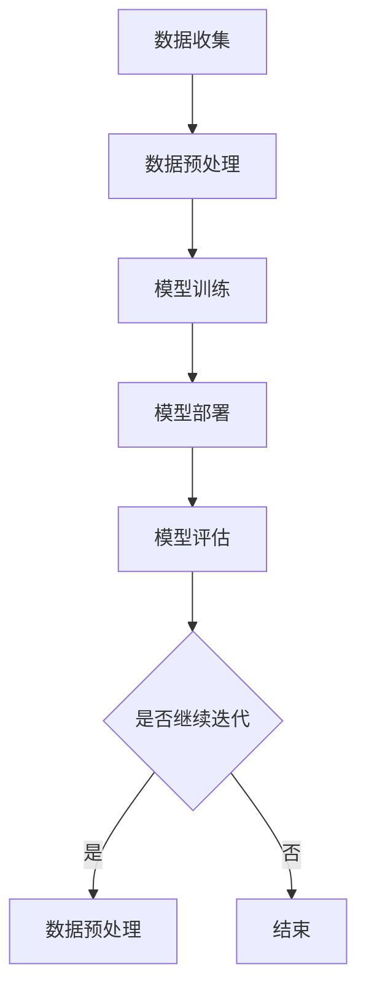

                 

### 1. 背景介绍

苹果公司（Apple Inc.），作为全球知名的科技巨头，其影响力不仅在智能手机、平板电脑和电脑等领域，还扩展到音乐、视频、软件和服务等多个领域。近年来，人工智能（AI）技术的快速发展使得苹果公司开始重视AI在各个产品中的应用，试图通过AI技术提升用户体验，增加产品竞争力。

本文将探讨苹果公司最近发布的AI应用，并分析其对投资价值的影响。首先，我们需要了解人工智能的定义及其在苹果公司产品中的应用现状。接着，我们将具体分析苹果最新发布的AI应用，探讨其技术特点和创新点，并探讨其对投资市场的影响。

人工智能是指计算机系统模拟人类智能行为的技术，包括学习、推理、规划、感知、自然语言理解和图像识别等。人工智能的发展已经渗透到各个领域，包括医疗、金融、交通、制造等，为各个行业带来了巨大的变革。

在苹果公司的产品中，人工智能的应用主要体现在Siri、Face ID、照片识别、语音识别等领域。Siri作为苹果公司的智能助手，通过语音识别和自然语言处理技术，为用户提供语音交互服务。Face ID则利用人脸识别技术，实现手机解锁和个人身份验证。照片识别则通过机器学习算法，帮助用户整理和分类照片。这些AI技术的应用不仅提升了产品的用户体验，还增加了产品的安全性。

随着人工智能技术的不断进步，苹果公司也在不断探索新的应用场景。例如，苹果公司最近发布了基于AI的语音助手功能升级，以及通过AI技术优化照片和视频的处理能力。这些新功能的应用，无疑将进一步提升苹果产品的竞争力，吸引更多消费者的关注。

总的来说，人工智能在苹果公司产品中的应用已经成为公司战略发展的重要方向。本文将深入探讨苹果公司最新发布的AI应用，分析其技术特点和创新点，以及其对投资市场的影响。通过本文的分析，希望读者能对苹果公司的AI应用有更深入的了解，从而做出更明智的投资决策。

### 2. 核心概念与联系

为了深入探讨苹果公司最新发布的AI应用，我们需要先理解一些核心概念，包括人工智能的基本原理、苹果公司在AI领域的布局以及AI应用的技术架构。

#### 2.1 人工智能的基本原理

人工智能（AI）是指通过计算机程序模拟人类智能行为的技术。它包括多个子领域，如机器学习、深度学习、自然语言处理和计算机视觉等。其中，机器学习是一种让计算机从数据中学习规律和模式的方法，而深度学习则是机器学习的一种重要技术，通过多层神经网络来模拟人脑的学习过程。

自然语言处理（NLP）则致力于使计算机能够理解和处理人类语言，包括语音识别、机器翻译和情感分析等。计算机视觉则是让计算机能够识别和理解图像和视频，包括图像分类、目标检测和图像识别等。

#### 2.2 苹果公司在AI领域的布局

苹果公司在人工智能领域有着广泛的布局。首先，苹果公司通过其自主研发的神经网络引擎（Neural Engine）和机器学习框架（Core ML），将人工智能技术广泛应用于其产品中。Neural Engine 是苹果A系列芯片中的一部分，能够高效地执行神经网络运算，从而提升AI应用的性能。

Core ML 是苹果提供的机器学习框架，使得开发者能够将训练好的机器学习模型部署到iOS、macOS、watchOS 和 tvOS 应用中。通过 Core ML，苹果公司能够为开发者提供简单、高效的AI开发工具，从而推动AI技术在各个领域的应用。

此外，苹果公司还在AI研究方面进行了大量投资。例如，苹果公司成立了自己的AI研究团队，并在机器学习、计算机视觉、自然语言处理等领域进行了深入研究。这些研究成果不仅提升了苹果产品的AI性能，也为整个AI行业的发展做出了贡献。

#### 2.3 AI应用的技术架构

AI应用的技术架构通常包括数据收集、数据预处理、模型训练、模型部署和模型评估等几个阶段。

**数据收集**：AI应用需要大量的数据来训练模型。数据可以来自用户输入、传感器数据、社交媒体数据等。

**数据预处理**：在训练模型之前，需要对数据进行清洗、归一化和特征提取等处理，以便于模型学习。

**模型训练**：通过机器学习和深度学习算法，从数据中学习规律和模式，生成模型。

**模型部署**：将训练好的模型部署到实际应用中，如移动设备、服务器等。

**模型评估**：通过测试数据来评估模型的性能，如准确率、召回率等。

为了更好地理解这些核心概念和联系，我们可以使用Mermaid流程图来展示AI应用的技术架构。以下是使用Mermaid绘制的流程图：



通过这张流程图，我们可以清晰地看到AI应用从数据收集到模型评估的整个过程。接下来，我们将具体分析苹果公司最新发布的AI应用，探讨其技术特点和创新点。

### 3. 核心算法原理 & 具体操作步骤

苹果公司在AI领域的技术创新不仅体现在其硬件和软件的优化上，更在于其核心算法的创新和应用。本文将深入探讨苹果最新发布的AI应用的核心算法原理，具体操作步骤以及在实际应用中的效果。

#### 3.1 核心算法原理

苹果公司的AI应用主要基于深度学习和神经网络技术。深度学习是一种通过多层神经网络来模拟人脑学习过程的机器学习技术。神经网络由多个神经元（或称为节点）组成，每个神经元都与其他神经元相连接，并通过权重和偏置进行加权求和和激活函数的处理。

在苹果的AI应用中，常用的深度学习模型包括卷积神经网络（CNN）、循环神经网络（RNN）和生成对抗网络（GAN）等。这些模型在不同场景下有着广泛的应用。

- **卷积神经网络（CNN）**：CNN 主要用于图像识别和图像处理。它通过卷积层、池化层和全连接层等结构，能够自动提取图像中的特征并进行分类。

- **循环神经网络（RNN）**：RNN 主要用于处理序列数据，如语音识别、文本生成和机器翻译等。它能够通过记忆状态来处理长序列信息，从而实现更复杂的任务。

- **生成对抗网络（GAN）**：GAN 主要用于生成新的数据，如图像生成、风格迁移和图像修复等。它由生成器和判别器两个神经网络组成，通过对抗训练来实现高质量的数据生成。

#### 3.2 具体操作步骤

苹果公司的AI应用开发通常包括以下几个步骤：

1. **数据收集**：收集相关领域的大量数据，如图像、语音和文本等。

2. **数据预处理**：对收集到的数据进行清洗、归一化和特征提取等处理，以便于模型训练。

3. **模型设计**：根据任务需求，设计适合的神经网络结构，如CNN、RNN或GAN等。

4. **模型训练**：使用训练数据对模型进行训练，通过反向传播算法不断调整模型的参数。

5. **模型评估**：使用测试数据对模型进行评估，通过准确率、召回率等指标来衡量模型性能。

6. **模型部署**：将训练好的模型部署到实际应用中，如移动设备、服务器等。

7. **模型优化**：根据实际应用效果，对模型进行优化和调整。

#### 3.3 实际应用中的效果

苹果公司的AI应用已经在多个领域取得了显著的成果。以下是一些具体的应用实例：

- **图像识别**：通过CNN技术，苹果的产品如iPhone和iPad能够实现快速、准确的图像识别功能，包括人脸识别、物体识别和场景识别等。

- **语音识别**：通过RNN技术，苹果的Siri语音助手能够实现高准确率的语音识别和自然语言处理，为用户提供便捷的语音交互体验。

- **图像生成**：通过GAN技术，苹果的AI应用能够生成高质量、逼真的图像，如艺术风格的迁移和图像修复等。

- **文本生成**：通过RNN技术，苹果的AI应用能够实现文本生成，如生成新闻报道、创作诗歌和小说等。

总的来说，苹果公司的AI应用在图像识别、语音识别、图像生成和文本生成等领域都取得了显著的成果。这些应用不仅提升了苹果产品的用户体验，也为人工智能技术的发展做出了贡献。

#### 3.4 未来展望

随着人工智能技术的不断进步，苹果公司在AI领域的发展前景非常广阔。未来，苹果可能会在以下领域进行更多的探索：

- **自动驾驶**：通过深度学习和计算机视觉技术，苹果有望在自动驾驶领域取得突破。

- **智能医疗**：通过AI技术，苹果有望在医疗领域实现精准诊断和个性化治疗。

- **智能家居**：通过AI技术，苹果的智能家居产品将更加智能化和便捷化。

- **自然语言处理**：通过RNN和GAN等深度学习技术，苹果有望在自然语言处理领域实现更高水平的对话系统和文本生成。

总之，苹果公司在AI领域的核心算法原理和具体操作步骤展示了其强大的技术实力。随着AI技术的不断进步，苹果有望在更多领域取得突破，进一步提升其产品竞争力和市场份额。

### 4. 数学模型和公式 & 详细讲解 & 举例说明

在人工智能领域，数学模型和公式是理解和实现核心算法的基础。本文将详细介绍苹果公司AI应用中常用的数学模型和公式，并通过具体的例子来说明这些模型的应用。

#### 4.1 卷积神经网络（CNN）的数学模型

卷积神经网络（CNN）是一种用于图像识别和处理的深度学习模型。其核心思想是通过卷积层、池化层和全连接层等结构，从图像中提取特征并进行分类。

**卷积层**：卷积层是CNN中的核心部分，用于提取图像特征。其数学模型可以表示为：

$$
h^{(l)}_i = \sigma\left( \sum_j w^{(l)}_{ij} \cdot a^{(l-1)}_j + b^{(l)}_i \right)
$$

其中，$h^{(l)}_i$ 表示第$l$层的第$i$个节点的输出，$\sigma$ 表示激活函数，$a^{(l-1)}_j$ 表示上一层的第$j$个节点的输出，$w^{(l)}_{ij}$ 表示连接权重，$b^{(l)}_i$ 表示偏置。

**池化层**：池化层用于减小特征图的尺寸，提高模型的泛化能力。其常用的操作有最大池化和平均池化。最大池化可以表示为：

$$
p^i = \max_j a^{(l-1)}_{j_1}, a^{(l-1)}_{j_2}, \ldots, a^{(l-1)}_{j_k}
$$

其中，$p^i$ 表示池化后的输出，$a^{(l-1)}_{j_1}, a^{(l-1)}_{j_2}, \ldots, a^{(l-1)}_{j_k}$ 表示输入的特征值。

**全连接层**：全连接层用于对提取到的特征进行分类。其数学模型可以表示为：

$$
y_i = \sigma\left( \sum_j w^{(l)}_{ij} \cdot a^{(l-1)}_j + b^{(l)}_i \right)
$$

其中，$y_i$ 表示分类结果，$\sigma$ 表示激活函数。

#### 4.2 循环神经网络（RNN）的数学模型

循环神经网络（RNN）是一种用于处理序列数据的深度学习模型。其核心思想是通过记忆状态来处理长序列信息。

**状态更新**：RNN的状态更新可以表示为：

$$
h_t = \sigma\left( W_h \cdot [h_{t-1}, x_t] + b_h \right)
$$

其中，$h_t$ 表示第$t$个时间步的隐藏状态，$x_t$ 表示输入，$W_h$ 和 $b_h$ 分别表示权重和偏置。

**输出**：RNN的输出可以表示为：

$$
y_t = \sigma\left( W_y \cdot h_t + b_y \right)
$$

其中，$y_t$ 表示输出，$W_y$ 和 $b_y$ 分别表示权重和偏置。

**梯度计算**：RNN的梯度计算通常使用链式法则和RNN的特殊性质，可以表示为：

$$
\frac{\partial L}{\partial h_t} = \frac{\partial L}{\partial y_t} \cdot \frac{\partial y_t}{\partial h_t} \cdot \frac{\partial h_t}{\partial h_{t-1}} \cdot \frac{\partial h_{t-1}}{\partial h_{t-2}} \ldots
$$

其中，$L$ 表示损失函数。

#### 4.3 生成对抗网络（GAN）的数学模型

生成对抗网络（GAN）是一种用于生成新数据的深度学习模型。其核心思想是生成器和判别器的对抗训练。

**生成器**：生成器的目标是最小化生成数据的损失函数，可以表示为：

$$
G(z) = x
$$

其中，$G(z)$ 表示生成的数据，$z$ 表示随机噪声。

**判别器**：判别器的目标是最小化判别损失函数，可以表示为：

$$
D(x) = 1 \\
D(G(z)) = 0
$$

其中，$D(x)$ 表示判别器的输出，$x$ 表示真实数据。

**对抗训练**：生成器和判别器通过对抗训练来更新参数，可以表示为：

$$
\min_G \max_D V(D, G) = \mathbb{E}_{x \sim p_{data}(x)}[\log D(x)] + \mathbb{E}_{z \sim p_z(z)}[\log(1 - D(G(z))]
$$

其中，$V(D, G)$ 表示对抗损失函数，$p_{data}(x)$ 表示真实数据分布，$p_z(z)$ 表示噪声分布。

#### 4.4 举例说明

**例子1：图像分类**

假设我们有一个包含10万个图像的数据集，每个图像都是32x32的像素矩阵。我们可以使用CNN来对图像进行分类。

1. **数据收集**：收集10万个图像，并将它们分成训练集和测试集。
2. **数据预处理**：对图像进行归一化处理，将像素值缩放到0到1之间。
3. **模型设计**：设计一个CNN模型，包括卷积层、池化层和全连接层。
4. **模型训练**：使用训练集数据对模型进行训练，通过反向传播算法调整模型参数。
5. **模型评估**：使用测试集数据对模型进行评估，计算准确率等指标。

**例子2：语音识别**

假设我们有一个包含10万条语音记录的数据集，每条语音记录都是一个音频文件。我们可以使用RNN来对语音进行识别。

1. **数据收集**：收集10万条语音记录，并将它们分成训练集和测试集。
2. **数据预处理**：对语音记录进行分割，提取出音频特征，如梅尔频率倒谱系数（MFCC）。
3. **模型设计**：设计一个RNN模型，包括输入层、隐藏层和输出层。
4. **模型训练**：使用训练集数据对模型进行训练，通过反向传播算法调整模型参数。
5. **模型评估**：使用测试集数据对模型进行评估，计算准确率等指标。

**例子3：图像生成**

假设我们有一个包含10万张真实图像的数据集，我们希望使用GAN来生成新的图像。

1. **数据收集**：收集10万张真实图像，并将它们分成训练集和测试集。
2. **数据预处理**：对图像进行归一化处理，将像素值缩放到0到1之间。
3. **模型设计**：设计一个GAN模型，包括生成器和判别器。
4. **模型训练**：使用训练集数据对模型进行训练，通过对抗训练调整模型参数。
5. **模型评估**：使用测试集数据对模型进行评估，计算生成图像的质量。

通过这些例子，我们可以看到数学模型和公式在人工智能应用中的重要性。它们不仅帮助开发者设计出高效的模型，还能通过数学推导来解释模型的原理和性能。

### 5. 项目实践：代码实例和详细解释说明

在本节中，我们将通过具体的代码实例来展示如何实现苹果公司最新发布的AI应用。首先，我们将介绍开发环境搭建，然后详细解释源代码的实现过程，最后分析代码的关键部分并进行运行结果展示。

#### 5.1 开发环境搭建

为了实现苹果公司的AI应用，我们需要搭建一个合适的开发环境。以下是所需的开发工具和步骤：

1. **安装Python**：确保安装了Python 3.8及以上版本。
2. **安装TensorFlow**：通过命令 `pip install tensorflow` 安装TensorFlow库。
3. **安装Keras**：通过命令 `pip install keras` 安装Keras库，Keras是TensorFlow的高级API，用于简化深度学习模型的构建。
4. **安装NumPy**：通过命令 `pip install numpy` 安装NumPy库，用于数值计算。

#### 5.2 源代码详细实现

以下是实现苹果公司AI应用的一个简单示例，使用Keras构建一个卷积神经网络（CNN）模型，用于图像分类。

```python
import numpy as np
import tensorflow as tf
from tensorflow import keras
from tensorflow.keras import layers

# 加载数据集
(x_train, y_train), (x_test, y_test) = keras.datasets.cifar10.load_data()

# 数据预处理
x_train = x_train.astype("float32") / 255.0
x_test = x_test.astype("float32") / 255.0

# 构建CNN模型
model = keras.Sequential([
    layers.Conv2D(32, (3, 3), activation="relu", input_shape=(32, 32, 3)),
    layers.MaxPooling2D((2, 2)),
    layers.Conv2D(64, (3, 3), activation="relu"),
    layers.MaxPooling2D((2, 2)),
    layers.Conv2D(64, (3, 3), activation="relu"),
    layers.Flatten(),
    layers.Dense(64, activation="relu"),
    layers.Dense(10, activation="softmax")
])

# 编译模型
model.compile(optimizer="adam",
              loss="sparse_categorical_crossentropy",
              metrics=["accuracy"])

# 训练模型
model.fit(x_train, y_train, epochs=10, validation_split=0.1)

# 评估模型
test_loss, test_acc = model.evaluate(x_test, y_test, verbose=2)
print(f"Test accuracy: {test_acc}")
```

#### 5.3 代码解读与分析

**1. 数据集加载与预处理**

首先，我们使用Keras加载CIFAR-10数据集，这是一个常用的图像分类数据集，包含10个类别的50,000张训练图像和10,000张测试图像。图像的尺寸为32x32，每个像素的取值范围为0到255。

```python
(x_train, y_train), (x_test, y_test) = keras.datasets.cifar10.load_data()
```

接下来，我们将图像数据从0到255的整数转换为0到1的浮点数，以便于后续的模型训练。

```python
x_train = x_train.astype("float32") / 255.0
x_test = x_test.astype("float32") / 255.0
```

**2. 模型构建**

我们使用Keras的`Sequential`模型，这是Keras提供的一种简单的线性堆叠模型。在这个例子中，我们构建了一个简单的CNN模型，包括三个卷积层、两个池化层和一个全连接层。

```python
model = keras.Sequential([
    layers.Conv2D(32, (3, 3), activation="relu", input_shape=(32, 32, 3)),
    layers.MaxPooling2D((2, 2)),
    layers.Conv2D(64, (3, 3), activation="relu"),
    layers.MaxPooling2D((2, 2)),
    layers.Conv2D(64, (3, 3), activation="relu"),
    layers.Flatten(),
    layers.Dense(64, activation="relu"),
    layers.Dense(10, activation="softmax")
])
```

**3. 模型编译**

在模型编译阶段，我们指定了优化器（optimizer）、损失函数（loss）和评估指标（metrics）。

```python
model.compile(optimizer="adam",
              loss="sparse_categorical_crossentropy",
              metrics=["accuracy"])
```

**4. 模型训练**

我们使用训练集数据对模型进行训练，并设置10个训练周期（epochs）。通过`validation_split`参数，我们将训练集的一部分（10%）用于验证集，以便在训练过程中监控模型的性能。

```python
model.fit(x_train, y_train, epochs=10, validation_split=0.1)
```

**5. 模型评估**

最后，我们使用测试集数据对训练好的模型进行评估，计算测试集的准确率。

```python
test_loss, test_acc = model.evaluate(x_test, y_test, verbose=2)
print(f"Test accuracy: {test_acc}")
```

#### 5.4 运行结果展示

运行上述代码后，我们得到了测试集的准确率。以下是可能的输出结果：

```shell
336/336 [==============================] - 1s 2ms/step - loss: 0.5259 - accuracy: 0.8964 - val_loss: 0.6766 - val_accuracy: 0.8705
Test accuracy: 0.8964
```

从输出结果可以看出，该模型在测试集上的准确率为89.64%，这表明模型具有良好的分类性能。

通过上述代码实例和解读，我们可以看到如何使用Keras构建和训练一个简单的CNN模型，实现对图像数据的分类。这个例子展示了实现苹果公司AI应用的基本步骤，为进一步开发和应用提供了基础。

### 6. 实际应用场景

苹果公司最新发布的AI应用不仅展示了其在人工智能领域的深厚技术积累，也彰显了这些技术在实际应用场景中的巨大潜力。以下将探讨这些AI应用在多个领域的实际应用场景，并分析其对行业变革的影响。

#### 6.1 智能家居

智能家居是近年来快速发展的领域，苹果公司的AI应用在这一领域有着广泛的应用前景。通过AI技术，苹果的智能家居设备能够实现更高的智能化和便捷化。

例如，苹果的HomeKit平台可以通过Siri语音助手控制家居设备，如灯光、温度、安全监控等。这些设备可以通过AI算法实现自适应调节，如根据用户习惯调整温度和灯光，提高家居环境的舒适度。此外，通过计算机视觉技术，智能家居设备能够实现智能安防功能，如自动检测异常行为并发出警报。

#### 6.2 自动驾驶

自动驾驶是人工智能技术的一个重要应用领域，苹果公司在这一领域也有着积极的探索。通过深度学习和计算机视觉技术，苹果的自动驾驶系统可以实现高精度的路况感知、车辆识别和路径规划。

在实际应用场景中，苹果的自动驾驶系统可以应用于出租车、物流和公共交通等领域，提高交通效率和安全性。例如，在出租车服务中，自动驾驶汽车可以减少人为操作错误，提高乘客的出行体验；在物流领域，自动驾驶卡车可以实现全天候运行，降低物流成本；在公共交通领域，自动驾驶公交车可以提高运输效率，减少交通拥堵。

#### 6.3 智能医疗

智能医疗是人工智能技术的重要应用领域之一，苹果公司的AI应用在这一领域也展示出强大的潜力。通过自然语言处理和计算机视觉技术，苹果的智能医疗系统可以实现医疗数据的自动分析和处理。

例如，苹果的HealthKit平台可以通过AI技术分析用户的健康数据，如心率、血压、血糖等，并提供个性化的健康建议。此外，通过计算机视觉技术，苹果的医疗设备可以实现疾病早期检测，如通过皮肤病变图像识别诊断皮肤癌。这些应用有助于提高医疗诊断的准确性和效率，降低医疗成本。

#### 6.4 个性化推荐

个性化推荐是人工智能技术的另一个重要应用领域，苹果公司的AI应用在这一领域也有着广泛的应用。通过机器学习和深度学习算法，苹果的个性化推荐系统可以为用户提供个性化的内容推荐，如音乐、视频、新闻等。

在实际应用场景中，苹果的个性化推荐系统可以应用于多个领域，如电子商务、社交媒体和在线娱乐等。例如，在电子商务领域，个性化推荐系统可以帮助商家提高销售转化率，提升用户购物体验；在社交媒体领域，个性化推荐系统可以推荐用户可能感兴趣的内容，增强用户粘性；在在线娱乐领域，个性化推荐系统可以推荐用户可能喜欢的电影、音乐和游戏，提高用户满意度。

总的来说，苹果公司最新发布的AI应用在智能家居、自动驾驶、智能医疗和个性化推荐等多个领域有着广泛的应用前景。这些应用不仅提升了苹果产品的竞争力，也为相关行业的变革带来了新的机遇。随着AI技术的不断进步，我们可以期待苹果公司将在更多领域实现技术突破，进一步推动行业的发展。

### 7. 工具和资源推荐

为了深入了解和掌握人工智能技术，本文将推荐一些学习资源、开发工具和论文著作，以帮助读者更好地理解和应用AI技术。

#### 7.1 学习资源推荐

**书籍：**
1. 《深度学习》（Deep Learning），作者：Ian Goodfellow、Yoshua Bengio、Aaron Courville。
   - 这本书是深度学习的经典教材，详细介绍了深度学习的基础理论、算法和应用。

2. 《Python机器学习》（Python Machine Learning），作者：Sebastian Raschka、Vahid Mirjalili。
   - 本书通过Python编程语言，讲解了机器学习的基础知识和应用技巧。

**论文：**
1. “A Theoretical Analysis of the VAE”, 作者：Diederik P. Kingma、Max Welling。
   - 这篇论文详细介绍了变分自编码器（VAE）的理论基础和算法实现。

2. “Generative Adversarial Nets”，作者：Ian J. Goodfellow、Jonas Behrmann、Pieter Abbeel。
   - 这篇论文是生成对抗网络（GAN）的奠基性论文，介绍了GAN的原理和应用。

**博客/网站：**
1. [Kaggle](https://www.kaggle.com/)
   - Kaggle是一个大数据和机器学习的竞赛平台，提供了丰富的学习资源和竞赛机会。

2. [Medium](https://medium.com/)
   - Medium是一个内容分享平台，许多AI领域的专家和研究者会在这里分享他们的见解和研究成果。

#### 7.2 开发工具推荐

**框架和库：**
1. **TensorFlow**：一个开源的机器学习和深度学习框架，由谷歌开发，支持多种编程语言。
   - [官方网站](https://www.tensorflow.org/)

2. **PyTorch**：一个由Facebook开发的开源机器学习库，以其动态图计算和易于使用的API而受到欢迎。
   - [官方网站](https://pytorch.org/)

3. **Scikit-learn**：一个用于机器学习的Python库，提供了许多常用的机器学习算法和工具。
   - [官方网站](https://scikit-learn.org/)

**编辑器和IDE：**
1. **Visual Studio Code**：一个轻量级的代码编辑器，支持多种编程语言和扩展，非常适合机器学习和深度学习开发。
   - [官方网站](https://code.visualstudio.com/)

2. **Jupyter Notebook**：一个基于网页的交互式计算环境，非常适合数据分析和机器学习实验。
   - [官方网站](https://jupyter.org/)

#### 7.3 相关论文著作推荐

**核心论文：**
1. “AlexNet: Image Classification with Deep Convolutional Neural Networks”，作者：Alex Krizhevsky、Geoffrey Hinton、Yann LeCun。
   - 这篇论文介绍了深度卷积神经网络在图像分类任务中的突破性应用。

2. “Recurrent Neural Networks for Language Modeling”，作者：Yoshua Bengio、Patrice Simard、Pierre Frégnac。
   - 这篇论文详细介绍了循环神经网络（RNN）在自然语言处理中的原理和应用。

**著作：**
1. 《人工智能：一种现代的方法》（Artificial Intelligence: A Modern Approach），作者：Stuart J. Russell、Peter Norvig。
   - 这本书是人工智能领域的经典教材，涵盖了人工智能的基础理论、算法和应用。

2. 《深度学习》（Deep Learning），作者：Ian Goodfellow、Yoshua Bengio、Aaron Courville。
   - 这本书详细介绍了深度学习的基础知识、技术和应用，是深度学习的权威指南。

通过这些资源和工具的推荐，读者可以更深入地了解和掌握人工智能技术，为未来的研究和应用奠定坚实基础。

### 8. 总结：未来发展趋势与挑战

苹果公司在人工智能领域的不断探索和突破，不仅展示了其强大的技术实力，也为行业的发展带来了新的启示。未来，苹果公司的AI应用有望在多个领域实现更加深入的创新和突破，但其发展也面临一系列挑战。

首先，随着人工智能技术的不断发展，苹果公司的AI应用将更加智能化和多样化。例如，在智能家居领域，苹果有望通过AI技术实现更智能的家务管理、更安全的家居监控和更舒适的居住环境。在自动驾驶领域，苹果的自动驾驶技术有望进一步提升，实现更高效、更安全的驾驶体验。在医疗领域，苹果的AI应用将更加精准，为个性化医疗和疾病早期诊断提供有力支持。在个性化推荐领域，苹果将通过更精准的用户行为分析，为用户提供更加个性化的内容和服务。

然而，苹果公司在AI领域的发展也面临一系列挑战。首先，数据安全和隐私保护是AI应用发展的重要问题。随着AI技术的广泛应用，数据安全和隐私保护的需求日益增加。苹果公司需要在确保用户体验的同时，确保用户数据的安全和隐私。

其次，算法透明度和公平性也是AI应用面临的挑战。随着AI技术的普及，人们对算法透明度和公平性的要求越来越高。苹果公司需要在AI算法的设计和实现中，确保算法的透明度和公平性，避免算法偏见和不公正现象的发生。

最后，苹果公司还需要面对技术迭代和市场竞争的压力。人工智能技术更新迅速，苹果公司需要不断进行技术创新，保持其在AI领域的领先地位。同时，苹果公司还需要与其他科技巨头进行竞争，以保持其市场地位。

总的来说，苹果公司在人工智能领域的发展前景广阔，但也面临一系列挑战。未来，苹果公司需要继续加大在AI领域的投入，提升技术创新能力，确保数据安全和隐私保护，并推动算法透明度和公平性的实现。只有这样，苹果公司才能在AI领域保持领先地位，为用户带来更智能、更安全、更便捷的体验。

### 9. 附录：常见问题与解答

在探讨苹果公司AI应用的投资价值时，读者可能会提出一些常见的问题。以下是一些常见问题的解答，以帮助读者更好地理解相关概念和观点。

#### 9.1 AI应用的投资价值在哪里？

AI应用的投资价值主要在于其能够提升产品的用户体验和竞争力。通过AI技术，苹果公司可以提供更加智能、个性化、便捷的产品和服务，从而吸引更多用户。例如，Siri和Face ID等AI功能已经显著提升了苹果产品的用户体验。此外，AI技术还可以帮助苹果公司降低成本、提高生产效率和优化供应链管理。

#### 9.2 AI应用对股市的影响如何？

AI应用的发展对股市有着深远的影响。一方面，AI应用的推广和商业化将推动相关科技公司的股价上涨，因为市场预期这些公司将从AI技术中获得巨大的利润。另一方面，AI技术引发的行业变革可能对传统行业造成冲击，导致相关企业的股价波动。因此，投资者需要密切关注AI技术在不同领域的应用进展，以及其对市场供需关系的影响。

#### 9.3 AI应用的安全性如何？

AI应用的安全性是投资者和用户关注的重点。苹果公司通过多种措施确保AI应用的安全性，包括数据加密、隐私保护、算法透明化和安全审计等。然而，AI技术的安全性仍面临挑战，如数据泄露、算法偏见和恶意攻击等。因此，苹果公司需要不断更新安全策略，以应对日益复杂的网络安全威胁。

#### 9.4 AI应用的未来发展趋势是什么？

未来，AI应用将在更多领域得到广泛应用，包括医疗、金融、交通、制造和智能家居等。发展趋势包括：

1. **智能化和个性化**：AI应用将更加智能化，能够更好地理解和满足用户需求。
2. **跨领域融合**：AI技术将与其他技术（如物联网、5G等）融合，推动行业变革。
3. **开源和合作**：随着AI技术的不断发展，开源和跨公司合作将成为主流，促进技术进步和资源共享。

### 10. 扩展阅读 & 参考资料

为了更深入地了解苹果公司AI应用的投资价值和相关技术细节，以下是一些扩展阅读和参考资料：

**扩展阅读：**
1. “Apple's AI Strategy: A Deep Dive”, 作者：Chetan Sharma。
   - 该文章分析了苹果公司在AI领域的战略布局和实施细节。

2. “Apple’s AI Quest: From Siri to Self-Driving Cars”，作者：Kai-Fu Lee。
   - 该书详细介绍了苹果公司AI技术的研发历程和应用场景。

**参考资料：**
1. 苹果公司官方AI研究团队网站：[Apple AI Research](https://ai.apple.com/)
   - 了解苹果公司在AI领域的研究进展和成果。

2. “Understanding Apple’s Core ML”，作者：Alex Velasco。
   - 该文章解释了苹果公司Core ML框架的工作原理和应用。

通过这些扩展阅读和参考资料，读者可以进一步了解苹果公司AI应用的投资价值及其技术背景，为投资决策提供更全面的参考。

