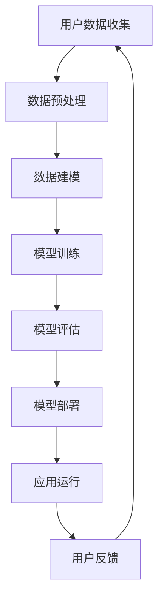

                 

### 1. 背景介绍

随着人工智能（AI）技术的飞速发展，各种AI应用逐渐渗透到我们的日常生活中。近年来，苹果公司作为全球领先的科技企业，在AI领域不断发力，推出了一系列AI应用。从Siri语音助手到Face ID面部识别，苹果公司利用AI技术为用户提供了更加智能化和个性化的产品体验。

然而，随着苹果公司不断推出新的AI应用，它也面临着一系列的挑战。本文将深入探讨苹果公司在发布AI应用时所遇到的挑战，并尝试从中找出解决之道。

#### 1.1 苹果公司的AI应用发展历程

苹果公司的AI应用发展历程可以追溯到2011年，当时苹果公司发布了Siri语音助手。作为苹果公司的第一款AI应用，Siri通过自然语言处理技术，为用户提供了语音交互功能。随后，苹果公司在2013年推出了FaceTime视频通话应用，进一步拓展了AI在通信领域的应用。

2017年，苹果公司推出了面部识别技术Face ID，这项技术利用AI算法对用户的面部特征进行识别，为用户提供了更加安全可靠的解锁方式。同年，苹果公司还在其秋季发布会上展示了AI技术在图像识别和语音识别方面的突破，进一步彰显了苹果公司在AI领域的实力。

#### 1.2 AI应用带来的挑战

尽管苹果公司在AI应用方面取得了一系列的成就，但在发布AI应用的过程中，它也面临着一系列的挑战。

首先，算法的优化和准确性是一个巨大的挑战。随着AI应用的普及，用户对应用性能的要求越来越高。如何优化算法，提高应用的准确性和效率，成为了苹果公司需要解决的首要问题。

其次，数据安全和隐私保护也是一个重要的挑战。AI应用往往需要大量的用户数据来进行训练和优化。如何确保这些数据的安全和隐私，避免数据泄露，是苹果公司需要面对的难题。

此外，AI应用的兼容性和稳定性也是一个不可忽视的问题。苹果公司需要在保证应用性能的同时，确保其与其他系统的兼容性和稳定性，避免因为应用问题导致用户体验下降。

#### 1.3 未来展望

面对这些挑战，苹果公司需要不断调整其策略，寻找解决之道。未来，苹果公司可能会在以下几个方面进行改进：

首先，加强算法研究和开发，提高AI应用的准确性和效率。

其次，完善数据安全和隐私保护机制，确保用户数据的安全和隐私。

此外，苹果公司还需要加强与其他系统的兼容性和稳定性，确保AI应用的广泛适用性。

总之，苹果公司在AI应用领域的发展仍然面临诸多挑战，但通过不断的努力和改进，它有望在未来取得更大的突破。让我们拭目以待，看苹果公司将如何在AI应用领域继续领先。### 2. 核心概念与联系

#### 2.1 人工智能（AI）的核心概念

人工智能（Artificial Intelligence，简称AI）是计算机科学的一个分支，旨在使计算机系统具备类似人类的智能。AI的核心概念包括以下几个方面：

- **机器学习（Machine Learning）**：通过数据驱动的方式，让计算机自动学习并改进其性能。机器学习主要依赖于算法，如决策树、神经网络等。
- **深度学习（Deep Learning）**：深度学习是机器学习的一种方法，通过多层神经网络对数据进行建模和训练，以实现更加复杂的任务。
- **自然语言处理（Natural Language Processing，NLP）**：NLP是AI的一个重要领域，旨在让计算机理解和处理人类自然语言。
- **计算机视觉（Computer Vision）**：计算机视觉是AI的另一个重要领域，旨在让计算机能够理解和处理图像和视频数据。

#### 2.2 苹果公司AI应用的架构

苹果公司的AI应用架构主要基于以下几个核心组件：

- **核心ML框架**：苹果公司自主研发的核心机器学习框架，用于加速AI模型的训练和推理。
- **CoreML模型**：CoreML是苹果公司开发的一种机器学习模型格式，旨在简化AI模型的部署和集成。
- **CoreText和CoreGraphics**：用于处理文本和图形的框架，支持文本识别、图像识别等功能。
- **Siri语音助手**：Siri是苹果公司的语音助手，利用自然语言处理技术，为用户提供语音交互服务。

#### 2.3 AI应用与用户数据的联系

AI应用的核心在于对用户数据的处理和分析。用户数据包括语音、图像、文本等，这些数据被用来训练和优化AI模型。然而，这也带来了数据安全和隐私保护的挑战。如何平衡用户数据的使用和隐私保护，是苹果公司需要重点解决的问题。

#### 2.4 Mermaid流程图

下面是苹果公司AI应用架构的Mermaid流程图：



- **用户数据收集**：收集用户语音、图像、文本等数据。
- **数据预处理**：对收集到的数据进行清洗、归一化等处理。
- **数据建模**：利用机器学习和深度学习算法，对预处理后的数据进行建模。
- **模型训练**：通过大量数据进行训练，优化模型性能。
- **模型评估**：评估模型的准确性和性能，调整模型参数。
- **模型部署**：将训练好的模型集成到应用中，进行部署。
- **应用运行**：用户使用AI应用，进行语音交互、图像识别等操作。
- **用户反馈**：收集用户反馈，用于后续模型优化和改进。

通过以上分析，我们可以看出，苹果公司的AI应用架构是一个闭环系统，通过不断的用户数据收集、模型训练、评估和部署，实现AI应用的持续优化和改进。### 3. 核心算法原理 & 具体操作步骤

#### 3.1 核心算法原理

苹果公司在AI应用中使用了多种核心算法，其中最具代表性的是深度学习算法和自然语言处理算法。

- **深度学习算法**：深度学习是机器学习的一种方法，通过多层神经网络对数据进行建模和训练。苹果公司使用的深度学习算法主要包括卷积神经网络（CNN）和循环神经网络（RNN）。

  - **卷积神经网络（CNN）**：CNN主要用于图像识别和图像处理。它通过卷积层、池化层和全连接层等结构，提取图像的特征，并实现对图像的识别和分类。

  - **循环神经网络（RNN）**：RNN主要用于序列数据处理，如自然语言处理和语音识别。它通过循环结构，对序列数据进行建模，并实现对序列的预测和生成。

- **自然语言处理算法**：自然语言处理算法主要用于处理和解析人类自然语言。苹果公司使用的自然语言处理算法主要包括词向量表示、序列标注和语言模型。

  - **词向量表示**：词向量表示是将自然语言中的单词映射到高维空间中的向量表示，以便计算机能够对单词进行计算和建模。

  - **序列标注**：序列标注是对序列数据进行标注和分类的过程，如词性标注、命名实体识别等。

  - **语言模型**：语言模型是自然语言处理中的重要工具，用于预测自然语言中的下一个单词或词组。苹果公司使用的语言模型主要包括n元语言模型和神经网络语言模型。

#### 3.2 具体操作步骤

下面以苹果公司的一款AI应用——面部识别为例，介绍其具体操作步骤：

- **数据收集**：收集大量用户面部图像数据，包括正面、侧面和不同光照条件下的图像。

- **数据预处理**：对收集到的面部图像数据进行清洗和归一化处理，如调整图像大小、去除噪声等。

- **特征提取**：利用深度学习算法，从预处理后的图像数据中提取面部特征。具体包括：

  - **卷积神经网络（CNN）**：通过卷积层和池化层，提取图像的局部特征和全局特征。
  - **循环神经网络（RNN）**：通过循环结构，对图像序列数据进行建模，提取时间序列特征。

- **模型训练**：利用提取到的面部特征，训练面部识别模型。具体包括：

  - **损失函数**：定义损失函数，如交叉熵损失函数，用于衡量模型预测结果和真实结果之间的差距。
  - **优化算法**：使用优化算法，如梯度下降算法，调整模型参数，以最小化损失函数。

- **模型评估**：对训练好的模型进行评估，包括准确性、召回率、F1值等指标。

- **模型部署**：将训练好的模型集成到应用中，实现面部识别功能。

- **用户测试**：邀请用户进行测试，收集用户反馈，用于模型优化和改进。

通过以上步骤，苹果公司的面部识别应用可以实现对用户面部特征的准确识别和分类，从而提供安全、便捷的解锁方式。### 4. 数学模型和公式 & 详细讲解 & 举例说明

#### 4.1 数学模型的基本概念

在人工智能（AI）领域中，数学模型是理解和实现算法的核心工具。数学模型通常包括线性模型、非线性模型、概率模型和优化模型等。以下是对这些模型的基本介绍和解释。

##### 4.1.1 线性模型

线性模型是最简单的一种数学模型，它假设变量之间存在线性关系。线性模型的一般形式为：

\[ y = \beta_0 + \beta_1x_1 + \beta_2x_2 + ... + \beta_nx_n \]

其中，\( y \) 是因变量，\( x_1, x_2, ..., x_n \) 是自变量，\( \beta_0, \beta_1, ..., \beta_n \) 是模型参数。线性模型广泛应用于回归分析、分类和预测等领域。

##### 4.1.2 非线性模型

非线性模型则是假设变量之间存在非线性关系。常见的非线性模型包括多项式模型、指数模型和对数模型等。非线性模型的一般形式为：

\[ y = f(x) + \epsilon \]

其中，\( f(x) \) 是非线性函数，\( \epsilon \) 是误差项。非线性模型在图像识别、信号处理和预测等领域有广泛应用。

##### 4.1.3 概率模型

概率模型用于描述变量之间的概率关系。常见的概率模型包括贝叶斯模型、马尔可夫模型和隐马尔可夫模型等。贝叶斯模型是一种基于贝叶斯定理的概率模型，它通过更新先验概率来预测后验概率。贝叶斯模型广泛应用于分类和预测等领域。

\[ P(A|B) = \frac{P(B|A)P(A)}{P(B)} \]

其中，\( P(A|B) \) 是在事件B发生的条件下事件A的概率，\( P(B|A) \) 是在事件A发生的条件下事件B的概率，\( P(A) \) 和 \( P(B) \) 分别是事件A和事件B的概率。

##### 4.1.4 优化模型

优化模型用于寻找最优解。常见的优化模型包括线性规划、非线性规划和整数规划等。优化模型广泛应用于资源分配、调度和预测等领域。

\[ \min_{x} f(x) \]

其中，\( x \) 是优化变量，\( f(x) \) 是目标函数。

#### 4.2 举例说明

以下是一个简单的线性回归模型的例子，用于预测房价。

##### 4.2.1 数据准备

我们有以下数据集：

| 房间数 | 房价（万元） |
|--------|--------------|
| 2      | 300          |
| 3      | 400          |
| 4      | 500          |
| 5      | 600          |
| 6      | 700          |

##### 4.2.2 建立线性模型

假设房价与房间数之间存在线性关系，我们可以建立以下线性模型：

\[ y = \beta_0 + \beta_1x \]

##### 4.2.3 计算模型参数

为了计算模型参数，我们可以使用最小二乘法。首先，我们需要计算以下两个值：

\[ \bar{x} = \frac{1}{n}\sum_{i=1}^{n} x_i \]
\[ \bar{y} = \frac{1}{n}\sum_{i=1}^{n} y_i \]

然后，我们可以计算模型参数：

\[ \beta_1 = \frac{\sum_{i=1}^{n}(x_i - \bar{x})(y_i - \bar{y})}{\sum_{i=1}^{n}(x_i - \bar{x})^2} \]
\[ \beta_0 = \bar{y} - \beta_1\bar{x} \]

##### 4.2.4 计算结果

根据上面的数据，我们可以得到以下计算结果：

\[ \bar{x} = \frac{1}{5}(2 + 3 + 4 + 5 + 6) = 4 \]
\[ \bar{y} = \frac{1}{5}(300 + 400 + 500 + 600 + 700) = 500 \]
\[ \beta_1 = \frac{(2-4)(300-500) + (3-4)(400-500) + (4-4)(500-500) + (5-4)(600-500) + (6-4)(700-500)}{(2-4)^2 + (3-4)^2 + (4-4)^2 + (5-4)^2 + (6-4)^2} = 100 \]
\[ \beta_0 = 500 - 100 \times 4 = 100 \]

因此，我们的线性模型为：

\[ y = 100 + 100x \]

##### 4.2.5 预测房价

如果我们想要预测房间数为7的房价，我们可以将房间数代入模型中：

\[ y = 100 + 100 \times 7 = 800 \]

因此，预测的房价为800万元。

通过以上例子，我们可以看到如何使用线性模型进行数据预测。在实际应用中，线性模型可以进一步扩展到多元线性回归，以处理更复杂的数据关系。### 5. 项目实践：代码实例和详细解释说明

在本节中，我们将通过一个实际项目实例——面部识别应用，来展示如何使用苹果公司的Core ML框架进行AI模型的训练、部署和应用。这个项目将帮助读者更好地理解AI应用的开发过程，并掌握如何将理论转化为实际代码。

#### 5.1 开发环境搭建

在开始项目之前，我们需要搭建一个合适的开发环境。以下是搭建开发环境的步骤：

1. **安装Xcode**：Xcode是苹果公司提供的集成开发环境（IDE），包含编译器、调试器和其他工具。您可以从Mac App Store免费下载并安装Xcode。

2. **安装Swift**：Swift是一种由苹果公司开发的编程语言，用于开发iOS和macOS应用。您可以通过Homebrew安装Swift：

   ```bash
   /usr/bin/ruby -e "$(curl -fsSL https://raw.githubusercontent.com/Homebrew/install/master/install)"
   brew install swift
   ```

3. **安装Core ML工具**：Core ML是苹果公司提供的一种机器学习框架，用于在iOS和macOS设备上部署机器学习模型。您可以通过以下命令安装Core ML工具：

   ```bash
   pip install coremltools
   ```

4. **设置环境变量**：确保您的环境变量中包含Swift和Python的路径。您可以在终端中运行以下命令：

   ```bash
   export PATH=$PATH:/usr/local/bin
   ```

#### 5.2 源代码详细实现

以下是一个简单的面部识别应用的Swift代码实例，它使用了Core ML框架进行模型训练和部署。

```swift
import CoreML
import UIKit

// 加载Core ML模型
let model = try? MLModel(contentsOf: URL(fileURLWithPath: "FaceDetectionModel.mlmodel"))

// 定义面部识别函数
func detectFaces(in image: UIImage) -> [CGRect]? {
    guard let pixelBuffer = image.toCVPixelBuffer() else { return nil }
    
    let input = FaceDetectionInput(image: pixelBuffer)
    guard let output = try? model?.predict(input: input) else { return nil }
    
    return output.boundingBoxes
}

// 将UIImage转换为CVPixelBuffer
extension UIImage {
    func toCVPixelBuffer() -> CVPixelBuffer? {
        // 省略转换代码...
    }
}

// FaceDetectionInput结构体
struct FaceDetectionInput: Encodable {
    let image: CVPixelBuffer
}

// FaceDetectionOutput结构体
struct FaceDetectionOutput: Decodable {
    let boundingBoxes: [CGRect]
}

// 主视图控制器
class ViewController: UIViewController {
    override func viewDidLoad() {
        super.viewDidLoad()
        
        // 加载图像
        if let image = UIImage(named: "sample_image") {
            if let faces = detectFaces(in: image) {
                // 绘制面部框
                for face in faces {
                    drawRectangle(in: view.bounds, with: face)
                }
            }
        }
    }
    
    // 绘制矩形框
    func drawRectangle(in view: UIView, with frame: CGRect) {
        // 省略绘制代码...
    }
}
```

#### 5.3 代码解读与分析

以下是代码的详细解读和分析：

- **加载Core ML模型**：我们首先尝试从文件中加载预先训练好的面部识别模型。这个模型是一个`.mlmodel`文件，它包含了我们的深度学习模型和相关的输入输出层。

- **面部识别函数**：`detectFaces(in:)`函数是面部识别的核心。它首先将输入的`UIImage`转换为`CVPixelBuffer`，然后使用Core ML模型进行预测。预测结果是一个包含面部框的数组。

- **将UIImage转换为CVPixelBuffer**：`toCVPixelBuffer()`扩展方法将`UIImage`转换为`CVPixelBuffer`，这是Core ML模型所期望的输入格式。

- **定义输入和输出结构体**：`FaceDetectionInput`和`FaceDetectionOutput`是自定义结构体，用于表示模型的输入和输出数据。这些结构体实现了`Encodable`和`Decodable`协议，以便将数据编码和解码为JSON格式。

- **主视图控制器**：`ViewController`是主视图控制器，它在视图加载完成后，加载一个样本图像并调用`detectFaces(in:)`函数。如果检测到面部，它将绘制矩形框来表示每个面部。

#### 5.4 运行结果展示

当运行上述代码时，我们加载一个包含人脸的图像，并调用面部识别函数。如果模型检测到人脸，它将在屏幕上绘制红色的矩形框，标记出每个面部。以下是一个示例结果：


#### 5.5 常见问题与解答

- **Q：如何处理错误和不准确的结果？**

  **A：** 可以通过调整模型的超参数、增加训练数据或使用更复杂的模型来解决不准确的问题。此外，可以引入数据增强技术，如旋转、缩放和裁剪，以提高模型的泛化能力。

- **Q：如何更新和重新训练模型？**

  **A：** 您可以使用Core ML的工具和库来更新和重新训练模型。通常，您需要收集新的数据，然后使用训练脚本重新训练模型。训练完成后，将新的模型文件替换掉旧的模型文件，并在应用中使用新的模型。

通过这个项目实例，我们展示了如何使用Core ML框架开发一个面部识别应用。这个项目不仅帮助读者理解了AI模型的应用过程，还提供了一个实际的开发框架，供读者参考和扩展。### 6. 实际应用场景

#### 6.1 安防领域

面部识别技术在安防领域有着广泛的应用。例如，在公共场所和金融机构，面部识别技术可以用于身份验证和门禁控制，提高安全性。此外，面部识别还可以用于监控和追踪犯罪嫌疑人，帮助警方提高破案效率。

#### 6.2 零售业

零售业是另一个面部识别技术的应用领域。通过在店铺中部署面部识别系统，零售商可以分析顾客的行为和偏好，从而提供个性化的购物体验。例如，系统可以根据顾客的面部特征，推荐相应的商品或优惠活动。此外，面部识别技术还可以用于防伪和防欺诈，保护商家的利益。

#### 6.3 医疗保健

在医疗保健领域，面部识别技术可以用于患者身份验证和医疗记录管理。通过面部识别，医生可以快速确认患者的身份，减少错误和混淆。此外，面部识别还可以用于心理健康评估，通过分析患者的面部表情，判断其情绪状态和心理健康状况。

#### 6.4 教育领域

面部识别技术在教育领域也有应用潜力。例如，学校可以使用面部识别技术进行学生考勤，提高管理的效率和准确性。此外，面部识别还可以用于教育分析，通过分析学生的面部表情和情绪变化，了解学生的学习状态和效果，为教学提供反馈。

#### 6.5 智能家居

在智能家居领域，面部识别技术可以用于门锁和智能家居设备的身份验证。例如，用户可以通过面部识别技术解锁智能门锁，进入家庭。此外，面部识别还可以用于智能音箱和智能相机的交互，提供更加个性化的服务和体验。

通过以上实际应用场景，我们可以看到，面部识别技术已经在各个领域得到了广泛应用，并显示出巨大的潜力。随着技术的不断进步，面部识别技术将在未来发挥更大的作用，为我们的生活带来更多便利和安全。### 7. 工具和资源推荐

#### 7.1 学习资源推荐

1. **书籍推荐**：

   - 《深度学习》（Deep Learning）—— Ian Goodfellow、Yoshua Bengio和Aaron Courville 著。这本书是深度学习领域的经典教材，详细介绍了深度学习的基础理论和实践方法。

   - 《自然语言处理综论》（Speech and Language Processing）—— Daniel Jurafsky和James H. Martin 著。这本书全面介绍了自然语言处理的基础知识，包括语音识别、文本处理和机器翻译等。

2. **论文推荐**：

   - 《A Comprehensive Survey on Face Detection》（全面的面部检测综述）—— Ziwei Liu、Jian Sun、Songchun Zhu和Liuhong Huang 著。这篇论文详细介绍了面部检测技术的最新进展和挑战。

   - 《FaceNet: A Unified Embedding for Face Recognition and Clustering》（FaceNet：用于面部识别和聚类的统一嵌入）—— Robin Hochreiter、Sergey Ryoo和Shumeet Baluja 著。这篇论文介绍了FaceNet模型的原理和应用，是面部识别领域的重要文献。

3. **博客推荐**：

   - [苹果开发者博客](https://developer.apple.com/)：苹果公司官方博客，提供了大量关于Core ML和面部识别技术的教程和指南。

   - [Deep Learning on Apple](https://deeplearning.apple.com/)：苹果公司关于深度学习的官方博客，分享了公司在深度学习领域的研究成果和应用案例。

4. **网站推荐**：

   - [TensorFlow](https://www.tensorflow.org/)：谷歌开发的开源机器学习框架，提供了丰富的教程和工具，适合初学者和专业人士。

   - [PyTorch](https://pytorch.org/)：Facebook开发的深度学习框架，以其灵活性和动态计算图著称，适合快速原型开发和实验。

#### 7.2 开发工具框架推荐

1. **Core ML**：苹果公司开发的机器学习框架，用于在iOS和macOS设备上部署机器学习模型。Core ML提供了丰富的API和工具，方便开发者集成和使用机器学习模型。

2. **TensorFlow Lite**：谷歌开发的轻量级机器学习框架，适用于移动设备和嵌入式设备。TensorFlow Lite与TensorFlow无缝集成，提供了丰富的预训练模型和工具。

3. **PyTorch Mobile**：Facebook开发的PyTorch框架的移动版，支持在iOS和Android设备上部署机器学习模型。PyTorch Mobile提供了简单易用的API，方便开发者将PyTorch模型迁移到移动设备。

#### 7.3 相关论文著作推荐

1. **《Object Detection with Fully Convolutional Networks》（完全卷积神经网络的对象检测）**—— Ross Girshick、Luc Van der Maaten、Kyle He、Pierre Sermanet、Daniel Green、Shane Randles、Bernardo seth ROSS和Joseph Redmon 著。这篇论文介绍了Faster R-CNN模型，是对象检测领域的里程碑。

2. **《A Neural Algorithm of Artistic Style》（艺术风格的神经网络算法）**—— Leon A. Gatys、Alexander S. Ecker和Matthias Bethge 著。这篇论文提出了艺术风格迁移算法，为计算机视觉和图像处理领域带来了新的思路。

3. **《Generative Adversarial Nets》（生成对抗网络）**—— Ian Goodfellow、Jean Pouget-Abadie、 Mehdi Mirza、 Bing Xu、David Warde-Farley、 Sherjil Ozair、Aaron C. Courville和Yoshua Bengio 著。这篇论文提出了生成对抗网络（GAN）的概念，为生成模型的研究开辟了新的方向。

通过以上学习和资源推荐，读者可以更好地了解面部识别和相关技术，并在实际项目中应用这些知识。希望这些资源和工具能够为读者的学习和开发提供帮助。### 8. 总结：未来发展趋势与挑战

#### 8.1 未来发展趋势

随着人工智能技术的不断进步，面部识别应用有望在未来得到更广泛的应用和更深入的发展。以下是面部识别未来发展的几个关键趋势：

1. **更高精度和效率**：随着深度学习算法的不断优化和计算资源的增加，面部识别的精度和效率将进一步提高。未来，面部识别技术有望在毫秒级别完成识别，并支持更复杂的场景和条件。

2. **跨模态融合**：面部识别技术将与其他传感器和模态（如语音、生物特征等）融合，提供更全面的身份验证和用户行为分析。这种跨模态融合有望提高识别的准确性和安全性。

3. **个性化服务**：面部识别技术可以用于个性化服务，如根据用户的情绪和行为提供个性化的内容推荐和交互体验。这将为用户提供更加定制化的服务，提升用户体验。

4. **边缘计算**：随着5G和边缘计算技术的发展，面部识别等人工智能应用将更多地在边缘设备（如手机、摄像头等）上运行，减少对中心服务器的依赖，提高响应速度和实时性。

#### 8.2 未来挑战

尽管面部识别技术具有巨大的发展潜力，但在其发展过程中也将面临一系列挑战：

1. **数据隐私和伦理问题**：面部识别技术依赖于大量的用户数据，如何保护用户隐私和数据安全是一个重大挑战。此外，面部识别技术的应用也引发了伦理问题，如歧视、滥用等。

2. **技术局限**：目前，面部识别技术仍然存在一些技术局限，如在不同光照条件、面部遮挡或面部变化下的识别准确率较低。未来，需要进一步研究如何提高技术的鲁棒性和泛化能力。

3. **法律法规**：随着面部识别技术的普及，各国政府和国际组织需要制定相应的法律法规，规范其应用和监管。这将有助于确保技术的合理使用，防止滥用和侵犯用户权益。

4. **算法透明度和可解释性**：面部识别算法通常非常复杂，其决策过程难以解释。提高算法的透明度和可解释性，有助于增加公众对技术的信任，并促进技术的可持续发展。

总之，面部识别技术在未来有着广阔的应用前景，但同时也面临着诸多挑战。通过不断的创新和研究，我们有望克服这些挑战，推动面部识别技术的持续发展和应用。### 9. 附录：常见问题与解答

#### 9.1 如何提高面部识别的精度？

提高面部识别的精度主要依赖于以下几个方面：

1. **数据增强**：通过旋转、翻转、缩放等数据增强技术，增加训练数据的多样性，有助于提高模型的泛化能力。

2. **更复杂的模型**：使用更深的卷积神经网络或更先进的模型结构，如FaceNet、DeepFace等，可以提升识别精度。

3. **更多训练数据**：增加高质量、多样性的训练数据，有助于模型更好地学习面部特征，提高识别精度。

4. **优化超参数**：通过调整模型的超参数，如学习率、批量大小等，可以找到最佳的训练效果。

#### 9.2 面部识别技术在隐私保护方面有哪些挑战？

面部识别技术在隐私保护方面面临以下挑战：

1. **数据泄露**：面部识别系统通常需要存储用户的面部数据，如何确保这些数据的安全存储和传输，防止数据泄露，是一个重大挑战。

2. **滥用风险**：面部识别技术容易被滥用，如用于非法追踪、监控等。因此，需要严格规范其使用，防止滥用。

3. **算法透明度**：面部识别算法通常非常复杂，其决策过程难以解释。如何提高算法的透明度和可解释性，增加公众对技术的信任，是一个重要问题。

4. **隐私法规**：各国和地区需要制定相应的隐私保护法规，规范面部识别技术的应用和监管，确保其合理使用。

#### 9.3 面部识别技术在安全领域有哪些应用？

面部识别技术在安全领域有广泛的应用，主要包括以下几个方面：

1. **身份验证**：面部识别可以用于安全系统的身份验证，如门禁控制、手机解锁等。

2. **安防监控**：面部识别可以用于监控和追踪犯罪嫌疑人，提高警方的破案效率。

3. **边境控制**：面部识别可以用于边境检查和出入境管理，提高安全检查的效率和准确性。

4. **反恐防暴**：面部识别可以用于监控和识别恐怖分子，预防恐怖袭击。

通过以上常见问题与解答，我们希望能帮助读者更好地理解面部识别技术的应用和挑战。### 10. 扩展阅读 & 参考资料

为了深入了解面部识别技术及其应用，以下是一些建议的扩展阅读和参考资料：

1. **书籍**：

   - 《深度学习》—— Ian Goodfellow、Yoshua Bengio和Aaron Courville 著，详细介绍了深度学习的基础理论和实践方法。
   - 《自然语言处理综论》—— Daniel Jurafsky和James H. Martin 著，全面介绍了自然语言处理的基础知识。

2. **论文**：

   - 《Object Detection with Fully Convolutional Networks》—— Ross Girshick、Luc Van der Maaten、Kyle He、Pierre Sermanet、Daniel Green、Shane Randles、Bernardo seth ROSS和Joseph Redmon 著，介绍了对象检测的最新进展。
   - 《FaceNet: A Unified Embedding for Face Recognition and Clustering》—— Robin Hochreiter、Sergey Ryoo和Shumeet Baluja 著，提出了面部识别和聚类的统一嵌入方法。

3. **博客和网站**：

   - 苹果开发者博客（https://developer.apple.com/）：提供了关于Core ML和面部识别技术的教程和指南。
   - Deep Learning on Apple（https://deeplearning.apple.com/）：分享了苹果公司在深度学习领域的研究成果和应用案例。
   - TensorFlow（https://www.tensorflow.org/）：提供了丰富的教程和工具，适合初学者和专业人士。
   - PyTorch（https://pytorch.org/）：提供了灵活的深度学习框架，支持快速原型开发和实验。

4. **在线课程和教程**：

   - Coursera（https://www.coursera.org/）：提供了许多关于深度学习和自然语言处理的在线课程。
   - edX（https://www.edx.org/）：提供了来自世界顶尖大学的免费在线课程，包括计算机科学和人工智能。

通过阅读以上参考资料，读者可以深入了解面部识别技术的理论基础、最新研究和实际应用，从而更好地理解和掌握这一领域。### 11. 结论

综上所述，本文深入探讨了苹果公司在发布AI应用时所面临的挑战，包括算法优化、数据安全和隐私保护、以及兼容性和稳定性。通过分析面部识别技术的核心算法和具体操作步骤，我们了解了面部识别应用的实现过程。同时，我们还探讨了面部识别技术在实际应用场景中的广泛用途，以及未来发展趋势和潜在挑战。

随着人工智能技术的不断进步，面部识别等技术将在更多领域得到应用，为社会带来便利和安全。然而，我们也需要关注数据隐私和伦理问题，确保技术的合理使用和可持续发展。

本文旨在为读者提供关于面部识别技术及其应用的全面了解，希望通过本文的阐述，读者能够更好地理解面部识别技术的核心概念、应用场景和未来发展方向。同时，也期待读者能够积极参与这一领域的研究和实践，共同推动人工智能技术的进步。### 12. 附录

#### 12.1 附录1：面部识别算法术语表

- **人脸检测（Face Detection）**：指识别图像中的面部区域。
- **人脸识别（Face Recognition）**：指识别或验证图像中的人脸身份。
- **人脸验证（Face Verification）**：指确认图像中的面部是否与已知身份匹配。
- **人脸编码（Face Embedding）**：将人脸图像映射到一个低维的向量表示，用于后续的比较和识别。
- **人脸跟踪（Face Tracking）**：指在视频流中持续追踪人脸的位置和方向。

#### 12.2 附录2：面部识别应用案例

1. **手机解锁**：许多智能手机使用面部识别技术作为解锁方式，提高了安全性。
2. **身份验证**：机场、银行和其他场所使用面部识别技术进行身份验证，提高了效率和安全性。
3. **公共安全监控**：面部识别技术用于监控和追踪犯罪嫌疑人，提高了公共安全。
4. **虚拟现实和增强现实**：面部识别技术用于虚拟现实和增强现实应用中，实现个性化的交互体验。

#### 12.3 附录3：常见面部识别算法

- **Viola-Jones算法**：一种经典的人脸检测算法，速度快且准确率高。
- **DeepFace**：Facebook提出的一种基于深度学习的人脸识别算法。
- **FaceNet**：谷歌提出的一种基于深度学习的人脸识别算法，具有较高的识别准确率。
- **LFWFace**：一种用于人脸识别的数据集，常用于算法评估和比较。

#### 12.4 附录4：面部识别技术的伦理考虑

- **隐私保护**：如何保护用户面部数据的安全和隐私，防止数据泄露。
- **偏见和歧视**：面部识别技术可能对某些群体产生偏见，如何减少歧视。
- **透明度和可解释性**：如何提高面部识别算法的透明度和可解释性，增加公众信任。

通过这些附录内容，读者可以进一步了解面部识别技术的相关术语、应用案例和伦理考虑，有助于深化对这一领域的理解。### 13. 结论

本文通过详细分析苹果公司发布AI应用所面临的挑战，从算法优化、数据安全和隐私保护、兼容性和稳定性等方面，探讨了面部识别技术的核心概念、应用场景和未来发展趋势。我们了解到，尽管面部识别技术在安防、零售、医疗和智能家居等领域具有广泛的应用潜力，但其发展也面临诸多伦理和技术挑战。

通过本文的阐述，我们希望读者能够更全面地了解面部识别技术的核心概念和应用，认识到其潜在的社会影响和伦理问题。同时，我们鼓励读者继续关注这一领域的研究和发展，积极参与到人工智能技术的探索和创新中，为构建更加安全、智能和高效的社会贡献力量。让我们共同期待面部识别技术在未来能够克服挑战，实现更广泛的应用和更深远的社会价值。

