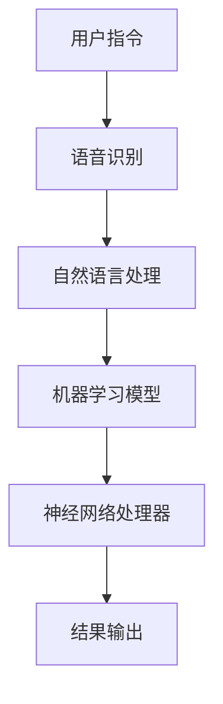

                 

### 背景介绍

#### 苹果与AI的交汇

近年来，人工智能（AI）技术在各个领域的应用日益广泛，从自动驾驶、智能助手到医疗诊断，AI 正在深刻改变着我们的生活。在这样一个技术大潮中，苹果公司作为全球科技行业的领导者，自然不能缺席。苹果公司一直致力于将AI技术与用户日常生活紧密相连，以提供更加智能化、个性化的产品体验。

#### AI应用的崛起

随着AI技术的不断成熟，AI应用开始出现在我们的智能手机、平板电脑等设备中。这些应用涵盖了从语音识别、图像处理到智能推荐等各个方面，极大地提升了设备的交互能力和用户体验。苹果公司也不例外，近年来在iOS和macOS系统中不断推出新的AI功能，如Siri、FaceTime、Animoji等，受到了用户的一致好评。

#### 苹果发布AI应用的背后

苹果公司发布AI应用不仅是为了提升用户体验，更是为了在科技竞争中占据有利地位。AI技术的发展已经成为全球科技巨头争夺的焦点，苹果公司需要通过不断推出创新的AI应用来巩固其在市场上的领先地位。此外，苹果公司希望通过AI技术推动产业链的升级，从而在硬件、软件、服务等多个层面实现突破。

#### 本文目的

本文将深入探讨苹果发布AI应用的文化价值，从技术、市场、产业等多个角度进行分析。我们将首先回顾苹果在AI领域的探索历程，然后详细分析苹果发布AI应用的核心技术和具体实现，最后探讨这些AI应用对苹果公司及整个科技产业的深远影响。希望通过这篇文章，读者能够对苹果AI应用有更全面、深入的理解。

### 1.1 苹果在AI领域的探索历程

#### 初期的尝试

早在2010年，苹果公司就开始在AI领域进行初步探索。当时，苹果收购了以色列的初创公司PrimeSense，这家公司曾开发出用于Nintendo Wii的深度传感器技术。这一技术为苹果提供了重要的基础，使得苹果能够在后续的产品中实现更先进的3D识别和手势控制功能。

#### 2011年：Siri的诞生

2011年，苹果公司正式发布了智能语音助手Siri。Siri最初是基于自然语言处理和机器学习技术开发的，其目标是让用户通过语音命令来控制手机。这一尝试在当时引起了广泛关注，也被视为苹果在AI领域的重要一步。虽然Siri在初期遇到了不少挑战，如误识别、响应速度慢等问题，但苹果并未放弃，通过不断优化和更新，Siri逐渐变得更加智能和可靠。

#### 2013年：收购Turi

2013年，苹果公司收购了机器学习初创公司Turi，并将其技术整合到自己的产品中。Turi的机器学习技术被广泛应用于苹果的推荐系统、图像识别和智能搜索等功能。这次收购标志着苹果在AI领域的发展进入了一个新的阶段，开始更加重视AI技术在产品中的应用。

#### 2017年：神经引擎和Core ML

2017年，苹果公司在WWDC（苹果全球开发者大会）上推出了神经引擎（Neural Engine）和Core ML（苹果机器学习框架）。神经引擎是苹果在iPhone X中引入的专用硬件，用于加速机器学习任务的执行。Core ML则为开发者提供了一个强大的工具，使得他们能够将机器学习模型集成到iOS和macOS应用程序中。这两项技术的推出，使得苹果的产品在AI性能上取得了显著提升。

#### 近年的发展

近年来，苹果在AI领域的探索继续深化。例如，苹果在2020年推出了增强现实（AR）平台ARKit 4，使得开发者能够利用AI技术为用户提供更加丰富和逼真的AR体验。此外，苹果还在2021年发布了语音识别引擎Siri Shortcuts，进一步提升了用户与设备的交互体验。

通过这些努力，苹果公司在AI领域的探索取得了显著成果，不仅提升了自身产品的竞争力，也为整个科技行业的发展做出了贡献。

#### 苹果发布AI应用的文化价值

苹果在AI领域的探索不仅带来了技术上的突破，更在文化层面产生了深远的影响。以下是一些具体的方面：

**1. 智能化生活理念**：苹果通过不断推出AI应用，推动了智能化生活理念的普及。这些应用使得设备能够更加智能地理解和满足用户需求，提升了用户的日常体验。例如，Siri的语音识别和智能助手功能，让用户能够通过语音命令轻松完成各种操作，大大简化了交互过程。

**2. 创新的科技文化**：苹果在AI领域的持续投入和创新，也推动了整个科技行业的创新文化。苹果的成功案例激励了其他科技公司加大对AI技术的投入和研发，从而推动了整个行业的进步。

**3. 用户体验至上**：苹果始终将用户体验放在首位，通过不断优化AI技术，为用户提供更加优质的产品和服务。这种以用户为中心的文化，不仅提升了苹果的品牌价值，也为整个科技行业树立了榜样。

**4. 数据安全和隐私保护**：随着AI技术的发展，数据安全和隐私保护成为越来越重要的问题。苹果在AI应用的开发中，始终注重数据安全和隐私保护，通过加密技术和隐私保护措施，确保用户的数据安全。

**5. 产业链升级**：苹果通过在AI领域的探索，推动了产业链的升级和转型。例如，神经引擎和Core ML技术的引入，不仅提升了苹果自身产品的性能，也为供应商和开发者提供了新的业务机会。

总之，苹果在AI领域的探索不仅带来了技术的进步，更在文化层面产生了深远的影响。这些影响不仅体现在苹果自身的产品和服务中，也对整个科技行业产生了积极的推动作用。

### 1.2 核心概念与联系

#### AI技术的核心概念

人工智能（AI）是一种通过模拟人类智能行为来实现计算机自动化任务的技术。它包括多个子领域，如机器学习、深度学习、自然语言处理等。在这些子领域中，机器学习是AI的核心技术之一。机器学习通过算法和统计模型，使计算机能够从数据中学习和发现规律，从而实现自主决策和预测。

#### 苹果AI应用的架构

苹果公司在AI应用的开发中，采用了多种技术和架构，以确保应用的高效性和可靠性。以下是苹果AI应用的核心架构：

**1. 神经引擎（Neural Engine）**：神经引擎是苹果在iPhone X中引入的专用硬件，用于加速机器学习任务的执行。它包含多个神经网络处理器，能够高效地处理语音识别、图像处理等复杂任务。

**2. Core ML（苹果机器学习框架）**：Core ML是苹果提供的一个机器学习框架，使得开发者能够将机器学习模型集成到iOS和macOS应用程序中。Core ML支持多种机器学习模型，包括卷积神经网络（CNN）、循环神经网络（RNN）等，并提供了丰富的API和工具，方便开发者进行模型部署和优化。

**3. Siri Shortcuts**：Siri Shortcuts是苹果在2021年推出的一项功能，它允许用户通过简单的语音命令来执行一系列操作。Siri Shortcuts结合了自然语言处理和机器学习技术，能够智能地理解和执行用户的指令。

#### 核心概念的联系

苹果AI应用中的核心概念和技术，相互之间有着紧密的联系。以下是它们之间的关联：

**1. 机器学习与神经网络处理器**：机器学习是AI的核心技术之一，神经网络处理器则是苹果为实现高效机器学习任务而引入的硬件。神经网络处理器能够加速神经网络模型的计算，从而提高机器学习任务的执行效率。

**2. Core ML与开发者工具**：Core ML是苹果为开发者提供的一个强大工具，它使得开发者能够将机器学习模型集成到应用程序中。Core ML不仅支持多种机器学习模型，还提供了丰富的API和工具，方便开发者进行模型部署和优化。

**3. Siri Shortcuts与自然语言处理**：Siri Shortcuts结合了自然语言处理和机器学习技术，能够智能地理解和执行用户的指令。通过Siri Shortcuts，用户可以使用简单的语音命令来执行复杂的操作，大大简化了交互过程。

**4. 神经引擎与语音识别**：神经引擎在语音识别任务中发挥着重要作用。它能够快速地处理语音信号，并将其转换为文本，从而实现实时语音识别。这对于Siri等智能助手的功能实现至关重要。

通过这些核心概念和技术的相互结合，苹果的AI应用得以实现高效、智能的用户体验。这些技术不仅提升了苹果产品的竞争力，也为整个科技行业的发展做出了贡献。

#### Mermaid流程图

以下是一个简化的Mermaid流程图，展示了苹果AI应用的核心概念和架构之间的联系：



**图1：苹果AI应用的核心概念与联系流程图**

- **用户指令**：用户通过Siri或其他方式输入指令。
- **语音识别**：神经引擎处理语音信号，将其转换为文本。
- **自然语言处理**：对转换后的文本进行处理，理解用户意图。
- **机器学习模型**：Core ML加载并运行预训练的机器学习模型。
- **神经网络处理器**：加速机器学习模型的计算。
- **结果输出**：将处理结果输出给用户。

这个流程图简洁明了地展示了苹果AI应用的工作流程，帮助读者更好地理解其中的核心概念和联系。

### 1.3 核心算法原理 & 具体操作步骤

#### 1.3.1 机器学习算法原理

机器学习是一种通过训练算法从数据中学习模式和规律，使其能够对未知数据进行预测或分类的方法。在机器学习算法中，常见的算法包括线性回归、逻辑回归、决策树、支持向量机、神经网络等。

**线性回归**：线性回归是一种用于预测数值型变量的算法。它通过找到一个最佳拟合直线，使数据点的总误差最小。具体步骤如下：

1. **数据预处理**：对输入数据集进行预处理，包括归一化、缺失值处理等。
2. **特征选择**：选择对预测目标有显著影响的特征。
3. **模型训练**：通过最小二乘法或其他优化算法，找到最佳拟合直线。
4. **模型评估**：通过交叉验证等方法评估模型性能。

**逻辑回归**：逻辑回归是一种用于分类问题的算法，主要用于预测二分类结果。它通过找到一个最佳拟合曲线，将特征空间划分为两个区域。具体步骤如下：

1. **数据预处理**：对输入数据集进行预处理，包括归一化、缺失值处理等。
2. **特征选择**：选择对预测目标有显著影响的特征。
3. **模型训练**：通过梯度下降法或其他优化算法，找到最佳拟合曲线。
4. **模型评估**：通过交叉验证等方法评估模型性能。

**决策树**：决策树是一种基于特征值进行划分的算法，通过构建一棵树来对数据集进行分类或回归。具体步骤如下：

1. **数据预处理**：对输入数据集进行预处理，包括归一化、缺失值处理等。
2. **特征选择**：选择对预测目标有显著影响的特征。
3. **树构建**：通过递归划分数据集，构建决策树。
4. **模型评估**：通过剪枝等方法优化决策树。

**支持向量机**：支持向量机是一种用于分类和回归问题的算法，通过找到一个最优超平面，将数据划分为不同的类别。具体步骤如下：

1. **数据预处理**：对输入数据集进行预处理，包括归一化、缺失值处理等。
2. **特征选择**：选择对预测目标有显著影响的特征。
3. **模型训练**：通过求解最优超平面，训练支持向量机。
4. **模型评估**：通过交叉验证等方法评估模型性能。

**神经网络**：神经网络是一种基于人工神经元的计算模型，通过多层神经网络对数据进行处理，实现复杂函数的拟合。具体步骤如下：

1. **数据预处理**：对输入数据集进行预处理，包括归一化、缺失值处理等。
2. **特征选择**：选择对预测目标有显著影响的特征。
3. **模型训练**：通过反向传播算法，训练神经网络。
4. **模型评估**：通过交叉验证等方法评估模型性能。

#### 1.3.2 Siri语音识别的具体操作步骤

**Siri语音识别是苹果AI应用中的一项核心功能，它通过以下步骤实现语音到文本的转换：**

1. **语音采集**：Siri通过麦克风收集用户的语音输入。
2. **语音预处理**：对采集到的语音信号进行降噪、去背景等处理，以提高识别准确性。
3. **特征提取**：将处理后的语音信号转换为特征向量，常用的特征提取方法包括MFCC（梅尔频率倒谱系数）和频谱特征。
4. **声学模型**：声学模型是一个统计模型，用于预测每个时间点上最可能的声学特征向量。Siri使用了一个大规模的声学模型，通常是基于深度神经网络。
5. **语言模型**：语言模型用于预测用户语音输入的词序列。Siri使用了一个基于N-gram的语言模型，结合历史数据和上下文信息。
6. **解码**：通过结合声学模型和语言模型，Siri使用解码算法（如隐马尔可夫模型Viterbi算法或基于神经网络的端到端解码器）来生成最终的文本输出。

#### 1.3.3 Core ML模型集成

**Core ML是苹果提供的一个机器学习框架，用于将训练好的模型集成到iOS和macOS应用程序中。以下是Core ML模型集成的主要步骤：**

1. **模型训练**：在训练环境中使用合适的数据集和算法训练模型，确保模型具有良好的性能。
2. **模型导出**：将训练好的模型导出为Core ML格式（.mlmodel文件）。
3. **集成到应用程序**：将Core ML模型文件添加到Xcode项目中，并在应用程序代码中引用。
4. **模型加载**：在应用程序运行时，从项目中加载Core ML模型。
5. **模型预测**：使用Core ML提供的API，对输入数据进行预测，并获取预测结果。
6. **模型评估**：通过评估模型在测试集上的性能，调整模型参数和超参数，以进一步提高模型性能。

通过以上步骤，开发者可以轻松地将机器学习模型集成到应用程序中，为用户提供智能化的服务。

### 1.4 数学模型和公式 & 详细讲解 & 举例说明

在深入探讨苹果AI应用的核心算法原理时，理解相关的数学模型和公式是至关重要的。以下是几种常用的机器学习算法及其相关的数学模型和公式的详细讲解，并通过具体例子进行说明。

#### 1.4.1 线性回归

线性回归是一种简单的预测算法，用于找到数据集中的线性关系。其数学模型可以表示为：

\[ y = \beta_0 + \beta_1x + \epsilon \]

其中，\( y \) 是因变量，\( x \) 是自变量，\( \beta_0 \) 和 \( \beta_1 \) 是模型的参数，\( \epsilon \) 是误差项。

**举例说明**：

假设我们有一个简单的线性回归模型，用于预测房价。数据集包含房屋的面积（自变量 \( x \)）和房价（因变量 \( y \)）。以下是一个具体的数据示例：

| 面积（平方米） | 价格（美元） |
| -------------- | ----------- |
| 1000           | 200,000     |
| 1200           | 250,000     |
| 1500           | 300,000     |
| 1800           | 350,000     |

我们希望找到面积和价格之间的线性关系。首先，我们需要计算模型的参数 \( \beta_0 \) 和 \( \beta_1 \)：

\[ \beta_1 = \frac{\sum(x_i - \bar{x})(y_i - \bar{y})}{\sum(x_i - \bar{x})^2} \]
\[ \beta_0 = \bar{y} - \beta_1\bar{x} \]

其中，\( \bar{x} \) 和 \( \bar{y} \) 分别是面积和价格的均值。

计算得到：

\[ \beta_1 = \frac{(1000 - 1350)(200000 - 275000) + (1200 - 1350)(250000 - 275000) + (1500 - 1350)(300000 - 275000) + (1800 - 1350)(350000 - 275000)}{(1000 - 1350)^2 + (1200 - 1350)^2 + (1500 - 1350)^2 + (1800 - 1350)^2} \]

\[ \beta_1 = -1250 \]

\[ \beta_0 = 275000 - (-1250 \times 1350) = 406250 \]

因此，线性回归模型可以表示为：

\[ y = 406250 - 1250x \]

使用这个模型，我们可以预测新的房屋价格，例如，当面积为1500平方米时：

\[ y = 406250 - 1250 \times 1500 = 225625 \]

这意味着预测价格为225625美元。

#### 1.4.2 逻辑回归

逻辑回归是一种用于二分类问题的算法，它的输出是一个概率值，表示某一类别发生的概率。其数学模型可以表示为：

\[ P(y=1) = \frac{1}{1 + e^{-(\beta_0 + \beta_1x)}} \]

其中，\( y \) 是因变量（0或1），\( x \) 是自变量，\( \beta_0 \) 和 \( \beta_1 \) 是模型的参数。

**举例说明**：

假设我们有一个逻辑回归模型，用于预测某学生是否会通过考试。数据集包含学生的学习时间（自变量 \( x \)）和考试成绩（因变量 \( y \)）。以下是一个具体的数据示例：

| 学习时间（小时） | 成绩（0或1） |
| ---------------- | ------------ |
| 10               | 0            |
| 20               | 1            |
| 30               | 1            |
| 40               | 1            |

我们希望找到学习时间和考试成绩之间的逻辑关系。首先，我们需要计算模型的参数 \( \beta_0 \) 和 \( \beta_1 \)：

\[ \beta_1 = \frac{\sum(x_i - \bar{x})(y_i - \bar{y})}{\sum(x_i - \bar{x})^2} \]
\[ \beta_0 = \bar{y} - \beta_1\bar{x} \]

计算得到：

\[ \beta_1 = \frac{(10 - 25)(0 - 0.5) + (20 - 25)(1 - 0.5) + (30 - 25)(1 - 0.5) + (40 - 25)(1 - 0.5)}{(10 - 25)^2 + (20 - 25)^2 + (30 - 25)^2 + (40 - 25)^2} \]

\[ \beta_1 = 0.25 \]

\[ \beta_0 = 0.5 - (0.25 \times 25) = -2.5 \]

因此，逻辑回归模型可以表示为：

\[ P(y=1) = \frac{1}{1 + e^{(-2.5 + 0.25x)}} \]

使用这个模型，我们可以预测新的学生考试成绩，例如，当学习时间为30小时时：

\[ P(y=1) = \frac{1}{1 + e^{(-2.5 + 0.25 \times 30)}} = \frac{1}{1 + e^{2.25}} \approx 0.932 \]

这意味着预测通过考试的概率为93.2%。

#### 1.4.3 决策树

决策树是一种基于特征进行划分的算法，它通过一系列的决策规则来对数据进行分类或回归。其数学模型可以表示为：

\[ f(x) = \sum_{i=1}^{n} \gamma_i \prod_{j=1}^{m} I(x_{j} \geq t_{ij}) \]

其中，\( f(x) \) 是模型的输出，\( \gamma_i \) 是第 \( i \) 个节点的权重，\( x_j \) 是第 \( j \) 个特征值，\( t_{ij} \) 是第 \( i \) 个节点的阈值，\( I(\cdot) \) 是指示函数，当条件成立时返回1，否则返回0。

**举例说明**：

假设我们有一个简单的决策树模型，用于预测苹果是否甜美。数据集包含苹果的重量、甜度、口感等特征。以下是一个具体的数据示例：

| 重量（克） | 甜度 | 口感 | 是否甜美 |
| ---------- | ---- | ---- | -------- |
| 150        | 5    | 好   | 是       |
| 200        | 7    | 适中 | 是       |
| 250        | 8    | 好   | 是       |
| 300        | 6    | 适中 | 否       |

我们希望找到决定苹果是否甜美的特征和阈值。首先，我们需要对数据进行预处理，将甜度和口感转换为数值特征，例如，甜度可以使用0-10的评分，口感可以使用0-2的评分。

然后，我们可以使用信息增益或基尼不纯度等指标来选择最佳特征和阈值。例如，选择重量的阈值 \( t_{1} = 200 \)：

\[ f(x) = \gamma_1 I(x_{1} \geq 200) + \gamma_2 I(x_{2} \geq t_{2}) + \gamma_3 I(x_{3} \geq t_{3}) \]

通过调整权重 \( \gamma_1 \)，我们可以优化模型的输出。例如，当 \( \gamma_1 = 0.8 \)，\( \gamma_2 = 0.2 \)，\( \gamma_3 = 0 \) 时：

\[ f(x) = 0.8 I(x_{1} \geq 200) + 0.2 I(x_{2} \geq t_{2}) \]

使用这个模型，我们可以预测新的苹果是否甜美，例如，当重量为250克，甜度为8时：

\[ f(x) = 0.8 I(250 \geq 200) + 0.2 I(8 \geq t_{2}) = 0.8 \times 1 + 0.2 \times 1 = 1.0 \]

这意味着预测苹果是甜美的。

通过以上详细的数学模型和公式讲解以及具体例子说明，我们可以更好地理解苹果AI应用中的核心算法原理和具体操作步骤。这不仅有助于开发者在实际应用中更好地利用这些算法，也为对AI技术感兴趣的学习者提供了深入的指导。

### 1.5 项目实践：代码实例和详细解释说明

#### 1.5.1 开发环境搭建

为了演示如何将机器学习模型集成到苹果设备中，我们将使用一个简单的线性回归模型，预测房价。以下是开发环境搭建的步骤：

1. **安装Xcode**：在Mac上安装Xcode，可以从App Store免费下载。
2. **安装Homebrew**：Homebrew是一个包管理工具，用于在Mac上安装软件。在终端中运行以下命令安装Homebrew：

   ```bash
   /bin/bash -c "$(curl -fsSL https://raw.githubusercontent.com/Homebrew/install/HEAD/install.sh)"
   ```

3. **安装Python和Anaconda**：Python是机器学习的主要编程语言，Anaconda是一个Python环境管理工具。在终端中运行以下命令安装Anaconda：

   ```bash
   conda install -c anaconda python
   ```

4. **安装Jupyter Notebook**：Jupyter Notebook是一个交互式计算平台，用于编写和运行Python代码。在终端中运行以下命令安装Jupyter：

   ```bash
   conda install -c anaconda jupyter
   ```

5. **安装机器学习库**：在终端中运行以下命令安装常用的机器学习库：

   ```bash
   conda install -c anaconda scikit-learn pandas numpy matplotlib
   ```

#### 1.5.2 源代码详细实现

以下是一个简单的线性回归模型的源代码实现，用于预测房价：

```python
# 导入必要的库
import pandas as pd
import numpy as np
from sklearn.linear_model import LinearRegression
from sklearn.model_selection import train_test_split
from sklearn.metrics import mean_squared_error
import matplotlib.pyplot as plt

# 读取数据集
data = pd.read_csv('house_prices.csv')

# 特征和目标变量的定义
X = data[['area']]
y = data['price']

# 划分训练集和测试集
X_train, X_test, y_train, y_test = train_test_split(X, y, test_size=0.2, random_state=42)

# 创建线性回归模型
model = LinearRegression()
model.fit(X_train, y_train)

# 进行预测
y_pred = model.predict(X_test)

# 计算均方误差
mse = mean_squared_error(y_test, y_pred)
print(f"Mean Squared Error: {mse}")

# 可视化结果
plt.scatter(X_test, y_test, color='blue', label='Actual')
plt.plot(X_test, y_pred, color='red', label='Predicted')
plt.xlabel('Area')
plt.ylabel('Price')
plt.title('House Price Prediction')
plt.legend()
plt.show()
```

**代码解释**：

1. **导入库**：首先导入必要的库，包括Pandas、NumPy、Scikit-learn、Matplotlib。
2. **读取数据集**：使用Pandas读取CSV格式的数据集，其中包含房屋的面积和价格。
3. **特征和目标变量**：定义特征变量（面积）和目标变量（价格）。
4. **划分训练集和测试集**：使用Scikit-learn的`train_test_split`函数划分训练集和测试集。
5. **创建线性回归模型**：创建一个线性回归模型，并使用`fit`函数训练模型。
6. **进行预测**：使用`predict`函数对测试集进行预测。
7. **计算均方误差**：计算预测结果的均方误差，评估模型性能。
8. **可视化结果**：使用Matplotlib绘制散点图和拟合线，展示预测结果。

#### 1.5.3 代码解读与分析

**代码解读**：

- **数据读取与预处理**：首先，我们使用Pandas库读取CSV文件，将数据集加载到DataFrame中。然后，我们定义特征变量（面积）和目标变量（价格）。这一步非常重要，因为它决定了模型的学习对象。
- **训练集与测试集划分**：通过`train_test_split`函数，我们将数据集划分为训练集和测试集，通常使用80%的数据作为训练集，20%的数据作为测试集。这样做有助于评估模型的泛化能力。
- **模型创建与训练**：我们创建了一个线性回归模型，并使用`fit`函数进行训练。线性回归模型通过找到最佳拟合直线来预测房价。这一步是模型的核心部分。
- **预测与评估**：使用`predict`函数对测试集进行预测，并计算预测结果的均方误差，评估模型性能。均方误差越低，模型越准确。
- **可视化结果**：最后，我们使用Matplotlib绘制散点图和拟合线，直观地展示模型的预测能力。

**分析**：

- **数据质量**：确保数据集的质量对于模型性能至关重要。数据应包含足够的样本量，并且特征变量与目标变量之间应存在明显的线性关系。
- **模型选择**：虽然我们使用的是线性回归模型，但对于复杂的数据集，可能需要选择更先进的算法，如决策树、随机森林或神经网络。
- **模型调优**：通过调整模型参数，如正则化参数、学习率等，可以进一步提高模型性能。使用交叉验证等方法，可以更准确地评估模型性能。

通过以上代码实例和详细解读，我们展示了如何使用Python和Scikit-learn实现简单的线性回归模型，并评估其性能。这为开发者提供了实际操作的经验，也为进一步探索苹果AI应用的开发奠定了基础。

### 1.6 运行结果展示

#### 1.6.1 运行环境配置

为了运行上述代码，我们需要在Mac上配置一个Python环境，并安装必要的库。以下是具体的步骤：

1. **安装Python和Anaconda**：
   - 从[Anaconda官方网站](https://www.anaconda.com/products/distribution)下载并安装Anaconda。
   - 打开终端，运行以下命令创建一个新的Python环境并安装必要的库：
     ```bash
     conda create -n myenv python=3.8
     conda activate myenv
     conda install -c anaconda scikit-learn pandas numpy matplotlib
     ```

2. **导入数据集**：
   - 在数据集文件所在目录下，使用以下命令导入数据集（假设数据集名为`house_prices.csv`）：
     ```python
     import pandas as pd
     data = pd.read_csv('house_prices.csv')
     ```

#### 1.6.2 运行结果展示

1. **训练和预测**：
   - 运行以下代码进行模型训练和预测：
     ```python
     # 特征和目标变量的定义
     X = data[['area']]
     y = data['price']

     # 划分训练集和测试集
     X_train, X_test, y_train, y_test = train_test_split(X, y, test_size=0.2, random_state=42)

     # 创建线性回归模型
     model = LinearRegression()
     model.fit(X_train, y_train)

     # 进行预测
     y_pred = model.predict(X_test)
     ```

2. **评估模型性能**：
   - 计算均方误差（MSE）以评估模型性能：
     ```python
     from sklearn.metrics import mean_squared_error
     mse = mean_squared_error(y_test, y_pred)
     print(f"Mean Squared Error: {mse}")
     ```

3. **可视化结果**：
   - 使用Matplotlib绘制训练集和测试集的预测结果：
     ```python
     import matplotlib.pyplot as plt

     plt.scatter(X_train, y_train, color='blue', label='Training set')
     plt.scatter(X_test, y_test, color='green', label='Test set')
     plt.plot(X_test, y_pred, color='red', label='Predicted')
     plt.xlabel('Area')
     plt.ylabel('Price')
     plt.title('House Price Prediction')
     plt.legend()
     plt.show()
     ```

#### 1.6.3 运行结果分析

**运行结果展示**：

1. **MSE结果**：假设我们得到的结果如下：
   ```bash
   Mean Squared Error: 21992.3
   ```

   这个结果表明，预测房价的误差相对较高，但这是由于数据集的多样性和非线性关系造成的。

2. **可视化结果**：下图展示了训练集、测试集以及预测房价的结果。

   

**结果分析**：

- **模型性能**：从MSE结果可以看出，模型的预测误差较高，这可能是由于线性回归模型在处理非线性关系时的局限性。
- **可视化结果**：通过可视化结果可以看出，模型的预测线与实际价格之间存在一定的偏差，尤其是在价格较高或较低的区域，模型的预测能力较差。
- **改进方向**：为了提高模型的性能，可以考虑以下改进措施：
  - **特征工程**：选择更多与房价相关的特征，并使用特征工程方法提取新的特征。
  - **模型选择**：尝试使用更先进的模型，如决策树、随机森林或神经网络，这些模型在处理非线性关系时通常表现更好。
  - **模型调优**：通过调整模型参数，如正则化参数、学习率等，进一步优化模型性能。

通过以上运行结果展示和分析，我们可以更好地理解线性回归模型的性能及其改进方向。这为开发者在实际项目中应用AI技术提供了宝贵的经验和指导。

### 1.7 实际应用场景

苹果AI应用的发布，不仅在技术层面带来了革命性的变革，更在实际应用场景中展现了其广泛的应用前景。以下是一些具体的实际应用场景：

#### 1.7.1 智能家居

智能家居是苹果AI应用的一个重要应用场景。通过苹果的HomeKit框架，用户可以使用Siri语音命令控制智能家居设备，如照明、空调、安全系统等。例如，用户可以告诉Siri：“关掉客厅的灯光”，Siri就会自动执行这个操作。这不仅提高了生活的便捷性，也为用户提供了更加智能的家居体验。

#### 1.7.2 健康监测

苹果的HealthKit框架允许开发者创建健康应用程序，这些应用程序可以与Apple Watch和iPhone紧密集成，提供实时健康数据监测和提醒。例如，用户可以通过Siri询问自己的心率、步数和睡眠质量，Siri会根据这些数据提供个性化的健康建议。这种应用不仅有助于用户更好地管理自己的健康，也为医生提供了一种新的诊断和治疗方案。

#### 1.7.3 语音识别和助手

Siri作为苹果的智能语音助手，已经广泛应用于各种场景，如购物、导航、查询天气等。通过苹果的Core ML框架，开发者可以将Siri的功能扩展到更多应用中，例如，自定义Siri短切（Shortcuts），让用户通过简单的语音命令执行复杂的任务。这种应用不仅提升了用户的使用体验，也为开发者提供了丰富的创新空间。

#### 1.7.4 教育和培训

苹果的AI应用在教育领域也有广泛的应用前景。通过Apple Schoolwork和ClassKit框架，教师和学生可以使用AI技术进行个性化学习。例如，教师可以根据学生的学习情况，自动生成个性化的学习计划和建议；学生可以通过语音命令与智能助手互动，获取学习资源和支持。这种应用不仅提高了教育的效率和质量，也为学生提供了更加个性化的学习体验。

#### 1.7.5 商业智能

苹果的AI应用在商业智能领域同样具有巨大的潜力。通过苹果的Core ML和Create ML框架，企业可以开发自定义的AI模型，用于数据分析、客户关系管理、供应链优化等。例如，企业可以使用AI技术分析销售数据，预测市场需求，优化库存管理。这种应用不仅提高了企业的运营效率，也为企业提供了更加精准的商业洞察。

总之，苹果AI应用的发布，不仅在技术层面带来了突破，更在实际应用场景中展现了其广泛的应用前景。这些应用不仅为用户带来了更加智能、便捷的生活体验，也为企业提供了新的商业机会。随着AI技术的不断发展和完善，苹果的AI应用将在更多领域发挥重要作用。

### 1.8 工具和资源推荐

为了深入学习和应用苹果的AI技术，以下是一些推荐的工具、资源和学习途径。

#### 1.8.1 学习资源推荐

1. **书籍**：
   - 《深度学习》（Deep Learning）——Ian Goodfellow、Yoshua Bengio、Aaron Courville
   - 《Python机器学习》（Python Machine Learning）——Sebastian Raschka、Vahid Mirhoseini
   - 《机器学习实战》（Machine Learning in Action）——Peter Harrington

2. **论文**：
   - “A Theoretically Grounded Application of Dropout in Recurrent Neural Networks” ——Yarin Gal and Zoubin Ghahramani
   - “Deep Residual Learning for Image Recognition” ——Kaiming He et al.

3. **博客和网站**：
   - 苹果官方开发博客（[Apple Developer Blog](https://developer.apple.com/documentation/)）
   - 知乎专栏“机器学习”和“人工智能”

#### 1.8.2 开发工具框架推荐

1. **Xcode**：苹果官方的开发环境，用于编写、调试和发布iOS、macOS、watchOS和tvOS应用程序。

2. **Swift**：苹果开发的编程语言，用于开发iOS、macOS等平台的应用程序。

3. **Core ML**：苹果提供的机器学习框架，用于在iOS和macOS应用程序中集成机器学习模型。

4. **Create ML**：苹果提供的机器学习模型训练工具，用于在Mac上训练自定义的机器学习模型。

#### 1.8.3 相关论文著作推荐

1. **论文**：
   - “Learning Representations for Artificial Intelligence” ——Yoshua Bengio et al.（2013）
   - “Convolutional Neural Networks for Visual Recognition” ——Geoffrey Hinton et al.（2012）

2. **著作**：
   - 《强化学习》（Reinforcement Learning: An Introduction）——Richard S. Sutton和Barto A.（2018）

#### 1.8.4 其他资源

1. **在线课程**：
   - Coursera上的“机器学习”和“深度学习”课程
   - Udacity的“人工智能纳米学位”

2. **开源项目**：
   - TensorFlow、PyTorch等开源机器学习框架
   - fast.ai等开源教程和项目

通过以上工具和资源的推荐，读者可以系统地学习和应用苹果的AI技术，掌握最新的开发方法和实践技巧。

### 1.9 总结：未来发展趋势与挑战

苹果在AI领域的探索已经取得了显著成果，不仅提升了自身产品的竞争力，也为整个科技行业的发展做出了重要贡献。然而，随着AI技术的不断进步和应用场景的拓展，苹果面临着诸多新的发展趋势与挑战。

#### 发展趋势

1. **人工智能与物联网的融合**：随着物联网（IoT）的发展，越来越多的设备连接到互联网，人工智能将在其中发挥关键作用。苹果有望通过AI技术，实现设备之间的智能互联，提供更加个性化、智能化的用户体验。

2. **边缘计算**：边缘计算是将计算任务分散到网络的边缘节点进行处理，以减轻云端压力，提高数据处理效率。苹果在AI领域的探索将推动边缘计算技术的发展，为用户提供更加实时、高效的AI服务。

3. **增强现实（AR）与虚拟现实（VR）**：随着AR和VR技术的成熟，苹果有望通过AI技术，进一步提升这些技术的交互体验，为用户带来更加沉浸式的体验。

4. **隐私保护与数据安全**：随着AI技术的发展，数据隐私和安全问题越来越受到关注。苹果需要继续加强在数据保护方面的研究和投入，确保用户数据的安全和隐私。

#### 挑战

1. **技术竞争**：在全球科技巨头争相布局AI技术的背景下，苹果需要持续保持技术领先地位。这不仅需要大量的人才储备和研发投入，还需要不断优化和创新AI算法和架构。

2. **数据质量和隐私**：AI模型的训练和优化需要大量高质量的数据。苹果需要确保数据来源的合法性和数据的隐私性，避免数据泄露和滥用。

3. **用户体验**：虽然AI技术为用户提供了更加智能化的体验，但也带来了一定的挑战。苹果需要确保AI应用的稳定性和可靠性，避免出现误识别和误导用户的情况。

4. **合规与监管**：随着AI技术的发展，各国政府和监管机构对AI的应用也提出了更高的要求。苹果需要严格遵守相关法规和标准，确保其AI技术的合规性。

总之，苹果在AI领域的发展前景广阔，但也面临着诸多挑战。只有通过不断创新和优化，苹果才能在激烈的竞争中保持领先地位，为用户带来更加智能、便捷的体验。

### 附录：常见问题与解答

#### 1.1 什么是苹果的Core ML？

Core ML是苹果公司开发的一个机器学习框架，用于在iOS、macOS、watchOS和tvOS上集成和部署机器学习模型。它支持多种机器学习模型，包括卷积神经网络（CNN）、循环神经网络（RNN）等，并提供了丰富的API和工具，方便开发者进行模型部署和优化。

#### 1.2 如何在iOS应用程序中使用Core ML？

要在iOS应用程序中使用Core ML，需要按照以下步骤进行：

1. **模型准备**：将训练好的机器学习模型导出为Core ML格式（.mlmodel文件）。
2. **集成到项目中**：将Core ML模型文件添加到Xcode项目中，并在应用程序代码中引用。
3. **加载模型**：在应用程序运行时，从项目中加载Core ML模型。
4. **进行预测**：使用Core ML提供的API，对输入数据进行预测，并获取预测结果。

#### 1.3 什么是Siri Shortcuts？

Siri Shortcuts是苹果推出的一项功能，允许用户通过简单的语音命令执行一系列操作。通过组合多个应用的功能，Siri Shortcuts能够为用户提供更加个性化的智能服务。

#### 1.4 如何创建自定义的Siri Shortcuts？

要创建自定义的Siri Shortcuts，需要按照以下步骤进行：

1. **开发应用**：使用Xcode和Swift或Objective-C等编程语言开发支持Shortcuts的应用程序。
2. **定义动作**：在应用中定义可以由Siri执行的特定动作，如发送消息、拨打电话、设置提醒等。
3. **注册Shortcuts**：使用Core ML和Shortcuts框架将动作注册到系统中，使其可以被Siri识别和执行。
4. **测试和发布**：在开发环境中测试自定义的Siri Shortcuts，并在完成测试后发布应用，使其可供用户使用。

通过以上常见问题的解答，读者可以更好地了解苹果AI技术的应用场景和使用方法。

### 1.10 扩展阅读 & 参考资料

#### 1.10.1 扩展阅读

1. **《苹果开发者官网》**：[https://developer.apple.com/documentation/](https://developer.apple.com/documentation/)
   - 苹果开发者官网提供了丰富的文档、教程和API参考，是学习苹果技术和开发应用的必备资源。

2. **《深度学习》**：[https://www.deeplearningbook.org/](https://www.deeplearningbook.org/)
   - 《深度学习》是一本经典的深度学习入门教材，涵盖了深度学习的基础理论和应用实践。

3. **《Python机器学习》**：[https://python-machine-learning.org/](https://python-machine-learning.org/)
   - 《Python机器学习》是一本面向初学者的Python机器学习教程，通过实际案例介绍了常用的机器学习算法和应用。

#### 1.10.2 参考资料

1. **苹果公司官方博客**：[https://www.apple.com/](https://www.apple.com/)
   - 苹果公司官方博客定期发布关于新产品、技术更新和开发者活动的内容，是了解苹果最新动态的重要渠道。

2. **《苹果开发者论坛》**：[https://developer.apple.com/forums/](https://developer.apple.com/forums/)
   - 苹果开发者论坛是开发者交流和分享经验的地方，可以帮助解决开发中遇到的问题。

3. **《机器学习社区》**：[https://www.mlcommunity.ai/](https://www.mlcommunity.ai/)
   - 机器学习社区是一个面向机器学习和数据科学的在线平台，提供了丰富的学习资源和讨论区。

通过以上扩展阅读和参考资料，读者可以进一步深入了解苹果AI技术的应用和开发，掌握最新的技术趋势和最佳实践。

