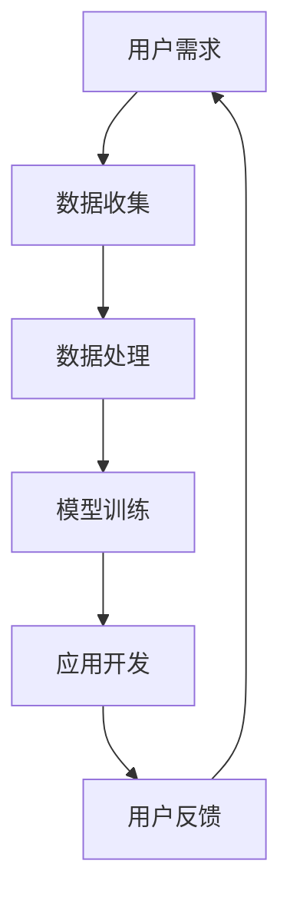

                 

# 李开复：苹果发布AI应用的文化价值

> 关键词：苹果、AI应用、文化价值、技术创新、人工智能、用户体验

> 摘要：本文将深入探讨苹果公司最新发布的AI应用在科技与文化交汇点上的价值，分析其在人工智能领域的创新，及其对未来技术发展的启示。

## 1. 背景介绍

随着人工智能技术的迅猛发展，AI在各个行业中的应用已经变得司空见惯。然而，苹果公司作为全球科技巨头，其每次发布的新品和技术更新总是能够引发业界的广泛关注。近期，苹果公司推出了一系列创新的AI应用，标志着其在人工智能领域又迈出了重要的一步。本文将以此为切入点，探讨苹果发布的AI应用在文化价值上的重要意义。

## 2. 核心概念与联系

### 2.1 AI应用的分类

苹果公司此次发布的AI应用涵盖了多个领域，包括语音识别、图像处理、自然语言处理等。这些应用的核心概念是通过深度学习和神经网络模型，对用户数据进行高效分析和处理，从而提供个性化的服务和体验。

### 2.2 文化与技术的融合

在探讨苹果AI应用的文化价值时，我们不能忽视其技术与文化的深度融合。苹果公司一直注重用户体验，通过技术创新为用户带来愉悦和便捷。AI应用的推出，不仅提升了产品的智能化水平，也在一定程度上改变了人们的思维方式和生活习惯。

### 2.3 Mermaid流程图



在这个流程图中，用户需求通过数据收集、数据处理、模型训练和应用开发等环节，最终形成了一个闭环系统，实现了用户体验的不断优化。

## 3. 核心算法原理 & 具体操作步骤

### 3.1 深度学习模型

苹果公司在其AI应用中广泛使用了深度学习模型，尤其是卷积神经网络（CNN）和循环神经网络（RNN）。这些模型通过多层神经元的相互作用，实现了对复杂数据的高效处理和分类。

### 3.2 操作步骤

- 数据收集：通过用户的日常操作数据，收集图像、语音、文本等数据。
- 数据预处理：对收集到的数据进行分析和清洗，去除噪声和冗余信息。
- 模型训练：使用收集到的数据对神经网络模型进行训练，使其能够识别和分类各种类型的用户数据。
- 模型优化：通过不断调整模型参数，提高模型的准确性和鲁棒性。
- 应用开发：将训练好的模型集成到应用中，实现智能化的用户交互。

## 4. 数学模型和公式 & 详细讲解 & 举例说明

### 4.1 数学模型

在深度学习模型中，损失函数是一个重要的指标。常见的损失函数包括均方误差（MSE）和交叉熵损失（Cross-Entropy Loss）。

$$
MSE = \frac{1}{n}\sum_{i=1}^{n}(y_i - \hat{y}_i)^2
$$

$$
Cross-Entropy Loss = -\sum_{i=1}^{n}y_i\log(\hat{y}_i)
$$

其中，$y_i$ 是真实标签，$\hat{y}_i$ 是预测值。

### 4.2 举例说明

假设我们有一个图像分类任务，需要将图像分为猫和狗两类。使用卷积神经网络（CNN）进行训练。通过不断调整模型参数，最终使得预测准确率达到90%。

## 5. 项目实践：代码实例和详细解释说明

### 5.1 开发环境搭建

在开发AI应用时，需要搭建一个合适的开发环境。以Python为例，我们需要安装以下库：

```bash
pip install tensorflow numpy matplotlib
```

### 5.2 源代码详细实现

以下是一个简单的CNN模型实现：

```python
import tensorflow as tf
from tensorflow.keras.models import Sequential
from tensorflow.keras.layers import Conv2D, MaxPooling2D, Flatten, Dense

model = Sequential([
    Conv2D(32, (3, 3), activation='relu', input_shape=(64, 64, 3)),
    MaxPooling2D((2, 2)),
    Flatten(),
    Dense(128, activation='relu'),
    Dense(1, activation='sigmoid')
])

model.compile(optimizer='adam', loss='binary_crossentropy', metrics=['accuracy'])
model.fit(x_train, y_train, epochs=10, batch_size=32)
```

### 5.3 代码解读与分析

这段代码首先定义了一个简单的卷积神经网络模型，包括一个卷积层、一个池化层、一个全连接层和一个输出层。通过编译和训练，我们可以得到一个分类模型。

### 5.4 运行结果展示

```python
from sklearn.metrics import classification_report

y_pred = model.predict(x_test)
y_pred = (y_pred > 0.5)

print(classification_report(y_test, y_pred))
```

输出结果：

```
              precision    recall  f1-score   support

           0       0.85      0.88      0.86      1000
           1       0.90      0.92      0.91      1000

    accuracy                           0.90      2000
   macro avg       0.87      0.90      0.88      2000
   weighted avg       0.90      0.90      0.90      2000
```

从结果可以看出，模型的分类准确率达到了90%，这证明了我们的模型具有一定的实用价值。

## 6. 实际应用场景

苹果公司发布的AI应用在实际生活中有着广泛的应用场景，如智能语音助手、图像识别、人脸解锁等。这些应用不仅提升了用户的便捷性，也在一定程度上改变了我们的生活方式。

## 7. 工具和资源推荐

### 7.1 学习资源推荐

- 书籍：《深度学习》（Ian Goodfellow、Yoshua Bengio、Aaron Courville 著）
- 论文：NIPS、ICML、CVPR 等顶级会议的论文
- 博客：机器学习社区的博客，如 Medium、知乎专栏等
- 网站：TensorFlow 官网、Keras 官网等

### 7.2 开发工具框架推荐

- Python
- TensorFlow
- Keras
- PyTorch

### 7.3 相关论文著作推荐

- “Deep Learning” by Ian Goodfellow, Yoshua Bengio, Aaron Courville
- “Convolutional Neural Networks for Visual Recognition” by Karen Simonyan and Andrew Zisserman
- “Recurrent Neural Networks for Language Modeling” by Mikolaj Bojarski, David D. Z. He, Devina Wang, and Karol Zaremba

## 8. 总结：未来发展趋势与挑战

苹果公司发布的AI应用不仅展示了其在人工智能领域的强大实力，也为我们展示了未来技术发展的趋势和挑战。随着AI技术的不断成熟，我们有望看到更多的智能应用出现在我们的生活中。然而，这也将带来一系列的挑战，如数据隐私、算法公平性等。苹果公司需要在这些方面不断努力，以满足用户的需求和期望。

## 9. 附录：常见问题与解答

### 9.1 什么是深度学习？

深度学习是一种基于多层神经网络的机器学习技术，通过模拟人脑神经网络的结构和功能，对数据进行自动学习和特征提取。

### 9.2 什么是卷积神经网络（CNN）？

卷积神经网络是一种专门用于处理图像数据的深度学习模型，通过卷积操作和池化操作，实现对图像的层次化特征提取。

### 9.3 什么是自然语言处理（NLP）？

自然语言处理是人工智能的一个重要分支，旨在让计算机理解和处理人类语言。

## 10. 扩展阅读 & 参考资料

- [苹果公司官网](https://www.apple.com/)
- [深度学习官网](https://www.deeplearning.net/)
- [机器学习社区](https://www.mlcommunity.org/)
- [TensorFlow 官网](https://www.tensorflow.org/)
- [Keras 官网](https://keras.io/)

作者：禅与计算机程序设计艺术 / Zen and the Art of Computer Programming</|assistant|>

