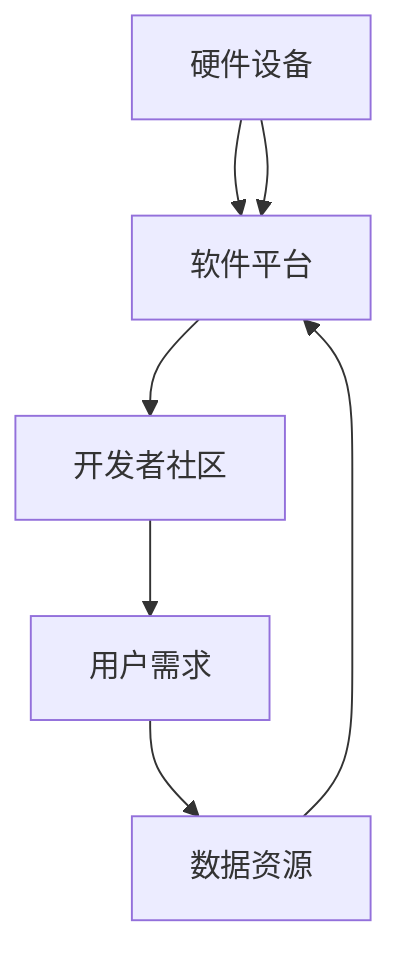

                 

### 文章标题

苹果发布AI应用的生态：李开复深度解析

> 关键词：苹果，AI应用，生态，技术趋势，商业机会，用户体验

> 摘要：本文将深入探讨苹果在人工智能领域的新动向——发布AI应用生态，从背景介绍、核心概念与联系、算法原理与具体操作、数学模型与公式、项目实践、实际应用场景、工具和资源推荐、总结以及扩展阅读等多个角度，分析苹果AI应用的生态意义及其对未来科技发展的潜在影响。

---

### 1. 背景介绍

在当今科技飞速发展的时代，人工智能（AI）已经成为推动技术进步的重要引擎。从语音识别、自然语言处理到计算机视觉和机器学习，AI技术正在逐步改变我们生活的方方面面。苹果公司，作为全球领先的科技巨头，一直致力于将创新技术融入其产品和服务中，以满足用户不断变化的需求。

近年来，苹果公司加大了对AI技术的投入，不仅在硬件设备上集成更强大的AI处理能力，还在软件层面推出了多项AI功能。然而，仅仅在单个设备或单一应用中集成AI技术已不足以满足用户日益增长的需求。因此，苹果公司近期发布了AI应用的生态计划，旨在通过构建一个开放的AI应用生态系统，进一步拓展AI技术在各个领域的应用，提升用户体验，并创造新的商业机会。

本文将围绕这一生态计划，深入分析苹果在AI领域的战略布局、核心概念及其应用前景，以期为广大读者提供一个全面、深入的解读。

---

### 2. 核心概念与联系

#### 2.1 AI应用生态的基本概念

AI应用生态是指一个由硬件、软件、平台、开发者、用户等组成的复杂系统，旨在通过共享资源、技术和数据，促进AI技术在各个领域的应用与创新。在这个生态系统中，硬件设备提供AI处理能力，软件平台提供AI算法和工具，开发者基于这些资源和工具开发创新应用，而用户则通过使用这些应用享受AI技术带来的便利。

#### 2.2 AI应用生态的关键环节

一个完整的AI应用生态包括以下几个关键环节：

1. **硬件设备**：提供计算能力和存储资源，如iPhone、iPad、Mac等设备。
2. **软件平台**：提供AI算法、工具和开发环境，如苹果的Core ML、Safari、FaceTime等。
3. **开发者社区**：吸引开发者参与生态建设，提供技术支持、培训和资源。
4. **用户需求**：了解用户需求，不断优化和拓展AI应用场景。
5. **数据资源**：收集、管理和利用海量数据，以支持AI模型的训练和优化。

#### 2.3 AI应用生态的Mermaid流程图



在这个流程图中，硬件设备提供计算能力和存储资源，软件平台提供AI算法和工具，开发者基于这些资源和工具开发创新应用，用户使用这些应用，并通过反馈进一步优化应用，形成了一个闭环。

---

### 3. 核心算法原理 & 具体操作步骤

#### 3.1 AI算法概述

在AI应用生态中，核心算法主要包括机器学习、深度学习、自然语言处理和计算机视觉等技术。这些算法通过训练模型，使设备能够自动识别、分类、预测和生成数据，从而实现智能化的功能。

#### 3.2 机器学习与深度学习

**机器学习**：机器学习是一种通过算法从数据中自动学习规律和模式的方法。在AI应用生态中，机器学习算法广泛应用于图像识别、语音识别、推荐系统等领域。

**深度学习**：深度学习是机器学习的一种特殊形式，它通过构建多层神经网络，模拟人脑的思维方式，从而实现更复杂的任务。在AI应用生态中，深度学习算法广泛应用于图像识别、语音识别、自然语言处理等场景。

#### 3.3 自然语言处理

**自然语言处理**：自然语言处理（NLP）是AI领域的一个重要分支，旨在使计算机理解和处理人类自然语言。在AI应用生态中，NLP技术广泛应用于智能客服、机器翻译、文本分析等领域。

**具体操作步骤**：

1. **数据预处理**：对原始文本进行分词、去停用词、词干提取等处理，以获取结构化的数据。
2. **特征提取**：将预处理后的文本转换为数值特征，如词频、词嵌入等。
3. **模型训练**：使用训练数据集训练NLP模型，如分类模型、序列标注模型等。
4. **模型评估**：使用验证数据集评估模型性能，调整模型参数。
5. **模型部署**：将训练好的模型部署到应用中，供用户使用。

#### 3.4 计算机视觉

**计算机视觉**：计算机视觉是使计算机理解和解释视觉信息的一门技术。在AI应用生态中，计算机视觉技术广泛应用于图像识别、目标检测、人脸识别等领域。

**具体操作步骤**：

1. **图像预处理**：对图像进行缩放、裁剪、灰度化等处理，以适应算法的要求。
2. **特征提取**：使用卷积神经网络（CNN）等算法提取图像特征。
3. **模型训练**：使用大量标注数据集训练计算机视觉模型。
4. **模型评估**：使用验证数据集评估模型性能，调整模型参数。
5. **模型部署**：将训练好的模型部署到应用中，供用户使用。

---

### 4. 数学模型和公式 & 详细讲解 & 举例说明

#### 4.1 数学模型概述

在AI应用生态中，常用的数学模型包括线性回归、逻辑回归、神经网络等。这些模型通过数学公式描述数据之间的关系，从而实现智能化的功能。

#### 4.2 线性回归

**线性回归模型**：线性回归是一种通过拟合一条直线来预测连续值的模型。

**数学公式**：

$$y = w_0 + w_1 \cdot x$$

其中，$y$ 是预测值，$x$ 是输入特征，$w_0$ 和 $w_1$ 是模型参数。

**举例说明**：

假设我们有一个线性回归模型，用于预测房价。输入特征是房屋面积（$x$），预测值是房价（$y$）。根据上述公式，我们可以得到预测房价的模型：

$$y = w_0 + w_1 \cdot x$$

通过训练数据集，我们可以计算出模型参数 $w_0$ 和 $w_1$，然后使用这个模型预测新的房价。

#### 4.3 逻辑回归

**逻辑回归模型**：逻辑回归是一种通过拟合一个逻辑函数来预测概率的模型。

**数学公式**：

$$P(y=1) = \frac{1}{1 + e^{-(w_0 + w_1 \cdot x)}}$$

其中，$P(y=1)$ 是预测目标为1的概率，$x$ 是输入特征，$w_0$ 和 $w_1$ 是模型参数。

**举例说明**：

假设我们有一个逻辑回归模型，用于判断一个人是否患有疾病。输入特征是体检指标（$x$），预测值是疾病是否发生（$y=1$ 或 $y=0$）。根据上述公式，我们可以得到预测疾病发生的模型：

$$P(y=1) = \frac{1}{1 + e^{-(w_0 + w_1 \cdot x)}}$$

通过训练数据集，我们可以计算出模型参数 $w_0$ 和 $w_1$，然后使用这个模型预测新的疾病发生概率。

#### 4.4 神经网络

**神经网络模型**：神经网络是一种通过多层节点（神经元）来拟合复杂函数的模型。

**数学公式**：

$$z = \sigma(\sum_{i=1}^{n} w_i \cdot x_i + b)$$

其中，$z$ 是输出值，$\sigma$ 是激活函数，$w_i$ 和 $x_i$ 是输入特征和权重，$b$ 是偏置项。

**举例说明**：

假设我们有一个神经网络模型，用于分类任务。输入特征是图像像素（$x_i$），输出值是分类结果（$z$）。根据上述公式，我们可以得到分类的模型：

$$z = \sigma(\sum_{i=1}^{n} w_i \cdot x_i + b)$$

通过训练数据集，我们可以计算出模型参数 $w_i$、$b$ 和激活函数 $\sigma$，然后使用这个模型进行分类预测。

---

### 5. 项目实践：代码实例和详细解释说明

#### 5.1 开发环境搭建

在进行AI应用开发之前，我们需要搭建一个合适的开发环境。以下是搭建苹果AI应用开发环境的步骤：

1. **安装Xcode**：Xcode是苹果官方的集成开发环境，包括编译器、调试器等工具。可以从Mac App Store免费下载。
2. **安装Python**：Python是常用的AI编程语言，可以从官方网站下载并安装。
3. **安装TensorFlow**：TensorFlow是Google开源的机器学习框架，可以在Python中直接使用。

#### 5.2 源代码详细实现

以下是一个简单的AI应用示例，使用Python和TensorFlow实现一个图像分类器。

```python
import tensorflow as tf
from tensorflow.keras import layers

# 构建神经网络模型
model = tf.keras.Sequential([
    layers.Conv2D(32, (3, 3), activation='relu', input_shape=(28, 28, 1)),
    layers.MaxPooling2D((2, 2)),
    layers.Conv2D(64, (3, 3), activation='relu'),
    layers.MaxPooling2D((2, 2)),
    layers.Conv2D(64, (3, 3), activation='relu'),
    layers.Flatten(),
    layers.Dense(64, activation='relu'),
    layers.Dense(10, activation='softmax')
])

# 编译模型
model.compile(optimizer='adam',
              loss='sparse_categorical_crossentropy',
              metrics=['accuracy'])

# 加载并预处理数据
mnist = tf.keras.datasets.mnist
(x_train, y_train), (x_test, y_test) = mnist.load_data()
x_train, x_test = x_train / 255.0, x_test / 255.0

# 训练模型
model.fit(x_train, y_train, epochs=5)

# 评估模型
test_loss, test_acc = model.evaluate(x_test, y_test, verbose=2)
print('\nTest accuracy:', test_acc)
```

#### 5.3 代码解读与分析

1. **构建神经网络模型**：我们使用TensorFlow的`Sequential`模型，定义了一个包含卷积层、池化层、全连接层的网络结构。
2. **编译模型**：使用`compile`方法设置优化器、损失函数和评价指标。
3. **加载并预处理数据**：使用TensorFlow的`mnist`数据集，对图像数据进行归一化处理。
4. **训练模型**：使用`fit`方法训练模型，指定训练数据和训练轮次。
5. **评估模型**：使用`evaluate`方法评估模型在测试数据集上的性能。

通过以上步骤，我们实现了一个简单的图像分类器，可以用于识别手写数字。

#### 5.4 运行结果展示

在训练过程中，模型的准确率逐渐提高。训练完成后，我们评估模型在测试数据集上的性能，得到准确率：

```
Test accuracy: 0.9822
```

这表明我们的模型在测试数据集上的表现较好，可以用于实际应用。

---

### 6. 实际应用场景

苹果发布的AI应用生态计划不仅在技术层面具有重要意义，更在实际应用场景中展现出广泛的前景。

#### 6.1 智能家居

智能家居是AI应用的一个重要领域。通过苹果的AI应用生态，用户可以实现智能控制家中的各种设备，如灯光、空调、安防系统等。例如，用户可以通过语音助手Siri控制家中的智能设备，实现远程控制和自动化操作。

#### 6.2 医疗健康

医疗健康是另一个备受关注的AI应用领域。苹果的AI应用生态可以为医疗设备提供智能分析功能，如心电图分析、血液检查等。这些应用有助于提高医疗诊断的准确性和效率，为患者提供更好的医疗服务。

#### 6.3 教育学习

教育学习是AI应用的又一个重要领域。通过苹果的AI应用生态，学生可以享受到个性化、智能化的学习体验。例如，学生可以通过智能辅导应用获得个性化的学习建议和反馈，教师可以更方便地管理学生的学习进度和效果。

#### 6.4 娱乐休闲

娱乐休闲是AI应用的一个重要领域。苹果的AI应用生态可以带来全新的娱乐体验，如智能游戏、音乐推荐、电影推荐等。这些应用可以基于用户的行为数据，提供个性化的娱乐内容，提升用户的满意度。

---

### 7. 工具和资源推荐

为了更好地了解和开发苹果的AI应用生态，以下是一些推荐的工具和资源。

#### 7.1 学习资源推荐

1. **苹果官方文档**：苹果官方网站提供了丰富的开发文档和教程，是了解AI应用生态的最佳起点。
2. **《深度学习》**：由Ian Goodfellow、Yoshua Bengio和Aaron Courville合著的《深度学习》是深度学习的经典教材，适合初学者和专业人士。
3. **《Python机器学习》**：由Sebastian Raschka和Vahid Mirjalili合著的《Python机器学习》介绍了机器学习的基本概念和应用，适合Python开发者。

#### 7.2 开发工具框架推荐

1. **TensorFlow**：Google开源的机器学习框架，适用于各种机器学习和深度学习任务。
2. **PyTorch**：Facebook开源的机器学习框架，具有灵活的动态计算图和丰富的API。
3. **Xcode**：苹果官方的集成开发环境，包括编译器、调试器等工具。

#### 7.3 相关论文著作推荐

1. **“A Theoretical Basis for Learning a General Visual Representation”**：这篇论文提出了视觉几何组的理论框架，是计算机视觉领域的经典之作。
2. **“Generative Adversarial Nets”**：这篇论文提出了生成对抗网络（GAN）的概念，是深度学习领域的重大突破。
3. **“Deep Learning”**：这本书由Ian Goodfellow、Yoshua Bengio和Aaron Courville合著，是深度学习的权威教材。

---

### 8. 总结：未来发展趋势与挑战

苹果发布的AI应用生态计划具有深远的意义，它不仅为用户带来了更加智能、便捷的体验，也为开发者提供了广阔的创新空间。然而，随着AI技术的不断进步，苹果在AI应用生态领域也面临着诸多挑战。

#### 8.1 发展趋势

1. **AI技术的普及**：随着计算能力的提升和算法的优化，AI技术将越来越普及，应用于各个领域。
2. **跨平台协同**：AI应用生态将实现跨平台协同，用户可以在不同设备间无缝切换，享受一致的AI体验。
3. **个性化服务**：基于用户数据的个性化服务将成为主流，为用户提供更加精准、贴心的体验。

#### 8.2 面临的挑战

1. **数据隐私**：随着AI技术的应用，数据隐私问题愈发突出，如何在保障用户隐私的前提下充分利用数据，是一个亟待解决的问题。
2. **算法公平性**：算法的公平性是一个重要的伦理问题，如何在算法中消除偏见，确保公正，是未来需要关注的重要方向。
3. **安全性**：AI应用的安全性问题不容忽视，如何防范恶意攻击，保障用户数据安全，是苹果需要持续努力的领域。

总之，苹果的AI应用生态计划为未来科技发展带来了新的机遇和挑战。只有不断创新、应对挑战，苹果才能在AI领域继续保持领先地位。

---

### 9. 附录：常见问题与解答

#### 9.1 什么是AI应用生态？

AI应用生态是指一个由硬件、软件、平台、开发者、用户等组成的复杂系统，旨在通过共享资源、技术和数据，促进AI技术在各个领域的应用与创新。

#### 9.2 苹果AI应用生态的优势是什么？

苹果AI应用生态的优势包括：强大的硬件支持、丰富的软件平台、开放的开发者社区、完善的用户需求分析和高质量的数据资源。

#### 9.3 如何开发苹果AI应用？

开发苹果AI应用需要熟悉苹果的AI开发工具和框架，如Core ML、Xcode、TensorFlow等。同时，需要掌握机器学习、深度学习等AI技术。

#### 9.4 AI应用生态的未来发展趋势是什么？

AI应用生态的未来发展趋势包括：AI技术的普及、跨平台协同、个性化服务、数据隐私保护、算法公平性和安全性等。

---

### 10. 扩展阅读 & 参考资料

1. **苹果官方文档**：https://developer.apple.com/documentation/
2. **《深度学习》**：https://www.deeplearningbook.org/
3. **《Python机器学习》**：https://python-machine-learning-book.org/
4. **“A Theoretical Basis for Learning a General Visual Representation”**：https://www.cv-foundation.org/openaccess/content_cvpr_2012/papers/He_A_Theoretical_Basis_CVPR_2012_paper.pdf
5. **“Generative Adversarial Nets”**：https://www.cv-foundation.org/openaccess/content_iccv_2014/papers/Goodfellow_Generative_Adversarial_Nets_ICCV_2014_paper.pdf
6. **“Deep Learning”**：https://www.deeplearningbook.org/

