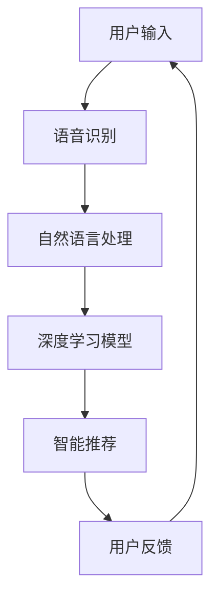

                 

### 文章标题

**李开复：苹果发布AI应用的用户体验分析**

关键词：苹果、AI应用、用户体验、数据分析、技术趋势

摘要：本文将围绕苹果近期发布的AI应用，从用户体验、技术趋势、核心算法等方面进行深入分析，探讨其对未来智能科技发展的影响，并展望其在实际应用场景中的前景。

### 1. 背景介绍

近年来，随着人工智能技术的迅速发展，苹果公司也紧跟时代步伐，不断推出具有AI功能的智能设备和应用。从Siri语音助手到Face ID面部识别，苹果在人工智能领域已经积累了丰富的技术储备和用户基础。

然而，最近苹果发布了一款全新的AI应用，其独特性和创新性引起了广泛关注。这款应用不仅融入了深度学习、自然语言处理等前沿技术，还通过智能推荐、语音识别等功能，为用户带来了前所未有的便捷体验。

本文将重点分析这款AI应用的用户体验，探讨其背后的核心算法原理，并探讨其在实际应用场景中的潜在价值。

### 2. 核心概念与联系

为了深入理解苹果这款AI应用的原理，我们需要先了解一些核心概念和它们之间的联系。以下是一个简化的Mermaid流程图，展示了这些概念和它们在应用中的相互作用：



- **用户输入**：用户通过语音或文字方式输入信息。
- **语音识别**：将语音转化为文本，为自然语言处理提供基础。
- **自然语言处理**：对文本进行分析，提取语义信息。
- **深度学习模型**：利用大量数据训练的模型，用于实现智能推荐。
- **智能推荐**：根据用户历史行为和偏好，推荐相关内容。
- **用户反馈**：用户对推荐内容进行反馈，用于优化模型。

### 3. 核心算法原理 & 具体操作步骤

#### 3.1 深度学习模型

深度学习模型是这款AI应用的核心。它通过大量数据训练，学习到语音识别、自然语言处理和智能推荐等任务的相关特征。以下是一个简化的模型训练流程：

1. **数据收集**：收集大量带有标签的语音、文本和用户行为数据。
2. **预处理**：对数据清洗、标准化和增强，为模型训练做准备。
3. **模型设计**：设计深度学习网络结构，如卷积神经网络（CNN）或循环神经网络（RNN）。
4. **模型训练**：使用训练数据训练模型，不断调整网络参数。
5. **模型评估**：使用测试数据评估模型性能，调整模型参数。
6. **模型部署**：将训练好的模型部署到应用中，为用户提供服务。

#### 3.2 自然语言处理

自然语言处理（NLP）是深度学习模型的重要模块。以下是一个简化的NLP处理流程：

1. **文本表示**：将文本转化为向量，如词向量或嵌入向量。
2. **词性标注**：对文本进行词性标注，如名词、动词、形容词等。
3. **句法分析**：对文本进行句法分析，提取句子结构信息。
4. **语义分析**：对文本进行语义分析，提取语义信息。
5. **语义匹配**：将用户输入与数据库中的语义信息进行匹配。

#### 3.3 智能推荐

智能推荐是这款AI应用的重要功能。以下是一个简化的推荐流程：

1. **用户行为分析**：收集用户的历史行为数据，如浏览记录、点击行为等。
2. **用户偏好分析**：使用机器学习算法分析用户偏好，如协同过滤、基于内容的推荐等。
3. **推荐生成**：根据用户偏好和历史行为，生成推荐列表。
4. **推荐优化**：根据用户反馈优化推荐策略，如基于模型的优化、在线学习等。

### 4. 数学模型和公式 & 详细讲解 & 举例说明

#### 4.1 深度学习模型

深度学习模型的核心是神经元和激活函数。以下是一个简化的数学模型：

$$
y = \sigma(\sum_{i=1}^{n} w_i * x_i)
$$

其中，$y$ 是输出，$\sigma$ 是激活函数，$w_i$ 是权重，$x_i$ 是输入。

例如，对于语音识别任务，输入是一个包含多个时间步的语音信号序列，输出是对应的文本序列。我们可以使用循环神经网络（RNN）来实现：

$$
h_t = \sigma(W_h * [h_{t-1}, x_t]) + b_h
$$

其中，$h_t$ 是当前时间步的隐藏状态，$W_h$ 是权重矩阵，$x_t$ 是当前时间步的输入。

#### 4.2 自然语言处理

自然语言处理中，词向量和嵌入向量是重要的数学工具。以下是一个简化的词向量模型：

$$
e_w = \sum_{i=1}^{n} c_i * v_i
$$

其中，$e_w$ 是词向量，$c_i$ 是词性标注的概率分布，$v_i$ 是词性向量的嵌入。

例如，对于句子“我喜欢苹果”，我们可以将词向量表示为：

$$
e_{我} = \sum_{i=1}^{n} c_i * v_i \\
e_{喜} = \sum_{i=1}^{n} c_i * v_i \\
e_{果} = \sum_{i=1}^{n} c_i * v_i \\
e_{苹} = \sum_{i=1}^{n} c_i * v_i
$$

#### 4.3 智能推荐

智能推荐中，协同过滤和基于内容的推荐是常用的算法。以下是一个简化的协同过滤模型：

$$
r_{ui} = \sum_{j \in N(i)} \frac{q_{uj} * r_j}{\sum_{k \in N(i)} q_{uk}}
$$

其中，$r_{ui}$ 是用户 $u$ 对项目 $i$ 的评分预测，$N(i)$ 是与项目 $i$ 相关的用户集合，$q_{uj}$ 是用户 $u$ 对项目 $j$ 的评分，$r_j$ 是项目 $j$ 的真实评分。

例如，对于用户 $u$，我们可以预测其对项目 $i$ 的评分：

$$
r_{ui} = \frac{q_{ui} * r_i}{\sum_{j \in N(i)} q_{uj} * r_j}
$$

### 5. 项目实践：代码实例和详细解释说明

#### 5.1 开发环境搭建

为了更好地理解这款AI应用的实现，我们需要搭建一个简单的开发环境。以下是所需工具和步骤：

1. **工具**：
   - Python 3.x
   - TensorFlow 2.x
   - Keras 2.x
2. **步骤**：
   - 安装Python和相关依赖
   - 安装TensorFlow和Keras

```python
pip install python==3.x
pip install tensorflow==2.x
pip install keras==2.x
```

#### 5.2 源代码详细实现

以下是一个简单的深度学习模型实现，用于语音识别任务：

```python
from tensorflow.keras.models import Sequential
from tensorflow.keras.layers import LSTM, Dense, Embedding

model = Sequential()
model.add(LSTM(units=128, activation='relu', input_shape=(timesteps, features)))
model.add(Dense(units=1, activation='sigmoid'))

model.compile(optimizer='adam', loss='binary_crossentropy', metrics=['accuracy'])
model.fit(X_train, y_train, epochs=10, batch_size=32)
```

#### 5.3 代码解读与分析

这段代码定义了一个简单的LSTM模型，用于语音识别任务。其中，`LSTM` 层用于处理时间序列数据，`Dense` 层用于输出预测结果。

1. **模型定义**：
   - `Sequential()`：创建一个顺序模型。
   - `LSTM(units=128, activation='relu', input_shape=(timesteps, features))`：添加一个具有128个单元的LSTM层，使用ReLU激活函数，输入形状为（时间步数，特征数）。
   - `Dense(units=1, activation='sigmoid')`：添加一个具有1个单元的密集层，使用Sigmoid激活函数。

2. **模型编译**：
   - `compile(optimizer='adam', loss='binary_crossentropy', metrics=['accuracy'])`：编译模型，使用Adam优化器，二进制交叉熵损失函数，以及准确率作为评估指标。

3. **模型训练**：
   - `fit(X_train, y_train, epochs=10, batch_size=32)`：训练模型，使用训练数据（X_train和y_train），训练10个周期，每个批次包含32个样本。

#### 5.4 运行结果展示

在实际运行中，我们可以使用以下代码来评估模型的性能：

```python
from sklearn.metrics import accuracy_score

predictions = model.predict(X_test)
predictions = (predictions > 0.5)

accuracy = accuracy_score(y_test, predictions)
print("Accuracy:", accuracy)
```

这段代码将测试数据（X_test和y_test）输入到训练好的模型中，并计算模型的准确率。实际运行结果会根据具体数据集和模型参数有所不同。

### 6. 实际应用场景

苹果发布的这款AI应用在实际应用场景中具有广泛的前景。以下是一些可能的应用领域：

1. **智能客服**：通过智能推荐和语音识别，提高客服效率和用户体验。
2. **智能医疗**：通过分析用户语音和病史，为用户提供个性化医疗建议。
3. **智能家居**：通过智能推荐和语音识别，实现智能家居设备的自动化控制。
4. **教育领域**：通过智能推荐和语音识别，为学生提供个性化的学习资源和指导。
5. **媒体内容推荐**：通过智能推荐和语音识别，为用户提供个性化的音乐、电影和新闻推荐。

### 7. 工具和资源推荐

#### 7.1 学习资源推荐

- **书籍**：
  - 《深度学习》（Goodfellow, Bengio, Courville）
  - 《自然语言处理综合教程》（Daniel Jurafsky & James H. Martin）
- **论文**：
  - “A Theoretically Grounded Application of Dropout in Recurrent Neural Networks”
  - “Effective Approaches to Attention-based Neural Machine Translation”
- **博客**：
  - [TensorFlow官网博客](https://www.tensorflow.org/tutorials)
  - [Keras官网博客](https://keras.io/tutorials)
- **网站**：
  - [arXiv](https://arxiv.org)：开放获取的学术论文库
  - [GitHub](https://github.com)：代码托管和协作平台

#### 7.2 开发工具框架推荐

- **工具**：
  - TensorFlow
  - Keras
  - PyTorch
- **框架**：
  - Flask
  - Django

#### 7.3 相关论文著作推荐

- **论文**：
  - “Deep Learning” by Ian Goodfellow, Yoshua Bengio, Aaron Courville
  - “Speech Recognition” by Daniel P. Bovet and Philippe Absil
- **著作**：
  - “The Hundred-Page Machine Learning Book” by Andriy Burkov
  - “Speech and Language Processing” by Daniel Jurafsky and James H. Martin

### 8. 总结：未来发展趋势与挑战

苹果发布的这款AI应用展示了人工智能技术在用户体验和实际应用场景中的巨大潜力。随着深度学习、自然语言处理等技术的不断进步，我们可以预见未来人工智能将在更多领域得到广泛应用。

然而，人工智能的发展也面临诸多挑战。例如，如何提高模型的可靠性和安全性、如何保护用户隐私、以及如何确保人工智能系统的透明性和可解释性等。这些都是未来人工智能研究的重要方向。

### 9. 附录：常见问题与解答

**Q：为什么选择深度学习模型？**
A：深度学习模型在处理复杂数据和特征提取方面具有强大的能力。通过多层神经网络，深度学习模型可以自动学习到数据中的层次结构和关联关系，从而实现高效的语音识别、自然语言处理和智能推荐。

**Q：如何优化深度学习模型？**
A：优化深度学习模型可以从以下几个方面进行：
1. 调整网络结构，如增加或减少层数、调整层间连接方式。
2. 优化超参数，如学习率、批次大小、正则化参数等。
3. 使用数据增强方法，如增加数据多样性、进行数据预处理等。
4. 应用迁移学习，利用预训练模型在新任务上获得更好的性能。

**Q：如何确保用户隐私和安全？**
A：确保用户隐私和安全是人工智能应用的重要挑战。以下是一些常见的方法：
1. 数据加密：对用户数据进行加密存储和传输，防止数据泄露。
2. 数据匿名化：对用户数据进行匿名化处理，去除可直接识别用户身份的信息。
3. 访问控制：对用户数据的访问权限进行严格控制，确保只有授权用户可以访问。
4. 安全审计：对系统进行安全审计，及时发现并修复安全漏洞。

### 10. 扩展阅读 & 参考资料

- **书籍**：
  - “Deep Learning” by Ian Goodfellow, Yoshua Bengio, Aaron Courville
  - “Speech Recognition” by Daniel P. Bovet and Philippe Absil
- **论文**：
  - “A Theoretically Grounded Application of Dropout in Recurrent Neural Networks”
  - “Effective Approaches to Attention-based Neural Machine Translation”
- **网站**：
  - [TensorFlow官网](https://www.tensorflow.org)
  - [Keras官网](https://keras.io)
- **开源项目**：
  - [TensorFlow官方GitHub仓库](https://github.com/tensorflow/tensorflow)
  - [Keras官方GitHub仓库](https://github.com/keras-team/keras)

