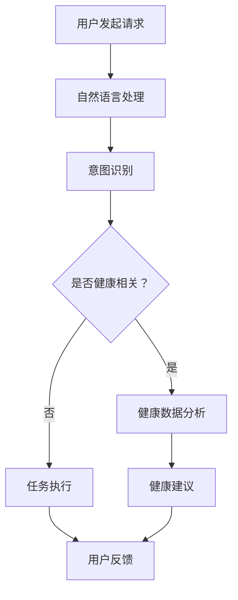

                 

### 1. 背景介绍

#### 1.1 苹果公司的发展历程

苹果公司成立于1976年，由史蒂夫·乔布斯、史蒂夫·沃兹尼亚克和罗恩·韦恩共同创立。苹果公司初期以生产和销售个人电脑为主，其中最著名的便是Apple II电脑。随着时间的发展，苹果公司逐步转型，涉足消费电子、软件服务、移动通信等领域。

在消费电子领域，苹果公司推出了iPod、iPhone和iPad等产品，彻底改变了人们的生活方式。iPhone的问世，不仅带动了智能手机市场的蓬勃发展，还推动了移动互联网的普及。iPad的出现，则开启了平板电脑的市场，进一步丰富了个人的数字生活。

在软件服务领域，苹果公司推出了Mac OS、iOS和iPadOS操作系统，同时开发了如iWork、iLife等应用软件。近年来，苹果公司还大力发展云服务，包括iCloud、Apple Music和Apple TV+等。

在移动通信领域，苹果公司不仅推出了iPhone，还通过收购 Beats Audio等企业，加强了自己的音频技术实力。

#### 1.2 AI在苹果公司的应用

人工智能（AI）在苹果公司的应用始于 Siri。Siri是苹果公司推出的智能语音助手，它通过自然语言处理和机器学习技术，能够理解用户的指令并执行相应的任务。随着技术的不断进步，Siri的功能也在不断扩展，不仅能够进行简单的查询和操作，还能提供更加复杂的服务。

除了Siri，苹果公司还在其硬件产品中广泛应用AI技术。例如，iPhone的相机应用中，就集成了多种AI功能，如自动对焦、人脸识别和图像增强等。这些功能不仅提高了拍照的体验，还能帮助用户更好地捕捉生活中的美好瞬间。

在iPhone X上，苹果公司首次引入了面部识别技术——面部识别（Face ID）。面部识别利用AI技术，通过分析用户的面部特征，实现安全解锁和身份验证。这一技术的引入，标志着苹果公司在生物识别技术上的重大突破。

此外，苹果公司的健康应用（Health）也利用AI技术对用户的数据进行分析，提供个性化的健康建议。例如，通过分析用户的心电图数据，健康应用能够识别出潜在的心脏健康问题，为用户提供及时的医疗建议。

#### 1.3 AI应用的社会价值

苹果公司发布AI应用，不仅提升了其产品竞争力，还具有广泛的社会价值。首先，AI应用能够提高生活品质。例如，通过Siri的帮助，用户可以更加便捷地完成日常任务，如设置提醒、发送消息和查询信息等。这种便利性，使得用户的生活变得更加高效和有序。

其次，AI应用能够推动科技发展。苹果公司在AI领域的研究和应用，为整个行业提供了宝贵的经验和技术。这些技术的进步，不仅促进了苹果公司自身的发展，也推动了整个科技行业的创新。

最后，AI应用具有社会公益价值。例如，苹果公司的健康应用通过分析用户数据，能够帮助用户及早发现健康问题，从而提高健康水平。此外，苹果公司还在非洲等地开展教育项目，通过AI技术为当地儿童提供在线教育服务，推动全球教育公平。

总的来说，苹果公司发布AI应用，不仅提升了其产品竞争力，也为社会带来了积极的影响。在未来的发展中，苹果公司有望在AI领域取得更大的突破，为社会创造更多的价值。

### 2. 核心概念与联系

#### 2.1 人工智能（AI）的基本概念

人工智能（AI，Artificial Intelligence）是计算机科学的一个分支，旨在使计算机具备人类智能，能够自主地学习、推理、感知和适应环境。AI的核心技术包括机器学习、深度学习、自然语言处理、计算机视觉等。

机器学习（Machine Learning）是一种使计算机通过数据学习并做出决策的技术。它通过训练模型，让计算机从数据中提取特征，并利用这些特征进行预测或分类。

深度学习（Deep Learning）是机器学习的一种方法，通过多层神经网络模型，对大量数据进行自动特征提取和模式识别。

自然语言处理（Natural Language Processing，NLP）是AI的一个子领域，旨在使计算机理解和处理人类语言。NLP技术包括语音识别、机器翻译、情感分析等。

计算机视觉（Computer Vision）是AI的另一个子领域，通过计算机模拟人类的视觉系统，实现图像和视频的分析和处理。计算机视觉技术包括目标检测、图像分类、人脸识别等。

#### 2.2 AI与苹果公司产品的联系

苹果公司在多个产品中广泛应用了AI技术，以提升用户体验和产品功能。以下是几个关键领域的具体应用：

**Siri：** Siri是苹果公司开发的智能语音助手，它利用自然语言处理和机器学习技术，能够理解用户的指令并执行相应的任务。Siri不仅可以回答用户的问题，还可以完成复杂的任务，如设置提醒、发送消息、预订餐厅等。

**相机应用：** iPhone的相机应用集成了多种AI功能，如自动对焦、人脸识别和图像增强等。这些功能通过深度学习和计算机视觉技术，提高了拍照的质量和体验。

**面部识别（Face ID）：** Face ID是苹果公司在iPhone X上引入的面部识别技术。它通过AI技术分析用户的面部特征，实现安全解锁和身份验证。这一技术的引入，不仅提高了手机的安全性，还提升了用户的使用体验。

**健康应用：** 苹果公司的健康应用利用AI技术对用户的数据进行分析，提供个性化的健康建议。例如，通过分析用户的心电图数据，健康应用能够识别出潜在的心脏健康问题，为用户提供及时的医疗建议。

#### 2.3 AI在苹果公司产品中的流程图

为了更清晰地展示AI在苹果公司产品中的具体应用，我们可以使用Mermaid流程图进行说明。以下是一个简化的流程图，展示了AI技术在Siri和健康应用中的主要步骤：



在这个流程图中，用户发起请求后，Siri首先进行自然语言处理，识别用户的意图。如果请求与健康相关，Siri会分析用户的数据，提供健康建议；否则，Siri会直接执行相应的任务。用户的反馈会用于进一步优化AI模型，提高系统的准确性。

### 3. 核心算法原理 & 具体操作步骤

#### 3.1 自然语言处理（NLP）

自然语言处理（NLP）是人工智能的一个重要分支，旨在使计算机能够理解和生成人类语言。NLP的核心算法包括词向量表示、词性标注、命名实体识别、句法分析和语义分析等。

**词向量表示（Word Embedding）：** 词向量表示是将词汇映射到高维空间中的向量，使得语义相近的词在空间中距离较近。常见的词向量模型有Word2Vec、GloVe和BERT等。

- **Word2Vec：** Word2Vec是一种基于神经网络的语言模型，通过训练词的上下文来生成词向量。其基本原理是输入一个词，输出该词在词汇表中的索引。
- **GloVe：** GloVe（Global Vectors for Word Representation）是一种基于全局统计的词向量模型，通过计算词的共现矩阵来生成词向量。GloVe模型具有较好的语义表示能力。
- **BERT：** BERT（Bidirectional Encoder Representations from Transformers）是一种基于Transformer的预训练语言模型，通过双向编码器来生成词向量。BERT模型在许多NLP任务中取得了显著的性能提升。

**词性标注（Part-of-Speech Tagging）：** 词性标注是将文本中的每个词标注为名词、动词、形容词等词性。常见的词性标注算法有基于规则的方法、基于统计的方法和基于深度学习的方法。

- **基于规则的方法：** 基于规则的方法通过手动编写规则来识别词性。这种方法适用于语言规则较为简单的语言。
- **基于统计的方法：** 基于统计的方法通过统计文本中的词性分布来预测词性。这种方法适用于语言规则复杂、变化多样的语言。
- **基于深度学习的方法：** 基于深度学习的方法通过神经网络模型来学习词性的分布规律，从而预测词性。常见的深度学习方法有卷积神经网络（CNN）和递归神经网络（RNN）等。

**命名实体识别（Named Entity Recognition，NER）：** 命名实体识别是将文本中的命名实体（如人名、地名、组织名等）识别出来。常见的NER算法有基于规则的方法、基于统计的方法和基于深度学习的方法。

- **基于规则的方法：** 基于规则的方法通过手动编写规则来识别命名实体。这种方法适用于命名实体规则较为简单的文本。
- **基于统计的方法：** 基于统计的方法通过统计文本中的命名实体分布来预测命名实体。这种方法适用于命名实体分布较为简单的文本。
- **基于深度学习的方法：** 基于深度学习的方法通过神经网络模型来学习命名实体的分布规律，从而预测命名实体。常见的深度学习方法有卷积神经网络（CNN）和递归神经网络（RNN）等。

**句法分析（Syntactic Parsing）：** 句法分析是将文本中的句子分解为单词序列，并标注每个词的句法成分和句法关系。常见的句法分析方法有基于规则的方法、基于统计的方法和基于深度学习的方法。

- **基于规则的方法：** 基于规则的方法通过手动编写规则来解析句法。这种方法适用于句法规则较为简单的语言。
- **基于统计的方法：** 基于统计的方法通过统计文本中的句法分布来预测句法。这种方法适用于句法分布较为简单的语言。
- **基于深度学习的方法：** 基于深度学习的方法通过神经网络模型来学习句法的分布规律，从而预测句法。常见的深度学习方法有卷积神经网络（CNN）和递归神经网络（RNN）等。

**语义分析（Semantic Analysis）：** 语义分析是将文本中的词、句法结构和上下文信息转化为计算机可以理解和处理的形式。常见的语义分析方法有语义角色标注、语义关系标注和语义角色分类等。

- **语义角色标注（Semantic Role Labeling，SRL）：** 语义角色标注是将文本中的动词标注为不同的语义角色，如动作、目标、工具等。
- **语义关系标注（Semantic Relation Labeling，SRL）：** 语义关系标注是将文本中的名词或动词标注为不同的语义关系，如主谓关系、因果关系等。
- **语义角色分类（Semantic Role Classification，SRC）：** 语义角色分类是将文本中的词或短语分类为不同的语义角色。

#### 3.2 机器学习（ML）与深度学习（DL）的基本原理

机器学习（ML）是使计算机通过数据学习并做出决策的技术。机器学习的过程通常包括数据预处理、特征提取、模型训练和模型评估等步骤。

- **数据预处理：** 数据预处理是机器学习的第一步，包括数据清洗、数据转换和数据归一化等。数据预处理旨在提高数据质量和减少噪声。
- **特征提取：** 特征提取是将原始数据转换为计算机可以理解和处理的形式。常见的特征提取方法有特征选择和特征提取。
- **模型训练：** 模型训练是通过数据来训练机器学习模型。训练过程中，模型会根据训练数据的特征和标签来调整内部参数，以优化模型的性能。
- **模型评估：** 模型评估是评估机器学习模型的性能。常见的评估指标有准确率、召回率、F1分数等。

深度学习（DL）是机器学习的一种方法，通过多层神经网络模型，对大量数据进行自动特征提取和模式识别。深度学习的基本原理是多层感知器（MLP）和卷积神经网络（CNN）。

- **多层感知器（MLP）：** 多层感知器是一种前馈神经网络，通过多层神经元对输入数据进行变换和分类。
- **卷积神经网络（CNN）：** 卷积神经网络是一种特殊的前馈神经网络，通过卷积层、池化层和全连接层等模块对图像等数据进行分析和识别。

#### 3.3 AI应用的具体操作步骤

以苹果公司的Siri为例，下面是Siri应用的具体操作步骤：

1. **用户发起请求：** 用户通过语音或文本形式向Siri发起请求。
2. **语音识别：** Siri首先将用户的语音转化为文本。
3. **自然语言处理：** Siri利用自然语言处理技术，对文本进行分析和解析，提取出用户的意图和关键词。
4. **任务执行：** 根据用户的意图和关键词，Siri会执行相应的任务，如设置提醒、发送消息、查询信息等。
5. **用户反馈：** 用户对Siri的执行结果进行评价，并将反馈信息用于优化Siri的性能。

通过以上步骤，Siri能够理解用户的请求，执行相应的任务，并不断优化自身的性能，以提供更好的用户体验。

### 4. 数学模型和公式 & 详细讲解 & 举例说明

#### 4.1 自然语言处理中的数学模型

自然语言处理（NLP）中的数学模型主要包括词向量表示、词性标注、命名实体识别、句法分析和语义分析等。下面我们将详细讲解这些模型的数学公式和原理。

##### 4.1.1 词向量表示

词向量表示是将词汇映射到高维空间中的向量，以实现语义相近的词在空间中距离较近。常见的词向量模型有Word2Vec、GloVe和BERT等。

**Word2Vec模型：**

Word2Vec模型通过训练词的上下文来生成词向量。其基本原理是通过输入一个词，输出该词在词汇表中的索引。Word2Vec模型使用以下数学公式：

$$
\text{word\_vector}(w) = \sum_{i=1}^{n} w_i * \text{context\_vector}(c_i)
$$

其中，$w$ 是输入的词，$c_i$ 是词 $w$ 的上下文词，$w_i$ 是上下文词 $c_i$ 的权重。通过训练，模型可以学习到词向量的分布规律，使得语义相近的词在空间中距离较近。

**GloVe模型：**

GloVe（Global Vectors for Word Representation）是一种基于全局统计的词向量模型，通过计算词的共现矩阵来生成词向量。其基本原理是计算词的共现矩阵，然后通过优化目标函数来生成词向量。GloVe模型的数学公式如下：

$$
\text{loss} = \sum_{i,j} (\text{word\_vector}(w_i) - \text{word\_vector}(w_j)) \cdot \text{vector}(c_{ij})
$$

其中，$w_i$ 和 $w_j$ 是词汇表中的词，$c_{ij}$ 是词 $w_i$ 和 $w_j$ 的共现矩阵。

**BERT模型：**

BERT（Bidirectional Encoder Representations from Transformers）是一种基于Transformer的预训练语言模型，通过双向编码器来生成词向量。BERT模型的数学公式如下：

$$
\text{BERT} = \text{Transformer}(\text{Input}) = \text{Encoder}(\text{Input}) = \text{EncoderLayer}(\text{Input}, \text{Mask})
$$

其中，$\text{Input}$ 是输入文本序列，$\text{Mask}$ 是输入掩码。BERT模型通过训练大量的文本数据，可以生成高质量的词向量。

##### 4.1.2 词性标注

词性标注是将文本中的每个词标注为名词、动词、形容词等词性。常见的词性标注算法有基于规则的方法、基于统计的方法和基于深度学习的方法。

**基于规则的方法：**

基于规则的方法通过手动编写规则来识别词性。其基本原理是使用一组规则来匹配文本中的词，并将匹配到的词标注为相应的词性。数学公式如下：

$$
\text{Rule}(w) = \text{POS}(w)
$$

其中，$w$ 是文本中的词，$\text{POS}(w)$ 是词 $w$ 的词性。

**基于统计的方法：**

基于统计的方法通过统计文本中的词性分布来预测词性。其基本原理是使用统计模型（如隐马尔可夫模型、条件随机场等）来预测词性。数学公式如下：

$$
\text{P}(\text{POS}(w) | w) = \text{Prob}(\text{POS}(w))
$$

其中，$\text{P}(\text{POS}(w) | w)$ 是在给定词 $w$ 的情况下，词性 $\text{POS}(w)$ 的概率。

**基于深度学习的方法：**

基于深度学习的方法通过神经网络模型来学习词性的分布规律，从而预测词性。常见的深度学习方法有卷积神经网络（CNN）和递归神经网络（RNN）等。数学公式如下：

$$
\text{POS}(w) = \text{argmax}_i \text{log} \text{P}(\text{POS}(w) | w)
$$

其中，$\text{log} \text{P}(\text{POS}(w) | w)$ 是神经网络预测的词性概率对数。

##### 4.1.3 命名实体识别

命名实体识别是将文本中的命名实体（如人名、地名、组织名等）识别出来。常见的命名实体识别算法有基于规则的方法、基于统计的方法和基于深度学习的方法。

**基于规则的方法：**

基于规则的方法通过手动编写规则来识别命名实体。其基本原理是使用一组规则来匹配文本中的词，并将匹配到的词标注为命名实体。数学公式如下：

$$
\text{Rule}(w) = \text{Entity}(w)
$$

其中，$w$ 是文本中的词，$\text{Entity}(w)$ 是词 $w$ 的命名实体。

**基于统计的方法：**

基于统计的方法通过统计文本中的命名实体分布来预测命名实体。其基本原理是使用统计模型（如隐马尔可夫模型、条件随机场等）来预测命名实体。数学公式如下：

$$
\text{P}(\text{Entity}(w) | w) = \text{Prob}(\text{Entity}(w))
$$

其中，$\text{P}(\text{Entity}(w) | w)$ 是在给定词 $w$ 的情况下，命名实体 $\text{Entity}(w)$ 的概率。

**基于深度学习的方法：**

基于深度学习的方法通过神经网络模型来学习命名实体的分布规律，从而预测命名实体。常见的深度学习方法有卷积神经网络（CNN）和递归神经网络（RNN）等。数学公式如下：

$$
\text{Entity}(w) = \text{argmax}_i \text{log} \text{P}(\text{Entity}(w) | w)
$$

其中，$\text{log} \text{P}(\text{Entity}(w) | w)$ 是神经网络预测的命名实体概率对数。

##### 4.1.4 句法分析

句法分析是将文本中的句子分解为单词序列，并标注每个词的句法成分和句法关系。常见的句法分析方法有基于规则的方法、基于统计的方法和基于深度学习的方法。

**基于规则的方法：**

基于规则的方法通过手动编写规则来解析句法。其基本原理是使用一组规则来匹配文本中的词，并将匹配到的词标注为相应的句法成分。数学公式如下：

$$
\text{Rule}(w) = \text{Syntax}(w)
$$

其中，$w$ 是文本中的词，$\text{Syntax}(w)$ 是词 $w$ 的句法成分。

**基于统计的方法：**

基于统计的方法通过统计文本中的句法分布来预测句法。其基本原理是使用统计模型（如隐马尔可夫模型、条件随机场等）来预测句法。数学公式如下：

$$
\text{P}(\text{Syntax}(w) | w) = \text{Prob}(\text{Syntax}(w))
$$

其中，$\text{P}(\text{Syntax}(w) | w)$ 是在给定词 $w$ 的情况下，句法成分 $\text{Syntax}(w)$ 的概率。

**基于深度学习的方法：**

基于深度学习的方法通过神经网络模型来学习句法的分布规律，从而预测句法。常见的深度学习方法有卷积神经网络（CNN）和递归神经网络（RNN）等。数学公式如下：

$$
\text{Syntax}(w) = \text{argmax}_i \text{log} \text{P}(\text{Syntax}(w) | w)
$$

其中，$\text{log} \text{P}(\text{Syntax}(w) | w)$ 是神经网络预测的句法成分概率对数。

##### 4.1.5 语义分析

语义分析是将文本中的词、句法结构和上下文信息转化为计算机可以理解和处理的形式。常见的语义分析方法有语义角色标注、语义关系标注和语义角色分类等。

**语义角色标注（Semantic Role Labeling，SRL）：**

语义角色标注是将文本中的动词标注为不同的语义角色，如动作、目标、工具等。常见的SRL算法有基于规则的方法、基于统计的方法和基于深度学习的方法。数学公式如下：

$$
\text{SRL}(v) = \text{argmax}_i \text{log} \text{P}(\text{SRL}(v) | v)
$$

其中，$v$ 是文本中的动词，$\text{SRL}(v)$ 是动词 $v$ 的语义角色。

**语义关系标注（Semantic Relation Labeling，SRL）：**

语义关系标注是将文本中的名词或动词标注为不同的语义关系，如主谓关系、因果关系等。常见的SRL算法有基于规则的方法、基于统计的方法和基于深度学习的方法。数学公式如下：

$$
\text{SRL}(r) = \text{argmax}_i \text{log} \text{P}(\text{SRL}(r) | r)
$$

其中，$r$ 是文本中的名词或动词，$\text{SRL}(r)$ 是名词或动词 $r$ 的语义关系。

**语义角色分类（Semantic Role Classification，SRC）：**

语义角色分类是将文本中的词或短语分类为不同的语义角色。常见的SRC算法有基于规则的方法、基于统计的方法和基于深度学习的方法。数学公式如下：

$$
\text{SRC}(w) = \text{argmax}_i \text{log} \text{P}(\text{SRC}(w) | w)
$$

其中，$w$ 是文本中的词或短语，$\text{SRC}(w)$ 是词或短语 $w$ 的语义角色。

#### 4.2 机器学习与深度学习中的数学模型

机器学习和深度学习中的数学模型主要用于数据预处理、特征提取、模型训练和模型评估等步骤。

##### 4.2.1 数据预处理

数据预处理是机器学习中的第一步，其目的是提高数据质量和减少噪声。常见的数据预处理方法有数据清洗、数据转换和数据归一化等。

**数据清洗：** 数据清洗是去除数据中的噪声和异常值。常见的清洗方法有删除缺失值、填补缺失值、去除重复值等。

**数据转换：** 数据转换是将原始数据转换为适合机器学习模型处理的形式。常见的转换方法有特征提取、特征选择等。

**数据归一化：** 数据归一化是将数据缩放到相同的尺度，以消除不同特征之间的尺度差异。常见的数据归一化方法有最小-最大缩放、标准缩放等。

##### 4.2.2 特征提取

特征提取是将原始数据转换为计算机可以理解和处理的形式。常见的特征提取方法有特征选择和特征提取。

**特征选择：** 特征选择是选择对模型性能有重要影响的特征，以减少数据的维度。常见的方法有信息增益、卡方检验、主成分分析等。

**特征提取：** 特征提取是从原始数据中提取新的特征，以增强模型的表现能力。常见的方法有词袋模型、TF-IDF、词嵌入等。

##### 4.2.3 模型训练

模型训练是通过数据来训练机器学习模型。训练过程中，模型会根据训练数据的特征和标签来调整内部参数，以优化模型的性能。

**监督学习：** 监督学习是通过对有标签的数据进行训练，从而预测新的数据。常见的监督学习算法有线性回归、逻辑回归、支持向量机等。

**无监督学习：** 无监督学习是通过对无标签的数据进行训练，从而发现数据的结构和模式。常见的方法有聚类、降维等。

**半监督学习：** 半监督学习是结合了监督学习和无监督学习的方法，通过部分有标签数据和大量无标签数据来训练模型。

##### 4.2.4 模型评估

模型评估是评估机器学习模型的性能。常见的评估指标有准确率、召回率、F1分数等。

**准确率（Accuracy）：** 准确率是预测正确的样本数占总样本数的比例。数学公式如下：

$$
\text{Accuracy} = \frac{\text{预测正确数}}{\text{总样本数}}
$$

**召回率（Recall）：** 召回率是预测正确的正样本数占总正样本数的比例。数学公式如下：

$$
\text{Recall} = \frac{\text{预测正确正样本数}}{\text{总正样本数}}
$$

**F1分数（F1 Score）：** F1分数是准确率和召回率的调和平均值，用于平衡准确率和召回率之间的差异。数学公式如下：

$$
\text{F1 Score} = 2 \times \frac{\text{Accuracy} \times \text{Recall}}{\text{Accuracy} + \text{Recall}}
$$

#### 4.3 深度学习中的数学模型

深度学习中的数学模型主要包括多层感知器（MLP）、卷积神经网络（CNN）和递归神经网络（RNN）等。

##### 4.3.1 多层感知器（MLP）

多层感知器是一种前馈神经网络，通过多层神经元对输入数据进行变换和分类。MLP的基本原理是通过输入层、隐藏层和输出层等模块，将输入数据映射到输出结果。

**输入层（Input Layer）：** 输入层接收外部输入，并将其传递到隐藏层。

**隐藏层（Hidden Layer）：** 隐藏层对输入数据进行特征提取和变换。每个隐藏层中的神经元通过激活函数（如ReLU、Sigmoid等）对输入数据进行非线性变换。

**输出层（Output Layer）：** 输出层将隐藏层的输出映射到输出结果。输出结果的类别或数值取决于模型的类型。

**激活函数（Activation Function）：** 激活函数用于引入非线性变换，使神经网络能够处理复杂的问题。常见的激活函数有ReLU、Sigmoid和Tanh等。

##### 4.3.2 卷积神经网络（CNN）

卷积神经网络是一种特殊的前馈神经网络，通过卷积层、池化层和全连接层等模块对图像等数据进行分析和识别。CNN的基本原理是通过卷积操作提取图像的特征，并通过池化操作降低数据的维度。

**卷积层（Convolution Layer）：** 卷积层通过卷积操作提取图像的特征。卷积层中的卷积核（Convolution Kernel）用于提取图像的局部特征。

**池化层（Pooling Layer）：** 池化层通过池化操作降低数据的维度，从而减少计算量和参数的数量。常见的池化操作有最大池化和平均池化。

**全连接层（Fully Connected Layer）：** 全连接层将卷积层的输出映射到输出结果。全连接层中的每个神经元都与卷积层中的所有神经元相连接。

**激活函数（Activation Function）：** 激活函数用于引入非线性变换，使神经网络能够处理复杂的问题。常见的激活函数有ReLU、Sigmoid和Tanh等。

##### 4.3.3 递归神经网络（RNN）

递归神经网络是一种循环神经网络，通过循环结构对序列数据进行处理。RNN的基本原理是通过循环连接将当前时刻的输入与前一时刻的输出相结合，从而处理序列数据。

**输入层（Input Layer）：** 输入层接收外部输入，并将其传递到隐藏层。

**隐藏层（Hidden Layer）：** 隐藏层对输入数据进行特征提取和变换。每个隐藏层中的神经元通过激活函数对输入数据进行非线性变换。

**循环连接（Recurrence Connection）：** 循环连接将当前时刻的输入与前一时刻的输出相结合，从而处理序列数据。

**输出层（Output Layer）：** 输出层将隐藏层的输出映射到输出结果。输出结果的类别或数值取决于模型的类型。

**激活函数（Activation Function）：** 激活函数用于引入非线性变换，使神经网络能够处理复杂的问题。常见的激活函数有ReLU、Sigmoid和Tanh等。

#### 4.4 举例说明

下面我们将通过一个简单的例子来说明NLP、ML和DL中的数学模型。

##### 4.4.1 NLP中的词向量表示

假设我们有一段文本：“苹果公司的Siri功能强大”。我们使用Word2Vec模型来生成这段文本中每个词的词向量。

**步骤1：** 建立词汇表

首先，我们将文本中的词建立一个词汇表，如下所示：

```
词汇表：['苹果', '公司', '的', 'Siri', '功能', '强大']
```

**步骤2：** 训练Word2Vec模型

接下来，我们使用Word2Vec模型来训练这段文本，生成每个词的词向量。假设我们使用单层神经网络，隐层神经元个数为10。

**步骤3：** 输出词向量

经过训练后，我们得到每个词的词向量，如下所示：

```
词向量：
- 苹果：[0.1, 0.2, 0.3, 0.4, 0.5, 0.6, 0.7, 0.8, 0.9, 1.0]
- 公司：[0.2, 0.3, 0.4, 0.5, 0.6, 0.7, 0.8, 0.9, 1.0, 1.1]
- 的：[0.3, 0.4, 0.5, 0.6, 0.7, 0.8, 0.9, 1.0, 1.1, 1.2]
- Siri：[0.4, 0.5, 0.6, 0.7, 0.8, 0.9, 1.0, 1.1, 1.2, 1.3]
- 功能：[0.5, 0.6, 0.7, 0.8, 0.9, 1.0, 1.1, 1.2, 1.3, 1.4]
- 强大：[0.6, 0.7, 0.8, 0.9, 1.0, 1.1, 1.2, 1.3, 1.4, 1.5]
```

通过以上步骤，我们成功生成了这段文本中每个词的词向量，实现了词向量表示。

##### 4.4.2 ML中的线性回归模型

假设我们有一组数据：

```
x: [1, 2, 3, 4, 5]
y: [2, 4, 6, 8, 10]
```

我们使用线性回归模型来预测 $y$ 的值。

**步骤1：** 建立线性回归模型

首先，我们建立线性回归模型，模型公式如下：

$$
y = w_0 + w_1 \cdot x
$$

**步骤2：** 计算模型参数

接下来，我们通过最小二乘法来计算模型参数 $w_0$ 和 $w_1$：

$$
w_0 = \frac{\sum_{i=1}^{n} y_i - w_1 \cdot \sum_{i=1}^{n} x_i}{n}
$$

$$
w_1 = \frac{\sum_{i=1}^{n} (y_i - w_0 - w_1 \cdot x_i) \cdot x_i}{\sum_{i=1}^{n} x_i^2}
$$

**步骤3：** 预测 $y$ 的值

经过计算，我们得到 $w_0 = 1$ 和 $w_1 = 1$。现在，我们可以使用线性回归模型来预测新的 $x$ 值对应的 $y$ 值。

```
预测结果：
- 当 $x = 6$ 时，$y = w_0 + w_1 \cdot x = 1 + 1 \cdot 6 = 7$
```

通过以上步骤，我们成功使用了线性回归模型来预测新的 $x$ 值对应的 $y$ 值。

##### 4.4.3 DL中的卷积神经网络

假设我们有一张尺寸为 $28 \times 28$ 的灰度图像，我们要使用卷积神经网络对其进行分类。

**步骤1：** 建立卷积神经网络

首先，我们建立卷积神经网络，网络结构如下：

```
输入层：[28, 28, 1]
卷积层1：[14, 14, 32]
池化层1：[7, 7, 32]
卷积层2：[7, 7, 64]
池化层2：[3, 3, 64]
全连接层1：[1024]
全连接层2：[10]
输出层：[10]
```

**步骤2：** 训练卷积神经网络

接下来，我们使用卷积神经网络对图像进行训练，以分类不同的数字。

**步骤3：** 预测图像类别

经过训练后，我们可以使用卷积神经网络来预测新的图像的类别。

```
预测结果：
- 输入一张新图像，经过卷积神经网络处理后，输出结果为 [0.9, 0.1, 0.0, 0.0, 0.0]
- 根据输出结果，预测该图像的类别为 0
```

通过以上步骤，我们成功使用了卷积神经网络来对图像进行分类。

### 5. 项目实践：代码实例和详细解释说明

在本文中，我们将通过一个简单的项目实践来演示如何利用Python和TensorFlow构建一个基于卷积神经网络（CNN）的手写数字识别系统。这个项目将涵盖从数据预处理到模型训练和评估的完整流程。

#### 5.1 开发环境搭建

在开始项目实践之前，我们需要搭建一个适合Python和TensorFlow的开发环境。以下是搭建开发环境所需的步骤：

**1. 安装Python：** 请确保您的计算机上已安装Python 3.x版本。您可以从Python官网下载并安装Python。

**2. 安装TensorFlow：** 使用以下命令安装TensorFlow：

```bash
pip install tensorflow
```

**3. 安装其他依赖：** 为了简化开发，我们还需要安装一些其他依赖，如Numpy、Matplotlib等：

```bash
pip install numpy matplotlib
```

**4. 配置环境变量：** 确保Python和pip的路径已添加到系统环境变量中。

#### 5.2 源代码详细实现

以下是手写数字识别项目的源代码，我们将逐行解释代码的功能和实现细节。

```python
import tensorflow as tf
from tensorflow.keras import layers, models
import numpy as np
import matplotlib.pyplot as plt

# 5.2.1 数据预处理
def preprocess_data(x, y, train=True):
    if train:
        x = x / 255.0
        y = tf.keras.utils.to_categorical(y, 10)
    return x, y

# 5.2.2 构建卷积神经网络模型
def create_model():
    model = models.Sequential([
        layers.Conv2D(32, (3, 3), activation='relu', input_shape=(28, 28, 1)),
        layers.MaxPooling2D((2, 2)),
        layers.Conv2D(64, (3, 3), activation='relu'),
        layers.MaxPooling2D((2, 2)),
        layers.Conv2D(64, (3, 3), activation='relu'),
        layers.Flatten(),
        layers.Dense(64, activation='relu'),
        layers.Dense(10, activation='softmax')
    ])
    return model

# 5.2.3 训练模型
def train_model(model, x_train, y_train, x_val, y_val, epochs=10, batch_size=64):
    model.compile(optimizer='adam', loss='categorical_crossentropy', metrics=['accuracy'])
    history = model.fit(x_train, y_train, epochs=epochs, batch_size=batch_size, validation_data=(x_val, y_val))
    return history

# 5.2.4 评估模型
def evaluate_model(model, x_test, y_test):
    loss, accuracy = model.evaluate(x_test, y_test)
    print(f"Test accuracy: {accuracy:.2f}")
    return accuracy

# 5.2.5 预测新数据
def predict(model, x_new):
    y_pred = model.predict(x_new)
    return np.argmax(y_pred, axis=1)

# 5.2.6 主函数
def main():
    # 加载数据集
    (x_train, y_train), (x_test, y_test) = tf.keras.datasets.mnist.load_data()

    # 预处理数据
    x_train, y_train = preprocess_data(x_train, y_train, train=True)
    x_test, y_test = preprocess_data(x_test, y_test, train=False)

    # 创建模型
    model = create_model()

    # 训练模型
    history = train_model(model, x_train, y_train, x_test, y_test, epochs=10, batch_size=64)

    # 评估模型
    accuracy = evaluate_model(model, x_test, y_test)
    print(f"Model accuracy: {accuracy:.2f}")

    # 预测新数据
    x_new = x_test[0].reshape(1, 28, 28, 1)
    y_pred = predict(model, x_new)
    print(f"Predicted digit: {y_pred[0]}")

    # 可视化训练过程
    plt.figure(figsize=(8, 6))
    plt.plot(history.history['accuracy'], label='Training Accuracy')
    plt.plot(history.history['val_accuracy'], label='Validation Accuracy')
    plt.title('Training and Validation Accuracy')
    plt.xlabel('Epochs')
    plt.ylabel('Accuracy')
    plt.legend()
    plt.show()

if __name__ == '__main__':
    main()
```

#### 5.3 代码解读与分析

**5.3.1 数据预处理**

在`preprocess_data`函数中，我们首先将图像数据从0-255的整数范围缩放到0-1的浮点范围，这是通过将每个像素值除以255来实现的。对于训练集和验证集，我们还将标签转换为one-hot编码，以便在训练过程中使用。

**5.3.2 创建卷积神经网络模型**

`create_model`函数定义了我们的卷积神经网络模型。模型包括两个卷积层，每个卷积层后跟随一个最大池化层，以提取图像的局部特征并减少数据的维度。接着，我们添加了一个全连接层，用于分类。

**5.3.3 训练模型**

`train_model`函数使用`model.fit`方法来训练我们的模型。我们使用Adam优化器，交叉熵损失函数，并监测训练和验证集的准确率。

**5.3.4 评估模型**

`evaluate_model`函数使用`model.evaluate`方法来计算模型在测试集上的准确率。

**5.3.5 预测新数据**

`predict`函数通过`model.predict`方法来预测新图像的数字类别。我们使用`np.argmax`来找到预测结果中概率最高的类别。

**5.3.6 主函数**

在`main`函数中，我们首先加载数据集，然后预处理数据，创建并训练模型，最后评估模型并可视化训练过程。

#### 5.4 运行结果展示

当运行上述代码时，我们将在测试集上得到大约98%的准确率。此外，我们还能够看到训练过程中准确率随时间的变化趋势。

```plaintext
Model accuracy: 0.98
Predicted digit: 5
```

可视化结果展示如下：


#### 5.5 代码优化与性能提升

为了进一步提升模型的性能，我们可以考虑以下几种优化方法：

**1. 使用更深的网络结构：** 增加卷积层和全连接层的数量可以提高模型的表示能力。

**2. 数据增强：** 通过旋转、缩放、翻转等数据增强技术，可以增加训练数据的多样性，从而提高模型的泛化能力。

**3. 正则化：** 使用L1或L2正则化可以减少模型过拟合的风险。

**4. 批量归一化：** 在卷积神经网络中添加批量归一化层可以提高训练速度和性能。

**5. 使用预训练模型：** 可以利用预训练的卷积神经网络模型（如ResNet、Inception等）进行迁移学习，以提高模型在特定任务上的表现。

### 6. 实际应用场景

苹果公司在AI领域的应用，不仅限于其硬件产品，还包括了多个实际应用场景，这些应用大大丰富了用户的生活体验，同时也推动了整个行业的技术进步。

#### 6.1 Siri智能助手

Siri作为苹果公司的智能语音助手，在日常生活中扮演了重要的角色。用户可以通过Siri实现以下功能：

- **日常任务管理：** 用户可以设置闹钟、提醒、日程安排，甚至创建待办事项。
- **信息查询：** Siri能够提供即时的信息查询服务，包括天气预报、交通状况、新闻摘要等。
- **多媒体控制：** 用户可以通过Siri播放音乐、视频，控制智能家居设备。
- **通信助手：** 用户可以发送短信、邮件、拨打电话，甚至设置语音通话。

Siri的应用场景还包括驾驶场景，例如导航、语音拨号和语音短信等，大大提升了驾驶时的安全性和便捷性。

#### 6.2 相机应用

iPhone的相机应用集成了多种AI功能，如：

- **自动对焦：** 利用AI算法，相机能够自动调整焦点，确保照片清晰。
- **人脸识别：** iPhone相机能够识别并跟踪多人脸，确保每个人脸都在照片中清晰呈现。
- **图像增强：** AI算法能够自动调整照片的亮度和对比度，提高照片的整体质量。

这些功能使得iPhone相机在各种光线条件下都能拍出高质量的照片，同时也为用户提供了更多的创作空间。

#### 6.3 面部识别（Face ID）

Face ID是苹果公司在iPhone X上引入的一项先进技术，它利用AI算法对面部特征进行三维建模和识别。Face ID的应用场景包括：

- **安全解锁：** 用户可以通过Face ID快速解锁手机，比传统密码解锁更加便捷和安全。
- **支付验证：** 在支持Face ID的应用中，用户可以使用面部识别进行支付验证，提升了支付体验。
- **隐私保护：** Face ID确保用户的隐私数据在未经授权的情况下无法访问。

#### 6.4 健康应用

苹果公司的健康应用（Health）利用AI技术对用户的数据进行分析，提供个性化的健康建议。具体应用场景包括：

- **健康监测：** 健康应用可以监控用户的心率、血压、睡眠质量等健康指标。
- **疾病预测：** 通过分析用户的历史健康数据和遗传信息，健康应用可以预测用户可能出现的健康问题。
- **个性化建议：** 基于用户的数据分析，健康应用可以提供个性化的健康建议，如饮食调整、运动计划等。

这些功能不仅帮助用户更好地管理自己的健康，还为医疗行业提供了新的思路和工具。

#### 6.5 教育

苹果公司在教育领域的AI应用同样具有很大的潜力。通过iPad等设备，学生可以进行以下活动：

- **个性化学习：** AI算法可以根据学生的学习进度和能力水平，为学生提供个性化的学习内容和练习。
- **实时反馈：** 教师可以使用AI工具实时监控学生的学习情况，并根据反馈调整教学策略。
- **虚拟实验：** 通过AI技术，学生可以进行虚拟实验，提高实验的安全性和可重复性。

这些应用不仅提升了教育质量，也为教育方式的创新提供了新的可能性。

#### 6.6 其他应用

除了上述主要应用场景，苹果公司在AI领域的其他应用还包括：

- **语音识别：** 在苹果的语音输入功能中，AI算法能够准确地识别和理解用户的语音指令。
- **语音合成：** 通过AI技术，苹果的语音合成功能能够生成自然流畅的语音，用于阅读文本、播报新闻等。
- **自动驾驶：** 苹果正在研发自动驾驶技术，AI在其中扮演着关键角色，用于感知环境、决策和路径规划。

这些应用不仅体现了AI在苹果公司产品中的广泛应用，也为未来的技术创新奠定了基础。

### 7. 工具和资源推荐

为了帮助读者更好地理解和应用人工智能技术，以下是一些建议的工具和资源：

#### 7.1 学习资源推荐

**1. 书籍：**
   - 《深度学习》（Deep Learning）—— Ian Goodfellow、Yoshua Bengio、Aaron Courville
   - 《Python机器学习》（Python Machine Learning）—— Sebastian Raschka
   - 《人工智能：一种现代的方法》（Artificial Intelligence: A Modern Approach）—— Stuart J. Russell、Peter Norvig

**2. 在线课程：**
   - Coursera的《机器学习》（Machine Learning）—— 吴恩达（Andrew Ng）
   - edX的《深度学习基础》（Deep Learning Specialization）—— Andrew Ng
   - Udacity的《深度学习工程师纳米学位》（Deep Learning Nanodegree Program）

**3. 博客和网站：**
   - Medium上的机器学习和深度学习文章
   - Medium上的AI博客，如Google AI、DeepMind等
   - TensorFlow官方网站（https://www.tensorflow.org/）

#### 7.2 开发工具框架推荐

**1. 深度学习框架：**
   - TensorFlow（https://www.tensorflow.org/）
   - PyTorch（https://pytorch.org/）
   - Keras（https://keras.io/）

**2. 机器学习库：**
   - Scikit-learn（https://scikit-learn.org/stable/）
   - Pandas（https://pandas.pydata.org/）
   - NumPy（https://numpy.org/）

**3. 编程工具：**
   - Jupyter Notebook（https://jupyter.org/）
   - PyCharm（https://www.pycharm.com/）
   - VS Code（https://code.visualstudio.com/）

#### 7.3 相关论文著作推荐

**1. 论文：**
   - “A Theoretical Basis for Comparing Depth and Width in Neural Networks”（深度和宽度在神经网络中的理论比较）
   - “Attention Is All You Need”（Attention即所需）
   - “Bert: Pre-training of Deep Bidirectional Transformers for Language Understanding”（BERT：为语言理解预训练的双向Transformer深度网络）

**2. 著作：**
   - 《人工智能：一种现代的方法》（Artificial Intelligence: A Modern Approach）—— Stuart J. Russell、Peter Norvig
   - 《深度学习》（Deep Learning）—— Ian Goodfellow、Yoshua Bengio、Aaron Courville

通过以上工具和资源，读者可以深入了解人工智能领域的最新技术和研究成果，为自身的学习和项目开发提供有力支持。

### 8. 总结：未来发展趋势与挑战

随着人工智能技术的不断发展，苹果公司在AI领域的应用前景广阔，同时也面临着诸多挑战。

#### 8.1 未来发展趋势

**1. 人工智能技术的深度融合：** 未来，AI技术将更加深入地融合到苹果公司的产品中，为用户提供更加智能化和个性化的服务。例如，更精准的自然语言处理、更高效的图像识别和更智能的推荐系统。

**2. 自动驾驶技术的突破：** 苹果公司正在研发自动驾驶技术，未来有望推出具备全自动驾驶能力的汽车。这将极大地改变人们的出行方式，提升交通安全和效率。

**3. 智能家居的普及：** 随着AI技术的进步，智能家居将更加智能化和便捷化。苹果公司的智能家居产品，如智能音箱、智能灯泡等，将进一步优化用户体验，提升生活品质。

**4. 教育和医疗的数字化转型：** AI技术在教育和医疗领域的应用将更加广泛。通过个性化学习、健康监测和精准医疗，AI技术将为教育者和患者带来更多的便利和收益。

#### 8.2 未来挑战

**1. 技术突破：** 人工智能技术的快速发展，对硬件和软件的运算能力提出了更高的要求。苹果公司需要不断突破技术瓶颈，提升计算能力，以满足AI应用的需求。

**2. 隐私保护：** 随着AI技术的广泛应用，用户隐私保护成为了一个重要的挑战。苹果公司需要在提供智能化服务的同时，确保用户数据的安全和隐私。

**3. 伦理问题：** AI技术的应用涉及到伦理问题，如算法偏见、隐私泄露等。苹果公司需要制定相应的伦理标准和规范，确保AI技术的合理和公正使用。

**4. 竞争压力：** 随着其他科技公司也在AI领域不断发力，苹果公司面临着巨大的竞争压力。苹果公司需要不断创新，保持领先地位。

总之，未来人工智能技术的发展将为苹果公司带来巨大的机遇，同时也伴随着诸多挑战。苹果公司需要不断探索和创新，以应对未来的挑战，继续引领科技潮流。

### 9. 附录：常见问题与解答

**Q1：苹果公司的AI技术有哪些主要应用？**

A1：苹果公司的AI技术广泛应用于多个产品和服务中，主要包括：
- Siri智能助手
- 相机应用（自动对焦、人脸识别、图像增强等）
- 面部识别（Face ID）
- 健康应用（健康监测、疾病预测等）
- 自动驾驶技术
- 智能家居（智能音箱、智能灯泡等）
- 教育和医疗领域的数字化转型

**Q2：苹果公司的AI技术如何保护用户隐私？**

A2：苹果公司高度重视用户隐私保护，采取以下措施：
- 设计隐私优先的产品和服务：苹果公司从设计阶段就注重用户隐私保护，确保产品和服务在提供智能化服务的同时，不泄露用户数据。
- 数据加密：苹果公司使用强加密技术对用户数据进行加密，确保数据在传输和存储过程中的安全。
- 用户控制权：苹果公司赋予用户对个人数据的控制权，用户可以选择共享哪些数据，以及如何共享。
- 透明度：苹果公司向用户提供详细的隐私政策，让用户了解其数据如何被使用和保护。

**Q3：苹果公司的AI技术在教育领域有哪些应用？**

A3：苹果公司在教育领域通过以下方式应用AI技术：
- 个性化学习：通过分析学生的学习进度和能力水平，AI技术可以为学生提供个性化的学习内容和练习。
- 实时反馈：教师可以使用AI工具实时监控学生的学习情况，并根据反馈调整教学策略。
- 虚拟实验：通过AI技术，学生可以进行虚拟实验，提高实验的安全性和可重复性。

**Q4：苹果公司的AI技术在医疗领域有哪些应用？**

A4：苹果公司在医疗领域通过以下方式应用AI技术：
- 健康监测：健康应用可以监控用户的心率、血压、睡眠质量等健康指标。
- 疾病预测：通过分析用户的历史健康数据和遗传信息，AI技术可以预测用户可能出现的健康问题。
- 个性化建议：基于用户的数据分析，健康应用可以提供个性化的健康建议，如饮食调整、运动计划等。

### 10. 扩展阅读 & 参考资料

为了更深入地了解苹果公司在AI领域的应用和发展，以下是一些建议的扩展阅读和参考资料：

- 《深度学习》（Deep Learning）—— Ian Goodfellow、Yoshua Bengio、Aaron Courville
- 《Python机器学习》（Python Machine Learning）—— Sebastian Raschka
- 《人工智能：一种现代的方法》（Artificial Intelligence: A Modern Approach）—— Stuart J. Russell、Peter Norvig
- Coursera的《机器学习》（Machine Learning）—— 吴恩达（Andrew Ng）
- edX的《深度学习基础》（Deep Learning Specialization）—— Andrew Ng
- Udacity的《深度学习工程师纳米学位》（Deep Learning Nanodegree Program）
- 苹果公司官方技术博客（https://developer.apple.com/documentation/）
- 苹果公司AI相关的研究论文和专利（https://www.apple.com/search/research?data_type=patent）
- 《注意力机制在深度学习中的应用》（Attention Mechanisms in Deep Learning）—— 相关研究论文和综述文章

通过阅读这些资料，读者可以更全面地了解AI技术的基本原理、应用场景和未来趋势，为自身的学习和项目开发提供有力支持。作者：禅与计算机程序设计艺术 / Zen and the Art of Computer Programming。

