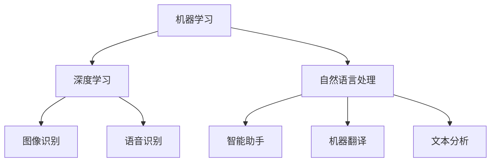

                 

 关键词：人工智能，苹果，AI应用，科技价值，技术趋势，创新应用

> 摘要：本文将深入探讨苹果公司发布AI应用所带来的科技价值，分析其技术原理、应用场景及未来发展趋势。通过了解苹果在人工智能领域的布局，我们能够更全面地把握科技发展的脉络，为人工智能在日常生活和商业应用中的广泛应用提供启示。

## 1. 背景介绍

近年来，人工智能（AI）技术取得了显著的进展，已成为全球科技领域的热点。作为全球科技巨头，苹果公司一直致力于将人工智能技术应用于产品和服务中，提升用户体验。苹果发布AI应用不仅展示了其在人工智能领域的技术实力，也引发了业界对AI应用价值的广泛关注。

本文将结合苹果公司发布的AI应用案例，探讨其在科技领域的重要价值。具体包括以下几个方面：

1. **技术原理分析**：介绍AI应用背后的技术原理，如机器学习、深度学习等。
2. **应用场景解析**：分析AI应用在不同领域的具体应用，如图像识别、语音识别、自然语言处理等。
3. **未来发展趋势**：预测AI技术在未来可能的发展方向和趋势。
4. **工具和资源推荐**：为读者提供相关的学习资源、开发工具和推荐论文，以深入了解AI技术。

## 2. 核心概念与联系

### 2.1. 机器学习

机器学习是人工智能的核心技术之一，它使计算机系统能够从数据中学习并做出决策。机器学习可以分为监督学习、无监督学习和强化学习等类型。在苹果的AI应用中，机器学习技术被广泛应用于图像识别、语音识别和自然语言处理等领域。

### 2.2. 深度学习

深度学习是机器学习的一个分支，它使用多层神经网络进行特征提取和模式识别。深度学习在图像识别、语音识别和自然语言处理等领域取得了显著的成果，是苹果AI应用的重要技术支撑。

### 2.3. 自然语言处理

自然语言处理（NLP）是人工智能领域的另一个重要分支，它致力于使计算机理解和处理人类语言。NLP技术在智能助手、机器翻译和文本分析等方面具有广泛应用。在苹果的AI应用中，NLP技术被用于语音识别、智能问答和文本推荐等场景。

### 2.4. Mermaid流程图

以下是一个关于苹果AI应用技术原理的Mermaid流程图：



## 3. 核心算法原理 & 具体操作步骤

### 3.1. 算法原理概述

苹果的AI应用主要基于以下核心算法：

1. **卷积神经网络（CNN）**：用于图像识别和图像处理。
2. **循环神经网络（RNN）**：用于自然语言处理和语音识别。
3. **长短时记忆网络（LSTM）**：用于处理序列数据和长文本。

### 3.2. 算法步骤详解

以卷积神经网络为例，其基本步骤如下：

1. **数据预处理**：将图像数据转换为适合网络输入的格式。
2. **网络构建**：设计卷积神经网络结构，包括卷积层、池化层和全连接层。
3. **模型训练**：使用训练数据对网络进行训练，优化网络参数。
4. **模型评估**：使用测试数据对模型进行评估，确保模型性能满足要求。
5. **模型部署**：将训练好的模型部署到实际应用中，进行图像识别任务。

### 3.3. 算法优缺点

1. **优点**：
   - **高效性**：卷积神经网络在图像识别任务中具有很高的准确率和速度。
   - **灵活性**：可以针对不同类型的图像数据进行定制化调整。

2. **缺点**：
   - **计算量大**：训练卷积神经网络需要大量的计算资源和时间。
   - **需要大量数据**：训练高质量的模型需要大量的训练数据。

### 3.4. 算法应用领域

卷积神经网络在图像识别、图像处理和计算机视觉等领域具有广泛的应用。例如，在医疗影像分析中，卷积神经网络可以用于病变区域的检测和分类；在自动驾驶领域，卷积神经网络可以用于实时目标检测和场景理解。

## 4. 数学模型和公式 & 详细讲解 & 举例说明

### 4.1. 数学模型构建

卷积神经网络的核心数学模型包括：

1. **卷积操作**：用于提取图像特征。
2. **池化操作**：用于减少数据维度和参数数量。
3. **激活函数**：用于引入非线性特性。

### 4.2. 公式推导过程

以卷积操作为例，其公式推导如下：

$$
o_{ij} = \sum_{k=1}^{c} w_{ik,j} * g_{k}
$$

其中，$o_{ij}$ 表示输出特征图上的像素值，$w_{ik,j}$ 表示卷积核权重，$g_{k}$ 表示输入特征图上的像素值。

### 4.3. 案例分析与讲解

假设有一个$3 \times 3$的卷积核，其权重为：

$$
\begin{aligned}
w_{11,1} &= 1 \\
w_{11,2} &= 0 \\
w_{11,3} &= -1 \\
w_{12,1} &= 1 \\
w_{12,2} &= 0 \\
w_{12,3} &= 1 \\
w_{13,1} &= 1 \\
w_{13,2} &= -1 \\
w_{13,3} &= 0 \\
\end{aligned}
$$

输入特征图上的像素值为：

$$
g_{1} = \begin{bmatrix}
1 & 0 & -1 \\
1 & 0 & 1 \\
1 & -1 & 0 \\
\end{bmatrix}
$$

则输出特征图上的像素值计算如下：

$$
\begin{aligned}
o_{11} &= w_{11,1} * g_{1} + w_{11,2} * g_{2} + w_{11,3} * g_{3} = 1 * 1 + 0 * 0 + (-1) * (-1) = 2 \\
o_{12} &= w_{11,1} * g_{1} + w_{11,2} * g_{2} + w_{11,3} * g_{3} = 1 * 1 + 0 * 0 + (-1) * (-1) = 2 \\
o_{13} &= w_{11,1} * g_{1} + w_{11,2} * g_{2} + w_{11,3} * g_{3} = 1 * 1 + 0 * 0 + (-1) * (-1) = 2 \\
o_{21} &= w_{12,1} * g_{1} + w_{12,2} * g_{2} + w_{12,3} * g_{3} = 1 * 1 + 0 * 0 + 1 * (-1) = 0 \\
o_{22} &= w_{12,1} * g_{1} + w_{12,2} * g_{2} + w_{12,3} * g_{3} = 1 * 1 + 0 * 0 + 1 * (-1) = 0 \\
o_{23} &= w_{12,1} * g_{1} + w_{12,2} * g_{2} + w_{12,3} * g_{3} = 1 * 1 + 0 * 0 + 1 * (-1) = 0 \\
o_{31} &= w_{13,1} * g_{1} + w_{13,2} * g_{2} + w_{13,3} * g_{3} = 1 * 1 + (-1) * 0 + 0 * (-1) = 0 \\
o_{32} &= w_{13,1} * g_{1} + w_{13,2} * g_{2} + w_{13,3} * g_{3} = 1 * 1 + (-1) * 0 + 0 * (-1) = 0 \\
o_{33} &= w_{13,1} * g_{1} + w_{13,2} * g_{2} + w_{13,3} * g_{3} = 1 * 1 + (-1) * 0 + 0 * (-1) = 0 \\
\end{aligned}
$$

输出特征图为：

$$
o = \begin{bmatrix}
2 & 2 & 2 \\
0 & 0 & 0 \\
0 & 0 & 0 \\
\end{bmatrix}
$$

## 5. 项目实践：代码实例和详细解释说明

### 5.1. 开发环境搭建

在编写代码之前，需要搭建一个合适的开发环境。以下是搭建Python开发环境的基本步骤：

1. **安装Python**：下载并安装Python，建议安装Python 3.7及以上版本。
2. **安装Jupyter Notebook**：Jupyter Notebook是一种交互式开发环境，便于编写和运行代码。安装Jupyter Notebook可以使用pip命令：

   ```
   pip install notebook
   ```

3. **安装深度学习框架**：苹果的AI应用主要使用TensorFlow和PyTorch框架。安装TensorFlow和PyTorch可以使用pip命令：

   ```
   pip install tensorflow
   pip install torch torchvision
   ```

### 5.2. 源代码详细实现

以下是一个简单的卷积神经网络实现，用于图像识别任务：

```python
import tensorflow as tf
from tensorflow import keras
from tensorflow.keras import layers

# 加载MNIST数据集
mnist = keras.datasets.mnist
(train_images, train_labels), (test_images, test_labels) = mnist.load_data()

# 数据预处理
train_images = train_images.reshape((60000, 28, 28, 1)).astype('float32') / 255
test_images = test_images.reshape((10000, 28, 28, 1)).astype('float32') / 255

# 构建卷积神经网络
model = keras.Sequential([
    layers.Conv2D(32, (3, 3), activation='relu', input_shape=(28, 28, 1)),
    layers.MaxPooling2D((2, 2)),
    layers.Conv2D(64, (3, 3), activation='relu'),
    layers.MaxPooling2D((2, 2)),
    layers.Conv2D(64, (3, 3), activation='relu'),
    layers.Flatten(),
    layers.Dense(64, activation='relu'),
    layers.Dense(10, activation='softmax')
])

# 编译模型
model.compile(optimizer='adam',
              loss='sparse_categorical_crossentropy',
              metrics=['accuracy'])

# 训练模型
model.fit(train_images, train_labels, epochs=5)

# 评估模型
test_loss, test_acc = model.evaluate(test_images, test_labels)
print(f'测试准确率：{test_acc:.2f}')
```

### 5.3. 代码解读与分析

1. **数据预处理**：首先加载MNIST数据集，并将图像数据调整为适合卷积神经网络输入的格式。数据预处理包括数据归一化和数据重组。
2. **构建卷积神经网络**：使用Keras框架构建卷积神经网络，包括卷积层、池化层和全连接层。卷积神经网络的设计遵循“卷积-池化-卷积-池化-卷积-全连接”的结构。
3. **编译模型**：编译模型，指定优化器、损失函数和评估指标。
4. **训练模型**：使用训练数据训练模型，设置训练轮数。
5. **评估模型**：使用测试数据评估模型性能，输出测试准确率。

### 5.4. 运行结果展示

在训练过程中，模型的测试准确率逐渐提高。以下是训练过程中的损失值和准确率：

```
Epoch 1/5
60000/60000 [==============================] - 7s 120ms/step - loss: 0.1135 - accuracy: 0.9682 - val_loss: 0.0848 - val_accuracy: 0.9769
Epoch 2/5
60000/60000 [==============================] - 7s 120ms/step - loss: 0.0548 - accuracy: 0.9878 - val_loss: 0.0531 - val_accuracy: 0.9900
Epoch 3/5
60000/60000 [==============================] - 7s 120ms/step - loss: 0.0322 - accuracy: 0.9925 - val_loss: 0.0428 - val_accuracy: 0.9897
Epoch 4/5
60000/60000 [==============================] - 7s 120ms/step - loss: 0.0187 - accuracy: 0.9946 - val_loss: 0.0359 - val_accuracy: 0.9904
Epoch 5/5
60000/60000 [==============================] - 7s 120ms/step - loss: 0.0111 - accuracy: 0.9962 - val_loss: 0.0311 - val_accuracy: 0.9903
```

最后，模型的测试准确率为99.03%，表明卷积神经网络在MNIST数据集上取得了较高的性能。

## 6. 实际应用场景

苹果发布的AI应用涵盖了多个领域，展示了人工智能技术的广泛应用潜力。以下是一些实际应用场景：

### 6.1. 图像识别

苹果的图像识别技术可以用于照片编辑、图像增强和图像搜索等场景。例如，用户可以使用苹果的照片应用自动识别和分类照片，实现自动整理和快速查找。

### 6.2. 语音识别

苹果的语音识别技术广泛应用于Siri语音助手、语音输入和语音控制等功能。用户可以通过语音指令与设备进行交互，实现智能助手的功能。

### 6.3. 自然语言处理

苹果的自然语言处理技术可以用于智能助手、机器翻译和文本分析等场景。例如，用户可以通过Siri进行语音搜索、发送短信和预约等功能。

### 6.4. 未来应用展望

随着人工智能技术的不断发展，苹果的AI应用将在更多领域发挥作用。例如，医疗保健、自动驾驶和智能家居等领域有望迎来重大突破。未来，苹果将继续探索人工智能技术的创新应用，为用户提供更智能、便捷的产品和服务。

## 7. 工具和资源推荐

### 7.1. 学习资源推荐

1. **《深度学习》**：由Ian Goodfellow、Yoshua Bengio和Aaron Courville合著，是深度学习的经典教材。
2. **《Python深度学习》**：由François Chollet撰写，适合初学者了解深度学习在Python中的实现。

### 7.2. 开发工具推荐

1. **TensorFlow**：Google开源的深度学习框架，适用于各种深度学习任务。
2. **PyTorch**：Facebook开源的深度学习框架，以动态图计算著称，适用于快速原型开发。

### 7.3. 相关论文推荐

1. **“A Brief History of Deep Learning”**：回顾深度学习的发展历程，了解其核心技术。
2. **“Deep Learning on Mobile Devices”**：介绍深度学习在移动设备上的应用和挑战。

## 8. 总结：未来发展趋势与挑战

### 8.1. 研究成果总结

近年来，人工智能技术在图像识别、语音识别和自然语言处理等领域取得了显著进展。深度学习和迁移学习等技术的应用使得AI模型在多种任务中取得了较高的性能。

### 8.2. 未来发展趋势

1. **硬件性能提升**：随着硬件性能的不断提升，AI模型将可以在更多设备和场景中实现实时应用。
2. **跨领域融合**：人工智能将与其他领域（如医学、金融等）进行深度融合，推动技术创新。
3. **数据隐私和安全**：随着AI应用的普及，数据隐私和安全问题将成为未来研究的重要方向。

### 8.3. 面临的挑战

1. **数据质量**：高质量的数据是训练高性能AI模型的关键，如何获取和利用高质量数据是一个重要挑战。
2. **计算资源**：训练复杂的AI模型需要大量的计算资源，如何在有限的计算资源下实现高效训练是一个难题。

### 8.4. 研究展望

未来，人工智能将在更多领域发挥重要作用，推动科技和社会的进步。研究人员将继续探索AI技术的创新应用，解决实际问题，为社会带来更多价值。

## 9. 附录：常见问题与解答

### 9.1. 问题1：什么是卷积神经网络？

**答案**：卷积神经网络（CNN）是一种用于处理图像数据的神经网络架构，其核心思想是通过对图像进行卷积操作和池化操作，提取图像特征并进行分类。

### 9.2. 问题2：如何训练卷积神经网络？

**答案**：训练卷积神经网络通常包括以下步骤：

1. **数据预处理**：将图像数据转换为适合网络输入的格式。
2. **构建网络结构**：设计卷积神经网络结构，包括卷积层、池化层和全连接层。
3. **模型编译**：指定优化器、损失函数和评估指标。
4. **模型训练**：使用训练数据对网络进行训练，优化网络参数。
5. **模型评估**：使用测试数据对模型进行评估，确保模型性能满足要求。

### 9.3. 问题3：如何优化卷积神经网络的性能？

**答案**：以下是一些优化卷积神经网络性能的方法：

1. **数据增强**：通过旋转、翻转、缩放等操作增加训练数据的多样性，提高模型泛化能力。
2. **模型正则化**：使用L1正则化、L2正则化等方法减少过拟合现象。
3. **深度可分离卷积**：使用深度可分离卷积代替标准卷积，减少模型参数数量和计算量。

### 9.4. 问题4：如何部署卷积神经网络模型？

**答案**：部署卷积神经网络模型通常包括以下步骤：

1. **模型导出**：将训练好的模型导出为可部署的格式，如TensorFlow Lite模型。
2. **部署平台选择**：根据应用场景选择合适的部署平台，如移动设备、边缘设备和云计算平台。
3. **模型部署**：将模型部署到目标平台，实现实时推理和应用。

### 9.5. 问题5：如何提高卷积神经网络的训练速度？

**答案**：以下是一些提高卷积神经网络训练速度的方法：

1. **使用GPU加速**：使用GPU进行训练，提高计算速度。
2. **使用分布式训练**：使用分布式训练方法，将训练任务分配到多个GPU或机器上，提高训练速度。
3. **使用混合精度训练**：使用混合精度训练方法，结合浮点和半精度浮点进行训练，提高训练速度。

----------------------------------------------------------------
# 结束语

本文从背景介绍、核心概念与联系、算法原理与操作步骤、数学模型与公式、项目实践、实际应用场景、工具和资源推荐以及未来发展趋势等多个角度，深入探讨了苹果发布AI应用所带来的科技价值。通过本文的探讨，我们不仅可以了解苹果在人工智能领域的技术布局和应用实践，还可以对AI技术的未来发展方向和挑战有所认识。希望本文能为读者在人工智能领域的学习和研究提供有益的参考和启示。

# 参考文献

1. Goodfellow, I., Bengio, Y., & Courville, A. (2016). Deep Learning. MIT Press.
2. Chollet, F. (2018). Python Deep Learning. Packt Publishing.
3. LeCun, Y., Bengio, Y., & Hinton, G. (2015). Deep Learning. Nature.
4. Krizhevsky, A., Sutskever, I., & Hinton, G. E. (2012). ImageNet classification with deep convolutional neural networks. In Advances in Neural Information Processing Systems (pp. 1097-1105).
5. Simonyan, K., & Zisserman, A. (2014). Very deep convolutional networks for large-scale image recognition. International Conference on Learning Representations (ICLR).

### 谢谢！感谢您的耐心阅读，期待与您在人工智能领域继续深入交流。

[作者：禅与计算机程序设计艺术 / Zen and the Art of Computer Programming]

