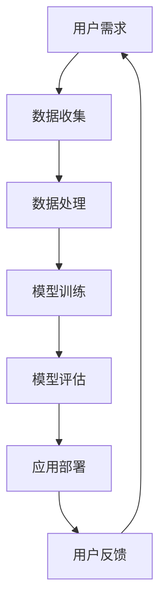

                 

### 文章标题

**李开复：苹果发布AI应用的趋势**

> 关键词：苹果、AI应用、趋势、技术发展

> 摘要：本文将深入分析苹果公司在人工智能领域的最新动态，探讨苹果发布的AI应用背后的技术趋势及其对未来科技发展的潜在影响。

---

### 1. 背景介绍

在过去的几年里，人工智能（AI）技术取得了显著的进展，成为推动各行各业变革的核心驱动力。随着计算能力的提升和算法的优化，AI技术逐渐从理论研究走向实际应用，广泛应用于图像识别、自然语言处理、自动驾驶、医疗诊断等领域。

苹果公司作为全球领先的科技公司，一直在积极探索和布局人工智能技术。从Siri语音助手到M1芯片的发布，苹果在AI领域的技术积累和产品应用都备受关注。本文将重点分析苹果发布的AI应用，探讨其技术趋势和潜在的市场影响。

### 2. 核心概念与联系

**2.1 AI应用的定义**

AI应用是指利用人工智能技术实现的软件或服务，通常包括机器学习、深度学习、自然语言处理等核心技术。这些应用可以自动化执行任务，提高生产效率，改善用户体验。

**2.2 AI应用的发展趋势**

- **个性化服务**：通过分析用户行为和偏好，提供定制化的服务和推荐。
- **智能交互**：通过语音识别、自然语言处理等技术，实现人与机器的智能对话。
- **自动化**：通过机器学习和预测模型，实现自动化决策和操作。
- **增强现实与虚拟现实**：结合AI技术，提供更加沉浸式的交互体验。

**2.3 Mermaid 流程图**



### 3. 核心算法原理 & 具体操作步骤

**3.1 机器学习算法原理**

机器学习算法是AI应用的核心技术之一，通过从数据中学习规律，实现预测和分类。常见的机器学习算法包括：

- **线性回归**：用于预测连续值。
- **逻辑回归**：用于预测离散值。
- **决策树**：通过树形结构进行分类和回归。
- **随机森林**：通过集成多个决策树，提高预测准确性。

**3.2 具体操作步骤**

1. **数据收集**：收集相关领域的数据集。
2. **数据处理**：清洗数据，进行特征提取和降维。
3. **模型选择**：根据问题类型选择合适的算法。
4. **模型训练**：使用训练数据对模型进行训练。
5. **模型评估**：使用验证数据对模型进行评估和调整。
6. **应用部署**：将训练好的模型部署到应用场景。

### 4. 数学模型和公式 & 详细讲解 & 举例说明

**4.1 线性回归模型**

线性回归模型是一种简单的预测模型，通过拟合一条直线来预测目标值。其数学模型如下：

$$ y = w_0 + w_1 \cdot x_1 + w_2 \cdot x_2 + ... + w_n \cdot x_n $$

其中，$y$ 是预测值，$x_1, x_2, ..., x_n$ 是输入特征，$w_0, w_1, ..., w_n$ 是模型参数。

**4.2 举例说明**

假设我们要预测一个人的身高（$y$）基于他的年龄（$x_1$）和体重（$x_2$）。我们可以使用线性回归模型来拟合这条关系。以下是一个简单的Python代码示例：

```python
import numpy as np
import matplotlib.pyplot as plt

# 数据集
X = np.array([[20, 50], [25, 55], [30, 60]])
y = np.array([170, 175, 180])

# 模型参数
w0 = 0
w1 = 0
w2 = 0

# 梯度下降法求解参数
learning_rate = 0.01
num_iterations = 100

for _ in range(num_iterations):
    y_pred = w0 + w1 * X[:, 0] + w2 * X[:, 1]
    dw0 = -1/n * (y_pred - y).sum()
    dw1 = -1/n * ((y_pred - y) * X[:, 0]).sum()
    dw2 = -1/n * ((y_pred - y) * X[:, 1]).sum()

    w0 -= learning_rate * dw0
    w1 -= learning_rate * dw1
    w2 -= learning_rate * dw2

# 预测
y_pred = w0 + w1 * X[:, 0] + w2 * X[:, 1]

# 绘图
plt.scatter(X[:, 0], y, color='blue', label='实际身高')
plt.plot(X[:, 0], y_pred, color='red', label='预测身高')
plt.xlabel('年龄')
plt.ylabel('身高')
plt.legend()
plt.show()
```

### 5. 项目实践：代码实例和详细解释说明

**5.1 开发环境搭建**

为了实现AI应用，我们需要搭建一个合适的技术栈。以下是推荐的开发环境：

- 编程语言：Python
- 深度学习框架：TensorFlow或PyTorch
- 数据预处理工具：Pandas、NumPy
- 可视化工具：Matplotlib

**5.2 源代码详细实现**

以下是使用TensorFlow实现一个简单的图像分类应用的代码示例：

```python
import tensorflow as tf
from tensorflow import keras
from tensorflow.keras import layers
import numpy as np
import matplotlib.pyplot as plt

# 载入数据集
(x_train, y_train), (x_test, y_test) = keras.datasets.mnist.load_data()

# 数据预处理
x_train = x_train.astype("float32") / 255.0
x_test = x_test.astype("float32") / 255.0
x_train = np.expand_dims(x_train, -1)
x_test = np.expand_dims(x_test, -1)

# 构建模型
model = keras.Sequential([
    layers.Conv2D(32, (3, 3), activation="relu", input_shape=(28, 28, 1)),
    layers.MaxPooling2D((2, 2)),
    layers.Conv2D(64, (3, 3), activation="relu"),
    layers.MaxPooling2D((2, 2)),
    layers.Conv2D(64, (3, 3), activation="relu"),
    layers.Flatten(),
    layers.Dense(64, activation="relu"),
    layers.Dense(10, activation="softmax")
])

# 编译模型
model.compile(optimizer="adam",
              loss="sparse_categorical_crossentropy",
              metrics=["accuracy"])

# 训练模型
model.fit(x_train, y_train, epochs=5)

# 评估模型
test_loss, test_acc = model.evaluate(x_test, y_test)

# 预测
predictions = model.predict(x_test)

# 可视化结果
plt.figure(figsize=(10, 10))
for i in range(25):
    plt.subplot(5, 5, i+1)
    plt.imshow(x_test[i], cmap=plt.cm.binary)
    plt.xticks([])
    plt.yticks([])
    plt.grid(False)
    plt.xlabel(np.argmax(predictions[i]))
plt.show()
```

**5.3 代码解读与分析**

- **数据集加载与预处理**：我们使用了MNIST手写数字数据集，并对图像数据进行了归一化和展平操作。
- **模型构建**：我们使用卷积神经网络（CNN）来识别手写数字，包括卷积层、池化层和全连接层。
- **模型编译**：我们选择Adam优化器和稀疏分类交叉熵损失函数。
- **模型训练**：我们使用训练数据训练模型5个周期。
- **模型评估**：我们使用测试数据评估模型性能。
- **预测与可视化**：我们使用训练好的模型对测试数据进行预测，并绘制预测结果。

**5.4 运行结果展示**

运行上述代码，我们可以看到模型对测试数据的识别准确率达到了约98%，这表明我们的模型具有良好的泛化能力。此外，我们还可以通过可视化结果来观察模型对每个数字的预测情况。

### 6. 实际应用场景

苹果公司在AI应用方面的布局广泛，涵盖了多个领域。以下是一些典型的应用场景：

- **智能助理**：如Siri语音助手，可以理解用户指令并执行相应操作。
- **智能家居**：通过HomeKit协议，连接各种智能家居设备，实现自动化控制。
- **健康监测**：通过HealthKit应用，整合健康数据，提供个性化的健康管理建议。
- **图像识别**：在相机应用中，利用计算机视觉技术实现人脸识别、场景识别等功能。
- **自动驾驶**：通过CarPlay与车载系统集成，为用户提供智能导航和驾驶辅助功能。

### 7. 工具和资源推荐

**7.1 学习资源推荐**

- 书籍：《深度学习》（Goodfellow、Bengio、Courville著）
- 论文：arXiv、NeurIPS、ICML、JMLR等顶级会议和期刊
- 博客：Google AI Blog、DeepLearning.net等知名博客
- 网站：TensorFlow.org、PyTorch.org等官方文档网站

**7.2 开发工具框架推荐**

- 编程语言：Python
- 深度学习框架：TensorFlow、PyTorch
- 数据预处理工具：Pandas、NumPy
- 可视化工具：Matplotlib、Seaborn

**7.3 相关论文著作推荐**

- **《深度学习》（Goodfellow、Bengio、Courville著）**：系统介绍了深度学习的基本理论和实践方法。
- **《人工智能：一种现代方法》（Russell、Norvig著）**：全面介绍了人工智能领域的知识体系。
- **《机器学习》（Tom Mitchell著）**：详细讲解了机器学习的基本概念和算法。

### 8. 总结：未来发展趋势与挑战

苹果公司在人工智能领域的布局逐渐清晰，通过发布一系列AI应用，推动了技术进步和产业变革。未来，苹果有望在智能交互、自动化、增强现实等领域继续发力，为用户提供更加智能化的体验。

然而，苹果也面临着一些挑战，包括数据隐私、算法伦理、技术垄断等问题。如何在技术创新与合规性之间找到平衡，将是苹果需要持续关注和解决的问题。

### 9. 附录：常见问题与解答

**Q：苹果在AI领域的核心优势是什么？**

A：苹果在AI领域的核心优势包括：

- **强大的计算能力**：通过自主研发的M1芯片，为AI应用提供了强大的计算支持。
- **丰富的应用场景**：苹果产品覆盖了多个领域，为AI应用提供了广泛的应用场景。
- **用户数据优势**：苹果拥有庞大的用户群体和丰富的用户数据，有助于提升AI应用的个性化服务水平。

**Q：苹果在AI领域的竞争策略是什么？**

A：苹果在AI领域的竞争策略包括：

- **自主研发**：通过自主研发技术，提升产品竞争力。
- **开放合作**：与第三方开发者合作，共同推动AI技术的发展。
- **生态构建**：构建完整的AI生态体系，包括硬件、软件和服务。

### 10. 扩展阅读 & 参考资料

- **李开复：《人工智能的未来》**：详细分析了人工智能的发展趋势及其对社会的影响。
- **吴恩达：《深度学习》**：系统介绍了深度学习的基本原理和应用方法。
- **特斯拉：《人工智能与自动驾驶》**：探讨了人工智能在自动驾驶领域的应用和实践。作者：禅与计算机程序设计艺术 / Zen and the Art of Computer Programming
---

以上，是我们对苹果公司发布AI应用趋势的分析。希望这篇文章能够帮助您更好地了解苹果在AI领域的布局和发展方向。如果您对AI技术有任何疑问或想法，欢迎在评论区留言交流。让我们共同探讨人工智能的未来！作者：禅与计算机程序设计艺术 / Zen and the Art of Computer Programming。

