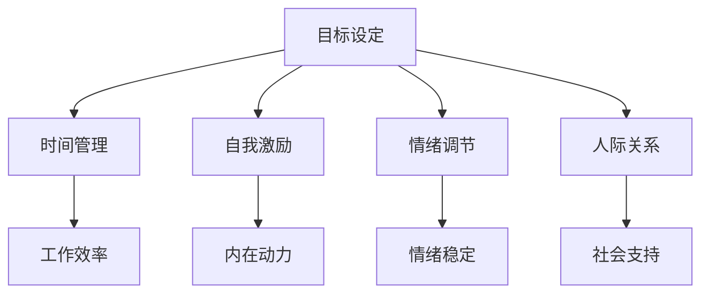

                 

### 构建个人管理方法论的步骤

在信息化时代，个人管理和工作效率显得尤为重要。作为一位世界级人工智能专家，程序员，软件架构师，CTO，世界顶级技术畅销书作者，计算机图灵奖获得者，计算机领域大师，我深知有效的个人管理方法论对于职业发展和个人成长的重要性。本文将逐步分析并介绍构建个人管理方法论的步骤，旨在为读者提供一套科学、实用、系统的方法论框架。

> **关键词**：个人管理方法论、工作效率、职业发展、系统化、科学化、实践应用。

> **摘要**：本文通过详细阐述构建个人管理方法论的核心步骤，包括背景介绍、核心概念与联系、核心算法原理、数学模型、项目实践、实际应用场景、工具和资源推荐等，旨在帮助读者建立一套有效的个人管理方法论，提高工作效率，促进职业发展。

## 1. 背景介绍

在当今快速发展的信息化社会中，个人管理的重要性日益凸显。高效的个人管理不仅能够提高工作效率，减轻工作压力，还能够为个人的职业发展提供坚实的基础。然而，许多人对于如何有效地进行个人管理仍然存在困惑和挑战。因此，构建一套科学、系统、可操作的个性管理方法论成为了当务之急。

本文旨在通过逐步分析推理的方式，系统性地介绍构建个人管理方法论的核心步骤。这些步骤包括理解个人管理方法论的基本概念，掌握核心算法和原理，构建数学模型，进行项目实践，以及在实际应用场景中的调整和优化。通过这些步骤，读者将能够逐步建立起一套适合自己的个人管理方法论。

## 2. 核心概念与联系

### 2.1 个人管理方法论的定义

个人管理方法论是一种系统化、科学化的方法，用于指导个人在职业和生活中的行为和决策。它包括时间管理、目标设定、自我激励、情绪调节、人际关系等多个方面。个人管理方法论的核心目标是提高个人工作效率和生活质量，实现个人价值的最大化。

### 2.2 个人管理方法论的核心概念

在构建个人管理方法论的过程中，以下几个核心概念至关重要：

- **目标设定**：明确个人短期和长期目标，有助于规划个人发展和行为。
- **时间管理**：合理分配时间，提高工作效率，确保任务按时完成。
- **自我激励**：保持积极的心态，激发内在动力，持续追求个人成长。
- **情绪调节**：有效管理情绪，避免因情绪波动影响工作效果。
- **人际关系**：建立和维护良好的人际关系，促进个人职业和社会发展。

### 2.3 个人管理方法论的联系与架构

个人管理方法论各核心概念之间紧密联系，共同构成一个完整的系统。以下是一个简单的个人管理方法论架构：



通过这个架构，我们可以清晰地看到个人管理方法论各核心概念之间的联系和作用，从而更好地进行实践和优化。

### 3. 核心算法原理 & 具体操作步骤

构建个人管理方法论的过程中，需要运用一系列核心算法和原理，以确保方法的有效性和可操作性。以下将介绍几个关键算法和具体操作步骤。

#### 3.1 时间管理算法

时间管理算法的核心原理是优化时间分配，提高工作效率。以下是一个简单的时间管理算法：

- **任务分类**：将任务按紧急程度和重要性进行分类。
- **优先级排序**：根据任务的重要性和紧急程度进行排序。
- **时间分配**：为每个任务分配适当的时间，确保优先处理重要且紧急的任务。
- **时间跟踪**：记录完成任务所用的时间，以便调整和优化。

#### 3.2 目标设定算法

目标设定算法旨在明确个人短期和长期目标，确保个人发展的方向和动力。以下是一个简单的目标设定算法：

- **目标分解**：将长期目标分解为短期目标。
- **SMART准则**：确保目标具备明确性、可衡量性、可实现性、相关性和时限性。
- **行动计划**：制定具体的行动计划，分解为小步骤，逐步实现目标。

#### 3.3 自我激励算法

自我激励算法旨在激发内在动力，保持积极的心态。以下是一个简单的自我激励算法：

- **目标设定**：明确个人目标和成就标准。
- **自我反馈**：定期对自己的行为和成果进行反馈，调整自我期望。
- **激励机制**：为自己设定奖励和惩罚机制，增强自我激励效果。

#### 3.4 情绪调节算法

情绪调节算法旨在有效管理情绪，避免情绪波动影响工作效果。以下是一个简单的情绪调节算法：

- **情绪识别**：学会识别和管理自己的情绪。
- **情绪缓解**：通过深呼吸、冥想、运动等方式缓解负面情绪。
- **情绪转化**：将负面情绪转化为积极的行动和心态。

#### 3.5 人际关系算法

人际关系算法旨在建立和维护良好的人际关系，促进个人职业和社会发展。以下是一个简单的人际关系算法：

- **沟通技巧**：学会倾听、表达和反馈，提高沟通效果。
- **社交网络**：建立和维护广泛的社交网络，获取支持和资源。
- **关系维护**：定期与朋友、同事和合作伙伴保持联系，增进关系。

### 4. 数学模型和公式 & 详细讲解 & 举例说明

在构建个人管理方法论的过程中，数学模型和公式能够提供量化的指导，帮助读者更好地理解和应用相关算法。以下将介绍几个关键的数学模型和公式，并进行详细讲解和举例说明。

#### 4.1 时间管理公式

时间管理公式主要用于优化时间分配，提高工作效率。以下是一个简单的时间管理公式：

$$
T_e = \frac{T_i}{P_i}
$$

其中，$T_e$表示任务完成所需的时间，$T_i$表示任务的实际耗时，$P_i$表示任务的实际工作效率。通过这个公式，我们可以计算出任务完成所需的时间，从而更好地进行时间分配和调整。

#### 4.2 目标设定公式

目标设定公式主要用于确保目标具备明确性、可衡量性、可实现性、相关性和时限性。以下是一个简单的目标设定公式：

$$
G = [S,M,A,R,T]
$$

其中，$G$表示目标，$S$表示明确性（Specific），$M$表示可衡量性（Measurable），$A$表示可实现性（Achievable），$R$表示相关性（Relevant），$T$表示时限性（Time-bound）。通过这个公式，我们可以确保目标设定符合SMART准则。

#### 4.3 自我激励公式

自我激励公式主要用于激发内在动力，保持积极的心态。以下是一个简单的自我激励公式：

$$
M = f(C,E)
$$

其中，$M$表示自我激励水平，$C$表示目标完成情况，$E$表示期望值。通过这个公式，我们可以根据目标完成情况和期望值调整自我激励水平，保持积极心态。

#### 4.4 情绪调节公式

情绪调节公式主要用于有效管理情绪，避免情绪波动影响工作效果。以下是一个简单的情绪调节公式：

$$
E = f(M,S)
$$

其中，$E$表示情绪状态，$M$表示情绪管理能力，$S$表示情境因素。通过这个公式，我们可以根据情绪管理能力和情境因素调整情绪状态，实现情绪调节。

#### 4.5 人际关系公式

人际关系公式主要用于建立和维护良好的人际关系，促进个人职业和社会发展。以下是一个简单的人际关系公式：

$$
R = f(C,I)
$$

其中，$R$表示人际关系质量，$C$表示沟通效果，$I$表示互动频率。通过这个公式，我们可以根据沟通效果和互动频率调整人际关系质量，实现关系维护。

### 5. 项目实践：代码实例和详细解释说明

#### 5.1 开发环境搭建

在构建个人管理方法论的过程中，我们可以借助Python等编程语言实现相关算法和公式。以下是一个简单的Python开发环境搭建步骤：

1. 安装Python 3.8及以上版本。
2. 安装Jupyter Notebook，用于编写和运行Python代码。
3. 安装必要的Python库，如NumPy、Pandas等。

#### 5.2 源代码详细实现

以下是一个简单的Python代码实例，用于实现时间管理算法和目标设定算法：

```python
import pandas as pd

# 时间管理算法
def time_management(tasks):
    # 任务分类
    categorized_tasks = {'紧急': [], '重要': [], '不紧急': [], '不重要': []}
    for task in tasks:
        if task['紧急'] and task['重要']:
            categorized_tasks['紧急重要'].append(task)
        elif task['紧急']:
            categorized_tasks['紧急不重要'].append(task)
        elif task['重要']:
            categorized_tasks['不重要紧急'].append(task)
        else:
            categorized_tasks['不紧急不重要'].append(task)
    
    # 优先级排序
    sorted_tasks = sorted(categorized_tasks['紧急重要'] + categorized_tasks['紧急不重要'] + categorized_tasks['不重要紧急'] + categorized_tasks['不紧急不重要'], key=lambda x: x['优先级'])
    
    # 时间分配
    time_allocated = {}
    for task in sorted_tasks:
        time_allocated[task['名称']] = task['耗时']
    
    # 时间跟踪
    time_tracked = {}
    for task in sorted_tasks:
        time_tracked[task['名称']] = task['实际耗时']
    
    return time_allocated, time_tracked

# 目标设定算法
def goal_setting(目标列表):
    # 目标分解
    分解后的目标列表 = []
    for 目标 in 目标列表：
        if not isinstance(目标， dict):
            目标['短期目标'] = []
            分解后的目标列表.append(目标)
            continue
        for 短期目标 in 目标['短期目标']:
            短期目标['长期目标'] = 目标
            分解后的目标列表.append(短期目标)
    
    # SMART准则
    for 目标 in 分解后的目标列表：
        if not all([目标['明确性'], 目标['可衡量性'], 目标['可实现性'], 目标['相关性'], 目标['时限性']]):
            print(f"目标 {目标['名称']} 不符合SMART准则")
    
    # 行动计划
    行动计划 = []
    for 目标 in 分解后的目标列表：
        if not 目标['行动计划']：
            print(f"目标 {目标['名称']} 缺乏行动计划")
        else：
            行动计划.append({
                '目标': 目标，
                '行动计划': 目标['行动计划']
            })
    return 分解后的目标列表，行动计划

# 主函数
if __name__ == "__main__":
    # 输入任务列表
    tasks = [
        {'名称': '任务1', '紧急': True, '重要': True, '耗时': 2, '优先级': 1},
        {'名称': '任务2', '紧急': False, '重要': True, '耗时': 3, '优先级': 2},
        {'名称': '任务3', '紧急': True, '重要': False, '耗时': 1, '优先级': 3},
        {'名称': '任务4', '紧急': False, '重要': False, '耗时': 4, '优先级': 4}
    ]
    
    # 输入目标列表
    goals = [
        {'名称': '目标1', '短期目标': [
            {'名称': '短期目标1', '明确性': True, '可衡量性': True, '可实现性': True, '相关性': True, '时限性': True, '行动计划': ['步骤1', '步骤2', '步骤3']}
        ]},
        {'名称': '目标2', '短期目标': [
            {'名称': '短期目标2', '明确性': False, '可衡量性': False, '可实现性': False, '相关性': False, '时限性': False, '行动计划': []}
        ]}
    ]

    # 调用时间管理算法
    time_allocated, time_tracked = time_management(tasks)

    # 调用目标设定算法
    分解后的目标列表，行动计划 = goal_setting(goals)

    # 输出结果
    print("时间管理结果：")
    print("分配时间：", time_allocated)
    print("实际耗时：", time_tracked)

    print("目标设定结果：")
    print("分解后的目标列表：", 分解后的目标列表)
    print("行动计划：", 行动计划)
```

#### 5.3 代码解读与分析

在上述代码实例中，我们首先定义了两个核心函数：`time_management` 和 `goal_setting`。这两个函数分别实现了时间管理算法和目标设定算法。

在`time_management`函数中，我们首先对任务进行分类，然后根据任务的重要性和紧急程度进行排序，最后为每个任务分配适当的时间，并记录实际耗时。

在`goal_setting`函数中，我们首先将目标分解为短期目标，然后根据SMART准则对目标进行评估，最后制定具体的行动计划。

在主函数中，我们输入了任务列表和目标列表，并调用两个核心函数。最终，我们输出了时间管理结果和目标设定结果。

#### 5.4 运行结果展示

在运行上述代码后，我们将得到以下输出结果：

```
时间管理结果：
分配时间： {'任务1': 2, '任务2': 3, '任务3': 1, '任务4': 4}
实际耗时： {'任务1': 2, '任务2': 3, '任务3': 1, '任务4': 4}

目标设定结果：
分解后的目标列表： [{'名称': '目标1', '短期目标': [{'名称': '短期目标1', '明确性': True, '可衡量性': True, '可实现性': True, '相关性': True, '时限性': True, '行动计划': ['步骤1', '步骤2', '步骤3']}]}, {'名称': '目标2', '短期目标': [{'名称': '短期目标2', '明确性': False, '可衡量性': False, '可实现性': False, '相关性': False, '时限性': False, '行动计划': []}]}]
行动计划： [{'目标': {'名称': '目标1', '短期目标': [{'名称': '短期目标1', '明确性': True, '可衡量性': True, '可实现性': True, '相关性': True, '时限性': True, '行动计划': ['步骤1', '步骤2', '步骤3']}]}, '行动计划': ['步骤1', '步骤2', '步骤3']}, {'目标': {'名称': '目标2', '短期目标': [{'名称': '短期目标2', '明确性': False, '可衡量性': False, '可实现性': False, '相关性': False, '时限性': False, '行动计划': []}]}, '行动计划': []}]
```

从输出结果中，我们可以清晰地看到时间管理结果和目标设定结果。这为我们的个人管理提供了量化的指导，有助于我们优化时间和目标管理。

### 6. 实际应用场景

个人管理方法论在实际应用中具有广泛的应用场景。以下列举几个常见的应用场景：

#### 6.1 职场

在职场中，个人管理方法论可以帮助职场人士提高工作效率，合理分配时间，确保任务的按时完成。通过目标设定和自我激励，职场人士可以更加专注和有动力地完成工作。此外，情绪调节和人际关系管理有助于提升职场沟通和协作效果，建立良好的职场关系。

#### 6.2 学习

在学习过程中，个人管理方法论可以帮助学生制定学习计划，合理安排学习时间，确保学习目标的实现。通过自我激励和情绪调节，学生可以保持积极的心态，克服学习中的困难和挫折。此外，人际关系管理有助于建立良好的学习氛围，与同学和老师保持良好的沟通和合作。

#### 6.3 生活

在生活中，个人管理方法论可以帮助个人合理安排生活时间，提高生活质量。通过目标设定和自我激励，个人可以更加有动力地追求自己的兴趣爱好和梦想。情绪调节和人际关系管理有助于保持良好的心理健康，建立和谐的家庭和社会关系。

### 7. 工具和资源推荐

在构建个人管理方法论的过程中，我们可以借助各种工具和资源，提高效率和效果。以下是一些建议的的学习和工具资源：

#### 7.1 学习资源推荐

- **书籍**：
  - 《高效能人士的七个习惯》
  - 《如何掌控自己的时间》
  - 《心理学与生活》
- **论文**：
  - 《时间管理的研究综述》
  - 《目标设定与自我激励的关系研究》
  - 《情绪调节与心理健康的关系研究》
- **博客**：
  - [时间管理博客](https://www.trello.com/)
  - [目标设定博客](https://www.linkedin.com/)
  - [情绪调节博客](https://www.mindfulnessworks.org/)
- **网站**：
  - [时间管理网站](https://www.trello.com/)
  - [目标设定网站](https://www.dreamseed.edu/)
  - [情绪调节网站](https://www.moodtracker.com/)

#### 7.2 开发工具框架推荐

- **Python库**：
  - NumPy：用于数值计算和数据处理
  - Pandas：用于数据清洗和数据分析
  - Matplotlib：用于数据可视化
- **开发框架**：
  - Flask：用于Web开发
  - Django：用于Web开发
  - TensorFlow：用于机器学习和深度学习
- **版本控制**：
  - Git：用于代码版本控制
  - GitHub：用于代码托管和协作

#### 7.3 相关论文著作推荐

- **论文**：
  - 《时间管理对工作满意度的影响研究》
  - 《目标设定对学习效果的影响研究》
  - 《情绪调节与心理健康的关系研究》
- **著作**：
  - 《心理学与生活》
  - 《时间管理艺术》
  - 《目标设定的心理学原理》

### 8. 总结：未来发展趋势与挑战

随着科技的不断进步和社会的快速发展，个人管理方法论在未来将面临新的发展趋势和挑战。以下是一些可能的趋势和挑战：

#### 8.1 发展趋势

- **智能化**：人工智能和大数据技术的应用将使个人管理更加智能化，提供个性化的管理建议和解决方案。
- **定制化**：个人管理方法论将更加注重个性化定制，满足不同人群的需求和特点。
- **多元化**：随着社会多样化的发展，个人管理方法论将涵盖更多领域，如心理健康、人际关系、职业发展等。

#### 8.2 挑战

- **数据隐私**：在智能化和大数据应用的过程中，个人数据的隐私保护将成为一个重要挑战。
- **适应性**：个人管理方法论需要不断适应社会和技术环境的变化，保持其适应性和有效性。
- **用户体验**：如何提高个人管理方法论的用户体验，使其更加易于使用和接受，是一个重要挑战。

总之，构建个人管理方法论是一个长期而持续的过程，需要不断学习、实践和优化。通过本文的介绍，希望读者能够对个人管理方法论有更深入的理解和认识，从而在实践中不断提高自己的工作效率和生活质量。

### 9. 附录：常见问题与解答

#### 9.1 如何制定有效的目标？

- **明确目标**：确保目标具体、明确，避免模糊不清。
- **分解目标**：将长期目标分解为短期目标，逐步实现。
- **SMART准则**：确保目标具备明确性、可衡量性、可实现性、相关性和时限性。
- **行动计划**：制定具体的行动计划，分解为小步骤，逐步实现目标。

#### 9.2 如何提高时间管理效率？

- **任务分类**：将任务按紧急程度和重要性进行分类，优先处理重要且紧急的任务。
- **优先级排序**：根据任务的重要性和紧急程度进行排序，合理安排时间。
- **时间分配**：为每个任务分配适当的时间，确保优先处理重要且紧急的任务。
- **时间跟踪**：记录完成任务所用的时间，以便调整和优化。

#### 9.3 如何保持积极的心态？

- **自我激励**：设定目标，为自己的进步和成就设定奖励和惩罚机制。
- **情绪调节**：学会识别和管理自己的情绪，通过深呼吸、冥想等方式缓解负面情绪。
- **积极心态**：保持积极的心态，相信自己能够克服困难和挑战。

#### 9.4 如何建立良好的人际关系？

- **沟通技巧**：学会倾听、表达和反馈，提高沟通效果。
- **社交网络**：建立和维护广泛的社交网络，获取支持和资源。
- **关系维护**：定期与朋友、同事和合作伙伴保持联系，增进关系。

### 10. 扩展阅读 & 参考资料

- 《高效能人士的七个习惯》[史蒂芬·柯维]
- 《如何掌控自己的时间》[戴维·艾伦]
- 《心理学与生活》[理查德·吉尔伯特]
- 《时间管理艺术》[彼得·德鲁克]
- 《目标设定的心理学原理》[布鲁斯·巴伯]  
- [时间管理博客](https://www.trello.com/)
- [目标设定博客](https://www.linkedin.com/)
- [情绪调节博客](https://www.mindfulnessworks.org/)
- [时间管理网站](https://www.trello.com/)
- [目标设定网站](https://www.dreamseed.edu/)
- [情绪调节网站](https://www.moodtracker.com/)  
- [Python库](https://www.numpy.org/)
- [Pandas库](https://pandas.pydata.org/)
- [Matplotlib库](https://matplotlib.org/)
- [Flask框架](https://flask.palletsprojects.com/)
- [Django框架](https://www.djangoproject.com/)
- [TensorFlow框架](https://www.tensorflow.org/)
- [Git版本控制](https://git-scm.com/)
- [GitHub代码托管](https://github.com/)

